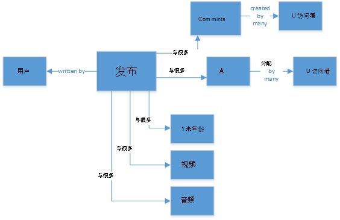
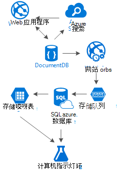

<properties 
    pageTitle="DocumentDB 的设计模式︰ 社交媒体应用程序 |Microsoft Azure" 
    description="了解设计模式对于社交网络通过利用 DocumentDB 和其他 Azure 服务存储的灵活性。" 
    keywords="社交媒体应用程序"
    services="documentdb" 
    authors="ealsur" 
    manager="jhubbard" 
    editor="" 
    documentationCenter=""/>

<tags 
    ms.service="documentdb" 
    ms.workload="data-services" 
    ms.tgt_pltfrm="na" 
    ms.devlang="na" 
    ms.topic="article" 
    ms.date="09/27/2016" 
    ms.author="mimig"/>

# 将 DocumentDB 与社会

生活在一个整体相互关联的社会意味着，在现实生活中的某些时候，您将成为**社交网络**的一部分。 我们使用社交网络保持联系的朋友、 同事、 家人，或有时与共同的兴趣爱好与人共享我们的动力。

为工程师或开发人员，我们可能曾疑惑如何这些网络存储和互连数据，或可能有甚至已担负任务以创建或自己构建特定利基市场的一个新的社交网络。 这就是当出现大的问题︰ 所有这些数据的存储方式？

让我们假设我们正在创建新的和有光泽的社交网络，在我们的用户可以投递文章相关的媒体，如照片、 视频或甚至音乐。 用户可以对帖子发表评论和评级让点。 将有源的用户将看到的帖子能主要网站的登陆页面上进行交互。 这听起来并不非常复杂 （一开始），但为了简单起见，让我们停止存在 （我们无法深入了解自定义用户供给影响的关系，但它超出了本文的目的）。

因此，我们如何存储此以及在何处？

许多人可能在 SQL 数据库上具有经验或至少有[关系的数据建模](https://en.wikipedia.org/wiki/Relational_model)的概念，您可能试图以开始绘制如下所示︰

 

一种完全正常化和漂亮数据结构... 不可扩展。 

别让我打开我遇到 SQL 数据库与所有我的生活，他们是不错，但像每一种模式、 做法和软件平台，它并不完美，每个方案的问题。

为什么没有 SQL 在这种情况下的最佳选择？ 让我们看一下单张贴内容的结构，如果我想要显示该张贴内容的网站或应用程序中需要执行的查询... 8 表联接 （！） 只是显示一个单一开机自检，现在，流的动态地加载和屏幕上显示的公告可能会看到在我的图片。

我们可以当然，使用 humongous 的 SQL 实例具有足够的能力解决上千个查询使用联接来满足我们的内容，但是真正，为什么我们更简单的解决方案存在时这些多吗？

## NoSQL 道路

可以[在 Azure 上运行](http://neo4j.com/developer/guide-cloud-deployment/#_windows_azure)的特殊图形数据库，但它们不是成本较低并且需要服务 IaaS (基础设施作为服务、 虚拟机主要) 和维护。 我大多数情况下，在 Azure 的 NoSQL 数据库[DocumentDB](https://azure.microsoft.com/services/documentdb/)上运行的目标起一个低成本解决方案在这篇文章。 使用[NoSQL](https://en.wikipedia.org/wiki/NoSQL)方法，以 JSON 格式存储数据，并应用[非规范化](https://en.wikipedia.org/wiki/Denormalization)，我们以前复杂的帖子可以转换为单个[文档](https://en.wikipedia.org/wiki/Document-oriented_database)︰

    {
        "id":"ew12-res2-234e-544f",
        "title":"post title",
        "date":"2016-01-01",
        "body":"this is an awesome post stored on NoSQL",
        "createdBy":User,
        "images":["http://myfirstimage.png","http://mysecondimage.png"],
        "videos":[
            {"url":"http://myfirstvideo.mp4", "title":"The first video"},
            {"url":"http://mysecondvideo.mp4", "title":"The second video"}
        ],
        "audios":[
            {"url":"http://myfirstaudio.mp3", "title":"The first audio"},
            {"url":"http://mysecondaudio.mp3", "title":"The second audio"}
        ]
    }

并使用一个查询，并使用任何联接可获得。 这是更简单明了，并，budget-wise，它需要更少的资源实现更好的效果。

Azure DocumentDB 可确保所有属性进行索引使用其[自动索引](documentdb-indexing.md)，它甚至可以进行[自定义](documentdb-indexing-policies.md)。 无架构的方法，我们对于不同和动态结构，也许明天我们希望帖子有类别或 hashtags 与它们相关联的列表中存储的文档可以，DocumentDB 将与我们所需任何额外的工作来处理带有添加的属性的新文档。

在公告的注释可以视为与父属性 （这样可以简化我们对象映射） 只是其他帖子。 

    {
        "id":"1234-asd3-54ts-199a",
        "title":"Awesome post!",
        "date":"2016-01-02",
        "createdBy":User2,
        "parent":"ew12-res2-234e-544f"
    }

    {
        "id":"asd2-fee4-23gc-jh67",
        "title":"Ditto!",
        "date":"2016-01-03",
        "createdBy":User3,
        "parent":"ew12-res2-234e-544f"
    }

和所有的社会交往可以存储在一个单独的对象为计数器︰

    {
        "id":"dfe3-thf5-232s-dse4",
        "post":"ew12-res2-234e-544f",
        "comments":2,
        "likes":10,
        "points":200
    }

创建源是只需创建文档可包含与给定的关联订单发布 id 的列表︰

    [
        {"relevance":9, "post":"ew12-res2-234e-544f"},
        {"relevance":8, "post":"fer7-mnb6-fgh9-2344"},
        {"relevance":7, "post":"w34r-qeg6-ref6-8565"}
    ]

我们可能有张贴内容按创建日期排列的"最新"流、 与这些发布的"最热门"流，更喜欢在过去 24 小时中，甚至，我们可能实现像用户和感兴趣的逻辑上基于每个用户的自定义流和它仍然是一份公告。 它就是如何构建这些列表，但其读取性能始终阻碍。 一旦我们获得其中一个列表，我们发出一个查询到 DocumentDB 使用[运算符中](documentdb-sql-query.md#where-clause)获得一次的公告页面。

无法使用[Azure 应用程序服务的](https://azure.microsoft.com/services/app-service/)后台进程生成馈送的流︰ [Webjobs](../app-service-web/web-sites-create-web-jobs.md)。 创建张贴内容后，可以使用[Azure 存储](https://azure.microsoft.com/services/storage/)[队列](../storage/storage-dotnet-how-to-use-queues.md)和触发使用[Azure Webjobs SDK](../app-service-web/websites-dotnet-webjobs-sdk.md)，实现开机自检传播基于我们自己的自定义逻辑的流内的 Webjobs 来触发后台处理。 

点和喜欢到公告可以延迟的方式使用此技术来创建最终一致的环境中进行处理。

用户都是棘手的。 DocumentDB 具有的文档大小限制为 512 Kb，因此可能考虑将用户存储为具有此结构的文档︰

    {
        "id":"234d-sd23-rrf2-552d",
        "followersOf": "dse4-qwe2-ert4-aad2",
        "followers":[
            "ewr5-232d-tyrg-iuo2",
            "qejh-2345-sdf1-ytg5",
            //...
            "uie0-4tyg-3456-rwjh"
        ]
    }

这种做法有几个上千用户对于用户，但如果某些名人加入我们通道，这种方法将最终命中文档大小上限。

若要解决此问题，我们可以使用一种混合的方法。 作为用户统计信息文档的一部分，我们可以存储用户的数︰

    {
        "id":"234d-sd23-rrf2-552d",
        "user": "dse4-qwe2-ert4-aad2",
        "followers":55230,
        "totalPosts":452,
        "totalPoints":11342
    }

并实际图形的用户可以存储在 Azure 存储表使用[扩展](https://github.com/richorama/AzureStorageExtensions#azuregraphstore)程序允许简单的"B-A-如下所示"存储和检索。 这样我们可以委派的确切用户列表 （当我们需要它） 到 Azure 存储表，但对于快速号码查找检索过程，我们继续使用 DocumentDB。

## "阶梯"模式和数据复制

您可能已经注意到 JSON 文档中引用了开机自检，有多个用户。 并且，您可能已经猜到了右边，这意味着可能存在于多个位置中所表示的用户，此非规范化，给出的信息。

为了实现更快的查询，我们会产生重复数据。 此副作用的问题是，如果我们需要查找所有活动的某一操作，用户的数据发生更改，他以往任何时候都未和更新所有这些。 不声音非常实用，对吗？

图形数据库解决它自己的方式，我们将以解决方法确定我们在我们的每个活动的应用程序中显示的用户键属性。 如果我们直观地在我们的应用程序中显示开机自检并显示刚创建者的名字和图片，为什么将所有用户的数据存储在"创建者"属性？ 如果每条注释我们只显示用户的图片，我们完全不需要其信息的其余部分。 这就是一些我调用"阶梯模式"发挥作用。

让我们举一个例子的用户信息︰

    {
        "id":"dse4-qwe2-ert4-aad2",
        "name":"John",
        "surname":"Doe",
        "address":"742 Evergreen Terrace",
        "birthday":"1983-05-07",
        "email":"john@doe.com",
        "twitterHandle":"@john",
        "username":"johndoe",
        "password":"some_encrypted_phrase",
        "totalPoints":100,
        "totalPosts":24
    }
    
通过查看此信息，我们可以快速地检测哪个是重要信息，这不，从而创建"阶梯":

小步骤称为 UserChunk，最小的部分信息标识用户，用于重复数据。 通过减少重复的数据的大小只有我们将"显示"的信息，我们可以减少大规模更新的可能性。

中间步骤调用用户，而是将在上 DocumentDB，存取、 最关键的大多数性能取决于查询中使用的完整数据。 它包括由 UserChunk 表示的信息。

最大值是扩展的用户。 它包括关键用户的所有信息加上并不真正需要快速阅读的其他数据或它的用法是最终 （如登录过程）。 此数据可以存储 DocumentDB，SQL Azure 数据库或 Azure 存储表中的外部。

为什么我们会拆分用户，甚至将此信息存储在不同的地方吗？ 因为在 DocumentDB 中的存储空间是[不是无限](documentdb-limits.md)和从性能点的视图、 文档越大、 costlier 查询。 保留文档的超薄，提供适当的信息来执行您的社交网络，为所有性能依赖于查询和存储最终的方案，如，完整配置文件编辑，登录的其他额外信息，甚至使用状况分析和大数据计划的数据挖掘。 我们真的不介意数据收集数据挖掘较慢，因为它在 SQL Azure 数据库上运行，我们不要有关注尽管我们的用户，具有快速、 轻巧的体验。 用户，存储在 DocumentDB 中，如下所示︰

    {
        "id":"dse4-qwe2-ert4-aad2",
        "name":"John",
        "surname":"Doe",
        "username":"johndoe"
        "email":"john@doe.com",
        "twitterHandle":"@john"
    }

并张贴内容将如下所示︰

    {
        "id":"1234-asd3-54ts-199a",
        "title":"Awesome post!",
        "date":"2016-01-02",
        "createdBy":{
            "id":"dse4-qwe2-ert4-aad2",
            "username":"johndoe"
        }
    }

当编辑出现其中一个区块的特性会受到影响，可以很容易地通过使用指向索引属性的查询来查找受影响的文档，并 (选择 * 发发 p 的位置 p.createdBy.id = ="edited_user_id") 然后更新块。

## 搜索框

幸运的是，用户将生成大量的内容。 和我们应该能够提供的功能来搜索和查找内容的可能不是直接在其内容流，或许因为我们不要按创建者，或者也许我们只尝试查找，旧帖子我们所做 6 个月前。

幸运的是，并且因为我们要使用 Azure DocumentDB，我们可以轻松地实现几分钟，而无需键入一行代码 （显然比其他的搜索过程和 UI） 使用[Azure 搜索](https://azure.microsoft.com/services/search/)的搜索引擎。

这是为什么这么容易？

Azure 搜索实现它们调用[索引](https://msdn.microsoft.com/library/azure/dn946891.aspx)器在您的数据存储库挂钩的后台进程，并自动添加、 更新或删除索引中的对象。 它们支持[SQL Azure 数据库索引器](https://blogs.msdn.microsoft.com/kaevans/2015/03/06/indexing-azure-sql-database-with-azure-search/)、 [Azure Blob 索引](../search/search-howto-indexing-azure-blob-storage.md)和幸运的是， [Azure DocumentDB 索引器](../documentdb/documentdb-search-indexer.md)。 从 DocumentDB 到 Azure 搜索信息的转换非常简单，作为 JSON 格式存储信息，我们只需要创建[索引](../search/search-create-index-portal.md)映射我们想从我们的文档的属性编制索引并在几分钟内是这样，（根据我们的数据的大小），我们的所有内容都将提供都要搜索后，在云基础架构的最佳搜索作为服务解决方案。 

关于 Azure 搜索的详细信息，您可以访问[搜索 Hitchhiker 的指南](https://blogs.msdn.microsoft.com/mvpawardprogram/2016/02/02/a-hitchhikers-guide-to-search/)。

## 基础知识

存储所有内容的增长和发展的每一天之后, 我们可能会发现自己想︰ 可以做什么与所有此流的信息来自我的用户？

答案非常简单︰ 将其工作和学习它。

但是，我们可以了解什么？ 几个简单的示例包括[主观意图分析](https://en.wikipedia.org/wiki/Sentiment_analysis)，基于用户的首选项的内容建议或甚至自动化内容审查，以确保所有内容都发布的我们的社交网络是安全的家族。

既然我有您挂钩，可能会认为需要一些博士在数学科学提取这些模式和信息从简单的数据库和文件，但就是错误。

[Azure 机器学习](https://azure.microsoft.com/services/machine-learning/)， [Cortana 智能套件](https://www.microsoft.com/en/server-cloud/cortana-analytics-suite/overview.aspx)的一部分是完全托管的云服务，您可以创建工作流中简单的拖放界面，使用算法中[R](https://en.wikipedia.org/wiki/R_(programming_language))算法的代码或使用某些已生成并准备使用的 Api，如︰[文本分析](https://gallery.cortanaanalytics.com/MachineLearningAPI/Text-Analytics-2)、[内容审查](https://www.microsoft.com/moderator)或[建议](https://gallery.cortanaanalytics.com/MachineLearningAPI/Recommendations-2)。

为了实现所有这些机器学习方案，我们可以使用[Azure 数据湖](https://azure.microsoft.com/services/data-lake-store/)摄取不同来源的信息，并使用[U SQL](https://azure.microsoft.com/documentation/videos/data-lake-u-sql-query-execution/)处理信息并生成输出程序可以处理的 Azure 机器学习。

另一个可用的选项是使用[Microsoft 认知服务](https://www.microsoft.com/cognitive-services)来分析我们的用户的内容;不仅可以我们理解它们更好地 （通过分析它们与[文本分析 API](https://www.microsoft.com/cognitive-services/en-us/text-analytics-api)编写），但我们还无法检测有害或成熟的内容，并采取相应的措施与[计算机视觉的 API](https://www.microsoft.com/cognitive-services/en-us/computer-vision-api)。 认知的服务包括了大量优秀的解决方案，不需要任何类型的使用机器学习知识。

## 结论

这篇文章尝试一些搞到备选方案的创建社交网络完全在 Azure 上提供低成本服务，并通过鼓励使用称为"阶梯"的多层的存储解决方案和数据分布提供了极好的效果。

但事实是这种情况下没有万灵丹，它是由卓越的服务，使我们能够构建奇妙体验的组合效应︰ 速度和自由度 Azure DocumentDB 提供好的社会应用，类似 Azure 搜索高级搜索解决方案背后的智能主机到 Azure 应用程序服务的灵活性甚至语言无关的应用程序，但功能强大的后台进程展开 Azure 存储和 Azure SQL 数据库存储大量的数据和 Azure 机器学习分析功能来创建知识和情报信息，这可以提供给我们的流程与帮助我们将适当的内容传递到适当的用户反馈。

## 下一步行动

了解数据建模通过读取[DocumentDB 中的建模数据](documentdb-modeling-data.md)的文章。 如果您感兴趣的 DocumentDB 其他用例，请参阅[DocumentDB 通用用例](documentdb-use-cases.md)。

或了解有关 DocumentDB 的[DocumentDB 学习路径](https://azure.microsoft.com/documentation/learning-paths/documentdb/)。
