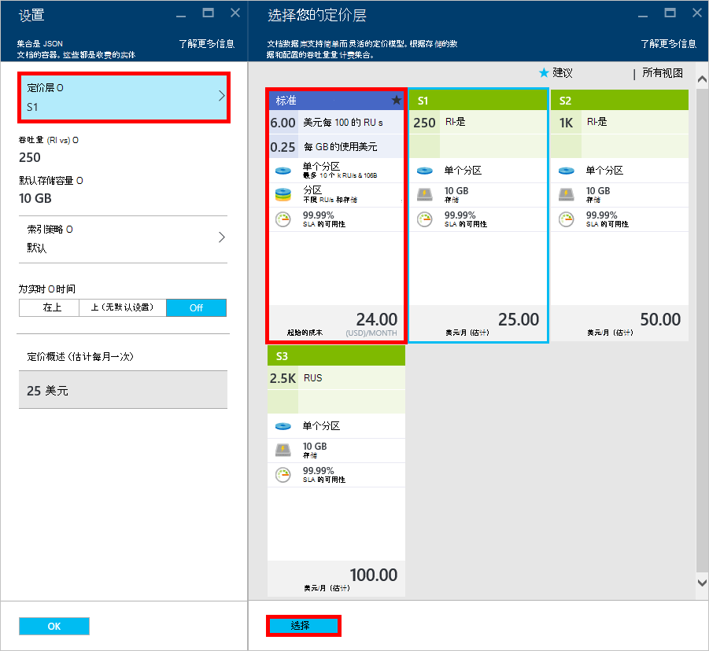

<properties 
    pageTitle="提升您的 DocumentDB S1 帐户 |Microsoft Azure" 
    description="利用增加的吞吐量 DocumentDB S1 帐户中通过几个简单更改 Azure 的门户。" 
    services="documentdb" 
    authors="mimig1" 
    manager="jhubbard" 
    editor="monicar" 
    documentationCenter=""/>

<tags 
    ms.service="documentdb" 
    ms.workload="data-services" 
    ms.tgt_pltfrm="na" 
    ms.devlang="na" 
    ms.topic="article" 
    ms.date="08/25/2016" 
    ms.author="mimig"/>

# 提升您的 DocumentDB 帐户

请按照下列步骤来利用 Azure DocumentDB S1 帐户增加了吞吐量。 较少无需额外成本，您可以提高您现有 S1 的帐户从 250 [RU/s](documentdb-request-units.md)为 400 RU s，或更多的吞吐量 ！  

> [AZURE.VIDEO changedocumentdbcollectionperformance]

## 更改到 Azure 门户中的用户定义的性能

1. 在浏览器中，导航到[**Azure 的门户**](https://portal.azure.com)。 
2. 单击**浏览** -> **DocumentDB (NoSQL)**，然后选择要修改的 DocumentDB 帐户。   
3. 在**数据库**镜头中，选择要修改的数据库，然后在**数据库**刀片式服务器，选择与 S1 定价层集合。

      

4. 在**集合**刀片式服务器，请单击**多个**，，然后单击**设置**。   
5. 在**设置**刀片式服务器，请单击**定价层**和注意，每个计划的每月成本估计会显示。 在**选择您定价层**刀片式服务器，单击**标准**，然后单击**选择**来保存所做的更改。

      

6. 在**设置**刀片式服务器，**定价层**更改为**标准**，**吞吐量 （RU/秒）**框中显示的默认值为 400。 单击**确定**以保存所做的更改。 

    > [AZURE.NOTE] 您可以设置 400 到 10000 个[请求单位](../articles/documentdb/documentdb-request-units.md)之间的吞吐量 /second (RU/s)。 **定价摘要**页面底部会自动更新以提供所需的每月成本估计。
    
    

8. 重新打开**数据库**刀片式服务器，您可以验证的集合鼎沸的吞吐量。 

    

有关用户定义的和预定义的吞吐量与相关的更改的详细信息，请参阅博客文章[DocumentDB︰ 所有需要了解的有关使用新的定价选项](https://azure.microsoft.com/blog/documentdb-use-the-new-pricing-options-on-your-existing-collections/)。

## 下一步行动

如果您确定您需要更大的吞吐量 （大于 10000 的 RU s） 或更多的存储 （大于 10 GB） 您可以创建一个分区。 若要创建一个分区，请参阅[创建集合](documentdb-create-collection.md)。