<properties
    pageTitle="DocumentDB 文档资源管理器，查看 JSON |Microsoft Azure"
    description="了解 DocumentDB 文档资源管理器中，查看 JSON、 编辑、 创建和使用 DocumentDB，NoSQL 文档数据库的 JSON 文档上载 Azure 门户工具。"
        keywords="查看 json"
    services="documentdb"
    authors="kirillg"
    manager="jhubbard"
    editor="monicar"
    documentationCenter=""/>

<tags
    ms.service="documentdb"
    ms.workload="data-services"
    ms.tgt_pltfrm="na"
    ms.devlang="na"
    ms.topic="article"
    ms.date="08/30/2016"
    ms.author="kirillg"/>

# 查看、 编辑、 创建和使用 DocumentDB 文档资源管理器的 JSON 文档上载

本文概述了[Microsoft Azure DocumentDB](https://azure.microsoft.com/services/documentdb/)文档资源管理器，使您可以查看、 编辑、 创建、 上载和筛选具有 DocumentDB 的 JSON 文档 Azure 门户工具。 

请注意文档资源管理器不能使用 MongoDB 的协议支持的 DocumentDB 帐户上。 当启用此功能时，将更新此页。

## 启动文档资源管理器

1. 在 Azure 的门户中，在 Jumpbar 中，请单击**DocumentDB (NoSQL)**。 如果**DocumentDB (NoSQL)**不可见，单击**其他服务**，然后单击**DocumentDB (NoSQL)**。

2. 选中的帐户名。 

3. 在资源菜单上，单击**文档资源管理器**。 
 
    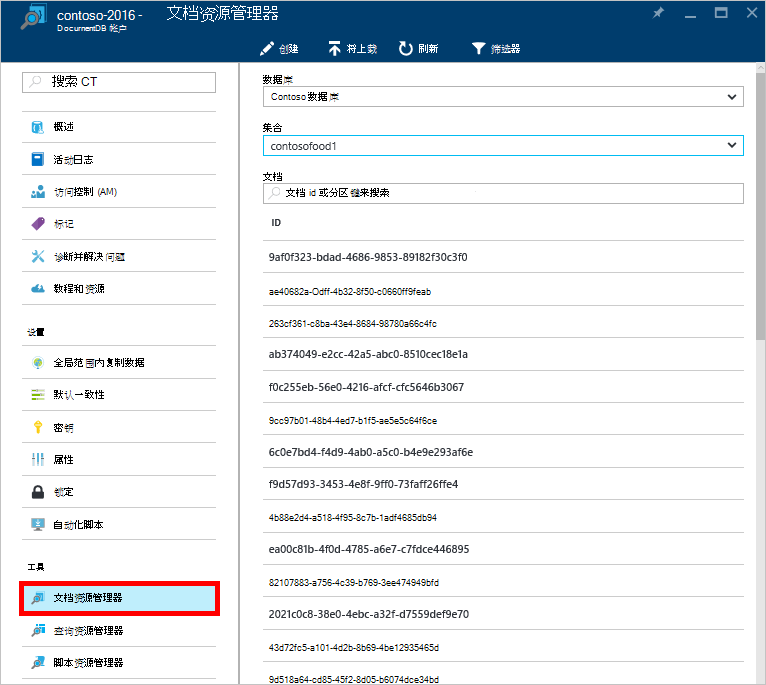

    在**文档资源管理器**刀片式服务器，具体取决于您在其中启动文档资源管理器的上下文预填充**数据库**和**集合**下拉列表。 

## 创建文档

1. [启动文档资源管理器](#launch-document-explorer)。

2. 在**文档资源管理器**刀片式服务器，单击**创建文档**。 

    刀片式服务器**文档**中提供了最小的 JSON 段。

    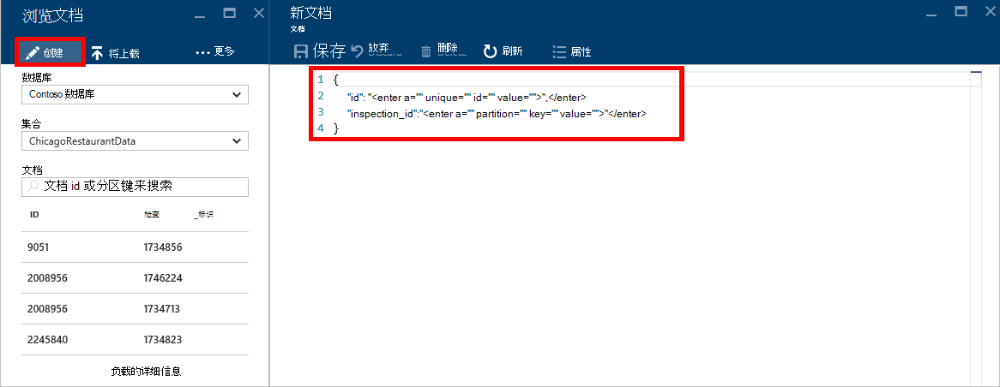

2. 在**文档**刀片式服务器，键入或粘贴您想要创建，JSON 文档的内容，然后单击**保存**以将文档提交到数据库和**文档资源管理器**刀片式服务器中指定集合。

    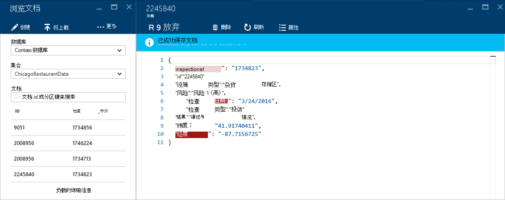

    > [AZURE.NOTE] 如果未提供"id"属性，，然后文档资源管理器自动添加 id 属性，并生成一个 GUID 作为标识值。

    如果您已经从 JSON 数据文件，MongoDB，SQL Server、 CSV 文件，Azure 表存储，Amazon DynamoDB，HBase，或与其他 DocumentDB 集合，您可以使用 DocumentDB 的[数据迁移工具](documentdb-import-data.md)快速地将数据导入。

## 编辑文档

1. [启动文档资源管理器](#launch-document-explorer)。

2. 若要编辑一个现有的文档，刀片式服务器**文档资源管理器**中选择它，编辑**文档**刀片式服务器，文档，然后单击**保存**。

    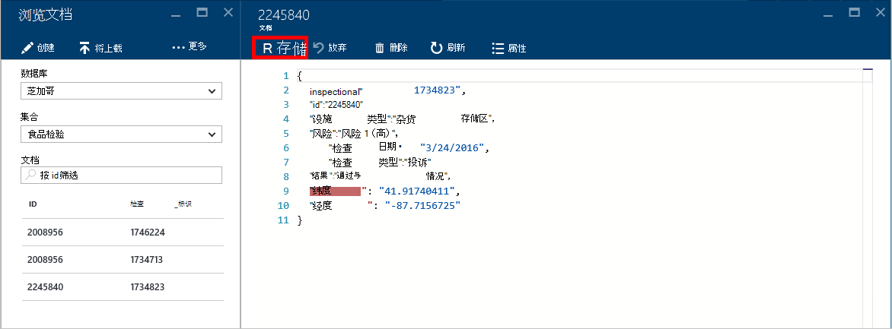

    如果您正在编辑的文档，并决定，想要放弃当前集的编辑，只需单击**文档**刀片式服务器中的**放弃**，确认放弃操作，并重新加载文档的以前的状态。

    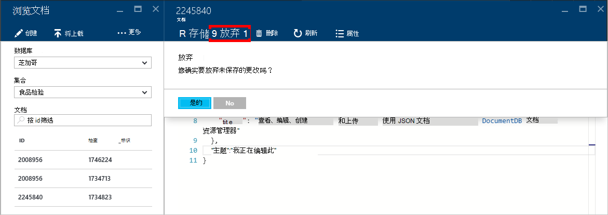

## 删除文档

1. [启动文档资源管理器](#launch-document-explorer)。

2. 在**文档资源管理器**中选择该文档，单击**删除**，然后确认删除。 确认后，该文档是立即从列表中删除文档资源管理器。

    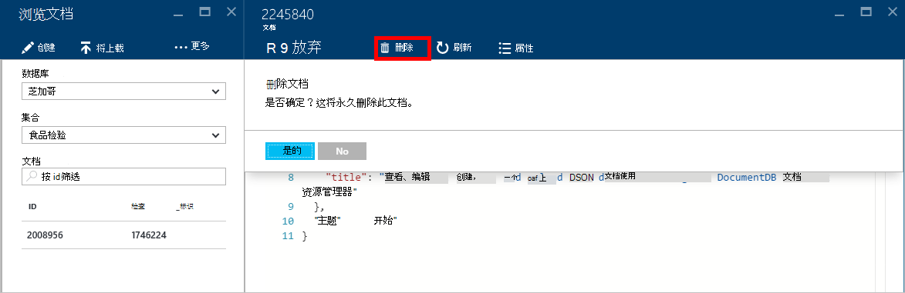

## 使用 JSON 文档

文档资源管理器验证任何新的或编辑后的文档包含有效的 JSON。  悬停在不正确的部分，以获取有关验证错误的详细信息，您可以甚至查看 JSON 错误。

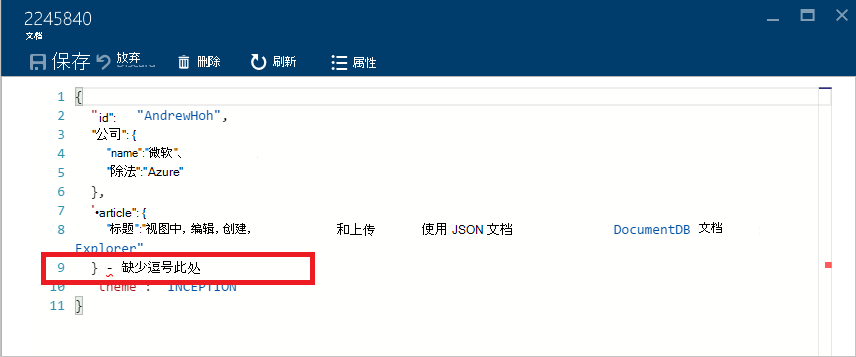

此外，文档资源管理器阻止您保存文档使用 JSON 内容无效。

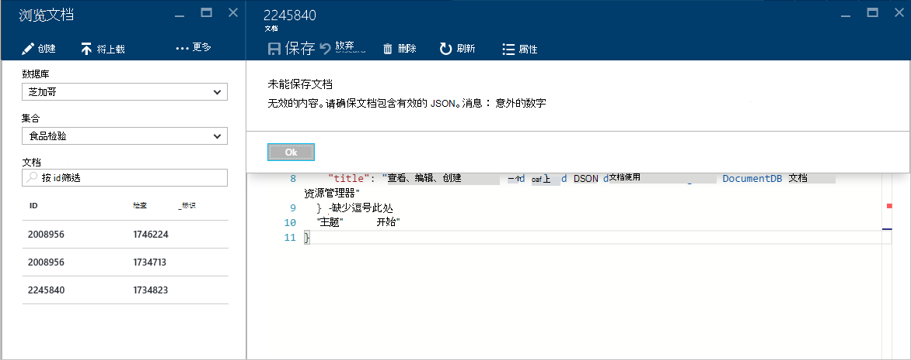

最后，文档资源管理器可以轻松地通过单击**属性**命令查看当前加载的文档的系统属性。

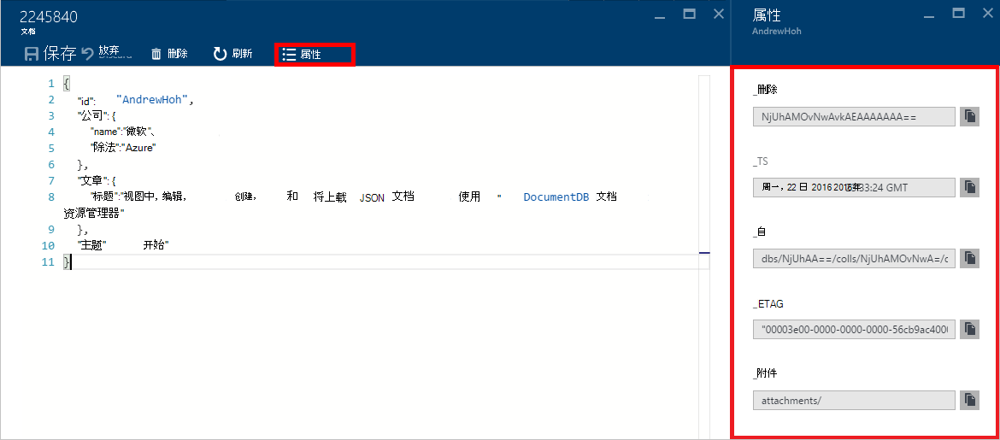

> [AZURE.NOTE] 时间戳 (_ts) 属性在内部表示为日期时间，但人类可读的格林威治标准时间格式的文档资源管理器中显示的值。

## 筛选器的文档
文档资源管理器还支持多种导航选项和高级设置。

默认情况下，文档资源管理器对选定收藏集，按从最早到最晚及其创建日期中的前 100 个文档加载。  您可以通过选择文档资源管理器刀片底部**更加载**选项加载其他文档 （在 100 个批次）。 您可以选择哪些文档加载到**筛选**命令。

1. [启动文档资源管理器](#launch-document-explorer)。

2. 在**文档资源管理器**刀片的顶部，单击**筛选器**。  

    
  
3.  命令栏的下面显示的筛选器设置。 在筛选器设置，提供 WHERE 子句和/或 ORDER BY 子句，然后单击**筛选器**。

    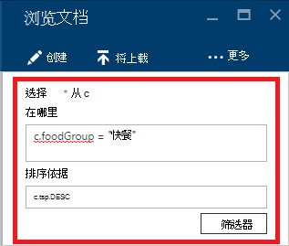

    与查询匹配的筛选器的文档，文档资源管理器自动刷新结果。 阅读有关[SQL 查询和 SQL 语法](documentdb-sql-query.md)中的 DocumentDB SQL 语法的详细信息文章或打印一份[SQL 查询内容便笺](documentdb-sql-query-cheat-sheet.md)。

    **数据库**和**集合**下拉列表框可以用于方便地更改的当前正在查看文档而无需关闭并重新启动文档资源管理器的集合。  

    文档资源管理器还支持通过其 id 属性筛选当前加载的文档集。  只需键入 id 框的文档筛选器中。

    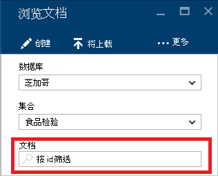

    筛选列表的文档资源管理器中的结果根据您提供的条件。

    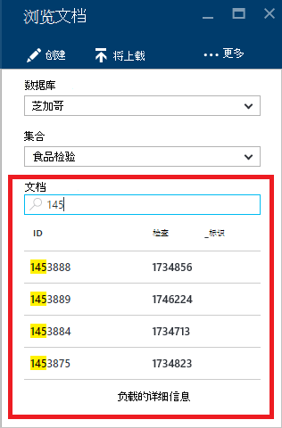

    > [AZURE.IMPORTANT] 文档资源管理器功能仅过滤器从***当前***加载的文档集，并不会执行对当前所选集合的查询。

4. 若要刷新加载文档资源管理器中的文档的列表，请单击顶部的刀片式服务器**刷新**。

    

## 批量添加文档

文档资源管理器支持一个或多个现有 JSON 文档，最多 100 个 JSON 文件，每个上载操作的批量的接收。  

1. [启动文档资源管理器](#launch-document-explorer)。

2. 若要启动上载过程中，请单击**上载文档**。

    

    打开刀片式服务器**上载文档**。 

2. 单击浏览按钮以打开文件资源管理器窗口中选择一个或多个要上载的 JSON 文档，然后单击**打开**。

    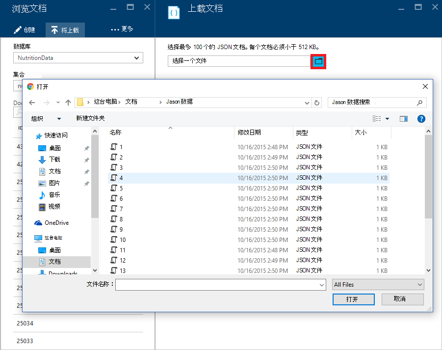

    > [AZURE.NOTE] 文档资源管理器目前支持最多 100 个的 JSON 文档，每个单独的上载操作。

3. 一旦您对您的选择感到满意，请单击**上载**按钮。  这些文档将自动添加到文档资源管理器中的网格并上载结果显示执行操作的过程。 导入失败报告为单个文件。

    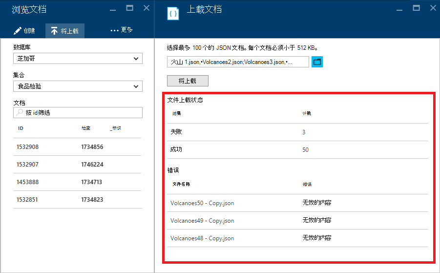

4. 完成此操作后，您最多可以选择另一个 100 个文档上载。

## 使用门户以外的 JSON 文档

在 Azure 的门户网站中的文档资源管理器是使用 DocumentDB 中的文档的只是一种方法。 您还可以使用[REST API](https://msdn.microsoft.com/library/azure/mt489082.aspx)或[客户端 Sdk](documentdb-sdk-dotnet.md)文档使用。 有关示例代码，请参见[.NET SDK 文档示例](documentdb-dotnet-samples.md#document-examples)和[Node.js SDK 文档示例](documentdb-nodejs-samples.md#document-examples)。

如果您需要导入或从另一个源 （JSON 文件，MongoDB，SQL Server、 CSV 文件，Azure 表存储、 Amazon DynamoDB 或 HBase） 迁移的文件，您可以使用 DocumentDB[数据迁移工具](documentdb-import-data.md)快速地将数据导入 DocumentDB。

## 疑难解答

**症状**︰ 文档资源管理器返回**未找到文档**。

**解决方案**︰ 确保您已选择正确的订阅数据库，插入文档的集合。 另外，请检查以确保您正在操作的吞吐量配额内。 如果在操作级别和获得最大吞吐量遏制，较低的应用程序使用率要在该集合的最大吞吐量配额下运行。

**说明**︰ 门户是像任何其他，对 DocumentDB 数据库和集合进行调用的应用程序。 如果您的请求现在都由于正在从单独的应用程序发出的调用被遏制，门户网站可能也被控制，导致不显示在门户的资源。 要解决此问题，请解决使用高吞吐量的原因，然后刷新门户刀片。 [吞吐量](documentdb-performance-tips.md#throughput)[性能提示](documentdb-performance-tips.md)文章节中找不到如何测量和较低的吞吐量使用率信息。

## 下一步行动

若要了解有关在文档资源管理器中支持的 DocumentDB SQL 语法的详细信息，请参阅[SQL 查询和 SQL 语法](documentdb-sql-query.md)文章或打印出的[SQL 查询内容便笺](documentdb-sql-query-cheat-sheet.md)。

[学习路线图](https://azure.microsoft.com/documentation/learning-paths/documentdb/)也是非常有用的资源，可以指导您学习更多关于 DocumentDB。 
