<properties
    pageTitle="DocumentDB 脚本资源管理器中，一个 JavaScript 编辑器 |Microsoft Azure"
    description="了解 DocumentDB 脚本资源管理器，Azure 门户工具来管理 DocumentDB 服务器端编程项目包括存储的过程、 触发器和用户定义的函数。"
    keywords="javascript 编辑器"
    services="documentdb"
    authors="kirillg"
    manager="jhubbard"
    editor="monicar"
    documentationCenter=""/>

<tags
    ms.service="documentdb"
    ms.workload="data-services"
    ms.tgt_pltfrm="na"
    ms.devlang="na"
    ms.topic="article"
    ms.date="08/30/2016"
    ms.author="kirillg"/>

# 创建并运行存储的过程、 触发器和用户定义的函数使用 DocumentDB 脚本资源管理器

这篇文章概括介绍了[Microsoft Azure DocumentDB](https://azure.microsoft.com/services/documentdb/)脚本资源管理器，是一种 JavaScript 编辑器在 Azure 门户，您可以查看和执行 DocumentDB 服务器端编程项目包括存储的过程、 触发器和用户定义的函数。 了解更多关于 DocumentDB[存储过程、 数据库触发器和 Udf](documentdb-programming.md)文章中的服务器端编程。

## 启动脚本资源管理器

1. 在 Azure 的门户中，在 Jumpbar 中，请单击**DocumentDB (NoSQL)**。 如果**DocumentDB 帐户**不可见，请单击**更多服务**，然后单击**DocumentDB (NoSQL)**。

2. 在资源菜单上，单击**脚本资源管理器**。

    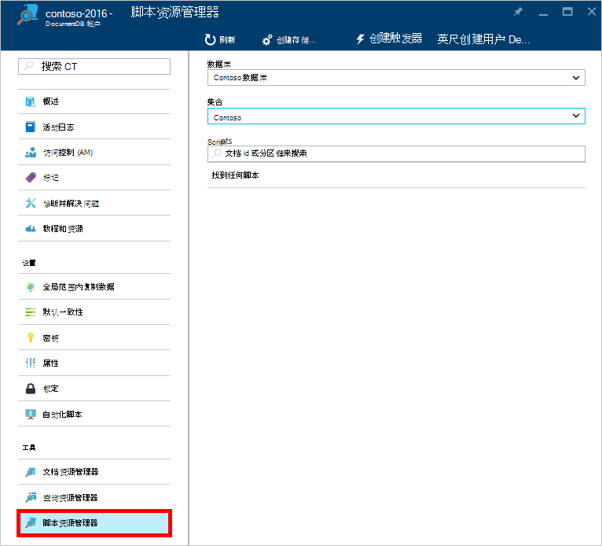
 
    **数据库**和**集合**下拉列表框预先填充您启动脚本资源管理器的上下文中。  例如，如果您从数据库刀片式服务器启动，则当前数据库是预先填充。  如果您从集合刀片式服务器启动，则预填充的当前集合。

4.  使用**数据库**和**集合**下拉列表框可以方便地更改从该脚本正在查看而无需关闭并重新启动脚本资源管理器的集合。  

5. 脚本资源管理器还支持通过其 id 属性筛选当前加载的脚本集。  只需在筛选器框中键入和脚本资源管理器中的对结果进行筛选基于您提供的条件。

    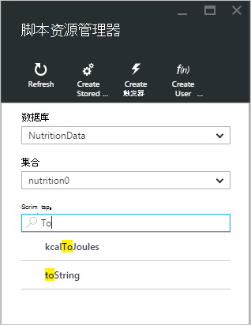

    > [AZURE.IMPORTANT] 脚本资源管理器从***当前***加载的脚本功能仅筛选器筛选并不会自动刷新当前所选的集合。

5. 若要刷新加载的脚本资源管理器中的脚本的列表，只需单击刀片式服务器顶部的**刷新**命令。

    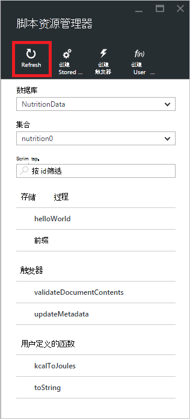

## 创建、 查看和编辑存储的过程、 触发器和用户定义的函数

脚本资源管理器允许您轻松执行 CRUD 操作对 DocumentDB 服务器端编程项目。  

- 若要创建一个脚本，只需单击相应创建脚本资源管理器中的命令提供 id、 输入脚本的内容，单击**保存**。

    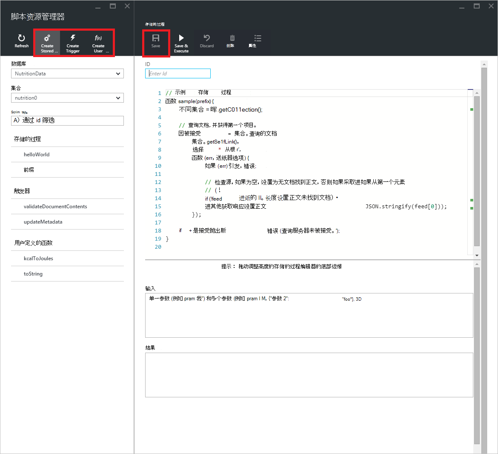

- 当创建一个触发器，则还必须指定触发器类型和触发器操作

    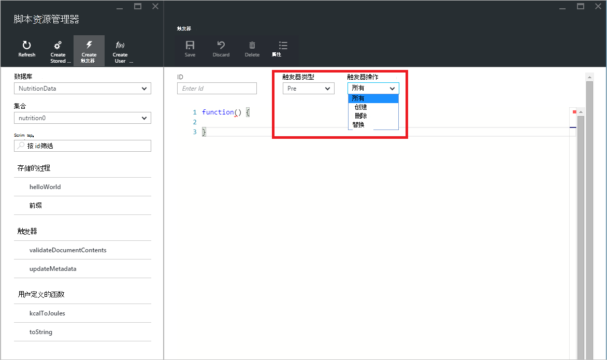

- 若要查看一个脚本，只需单击您感兴趣的脚本。

    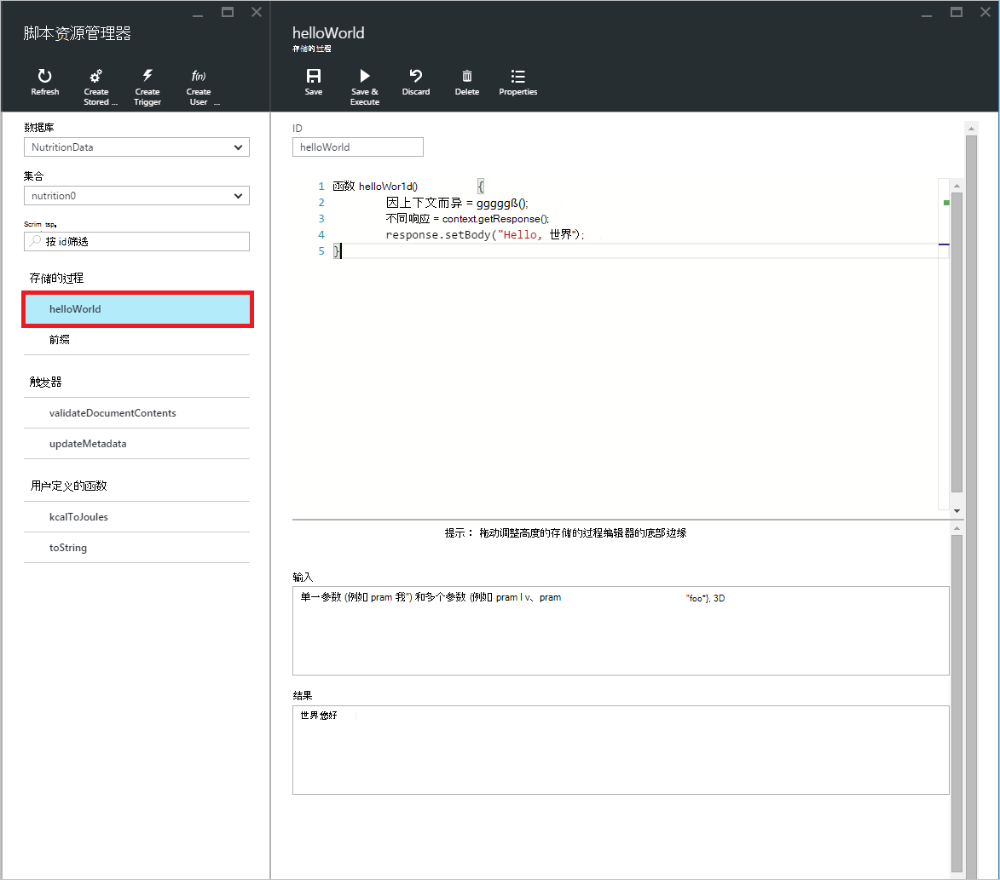

- 若要编辑脚本，只需在 JavaScript 编辑器中进行所需的更改，单击**保存**。

    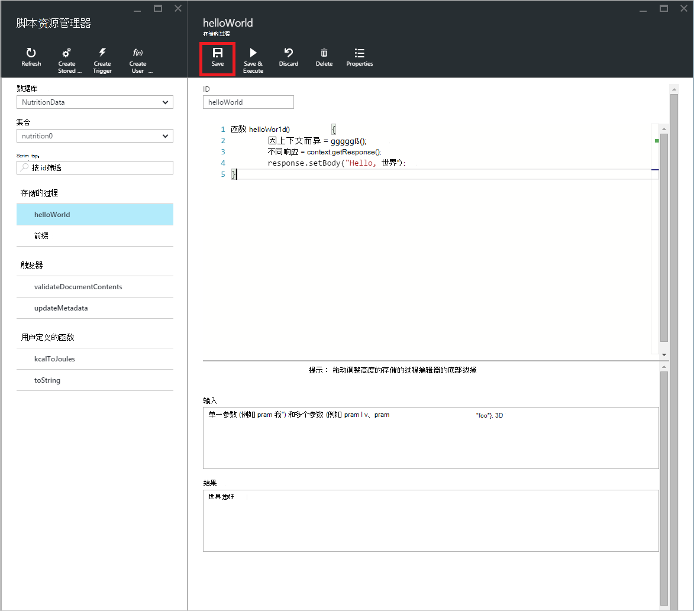

- 若要放弃所有挂起的更改脚本，只需单击**放弃**命令。

    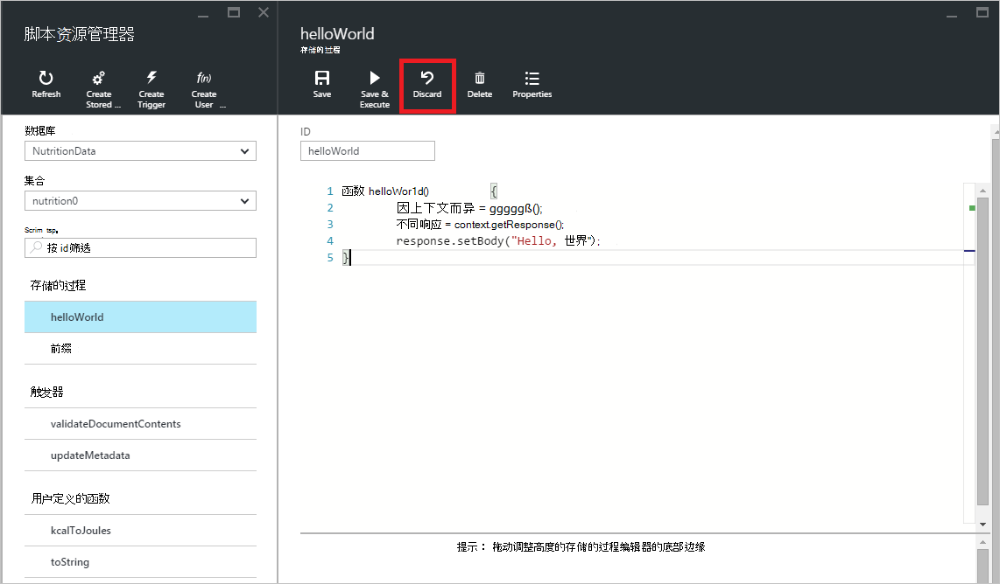

- 脚本资源管理器还允许您可以很容易地通过单击**属性**命令查看当前加载的脚本的系统属性。

    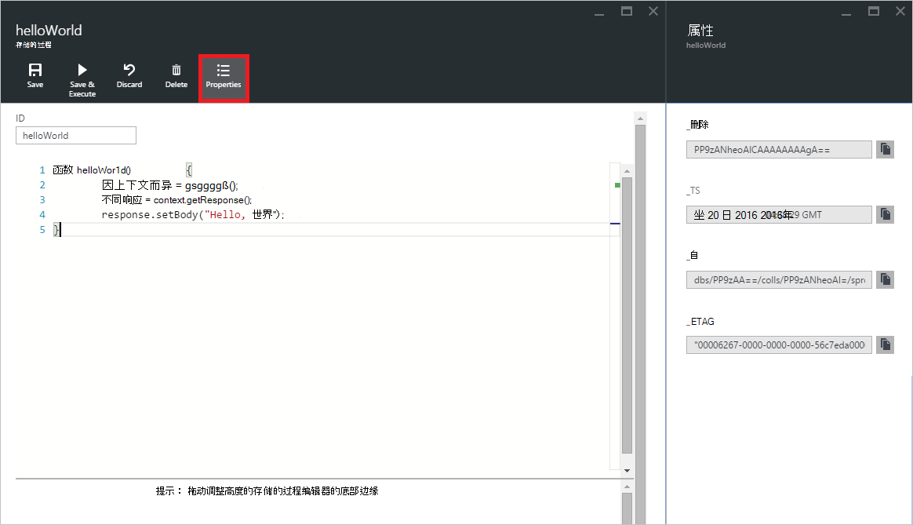

    > [AZURE.NOTE] 时间戳 (_ts) 属性在内部表示为日期时间，但人类可读的格林威治标准时间格式的脚本资源管理器中显示的值。

- 若要删除一个脚本，在脚本资源管理器中选择它并单击**删除**命令。

    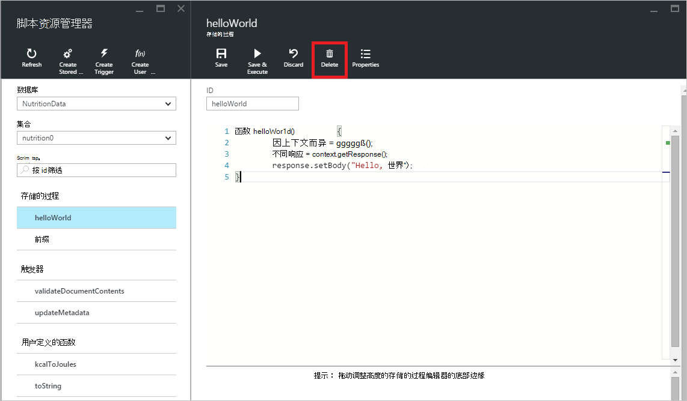

- 单击**是**确认删除操作，或单击**否**取消删除操作。

    

## 执行存储的过程

> [AZURE.WARNING] 在脚本资源管理器中执行存储的过程尚不支持的服务器端分区集合。 有关详细信息，请访问[分区和 DocumentDB 中的缩放比例](documentdb-partition-data.md)。

脚本资源管理器允许您从 Azure 门户执行服务器端存储的过程。

- 在打开新创建的存储过程刀片式服务器时，将已提供默认脚本 （*前缀*）。 为了执行*前缀*脚本或您自己的脚本，请添加一个*id*和一个*输入*。 对于接受多个参数的存储过程，所有的输入必须是数组 （如*["foo"、"条"]*） 内。

    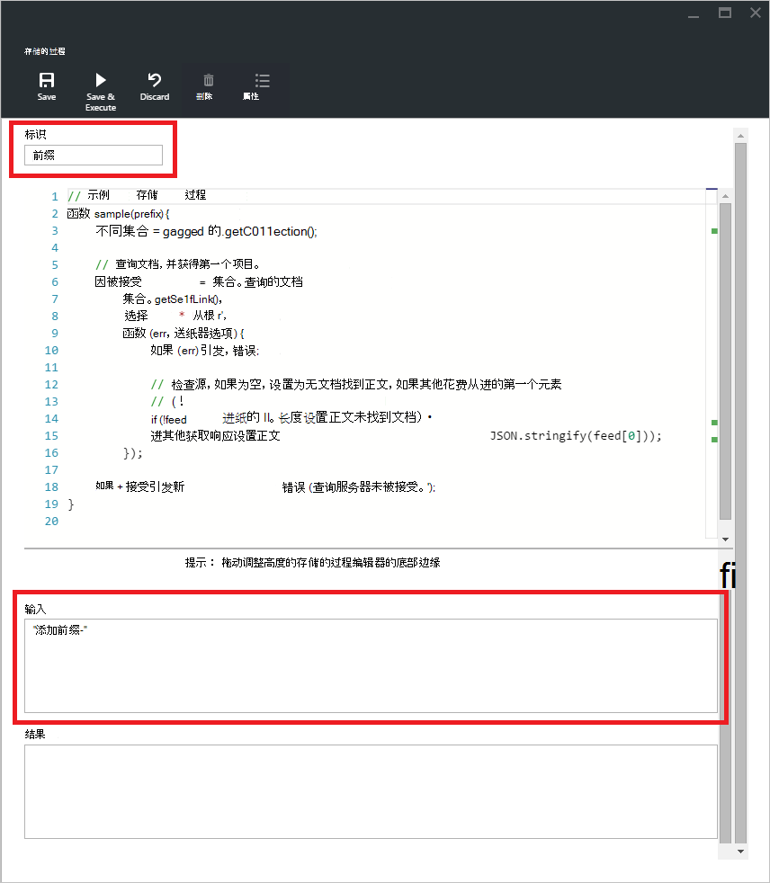

- 若要执行某个存储的过程，只需单击脚本编辑器窗格中的**保存和执行**命令。

    > [AZURE.NOTE] **保存并执行**命令将保存存储的过程之前执行，这意味着它将覆盖以前保存的存储过程的版本。

- 成功的存储的过程的执行将已*成功保存并执行存储的过程*的状态，返回的结果将在*结果*窗格中进行填充。

    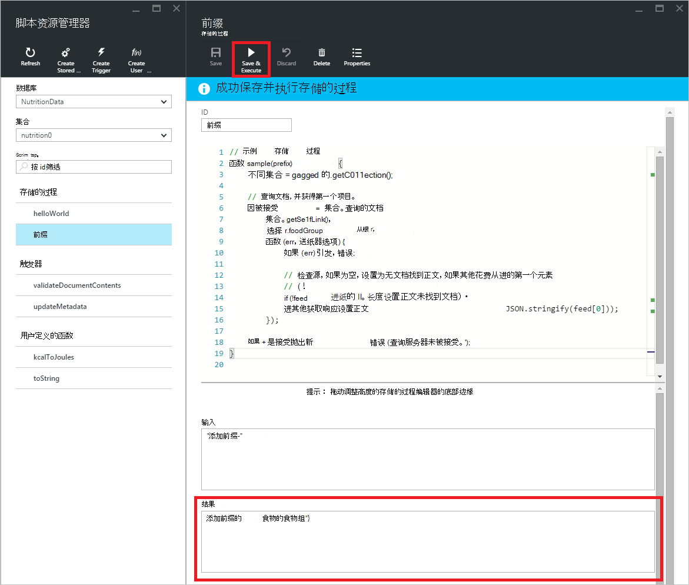

- 如果执行时遇到错误，该错误将在*结果*窗格中填充。

    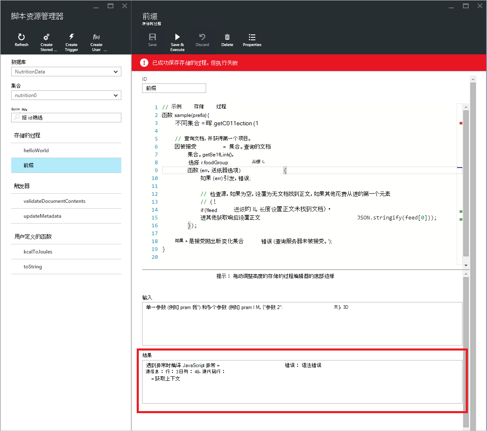

## 使用门户外部脚本

在 Azure 门户脚本资源管理器是使用存储的过程、 触发器和用户定义的函数，在 DocumentDB 中只是一个方法。 您还可以使用脚本使用 REST API，以及[客户端 Sdk](documentdb-sdk-dotnet.md)。 REST API 文档中包含用于处理[存储使用其余的过程](https://msdn.microsoft.com/library/azure/mt489092.aspx)、[用户定义的函数使用 REST](https://msdn.microsoft.com/library/azure/dn781481.aspx)，和[触发器使用其余](https://msdn.microsoft.com/library/azure/mt489116.aspx)的示例。 示例也是可用的显示如何[使用 C# 脚本](documentdb-dotnet-samples.md#server-side-programming-examples)和[脚本使用 Node.js 工作](documentdb-nodejs-samples.md#server-side-programming-examples)。

## 下一步行动

了解有关[存储过程、 数据库触发器和 Udf](documentdb-programming.md)文章中的 DocumentDB 服务器端编程的详细信息。

[学习路线图](https://azure.microsoft.com/documentation/learning-paths/documentdb/)也是非常有用的资源，可以指导您学习更多关于 DocumentDB。  
