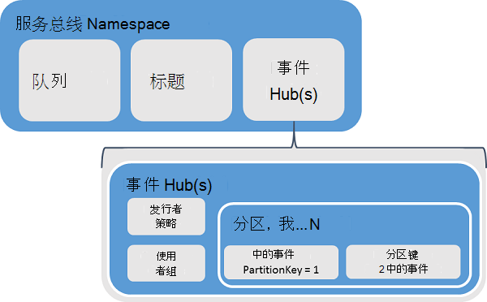
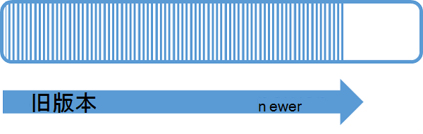
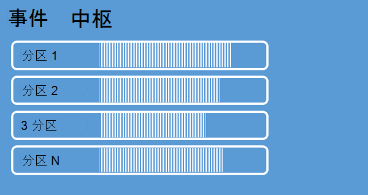
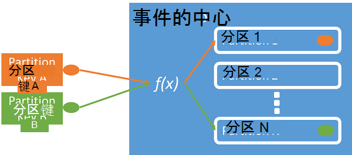
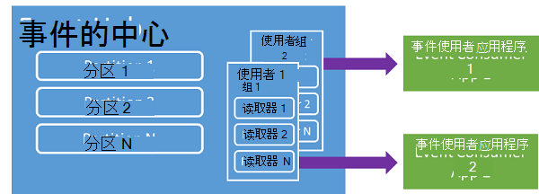

<properties 
    pageTitle="Azure 事件集线器概述 |Microsoft Azure"
    description="简介和概述 Azure 事件集线器。"
    services="event-hubs"
    documentationCenter="na"
    authors="sethmanheim"
    manager="timlt"
    editor="" />
<tags 
    ms.service="event-hubs"
    ms.devlang="na"
    ms.topic="get-started-article"
    ms.tgt_pltfrm="na"
    ms.workload="na"
    ms.date="08/16/2016"
    ms.author="sethm" />

# Azure 事件集线器概述

许多现代的解决方案打算提供自适应客户体验或改善产品通过连续的反馈和自动的遥测。 这种解决方案都面临着如何安全可靠地处理大量信息从许多并发的出版商的难题。 Microsoft Azure 事件集线器是托管的平台服务，奠定了在各种情况下的大规模数据实习机会。 这种方案的示例是在移动应用程序，从 web 场中，在控制台游戏中，游戏中事件捕获通信信息跟踪的行为或遥测数据收集从工业计算机或连接车辆。 公共事件集线器发挥在解决方案体系结构中的作用是充当"前门"事件管道，通常称为*事件 ingestor*。 事件 ingestor 是一个组件或服务位于之间事件发布者和事件使用者将事件流的那些事件的消耗从生产中分离出来。

Azure 事件集线器是处理事件和遥测入口到在大规模，云提供低延迟和高可靠性的服务事件。 这项服务，与其他下游服务使用是在应用程序规范、 用户体验或工作流处理和互联网内容 (IoT) 方案中尤其有用。 事件集线器提供处理功能的消息流和事件中心是一个类似于队列和主题的实体，尽管它具有非常不同于传统企业消息传递的特征。 企业消息传递方案通常需要复杂的功能，如排序、 死字母、 事务支持和强的交货保证，而事件实习机会的主要问题是高吞吐量和处理事件流的灵活性。 因此，事件集线器功能与服务总线主题不同，在于它们都强烈偏爱高吞吐量和事件处理方案。 在这种情况下，事件集线器不实现某些消息传递功能所提供的主题。 如果您需要这些功能，主题仍然是最佳的选择。

在事件集线器命名空间级别，类似于服务总线队列和主题创建事件中心。 事件集线器使用 AMQP 和 HTTP 作为其主要的 API 接口。 下图显示了事件集线器和服务总线之间的关系。

## 概念性概述

事件集线器提供消息流通过分区使用者模式。 队列和主题使用每个使用者尝试读取同一个队列或资源[竞争使用者](https://msdn.microsoft.com/library/dn568101.aspx)模型。 这种资源的竞争最终导致复杂性和处理应用程序流的比例限制。 事件集线器使用其中每个使用者只读取一个特定的子集或分区，消息流的一个分区使用者模式。 此模式使事件处理水平缩放，和提供其他流为中心的功能是不可用的队列和主题。

### 分区

分区是保存在一个事件集线器有序的事件的序列。 较新的事件到达时，他们添加到此序列的末尾。 一个分区可以被认为是"提交日志"。

分区将数据保留在事件中心级别设置的配置的保留时间。 此设置在事件中心所有分区之间适用。 在以时间为基础; 到期事件您不能显式地删除它们。 事件集线器包含多个分区。 每个分区独立并且包含其自己的数据序列。 因此，分区通常以不同的比率增长。

分区数在事件中心创建时指定，并且必须是 2 到 32 （默认值为 4） 之间。 分区是一种数据组织机制，更与下游中消耗比事件集线器吞吐量的应用程序所需的并行度。 这样直接相关的并发读者希望有数事件中心中选择的分区数。 事件中心创建后分区计数不变;您应该考虑方面长期预期的规模这个数字。 可以通过联系服务总线团队来增加 32 分区限制。

分区是可识别的并可以直接发送给，而是最好避免将数据发送到特定的分区。 相反，可以使用高级的[事件发布者](#event-publisher)和[发行者策略](#capacity-and-security)部分引入构造。

在事件集线器的上下文中，消息被称为*事件数据*。 事件数据包含事件的主体、 用户定义的属性包和各种元数据有关的事件，例如其偏移量中的分区和流规则中的编号。 一系列的事件数据都是分区。

## 事件发布者

将事件或数据发送到事件中心的实体是*事件发布者*。 事件发布者可以发布使用 HTTPS 或 AMQP 1.0 的事件。 事件发布服务器使用的共享访问签名 (SAS) 标记表明自己对事件的集线器，并可以有唯一的标识，或使用常见的 SAS 令牌，根据方案的要求。

关于使用 SA 的详细信息，请参阅[使用服务总线共享访问签名的验证](../service-bus-messaging/service-bus-shared-access-signature-authentication.md)。

### 发布服务器的常见任务

本部分描述的事件发布的常见任务。

#### 获取 SAS 令牌

共享访问签名 (SAS) 是事件集线器的身份验证机制。 服务总线提供了命名空间和事件中心级别 SAS 策略。 SAS 令牌从 SAS 密钥生成，是以特定格式编码的 URL 的 SHA 哈希。 使用键 （策略） 和标记的名称，服务总线可以重新生成哈希并因此验证发件人的身份。 通常情况下，用只**发送**权限的特定事件集线器上创建事件发行者的 SAS 标记。 此 SAS 令牌 URL 机制是发布服务器标识发行者策略中引入的基础。 关于使用 SA 的详细信息，请参阅[使用服务总线共享访问签名的验证](../service-bus-messaging/service-bus-shared-access-signature-authentication.md)。

#### 发布一个事件

您可以发布事件通过 AMQP 1.0 或 HTTPS。 服务总线提供[EventHubClient](https://msdn.microsoft.com/library/microsoft.servicebus.messaging.eventhubclient.aspx)类来将事件发布到事件集线器从.NET 客户端。 对于其他运行库和平台，您可以使用任何 AMQP 1.0 客户端，如[Apache Qpid](http://qpid.apache.org/)。 您可以将事件发布分别或批处理。 单个发布 （事件数据实例） 的限制为 256 KB，不论它是一个事件或一批。 比这会导致错误的发布事件。 它是为出版商不知道事件中心内的分区，*分区键*（引入下一节），或通过其 SAS 标记其身份，只能指定一种最佳做法。

选择使用 AMQP 或 HTTPS 是特定于的使用情况。 AMQP 需要持续的双向套接字除了传输层安全性 (TLS) 或 SSL/TLS 的建立。 这是一个代价高昂的操作在网络流量方面但 AMQP 会话开始时才会出现问题。 HTTPS 具有较低的初始开销，但需要其他 SSL 开销为每个请求。 对于出版商经常发布事件，AMQP 提供显著的性能、 延迟和吞吐量节约。

### 分区键

分区键是一个值，用于将传入的事件数据映射到特定的分区，数据组织的目的。 分区键是传递到事件中心将发件人提供的值。 通过静态的哈希函数，其结果是创建分区分配处理。 如果在发布事件时，未指定分区键，则使用循环复用分配。 使用分区键，当事件发布者才意识到它的分区键，不将事件发布到该分区。 此密钥和分区的分离使发件人从无需知道太多有关下游处理和存储的事件。 分区键是用于组织数据以进行后续处理，重要，而是从根本上与分区本身无关。 每个设备或用户唯一标识正确的分区键，但其它属性，例如地理位置还可以用于为单个分区组相关的事件。 下图显示了事件的发件人使用分区键固定到分区。

事件集线器可确保，并且到同一分区传递共享同一个分区键值的所有事件。 重要的是，如果使用发行者策略，在下一节中所述使用分区键然后发布服务器的标识和分区键的值必须匹配。 否则，就会出错。

### 事件使用方

事件数据读取事件中心的实体是事件使用者。 所有的事件使用者阅读事件流通过使用者组中的分区。 每个分区都应有一次只能有一个活动的读取器。 所有事件集线器使用者都连接通过 AMQP 1.0 会话，俟发送事件。 客户端不需要轮询数据可用性。

#### 使用者组

通过使用者组启用事件集线器的发布/订阅机制。 使用者组是整个事件中心的视图 （状态、 位置、 或偏移量）。 使用者组启用多个使用的应用程序为每个具有单独的视图的事件流，并且读取流独立地按自己的节奏和与它们自己的偏移量。 在流处理的体系结构中，每个下游应用程序相当于使用者组。 如果您想要将事件数据写入到长期存储，该存储写入器应用程序，则使用者组。 另一种，不同的使用者组执行复杂事件处理。 您只能通过使用者组访问分区。 事件中心，总是默认使用者组，您可以创建标准层事件中心的达 20 个使用者组。

以下是使用者组 URI 约定的示例︰

    //<my namespace>.servicebus.windows.net/<event hub name>/<Consumer Group #1>
    //<my namespace>.servicebus.windows.net/<event hub name>/<Consumer Group #2>

下图显示了使用者组内的事件使用者。

#### 流的偏移量

偏移量是事件的一个分区内的位置。 您可以看作一个偏移量的客户端游标。 偏移量是一个字节的事件编号。 这使事件使用者 （读者） 点在事件流中指定要从其开始读取事件。 作为时间戳或偏移量值，您可以指定偏移量。 使用者是负责存储事件集线器服务以外自己偏距的值。

在一个分区，每个事件包括一个偏移量。 此偏移量由使用者用于显示给定分区的事件顺序中的位置。 偏移量可以传递到该事件的中心作为一个数或时间戳值读取器连接时。

#### 执行检查点操作

*检查点*是一个过程，读者将标记或提交它们分区事件序列中的位置。 检查点是使用者的责任，并且在使用者组中每个分区的基础上发生。 这意味着，对于每个使用者组，每个分区的读取器必须跟踪的当前位置在事件流，并可以通知服务时考虑数据流完整。 如果读取器时它会重新连接断开的连接从一个分区，开始读取由该分区的使用者组中最后一个阅读器以前提交检查点。 当读取器连接时，它将此偏移量传递到该事件中心指定的位置开始读取的。 以这种方式，可以使用检查点，对作为"完成"这两个标记事件，由下游应用程序，并提供在出现故障时在不同的计算机上运行的读者之间的弹性。 因为事件数据可保留在事件中心创建的时指定的保留时间间隔，就可以通过指定与该检查点进程较低偏移量返回到较旧的数据。 通过这一机制，执行检查点操作会使故障转移恢复能力和控制的事件流重放。

#### 使用者的常见任务

本节描述事件集线器的事件使用者或读者的常见任务。 通过 AMQP 1.0 连接所有集线器事件使用者。 AMQP 1.0 是一个会话和状态识别的双向通信通道。 每个分区都有 AMQP 1.0 链接进程中促进运输的分区隔离的事件。

##### 连接到一个分区

为了使用从事件中心的事件，使用者必须连接到一个分区。 如上文所述，始终通过使用者组访问分区。 该分区的使用者模型的一部分，一个读取器应该是活动分区上使用者组中的任何一次。 常见的做法是直接连接到要使用租用机制，以便协调读取器连接到特定的分区的分区时。 这样一来，就可能有只有一个活动的读取器将使用者组中每个分区。 管理一个读取器在序列中的位置是一项重要任务，通过执行检查点操作。 为.NET 客户端中使用[EventProcessorHost](https://msdn.microsoft.com/library/microsoft.servicebus.messaging.eventprocessorhost.aspx)类简化了此功能。 [EventProcessorHost](https://msdn.microsoft.com/library/microsoft.servicebus.messaging.eventprocessorhost.aspx)智能使用者代理，并在下一节中描述。

##### 读取事件

AMQP 1.0 会话和链接打开某个特定分区后，事件就会被传送到 AMQP 1.0 客户端事件集线器服务。 此传递机制使更高的吞吐量和较低的滞后时间，比基于拉动的机制，例如 HTTP GET。 事件被发送到客户端，每个事件数据实例包含重要的元数据，如用于帮助执行检查点操作的事件顺序的偏移量和序列号。

您应负责管理此偏移量最佳使在处理流中的管理进度的方式。

## 容量和安全性

事件集线器是流进入一个高度可扩展并行体系结构。 在这种情况下，有几个在调整大小和缩放基于事件集线器的解决方案时需要考虑的关键方面。 这些容量控件的第一个被称为*吞吐量单位*下, 一节中所述。

### 吞吐量单位

由吞吐量单位控制事件集线器的吞吐量。 吞吐量单位预先购买容量的单位。 一个吞吐量单元包含下列内容︰

- 入站︰ 高达 1 MB / 每秒的第二个或 1000年事件。

- 出口︰ 高达每秒 2 MB。

入口被遏制对吞吐量单位购买数所提供的容量。 在"配额超出"异常发送超过此量结果的数据。 该金额是每第二个或 1000年每秒事件或者 1 MB，无论哪种情况第一次。 出口不会产生限制例外情况，但仅限于由购买的吞吐量单位提供的数据传输量︰ 2 MB / 秒的吞吐量单位。 如果您接收的发布率异常或希望看到更高外出，请务必检查您的命名空间，在其中创建事件中心购买多少吞吐量单位。 若要获得更多的吞吐量单位，可以调整[Azure 的传统门户网站][]中的**比例**选项卡上**命名空间**页面上的设置。 您还可以更改此设置，使用 Azure 的 Api。

虽然分区数据的组织概念，吞吐量单位是纯粹是一个容量的概念。 吞吐量单位按小时计费，预购买。 一旦购买，吞吐量单位至少一小时计费。 最多 20 吞吐量单位可以购买事件集线器的命名空间，并且没有 Azure 帐户限制为 20 个吞吐量单位。 这些吞吐量单位在所有事件集线器间共享给定命名空间中。

吞吐量单位调配上尽力执行，并可能总是无法直接购买。 如果您需要特定的容量，建议您购买这些吞吐量单位提前。 如果您需要的吞吐量的 20 多个单位，您可以联系 Azure 支持购买更多的吞吐量单位以块 20，到第一个 100 吞吐量单位承诺基础上。 此外，您还可以购买 100 个吞吐量单位的块。

建议您仔细平衡吞吐量单位和分区，以达到最佳比例与事件集线器。 一个分区具有一个吞吐量单位的最大比例。 吞吐量单位数应小于或等于事件中心的分区数。

有关详细的定价信息，请参阅[事件集线器定价](https://azure.microsoft.com/pricing/details/event-hubs/)。

### 发行者策略

事件集线器可以精细地控制事件发布者通过*发布服务器策略*。 发行者策略是一套旨在促进大量独立事件发行者的运行时功能。 使用发行者策略，每个出版商使用它自己的唯一标识符在将事件发布到事件集线器，使用以下机制︰

    //<my namespace>.servicebus.windows.net/<event hub name>/publishers/<my publisher name>

您不必创建发布服务器名称之前的时间，但是它们必须匹配时发布事件，以确保独立于发布服务器标识使用的 SAS 标记。 有关 SA 的详细信息，请参阅[使用服务总线共享访问签名的验证](../service-bus-messaging/service-bus-shared-access-signature-authentication.md)。 当使用发行者策略， **PartitionKey**值设置为发布服务器名称。 正常工作时，这些值必须匹配。

## 摘要

Azure 事件集线器提供超大规模事件和遥测处理可以用于通用的应用程序和用户工作流监控任何规模的服务。 与能够提供发布-订阅功能和低延迟时间和在大规模，事件网络集线器作为"上斜"大数据。 基于发布者的身份和吊销列表，这些功能扩展到互联网的内容的常见方案。 有关开发事件集线器的应用程序的详细信息，请参阅[事件集线器编程指南](event-hubs-programming-guide.md)。

## 下一步行动

现在，您已经了解事件集线器概念，您可以将移动到以下情况︰

- 入门[教程事件集线器]。
- 完整的[示例应用程序，它使用事件集线器]。

[Azure 的传统门户网站]: http://manage.windowsazure.com
[事件集线器教程]: event-hubs-csharp-ephcs-getstarted.md
[示例应用程序使用事件集线器]: https://code.msdn.microsoft.com/windowsazure/Service-Bus-Event-Hub-286fd097
