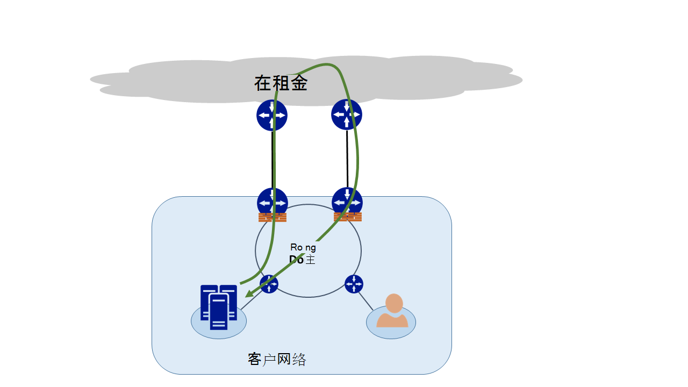
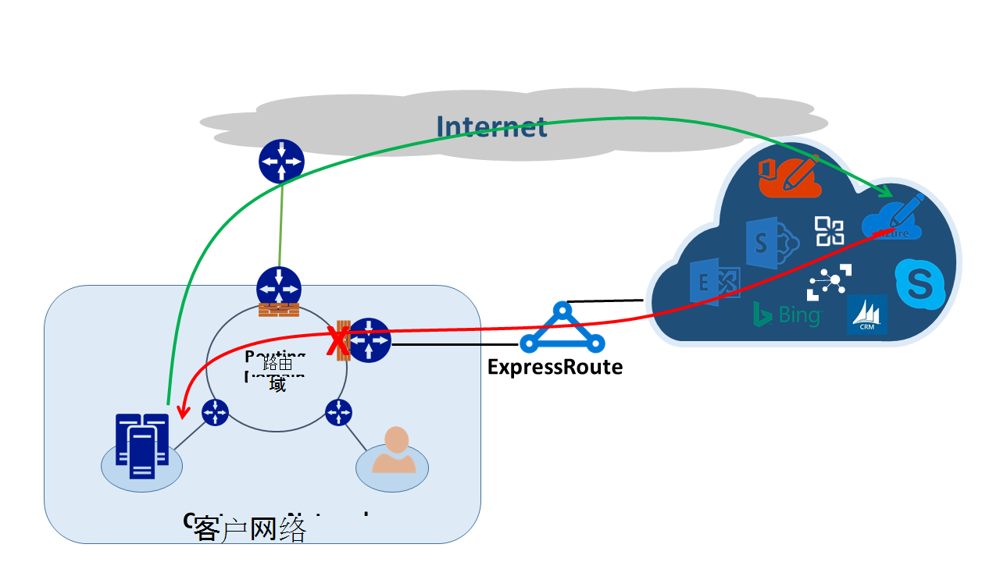
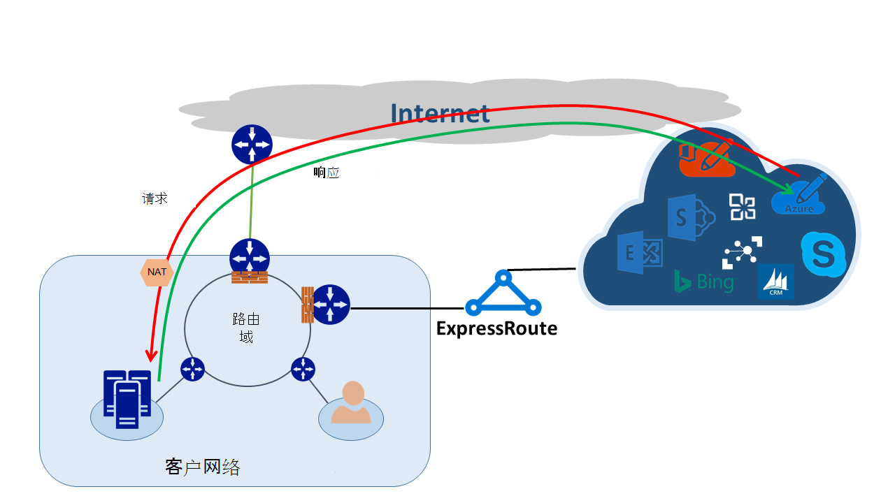

<properties
   pageTitle="非对称路由 |Microsoft Azure"
   description="这篇文章将引导您完成一个客户可能具有非对称路由的目标有多个链接的网络面临的问题。"
   documentationCenter="na"
   services="expressroute"
   authors="osamazia"
   manager="carmonm"
   editor=""/>
<tags
   ms.service="expressroute"
   ms.devlang="na"
   ms.topic="get-started-article"
   ms.tgt_pltfrm="na"
   ms.workload="infrastructure-services"
   ms.date="10/10/2016"
   ms.author="osamazia"/>

# 非对称路由的多个网络路径

这篇文章解释了如何向前并返回网络源和目标之间有多条路径时，网络流量可能通过不同的路由。

请务必了解了解非对称路由的两个概念。 一是多个网络路径的效果。 另一种是设备，例如防火墙、 如何保持状态。 这种设备被称为状态的设备。 这两个因素的组合创建的方案中的网络通信被放弃状态设备由于状态的设备不能检测与设备本身产生通信。

## 多个网络路径

当一个企业网络具有仅有一个链接到他们的互联网服务提供商通过互联网时，互联网的所有通信都传输相同的路径。 通常情况下，公司购买多个电路作为冗余的路径，以提高网络正常运行时间。 这种情况下，就可能通信网络，互联网，向外的转经历一个链接，并返回通讯经历不同的链接。 这通常称为非对称路由。 在非对称路由中，反向网络通信都采用原始流从一个不同的路径。

虽然它主要出现在 Internet 上，非对称路由也适用于其他多个路径的组合。 它，例如，同时适用于 Internet 路径和转到同一个目标，然后转到同一目标的多个专用路径到专用路径。

所到之处，从源到目的，每个路由器计算到达目的地的最佳路径。 路由器确定的可能的最佳路径基于两个主要因素︰

-   外部网络之间路由取决于路由协议，边界网关协议 (BGP)。 BGP 只从邻居的广告，它们经过一系列的步骤，以确定其设定的目标的最佳路径。 它在其路由表中存储的最佳路径。
-   与路由关联的子网掩码的长度会影响路由路径。 如果路由器接收相同的 IP 地址，但不同的子网掩码的多个广告，路由器选择广告长度子网掩码是因为认为有更明确的路径。

## 有状态的设备

路由器的数据包的 IP 头寻找路由的目的。 某些设备看起来甚至更深层数据包内。 通常，这些设备看 Layer4 （传输控制协议 TCP; 或用户数据报协议或 UDP），或者甚至 Layer7 （应用层） 标头。 这种设备是安全设备或带宽优化设备。 

防火墙可以是设备的有状态的常见示例。 防火墙允许或拒绝通过其基于各种如协议、 TCP/UDP 端口和 URL 标头字段的接口的数据包。 这一级别的数据包检查将处理设备上的负载重。 若要提高性能，防火墙，请检查第一个数据包的流。 如果允许继续该数据包，它会流信息保留其状态表中。 与此流的所有后续数据包允许基于最初的决定。 在防火墙处到达可能属于一个现有的流的数据包。 如果防火墙已没有以前的状态信息，防火墙将丢弃该数据包。

## 非对称路由的 ExpressRoute

当您连接到 Microsoft 通过 Azure ExpressRoute 时，网络发生变化类似于这样︰

-   您有多个链接到 Microsoft。 一个链接将您现有的互联网连接，和另一种是通过 ExpressRoute。 一些通信流到 Microsoft 可能通过互联网，但回来通过 ExpressRoute，反之亦然。
-   您将收到通过 ExpressRoute 更特定的 IP 地址。 因此，从网络到 Microsoft 用于通信通过 ExpressRoute 提供的服务，路由器总是更喜欢使用 ExpressRoute。

了解网络有以下两项更改的效果，让我们考虑一些情况。 举一个例子，有一个互联网电路和占用所有 Microsoft 服务通过互联网。 从您的网络通信量与 Microsoft 遍历相同的互联网链接，并通过防火墙。 防火墙记录看到第一个数据包，因为流状态表中存在允许返回数据包流。

然后，打开 ExpressRoute，并使用 ExpressRoute 通过由 Microsoft 提供的服务。 通过互联网消耗来自 Microsoft 的所有其他服务。 您可以在您连接到 ExpressRoute 的边缘部署独立的防火墙。 Microsoft 为特定服务通过 ExpressRoute 公布到您的网络更特定的前缀。 您的路由基础结构选择 ExpressRoute 作为这些前缀的首选路径。 如果您不通过 ExpressRoute 广告公用 IP 地址给 Microsoft、 Microsoft 将与您通过互联网的公用 IP 地址。 将通信从网络转发给 Microsoft 使用 ExpressRoute，并从 Microsoft 反向流量使用互联网。 当边缘防火墙看到响应数据包与状态表中未找到流时，它除去返回通讯。

如果您选择使用相同的网络地址转换 (NAT) 池 ExpressRoute 及互联网，您将专用 IP 地址在网络中与客户端看到类似的问题。 因为这些服务的 IP 地址将不公布通过 ExpressRoute，通过互联网转到对类似 Windows Update 服务的请求。 但是，通过 ExpressRoute 返回的通信会出现。 如果 Microsoft 收到来自互联网和 ExpressRoute 使用相同的子网掩码的 IP 地址，它通过 Internet 首选 ExpressRoute。 如果防火墙或其他有状态的设备，在网络边缘和对开 ExpressRoute 已没有以前的有关流的信息，它将丢弃属于流的数据包。

## 非对称路由方案

有两个主要选项，来解决非对称路由的问题。 通过路由选择，其中一个是，另一种是通过使用基于源 NAT (SNAT)。

### 路由选择

请确保您的公用 IP 地址将公布为相应的广域网 (WAN) 链接。 例如，如果您想要使用互联网身份验证通信和 ExpressRoute 的邮件流量，您不应在 ExpressRoute 上公布 Active Directory 联合身份验证服务 (AD FS) 公用 IP 地址。 同样，请确保不要公开内部部署 AD FS 服务器通过 ExpressRoute 接收路由器的 IP 地址。 通过 ExpressRoute 接收的路由是更具体，因此给 Microsoft 对 ExpressRoute 身份验证通信的首选的路径。 这将导致非对称路由。

如果您想要使用 ExpressRoute 进行身份验证，请确保您在 ExpressRoute 没有 nat。 广告 AD FS 公用 IP 地址 这样一来，来自 Microsoft 和转到内部部署的通讯 AD FS 服务器需要经过 ExpressRoute。 从客户到 Microsoft 的返回通讯使用 ExpressRoute，因为它是首选的路由通过互联网。

### 基于源 NAT

解决非对称路由问题的另一种方法是使用 SNAT。 例如，您具有不公布内部简单邮件传输协议 (SMTP) 服务器的公共 IP 地址通过 ExpressRoute 因为您想要使用互联网，对于这种类型的通信。 请求发起 Microsoft，然后转到内部 SMTP 服务器遍历互联网。 您 SNAT 传入请求的内部 IP 地址。 从 SMTP 服务器的反向流量转到边缘防火墙 （它使用 NAT） 而不是通过 ExpressRoute。 通过互联网返回返回通信。

## 非对称路由的检测

Traceroute 是确保网络通信遍历路径应的最好办法。 如果您希望从内部 SMTP 服务器给 Microsoft，以便采用 Internet 路径流量，预期的 traceroute 是从 SMTP 服务器到 Office 365。 结果验证通信事实上离开网络向互联网并不朝 ExpressRoute。
