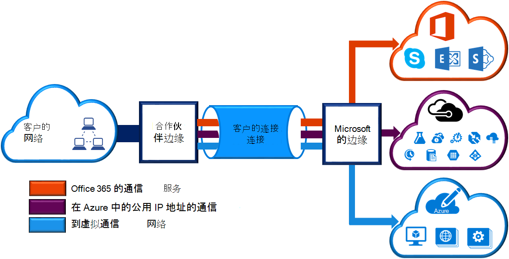
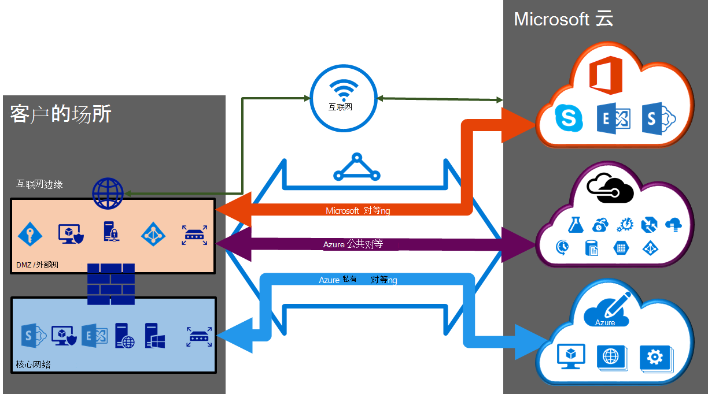

<properties 
   pageTitle="ExpressRoute 电路和路由域 |Microsoft Azure"
   description="此页概述了 ExpressRoute 电路和路由的域。"
   documentationCenter="na"
   services="expressroute"
   authors="cherylmc"
   manager="carmonm"
   editor=""/>
<tags 
   ms.service="expressroute"
   ms.devlang="na"
   ms.topic="article" 
   ms.tgt_pltfrm="na"
   ms.workload="infrastructure-services" 
   ms.date="10/10/2016"
   ms.author="cherylmc"/>

# ExpressRoute 电路和路由域

 您必须订购*ExpressRoute 电路*，通过连接提供程序连接到 Microsoft 的内部部署基础结构。 下图提供的逻辑表示形式 WAN 与 Microsoft 之间的连接。

## ExpressRoute 电路

*ExpressRoute 电路*表示内部基础结构和 Microsoft 云服务通过连接提供程序之间的逻辑连接。 您可以订购多个 ExpressRoute 电路。 每个电路可以在相同或不同的地区，并且可以连接到不同的连接提供程序通过其内部。 

ExpressRoute 电路未映射到任何物理实体。 电路由唯一标识服务键 （s 键） 称为 GUID 的标准。 服务密钥是 Microsoft、 连接提供程序，和您之间交换信息的唯一一个。 S 参数不是出于安全考虑的一个秘密。 没有 ExpressRoute 电路和 s 键之间的 1:1 映射。

ExpressRoute 电路可以有最多三个独立的 peerings: Azure 公共的 Azure 私人和 Microsoft。 每个对等为独立的 BGP 一对会话每个这些冗余配置，以实现高可用性。 还有 1: n (1 < = N < = 3) ExpressRoute 电路之间的映射和路由的域。 ExpressRoute 电路可以有任意一个、 两个或所有三个 peerings 启用每个 ExpressRoute 电路。
 
每个电路都有固定的带宽 （50 Mbps、 100 Mbps、 200 Mbps、 500 Mbps、 1 Gbps，10 Gbps） 和映射到连接提供程序和对等的位置。 您选择的带宽是在电路的所有 peerings 之间进行共享。 

### 配额、 限制和局限性

默认配额和限制适用于每个 ExpressRoute 电路。 请参阅[Azure 订阅和服务限制、 配额和限制](../azure-subscription-service-limits.md)页有关配额的最新信息。

## ExpressRoute 路由域

ExpressRoute 电路具有与之关联的多个路由域︰ Azure 公共的 Azure 私人和 Microsoft。 每个路由域配置是相同的对路由器上 (在活动或负载共享配置) 实现高可用性。 Azure 服务分为*Azure 公共*和*私有的 Azure*来表示 IP 寻址方案。

### 私人对等

可通过专用的对等域连接在虚拟网络中部署的云服务 (PaaS) 和 azure 计算服务，即为虚拟机 (IaaS)。 专用的对等域被视为受信任的扩展到 Microsoft Azure 核心网络。 您可以设置您的核心网络和 Azure 虚拟网络 (VNets) 之间的双向连接。 此对等，可以连接到虚拟机和云服务直接对其专用的 IP 地址。  

可以将多个虚拟网络连接到专用的对等域。 查看[常见问题页](expressroute-faqs.md)上的限制和局限性的信息。 您可以限制访问最新信息的[Azure 订阅和服务限制、 配额和限制](../azure-subscription-service-limits.md)页。  请参阅路由选择配置有关的详细信息的[路由](expressroute-routing.md)页面。

### 公共对等

在公用 IP 地址提供了 Azure 存储、 SQL 数据库和网站等服务。 私下可以连接到承载在公用 IP 地址，其中包括您的云服务，通过公共对等路由域的 Vip 服务。 您可以连接到您的 DMZ 的公共对等域并上其公用 IP 地址的所有 Azure 服务从您的 WAN 连接，而不必通过 internet 连接。 

连接始终与 Microsoft Azure 服务启动从您的 WAN。 Microsoft Azure 服务不能初始化连接到您网络中通过此路由域。 一旦启用了公用的对等，将能够连接到所有的 Azure 服务。 我们不允许您有选择地选择我们为其公布到路由服务。 您可以查看我们公布给您通过此对等的[Microsoft Azure 数据中心 IP 范围](http://www.microsoft.com/download/details.aspx?id=41653)页上的前缀的列表。 在页面更新每周。

若要使用所需的路由网络中，您可以定义自定义路由筛选器。 请参阅路由选择配置有关的详细信息的[路由](expressroute-routing.md)页面。 若要使用所需的路由网络中，您可以定义自定义路由筛选器。 

有关支持通过公共对等路由域服务，请参阅[常见问题页](expressroute-faqs.md)的详细信息。 
 
### Microsoft 对等

[AZURE.INCLUDE [expressroute-office365-include](../../includes/expressroute-office365-include.md)]

连接到所有其他 Microsoft 在线服务 （如 Office 365 提供服务） 将通过 Microsoft 对等。 我们让您 WAN 和微软的云服务通过 Microsoft 对等路由域之间的双向连接。 您必须拥有由您或您的连接提供的公用 IP 地址只能通过连接到 Microsoft 云服务，您必须遵循已定义的所有规则。 [ExpressRoute 系统必备组件](expressroute-prerequisites.md)页的详细信息，请参阅。

请参阅更多的信息支持服务、 成本和配置的详细信息的[常见问题页](expressroute-faqs.md)。 提供了 Microsoft 对等支持的连接提供程序的列表，请参阅信息[ExpressRoute 位置](expressroute-locations.md)页。

## 路由域比较

下表比较了三种路由域。

||**私人对等**|**公共对等**|**Microsoft 对等**|
|---|---|---|---|
|**最大值。每个对等支持 # 前缀**|默认情况下，与 ExpressRoute 特优 10000 4000|200|200|
|**支持 IP 地址范围**|在您广域网内任何有效 IPv4 地址。|由您或您连接的提供程序的公用 IPv4 地址。|由您或您连接的提供程序的公用 IPv4 地址。|
|**随着数字要求**|专用和公用为数字。 您必须拥有公众如果您选择使用一个数字。 | 专用和公用为数字。 但是，您必须证明所有权的公用 IP 地址。| 专用和公用为数字。 但是，您必须证明所有权的公用 IP 地址。|
|**路由接口 IP 地址**|RFC1918 和公用 IP 地址|在路由注册表中注册您的公用 IP 地址。| 在路由注册表中注册您的公用 IP 地址。|
|**MD5 哈希值的支持**| 是的|是的|是的|

您可以选择启用一个或多个路由域作为其 ExpressRoute 电路的一部分。 您可以选择让所有置于同一个 VPN，如果您想要将它们组合到单个路由域的路由域。 您还可以将它们放在不同路由域图很相似。 推荐的配置是对专用等直接连接到核心网络，而公共和 Microsoft 对等链接连接到您的 DMZ。
 
如果您选择让所有三个对等会话，您必须具有三对 BGP 会话 （一个对每个对等的类型）。 BGP 会话对提供高度可用的链接。 如果您要连接到图层 2 连接供应商，将负责配置和管理路由。 您可以了解通过查看 ExpressRoute 设置[工作流](expressroute-workflows.md)的详细信息。

## 下一步行动

- 查找服务提供商。 请参阅[ExpressRoute 服务提供商和位置](expressroute-locations.md)。
- 确保满足所有先决条件。 [ExpressRoute 系统必备组件](expressroute-prerequisites.md)，请参阅。
- ExpressRoute 连接配置。
    - [创建 ExpressRoute 电路](expressroute-howto-circuit-classic.md)
    - [配置路由 (电路 peerings)](expressroute-howto-routing-classic.md)
    - [链接到 ExpressRoute 电路的 VNet](expressroute-howto-linkvnet-classic.md)
