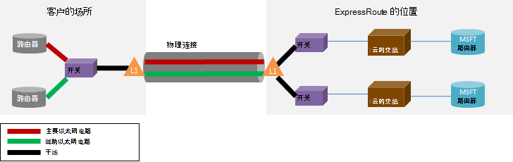

<properties
   pageTitle="ExpressRoute 的常见问题解答"
   description="ExpressRoute 常见问题解答包含有关支持 Azure 服务、 成本、 数据和连接、 SLA、 提供程序和位置、 带宽和更多技术详细信息的信息。"
   documentationCenter="na"
   services="expressroute"
   authors="cherylmc"
   manager="carmonm"
   editor=""/>
<tags
   ms.service="expressroute"
   ms.devlang="na"
   ms.topic="article" 
   ms.tgt_pltfrm="na"
   ms.workload="infrastructure-services"
   ms.date="10/10/2016"
   ms.author="cherylmc"/>

# ExpressRoute 的常见问题解答

## ExpressRoute 是什么？
ExpressRoute 是 Azure 服务，使您可以创建 Microsoft 数据中心和基础架构，以在您的场所或在也存在设施之间的专用连接。 ExpressRoute 连接不会通过公共互联网，并通过互联网提供更高安全性、 可靠性和低延迟时间比典型的连接速度。

### 使用 ExpressRoute 和专用网络连接的好处有哪些？
ExpressRoute 连接不会通过公共互联网，并通过互联网提供更高安全性、 可靠性和使用较低且一致的等待时间比典型的连接的速率。 在某些情况下，使用 ExpressRoute 连接之间的数据传输部署设备和 Azure 可以产生显著的成本优势。

### 通过 ExpressRoute 支持 Microsoft 的云服务？
ExpressRoute 支持目前包括 Office 365 的大多数 Microsoft Azure 服务。  立即查找更新上公开发行。

### 其中提供了服务。
请参阅此页服务位置和可用性︰ [ExpressRoute 合作伙伴和位置](expressroute-locations.md)。

### 如何使用 ExpressRoute 连接到 Microsoft，如果其中一个 ExpressRoute 运营商合作伙伴都没有合作关系？
可以选择区域的运营商和停放到一个受支持的交换以太网连接提供程序的位置。 您然后可以与位置提供程序的 Microsoft 对等。 检查[ExpressRoute 合作伙伴和位置](expressroute-locations.md)以查看是否存在任何交换位置服务提供商的最后一节。 然后，您可以订购 ExpressRoute 电路通过服务提供程序连接到 Azure。

### 多少？ ExpressRoute 成本
查看[定价详细信息](https://azure.microsoft.com/pricing/details/expressroute/)定价信息。

### 如果我支付的给定的带宽 ExpressRoute 电路，没有我从我的网络服务供应商采购的 VPN 连接必须是相同的速度？
不。 您可以从您的服务提供商购买的 VPN 连接的任何速度。 但是，到 Azure 的连接将被限制为您购买的 ExpressRoute 电路带宽。

### 如果我支付的给定的带宽 ExpressRoute 电路，我有爆发到更高的速度，如果需要的能力？
是的。 ExpressRoute 电路被配置为支持情况下，可以爆发免费为您购买的带宽限制最多两次。 它们是否支持此功能，请检查与您的服务提供商。

### 可以使用同一个专用网络连接与虚拟网络和其他 Azure 服务同时？
是的。 ExpressRoute 电路，一次安装程序将允许您同时访问虚拟网络中的服务和其他 Azure 服务。 您将通过连接到虚拟网络专用等路径和其他服务的公共对等路径上。

### ExpressRoute 提供服务级别协议 (SLA) 呢？
请到[ExpressRoute SLA 页面](https://azure.microsoft.com/support/legal/sla/)的详细信息，参阅。

## 支持的服务
通过 ExpressRoute 支持最 Azure 服务。

- 通过对等的专用路径支持连接到虚拟机和云服务，在虚拟的网络中部署。
- 通过公共对等路径支持的 azure 网站。
- 通过公共对等路径支持 IoT 集线器。
- Office 365 支持通过 Microsoft 等路径。
- 所有其他服务都可以访问公共对等路径上。 例外情况如下所示。

    **不支持以下服务︰**

    - CDN
    - Visual Studio 团队服务负载测试
    - 多因素身份验证
    - 通信管理器

## 数据和连接

### 有的可以使用 ExpressRoute 将传输的数据量的限制吗？
我们不设置一个限制的数据传输量。 请参阅带宽速率有关[定价的详细信息](https://azure.microsoft.com/pricing/details/expressroute/)。

### ExpressRoute 支持哪些连接速度？
支持带宽提供︰

| 50 Mbps、 100 Mbps、 200 Mbps、 500 Mbps，1Gbps，2 Gbps、 5 Gbps，10Gbps |

### 提供了哪些服务提供商？
服务提供商和位置的列表，请参阅[ExpressRoute 合作伙伴和位置](expressroute-locations.md)。

## 技术详细信息

### 将我的内部位置连接到 Azure 的技术要求是什么？
请要求，参阅[ExpressRoute 系统必备组件页](expressroute-prerequisites.md)。

### 冗余 ExpressRoute 将连接吗？
是的。 每个快速通道电路具有冗余配置对的交叉连接配置为提供高可用性。

### 如果其中一个我的 ExpressRoute 链接发生故障是否会丢失连接？
如果某个交叉连接出现故障，不会失去连接。 冗余的连接是网络的可用以支持您负载。 此外可以创建多个电路在不同的对等位置来实现故障后的恢复能力。

### 如果我不在云 exchange 并存，我的服务提供商提供点到点连接，是否需要订购我的内部网络和微软之间的两个物理连接？ 
不，如果您的服务提供商可以通过物理连接建立两个以太网虚拟电路只需一个物理连接。 物理连接 （例如一根光纤） 终止的图层上 1 (L1) 设备 （请参阅下图所示）。 使用不同的 VLAN Id，一个主电路，一个用于辅助标记两个以太网虚拟电路。 这些 VLAN Id 中外部 802.1 q 是以太网标头。 内部 802.1 q （未显示） 的以太网报头被映射到特定的[ExpressRoute 路由域](expressroute-circuit-peerings.md)。 

### 我可以扩展我的 Vlan 之一到 Azure 使用 ExpressRoute？
不。 我们不到 Azure 支持层 2 连接扩展。

### 我有我的订阅中的多个 ExpressRoute 电路？
是的。 在您的订阅，您可以有多个 ExpressRoute 电路。 专用电路数的默认限制将设置为 10。 您可以与 Microsoft 技术支持，如果需要增加的限制。

### 我可以从不同的服务提供商 ExpressRoute 电路？
是的。 您可以 ExpressRoute 电路与许多服务提供商。 每个 ExpressRoute 电路将与一个服务提供程序相关联。

### 如何将我虚拟网络连接到 ExpressRoute 电路
基本步骤如下所示。

- 必须建立 ExpressRoute 电路和启用该服务提供商。
- 您或提供程序必须配置 BGP 等 (s)。
- 您必须将虚拟网络链接到 ExpressRoute 电路。

有关更多信息，请参见[ExpressRoute 电路资源调配和电路状态的工作流](expressroute-workflows.md)。

### 还有我 ExpressRoute 电路的连接边界吗？
是的。 [ExpressRoute 合作伙伴和位置](expressroute-locations.md)页提供 ExpressRoute 电路连接边界的概述。 ExpressRoute 电路的连接被限制为单个的地缘政治区域。 可以扩展连接，以启用 ExpressRoute 高级功能跨地缘政治区域。

### 可以给多个虚拟网络 ExpressRoute 电路进行链接
是的。 您可以链接到 ExpressRoute 电路的最多 10 个虚拟网络。

### 我有多个包含虚拟网络的 Azure 订阅。 可以将连接单独订阅单个 ExpressRoute 电路中的虚拟网络？
是的。 您可以授权最多 10 个其他 Azure 订阅使用单个 ExpressRoute 电路。 可以通过启用 ExpressRoute 高级功能增加此限制。

要查看更多详细信息，请参阅[共享跨多个订阅 ExpressRoute 电路](expressroute-howto-linkvnet-arm.md)。

### 虚拟网络连接到同一电路之间的相互隔离？
不。 所有的虚拟网络链接到相同的 ExpressRoute 电路相同的路由域的一部分而不可从路由的角度看彼此隔离。 如果您需要路由隔离，您将需要创建单独的 ExpressRoute 电路。

### 我可以有一个虚拟网络连接到多个 ExpressRoute 电路？
是的。 您可以将链接达 4 ExpressRoute 电路使用的单个虚拟网络。 它们必须通过 4 种不同的[ExpressRoute 位置](expressroute-locations.md)进行排序。

### 从我的虚拟网络连接到 ExpressRoute 电路可以访问互联网？
是的。 如果未有公布默认路由 (0.0.0.0/0) 或 internet 路由前缀通过 BGP 会话，您将能够从链接到 ExpressRoute 电路虚拟网络连接到 internet。

### 我可以阻止 internet 连接到虚拟网络连接到 ExpressRoute 电路吗？
是的。 可以公布默认路由 (0.0.0.0/0)，阻止所有 internet 连接到虚拟的网络中部署的虚拟机和传送出通过 ExpressRoute 电路的所有通信。 请注意，是否公布默认工艺路线时，我们将通过公共对等 （如 Azure 存储和 SQL 数据库） 回您的场所提供的服务为强制通信。 必须配置路由器通过公共对等路径或通过互联网到 Azure 返回通信。

### 虚拟的网络链接到相同的 ExpressRoute 电路可以互相谈话吗？
是的。 在连接到相同的 ExpressRoute 电路虚拟网络中部署的虚拟机可以彼此通信。

### 可以为虚拟网络与 ExpressRoute 一起使用站点对站点连接？
是的。 ExpressRoute 可与站点到站点 Vpn 共存。

### 可以从站点对站点 / 点到站点配置为使用 ExpressRoute 移动虚拟网络？
是的。 您将需要创建虚拟网络中的 ExpressRoute 网关。 将会有小的停机时间，与该进程关联。

### 通过 ExpressRoute 连接到 Azure 存储需要什么？
必须建立 ExpressRoute 电路和配置的公共对等路由。

### 是否有我可以公布的路由的数量上的限制？
是的。 我们接受最多 4000 路由前缀专用对等和 200 每个公共对等和 Microsoft 对等。 这可以增加到 10000 路由的专用对等如果启用 ExpressRoute 高级功能。

### 是否有我可以公布对 BGP 会话的 IP 范围上的限制？
我们不接受公众和 Microsoft 对等的 BGP 会话中的专用前缀 (RFC1918)。

### 如果超过了 BGP 怎样限制？
BGP 会话将被丢弃。 前缀计数低于限制后，它们将被重置。

### ExpressRoute BGP 的保留时间是什么？ 可以调整它？
保持时间为 180。 每隔 60 秒发送保持活动状态的消息。 这些不是能更改 Microsoft 侧固定设置。

### 我向我的虚拟网络公布默认工艺路线 (0.0.0.0/0) 后，我不能激活我 Azure 的虚拟机上运行的 Windows。 我如何为解决此问题？
以下步骤将帮助 Azure 识别激活请求︰

1. 建立公共对 ExpressRoute 电路等。
2. 执行 DNS 查找和查找**kms.core.windows.net**的 IP 地址
3. 然后执行以下两项之一，以便激活请求来自 Azure 和将处理该请求，将识别密钥管理服务。
    - 在您的内部网络上传送回 Azure 通过公共对等 IP 地址 （在步骤 2 中获得） 的通信。
    - 有您 NSP 提供头发针回 Azure 通过公共对等通信。

### 是否可以更改 ExpressRoute 电路的带宽？
是的。 而无需拆卸它，可以增加 ExpressRoute 电路的带宽。 您将必须跟进连接提供程序以确保它们更新以支持带宽增加其网络内的限制。 但是不可以减少 ExpressRoute 电路的带宽。 具有较低带宽下意味着破损和 ExpressRoute 电路的娱乐。

### 如何更改 ExpressRoute 电路的带宽？
您可以更新使用更新专用电路 API 和 PowerShell cmdlet ExpressRoute 电路的带宽。

## ExpressRoute 高级

### 什么是 ExpressRoute 津贴？
ExpressRoute 高级是下面列出的功能的集合。

 - 提高了路由表限制从 4000 路由到 10000 路由的专用的对等。
 - 增加数可以连接到 ExpressRoute 电路的 VNets （默认值为 10）。 请参见下的表以了解更多详细信息。
 - 通过 Microsoft 核心网络的全球联网。 您现在能够将一个地缘政治地区与其他地区 ExpressRoute 电路 VNet 的链接。 **示例︰**您可以链接到在硅谷创建 ExpressRoute 电路在欧洲西部中创建 VNet。
 - Office 365 提供服务和在线 CRM 的连接。

### 多少的 VNets 可以链接到 ExpressRoute 电路如果我启用 ExpressRoute 津贴？
下表显示 ExpressRoute 限制和每个 ExpressRoute 电路 VNets 的数量。

[AZURE.INCLUDE [expressroute-limits](../../includes/expressroute-limits.md)]

### 如何启用 ExpressRoute 津贴？
可以启用 ExpressRoute 高级功能，该功能启用后，可以通过更新电路状态关闭。 您可以在电路创建时启用 ExpressRoute 特优或可调用 API 的更新专用电路 / PowerShell cmdlet 以启用 ExpressRoute 津贴。

### 如何禁用 ExpressRoute 津贴？
您可以禁用 ExpressRoute 特优通过调用更新专用电路 API / PowerShell cmdlet，您必须确保您具有缩放您的连接必须符合默认限制之前禁用 ExpressRoute 津贴。 我们将失败请求禁用 ExpressRoute 津贴，如果超出默认缩放您的利用率。

### 可我挑选我想从高级功能集的功能？
不。 您将不能选择您需要的功能。 当您打开 ExpressRoute 津贴，我们启用所有功能。

### 多少？ ExpressRoute 最优成本
请参阅成本[定价的详细信息](https://azure.microsoft.com/pricing/details/expressroute/)。

### 不要为计费标准 ExpressRoute 以及 ExpressRoute 津贴进行支付
是的。 ExpressRoute 高级话费在 ExpressRoute 电路费用和连接提供程序所需的费用。

## ExpressRoute 和 Office 365 服务以及在线 CRM

[AZURE.INCLUDE [expressroute-office365-include](../../includes/expressroute-office365-include.md)]

### 如何创建连接到 Office 365 提供服务和 CRM Online ExpressRoute 电路？

1. 检查[ExpressRoute 系统必备组件页面](expressroute-prerequisites.md)页后，可以确保您满足要求。
2. 查看列表中的服务提供商和[ExpressRoute 合作伙伴](expressroute-locations.md)和位置的位置，以确保您连接的需要得到满足。
3. 通过查看[网络规划和性能调优对于 Office 365](http://aka.ms/tune/)计划容量需求。
4. 请按照下面设置连接[的电路调配和电路状态的 ExpressRoute 工作流](expressroute-workflows.md)的工作流中列出的步骤。

>[AZURE.IMPORTANT] 请确保您已配置连接到 Office 365 提供服务和 CRM Online 时启用 ExpressRoute 高级加载项。

### 是否需要启用 Azure 公共对等连接到 Office 365 提供服务和 CRM Online？
否，只需启用 Microsoft Peering。 将通过 Microsoft Peering 发送到 Azure AD 身份验证通迅流。 

### 我现有的 ExpressRoute 电路可以支持 Office 365 提供服务和 CRM Online 的连接？
是的。 您现有的 ExpressRoute 电路可以将配置为支持到 Office 365 提供服务的连接。 确保您有足够的容量以连接到 Office 365 提供服务，并确保启用了高级加载项。 [网络规划和性能调优对于 Office 365](http://aka.ms/tune/)将帮助您规划您的连接的需求。 请参阅[创建和修改 ExpressRoute 电路](expressroute-howto-circuit-classic.md)。

### 服务可以通过 ExpressRoute 连接访问哪些 Office 365 吗？

请参阅[Office 365 的 Url 和 IP 地址范围](http://aka.ms/o365endpoints)的服务支持通过 ExpressRoute 的最新列表页。

### 多少？ ExpressRoute Office 365 提供服务和 CRM Online 的成本
Office 365 服务和 CRM Online 要求高级加载项，必须启用。 [定价详细信息页面](https://azure.microsoft.com/pricing/details/expressroute/)提供 ExpressRoute 的成本的详细说明。

### Office 365 的 ExpressRoute 支持在哪些地区？
列表上的合作伙伴，其中支持 ExpressRoute 的位置的详细信息，请参阅[ExpressRoute 合作伙伴和位置](expressroute-locations.md)。

### 可以访问 Office 365 通过 internet 即使在 ExpressRoute 配置为我的组织？
是的。 尽管已为您的网络配置 ExpressRoute，是可通过 internet 访问 office 365 的服务终结点。 如果您是在配置为连接到 ExpressRoute 通过 Office 365 提供服务的位置，您将连接到 ExpressRoute。

### 可以动态 AX 在线访问通过 ExpressRoute 连接吗？
否，不支持它。
