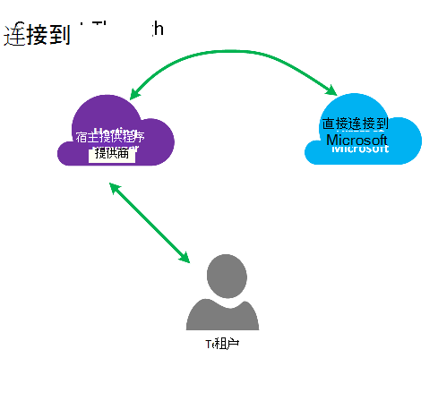
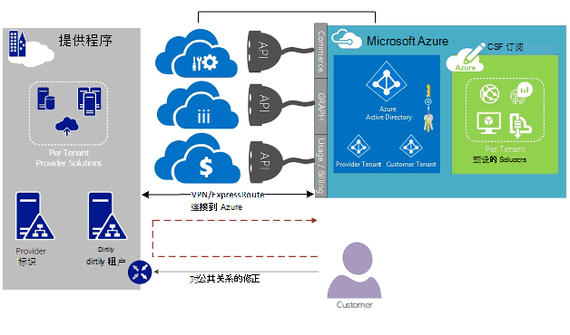
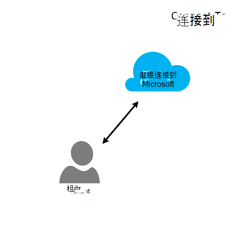
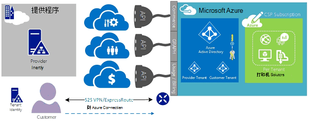
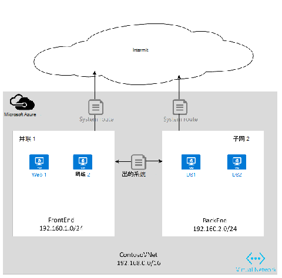

<properties
   pageTitle="Azure 的云解决方案供应商 ExpressRoute |Microsoft Azure"
   description="这篇文章提供了希望将其合并 Azure 服务的云服务提供商和 ExpressRoute 信息到他们的产品。"
   documentationCenter="na"
   services="expressroute"
   authors="richcar"
   manager="carmonm"
   editor=""/>
<tags
   ms.service="expressroute"
   ms.devlang="na"
   ms.topic="get-started-article"
   ms.tgt_pltfrm="na"
   ms.workload="infrastructure-services"
   ms.date="10/10/2016"
   ms.author="richcar"/>

# 云解决方案提供商 (CSP) 的 ExpressRoute

Microsoft 提供的超范围服务传统经销商和分销商 (CSP)，能够迅速提供新的服务和解决方案为您的客户无需投资开发这些新服务。 若要直接管理这些新服务的能力允许云解决方案提供程序 (CSP)，Microsoft 提供了程序和 Api，允许的 CSP 来替您的用户管理 Microsoft Azure 资源。 这些资源之一就是 ExpressRoute。 ExpressRoute 允许连接到 Azure 服务的现有客户资源的 CSP。 ExpressRoute 是在 Azure 服务高速专用通信链接。 

ExpresRoute 由电路实现高可用性，附加到单个客户订阅并不能由多个客户共享的一对。 每个电路应终止在不同路由器中为保持高可用性。

>[AZURE.NOTE] 这意味着，大型、 复杂的实现将对单个客户需要多个 ExpressRoute 电路的 ExpressRoute 上有带宽和连接大写。

Microsoft Azure 提供越来越多的您可以向您的客户提供的服务。  最好要采取利用这些服务需要使用 ExpressRoute 连接以提供高速度较低的滞后时间访问 Microsoft Azure 环境。

## Microsoft Azure 管理
Microsoft 提供了使用 Api 编程集成与服务管理系统，从而管理 Azure 客户订阅的 Csp。 受支持的管理功能可以找到[这里](https://msdn.microsoft.com/library/partnercenter/dn974944.aspx)。

## Microsoft Azure 资源管理
取决于您与您的客户有合同将确定订阅的管理方式。 CSP 可以直接管理的创建和维护的资源或客户可以维护 Microsoft Azure 订阅的控制创造 Azure 的资源所需。 如果您的客户管理的资源在其 Microsoft Azure 订阅创建它们将使用两种模型之一:"连接至"模型或"直接到"模型。 以下各节将详细介绍这些模型。  

### 通过连接模型

  

在连接到模型中，CSP 创建您的数据中心和客户的 Azure 订阅之间的直接连接。 使用 ExpressRoute，使用 Azure 连接您的网络进行直接连接。 然后，您的客户连接到您的网络。 这种情况需要客户通过 CSP 网络访问 Azure 服务。 

如果您的客户有不由您管理的其他 Azure 订阅，他们会使用公用的 Internet 或他们自己专用的连接连接到非 CSP 预订下提供这些服务。 

对于管理 Azure 服务的 CSP，假定 CSP 具有先前建立的客户标识存储会再复制到 Azure Active Directory CSP 订阅通过 Administrate-On-Behalf-Of (AOBO) 的管理。 此方案的关键驱动因素包括其中给定的伙伴或服务提供商已与客户建立的关系、 客户当前使用提供程序服务或合作伙伴已提供的提供者承载和 Azure 托管解决方案，以提供灵活性和地址客户难题 — 这些不满意的 CSP 单独组合的愿望。 在**图**中，下面情况下，此模型进行了说明。

### 连接到模型

在连接到模型中，服务提供商将创建客户的数据中心和客户 （客户） 通过使用 ExpressRoute 提供的 CSP Azure 订阅之间的直接连接网络。

>[AZURE.NOTE] ExpressRoute 需要客户创建和维护 ExpressRoute 电路。  

此连接方案要求，客户直接通过连接访问 CSP 管理 Azure 预订，客户网络使用创建、 拥有和管理完全或部分由客户的直接网络连接。 假定，该提供程序当前没有这些客户建立客户身份存储库，并提供有助于客户管理的 AOBO 通过其订阅到 Azure Active Directory 复制其当前标识存储。 此方案的关键驱动因素包括其中给定的伙伴或服务提供商已与客户建立的关系，客户目前使用提供程序服务或合作伙伴有希望提供仅基于 Azure 托管的解决方案，而不需要现有提供程序数据中心或基础结构的服务。

以下两个选项之间的选择基于客户的需求和您当前的需要，提供 Azure 服务。 详细信息，这些模型和关联的基于角色的访问控制、 网络和标识设计模式包括在以下链接中的详细信息︰
-   基于 Azure Active Directory**角色基于访问控制 (RBAC)** – RBAC。  Azure RBAC 的详细信息，请参阅[此处](../active-directory/role-based-access-control-configure.md)。
-   **网络**– 介绍 Microsoft Azure 中的网络的各种主题。
-   **Azure 活动目录 (AAD)** – AAD 提供标识管理 Microsoft Azure 和第三方 SaaS 应用程序。 有关 Azure 广告见[此处](https://azure.microsoft.com/documentation/services/active-directory/)。  

## 网络速度
ExpressRoute 支持从 50 Mb/s 到 10 Gb/s 的网络速度。 这使客户能够购买的针对他们的特殊环境所需的网络带宽量。

>[AZURE.NOTE] 根据需要而不中断通信，可以增加网络带宽，但以减少网络速度需要撕裂下电路和以较低的网络速度重新创建它。  

ExpressRoute 支持更好地利用更高速度连接到一个 ExpressRoute 电路的多个 vNets 的连接。 可以归同一客户的多个 Azure 订阅之间共享单个 ExpressRoute 电路。

## 配置 ExpressRoute
ExpressRoute 可以将配置为支持通过单个 ExpressRoute 电路的三种类型的通信 （[路由域](#ExpressRoute-routing-domains)）。 这种通信分为 Microsoft 对等、 Azure 公共对等和私人对等。 您可以选择一个或所有类型的通信通过单个 ExpressRoute 电路发送或使用多个 ExpressRoute 电路 ExpressRoute 电路和隔离您的客户所需的大小。 公用通信和专用通信来遍历在同一电路上，可能不允许您的客户的安全状况。

### 通过连接模型
连接到配置中您将负责所有的网络基础结构，以将您的客户的数据中心资源连接到承载 Azure 中的订阅。 每个客户想要使用 Azure 的能力将需要他们自己的 ExpressRoute 连接，这将由您管理。 您将使用相同的方法使用客户购买 ExpressRoute 电路。 您将遵循文章[ExpressRoute 工作流](./expressroute-workflows.md)电路资源调配和电路状态中概述的相同步骤。 然后，您将配置来控制内部网络和 Azure vNet 之间的通信量的边界网关协议 (BGP) 路由。

### 连接到模型
在连接到配置中，您的客户已经具有到 Azure 的现有连接或将启动连接到 internet 服务提供商从客户的数据中心的 ExpressRoute 链接直接到 Azure，而不是您的数据中心。 开始设置过程，您的客户将按上述方法在连接到模型中，按照步骤。 一旦您的客户将需要配置内部路由器，使其能够访问您的网络和 Azure vNets 已建立电路。

您可以帮助设置连接和配置路由允许您 datacenter(s) 通信与客户机资源在您的数据中心，或在 Azure 中承载的资源中的资源。

## ExpressRoute 路由域
ExpressRoute 提供了三种路由域︰ 公共、 私人和 Microsoft 对等。 每个路由域具有相同路由器在主动式 / 主动式配置为高可用性配置。 有关更多详细信息 ExpressRoute 路由域查找[此处](./expressroute-circuit-peerings.md)。

您可以定义自定义路由筛选器，以便只有您想要允许或需要 route(s)。 有关详细信息，或了解如何进行这些更改，请参阅文章︰[创建和修改路由使用 PowerShell ExpressRoute 电路](./expressroute-howto-routing-classic.md)路由筛选器有关的更多详细信息。

>[AZURE.NOTE] Microsoft 和公共对等连接必须为虽然归客户或 CSP 的公共 IP 地址并且必须遵守所有已定义的规则。 有关详细信息，请参阅[ExpressRoute 系统必备组件](expressroute-prerequisites.md)页。  

## 路由选择
ExpressRoute 连接到 Azure 网络通过 Azure 虚拟网络网关。 网络网关提供 Azure 的虚拟网络的路由。

创建 Azure 虚拟网络还将创建 vNet 直接通信到从 vNet 的子网的默认路由表。 如果默认的路由表自定义解决方案的不足，可以创建路由到自定义的装置或阻止路由到特定的子网或外部网络路由的传出通信。

### 默认路由
默认的路由表包括以下路由︰

- 在一个子网内路由
- 虚拟网络中的子网
- 互联网
- 虚拟网络与虚拟网络使用 VPN 网关
- 虚拟网络-到-内部网使用 VPN 或 ExpressRoute 网关

  

### 用户定义路由 (UDR)
用户定义路由允许分配子网到其他子网，在虚拟的网络或在任一其他预定义网关 （ExpressRoute; 互联网或 VPN） 出站通信的控制。 默认系统路由表替换替换自定义路由的默认路由表的用户定义的路由表。 使用用户定义路由时，客户可以创建防火墙等装置或入侵检测装置，对特定路由，或阻止承载用户定义工艺路线的子网访问特定的子网。 有关概述用户定义路由查找[此处](../virtual-network/virtual-networks-udr-overview.md)。 

## 安全
这取决于哪种型号是在使用中，连接到或连接到您的客户在其 vNet 中定义的安全策略或提供了安全策略要求对 CSP 可以定义其 vNets。 可以定义以下安全条件︰

1.  **客户隔离**— — Azure 平台提供客户隔离通过将客户 ID 和 vNet 的信息存储在安全数据库中，用于封装 GRE 隧道中的每个客户的流量。
2.  **网络安全组 (NSG)**规则是用于定义允许的通信传入和传出内部 vNets Azure 中的子网。 默认情况下，NSG 包含阻止规则阻止从互联网到 vNet 的通讯和允许规则 vNet 范围内的通信量。 有关网络安全组的详细信息请参考[这里](https://azure.microsoft.com/blog/network-security-groups/)。
3.  **强制隧道**— — 这是一个来自 Azure 上部署数据中心的 ExpressRoute 连接重定向绑定的互联网通信流重定向的选项。 有关强制隧道的详细信息请参考[这里](./expressroute-routing.md#advertising-default-routes)。  

4.  **加密**— 即使 ExpressRoute 电路专用于特定的客户，则可能会出现的网络供应商未能被突破，允许入侵者检查数据包通信。 为了解决这种可能性，客户或 CSP 可以加密通信通过连接通过定义 IPSec 隧道模式策略的所有通信流上的内部资源和 Azure 之间资源 (请参阅可选的隧道模式 IPSec 在图 5 中的客户 1: ExpressRoute 安全，上述)。 第二个选项将在每个终点的 ExpressRoute 电路使用防火墙装置。 这将需要其他第三方防火墙虚拟机/装置安装在前端和后端的 ExpressRoute 电路通过加密通信。

  

## 下一步行动
云解决方案提供商服务提供一种方法来提高您的值为您的客户而无需使用昂贵的基础结构和能力购买，同时保持您作为主要的外包提供商的地位。 与 Microsoft Azure 的无缝集成，可以通过 CSP API，使您可以将 Microsoft Azure 的您现有的管理框架中的管理集成。  

可以通过以下链接找到其他信息︰

[Microsoft 云解决方案提供商计划](https://partner.microsoft.com/en-US/Solutions/cloud-reseller-overview)。  
[做好准备处理作为云解决方案提供商](https://partner.microsoft.com/en-us/solutions/cloud-reseller-pre-launch)。  
[Microsoft 的云解决方案提供商的资源](https://partner.microsoft.com/en-us/solutions/cloud-reseller-resources)。
