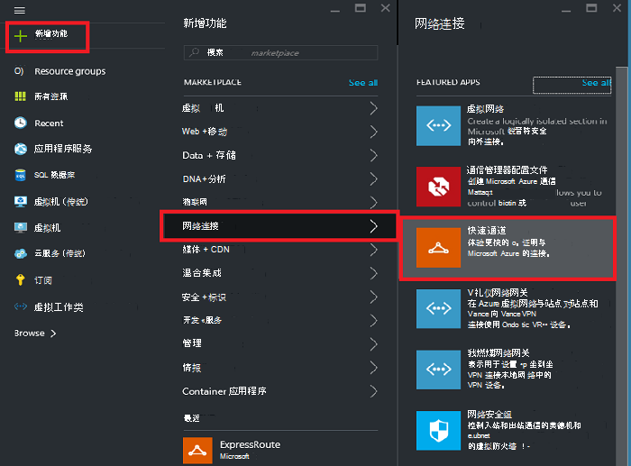
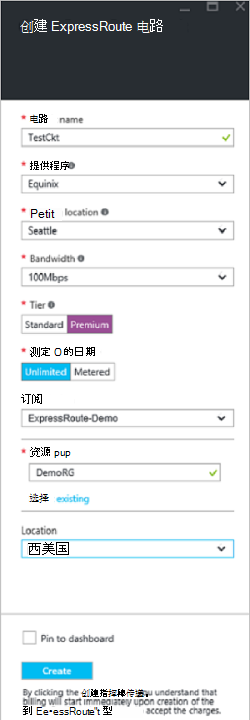
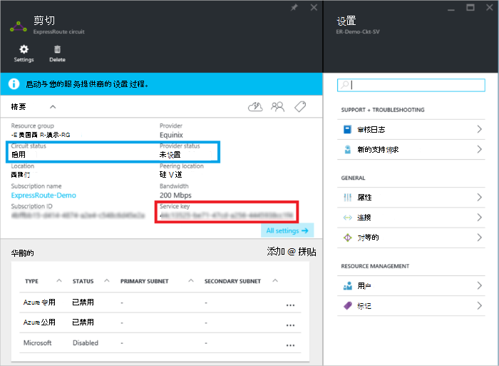
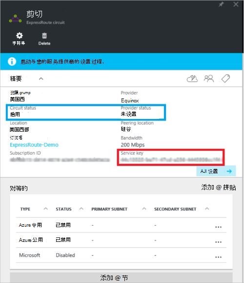
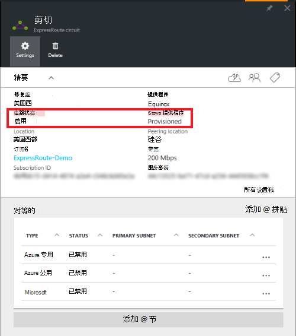

<properties
   pageTitle="创建和修改 ExpressRoute 电路，通过使用资源管理器和 Azure 的门户网站 |Microsoft Azure"
   description="本文介绍如何创建、 配置、 验证、 更新、 删除和取消设置 ExpressRoute 电路。"
   documentationCenter="na"
   services="expressroute"
   authors="cherylmc"
   manager="carmonm"
   editor=""
   tags="azure-resource-manager"/>
<tags
   ms.service="expressroute"
   ms.devlang="na"
   ms.topic="article"
   ms.tgt_pltfrm="na"
   ms.workload="infrastructure-services"
   ms.date="10/10/2016"
   ms.author="cherylmc"/>

# 创建和修改 ExpressRoute 电路

> [AZURE.SELECTOR]
[Azure 门户的资源管理器](expressroute-howto-circuit-portal-resource-manager.md)
[PowerShell 的资源管理器](expressroute-howto-circuit-arm.md)
[PowerShell 的经典](expressroute-howto-circuit-classic.md)

本文介绍如何创建使用 Azure 的门户和 Azure 资源管理器部署模型的 Azure ExpressRoute 电路。 以下步骤还显示了如何检查电路的状态、 更新，或删除和取消设置它。

**关于 Azure 的部署模型**

[AZURE.INCLUDE [vpn-gateway-clasic-rm](../../includes/vpn-gateway-classic-rm-include.md)] 

## 在开始之前

- 在开始配置之前检查[系统必备组件](expressroute-prerequisites.md)和[工作流](expressroute-workflows.md)。
- 确保您有访问[Azure 的门户](https://portal.azure.com)。
- 请确保您有权限创建新的网络资源。 如果您没有正确的权限，请联系帐户管理员。

## 创建和设置 ExpressRoute 电路

### 1.登录到 Azure 门户

从浏览器中，导航到[Azure 的门户网站](http://portal.azure.com)和使用 Azure 帐户登录。

### 2.创建新的 ExpressRoute 电路

>[AZURE.IMPORTANT] 从服务密钥颁发的时刻将货款 ExpressRoute 电路。 请确保您可以调配电路连接提供程序时执行此操作。

1. 您可以通过选择选项来创建新的资源创建 ExpressRoute 电路。 单击**新建** > **网络** > **ExpressRoute**，如下图所示︰

    

2. 单击**ExpressRoute**之后，您将看到**创建 ExpressRoute 电路**刀片式服务器。 当填写此刀片式服务器上的值的过程中时，请确保您指定正确的 SKU 层和数据计量。

    - **层**确定一种标准，ExpressRoute 或 ExpressRoute 高级加载项是否已启用。 您可以指定**标准**来获得最优加载项标准的 SKU 或**津贴**。

    - **测量数据**确定的记帐类型。 您可以指定**Metered**计量的数据计划并**无限制**无限的数据计划。 请注意，您可以从**Metered**更改计费类型，为**无限制**，但不能**无限制**的更改类型，为**Metered**。

    

>[AZURE.IMPORTANT] 需要注意的对等位置表示[的物理位置](expressroute-locations.md)，对等与 Microsoft。 这**不**会链接到"位置"属性，它指的是 Azure 网络资源提供程序所在的地理位置。 虽然它们之间没有关系，最好选择在地理位置上接近对等位置的电路网络资源提供程序。 

### 3.查看电路和属性

**查看所有电路**

您可以查看您创建的选择左侧菜单上的**所有资源**的所有电路。
    

**查看属性**

    You can view the properties of the circuit by selecting it. On this blade, note the service key for the circuit. You must copy the circuit key for your circuit and pass it down to the service provider to complete the provisioning process. The circuit key is specific to your circuit.

### 4.服务密钥发送给您的连接的提供程序的资源调配

此刀片，在**提供程序状态**提供了服务提供商一侧设置的当前状态的信息。 **电路状态**提供 Microsoft 一侧的状态。 有关电路供应状态的详细信息，请参阅[工作流](expressroute-workflows.md#expressroute-circuit-provisioning-states)项目。

当您创建新的 ExpressRoute 电路时，电路将处于以下状态︰

提供程序状态︰ 未设置 
电路状态︰ 启用

在连接提供程序的过程中为您启用，电路将更改到以下状态︰

提供程序状态︰ 资源调配 
电路状态︰ 启用

您可以使用 ExpressRoute 电路，它必须是处于以下状态︰

提供程序状态︰ 设置 
电路状态︰ 启用

### 5.定期检查的状态和电路键的状态

可以查看属性的兴趣进行选择的电路。 检查**提供程序状态**并确保它已移动到**Provisioned**然后再继续。

### 6.创建路由配置

有关分步说明，请参阅创建和修改电路 peerings 的[ExpressRoute 电路路由配置](expressroute-howto-routing-portal-resource-manager.md)项目。

>[AZURE.IMPORTANT] 以下说明仅适用于与提供层 2 连接服务的服务提供程序创建的电路。 如果您使用的提供托管服务提供商图层 3 服务 (通常 IP VPN，像 MPLS)，连接提供程序将配置和管理路由为您。

### 7.链接到 ExpressRoute 电路虚拟网络

接下来，将虚拟网络链接到 ExpressRoute 电路。 使用资源管理器部署模型时，请使用[链接到 ExpressRoute 电路的虚拟网络](expressroute-howto-linkvnet-arm.md)文章。

## 获取 ExpressRoute 电路的状态

您可以选择查看电路的状态。 

## 修改 ExpressRoute 电路

您可以修改 ExpressRoute 电路的某些属性，而不会影响连接。 到目前为止，不能通过使用 Azure 门户修改 ExpressRoute 电路属性。 但是，您可以使用 PowerShell 修改电路属性。 有关详细信息，请参阅[修改使用 PowerShell ExpressRoute 电路](expressroute-howto-circuit-arm.md#modify)的部分。

您可以执行以下操作而不需要停机︰

- 启用或禁用 ExpressRoute 电路 ExpressRoute 高级加载项。

- 增加 ExpressRoute 电路的带宽。 请注意，不支持降级电路的带宽。 

- 从计量数据计量计划变成无限的数据。 请注意，不支持将计量计划从无限的数据更改为计量数据。

-  您可以启用和禁用**允许经典操作**。

有关限制和限制的详细信息，请参阅[ExpressRoute 的常见问题解答](expressroute-faqs.md)。

## 撤消和删除 ExpressRoute 电路

您可以通过选择**删除**图标来删除 ExpressRoute 电路。 请注意以下事项︰

- 必须取消所有的虚拟网络，从 ExpressRoute 电路。 如果此操作失败，请检查是否任何虚拟网络链接到电路。

- **资源调配**或**Provisioned** ExpressRoute 电路服务提供程序设置状态是否必须与您的服务提供商，以取消设置其侧电路中进行合作。 我们将继续保留资源和服务提供商完成撤消电路并通知我们之前向您收取费用。

- 如果服务提供商具有 deprovisioned 的电路 （服务提供商设置状态设置为**未设置**），然后可以删除电路。 这将停止电路的帐单

## 下一步行动

创建您的电路后，请确保您进行以下︰

- [创建和修改 ExpressRoute 电路的路由](expressroute-howto-routing-portal-resource-manager.md)
- [将虚拟网络链接到 ExpressRoute 电路](expressroute-howto-linkvnet-arm.md)
