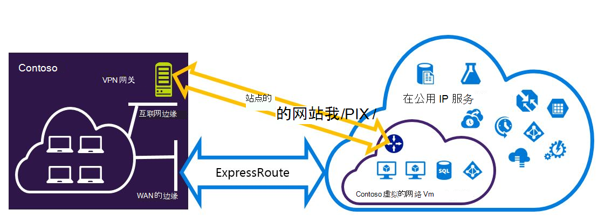
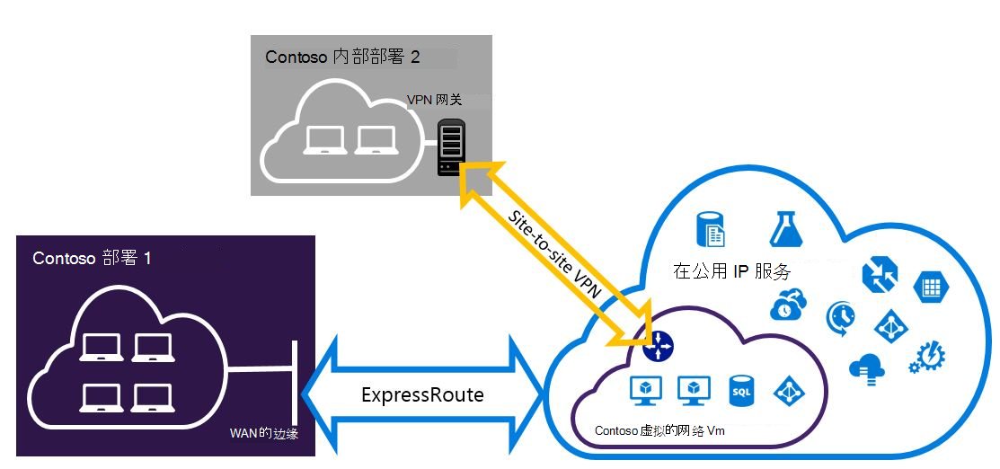

<properties
   pageTitle="配置可以共存为资源管理器部署模型的 Expressroute 和站点到站点 VPN 连接 |Microsoft Azure"
   description="这篇文章将引导您完成配置 ExpressRoute 和模型资源管理器可以共存的站点到站点 VPN 连接。"
   documentationCenter="na"
   services="expressroute"
   authors="charwen"
   manager="carmonm"
   editor=""
   tags="azure-resource-manager"/>
<tags
   ms.service="expressroute"
   ms.devlang="na"
   ms.topic="get-started-article"
   ms.tgt_pltfrm="na"
   ms.workload="infrastructure-services"
   ms.date="10/10/2016"
   ms.author="charleywen"/>

# ExpressRoute 和站点的共存为配置连接资源管理器部署模型

> [AZURE.SELECTOR]
- [PowerShell 的资源管理器](expressroute-howto-coexist-resource-manager.md)
- [PowerShell 的经典](expressroute-howto-coexist-classic.md)

能够配置站点到站点 VPN 和 ExpressRoute 有很多优点。 您可以为 ExressRoute，为安全的故障切换路径配置站点到站点 VPN 或使用站点到站点 Vpn 连接到未连接到 ExpressRoute 的网站。 我们将介绍配置这两种情况，本文中的步骤。 本文应用至资源管理器的部署模型。 这种配置不是 Azure 门户中可用。

**关于 Azure 的部署模型**

[AZURE.INCLUDE [vpn-gateway-clasic-rm](../../includes/vpn-gateway-classic-rm-include.md)] 

>[AZURE.IMPORTANT] 请按照下面的说明操作之前，必须预先配置 ExpressRoute 电路。 请确保已遵循[ExpressRoute 电路的创建](expressroute-howto-circuit-arm.md)和[配置路由](expressroute-howto-routing-arm.md)指南之前执行以下步骤。

## 限制和局限性

- **不支持传输路由。** 您不能通过站点到站点 VPN 连接本地网络和通过 ExpressRoute 连接本地网络之间路由 （通过 Azure)。
- **不支持基本的 SKU 网关。** [ExpressRoute 网关](expressroute-about-virtual-network-gateways.md)和[VPN 网关](../vpn-gateway/vpn-gateway-about-vpngateways.md)，则必须使用非基本 SKU 网关。
- **支持仅基于路由的 VPN 网关。** 您必须使用一个基于路由的[VPN 网关](../vpn-gateway/vpn-gateway-about-vpngateways.md)。
- **VPN 网关配置静态路由。** 如果您的本地网络连接到 ExpressRoute 和站点到站点 VPN，您必须在您的本地网络路由到公用的 Internet 站点到站点 VPN 连接中配置的静态路由。
- **必须首先配置 ExpressRoute 网关。** 添加站点到站点 VPN 网关之前，您必须首先创建 ExpressRoute 网关。

## 配置设计

### ExpressRoute 站点到站点 VPN 配置为故障转移路径

对于 ExpressRoute，可以作为备份配置站点到站点 VPN 连接。 这仅适用于虚拟的网络链接到 Azure 的专用等路径。 通过 Azure 公用和 Microsoft peerings 是没有基于 VPN 的故障切换解决方案的服务。 ExpressRoute 电路始终是主链接。 数据将只有 ExpressRoute 电路失败流动的站点到站点 VPN 路径。
>[AZURE.NOTE] 虽然 ExpressRoute 电路首选站点到站点 VPN 通过这两种工艺路线相同时，Azure 将使用 longuest 前缀匹配选择向与数据包目标的路由。

### 配置站点到站点 VPN 连接到未连接到 ExpressRoute 的网站

您可以配置您的网络，其中一些网站通过站点到站点 VPN 连接直接到 Azure，某些站点连接到 ExpressRoute。 

>[AZURE.NOTE] 不能配置虚拟网络为传输路由器。

## 选择要使用的步骤

有两组不同的过程，可供选择来配置连接可以共存的。 您选择的配置过程取决于您是否有一个现有的虚拟网络，您想要连接，或者您想要创建新的虚拟网络。

- 我不要有 VNet，需要创建一个。
    
    如果没有虚拟网络，此过程将引导您完成创建新的虚拟网络使用资源管理器部署模型和创建新的 ExpressRoute 和站点到站点 VPN 连接。 若要配置，请按照文章部分，[若要创建新的虚拟网络和共存的连接](#new)。

- 我已经有一个资源管理器部署模型 VNet。

    在与现有的站点到站点 VPN 连接或 ExpressRoute 连接的地方，可能已拥有虚拟网络。 [已有的 VNet coexsiting 连接中配置](#add)节将指导您完成删除网关，然后再创建新的 ExpressRoute 和站点到站点 VPN 连接。 请注意，在创建新的连接时，必须完成步骤中非常特定的顺序。 不要使用说明在其他文章中来创建您的网关和连接。

    在此过程中，创建可以共存的连接将需要您删除您的网关，然后配置新的网关。 这意味着您必须删除并重新创建您的网关和连接，但您不需要将任何虚拟机或服务迁移到新的虚拟网络跨内部连接的停机时间。 您的虚拟机和服务将仍能向外传播，通过负载平衡器时您配置您的网关，如果它们配置来执行此操作。

## 若要创建新的虚拟网络和共存的连接

此过程将指导您完成创建 VNet 并创建站点对站点和 ExpressRoute 连接可以共存的。
    
1. 您将需要安装最新版本的 Azure PowerShell cmdlet。 有关安装 PowerShell cmdlet 的详细信息，请参阅[如何安装和配置 Azure PowerShell](../powershell-install-configure.md) 。 请注意您将使用此配置的 cmdlet 可能比您可能已熟悉略有不同。 一定要使用这些指令中指定的 cmdlet。

2. 登录您的帐户和设置环境。
    
        login-AzureRmAccount
        Select-AzureRmSubscription -SubscriptionName 'yoursubscription'
        $location = "Central US"
        $resgrp = New-AzureRmResourceGroup -Name "ErVpnCoex" -Location $location

3. 创建虚拟网络包括网关的子网。 有关虚拟网络配置的详细信息，请参阅[Azure 虚拟网络配置](../virtual-network/virtual-networks-create-vnet-arm-ps.md)。

    >[AZURE.IMPORTANT] 网关网必须是 /27 或更短的前缀 （如 /26 或 /25）。
    
    创建新的 VNet。

        $vnet = New-AzureRmVirtualNetwork -Name "CoexVnet" -ResourceGroupName $resgrp.ResourceGroupName -Location $location -AddressPrefix "10.200.0.0/16" 

    添加子网。

        Add-AzureRmVirtualNetworkSubnetConfig -Name "App" -VirtualNetwork $vnet -AddressPrefix "10.200.1.0/24"
        Add-AzureRmVirtualNetworkSubnetConfig -Name "GatewaySubnet" -VirtualNetwork $vnet -AddressPrefix "10.200.255.0/24"

    保存 VNet 配置。

        $vnet = Set-AzureRmVirtualNetwork -VirtualNetwork $vnet

4. 创建的 ExpressRoute 网关。 ExpressRoute 网关配置有关的详细信息，请参阅[ExpressRoute 网关配置](expressroute-howto-add-gateway-resource-manager.md)。 GatewaySKU 必须是*标准*的*高性能*或*UltraPerformance*。

        $gwSubnet = Get-AzureRmVirtualNetworkSubnetConfig -Name "GatewaySubnet" -VirtualNetwork $vnet
        $gwIP = New-AzureRmPublicIpAddress -Name "ERGatewayIP" -ResourceGroupName $resgrp.ResourceGroupName -Location $location -AllocationMethod Dynamic
        $gwConfig = New-AzureRmVirtualNetworkGatewayIpConfig -Name "ERGatewayIpConfig" -SubnetId $gwSubnet.Id -PublicIpAddressId $gwIP.Id
        $gw = New-AzureRmVirtualNetworkGateway -Name "ERGateway" -ResourceGroupName $resgrp.ResourceGroupName -Location $location -IpConfigurations $gwConfig -GatewayType "ExpressRoute" -GatewaySku Standard 

5. 链接到 ExpressRoute 电路的 ExpressRoute 网关。 在完成此步骤后，被建立内部网络和 Azure，ExpressRoute，通过之间的连接。 有关链接操作的详细信息，请参阅[链接 VNets 到 ExpressRoute](expressroute-howto-linkvnet-arm.md)。

        $ckt = Get-AzureRmExpressRouteCircuit -Name "YourCircuit" -ResourceGroupName "YourCircuitResourceGroup"
        New-AzureRmVirtualNetworkGatewayConnection -Name "ERConnection" -ResourceGroupName $resgrp.ResourceGroupName -Location $location -VirtualNetworkGateway1 $gw -PeerId $ckt.Id -ConnectionType ExpressRoute

6. 接下来，创建您的站点到站点 VPN 网关。 VPN 网关配置有关的详细信息，请参阅[配置站点对站点连接 VNet](../vpn-gateway/vpn-gateway-create-site-to-site-rm-powershell.md)。 GatewaySKU 必须是*标准*的*高性能*或*UltraPerformance*。 VpnType 必须*RouteBased*。

        $gwSubnet = Get-AzureRmVirtualNetworkSubnetConfig -Name "GatewaySubnet" -VirtualNetwork $vnet
        $gwIP = New-AzureRmPublicIpAddress -Name "VPNGatewayIP" -ResourceGroupName $resgrp.ResourceGroupName -Location $location -AllocationMethod Dynamic
        $gwConfig = New-AzureRmVirtualNetworkGatewayIpConfig -Name "VPNGatewayIpConfig" -SubnetId $gwSubnet.Id -PublicIpAddressId $gwIP.Id
        New-AzureRmVirtualNetworkGateway -Name "VPNGateway" -ResourceGroupName $resgrp.ResourceGroupName -Location $location -IpConfigurations $gwConfig -GatewayType "Vpn" -VpnType "RouteBased" -GatewaySku "Standard"

    Azure 的 VPN 网关支持 BGP。 您可以在以下命令中指定-EnableBgp。

        $azureVpn = New-AzureRmVirtualNetworkGateway -Name "VPNGateway" -ResourceGroupName $resgrp.ResourceGroupName -Location $location -IpConfigurations $gwConfig -GatewayType "Vpn" -VpnType "RouteBased" -GatewaySku "Standard" -EnableBgp $true

    您可以找到对等 IP 和 Azure 使用 VPN 网关在 $azureVpn.BgpSettings.BgpPeeringAddress 和 $azureVpn.BgpSettings.Asn AS 编号 BGP。 有关详细信息，请参阅 Azure VPN 网关的[配置 BGP](../vpn-gateway/vpn-gateway-bgp-resource-manager-ps.md) 。

7. 创建一个本地站点的 VPN 网关实体。 此命令不会将内部部署 VPN 网关配置。 相反，它使您可以提供本地网关设置，如公用 IP 和本地地址空间，以便 Azure VPN 网关可以连接到它。

    如果您本地的 VPN 设备仅支持静态路由，您可以按以下方式配置的静态路由。

        $MyLocalNetworkAddress = @("10.100.0.0/16","10.101.0.0/16","10.102.0.0/16")
        $localVpn = New-AzureRmLocalNetworkGateway -Name "LocalVPNGateway" -ResourceGroupName $resgrp.ResourceGroupName -Location $location -GatewayIpAddress *<Public IP>* -AddressPrefix $MyLocalNetworkAddress

    如果您本地的 VPN 设备支持 BGP 并且想要启用动态路由，您需要知道对等 IP 和您本地的 VPN 设备使用 AS 编号 BGP。

        $localVPNPublicIP = "<Public IP>"
        $localBGPPeeringIP = "<Private IP for the BGP session>"
        $localBGPASN = "<ASN>"
        $localAddressPrefix = $localBGPPeeringIP + "/32"
        $localVpn = New-AzureRmLocalNetworkGateway -Name "LocalVPNGateway" -ResourceGroupName $resgrp.ResourceGroupName -Location $location -GatewayIpAddress $localVPNPublicIP -AddressPrefix $localAddressPrefix -BgpPeeringAddress $localBGPPeeringIP -Asn $localBGPASN

8. 配置本地 VPN 设备连接到新的 Azure VPN 网关。 VPN 设备配置有关的详细信息，请参阅[VPN 设备配置](../vpn-gateway/vpn-gateway-about-vpn-devices.md)。

9. 链接到本地网关在 Azure 上的站点到站点 VPN 网关。

        $azureVpn = Get-AzureRmVirtualNetworkGateway -Name "VPNGateway" -ResourceGroupName $resgrp.ResourceGroupName
        New-AzureRmVirtualNetworkGatewayConnection -Name "VPNConnection" -ResourceGroupName $resgrp.ResourceGroupName -Location $location -VirtualNetworkGateway1 $azureVpn -LocalNetworkGateway2 $localVpn -ConnectionType IPsec -SharedKey <yourkey>

## 若要配置已有的 VNet 的 coexsiting 连接

如果您有一个现有的虚拟网络，请检查网关网大小。 如果网关网是 /28 或 /29，必须首先删除虚拟网络网关和子网增大网关。 本节中的步骤显示如何做到这一点。

如果网关网是 /27 或更大的虚拟网络连接通过 ExpressRoute，您可以跳过下面的步骤并进入["第 6 步-创建的站点到站点 VPN 网关"](#vpngw)一节中。 

>[AZURE.NOTE] 当您删除现有的网关时，您本地的场所将丢失与虚拟网络连接正在使用此配置。 

1. 您将需要安装最新版本的 Azure PowerShell cmdlet。 有关安装 PowerShell cmdlet 的详细信息，请参阅[如何安装和配置 Azure PowerShell](../powershell-install-configure.md) 。 请注意您将使用此配置的 cmdlet 可能比您可能已熟悉略有不同。 一定要使用这些指令中指定的 cmdlet。 

2. 删除现有的 ExpressRoute 或站点到站点 VPN 网关。 

        Remove-AzureRmVirtualNetworkGateway -Name <yourgatewayname> -ResourceGroupName <yourresourcegroup>

3. 删除子网网关。
        
        $vnet = Get-AzureRmVirtualNetwork -Name <yourvnetname> -ResourceGroupName <yourresourcegroup> 
        Remove-AzureRmVirtualNetworkSubnetConfig -Name GatewaySubnet -VirtualNetwork $vnet

4. 添加网关子网是 /27 或更大。
    >[AZURE.NOTE] 如果您没有足够留在虚拟网络子网增大网关的 IP 地址，需要添加多个 IP 地址空间。

        $vnet = Get-AzureRmVirtualNetwork -Name <yourvnetname> -ResourceGroupName <yourresourcegroup>
        Add-AzureRmVirtualNetworkSubnetConfig -Name "GatewaySubnet" -VirtualNetwork $vnet -AddressPrefix "10.200.255.0/24"

    保存 VNet 配置。

        $vnet = Set-AzureRmVirtualNetwork -VirtualNetwork $vnet

5. 在这种情况下，您将有没有网关 VNet。 若要创建新网关并完成您的连接，就可以继续[步骤 4-创建 ExpressRoute 网关](#gw)，发现在前面的步骤集。

## 若要将点到站点配置添加到 VPN 网关
您可以按照下面的步骤来将点到站点配置添加到 VPN 网关在共存的设置。

1. 添加 VPN 客户端地址池。 

        $azureVpn = Get-AzureRmVirtualNetworkGateway -Name "VPNGateway" -ResourceGroupName $resgrp.ResourceGroupName
        Set-AzureRmVirtualNetworkGatewayVpnClientConfig -VirtualNetworkGateway $azureVpn -VpnClientAddressPool "10.251.251.0/24"

2. VPN 网关将上载到 Azure VPN 根证书。 在此示例中，假定︰ 根证书存储在本地计算机运行下列 PowerShell cmdlet 的位置。 

        $p2sCertFullName = "RootErVpnCoexP2S.cer"
        $p2sCertMatchName = "RootErVpnCoexP2S"
        $p2sCertToUpload=get-childitem Cert:\CurrentUser\My | Where-Object {$_.Subject -match $p2sCertMatchName}
        if ($p2sCertToUpload.count -eq 1){
            write-host "cert found"
        } else {
            write-host "cert not found"
            exit
        } 
        $p2sCertData = [System.Convert]::ToBase64String($p2sCertToUpload.RawData)
        Add-AzureRmVpnClientRootCertificate -VpnClientRootCertificateName $p2sCertFullName -VirtualNetworkGatewayname $azureVpn.Name -ResourceGroupName $resgrp.ResourceGroupName -PublicCertData $p2sCertData

点到站点 VPN 的详细信息，请参阅[配置点到站点连接](../vpn-gateway/vpn-gateway-howto-point-to-site-rm-ps.md)。

## 下一步行动

有关 ExpressRoute 的详细信息，请参阅[ExpressRoute 的常见问题解答](expressroute-faqs.md)。
