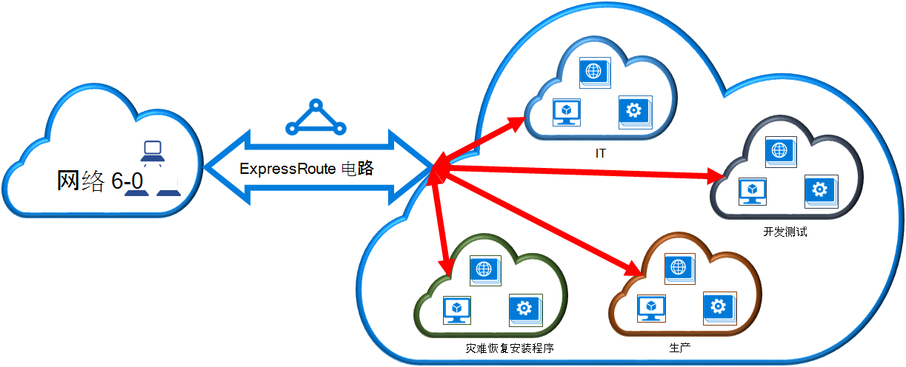

<properties
   pageTitle="链接到 ExpressRoute 电路虚拟网络，通过使用传统部署模型和 PowerShell |Microsoft Azure"
   description="本文概述如何链接虚拟网络 (VNets) 到 ExpressRoute 电路使用传统部署模型和 PowerShell。"
   services="expressroute"
   documentationCenter="na"
   authors="ganesr"
   manager="carmonm"
   editor=""
   tags="azure-service-management"/>
<tags
   ms.service="expressroute"
   ms.devlang="na"
   ms.topic="article"
   ms.tgt_pltfrm="na"
   ms.workload="infrastructure-services"
   ms.date="10/10/2016"
   ms.author="ganesr" />

# 将虚拟网络链接到 ExpressRoute 电路

> [AZURE.SELECTOR]
- [Azure 门户的资源管理器](expressroute-howto-linkvnet-portal-resource-manager.md)
- [PowerShell 的资源管理器](expressroute-howto-linkvnet-arm.md)
- [PowerShell 的经典](expressroute-howto-linkvnet-classic.md)

这篇文章将帮助您链接到 Azure ExpressRoute 电路虚拟网络 (VNets)，使用 PowerShell 和经典的部署模型。 虚拟的网络可以在相同的订阅，也可以是另一个订阅的一部分。

**关于 Azure 的部署模型**

[AZURE.INCLUDE [vpn-gateway-clasic-rm](../../includes/vpn-gateway-classic-rm-include.md)]

## 配置系统必备组件

1. 您需要最新版本的 Azure PowerShell 模块。 您可以从[Azure 下载页面](https://azure.microsoft.com/downloads/)的 PowerShell 部分下载最新的 PowerShell 模块。 有关如何将计算机配置为使用 Azure PowerShell 模块按照分步指导说明如何[安装和配置 Azure PowerShell](../powershell-install-configure.md) 。
2. 您需要在开始配置之前检查[系统必备组件](expressroute-prerequisites.md)、[路由的要求](expressroute-routing.md)和[工作流](expressroute-workflows.md)。
3. 您必须具有活动的 ExpressRoute 电路。
    - 按照说明[创建 ExpressRoute 电路](expressroute-howto-circuit-classic.md)，并且具有连接提供程序启用电路。
    - 确保您有 Azure 专用对等配置为您的电路。 请参阅[配置路由](expressroute-howto-routing-classic.md)路由的说明的文章。
    - 确保 Azure 专用对等配置，以便您可以启用的端到端连接您的网络和 Microsoft 之间的 BGP 对等是向上。
    - 您必须具有一个虚拟网络和虚拟网络网关创建且完全配置。 按照[ExpressRoute 的虚拟网络](expressroute-howto-vnet-portal-classic.md)配置的说明。

您可以链接到 ExpressRoute 电路的最多 10 个虚拟网络。 所有的虚拟网络必须是在同一的地缘政治区域。 您可以将链接更多的虚拟网络为您 ExpressRoute 电路或如果启用 ExpressRoute 高级加载项位于其他地缘政治区域的链接虚拟网络。 检查高级加载项的详细的[常见问题解答](expressroute-faqs.md)。

## 在相同的订阅将虚拟网络连接到电路

您可以使用以下 cmdlet 虚拟网络链接到 ExpressRoute 电路。 确保虚拟网络网关创建并链接之前运行该 cmdlet 的准备。

    New-AzureDedicatedCircuitLink -ServiceKey "*****************************" -VNetName "MyVNet"
    Provisioned

## 在不同的订阅将虚拟网络连接到电路

您可以跨多个订阅共享 ExpressRoute 电路。 下图显示一个简单的跨多个订阅共享如何起作用，对 ExpressRoute 电路的示意图。

每个较小的群，大群中用于表示属于组织内部的不同部门的订阅。 每个组织内的部门可以使用他们自己订阅部署他们的服务--但部门可以共享单个 ExpressRoute 电路连接回您的内部网络。 一个部门 (在此示例中︰ IT) 可以拥有 ExpressRoute 电路。 在组织内的其他订阅可以使用 ExpressRoute 电路。

>[AZURE.NOTE] 专用的电路连接和带宽费用将应用于 ExpressRoute 电路所有者。 所有的虚拟网络共享相同的带宽。

### 管理

*电路的所有者*是管理员/coadministrator ExpressRoute 电路在其中创建的订阅。 电路所有者可以授权管理员/coadministrators 的其它预订，称为*电路的用户*，使用他们所拥有的专用的电路。 有权使用组织的 ExpressRoute 电路的电路用户可以链接到 ExpressRoute 电路中其订阅的虚拟网络后他们被授权。

电路所有者有权修改并随时撤销授权。 撤销授权将导致正在从其访问权限被吊销该订阅中删除所有链接。

### 电路的所有者操作

#### 创建授权

其他订阅的管理员可以使用指定的电路的电路所有者授予的权限。 在以下示例中，电路 (Contoso IT) 管理员使另一个订阅 （适用于开发人员测试） 链接到电路的最多两个虚拟网络的管理员。 Contoso IT 管理员可以做到这一点指定 Microsoft 开发测试 id。 该 cmdlet 不发送电子邮件到指定的 Microsoft id。 需要明确通知其他预订所有者授权已完成电路所有者。

    New-AzureDedicatedCircuitLinkAuthorization -ServiceKey "**************************" -Description "Dev-Test Links" -Limit 2 -MicrosoftIds 'devtest@contoso.com'

    Description         : Dev-Test Links
    Limit               : 2
    LinkAuthorizationId : **********************************
    MicrosoftIds        : devtest@contoso.com
    Used                : 0

#### 检查授权

电路所有者可以查看特定电路通过运行以下 cmdlet 发布的所有授权︰

    Get-AzureDedicatedCircuitLinkAuthorization -ServiceKey: "**************************"

    Description         : EngineeringTeam
    Limit               : 3
    LinkAuthorizationId : ####################################
    MicrosoftIds        : engadmin@contoso.com
    Used                : 1

    Description         : MarketingTeam
    Limit               : 1
    LinkAuthorizationId : @@@@@@@@@@@@@@@@@@@@@@@@@@@@@@@@@@@@
    MicrosoftIds        : marketingadmin@contoso.com
    Used                : 0

    Description         : Dev-Test Links
    Limit               : 2
    LinkAuthorizationId : &&&&&&&&&&&&&&&&&&&&&&&&&&&&&&&&&&&&
    MicrosoftIds        : salesadmin@contoso.com
    Used                : 2

#### 更新的授权

通过使用以下 cmdlet，电路所有者可以修改授权︰

    Set-AzureDedicatedCircuitLinkAuthorization -ServiceKey "**************************" -AuthorizationId "&&&&&&&&&&&&&&&&&&&&&&&&&&&&"-Limit 5

    Description         : Dev-Test Links
    Limit               : 5
    LinkAuthorizationId : &&&&&&&&&&&&&&&&&&&&&&&&&&&&&&&&&&&&&&
    MicrosoftIds        : devtest@contoso.com
    Used                : 0

#### 删除授权

电路所有者可以撤销或删除授权的用户通过运行以下 cmdlet:

    Remove-AzureDedicatedCircuitLinkAuthorization -ServiceKey "*****************************" -AuthorizationId "###############################"

### 电路的用户操作

#### 检查授权

该电路用户可以通过使用以下 cmdlet 审阅授权︰

    Get-AzureAuthorizedDedicatedCircuit

    Bandwidth                        : 200
    CircuitName                      : ContosoIT
    Location                         : Washington DC
    MaximumAllowedLinks              : 2
    ServiceKey                       : &&&&&&&&&&&&&&&&&&&&&&&&&&&&&&&&&&&&
    ServiceProviderName              : equinix
    ServiceProviderProvisioningState : Provisioned
    Status                           : Enabled
    UsedLinks                        : 0

#### 获取链接的授权

电路的用户可以运行以下 cmdlet 兑换链接授权︰

    New-AzureDedicatedCircuitLink –servicekey "&&&&&&&&&&&&&&&&&&&&&&&&&&" –VnetName 'SalesVNET1'

    State VnetName
    ----- --------
    Provisioned SalesVNET1

## 下一步行动

有关 ExpressRoute 的详细信息，请参阅[ExpressRoute 的常见问题解答](expressroute-faqs.md)。
