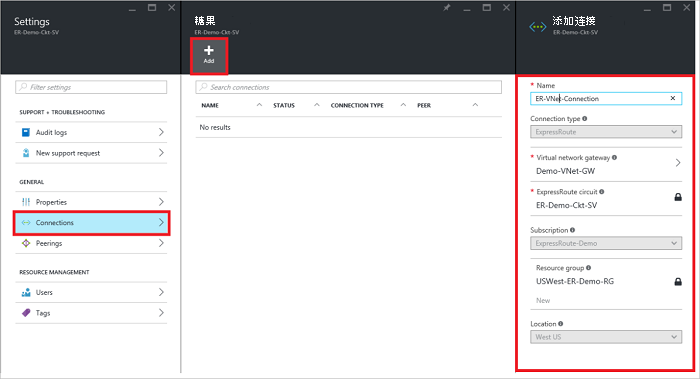
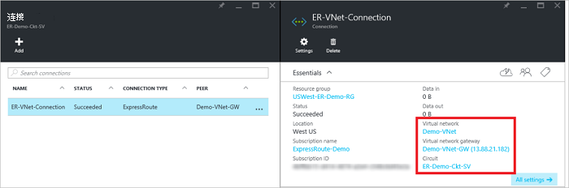

<properties
   pageTitle="使用资源管理器部署模型和 Azure 门户网站链接到 ExpressRoute 电路虚拟网络 |Microsoft Azure"
   description="本文档概述了如何将虚拟网络 (VNets) 链接到 ExpressRoute 的电路。"
   services="expressroute"
   documentationCenter="na"
   authors="cherylmc"
   manager="carmonm"
   editor=""
   tags="azure-resource-manager"/>
<tags
   ms.service="expressroute"
   ms.devlang="na"
   ms.topic="article"
   ms.tgt_pltfrm="na"
   ms.workload="infrastructure-services"
   ms.date="10/10/2016"
   ms.author="cherylmc" />

# 将虚拟网络链接到 ExpressRoute 电路

> [AZURE.SELECTOR]
- [Azure 门户的资源管理器](expressroute-howto-linkvnet-portal-resource-manager.md)
- [PowerShell 的资源管理器](expressroute-howto-linkvnet-arm.md)
- [PowerShell 的经典](expressroute-howto-linkvnet-classic.md)

这篇文章将帮助您使用资源管理器部署模型和 Azure 门户网站链接到 Azure ExpressRoute 电路虚拟网络 (VNets)。 虚拟网络可在相同的订阅中，或者可以是另一个订阅的一部分。

**关于 Azure 的部署模型**

[AZURE.INCLUDE [vpn-gateway-clasic-rm](../../includes/vpn-gateway-classic-rm-include.md)]

## 配置系统必备组件

- 请确保您已查看了[先决条件](expressroute-prerequisites.md)、[路由的要求](expressroute-routing.md)，以及[工作流](expressroute-workflows.md)开始配置之前。
- 您必须具有活动的 ExpressRoute 电路。
    - 按照说明[创建 ExpressRoute 电路](expressroute-howto-circuit-arm.md)，具有电路连接提供程序启用。

    - 确保您有 Azure 专用对等配置为您的电路。 请参阅[配置路由](expressroute-howto-routing-portal-resource-manager.md)路由的说明的文章。

    - 确保 Azure 专用对等配置，以便您可以启用的端到端连接您的网络和 Microsoft 之间的 BGP 对等是向上。

    - 确保您有一个虚拟网络和虚拟网络网关创建且完全配置。 按照说明创建[VPN 网关](../articles/vpn-gateway/vpn-gateway-howto-site-to-site-resource-manager-portal.md)（追随只步骤 1-5）。

可以将最多 10 个虚拟网络链接到标准 ExpressRoute 电路。 使用标准的 ExpressRoute 电路时，所有的虚拟网络必须是在同一的地缘政治区域。 您可以链接 ExpressRoute 电路中，地缘政治区域外部虚拟网络或 ExpressRoute 电路连接更多的虚拟网络，如果启用 ExpressRoute 高级加载项。 检查高级加载项的详细的[常见问题解答](expressroute-faqs.md)。

## 在相同的订阅将虚拟网络连接到电路

### 若要创建连接

1. 确保已成功配置 ExpressRoute 电路和 Azure 专用对等。 按照[ExpressRoute 电路的创建](expressroute-howto-circuit-arm.md)和[配置路由](expressroute-howto-routing-arm.md)中的说明进行操作。 ExpressRoute 电路应类似于下面的图像。

    

    >[AZURE.NOTE] BGP 配置信息将不显示第 3 层提供程序是否配置您的 peerings。 如果您电路中已设置的状态，应该是能够创建连接。

2. 您现在可以开始设置链接到 ExpressRoute 电路虚拟网络网关的连接。 单击**连接** > **添加**以打开**添加连接**刀片式服务器，然后再配置的值。 请参阅下面的参考示例。

      

3. 已成功配置您的连接后，连接对象将显示连接信息。

    

### 删除连接

通过选择您的连接的刀片式服务器上的**删除**图标，您可以删除一个连接。

## 在不同的订阅将虚拟网络连接到电路

到目前为止，您无法连接虚拟网络跨订阅使用 Azure 的门户。 但是，您可以使用 PowerShell 要这样做。 [PowerShell](expressroute-howto-linkvnet-arm.md)文章的详细信息，请参阅。

## 下一步行动

有关 ExpressRoute 的详细信息，请参阅[ExpressRoute 的常见问题解答](expressroute-faqs.md)。
