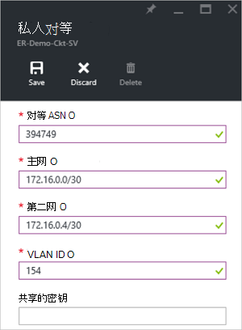
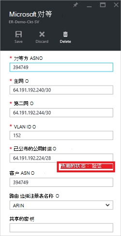

<properties
   pageTitle="如何配置路由使用 Azure 门户 ExpressRoute 电路 |Microsoft Azure"
   description="这篇文章将引导您完成创建和设置私有、 公共和 Microsoft ExpressRoute 电路的对等的步骤。 本文还介绍如何检查状态，更新或删除您电路的 peerings。"
   documentationCenter="na"
   services="expressroute"
   authors="cherylmc"
   manager="carmonm"
   editor=""
   tags="azure-resource-manager"/>
<tags
   ms.service="expressroute"
   ms.devlang="na"
   ms.topic="hero-article" 
   ms.tgt_pltfrm="na"
   ms.workload="infrastructure-services"
   ms.date="10/10/2016"
   ms.author="cherylmc"/>

# 创建和修改 ExpressRoute 电路的路由

> [AZURE.SELECTOR]
[Azure 门户的资源管理器](expressroute-howto-routing-portal-resource-manager.md)
[PowerShell 的资源管理器](expressroute-howto-routing-arm.md)
[PowerShell 的经典](expressroute-howto-routing-classic.md)

本文将引导您一步步地创建和管理使用 Azure 门户和资源管理器部署模型 ExpressRoute 电路的路由配置。

**关于 Azure 的部署模型**

[AZURE.INCLUDE [vpn-gateway-clasic-rm](../../includes/vpn-gateway-classic-rm-include.md)] 

## 配置系统必备组件

- 请确保您已查看了[先决条件](expressroute-prerequisites.md)页、[路由要求](expressroute-routing.md)页和[工作流](expressroute-workflows.md)页上配置之前。
- 您必须具有活动的 ExpressRoute 电路。 按照说明[创建 ExpressRoute 电路](expressroute-howto-circuit-arm.md)并已启用您连接的提供程序，请在继续之前的电路。 在您可以运行如下所述的 cmdlet 的调配并已启用状态必须是 ExpressRoute 电路。

以下说明仅适用于与服务提供商提供第二层连接性服务创建的电路。 如果您正在使用服务管理第 3 层 (通常 IPVPN，像 MPLS) 是服务提供商，您的连接的提供程序将配置和管理路由为您。 

>[AZURE.IMPORTANT] 我们当前不公布 peerings 由服务提供商通过服务管理门户配置。 我们正在尽快启用此功能。 请与服务提供商配置 BGP peerings 之前。

您可以配置一个、 两个或者所有三个 peerings （Azure 的私有的 Azure 公共和 Microsoft） 为 ExpressRoute 电路。 您可以按任何顺序选择配置 peerings。 但是，您必须确保您完成配置的每个对等的一次。 

## Azure 专用对等

本节说明如何创建、 获取、 更新和删除 ExpressRoute 电路的 Azure 专用等配置。 

### 若要创建 Azure 专用对等

1. 配置 ExpressRoute 电路。 确保电路在继续操作之前完全配置连接提供程序。

    

2. 配置 Azure 专用对等电路。 请确保在继续下一步行动之前，有以下各项︰

    - /30 主链接的子网。 这不能保留虚拟网络的所有地址空间的一部分。
    - /30 辅助链接的子网。 这不能保留虚拟网络的所有地址空间的一部分。
    - 建立在此对等有效的 VLAN ID。 确保没有其它对等电路中使用相同的 VLAN id。
    - 作为对等号。 您可以使用 2 字节和 4 字节数字。 您可以使用专用数字为该对等。 请确保没有使用 65515。
    - 如果您选择使用一个 MD5 散列。 **这是可选的**。

3. 如下所示选择 Azure 专用等行。
    
    
    

4. 配置专用的对等。 下图显示了配置示例。

    

    
5. 指定所有参数后，请保存配置。 一旦配置已成功被接受，您将看到类似于下面的示例。

    
    

### 若要查看 Azure 专用等详细信息

您可以查看 Azure 专用对等的选择对等的属性。

### 若要更新 Azure 专用的对等配置

您可以选择的行的对等和修改等属性。 

### 若要删除 Azure 专用对等

通过选择删除图标，在如下所示，您可以删除您的对等配置。

## Azure 公共对等

本节说明如何创建、 获取、 更新和删除 ExpressRoute 电路的 Azure 公共对等配置。 

### 若要创建 Azure 公共对等

1. 配置 ExpressRoute 电路。 确保电路进一步继续之前完全配置连接提供程序。

    

2. 配置 Azure 公共对等电路。 请确保在继续下一步行动之前，有以下各项︰

    - /30 主链接的子网。 
    - /30 辅助链接的子网。 
    - 用于设置此对等的所有 IP 地址必须都是有效的公用 IPv4 地址。
    - 建立在此对等有效的 VLAN ID。 确保没有其它对等电路中使用相同的 VLAN id。
    - 作为对等号。 您可以使用 2 字节和 4 字节数字。
    - 如果您选择使用一个 MD5 散列。 **这是可选的**。

3. 选择 Azure 公共对等，如下所示。
    
    
    

4. 配置公共对等。 下图显示了配置示例。

    

    
5. 指定所有参数后，请保存配置。 一旦配置已成功被接受，您将看到类似于下面的示例。

    
    

### 若要查看 Azure 公共对等的详细信息

您可以查看 Azure 公共对等的选择对等的属性。

### 若要更新 Azure 公用的对等配置

您可以选择的行的对等和修改等属性。 

### 若要删除 Azure 公共对等

通过选择删除图标，在如下所示，您可以删除您的对等配置。

## Microsoft 对等

本节说明如何创建、 获取、 更新和删除的 Microsoft ExpressRoute 电路的对等配置。 

### 若要创建 Microsoft 对等

1. 配置 ExpressRoute 电路。 确保电路进一步继续之前完全配置连接提供程序。

    

2. 配置 Microsoft 对电路等。 请确保具有以下信息，然后再继续。

    - /30 主链接的子网。 这必须是有效公用 IPv4 前缀由您拥有并注册在 RIR / IRR。
    - /30 辅助链接的子网。 这必须是有效公用 IPv4 前缀由您拥有并注册在 RIR / IRR。
    - 建立在此对等有效的 VLAN ID。 确保没有其它对等电路中使用相同的 VLAN id。
    - 作为对等号。 您可以使用 2 字节和 4 字节数字。
    - **公布前缀︰**您必须提供您打算公布对 BGP 会话的所有前缀的列表。 接受公共 IP 地址的前缀。 如果您计划发送一组前缀，您可以发送一个逗号分隔列表。 这些前缀必须在 RIR 注册到您 / IRR。
    - **客户 ASN:**如果是未注册的编号为对等的广告前缀，您可以指定注册到 AS 编号。 **这是可选的**。
    - **路由注册名称︰**您可以指定 RIR / IRR 根据其注册数和前缀。 **这是可选的。**
    - MD5 哈希值，如果您选择使用其中一个。 **这是可选的。**
    
3. 您可以选择您想要配置如下所示的对等。 选择 Microsoft 等一行。
    
    
    

4.  配置 Microsoft 对等。 下图显示了配置示例。

    

    
5. 指定所有参数后，请保存配置。 

    如果您电路获取需要验证的状态 （如下所示），您必须打开一个支持票据，以显示我们的支持团队为前缀的所有权证明。  
    
    

    您可以直接从门户网站，如下所示打开支持票   
    
    

6. 一旦配置已成功被接受，您将看到类似于下面的示例。

    
    

### 若要查看 Microsoft 等详细信息

您可以查看 Azure 公共对等的选择对等的属性。

### 若要更新对等配置，Microsoft

您可以选择的行的对等和修改等属性。 

### 若要删除 Microsoft 对等

通过选择删除图标，在如下所示，您可以删除您的对等配置。

## 下一步行动

下一步，[链接到 ExpressRoute 电路 VNet](expressroute-howto-linkvnet-arm.md)。

-  有关 ExpressRoute 工作流的详细信息，请参阅[ExpressRoute 工作流](expressroute-workflows.md)。

-  有关电路对等的详细信息，请参阅[ExpressRoute 电路和路由域](expressroute-circuit-peerings.md)。

-  有关如何使用虚拟网络的详细信息，请参阅[虚拟网络概述](../virtual-network/virtual-networks-overview.md)。

