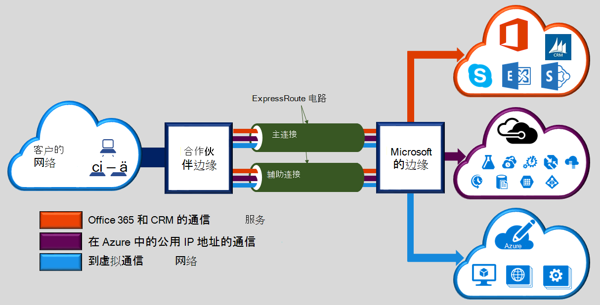
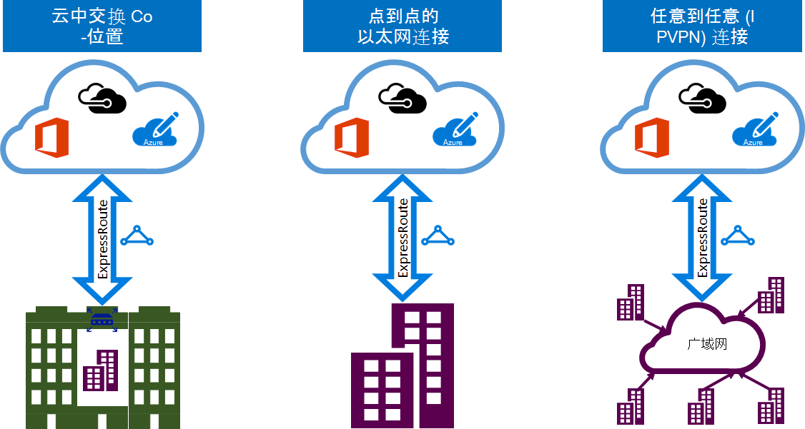

<properties 
   pageTitle="介绍 ExpressRoute |Microsoft Azure"
   description="此页概述了 ExpressRoute 服务，其中包括连接到 ExpressRoute 的工作原理。"
   documentationCenter="na"
   services="expressroute"
   authors="cherylmc"
   manager="carmonm"
   editor=""/>
<tags 
   ms.service="expressroute"
   ms.devlang="na"
   ms.topic="get-started-article" 
   ms.tgt_pltfrm="na"
   ms.workload="infrastructure-services" 
   ms.date="10/10/2016"
   ms.author="cherylmc"/>

# ExpressRoute 技术概述

Microsoft Azure ExpressRoute 允许您将内部网络扩展到 Microsoft 云，通过专用的专用连接连接提供便利条件。 使用 ExpressRoute，您可以建立连接到 Microsoft 云服务，例如 Microsoft Azure，Office 365 和 CRM Online。 连接可以从任意到任意的 (IP VPN) 网络、 点对点以太网网络或通过连接提供程序在主机托管设施虚拟交叉连接。 通过公共互联网不会 ExpressRoute 连接。 这使 ExpressRoute 连接在 Internet 上提供更多可靠性、 更快的速度、 更低的延迟时间和更高的安全性，比典型的连接。

**主要优点包括︰**

- 图 3 您的内部网络连接提供程序通过 Microsoft 云之间的连接层。 连接可以从任意到任意 (IPVPN) 网络，点到点的以太网连接，或通过以太网交换虚拟交叉连接。
- 连接到 Microsoft 跨所有地区的地缘政治区域中的云服务。
- 在所有地区与 ExpressRoute 高级加载项 Microsoft 服务全局连接。
- 动态路由网络和 Microsoft 之间通过业界标准协议 (BGP)。
- 在每个对等的位置，以便更高的可靠性的内置冗余。
- 连接正常运行时间[SLA](https://azure.microsoft.com/support/legal/sla/)。
- QoS 和支持服务等业务的 Skype 的特殊应用程序的多个类。

查看更多详细信息的[ExpressRoute 的常见问题解答](expressroute-faqs.md)。

## 如何连接到 Microsoft 使用 ExpressRoute 我的网络？

可以您的内部网络和 Microsoft 云之间创建连接，在三种不同方式︰

### 在云交换共存

如果共同位于云交换功能，您可以订购到 Microsoft 云通过主机托管提供商的以太网交换的虚拟交叉连接。 主机托管提供商可以提供第 2 层的交叉连接或托管的 3 层交叉连接机构托管您的基础架构和 Microsoft 云之间。

### 点到点的以太网连接 

您可以连接到 Microsoft 云通过点对点以太网链路的内部数据中心/办事处。 点对点以太网提供商可以提供第二层连接或管理您的站点和 Microsoft 云之间的第 3 层连接。

### 任意对任意的 (IPVPN) 网络

您可以使用 Microsoft 云集成您的 WAN。 IPVPN 提供商 (通常 MPLS VPN) 提供任意到任意数据中心和分支办公室之间的连接。 到您 WAN 来使它看上去就像任何其他分支机构一样，Microsoft 云可以相互连接。 WAN 提供商通常提供管理第 3 层连接。 ExpressRoute 的功能和特性是所有相同的所有上述连接模型。 

连接提供程序可以提供一个或多个连接模型。 您可以使用连接提供程序来选择最适合您的模型。

## ExpressRoute 功能

ExpressRoute 支持的以下特性和功能︰ 

### 第 3 层连接

Microsoft 使用工业标准动态路由协议 (BGP) 交换传送您的内部网络，您的实例在 Azure 和微软之间的公用地址。  我们建立了多个与您的网络配置文件不同的通信的 BGP 会话。 文章[ExpressRoute 电路和路由域](expressroute-circuit-peerings.md)中找不到更多详细信息。

### 冗余

每个 ExpressRoute 电路包含，两个连接到 Microsoft 企业的两个边缘路由器 (MSEEs) 从连接提供程序 / 您网络边缘。 Microsoft 需要连接提供者的双重 BGP 连接 / 您一面 – 为每个 MSEE。 您可以选择不部署冗余设备 / 以太网电路在您这一端。 但是，连接提供程序使用冗余设备以确保，您的连接被移交给 Microsoft 以冗余的方式。 冗余的第 3 层连接配置是有效我们[SLA](https://azure.microsoft.com/support/legal/sla/)的要求。 

### 与 Microsoft 云服务的连接

[AZURE.INCLUDE [expressroute-office365-include](../../includes/expressroute-office365-include.md)]

ExpressRoute 连接启用访问的以下服务︰

- Microsoft Azure 服务
- Microsoft Office 365 提供服务
- Microsoft CRM 联机服务 
 
您可以访问[ExpressRoute 常见问题解答](expressroute-faqs.md)页面通过 ExpressRoute 所支持的服务的详细列表。

### 与所有地区的地缘政治区域内连接

可以连接到 Microsoft 在我们[对等的位置](expressroute-locations.md)，并有权访问所有区域内的地缘政治区域。 

例如，如果您连接到 Microsoft 在阿姆斯特丹通过 ExpressRoute，您可以访问到所有 Microsoft 云服务承载于北欧和西欧国家。 请参阅[ExpressRoute 合作伙伴和对等的位置](expressroute-locations.md)文章概述的地缘政治区域、 关联的 Microsoft 云区域，和相应的 ExpressRoute 对等位置。

### 全球联网与 ExpressRoute 高级加载项

您可以启用跨地缘政治边界扩展连接 ExpressRoute 高级附加功能。 例如，如果您连接到 Microsoft 在阿姆斯特丹通过 ExpressRoute，您将有权在所有地区承载了全世界所有 Microsoft 云服务 （包括国内云）。 您可以访问部署在南美或澳大利亚中相同的方式访问北美和西欧地区服务。

### 丰富的连接合作伙伴生态系统

ExpressRoute 已连接的提供者和 SI 合作伙伴的一个不断增长的生态系统。 您可以参考[ExpressRoute 提供程序和位置](expressroute-locations.md)的最新信息的文章。

### 与全国群连接

Microsoft 操作独立的云环境，特殊的地缘政治区域和客户群。 请参阅[ExpressRoute 提供程序和位置](expressroute-locations.md)有关的国家的云基础架构并提供商列表页面。

### 受支持的带宽选项

您可以购买大量的带宽为 ExpressRoute 电路。 下面列出了受支持的带宽的列表。 请务必检查与您的连接提供程序以确定列表中支持它们所提供的带宽。

- 50 Mbps
- 100 Mbps
- 200 Mbps
- 500 Mbps
- 1 Gbps
- 2 Gbps
- 5 Gbps
- 10 Gbps

### 动态缩放的带宽

您无需中断您的连接有增加 （上尽力执行） 的 ExpressRoute 电路带宽的能力。 

### 灵活的计费模型

您可以选择最适合您的计费模型。 下面列出的计费模型之间进行选择。 请参阅有关更多详细信息的[ExpressRoute 常见问题解答](expressroute-faqs.md)页面。 

- **无限的数据**。 负责每月的费用，根据 ExpressRoute 电路，免费包括所有入站和出站数据传输。 
- **Metered 数据**。 根据月租费收取 ExpressRoute 电路。 所有入站的数据传输是免费。 出站数据传输收取每 GB 的数据传输。 因地区而异的数据传输率。
- **ExpressRoute 高级加载项**。 ExpressRoute 津贴是对 ExpressRoute 电路的加载项。 ExpressRoute 高级加载项提供了以下功能︰ 
    - 提高了的路由限制 Azure 公共和 Azure 专用对等从 4000 路由到 10000 路由。
    - 服务的的全球联网。 在任何区域中 （不包括国家群） 创建 ExpressRoute 电路将在世界上任何其他地区具有对资源的访问。 例如，可以通过 ExpressRoute 电路，设置在硅谷访问西欧在创建虚拟网络。
    - 每个 ExpressRoute 电路从 10 到更大的限制，这取决于线路的带宽 VNet 链接的数量增多。

## 下一步行动

- 了解有关 ExpressRoute 连接和路由域。 请参阅[ExpressRoute 电路和路由域](expressroute-circuit-peerings.md)。
- 查找服务提供商。 请参阅[ExpressRoute 合作伙伴和对等的位置](expressroute-locations.md)。
- 确保满足所有先决条件。 [ExpressRoute 系统必备组件](expressroute-prerequisites.md)，请参阅。
- 请参阅[路由](expressroute-routing.md)、 [NAT](expressroute-nat.md)和[QoS](expressroute-qos.md)的要求。
- ExpressRoute 连接配置。
    - [创建 ExpressRoute 电路](expressroute-howto-circuit-classic.md)
    - [配置路由](expressroute-howto-routing-classic.md)
    - [链接到 ExpressRoute 电路的 VNet](expressroute-howto-linkvnet-classic.md)
