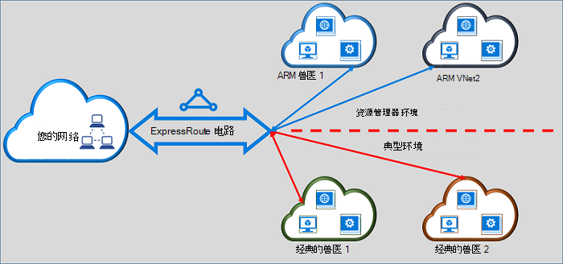

<properties
   pageTitle="从经典到资源管理器中移动 ExpressRoute 电路 |Microsoft Azure"
   description="此页提供您需要了解桥接经典和资源管理器部署模型的概述。"
   documentationCenter="na"
   services="expressroute"
   authors="ganesr"
   manager="carmonm"
   editor=""/>
<tags
   ms.service="expressroute"
   ms.devlang="na"
   ms.topic="get-started-article"
   ms.tgt_pltfrm="na"
   ms.workload="infrastructure-services"
   ms.date="10/10/2016"
   ms.author="ganesr"/>

# 从经典的 ExpressRoute 电路移动到资源管理器部署模型

本文将概述将 Azure ExpressRoute 电路从传统型移动到 Azure 资源管理器部署模型意味着什么。

[AZURE.INCLUDE [vpn-gateway-sm-rm](../../includes/vpn-gateway-classic-rm-include.md)]

可以使用单个 ExpressRoute 电路连接到部署都在经典和资源管理器部署模型的虚拟网络。 ExpressRoute 电路，而不管创建方式，现在可以链接到虚拟网络，通过这两种部署模型。

## 在经典的部署模型中创建的 ExpressRoute 电路

在经典的部署模型中创建的 ExpressRoute 电路需要被移到资源管理器部署模型首先启用连接到经典和资源管理器的部署模型。 没有网络连接的丢失或中断时连接正在被移动。 在经典的部署模型 （在相同的订阅和跨订阅） 的所有电路到虚拟网络链接将被都保留。

移动已成功完成后，ExpressRoute 电路的外观，执行，和大家一样在资源管理器部署模型中创建的 ExpressRoute 电路。 现在可以在资源管理器部署模型中创建与虚拟网络的连接。

ExpressRoute 后电路已移到资源管理器部署模型，您可以管理生命周期的 ExpressRoute 电路只能通过使用资源管理器的部署模型。 这意味着，您可以执行操作，如添加/更新/删除 peerings，更新电路属性 （如带宽、 SKU，和计费类型），和删除仅在资源管理器部署模型的电路。 请参阅下面一节进一步详细介绍如何管理访问这两种部署模型资源管理器部署模型中创建的电路上。

不需要涉及到连接提供程序以进行移动。

## 在资源管理器部署模型中创建的 ExpressRoute 电路

您可以启用可从这两种部署模型的资源管理器部署模型中创建的 ExpressRoute 电路。 可以启用在您的订阅任何 ExpressRoute 电路从这两种部署模型进行访问。

- 在资源管理器部署模型中创建的 ExpressRoute 电路，默认情况下没有对经典的部署模型的访问。
- 现在已从传统的部署模型到资源管理器部署模型的 ExpressRoute 电路从进行访问默认情况下这两种部署模型。
- ExpressRoute 电路始终具有访问权限的资源管理器部署模式，无论它是否创建资源管理器中或经典的部署模型。 这意味着您可以创建连接到在资源管理器部署模型中[如何将虚拟网络链接](expressroute-howto-linkvnet-arm.md)上的说明创建虚拟网络。
- 由 ExpressRoute 电路中的**allowClassicOperations**参数控制对经典的部署模型的访问。

>[AZURE.IMPORTANT] [服务限制](../azure-subscription-service-limits.md)页面记录的所有配额将都应用。 例如，标准电路可以有最多 10 个虚拟网络链接/连接跨经典和资源管理器部署模型。

## 控制访问的典型部署模型

您可以启用单个 ExpressRoute 电路的 ExpressRoute 电路将**allowClassicOperations**参数设置链接到虚拟的网络中这两种部署模型。

将**allowClassicOperations**设置为 TRUE 可以链接到 ExpressRoute 电路从这两种部署模型的虚拟网络。 您可以链接到虚拟网络中传统的部署模型后[如何链接中经典的部署模型的虚拟网络](expressroute-howto-linkvnet-classic.md)的指导。 您可以链接到虚拟网络中的资源管理器部署模型后[如何链接的资源管理器部署模型中的虚拟网络](expressroute-howto-linkvnet-arm.md)的指导。

将**allowClassicOperations**设置为从经典的部署模型电路假块访问。 但是，经典部署模型中的所有虚拟网络链接将被保留。 在这种情况下，ExpressRoute 电路不可见中经典的部署模型。

## 典型的部署模式中支持的操作

当**allowClassicOperations**被设置为 TRUE 时在 ExpressRoute 电路上支持以下经典操作︰

 - 获得 ExpressRoute 电路信息
 - 经典的虚拟网络的创建/更新/get/删除虚拟网络链接
 - 创建/更新/get/删除虚拟网络链接授权跨订阅连接

当**allowClassicOperations**被设置为 TRUE 时，不能执行下列经典操作︰

 - 创建/更新/get/删除边界网关协议 (BGP) peerings Azure 的私有的 Azure 公用，以及 Microsoft peerings
 - 删除 ExpressRoute 电路

## 经典和资源管理器部署模型之间的通信

ExpressRoute 电路的作用如同经典和资源管理器部署模型之间的桥梁。 在虚拟网络中传统的部署模型机和 ExpressRoute，如果这两个虚拟网络链接到相同的 ExpressRoute 电路通过资源管理器部署模型流程中的虚拟网络中的那些之间的通信。

聚合吞吐量受限制的虚拟网络网关的吞吐量。 通信未输入连接提供者的网络或您的网络中这种情况。 虚拟的网络之间的通信流是完全包含在 Microsoft 网络中。

## 对 Azure 公共和 Microsoft 对等资源的访问

您可以继续访问通过 Azure 公共对等和 Microsoft 对等而无需中断通常可访问的资源。  

## 支持哪些内容

本节介绍什么支持 ExpressRoute 电路︰

 - 可以使用单个 ExpressRoute 电路来访问部署在经典和资源管理器部署模型的虚拟网络。
 - 您可以将 ExpressRoute 电路从经典移到资源管理器的部署模型。 移动后，ExpressRoute 电路、 感觉，看起来像任何其他资源管理器部署模型中创建的 ExpressRoute 电路执行。
 - 您可以移动仅 ExpressRoute 电路。 通过此操作，不能移动电路链接、 虚拟网络和 VPN 网关。
 - ExpressRoute 后电路已移到资源管理器部署模型，您可以管理生命周期的 ExpressRoute 电路只能通过使用资源管理器的部署模型。 这意味着，您可以执行操作，如添加/更新/删除 peerings，更新电路属性 （如带宽、 SKU，和计费类型），和删除仅在资源管理器部署模型的电路。
 - ExpressRoute 电路的作用如同经典和资源管理器部署模型之间的桥梁。 在虚拟网络中传统的部署模型机和 ExpressRoute，如果这两个虚拟网络链接到相同的 ExpressRoute 电路通过资源管理器部署模型流程中的虚拟网络中的那些之间的通信。
 - 在经典和资源管理器部署模型支持跨订阅连接。

## 不支持的内容

本节介绍什么不支持 ExpressRoute 电路︰

 - 将从经典电路链接、 网关和虚拟网络移到资源管理器的部署模型。
 - 从经典的部署模型管理生命周期的 ExpressRoute 电路。
 - 基于角色的访问控制 (RBAC) 支持传统的部署模型。 经典的部署模型中，不能执行 RBAC 控制电路。 该订阅任何管理员/coadministrator 可以链接或断开电路虚拟网络。

## 配置

按照所述[移动从资源管理器的部署模型为经典的 ExpressRoute 电路](expressroute-howto-move-arm.md)的说明。

## 下一步行动

- 有关工作流的信息，请参阅[ExpressRoute 环路供应流和电路状态](expressroute-workflows.md)。
- 若要配置 ExpressRoute 连接︰

    - [创建 ExpressRoute 电路](expressroute-howto-circuit-arm.md)
    - [配置路由](expressroute-howto-routing-arm.md)
    - [将虚拟网络链接到 ExpressRoute 电路](expressroute-howto-linkvnet-arm.md)
