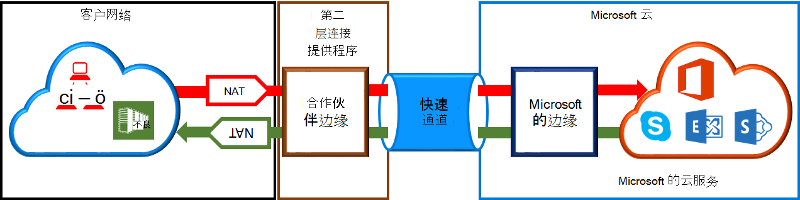

<properties
   pageTitle="对 ExpressRoute 电路的 NAT 需求 |Microsoft Azure"
   description="此页提供用于配置和管理对 ExpressRoute 电路的 NAT 的详细的要求。"
   documentationCenter="na"
   services="expressroute"
   authors="cherylmc"
   manager="carmonm"
   editor=""/>
<tags
   ms.service="expressroute"
   ms.devlang="na"
   ms.topic="get-started-article"
   ms.tgt_pltfrm="na"
   ms.workload="infrastructure-services"
   ms.date="10/10/2016"
   ms.author="cherylmc"/>

# ExpressRoute NAT 的要求

要连接到 Microsoft 云服务使用 ExpressRoute，您将需要设置和管理 Nat。 某些连接提供程序提供了设置和管理作为托管服务的 NAT。 请与连接提供程序以查看是否他们提供此类服务。 如果没有，您必须遵守如下所述的要求。 

检查[ExpressRoute 电路和路由域](expressroute-circuit-peerings.md)页后，可以获得的各种路由域概述。 为了满足公共 Azure 和 Microsoft 对等的公用 IP 地址要求，我们建议您的网络和 Microsoft 之间设置 NAT。 此部分提供了 NAT 基础结构需要来设置的详细的说明。

## NAT Azure 公共对等的要求

Azure 的公共对等路径使您可以连接到承载 Azure 中转移其公用 IP 地址的所有服务。 其中包括在[ExpessRoute 的常见问题解答](expressroute-faqs.md)列出服务和由 Isv 在 Microsoft Azure 上承载的任何服务。 连接到 Microsoft Azure 上公共对等的服务始终到 Microsoft 网络中启动从您的网络。 才能进入 Microsoft 网络，往 Microsoft Azure 上公共对等通信必须于有效的公用 IPv4 地址是 SNATed。 下图提供了高级图片可能达设置 NAT 的方式满足上述要求。

 

### NAT IP 池和路由通告

您必须确保通信正在进入有效的公用 IPv4 地址的 Azure 公共对等路径。 Microsoft 必须能够验证对区域的路由 Internet 注册表 (RIR) 或 Internet 路由注册表 (IRR) 的 IPv4 NAT 地址池中的所有权。 会根据正在对与 AS 编号和使用 NAT 的 IP 地址执行检查 请参阅[ExpressRoute 路由要求](expressroute-routing.md)页有关注册表的路由的信息。
 
公布到该对等的 NAT IP 前缀的长度没有限制。 您必须监视 NAT 池中，并确保您不缺少的 NAT 会话。

>[AZURE.IMPORTANT] 公布给 Microsoft 的 NAT IP 池必须不会被公布到互联网。 这将断开连接到其他 Microsoft 服务。

## NAT Microsoft 对等的要求

Microsoft 对等路径，可以连接到 Microsoft 通过 Azure 的公共对等路径中不受支持的云服务。 服务列表中的包括 Office 365 提供服务，如在线交换、 SharePoint Online、 业务、 和 CRM Online 的 Skype。 Microsoft 要求在 Microsoft 对等支持双向连接。 才能进入 Microsoft 网络通信发送到 Microsoft 云服务必须于有效的公用 IPv4 地址是 SNATed。 才能进入您的网络通信量，从 Microsoft 云服务旨在到您的网络必须是 SNATed。 下图提供了高级的 NAT 应安装 Microsoft 对等的图片。
 
 

#### 来自向 Microsoft 发送到您的网络通信

- 您必须确保通信正在进入一个有效的公用 IPv4 地址的 Microsoft 等路径。 Microsoft 必须能够验证对区域路由 internet 注册表 (RIR) 或 internet 路由注册表 (IRR) 的 IPv4 NAT 地址池中的所有者。 会根据正在对与 AS 编号和使用 NAT 的 IP 地址执行检查 请参阅[ExpressRoute 路由要求](expressroute-routing.md)页有关注册表的路由的信息。

- Azure 公共对等的安装和其他 ExpressRoute 电路使用的 IP 地址必须不会公布给 Microsoft 通过 BGP 会话。 公布对此等通过 NAT IP 前缀的长度没有限制。

    >[AZURE.IMPORTANT] 公布给 Microsoft 的 NAT IP 池必须不会被公布到互联网。 这将断开连接到其他 Microsoft 服务。

#### 来自 Microsoft 发送到您的网络通信

- 某些情况下，需要 Microsoft 发起与承载您的网络内的服务终结点的连接。 该方案的一个典型示例是 ADFS 从 Office 365 网络中承载的服务器的连接。 在这种情况下，必须适当的前缀泄漏从网络到 Microsoft 对等。 

- 必须 SNAT 流量到您的网络内的 IP 地址发送到 microsoft。 

## 下一步行动

- 请参阅[路由](expressroute-routing.md)和[QoS](expressroute-qos.md)的要求。
- 有关工作流的信息，请参阅[ExpressRoute 环路供应流和电路状态](expressroute-workflows.md)。
- ExpressRoute 连接配置。

    - [创建 ExpressRoute 电路](expressroute-howto-circuit-classic.md)
    - [配置路由](expressroute-howto-routing-classic.md)
    - [链接到 ExpressRoute 电路的 VNet](expressroute-howto-linkvnet-classic.md)

