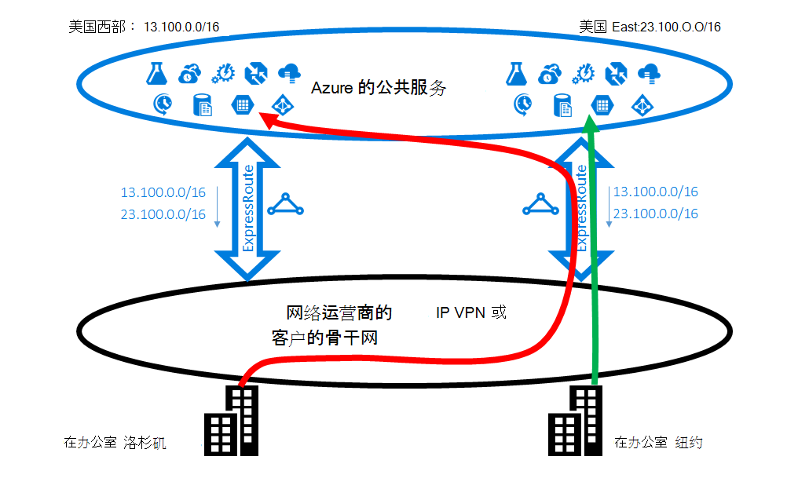
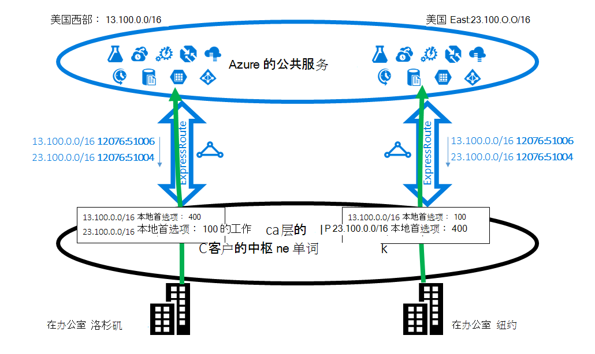
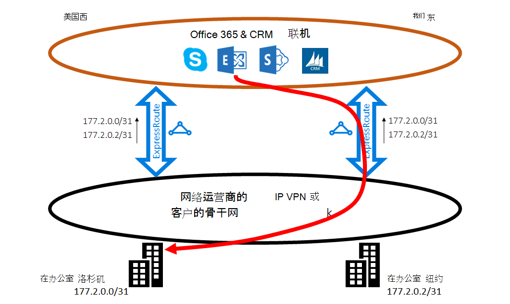
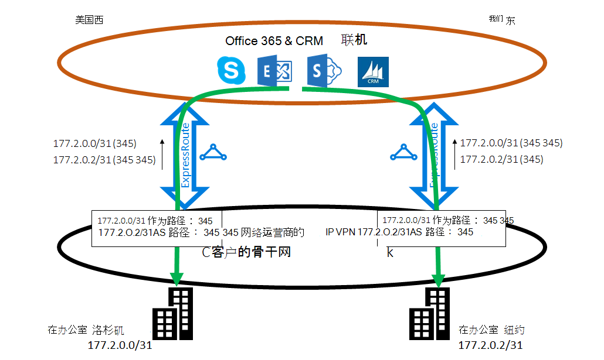

<properties
   pageTitle="优化路由 ExpressRoute |Microsoft Azure"
   description="此页提供如何优化路由时客户有多个连接 Microsoft 客户的公司网络之间的 ExpressRoute 电路的详细信息。"
   documentationCenter="na"
   services="expressroute"
   authors="charwen"
   manager="carmonm"
   editor=""/>
<tags
   ms.service="expressroute"
   ms.devlang="na"
   ms.topic="get-started-article"
   ms.tgt_pltfrm="na"
   ms.workload="infrastructure-services"
   ms.date="10/10/2016"
   ms.author="charwen"/>

# 优化 ExpressRoute 路由
如果您有多个 ExpressRoute 电路，您有多个路径连接到 Microsoft。 因此，最优路由，则可能出现的即您的通信可能需要较长的路径到达 Microsoft 以及 Microsoft 为您的网络。 网络路径的时间越长，越高的反应。 延迟对应用程序性能和用户体验有直接的影响。 本文将说明这一问题，并介绍了如何优化路由使用标准的路由技术。

## 最优路由案例 1
让我们仔细研究一下路由问题示例。 假设您有两个在美国，一个在洛杉矶，一个在纽约的办公室。 您的办公室连接在广域网 (WAN)，可以是主干网络或服务提供商的 IP VPN。 您有两个 ExpressRoute 电路，一个在美国西部，一个在美国东部，在广域网上还连接。 显然，您有两个路径连接到 Microsoft 网络。 现在假设您具有在美国西部和美国东部的 Azure 部署 （例如 Azure 应用程序服务）。 您的目的是要在洛杉矶您的用户连接到 Azure 美国西和您的用户到 Azure 美国东部的纽约，因为服务管理宣称的每个办公室中的用户访问附近的 Azure 服务的最佳体验。 遗憾的是，该计划工作会很好地为东海岸用户而不是西海岸的用户。 以下是问题的引起。 在每个 ExpressRoute 电路，我们给您公布，Azure 美国东 (23.100.0.0/16) 中的前缀和 Azure 美国西 (13.100.0.0/16) 中的前缀。 如果您不知道哪个前缀是来自哪个地区，就不能够以不同的方式对待它。 WAN 网络可能会认为这两个前缀接近美国西比美国东部，并且因此将这两种 office 用户路由到在美国东部的 ExpressRoute 电路。 最后，洛杉矶办公室中有许多不满用户。

### 解决方案︰ 使用 BGP 社区
若要优化两个 office 用户的路由，需要知道哪个前缀是从 Azure 美国西和它从 Azure 美国东。 我们对此信息使用[BGP 社区值](expressroute-routing.md)进行编码。 我们已将 BGP 社区的一个唯一值分配到每个 Azure 的地区，例如美国东部的"12076:51004"、"12076:51006"的美国西。 既然您知道哪个前缀是从哪个 Azure 的地区，您可以配置的 ExpressRoute 电路应为首选。 由于我们使用 BGP 交换路由信息，可以使用 BGP 的本地首选项来影响路由。 在我们的示例中，可以将分配给中比在美国西部的美国东部的 23.100.0.0/16 到 13.100.0.0/16 美国西比在美国东部，在更高的本地首选项值，同样，较高的本地首选项值。 此配置将确保，当 Microsoft 这两种路径可用时，您的用户在洛杉矶 ExpressRoute 电路中将美国西部连接到 Azure 美国西部，而纽约中的用户将在美国东部 ExpressRoute 带到 Azure 美国东部。 在两面上进行路由优化。 

## 最优路由案例 2
这里是另一个示例，其中来自 Microsoft 的连接采用较长的路径到达您的网络。 在这种情况下，您在[混合环境](https://technet.microsoft.com/library/jj200581%28v=exchg.150%29.aspx)中使用内部部署 Exchange 服务器和 Exchange 联机。 您的办公室到广域网连接。 广告中都通过两个 ExpressRoute 电路给 Microsoft 办公室内部部署服务器的前缀。 将启动 Exchange 联机情况下如邮箱迁移中的内部服务器的连接。 遗憾的是，到洛杉矶办公室的连接是在美国东部的 ExpressRoute 电路在前经过遍历整个大陆后，到西海岸。 问题的原因是类似于第一个。 而无需任何提示，Microsoft 网络无法知道哪个客户前缀是接近美国东部，哪一项是美国西部靠近。 它发生在洛杉矶办公室到选取路径不正确。

### 解决方案︰ 使用 AS 路径前面加
有两种解决方案的问题。 第一个是洛杉矶办公室后，177.2.0.0/31，ExpressRoute 电路在美国西部的只是公布内部前缀并且您本地前缀用于纽约办公，177.2.0.2/31，ExpressRoute 电路在美国东部。 因此，没有 microsoft 为连接到每个您的办公室只有一条路径。 是不存在多义性和进行了路由优化。 使用此设计，您需要考虑故障转移策略。 ExpressRoute 通过 Microsoft 的路径已损坏，您需要确保该 Exchange Online 仍然可以连接到您的内部服务器。 

第二种解决方案是，继续公布这两个在 ExpressRoute 这两种电路中，前缀为我们提供除哪个前缀的提示是接近您的办公室中哪一。 因为我们支持前面添加 BGP AS 路径，您可以配置您的前缀要影响路由的 AS 路径。 在此示例中，可以加长在美国东部的 172.2.0.0/31 AS 路径，这样我们会更喜欢 ExpressRoute 电路在美国西部的通信发送到此前缀 （如我们的网络会认为此前缀的路径是在西方更短）。 同样可以延长在美国西部的 172.2.0.2/31 AS 路径，这样我们会更喜欢在美国东部的 ExpressRoute 电路。 对于这两个机构优化路由。 使用此设计，如果一条 ExpressRoute 电路被断开，Exchange Online 可以仍达到您通过另一个 ExpressRoute 电路和您 WAN。 

>[AZURE.IMPORTANT] 我们删除专用接收 Microsoft Peering 上的前缀的 AS 路径中的数字。 您需要追加公共影响 Microsoft Peering 的路由的 AS 路径中的数字。

>[AZURE.IMPORTANT] 虽然此处给出的示例都是针对 Microsoft 和公用 peerings，我们的专用的对等支持相同的功能。 此外，AS 路径前面加工作在一个单个 ExpressRoute 电路，以影响的主次路径选择。
