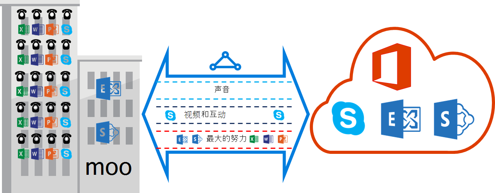

<properties
   pageTitle="服务质量要求的 ExpressRoute |Microsoft Azure"
   description="此页提供用于配置和管理对 ExpressRoute 电路的 QoS 的详细的要求。"
   documentationCenter="na"
   services="expressroute"
   authors="cherylmc"
   manager="carmonm"
   editor=""/>
<tags
   ms.service="expressroute"
   ms.devlang="na"
   ms.topic="get-started-article"
   ms.tgt_pltfrm="na"
   ms.workload="infrastructure-services"
   ms.date="10/10/2016"
   ms.author="cherylmc"/>

# ExpressRoute 服务质量要求

Skype 的业务都有各种工作负载需要 QoS 的区别的对待。 如果您打算使用语音服务，通过 ExpressRoute，您应遵循如下所述的要求。

>[AZURE.NOTE] 服务质量要求不适用于 Microsoft 只对等。 接收到 Azure 公共对等和 Azure 专用对等网络流量中的 DSCP 值将重置为 0。 

下表提供了用于通过 Skype 业务的 DSCP 标记的列表。 详细信息，请参阅[管理业务的 Skype 的服务质量](https://technet.microsoft.com/library/gg405409.aspx)。

| **通信类** | **治疗 （DSCP 标记）** | **Skype 业务工作负载** |
|---|---|---|
| **声音** | EF (46) | Skype / Lync 语音 |
| **交互式** | AF41 (34) | 视频 |
|   | AF21 (18) | 应用程序共享 | 
| **默认** | AF11 (10) | 文件传输|
|   | CS0 (0) | 别的东西| 

- 应该对工作负荷进行分类和标记正确的 DSCP 值。 请按照提供的指导[这里](https://technet.microsoft.com/library/gg405409.aspx)如何在您的网络中设置 DSCP 标记。

- 您应该配置和支持在您的网络内的多个 QoS 队列。 声音必须独立类和接收 RFC 3246 中指定 EF 治疗。 

- 您可以决定队列机制、 拥塞检测策略和每个通信类的带宽分配。 但是，必须保留 DSCP 标记为 Skype 业务工作负载。 如果您使用上面未列出的 DSCP 标记如 AF31 (26)，您必须重写此 DSCP 值为 0 将数据包发送到 Microsoft 之前。 Microsoft 只发送数据包标记有上表中所示的 DSCP 值。 

## 下一步行动

- 请参阅[路由](expressroute-routing.md)和[NAT](expressroute-nat.md)的要求。
- 请参阅下面的链接来配置 ExpressRoute 连接。

    - [创建 ExpressRoute 电路](expressroute-howto-circuit-classic.md)
    - [配置路由](expressroute-howto-routing-classic.md)
    - [链接到 ExpressRoute 电路的 VNet](expressroute-howto-linkvnet-classic.md)
