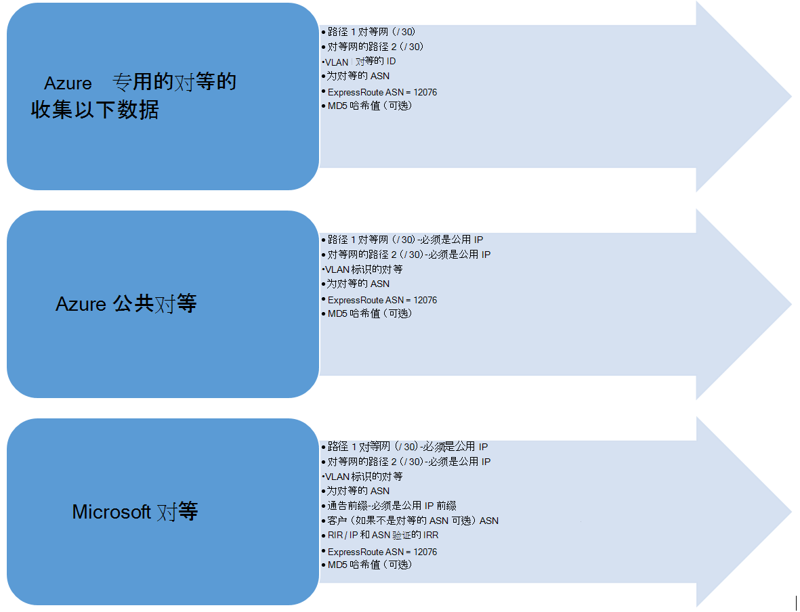

<properties
   pageTitle="工作流配置 ExpressRoute 电路 |Microsoft Azure"
   description="此页将引导您完成配置 ExpressRoute 电路和 peerings 的工作流"
   documentationCenter="na"
   services="expressroute"
   authors="cherylmc"
   manager="carmonm"
   editor="" />
<tags
   ms.service="expressroute"
   ms.devlang="na"
   ms.topic="article" 
   ms.tgt_pltfrm="na"
   ms.workload="infrastructure-services"
   ms.date="10/10/2016"
   ms.author="cherylmc"/>

# ExpressRoute 电路资源调配和电路状态的工作流

此页将引导您完成资源调配，以及从较高层次路由配置工作流服务。

下图和相应的步骤显示的端到端必须遵循以已设置 ExpressRoute 电路的任务。 

1. 使用 PowerShell 配置 ExpressRoute 电路。 按照说明[创建 ExpressRoute 电路](expressroute-howto-circuit-classic.md)在项目中的更多详细信息。

2. 从服务提供程序的顺序连接。 此过程会有所不同。 与连接提供有关如何订购连接更多细节。

3. 确保成功已通过验证 ExpressRoute 电路资源调配通过 PowerShell 状态设置电路。 

4. 配置路由的域。 如果您连接的提供程序将为您管理第 3 层，它们将配置您电路的路由。 如果您连接的提供程序只提供第 2 层服务，您必须配置路由[路由要求](expressroute-routing.md)和[路由配置](expressroute-howto-routing-classic.md)页中所述的准则每。

    -  启用 Azure 专用对等-您必须启用连接到虚拟机 / 云服务，在虚拟的网络中部署此对等。
    -  启用 Azure 公共对等-您必须启用 Azure 公共对等如果您想要连接到 Azure 服务位于公用 IP 地址。 这是访问 Azure 的资源，如果您已经选择启用默认路由的 Azure 专用对等的要求。
    -  启用 Microsoft 对等-您必须启用此访问 Office 365 和 CRM 联机服务。 
    
    >[AZURE.IMPORTANT] 您必须确保使用单独的代理，/ 边缘连接到 Microsoft 与您使用的互联网。 ExpressRoute 和互联网使用的相同边缘会导致非对称路由，并且导致为您的网络连接中断引起。

    

5. 将虚拟网络链接到 ExpressRoute 电路-您可以链接到 ExpressRoute 电路虚拟网络。 说明[若要将链接 VNets](expressroute-howto-linkvnet-arm.md)按照您电路。 这些 VNets 可作为 ExpressRoute 电路中，相同的 Azure 订阅中，也可以在不同的订阅。

## ExpressRoute 电路设置状态

每个 ExpressRoute 电路具有两种状态︰

- 服务提供程序设置状态
- 状态

状态表示微软供应状态。 当创建 Expressroute 电路，将此属性设置为已启用

连接提供程序设置状态表示连接提供程序端的状态。 它可以是*NotProvisioned*，*资源调配*或*Provisioned*。 在 Provisioned 状态时才可以使用它，必须是 ExpressRoute 电路。

### 可能的 ExpressRoute 电路的状态

本部分列出了出 ExpressRoute 电路的可能状态。

#### 在创建时

一旦运行创建 ExpressRoute 电路 PowerShell cmdlet，您将看到 ExpressRoute 电路处于以下状态。

    ServiceProviderProvisioningState : NotProvisioned
    Status                           : Enabled

#### 当连接提供程序正在调配电路

一旦连接提供程序传递服务密钥并在启动设置过程，您将看到以下状态中的 ExpressRoute 电路。

    ServiceProviderProvisioningState : Provisioning
    Status                           : Enabled

#### 当连接提供程序已完成资源调配过程

一旦连接提供程序已完成设置过程，您将看到以下状态中的 ExpressRoute 电路。

    ServiceProviderProvisioningState : Provisioned
    Status                           : Enabled

配置和启用是唯一状态电路可以在您能使用它。 如果您正在使用第 2 层提供程序，您可以配置仅在处于此状态时您电路的路由。

#### 当连接提供程序撤消电路

如果您请求的服务提供商联系，以取消设置 ExpressRoute 电路，您将看到后的服务提供程序已完成了 deprovisioning 的流程设置为以下状态的电路。

    ServiceProviderProvisioningState : NotProvisioned
    Status                           : Enabled

您可以选择重新启用它，如果需要或运行 PowerShell cmdlet 以删除电路。  

>[AZURE.IMPORTANT] 如果您运行 PowerShell cmdlet 删除电路在添加 ServiceProviderProvisioningState 或 Provisioned，则操作将失败。 请使用第一次取消设置 ExpressRoute 电路连接提供程序，然后删除电路。 Microsoft 将继续，直到您运行删除电路 PowerShell cmdlet 帐单电路。

## 会话配置的路由状态

设置状态 BGP 告诉您如果 BGP 会话已启用 Microsoft 边上。 您可以使用对等，必须启用状态。

请务必检查 BGP 会话状态，尤其是对于 Microsoft 对等。 除了供应状态 BGP，还有另一种状态称为*公布公共前缀状态*。 在*配置*状态，同时处于开机状态的 BGP 会话和路由处理端到端的必须公布公共前缀状态。 

如果公布的公用前缀状态设置为*需要验证*状态，BGP 会话未启用，如公布的前缀与任何路由选择注册表中的 AS 编号不匹配。 

>[AZURE.IMPORTANT] *手动验证*状态公布公共前缀状态时，必须与[Microsoft 支持](https://portal.azure.com/?#blade/Microsoft_Azure_Support/HelpAndSupportBlade)打开支持票，并提供您自己的 IP 地址相关联的自治系统号公布沿的证据。

## 下一步行动

- ExpressRoute 连接配置。

    - [创建 ExpressRoute 电路](expressroute-howto-circuit-arm.md)
    - [配置路由](expressroute-howto-routing-arm.md)
    - [链接到 ExpressRoute 电路的 VNet](expressroute-howto-linkvnet-arm.md)
