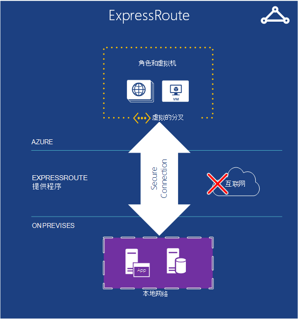
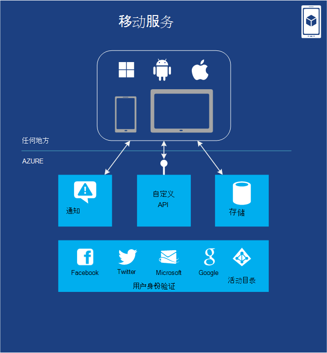
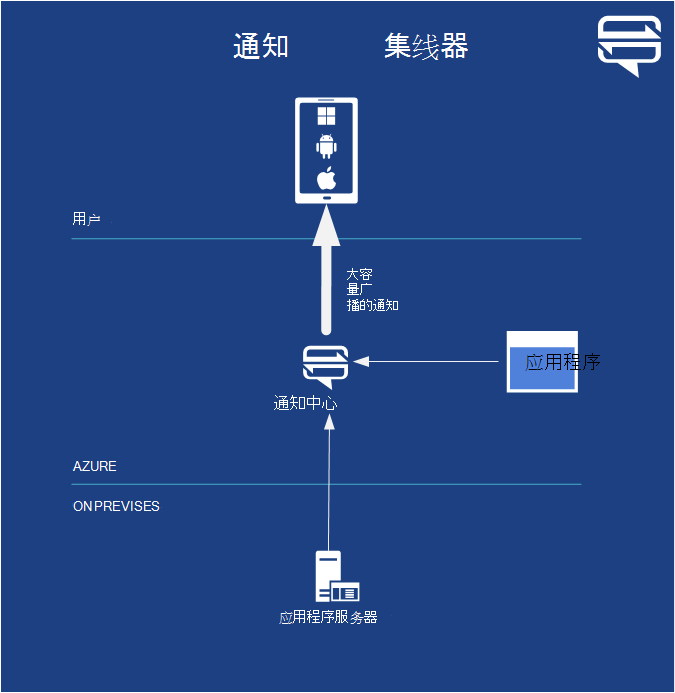

<properties
    pageTitle="介绍 Microsoft Azure |Microsoft Azure"
    description="Microsoft Azure 的新手？ 获取的基本概述服务的提供与它们是有用的示例。"
    services=" "
    documentationCenter=".net"
    authors="rboucher"
    manager="carolz"
    editor=""/>

<tags
    ms.service="multiple"
    ms.workload="multiple"
    ms.tgt_pltfrm="na"
    ms.devlang="na"
    ms.topic="article"
    ms.date="06/30/2015"  
    ms.author="robb"/>

# 介绍 Microsoft Azure

Microsoft Azure 是公共云的微软应用程序平台。  本文的目的旨在为您提供基础了解了最基本的 Azure，即使您不知道任何有关云计算。

**如何阅读这篇文章**

Azure 的增长一直这样很容易会超载。  开始有了基本的服务，在本文中，首先列出，然后转到其他服务。 这并不意味着不能只是附加的服务本身，但基本的服务组成的核心在 Azure 上运行的应用程序。

**提供反馈**

您的反馈很重要。 这篇文章将帮助您有效 Azure 的概览。 如果不是的话，请在页面底部的备注部分中告诉我们。 为您希望看到什么和如何提高文章的一些详细信息。  

## Azure 的组件

Azure 将服务分为在管理门户和各种视觉帮助，如[什么是 Azure Infographic](https://azure.microsoft.com/documentation/infographics/azure/)的类别。 管理门户是您用于管理 Azure 中的多数 （但非全部） 服务。

谈一谈服务基于类似的函数并调用出重要的子服务属于较大的这篇文章将使用一个**不同的组织**。  

   
 *图︰ Azure 提供 Internet 访问在 Azure 数据中心中运行的应用程序服务。*

## 管理门户
Azure 具有 web 界面[管理门户网站](http://manage.windowsazure.com)，允许管理员访问和管理最，但并不是所有的 Azure 功能调用。  Microsoft 通常淘汰旧之前发布测试版中的新用户界面门户网站。 较新版本被称为["Azure 预览门户"](https://portal.azure.com/)。

在这两个门户网站都处于活动状态时，通常是有长的重叠。 虽然核心服务会在两个门户网站中显示，并不是所有的功能可能中都可用。 较新的服务可能会出现在较新的门户和旧服务和功能可能只存在于较早的一个。  此处的信息是，如果您不在旧的门户中，发现检查较新版本，反之亦然。

## 计算

Does 云平台的最基本的任务之一就是执行应用程序。 每个 Azure 计算模型具有扮演着自己的角色。

您可以单独使用这些技术或将其合并以创建您的应用程序的适当基础。 方法的选用取决于什么样的问题要解决。

### Azure 的虚拟机

   
*图︰ Azure 的虚拟机可以在云环境中的虚拟机实例的完全控制。*

是否从标准图像或一个您提供，根据需要，创建一个虚拟机的功能会非常有用。 这种方法，通常称为基础结构即服务 (IaaS) 是 Azure 虚拟机提供的了。 图 2 显示了组成虚拟机 (VM) 的运行方式以及如何创建一个从 VHD。  

若要创建虚拟机，您可以指定使用与 VM 大小的 VHD。  为虚拟机正在运行的时间再付款。 您支付按分钟并且只在它运行时，仍保持可用 VHD 的最小存储费用。 Azure 提供股票 Vhd （称为"映像"） 包含可启动操作系统开始从一个库。 其中包括 Microsoft 和合作方的选项，如 Windows 服务器和 Linux、 SQL Server、 Oracle 和许多更多。 您可以自由地创建 Vhd 和图像，然后将它们上载自己。 您甚至可以上载 Vhd 仅包含的数据，然后从运行中的 Vm 中访问它们。

VHD 无论来自何处，您可以永久存储在虚拟机运行时所做的任何更改。 从该 VHD，创建一个虚拟机在下一次的事情拿起从您离开的位置。 Vhd 的备份虚拟机存储在 Azure 存储 blob，我们以后再谈。  这意味着获得冗余，以确保您的虚拟机将不会因硬件和磁盘故障而消失。 还有可能将复制更改的 VHD 从 Azure，然后在本地运行。

应用程序运行在一个或多个虚拟机，具体取决于创建它之前或决定立即从头创建它的方式。

云计算此相当常规方法可以用于解决许多不同的问题。

**虚拟机方案**

1.  **开发/测试**-可能用于创建完成后使用它您可以关闭低成本开发和测试平台。 此外可以创建并运行的应用程序使用的语言和您喜欢的库。 这些应用程序可以使用任何 Azure 提供，并且您还可以选择使用 SQL Server 或一个或多个虚拟机中运行的另一个 DBMS 的数据管理选项。
2.  **将应用程序移动到 Azure （升降班次）** -"升降班次"指的是像用铲车来移动大型对象得移动应用程序。  您从您的本地数据中心，"提升"VHD 和"转移"到 Azure 并那里运行。  您通常需要执行一些操作来删除对其他系统的依赖。 如果有太多，则可能选择选项 3。  
3.  **扩展您的数据中心**-使用 Azure 的内部数据中心，扩展的虚拟机运行的其他应用程序。 若要支持此功能，则可以在 Azure 的虚拟机中运行 Active Directory 在云中创建 Windows 域。 可以使用 Azure 虚拟网络 （稍后所述） 一起在 Azure 中将您的本地网络和网络。

### Web 应用程序

   
 *图︰ Azure 的 Web 应用程序运行的网站应用程序在云中而无需管理基础的 web 服务器。*

云中的人做的最常见任务之一是运行网站和 web 应用程序。 Azure 虚拟机允许这一点，但它仍留下您的一个或多个虚拟机和基础操作系统管理的责任。 云服务 web 角色可以执行此操作，但部署和维护它们仍然需要管理工作。  如果您只需要一个网站在其他人负责的为您的管理工作？

这正是 Web 应用程序所提供。 此计算模型提供了使用 Azure 管理门户以及 Api 的托管的 web 环境。 您可以将现有的网站应用程序移动到 Web 应用程序不变，或您可以创建一个新直接在云环境中。 一旦网站开始运行，您可以动态添加或移除实例，依靠 Azure Web 应用程序请求进行负载平衡它们之间。 Azure 应用程序提供共享的选项，在您的网站运行在虚拟机与其它站点，并使站点可以在自己的虚拟机内运行的标准选项。 标准选项还可以增加您的实例的大小 （计算能力），如果需要。

对于开发，Web 应用程序的关系存储支持.NET、 PHP、 Node.js，Java 和 Python 和 SQL 数据库和 MySQL （从 ClearDB，Microsoft 合作伙伴)。 它还为几个流行应用程序，包括 WordPress，Joomla，Drupal 提供内置支持。 目标是提供一个低成本、 可扩展且广泛的平台在公有云中创建网站和 web 应用程序。

**Web 应用程序方案**

Web 应用程序旨在用于公司、 开发商和网站设计机构。 对于公司来说，它是为运行状态的网站易于管理、 可扩展、 高度安全的、 高可用性解决方案。 当您需要建立网站时，最好使用 Azure Web 应用程序启动并进入云服务，一旦需要不可用的功能。 请参阅更多的链接，可帮助您选择选项之间进行的"计算"部分的结尾。

### 云服务
   
*图︰ Azure 的云服务提供了一个好的平台即服务 (PaaS) 环境上运行高度可扩展的自定义代码*

假设您想要构建云应用程序，可以支持大量用户同时进行，不需要多管理，并永远不会出现故障。 您可能已建立的软件的供应商，例如，它已决定接纳软件即服务 (SaaS) 通过构建一个云中的应用程序的版本。 或者，您可能创建的使用者应用程序预期将增加的速度启动。 如果您正在构建在 Azure 上，应使用哪种型号的执行？

Azure 的 Web 应用程序允许创建这种类型的 web 应用程序，但有一些约束。 您不具有管理访问权限，例如，这意味着，您无法安装任意软件。 Azure 的虚拟机提供了极大的灵活性，包括管理访问权限，但当然也可以使用它来生成极可扩展的应用程序，您必须自己处理的可靠性和管理的许多方面。 您需要什么是工作的一个选项，使您可以的控制需要但也可处理可靠性和管理所需的大部分。

这正是通过 Azure 云服务提供的内容。 这一技术旨在明确支持可扩展、 可靠，而且低管理应用程序，并且它通常所谓的平台即服务 (PaaS) 的示例。 若要使用它，您可以创建使用的技术选择，如 C#、 Java、 PHP、 Python，Node.js，或者其他的应用程序。 代码然后执行 （也称为实例） 的虚拟机中运行的 Windows 的服务器版本。

但这些虚拟机创建使用 Azure 的虚拟机的不同。 有一件事情，Azure 本身管理它们，做事情的方式安装操作系统修补程序并自动新推出修补图像。 这意味着您的应用程序不应维护状态在 web 或辅助角色实例;而是应该保留在下一节中所述的 Azure 数据管理选项之一。 Azure 还可以监控这些虚拟机，重新启动所有的失败。 您可以设置在对请求的响应中自动创建更多或更少的实例的云服务。 这允许您处理用量增加，，然后扩展以更少的使用时，不支付尽可能多。

您有两个角色要从中创建实例时，两个基于 Windows 的服务器上。 两者的主要区别是，web 角色实例在运行 IIS，而辅助角色实例不。 但是，两者都以相同的方式，管理，很常见的应用程序可以同时使用。 例如，web 角色实例可以接受来自用户的请求，然后将它们传递到辅助角色实例进行处理。 若要向上或向下扩展您的应用程序，您可以请求 Azure 创建任一角色的多个实例或关闭现有的实例。 类似于 Azure 的虚拟机，您要负责和仅对时间的每个网站或辅助角色实例正在运行。

**云服务方案**

云服务是明智之举，以支持大规模扩张，当您需要更好地控制平台不是 Azure Web 应用程序所提供，但不需要对基础操作系统的控制。

#### 选择计算模型
[Azure Web 应用程序、 云服务和虚拟机比较](./app-service-web/choose-web-site-cloud-service-vm.md)页面如何选择计算模型提供更多详细的信息。

## 数据管理

应用程序需要的数据，并且不同种类的应用程序需要不同种类的数据。 正因为如此，Azure 提供几种不同的方法来存储和管理数据。 Azure 提供多个存储选项，但所有旨在用于非常持久存储。  利用下列任一选项，始终是有 3 个拷贝的数据保持同步跨 Azure 数据中心-6 如果允许 Azure 使用地理冗余备份到另一个数据中心至少 300 英里。     

### 在虚拟机中
在 Azure 虚拟机创建虚拟机中运行 SQL Server 或其他 DBMS 的能力已经提到过。 认识到此选项不再局限于关系数据库管理系统;您也可以自由地运行 NoSQL 技术如 MongoDB 和卡桑德拉。 运行您自己的数据库系统是简单 it 复制我们在我们自己的数据中心中使用到的但它还需要处理该 DBMS 管理。  在其他选项 Azure 处理多个或所有为您的管理。

同样，虚拟机和任何其他数据磁盘创建或上载的状态有后盾 blob 存储 （其中我们谈一谈以后）。  

### SQL azure 数据库
   

*图︰ Azure 的 SQL 数据库提供在云中托管的关系数据库服务。*

对于关系存储，Azure 提供 SQL 数据库的功能。 不要让您的命名。 这是不同于典型的 SQL 数据库提供的 Windows 服务器上运行的 SQL Server。  

以前称为 SQL Azure，SQL Azure 数据库提供了所有的关系数据库的管理系统，包括原子事务，由多个用户与数据的完整性、 ANSI SQL 查询和熟悉的编程模型的并行数据访问的主要功能。 如使用实体框架可以访问 SQL Server，SQL 数据库，ADO.NET、 JDBC 和其他常见的数据访问技术。 它还支持大部分的 T SQL 语言，以及 SQL Server 工具，例如 SQL Server 管理 Studio。 对于任何人都熟悉 SQL Server （或另一个关系数据库），使用 SQL 数据库是简单的。

但 SQL 数据库不只是在云 it DBMS 的 PaaS 服务。 您仍然可以控制您的数据和谁可以访问它，但 SQL 数据库负责管理 grunt 工作，例如管理硬件基础架构，并自动保持数据库和操作系统软件最新。 SQL 数据库还提供了高可用性、 自动备份的时间点恢复功能，并且可以跨地理区域复制副本。  

**对于 SQL 数据库的方案**

如果您正在创建的 Azure 应用程序 （使用任何计算模型） 需要关系存储，SQL 数据库可以是一个不错的选择。 外部云中运行的应用程序还可以使用这项服务，不过，以便有充足的其他方案。 例如，可以从不同的客户端系统，包括台式计算机、 便携式计算机、 平板电脑和电话访问存储在 SQL 数据库中的数据。 而且因为它提供了内置的高可用性，通过复制，使用 SQL 数据库有助于最小化停机时间。

### 表
  

*图︰ Azure 表提供了存储数据的平面 NoSQL 方法。*

此功能有时称为不同的术语作为组成部分称为"Azure 存储"的更大的功能。 如果您看到的"表"、"Azure 表"或"存储表"，则所有相同的任务。  

和不容易混淆的名称︰ 这项技术并不提供关系存储。 事实上，它是 NoSQL 方法调用键/值存储的示例。 Azure 表允许应用程序存储属性的各种类型，如字符串、 整型和日期。 应用程序可以检索一组属性组提供一个唯一的密钥。 虽然复杂的操作不支持联接，正如表提供对类型化数据的快速访问。 它们还极具伸缩性，能够容纳高达 1tb 的数据的单个表。 并且匹配的简单性，表通常比 SQL 数据库的关系存储更便宜。

**表的方案**

假设您希望创建的 Azure 应用程序需要快速访问的类型化数据，可能很多，但不需要对此数据执行复杂的 SQL 查询。 例如，假设您要创建一个使用者应用程序，需要存储每个用户的客户配置文件信息。 您的应用程序将非常受欢迎，因此您需要允许大量的数据，但您将不会执行大量使用超出存储，这些数据然后以简单的方式对其进行检索。 这是方案的一种完全的 Azure 表意义。

### Blob
    
*图︰ Azure Blob 提供非结构化的二进制数据。*  

Azure Blob （再次"Blob 存储"并不仅仅是"存储 Blob"是同样的事情） 是设计用来存储非结构化的二进制数据。 Blob 提供便宜的存储和单个 blob 可以是一样大的容量 1 TB 一个表，一样。 Azure 应用程序还可以使用 Azure 驱动器，让 Windows 文件系统装载到 Azure 实例提供持久存储 blob。 应用程序看到的普通 Windows 文件，但是内容实际上存储在一个 blob。

Blob 存储由许多其他 Azure 的功能 （包括虚拟机），所以它当然也可以处理您的工作负载太。

**Blob 的方案**

存储视频、 大量文件或其他二进制信息的应用程序可以使用简单的、 便宜的存储 blob。 Blob 还常用配合其他服务如内容传递网络，我们将稍后讨论。  

### 导入/导出
  

*图︰ Azure 的导入 / 导出提供运送物理硬驱或从 Azure 的速度更快和更便宜的大容量数据导入或导出的能力。*  

有时，您想要将大量的数据移动到 Azure。 就几天，或许需要很长的时间，并且使用大量的带宽。 在这种情况下，您可以使用 Azure 导入/导出，这使您可以提供 Bitlocker 加密 3.5 英寸 SATA 硬盘直接到 Azure 数据中心，Microsoft 将数据传输到 blob 存储为您。  上载完成之后，Microsoft 寄给您的驱动器。  您还可以请求导出到硬盘上，还给您通过邮件发送大量的数据 Blob 存储。

**方案导入 / 导出**

- **大数据迁移**-只要您有大量数据要传到 Azure （兆兆字节），导入/导出服务通常是很多更快，也许比通过 internet 传输更便宜。 Blob 数据后，可以到其他窗体和表存储 SQL 数据库对其进行处理。

- **存档数据恢复**--您可以使用导入/导出有 Microsoft 传输大数据量存储在 Azure Blob 存储到存储设备，则发送，接着有传送到所需位置该设备。 这将需要一些时间，因为它不是用于灾难恢复的一个不错的选择。 它是最适合用来存档不需要快速访问的数据。

### 文件服务
    
*图︰ Azure 的文件服务提供 SMB \\\\在云中运行的应用程序服务器 \ 共享路径。*

内部，通常有大量的文件存储可以通过使用服务器消息块 (SMB) 协议访问\\\\服务器 \ 共享格式。 Azure 现在有一项服务，允许您在云中使用该协议。 在 Azure 上运行的应用程序可以使用它来使用常见的文件系统 Api 如 ReadFile 和写文件的虚拟机之间共享文件。 此外，也可以在同一时间通过 REST 接口，它允许您从内部访问共享资源，还设置虚拟网络时访问这些文件。 Azure 的文件是基于该 blob 服务，因此它继承相同的可用性、 耐久性、 可扩展性、 和地理冗余 Azure 存储中内置。

**Azure 的文件的方案**

- **迁移到云的现有应用程序**-轻松地迁移内部部署到云中的应用程序使用文件共享应用程序的各个部分之间共享数据。 每个虚拟机连接到文件共享，然后它可以读取和写入文件，就像它对内部文件共享。

- **共享应用程序设置**的用于分布式应用程序的常见模式是在一个集中的位置，可以从多个不同的虚拟机访问它们中有的配置文件。 这些配置文件可以存储在 Azure 的文件共享，并由所有应用程序实例读取。 也可以通过 REST 接口，它允许全球访问配置文件管理设置。

- **诊断共享**-您可以保存和共享如日志、 衡量标准，以及故障转储诊断文件。 让这些文件可通过 SMB 和其余的接口允许的应用程序来处理和分析诊断的数据使用不同的分析工具。

- **开发/测试/调试**的开发人员或系统管理员在云环境中的虚拟机上处理时，他们通常需要一套工具或实用程序。 安装和分发这些实用程序在每个虚拟机是很费时间。 Azure 的文件，开发人员或管理员可以将他们喜欢的工具存储在文件共享上并从任何虚拟机连接到它们。

## 网络连接

Azure 今天在全球各地的许多数据中心中运行。 当您运行应用程序或存储数据时，您可以选择一个或多个要使用这些数据中心。 您还可以连接到这些数据中心中使用下面的服务的各种方式。

### 虚拟网络
   

*图︰ 这样不同的服务可以互相通信，或对内部资源如果设置 VPN 跨内部连接，虚拟网络提供云中的专用网络。*  

使用公共云的一个有用办法是将其视为自己的数据中心的扩展。

因为您可以按需创建虚拟机，然后将其删除 （并停止支付） 时就不再需要它们，可以有仅当所需的计算能力。 并且因为 Azure 虚拟机使您可以创建虚拟机运行 SharePoint、 Active Directory 和其他熟悉的内部部署的软件，这种方法可以使用已有的应用程序。

若要使这确实很有用，不过，您的用户应该能够将这些应用程序，它们都运行在您自己的数据中心。 这正是 Azure 虚拟网络的允许。 使用 VPN 网关设备，管理员可以设置您的本地网络和虚拟机部署到 Azure 中的虚拟网络之间的虚拟专用网络 (VPN)。 为云环境的虚拟机分配 IP v4 地址，因为它们似乎是在自己的网络上。 您组织中的用户可以访问应用程序这些虚拟机包含好像本地运行它们。

有关规划和创建适用于您的虚拟网络的详细信息，请参阅[虚拟网络](./virtual-network/virtual-networks-overview.md)。

### 快速通道

   

*图︰ ExpressRoute 使用 Azure 的虚拟网络，但将路由通过更快地专用线路而不是公用的 Internet 连接。*  

如果您需要更多带宽或比连接可以提供 Azure 虚拟网络的安全性，您可以查看到 ExpressRoute。 在某些情况下，ExpressRoute 可还省钱。 您仍然需要在 Azure，虚拟网络但 Azure 和网站之间的链接使用专用的连接，不会不会在公共 Internet 上。 若要使用此服务，将需要与网络服务提供商或 exchange 提供程序达成了协议。

设置连接都需要更多时间 ExpressRoute 和规划，因此您可能想要开始有了站点到站点 VPN，然后迁移到 ExpressRoute 连接。

有关 ExpressRoute 的详细信息，请参阅[ExpressRoute 技术概述](./expressroute/expressroute-introduction.md)。

### 通信管理器

   

*图︰ Azure 的流量管理器允许您将全局通信路由到您的服务基于智能规则。*

如果 Azure 应用程序正运行在多个数据中心，您可以使用 Azure 流量管理器跨应用程序的实例可以智能地路由来自用户的请求。 此外可以将通信路由到未运行在 Azure，只要他们是通过 internet 访问的服务。  

Azure 应用程序只需单个部件的世界中的用户可能在只有一个 Azure 数据中心中运行。 但是，与分散在世界各地的用户应用程序是更有可能运行在多个数据中心，也许甚至所有这些。 第二个情况下，面临着一个问题︰ 如何做您可以智能地将用户引导到应用程序实例？ 大多数情况下，您可能希望每个用户可以访问的数据中心靠近她，因为它将有可能给她最佳响应时间。 但如果该应用程序的实例是重载或不可用？ 在这种情况下，最好将她请求会自动与另一个数据中心。 这正是进行由 Azure 流量管理器中的内容。

应用程序所有者定义规则，指定如何从用户的请求应被定向到数据中心，然后依赖于流量管理器上执行这些规则。 例如，用户可能通常被定向到最接近的 Azure 数据中心，但从其默认数据中心的响应时间超过其他数据中心中的响应时间时被发送到另一个。 有许多用户的全局分布式应用程序，拥有内置服务来处理这些问题很有用。

通信管理器路由到服务终结点的用户到使用目录名称服务 (DNS)，但进一步通信不会不会通过流量管理器建立连接后。 这可防止通信管理器成为瓶颈可能会降低您的通信服务。

## 开发人员服务
Azure 提供了大量的工具来帮助开发人员和 IT 专业人员创建和维护在云中的应用程序。  

### Azure SDK
回到 2008 年，第一次预发行版本的 Azure 支持仅.NET 开发。 如今，但是，您可以创建 Azure 应用程序在任何语言中的相当多。 目前，Microsoft.NET、 Java、 PHP、 Node.js，Ruby，和 Python 提供语言特定 Sdk。 此外，还有提供基本支持的任何语言，如 c + + 常规 Azure SDK。  

这些 Sdk 帮助您构建、 部署和管理 Azure 应用程序。 它们是从[www.microsoftazure.com](https://azure.microsoft.com/downloads/)或 GitHub，可用，可以使用 Visual Studio 和 Eclipse 中使用它们。 Azure 还提供命令行工具，开发人员可以使用任何编辑器或开发环境中，包括用于部署到 Azure Linux 和 Macintosh 系统中的应用程序的工具。

帮助您构建 Azure 应用程序，以及这些 Sdk 还提供帮助您的客户端库创建的软件使用 Azure 服务。 例如，可能生成的应用程序可以读取和写入 Azure blob，或创建一个工具来部署 Azure 应用程序通过 Azure 的管理界面。

### Visual Studio 团队服务

Visual Studio 团队服务是市场涵盖数字服务，可帮助开发 Azure 应用程序名称。

为了避免混淆-它不提供 Visual Studio 的承载或基于 Web 的版本。 您仍然需要本地运行 Visual Studio 的副本。 但它提供了许多其他工具可以是非常有帮助。

它包括称为团队基础服务，它提供了版本控制和工作项跟踪托管的源代码管理系统。  如果您希望，甚至可以为版本控制使用 Git。 然后，您可以改变您的项目使用的源代码管理系统。 您可以创建无限专用团队项目可以从访问任何地方在世界上。  

Visual Studio 团队服务提供负载测试服务。 您可以执行在云环境中的虚拟机在 Visual Studio 中创建的负载测试。 指定要加载测试，用户总数和 Visual Studio 团队服务会自动确定需要多少个代理，运转所需的虚拟机并执行负载测试。 如果您是 MSDN 订阅者，您将获得成千上万的负载测试每个月的免费用户分钟。

Visual Studio 团队服务还提供对使用持续集成生成等功能、 看板面板和虚拟团队房间的敏捷开发的支持。

**Visual Studio 团队服务方案**

Visual Studio 团队服务是一个不错的选择，需要全球协作并不的公司已在这样做的地方建立了基础。 可以在几分钟内使安装程序，选择源代码管理系统并开始编写代码和生成的那一天。  团队工具提供一个地方的协调和协作和其他工具提供了测试和快速调整您的应用程序所需的分析。

但已经在本地部署系统的组织可以测试 Visual Studio 的团队服务，以便查看它是否是效率更高的新项目。   

### 应用程序的见解

  

*图︰ 应用程序的见解显示器性能和实时 web 或设备应用程序的使用情况。*

时是否运行在移动设备、 台式计算机或 web 浏览器的发布您的应用程序的应用程序的见解告诉执行方式和用户用它做什么。 它将保留数崩溃和响应较慢问题，警告您如果图表跨超过了可接受的阈值，并帮助您诊断任何问题。

当开发一项新功能时，计划用用户来衡量其成功。 通过分析使用模式，您将了解什么最适合您的客户，并在每个开发周期中增强您的应用程序。

虽然它位于 Azure 中，应用程序的见解将适用于和异地 Azure 应用程序丰富且种类繁多。 J2EE 和 ASP.NET web 应用程序都包含了，以及 iOS、 Android、 OSX 和 Windows 应用程序。 从 SDK 生成与应用程序中，进行分析并显示在 Azure 中的应用程序理解服务发送遥测。

如果您想更专门的分析，导出遥测流到一个数据库，或电源 BI 或任何其他工具。

**应用程序的见解方案**

您正在开发一个应用程序。 它可能是一个 web 应用程序或设备的应用程序或与网站的后端设备应用程序。

* 调整您的应用程序的性能，发布之后, 或在时负载测试。  应用程序的见解从所有已安装的实例，聚合遥测，并提供了响应时间、 请求和异常计数、 相关性的响应时间，以及其他性能指标的图表。 这些帮助您调整您的应用程序的性能。 您可以插入代码报告更多特定的数据，如果您需要它。
* 检测和诊断实时应用程序中的问题。 您可以通过电子邮件收到警报，如果性能指标与可接受的阈值。 您可以调查特定用户会话，例如，若要查看导致异常的请求。
* 跟踪使用情况，以评估每个新功能的成功。 当您设计一个新的用户故事时，打算测量使用多少和是否用户实现其预期的目标。 应用程序的见解提供了基本的使用数据，例如网页视图中，并可以插入代码来跟踪用户体验的更多详细信息。

### 自动化
没有人喜欢浪费时间反复进行相同的手动过程。 Azure 的自动化提供了有助于您创建、 监视、 管理和部署 Azure 环境中的资源。  

自动使用"运行手册"使用 Windows PowerShell 隐式工作流 （而不是仅为常规 PowerShell)。 运行手册旨在执行而无需用户交互。 PowerShell 工作流允许脚本保存在途中的检查点的状态。 然后如果发生故障，您不必从头开始一个脚本。 您可以重新启动它的最后一个检查点。 这可以节省您大量的工作，试图使该脚本处理每个可能的故障。

**自动化方案**

Azure 的自动化是一个不错的选择，使 Azure 中的手动、 运行时间较长、 易出错，而且经常重复的任务自动化。

### API 管理

创建和发布在 internet 上的应用编程接口 (Api) 是为应用程序提供服务的常用方法。 如果这些服务 （例如，天气数据） resellable，一个组织可以允许其他第三方访问这些相同服务的费用。 当您扩展到更多的合作伙伴，将通常需要优化和控制访问权限。  有些伙伴甚至可能需要另一种格式中的数据。

Azure 的 API 管理便于向合作伙伴、 员工和第三方开发人员发布 Api，安全地在规模较大的组织。 它提供了不同的 API 端点，并充当代理服务器提供服务，如缓存、 转换、 带宽限制、 访问控制和分析聚合时调用实际的端点。

**API 管理方案**

假设您的公司有一套设备都需要回调到一个中央服务，以获取数据--例如，具有设备中每个在路上的卡车运输公司。  当然公司需要建立一个系统来跟踪其自己的卡车，以便它可以可靠地预测和更新交货时间。 它可以知道它有多少卡车并进行适当规划。  每个卡车需要回拨到一个中心位置与它的位置和速度数据，和可能是更多的设备。

运输公司的客户或许也受益于获得此定位数据。  客户可以使用它来知道产品远需要旅行，在其中他们停滞，多少他们支付沿某些路由 （如果加上他们支付装运）。 如果运输公司已聚合此数据，许多客户可能支付它。  但是然后送货公司需要提供一种方法，可为客户提供数据。 一旦它们的客户提供访问，它们可能不具有对查询数据的时间间隔控制。 他们将不得不提供有关谁可以访问哪些数据的规则。 所有这些规则必须能够内置于其外部 API。 这是有助于 API 管理。  

## 身份和访问

使用标识是大多数应用程序的一部分。 了解用户可以决定如何与用户交互的应用程序。 Azure 都会提供服务来帮助跟踪标识并将其与您可能已经在使用的身份存储库集成。

### 活动目录

像大多数目录服务，Azure 活动目录用来存储用户所属的组织的信息。 它允许用户登录，然后提供它们使用标记，他们可以向应用程序来证明自己的身份。 它还允许与 Windows 服务器运行在您的本地网络中部署 Active Directory 同步用户信息。 而机制和 Azure Active Directory 所使用的数据格式不能与 Windows 服务器的 Active Directory 中所使用的相同，它执行的功能也极为相似。

务必要了解 Azure Active Directory 由云应用程序设计主要供使用。 通过 Azure，例如，或者其他的云平台上运行的应用程序，可以使用它。 它还可通过 Microsoft 的云应用程序，例如 Office 365 中的那些。 如果您想要将您的数据中心扩展到使用 Azure 的虚拟机和虚拟网络的 Azure 云，但，Azure Active Directory 并不合适。 相反，您需要在虚拟机中运行的 Windows 服务器活动目录。

若要允许应用程序访问它所包含的信息，Azure Active Directory 提供了一个 rest 风格的 API 调用 Azure 活动目录图表。 此 API 使应用程序运行在任何平台访问目录对象和它们之间的关系上。  例如，授权的应用程序可能使用此 API 来了解用户，他所属的组和其他信息。 应用程序还可以看到他们的用户社交图让它们与人之间的连接更加智能化工作之间的关系。

这项服务，Azure 活动目录访问控制的另一项功能轻松接受从 Facebook、 Google、 Windows Live™ ID 和其他受欢迎的标识提供程序的标识信息的应用程序。 而不要求应用程序理解的不同的数据格式和使用这些提供程序的每个协议，访问控制转换所有这些单个的通用格式。 它还允许接受来自一个或多个 Active Directory 域登录的应用程序。 例如，提供 SaaS 应用程序的供应商可能使用 Azure 活动目录访问控件若要向用户授予在其客户单一登录的每个应用程序。

目录服务是内部计算的核心基础。 它不应该是让人吃惊，它们还重要在云中。

### 多因素身份验证
   

*图︰ 多因素身份验证提供您的应用程序来验证标识的多个窗体的功能*

安全始终是重要的。 多因素身份验证 (MFA) 帮助确保自己的用户访问他们的帐户。 MFA （也称为双因素身份验证或"2FA"） 要求用户提供身份验证的用户登录和交易记录的这三种方法中的两个。

- 您知道 （通常为密码） 的东西
- 您可以 （不会轻松地重复，像电话一样可信的设备）
- 您的某 （生物）

因此当用户登录时，您可以要求他们还验证他们的身份与移动应用程序、 电话或短信与他们的密码结合使用。 默认情况下，Azure Active Directory 用户登录的支持作为其唯一的身份验证方法使用的密码。 您可以通过 MFA SDK 中使用 MFA 与 Azure 广告或自定义应用程序和目录。 您还可以使用它与内部部署的应用程序使用多因素身份验证服务器。

**MFA 方案**

如银行登录和源代码访问权指未经授权而造成成本高财务或知识属性的敏感帐户登录保护。   

## 移动

如果您要创建用于移动设备的应用程序，Azure 可以帮助将数据存储在云中，验证用户身份，而无需编写大量的自定义代码发送推式通知。

尽管当然可以构建移动应用程序，使用虚拟机、 云服务或 Web 应用程序的后端，可以花费使用 Azure 的服务书写的基础服务组件的时间少得多。

### 移动应用程序

*图︰ 移动应用程序提供与移动设备的应用程序通常所需的功能。*

Azure 的移动应用程序提供构建移动应用程序的后端时的许多有用的功能，可以节省时间。 它允许您进行简单的配置和管理存储在 SQL 数据库中的数据。 使用服务器端代码中，您可以轻松使用如 blob 存储或 MongoDB 的更多数据存储选项。 虽然在某些情况下您可以改为使用通知集线器如下所述，移动应用程序的通知，提供支持。  该服务还具有 REST API，移动应用程序可调用以完成工作。 移动应用程序还提供了通过 Microsoft 和活动目录的用户，以及像 Facebook、 Twitter 中和 Google 其他已知标识提供程序验证的能力。   

您可以使用服务总线和辅助角色，像其他 Azure 服务和连接到内部系统。 甚至可以使用 Azure 存储区 （如电子邮件 SendGrid) 中的第三方加载项提供附加功能。

对于 Android、 iOS、 HTML/JavaScript，Windows Phone 和 Windows 应用商店的本机客户端库更加轻松地在所有主要的移动平台上的应用程序的开发。 REST API，您可以在不同平台上的应用程序中使用移动服务数据和身份验证功能。 一个移动服务可以备份多个客户端应用程序，以便您可以在设备之间提供一致的用户体验。

由于 Azure 已经支持大规模，可以处理通信量，您的应用程序变得更受欢迎。  监视和日志记录支持以帮助解决问题和管理性能。

### 通知集线器

  

*图︰ 通知集线器提供与移动设备的应用程序通常所需的功能。*

尽管可以编写代码来执行在 Azure 移动应用程序中的通知，通知集线器是在几分钟之内，优化对广播数以百万计的高度个性化的推式通知。  您不必担心移动运营商或设备制造商等详细信息。 您可以将单个或数以百万计的用户提供一个 API 调用。

通知集线器被设计用于与任何后端。 您可以使用 Azure 移动应用程序，在云中运行在任何提供程序自定义后的端或内部后端。

**通知中心方案**如果您已编写移动游戏玩家在其中采取打开，您可能需要通知玩家 2 的玩家 1 完成她打开。 如果这就是您需要做的只是可以使用移动应用程序。 但如果有 100000 个用户玩游戏，并且您希望发送一次敏感免费提供给所有人，通知集线器是更好的选择。

您可以发送的新闻，体育活动和产品发布通知到数以百万计的用户和低延迟时间。 企业可以通知有关新时间敏感通信，如销售潜在顾客，他们的员工，所以员工不需要经常检查电子邮件或其他应用程序，以便随时。 您还可以发送一-时间-密码所需的多因素身份验证。

## 备份
每个企业需要进行备份和恢复数据。 您可以使用 Azure 来备份和还原您的应用程序在云中还是内部。 Azure 提供不同的选项，以便根据备份的类型。

### 网站恢复

Azure 站点恢复 （以前称为 Hyper-V 恢复管理器） 可以帮助您通过协调跨站点的复制和恢复保护重要应用程序。 网站恢复提供能力，以保护基于 hyper-v，VMWare 或 SAN 到辅助站点，宿主的站点或 Azure 应用程序，并避免的费用和复杂性的构建和管理您自己的第二位置。 Azure 加密数据和通信，您可以选择为启用加密存放的数据太。

它会持续监视您的服务的运行状况并帮助自动有序恢复的主数据中心站点停机服务。 虚拟机便以协调的方式来帮助恢复服务迅速，即使是对于复杂的多层工作负载。

与现有技术如 Hyper-V 副本、 系统中心和 SQL Server 总是在工作站点恢复。 有关更多详细信息，敬请[Azure 站点恢复概述](site-recovery/site-recovery-overview.md)。

### Azure 的备份
  

*图︰ Azure 备份数据从内部 Windows 服务器到云。*  

从内部服务器到云环境中运行 Windows Server，azure 备份备份数据。 您可以直接从 Windows Server 2012、 Windows Server 2012 精要或 System Center 2012-Data Protection Manager 中的备份工具来管理您的备份。 或者，您可以使用一个专用的备份代理。

数据是安全的因为备份进行加密传输前和存储加密在 Azure 受您上传一个证书。 该服务使用 Azure 存储中找到相同的冗余和高可用的数据保护。  您可以备份文件和文件夹定期或立即运行完整或增量备份。 将数据备份到云后，授权的用户可以轻松地恢复到任何服务器的备份。 它还提供可配置的数据保留策略、 数据压缩和数据传输带宽限制功能使您可以管理存储和传输数据的成本。

**Azure 的备份方案**

如果您已经在使用 Windows 服务器或系统中心，Azure 备份是备份服务器文件系统、 虚拟机和 SQL Server 数据库的一个自然的解决方案。  它能用于加密、 稀疏和压缩文件。 有一些限制，所以您应该[检查 Azure 备份必备](http://technet.microsoft.com/library/dn296608.aspx)第一次。

## 消息传递和集成

它正在做什么，无论代码经常需要与其他代码交互。  在某些情况下，只需要是基本的排队消息。 在其他情况下，更复杂的交互是必需的。 Azure 提供多种不同的方式来解决这些问题。 图 5 说明的选项。

### 队列

*图︰ 队列允许松散耦合的应用程序的部件之间，并且便于扩展。*  

队列是一个简单的概念︰ 一个应用程序将消息放在队列中，并最终由另一个应用程序读取该消息。 如果您的应用程序需要就此简单服务，Azure 的队列可能是最佳选择。

随着时间的推移增长 Azure 的方式，Azure 存储和服务总线队列提供类似排队的服务。 [Azure 队列和服务总线队列-比较和 Contrasted](http://msdn.microsoft.com/library/azure/hh767287.aspx)相当技术白皮书中介绍的原因为什么您想要使用在另一个。  在许多情况下，要么将起作用。

**队列的方案**

今天的队列的一个常见用途是让与同一个云服务应用程序中的辅助角色实例进行通信的 web 角色实例。

例如，假设您创建视频共享 Azure 应用程序。 该应用程序包含在 web 角色允许用户上载和观看视频，以及在 C# 将上载的视频转换成各种格式实现辅助角色中运行的 PHP 代码。

当 web 角色实例获取来自用户的新的视频时，它可以将视频存储在一个 blob，然后将消息发送到队列告诉它在哪里可以找到此新视频通过辅助角色。 辅助角色实例-it 并不很重要的一个会然后从队列中读取消息并执行所需的视频翻译背景中。

构建应用程序，通过这种方式允许异步处理，它还使应用程序能够更轻松地扩展，由于可以独立地改变 web 角色实例和辅助角色实例的数量。 此外可以为触发器使用队列大小来扩展数量的向上或向下的辅助角色。 太高，并添加更多的角色。 当它获取较低时，可以减少正在运行的角色，以节省资金的数量。  

许多应用程序的不同部分之间可以使用这个相同的模式，即使他们不使用 web 和辅助的角色。  它使您能够扩展根据需要向上或向下的队列中的任意一侧的部分，需要的处理时间。

### 服务总线
无论它们运行在云数据中心，在移动设备上，或别处，应用程序都需要进行交互。 Azure 服务总线的目标是让应用程序运行几乎任何位置交换数据。

除了上文所述的队列 （一对一），服务总线，还提供其他通信方法。

#### 服务总线中继

*图︰ 服务总线中继允许防火墙的不同侧面上的应用程序之间的通信。*

服务总线允许通过它中继服务，直接通信提供一种安全的方法来通过防火墙应用程序交互。 服务总线中继使应用程序能够通过交换消息通过托管在云上，而不是本地终结点进行通信。

**服务总线中继方案**

通过服务总线进行通信的应用程序可能是 Azure 应用程序或在某些其他的云平台上运行的软件。 它们也可以是外部云，但是运行的应用程序。 例如，考虑在其自己的数据中心内的计算机实现预订服务的航空公司。 航空公司需要公开这些服务的多个客户端，在机场预订代理终端，包括签入柜台，甚至客户的电话。 它可以使用服务总线来执行此操作，创建各种应用程序间的松耦合的交互。

#### 服务总线主题和订阅
   
 *图︰ 服务总线主题允许多个应用程序来发送邮件和其他应用程序可以订阅接收符合特定条件的邮件。*

服务总线提供了称为主题和订阅的发布和订阅机制。 与 publish-subscribe，应用程序可以发送消息到一个话题，而其他应用程序可以创建本主题的订阅。 这样一套应用程序，让同一消息的多个收件人读取之间的一对多的沟通。

**服务总线主题和预订方案**

任何时候要设置其中有很多消息都很重要，但不同的下游系统只需要聆听这些通信，服务总线主题的不同子集，订阅是一个不错的选择。

### BizTalk 服务
   
 *图︰ BizTalk 服务提供了在云中的 XML 消息格式转换的能力。*

有时，您需要连接使用不同的消息格式进行通信的系统。 很常见业务具有不同的数据库架构和 XML 消息传递格式，即使公共标准是可用的。 而不是写入大量自定义代码，您可以使用 BizTalk Server 部署集成各种系统。  Azure BizTalk 服务提供同类的服务，但在云中。 您可以支付只什么您使用，而不用担心像者必须为内部部署的规模。

**BizTalk 服务方案**

企业到企业 (B2B) 的交互通常需要这种类型的转换。  例如，构建飞机的公司需要订购部件从它的各个部件供应商。 它有很多部件供应商。  应该是那些订单自动进入直接从飞机上构建系统的供应商系统。  任何企业想要更改其核心系统和消息格式，这些格式都相同不太可能。 BizTalk 服务可以采取的消息，这两种方式的新格式之间进行转换。 无论是飞机供应商可以做翻译的工作或各种供应商可以具体取决于谁希望更多的控制和翻译所需的量。     

## 计算获得帮助
Azure 提供的服务不需要运行的所有时间的协助。  

### 计划程序

   
*图︰ Azure 计划程序使您能够将作业安排在特定时间为特定的持续时间。*

有时应用程序仅需要在特定时间运行。 在 Azure，可以节约资金使用这种类型的应用程序，而不是让应用程序只需保持全天候运行等待要处理的数据中。 Azure 的调度程序允许您安排时应用程序应基于运行时间间隔的时间或日历。 它是可靠的并将验证进程运行即使有网络、 计算机和数据中心出现故障。 使用计划程序 REST API 来管理这些操作。

计划的警报出现时，计划程序将 HTTP 或 HTTPS 消息发送到特定终结点，或可以将存储队列中的消息。  因此，您需要让应用程序具有访问终结点，或者使监视存储队列。 然后一旦它获取的消息，它可以执行任何操作，它编程的。

**计划方案**

- 重复的应用程序操作︰ 举一个例子，服务可能会定期从 twitter 获取数据和到常规数据源收集数据。
- 日常维护︰ 日志处理或修剪，执行备份和其他间歇地安排任务。
- 在夜间运行的任务。
- Web 应用程序任务，如日志、 执行备份和其他维护任务的日常修剪。 管理员可以选择，例如在接下来的 9 个月，每天凌晨 1 点备份该数据库。

计划程序 API 允许您创建、 更新、 删除、 查看和管理作业集合和计划的作业，以编程方式。

## 性能

性能始终是非常重要的应用程序。 应用程序往往反复访问相同的数据。 若要提高性能的方法之一是要保留一份该数据更接近到应用程序时，将检索所需的时间降至最低。 Azure 提供不同的服务，执行此操作。

### Azure 缓存

   
 **图︰ Azure 应用程序可以在内存中缓存数据和甚至分裂它跨多个工作者角色**

访问存储在任何 Azure 的数据管理服务 SQL 数据库、 表或 Blob 数据的速度非常快。 尚未访问存储在内存中的数据会更快。 因此，保持频繁访问的数据的内存中副本可以提高应用程序性能。 Azure 的内存中缓存可用于执行此操作。

云服务应用程序可以将数据存储在缓存中，然后直接而无需访问持久性存储区中检索它。 缓存可以维护在您的应用程序虚拟机内部或由专注于缓存的虚拟机。 在任一情况下，可以分发缓存、 跨多个虚拟机在 Azure 数据中心的数据包含跨页。

Azure 有大量不同的缓存技术，具有向位移随着时间的推移。 一经推出，顺序没有共享，角色管理和 Redis 高速缓存。 共享缓存是比较老的技术，不应该用它创建新的实现。 管理缓存中有相同的功能的 In 角色缓存中，但作为在 Azure 管理门户之外的托管服务。 Redis 高速缓存是在预览中。 Redis 实现具有最大数量的功能，建议在编写新的缓存代码时。

**Azure 缓存方案**

反复读取产品目录的应用程序可能会受益于使用这种类型的缓存，例如，因为数据需要将更快。 该技术还支持锁定，让它使用读/写，以及只读数据。 然后，ASP.NET 应用程序可以使用该服务来存储会话数据只需配置更改。

### 内容交付网络
   
 **图︰ 可在世界各地的站点缓存 blob 的副本。**

假设您需要存储 blob 数据，将由世界各地的用户访问。 也许是最新世界杯匹配，例如，或驱动程序更新或流行的电子书的视频。 将数据的副本存储在多个 Azure 数据中心会有帮助，但如果有大量用户，则可能不足够。 为了更好的性能，您可以使用 Azure CDN。

CDN 拷贝的 Azure blob 存储每个能够在世界各地有许多网站。 第一次在世界上的某些部分用户访问特定的斑点，其包含的信息从复制 Azure 数据中心迁移到该地区的本地 CDN 存储。 此后，从世界的这一部分的访问将使用缓存在 CDN 的 blob 副本-他们不需要去到最近的 Azure 数据中心。 其结果是更快地访问经常访问的数据，在世界各地的用户。

**CDN 的方案**

它是常见的介质服务使用 CDN 提供全球范围内的视频。 视频通常很大，需要大量的带宽。  媒体服务被谈论其他地方在此页上。

## 大数据和大计算

### HDInsight (Hadoop)
   
 **图︰ HDInsight 有助于进行批量处理大量数据**

许多年来，大量数据分析已完成关系数据存储在与关系 DBMS 生成数据仓库。 这种类型的业务分析仍然是重要的因此它将在未来很长时间。 但是如果数据需要进行分析，那么大，关系数据库就不能处理它呢？ 并假设数据没有关系吗？ 可能是服务器用来记录中的数据中心，例如，传感器，从历史事件数据或停下手中的。 在这样的情况下，您有什么被称为大数据问题。 您需要另一种方法。

目前用于分析大数据的主导技术是 Hadoop。 Apache 打开源项目，这项技术使用 Hadoop 分布式文件系统 (HDFS)，存储数据，然后使开发人员能够创建 MapReduce 作业，以分析该数据。 HDFS 数据分布的多个服务器，然后运行 MapReduce 作业每个，让大数据块进行并行处理。

HDInsight 是 Azure 的基于 Apache Hadoop 服务的名称。 HDInsight 允许 HDFS 数据存储在群集上，并将其分发跨多个虚拟机。 它还在这些虚拟机之间传播 MapReduce 作业的逻辑。 就象内部 Hadoop 与数据处理本地逻辑和工作的数据都在同一个 VM-和更好的性能的并行。 HDInsight 还可以存储数据在 Azure 存储电子仓库 (ASV)，使用 blob。  使用 ASV 可以节省资金，因为您可以删除 HDInsight 群集时不在使用中，但仍保留在云中的数据。

HDinsight 支持 Hadoop 生态系统以及其他组件包括配置单元和小猪。 Microsoft 还更容易地使用由 HDInsight 生成的数据使用传统的 BI 工具，如 HiveODBC 适配器的组件和使用 Excel 的数据资源管理器创建。

### 高性能计算 （大计算）

使用云平台最具吸引力的方法之一是以高性能计算 (HPC) 和其他"大计算"的应用程序运行。 例如，专门为使用行业标准消息传递接口 (MPI) 以及所谓 embarrassingly 并行应用程序，这类财务风险模型构建的工程应用。

大计算实质同时执行了到许多机器上的代码。 在 Azure，这意味着运行多个虚拟同时，机器均使用并行来解决一些问题。 执行此操作需要对资源和计划应用程序，即，以这些实例之间分发其工作的某些方面。 Microsoft 的 HPC 的免费和其他计算群集解决方案可以在 Azure 计算和基础结构服务添加到内部计算群集或完全在云中运行大计算应用程序的容量需求的 Azure，利用很好地执行。

Azure 提供范围的虚拟机实例大小随不同的 CPU 内核、 内存、 磁盘容量以及其他特性来满足不同的应用程序的配置。 对于许多最近引入的 A8 和 A9 实例工作特别是，计算密集型工作负载和 MPI 的并行应用程序，因为它们具有高速度、 多核 Cpu 和大量的内存。 在某些配置实例利用低延迟和高吞吐量的应用程序网络中的云，其中包括远程直接内存访问 (RDMA) 技术，以最大效率的 MPI 的并行应用程序。

一套完整的计算能力、 服务、 体系结构选择和开发工具，azure 将还提供大计算应用程序开发人员和合作伙伴。 Azure 支持自定义大计算工作流涉及专用的数据工作流和作业和任务调度模式，可以扩展到数千个计算内核。

## 媒体

   
 **图︰ 媒体服务是为视频和其他媒体提供给世界各地的客户端应用程序的平台。**

视频现在，构成互联网流量的很大一部分和该百分比明天将会更大。 然而，在 web 上提供视频并不简单。 有很多变量，如编码算法和用户的屏幕的显示分辨率。 视频还往往像一个星期六晚上峰值时很多人决定他们想观看在线电影的需求，在有突发情况。

由于其受欢迎程度，就一定很多新的应用程序将创建使用视频。 然而，所有这些将需要解决一些相同的问题，并将解决这些问题上自己将每个的没有意义。 更好的方法是创建一个平台，它提供了许多应用程序使用的通用解决方案。 并构建云在此平台具有一些明显优势。 它可以付费，广泛使用，它还可以处理视频应用程序经常面临的需求的变化。

Azure 媒体服务解决了此问题。 它提供了一套使生活更容易为用户创建和运行应用程序，使用视频和其他媒体的云组件。

如图所示，介质服务使用视频和其他媒体的应用程序提供一套组件。 例如，它包括一个媒体接收组件可以将视频上传到介质服务 （存储位置在 Azure Blob）、 支持各种视频和音频格式的编码组件、 提供数字权限管理的内容保护组件、 用于视频流中插入广告的组件、 组件进行流式处理，等等。 Microsoft 合作伙伴还可以提供组件的平台，然后有 Microsoft 分发这些组件并代表他们来结帐。

使用此平台的应用程序可以运行在 Azure 上或其他地方。 例如，桌面应用程序视频制作房屋可能让用户上传视频到介质服务，然后对其进行处理以多种方式。 另外，Azure 上运行的基于云的内容管理服务可能依赖于介质服务来处理和分发视频。 不管它运行和任何那样，每个应用程序选择使用，所需的组件通过 RESTful 接口访问它们。

若要发布它的产生，应用程序可以使用 Azure CDN，另一个 CDN，或只是位将直接发送给用户。 但是，它那里获取，可由各种客户端系统，包括窗口、 Macintosh，HTML 5，iOS、 Android、 Windows Phone，闪光灯和 Silverlight 使用介质服务创建的视频。 目标是使其更方便地创建现代媒体应用程序。

**引用**

媒体服务的工作方式的更为直观视图，下载[Azure 媒体服务标牌][Azure Media Services Poster]。

## 商务

软件即服务的兴起我们创建的应用程序的方式在转变中。 它还在转变方式我们所出售的应用程序。 SaaS 应用程序在云中的生存之地，因为有意义，其潜在的客户应寻求在线解决方案。 然后，此更改将应用于数据以及应用程序。 为什么不应的人寻找到云商用数据集？ Microsoft 解决这两个[Azure 市场](https://azure.microsoft.com/marketplace/)与这些问题。

   
 **图︰ Azure 市场和 Azure 存储让您查找和买个 Azure 应用程序和商业数据集并将其用作 Azure 应用程序的一部分。**

二者的区别是，市场不在 Azure 管理门户，但可以从门户网站中访问该存储区。 潜在客户可以搜索以查找 Azure 应用程序，满足他们的需求。 客户可以搜索的商业数据集，包括人口统计数据和财务数据、 地理数据，等等。 当他们发现他们喜欢时，他们可以访问它或者从供应商，直接通过市场或存储 web 位置或在某些情况下，从管理门户。 应用程序还可以通过市场，允许他们访问的网页搜索结果使用 Bing 搜索 API。

**商业方案**

SendGrid 是可以将电子邮件发送的 Azure 存储中的应用。 它提供了可靠的传送和统计等其他功能。  可以购买此应用程序和相关的服务，而不是尝试自己生成此类基础设施。  

## 入门教程

既然有大图片下, 一步是编写首个 Azure 应用程序。 选择您的语言，[得到相应的 SDK](/downloads/)，并试试看吧。 云计算是将新的默认值 — 立即开始。

[Azure Media Services Poster]: http://azure.microsoft.com/documentation/infographics/media-services/
