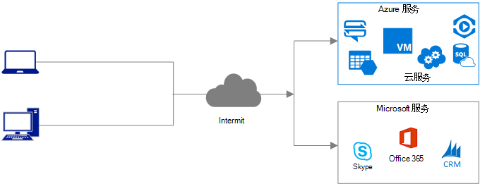
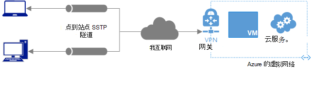
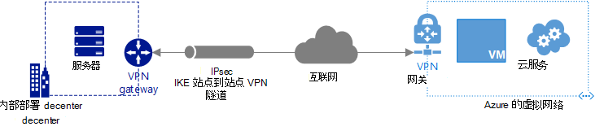
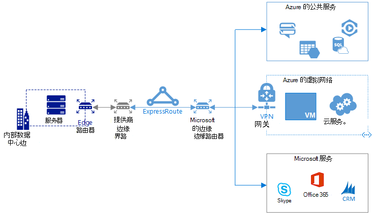

<properties
   pageTitle="您的内部网络连接到 Azure |Microsoft Azure"
   description="解释并将用于连接到 Microsoft 云服务，例如 Azure，Office 365 和 Dynamics CRM Online 的不同方法进行比较。"
   services=""
   documentationCenter="na"
   authors="jimdial"
   manager="carmonm"
   editor=""
   tags=""/>
<tags
   ms.service="guidance"
   ms.devlang="na"
   ms.topic="article"
   ms.tgt_pltfrm="na"
   ms.workload="na"
   ms.date="08/25/2016"
   ms.author="jdial"/>
   
# 您的内部网络连接到 Azure

Microsoft 提供了多种类型的云服务。 虽然可以通过公共互联网连接到的所有服务，也可以连接到使用虚拟专用网络 (VPN) 隧道，通过互联网或通过直接的专用连接到 Microsoft 的服务。 这篇文章可以帮助您确定哪个连接选项将最好地满足您根据您所使用的微软云服务类型的需求。 大多数组织使用多个连接类型如下所述。

## 通过公共互联网连接

此连接类型如下所示，直接通过互联网，提供给 Microsoft 云服务的访问。

该连接通常是用于连接到 Microsoft 云服务的第一个类型。 下表列出了此连接类型的优点和缺点。

| **优点**| **注意事项**|
|---------|---------|
|需要对您的内部网络未修改，只要所有的客户端设备具有无限制地的访问所有的 IP 地址和端口上互联网。|尽管通信通常使用 HTTPS 加密，它可以因为它遍历公共 Internet 截获在传输过程中。|
|可以连接到所有 Microsoft 云服务公开到公用互联网。|不可预知的延迟因为连接遍历互联网。|
|使用您现有的互联网连接。||
|不需要任何连接设备的管理。||

由于使用您现有的互联网连接，此连接有没有连接性和带宽成本。 

## 连接点到站点连接

此连接类型如下所示，通过互联网，提供通过安全套接字隧道协议 (SSTP) 隧道某些 Microsoft 云服务的访问。

连接由转移现有的 Internet 连接，但需要使用 Azure VPN 网关。 下表列出了此连接类型的优点和缺点。

| **优点**| **注意事项**|
|---------|---------|
|需要对您的内部网络未修改，只要所有的客户端设备具有无限制地的访问所有的 IP 地址和端口上互联网。|虽然使用 IPSec 加密的通信，它可以因为它遍历公共 Internet 截获在传输过程中。|
|使用您现有的互联网连接。|不可预知的延迟因为连接遍历互联网。|
|高达 200 Mb/s 每个网关的吞吐量。|需要创建和管理您的内部网络上的每个设备和每个设备需要连接到每个网关之间的单独连接。|
|可用于连接到 Azure 服务可以连接到 Azure 虚拟网络 (VNet) 的 Azure 的虚拟机和 Azure 云服务等。|需要最少的日常管理 Azure VPN 网关。|
||不能用来连接到 Microsoft Office 365 或 Dynamics CRM Online。
||不能用来连接到 Azure 服务无法连接到 VNet。|

了解有关[VPN 网关](../vpn-gateway/vpn-gateway-about-vpngateways.md)服务、[定价](https://azure.microsoft.com/pricing/details/vpn-gateway)、 及[定价](https://azure.microsoft.com/pricing/details/data-transfers)出站数据传输。

## 连接站点对站点连接

此连接类型如下所示，通过互联网，提供 IPSec 隧道通过某些 Microsoft 云服务的访问。

连接由转移现有的 Internet 连接，但需要使用与其相关的定价和定价的出站数据传输 Azure VPN 网关。 下表列出了此连接类型的优点和缺点。

| **优点**| **注意事项**|
|---------|---------|
|内部网络上的所有设备可以使用 Azure 服务连接到 VNet，所以不需要配置的每个设备的单个连接进行都通信。|虽然使用 IPSec 加密的通信，它可以因为它遍历公共 Internet 截获在传输过程中。|
|使用您现有的互联网连接。|不可预知的延迟因为连接遍历互联网。|
|可用于连接到 Azure 服务可以连接到虚拟机如 VNet 和云服务。|必须配置和管理验证 VPN 设备 * 内部。|
|高达 200 Mb/s 每个网关的吞吐量。|需要最少的日常管理 Azure VPN 网关。|
|可以强制从云通过内部检查和记录使用用户定义的路由或边界网关协议 (BGP) 网络的虚拟机启动出站通信 * *。|不能用来连接到 Microsoft Office 365 或 Dynamics CRM Online。|
||不能用来连接到 Azure 服务无法连接到 VNet。|
||如果您的安全策略要求您使用服务的初始化连接到内部设备，您可能需要之间的内部网络和 Azure 防火墙。|

- * 查看[验证 VPN 设备](../vpn-gateway/vpn-gateway-about-vpn-devices.md#validated-vpn-devices)的列表。
- * * 了解更多有关使用[用户定义的路由](../vpn-gateway/vpn-gateway-forced-tunneling-rm.md)或[BGP](../vpn-gateway/vpn-gateway-bgp-overview.md)强制从 Azure VNets 路由到内部设备。

## 使用专用的专用连接连接

此连接类型可以访问所有 Microsoft 云服务通过专门的专用连接，将不会遍历 Internet，Microsoft 为如下所示。

连接要求使用 ExpressRoute 服务和连接提供者的连接。 下表列出了此连接类型的优点和缺点。

| **优点**| **注意事项**|
|---------|---------|
|通信无法截获在传输过程中通过公共互联网由于则使用通过服务提供商的专用的连接。|需要内部路由器管理。|
|最高每 ExpressRoute 电路和最多 2 Gb/s 到每个网关的吞吐量 10 Gb/s 的带宽。|需要专用的连接到连接提供程序。|
|可预测的滞后时间因为它是不会遍历 Internet 的 Microsoft 的专用的连接。|（如果连接到 VNets 的电路），可能需要最少的一个或多个 Azure VPN 网关的日常管理。|
|但如果需要，您可以加密通信，不需要加密的通讯。| 如果您正在使用云服务，启动回内部设备的连接，您可能需要之间的内部网络和 Azure 防火墙。|
|可以直接连接到所有 Microsoft 云服务，与几个异常 *。|要求的服务无法连接到 VNet.* * 输入 Microsoft 数据中心的内部 IP 地址的网络地址转换 (NAT)|
|可以强制从云通过检查和记录使用 BGP 内部网络的虚拟机启动出站通信。|

- * 查看[列表中的服务](../expressroute/expressroute-faqs.md#supported-services)不能与 ExpressRoute 一起使用。 Azure 订阅必须经过批准才能连接到 Office 365。  请参阅[Office 365 的 Azure ExpressRoute](https://support.office.com/article/Azure-ExpressRoute-for-Office-365-6d2534a2-c19c-4a99-be5e-33a0cee5d3bd?ui=en-US&rs=en-US&ad=US&fromAR=1)文章以了解详细信息。
- * * 了解更多有关 ExpressRoute [NAT](../expressroute/expressroute-nat.md)的要求。

了解有关[ExpressRoute](../expressroute/expressroute-introduction.md)、 其关联[的定价](https://azure.microsoft.com/pricing/details/expressroute)和[连接提供程序](../expressroute/expressroute-locations.md#connectivity-provider-locations)的详细信息。

## 其他注意事项

- 上面的选项的几个具有不同的最大限制，他们能够支持 VNet 连接，网关连接和其他条件。 建议您检查 Azure[限制网络](../azure-subscription-service-limits.md#networking-limits)来了解是否其中的任何影响您选择要使用的连接类型。 
- 如果您计划连接到相同的 ExpressRoute 网关作为 VNet 网关站点到站点 VPN 连接，您应该熟悉重要限制第一次。 请参阅[配置 ExpressRoute 和共存的站点到站点连接](../expressroute/expressroute-howto-coexist-resource-manager.md#limits-and-limitations)以获得详细信息。

## 下一步行动

下面的资源解释如何实现本文中涉及的连接类型。

-   [实现点到站点连接](../vpn-gateway/vpn-gateway-howto-point-to-site-rm-ps.md)
-   [实现一个站点到站点连接](guidance-hybrid-network-vpn.md)
-   [实现专用的专用连接](guidance-hybrid-network-expressroute.md)
-   [实现高可用性的站点对站点连接的专用专用连接](guidance-hybrid-network-expressroute-vpn-failover.md)
