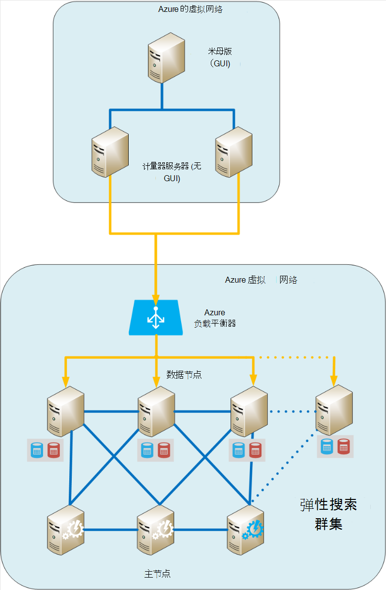
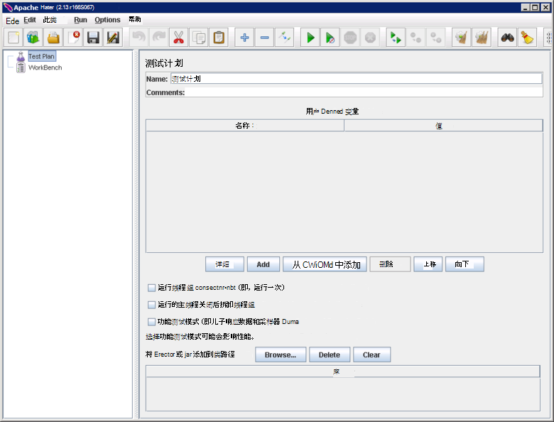
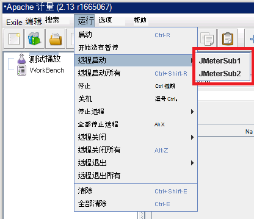
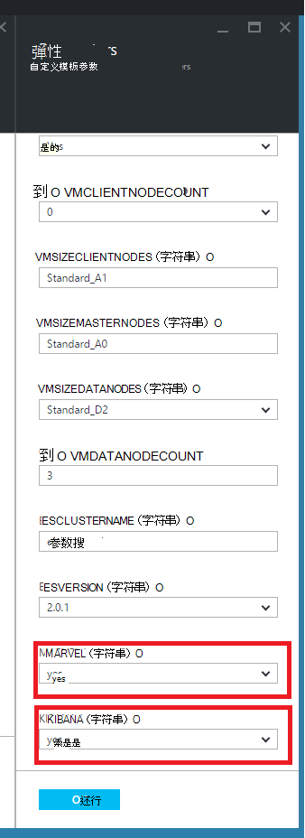
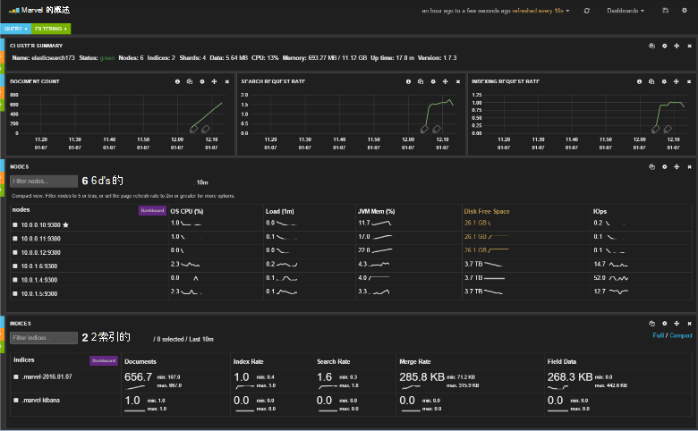
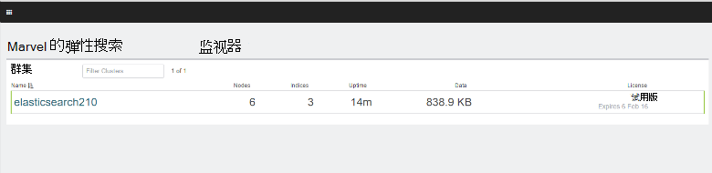
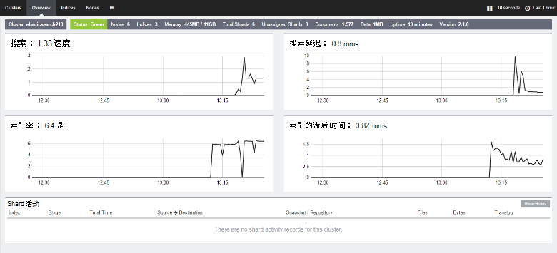

<properties
   pageTitle="创建性能测试环境 Elasticsearch |Microsoft Azure"
   description="如何设置环境用于测试 Elasticsearch 群集的性能。"
   services=""
   documentationCenter="na"
   authors="dragon119"
   manager="bennage"
   editor=""
   tags=""/>

<tags
   ms.service="guidance"
   ms.devlang="na"
   ms.topic="article"
   ms.tgt_pltfrm="na"
   ms.workload="na"
   ms.date="09/22/2016"
   ms.author="masashin"/>
   
# <a name="creating-a-performance-testing-environment-for-elasticsearch-on-azure"></a>创建测试环境在 Azure 上 Elasticsearch 的性能

[AZURE.INCLUDE [pnp-header](../../includes/guidance-pnp-header-include.md)]

本文是[一系列的一部分](guidance-elasticsearch.md)。 

本文档描述如何设置用于测试性能的 Elasticsearch 群集环境。 此配置用于测试的数据接收和查询工作负载，性能[调整数据接收性能在 Azure 上 Elasticsearch][]中所述。

性能测试过程中使用[Apache JMeter](http://jmeter.apache.org/)，与[标准设置](http://jmeter-plugins.org/wiki/StandardSet/)的插件安装在主/从配置中使用一套专用的虚拟机 （而不是 Elasticsearch 群集的一部分） 专门配置的目的。 

在 Elasticsearch 中的每个节点上安装[性能监视器服务器代理](http://jmeter-plugins.org/wiki/PerfMonAgent/)。 以下各节介绍了用于重新创建测试环境以使您能够执行您自己的性能测试使用 JMeter。 这些说明假定，您已经创建 Elasticsearch 群集节点使用 Azure 的虚拟网络连接。 

请注意，作为 Azure Vm 通过使用单个 Azure 资源组来管理一组还可以运行测试环境。

[Marvel](https://www.elastic.co/products/marvel)也已安装并配置为启用 Elasticsearch 群集监视和更轻松地分析内部方面。 如果 JMeter 统计显示性能的峰值或波谷，信息可通过 Marvel 难以估量有助于确定波动的原因。

下图显示了整个系统的结构。 



请注意以下几点︰

- JMeter 主虚拟机运行 Windows 服务器，以提供为 JMeter 控制台 GUI 环境。 JMeter 主虚拟机提供了图形用户界面 （ *jmeter*应用程序） 来启用测试人员需要创建测试，运行测试，并直观地显示结果。 此 VM 协调使用 JMeter 服务器实际发送的请求的构成测试的 Vm。

- JMeter 下属虚拟机运行 Ubuntu 服务器 (Linux)，这些虚拟机没有 GUI 要求。 JMeter 服务器运行 JMeter 的服务器软件 （ *jmeter 服务器*应用程序） 将请求发送到 Elasticsearch 群集虚拟机中。

- 未使用专用客户端节点，虽然专门的主节点。

- 数据群集中的节点数随被测方案的不同而不同。

- Elasticsearch 群集中的所有节点都运行 Marvel 观察在运行时，性能和 JMeter 服务器代理收集监控数据以备日后分析。

- 测试 Elasticsearch 2.0.0 时和以后的某个数据节点还可以运行 Kibana。 这是 marvel 的必需 Elasticsearch 2.0.0 上运行的版本及更高版本。

## <a name="creating-an-azure-resource-group-for-the-virtual-machines"></a>创建虚拟机的 Azure 的资源组

JMeter 主服务器需要能够直接连接到每个要收集的性能数据 Elasticsearch 群集中的节点。 如果 JMeter VNet 与 Elasticsearch 群集 VNet 不同，这需要配置一个公用 IP 地址 Elasticsearch 中的每个节点。 如果这问题您 Elasticsearch 的配置，然后考虑实现作为 Elasticsearch 群集相同的 VNet JMeter Vm 使用同一个资源组，在这种情况下则可以省略此第一个步骤。

第一，[创建资源组](../resource-group-template-deploy-portal.md)。 本文档假定您的资源组被命名为*JMeterPerformanceTest*。 如果您想在相同的 VNet 与 Elasticsearch 群集中运行 JMeter Vm，作为，而不是创建一个新群集使用相同的资源组。

## <a name="creating-the-jmeter-master-virtual-machine"></a>创建 JMeter 主虚拟机

下一步[创建一个 Windows 虚拟机](../virtual-machines/virtual-machines-windows-hero-tutorial.md)使用*Windows Server 2008 R2 SP1*图像。  建议您选择具有足够的核和内存来运行性能测试的 VM 大小。 理想情况下，这将是具有至少 2 内核和 3.5 GB 的 RAM 的计算机 (A2 标准或变大)。

<!-- TODO add info on why disabling diagnostics is positive --> 

我们建议您禁用运行诊断程序。 当在门户中创建虚拟机，这是在*监视*部分下*诊断**设置*刀片式服务器上。 将其他设置保留为其默认值。

验证的虚拟机和相关联的所有资源已成功创建门户中[检查该资源组](../azure-portal/resource-group-portal.md#manage-resource-groups)。 列出的资源应包括虚拟机、 网络安全组，以及所有具有相同的名称，一个公共 IP 地址和基于虚拟机的名称与网络接口和存储帐户。

## <a name="creating-the-jmeter-subordinate-virtual-machines"></a>创建从属 JMeter 的虚拟机

现在[创建一个 Linux 虚拟机](../virtual-machines/virtual-machines-linux-quick-create-portal.md)使用*Ubuntu 14.04 LTS 服务器*映像。  如使用 JMeter 主虚拟机，选择具有足够的核和内存来运行性能测试的 VM 大小。 理想情况下，这将是至少 2 个核心，并且至少 3.5 GB 的 RAM 的机器 (标准 A2 或变大)。

再次，我们建议您禁用运行诊断程序。

您还可以按您希望的任意多个从属虚拟机。 

## <a name="installing-jmeter-server-on-the-jmeter-subordinate-vms"></a>JMeter 下属虚拟机上安装 JMeter 服务器

JMeter 下属虚拟机正在运行 Linux，默认情况下您无法连接到它们通过打开远程桌面连接 (RDP)。 相反，您可以在每个虚拟机上[使用 PuTTY 打开命令行窗口](../virtual-machines/virtual-machines-linux-mac-create-ssh-keys.md)。

一旦连接到一个从属的虚拟机，我们将使用 Bash 设置 JMeter。

首先，安装 Java 运行时环境运行 JMeter 所必需的。

```bash
sudo add-apt-repository ppa:webupd8team/java
sudo apt-get update
sudo apt-get install oracle-java8-installer
```

现在，下载 JMeter 软件打包为一个 zip 文件。

```bash
wget http://apache.mirror.anlx.net/jmeter/binaries/apache-jmeter-2.13.zip
```

安装解压缩命令，然后使用它来展开 JMeter 软件。 软件被复制到一个名为**apache-jmeter 2.13**文件夹。

```bash
sudo apt-get install unzip
unzip apache-jmeter-2.13.zip
```

更改到*bin*目录中存放 JMeter 的可执行文件，并使*jmeter 服务器*和*jmeter*的程序可执行文件。

```bash
cd apache-jmeter-2.13/bin
chmod u+x jmeter-server
chmod u+x jmeter
```

现在，我们需要编辑的文件`jmeter.properties`位于当前文件夹中 （使用文本编辑器在最熟悉，如*vi*或*vim*）。 找到以下行︰

```yaml
...
client.rmi.localport=0
...
server.rmi.localport=4000
...
```

取消注释 (删除前导\## 字符)，并修改这些行，如下所示，然后保存该文件并关闭编辑器︰

```yaml
...
client.rmi.localport=4441
...
server.rmi.localport=4440
```

现在，运行以下命令以打开到传入的 TCP 通信的端口 4441 （这是刚配置*jmeter 服务器*侦听的端口）︰

```bash
sudo iptables -A INPUT -m state --state NEW -m tcp -p tcp --dport 4441 -j ACCEPT
```

下载包含的插件 JMeter （这些插件提供了性能监视计数器） 的标准集合的 zip 文件，然后将它解压缩到**apache-jmeter 2.13**文件夹。 解压缩此位置中的文件放置在正确的文件夹中的插件。

如果系统提示您替换许可证文件时，键入 A （全部）︰

```bash
wget http://jmeter-plugins.org/downloads/file/JMeterPlugins-Standard-1.3.0.zip
unzip JMeterPlugins-Standard-1.3.0.zip
```

使用`nohup`启动 JMeter 服务器在背景中的。 它应该通过显示进程 ID 和一个消息，指示它已创建远程对象，并已准备好开始接收命令作出响应。  在 ~/apache-jmeter-2.13/bin 目录中运行以下命令。 

```bash
nohup jmeter-server &
```

> [AZURE.NOTE]如果 VM 关机被终止 JMeter 服务器程序。 您需要连接到虚拟机并再次手动重新启动它。 或者，您可以配置系统以添加到下面的命令启动时自动运行*jmeter 服务器*命令`/etc/rc.local`（前*退出 0*命令） 的文件︰

```bash
sudo -u <username> bash << eoc
cd /home/<username>/apache-jmeter-2.13/bin
nohup ./jmeter-server &
eoc
```

更换`<username>`与您的登录名。

您可能会发现很有用，可以使终端窗口保持打开状态，以便您可以在测试过程中监视 JMeter 服务器的进度。

您将需要重复这些步骤，为每个 JMeter 下属 VM。

## <a name="installing-the-jmeter-server-agent-on-the-elasticsearch-nodes"></a>Elasticsearch 节点上安装 JMeter 服务器代理

此过程假定您已登录到 Elasticsearch 节点的访问权。 如果您创建了群集使用资源管理器模板，您可以连接到通过跳转框虚拟机，每个节点中，如[在 Azure 上运行 Elasticsearch](guidance-elasticsearch-running-on-azure.md)的 Elasticsearch 拓扑部分中所示。 您可以连接到使用 PuTTY 以及跳转框中。 

据此，可以使用*ssh*命令登录到每个 Elasticsearch 群集中的节点。

以管理员身份登录到 Elasticsearch 节点中的一个。  在 Bash 命令提示符下输入以下命令以创建一个文件夹用于存放 JMeter 服务器代理和移动到该文件夹︰

```bash
mkdir server-agent
cd server-agent
```

运行以下命令以安装*解压缩*命令 （如果尚未安装），下载 JMeter 服务器代理软件，并将其解压缩︰

```bash
sudo apt-get install unzip
wget http://jmeter-plugins.org/downloads/file/ServerAgent-2.2.1.zip
unzip ServerAgent-2.2.1.zip
```
 
运行下面的命令来配置防火墙和启用 TCP 通讯通过端口 4444 （这是使用 JMeter 服务器代理的端口）︰

```bash
sudo iptables -A INPUT -m state --state NEW -m tcp -p tcp --dport 4444 -j ACCEPT
```

运行以下命令以在后台启动 JMeter 服务器代理︰

```bash
nohup ./startAgent.sh &
```

JMeter 服务器代理应该显示消息，指示它已启动并正在侦听端口 4444。  按 Enter 键获取命令提示符，然后运行下面的命令。

```bash
telnet <nodename> 4444
```

更换`<nodename>`您的节点的名称。 (您可以找到您的节点的名称通过运行`hostname`命令。)此命令会打开一个 telnet 连接到您的本地计算机上的端口 4444。 可以使用此连接来验证 JMeter 服务器代理正在正常运行。

如果 JMeter 服务器代理未运行，您将收到响应 

`*telnet: Unable to connect to remote host: Connection refused*.`

如果已正确配置端口 4444 JMeter 服务器代理正在运行，您应该看到以下响应︰


> [AZURE.NOTE] 一旦它具有连接 telnet 会话不提供任何种类的提示。

在 telnet 会话中，键入以下命令︰

``` 
test
```

如果配置 JMeter 服务器代理和监听正确，应指示它收到命令并使用*Yep*消息进行响应。

> [AZURE.NOTE]您可以键入其他命令以获取性能监视数据。 例如，命令`metric-single:cpu:idle`将为您提供当前的 CPU 处于空闲状态 （这是快照） 的时间比例。 命令的完整列表，请访问[性能监视器服务器代理](http://jmeter-plugins.org/wiki/PerfMonAgent/)页。 ︰ 返回到调用它他 Perfmon 服务器代理。 >>

在 telnet 会话中，键入下面的命令以退出此会话并返回到 Bash 命令提示符︰

``` 
exit
```

> [AZURE.NOTE]如使用 JMeter 从属 Vm，如果您注销时，或如果这台机器是关机并重新启动然后 JMeter 服务器代理将需要手动重新启动使用`startAgent.sh`命令。 如果您想要自动启动的 JMeter 服务器代理，将以下命令添加到末尾`/etc/rc.local`文件，*退出 0*命令之前。 
> 更换`<username>`与您的登录名︰

```bash
sudo -u <username> bash << eoc
cd /home/<username>/server-agent
nohup ./startAgent.sh &
eoc
```

您可以现在或者重复整个过程的 Elasticsearch 群集中的每个节点，也可以使用`scp`命令将服务器代理的文件夹及其内容复制到每个节点并使用`ssh`命令启动 JMeter 服务器代理，如下所示。 e 替换`<username>`以您的用户名，并`<nodename>`想要复制和运行的软件 （可能会要求您提供密码，每个命令运行时） 的节点的名称︰

```bash
scp -r \~/server-agent <username>@<nodename>:\~
ssh <nodename> sudo iptables -A INPUT -m state --state NEW -m tcp -p tcp --dport 4444 -j ACCEPT
ssh <nodename> -n -f 'nohup \~/server-agent/startAgent.sh'
```

## <a name="installing-and-configuring-jmeter-on-the-jmeter-master-vm"></a>安装和配置 JMeter JMeter 主虚拟机上

在 Azure 的门户中，单击**资源组**。 在**资源组**刀片式服务器，请单击包含 JMeter 主服务器和从属的虚拟机的资源组。  在**资源组**刀片式服务器，请单击**JMeter 主虚拟机**。 在虚拟机刀片，在工具栏上，单击**连接**。 打开 RDP 文件时提示您的 web 浏览器。 Windows 将创建到您的虚拟机的远程桌面连接。  VM 在提示时输入的用户名和密码。

在虚拟机，使用 Internet Explorer 转到[下载 Java 窗口](http://www.java.com/en/download/ie_manual.jsp)页。 按照说明下载和运行 Java 安装程序。

在 web 浏览器中，转到[下载 Apache JMeter](http://jmeter.apache.org/download_jmeter.cgi)网页和下载 zip 包含最新的二进制文件。 在 VM 上的方便位置保存 zip。

转到[自定义 JMeter 插件](http://jmeter-plugins.org/)的站点并下载插件的标准集。 从上一步，为 JMeter 下载相同的文件夹中保存 zip。

在 Windows 资源管理器中，转到包含 apache 的文件夹-jmeter 的*xxx*的 zip 文件，其中*xxx*是 JMeter 的当前版本。 将文件解压缩到当前文件夹。

JMeterPlugins 文件提取-标准-*yyy*.zip 文件，其中*yyy*是当前版本的插件，到 apache-jmeter 的*xxx*文件夹。 这将为 JMeter 插件添加到正确的文件夹中。 可以安全地合并 lib 文件夹中，并覆盖的许可证和自述文件，如果系统提示您。

转到 apache-jmeter 的*xxx*/bin 文件夹和编辑 jmeter.properties 文件中使用记事本。  在`jmeter.properties`文件，请找到标记为*远程主机和 RMI 配置*的部分。  在文件的此部分中，找到以下行︰

```yaml
remote_hosts=127.0.0.1
```

将此行更改并替换 IP 地址或主机名，每个 JMeter 从属服务器的 IP 地址 127.0.0.1 逗号分隔列表。 例如︰

```yaml
remote_hosts=JMeterSub1,JMeterSub2
```

找到以下行，然后删除`#`字符开头的行中，并修改的 client.rmi.localport 设置的值︰

```yaml
#client.rmi.localport=0
```

自：

```yaml
client.rmi.localport=4440
```

保存文件并关闭记事本。 

在 Windows 工具栏中，单击**开始**，单击**管理工具**，然后单击**具有高级安全性的 Windows 防火墙**。  在 Windows 防火墙中使用高级安全窗口，请在左窗格中，右键单击**入站规则**，然后单击**新建规则**。

在**新建入站规则向导****规则类型**页上选择**端口**，然后单击**下一步**。  在协议和端口页上，选择**TCP**，请在文本框中键入选择**特定的本地端口**， `4440-4444`，然后单击**下一步**。  在操作页中，选择**允许连接**，然后单击**下一步**。 在配置文件页上将选中所有选项，然后单击**下一步**。  在名称页中，在**名称**文本框中键入*JMeter*，，然后单击**完成**。  关闭具有窗口高级安全性的 Windows 防火墙。

在 Windows 资源管理器 apache-jmeter 的*xx*/bin 文件夹中，双击*jmeter* Windows 批处理文件来启动 GUI。 应显示用户界面︰



在菜单栏中，单击**运行**，单击**远程启动**并验证列出两个 JMeter 从属机︰



现在您就可以开始进行性能测试。

## <a name="installing-and-configuring-marvel"></a>安装和配置 Marvel

Azure Elasticsearch 快速启动模板将安装并自动配置 Marvel 的适当版本，如果您设置 MARVEL 和 KIBANA 参数为 true （"是"），当构建群集︰



如果 Marvel 添加到一个现有的群集，您需要手动执行安装和过程是不同，这取决于使用的 Elasticsearch 版本 1.7.x 或 2.x，如以下过程所述。

### <a name="installing-marvel-with-elasticsearch-173-or-earlier"></a>安装 Marvel 与 Elasticsearch 1.73 或更早版本

如果您使用的 Elasticsearch 1.7.3 或更早版本，执行以下步骤*在每个节点上*群集中︰

- 登录到该节点，并将移动到 Elasticsearch 主目录。  典型的主目录是在 Linux 上， `/usr/share/elasticsearch`。

-  运行下面的命令以下载并安装 Elasticsearch Marvel 插件︰

```bash
sudo bin/plugin -i elasticsearch/marvel/latest
```

- 停止并重新启动该节点上的 Elasticsearch:

```bash
sudo service elasticsearch restart
```

- 要验证是否已正确安装 Marvel，打开 web 浏览器并转到的 URL `http://<server>:9200/_plugin/marvel`。 更换`<server>`与群集中任何 Elasticsearch 服务器的 IP 地址的名称。  验证出现页面类似于如下所示︰




### <a name="installing-marvel-with-elasticsearch-200-or-later"></a>使用 Elasticsearch 2.0.0 安装 Marvel 或更高版本

如果使用的 Elasticsearch 2.0.0 或更高版本，执行以下任务*的每个节点上*群集中︰

登录到该节点，并将移动到 Elasticsearch 主目录 (通常`/usr/share/elasticsearch`) 运行下面的命令以下载并安装 Elasticsearch Marvel 插件︰

```bash
sudo bin/plugin install license
sudo bin/plugin install marvel-agent
```

停止并重新启动该节点上的 Elasticsearch:

```bash
sudo service elasticsearch restart
```

在下面的过程中，替换`<kibana-version>`与 4.2.2 如果您使用的 Elasticsearch 2.0.0 或 Elasticsearch 2.0.1，或如果您使用的 Elasticsearch 2.1.0 4.3.1 或更高版本。  更换`<marvel-version>`与 2.0.0 如果您使用的 Elasticsearch 2.0.0 或 Elasticsearch 2.0.1，或如果您使用的 Elasticsearch 2.1.0 2.1.0 或更高版本。  下列任务*在一个节点上*执行群集中︰

登录到该节点并从[Elasticsearch 网站下载](https://www.elastic.co/downloads/past-releases)，下载适当的版本的 Kibana 版本的 Elasticsearch，然后解压缩程序包︰

```bash
wget https://download.elastic.co/kibana/kibana/kibana-<kibana-version>-linux-x64.tar.gz
tar xvzf kibana-<kibana-version>-linux-x64.tar.gz
```

打开端口 5601 以接受传入的请求︰

```bash
sudo iptables -A INPUT -m state --state NEW -m tcp -p tcp --dport 5601 -j ACCEPT
```

将移动到 Kibana 配置文件夹 (`kibana-<kibana-version>-linux-x64/config`)，编辑`kibana.yml`文件中，并添加下面的行。 更换`<server>`与 Elasticsearch 中的服务器群集的 IP 地址的名称︰

```yaml
elasticsearch.url: "http://<server>:9200"
```

移动到 Kibana bin 文件夹 (`kibana-<kibana-version>-linux-x64/bin`)，然后运行下面的命令以将 Marvel 插件集成到 Kibana:

```bash
sudo ./kibana plugin --install elasticsearch/marvel/<marvel-version>
```

启动 Kibana:

```bash
sudo nohup ./kibana &
```

要验证 Marvel 安装，请打开 web 浏览器并转到的 URL `http://<server>:5601/app/marvel`。 更换`<server>`与 Kibana 运行的服务器的 IP 地址的名称。

验证是否出现类似于如下所示的页面 （您群集的名称可能会有所不同从该图所示）。



请单击对应于您的群集的链接 (在上图中的 elasticsearch210)。 应出现类似于如下所示的页面︰




[在 Azure 上 Elasticsearch 的数据接收性能调优]: guidance-elasticsearch-tuning-data-ingestion-performance.md  