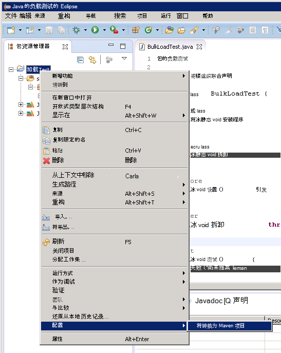
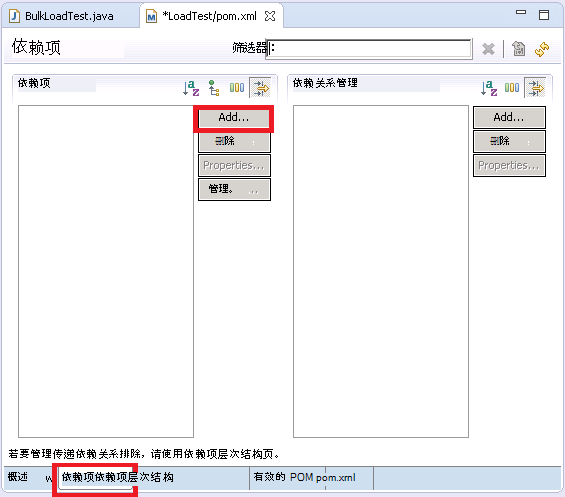
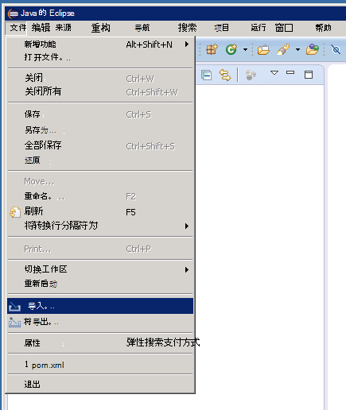

<properties
   pageTitle="为测试 Elasticsearch 性能部署 JMeter JUnit 取样器 |Microsoft Azure"
   description="使用 JUnit 取样器来生成并上传到 Elasticsearch 的群集数据的方式。"
   services=""
   documentationCenter="na"
   authors="dragon119"
   manager="bennage"
   editor=""
   tags=""/>

<tags
   ms.service="guidance"
   ms.devlang="na"
   ms.topic="article"
   ms.tgt_pltfrm="na"
   ms.workload="na"
   ms.date="09/22/2016"
   ms.author="masashin"/>
   
# 为测试 Elasticsearch 性能部署 JMeter JUnit 取样器

[AZURE.INCLUDE [pnp-header](../../includes/guidance-pnp-header-include.md)]

本文是[一系列的一部分](guidance-elasticsearch.md)。 

本文档介绍如何创建和使用 JUnit 取样器，可以生成并上传到 Elasticsearch 群集数据，作为 JMeter 测试计划的一部分。 这种方法提供了高度灵活的方法来负载测试可以生成大量的测试数据而无需根据外部数据文件。

> [AZURE.NOTE] 使用这种方法构造用于评估性能的[优化数据接收性能的 Elasticsearch](guidance-elasticsearch-tuning-data-ingestion-performance.md)中所述的数据提取的负载测试。 该文档中描述的 JUnit 代码的详细信息。

为了测试数据接收性能，JUnit 代码一直使用 Eclipse (Mars) 在开发和使用 Maven 解析依赖项。 下面的过程描述安装 Eclipse 配置 Maven，创建 JUnit 测试，以及为 JMeter 测试中一个 JUnit 请求示例部署此测试步骤的过程。

> [AZURE.NOTE] 有关的结构和测试环境的配置的详细信息，请参阅[创建在 Azure 上 Elasticsearch 的性能测试环境][]。

## 安装系统必备组件

在开发计算机上，您将需要[Java 运行时环境](http://www.java.com/en/download/ie_manual.jsp)。
您还需要安装[Eclipse IDE 为 Java 开发人员](https://www.eclipse.org/downloads/index.php?show_instructions=TRUE)。

> [AZURE.NOTE] 如果您正在使用 JMeter 主虚拟机作为开发环境[创建在 Azure 上 Elasticsearch 的性能测试环境][]中所述，下载 Eclipse 安装的 Windows 32 位版本。

## 创建负载测试 Elasticsearch JUnit 测试项目

如果尚未运行，则启动 Eclipse IDE，然后关闭**欢迎**页面。  在**文件**菜单上单击，然后单击**Java 项目**。

在**新的 Java 项目**窗口中，输入项目名称，选择**使用默认的 JRE**，，然后单击**完成**。

在**包资源管理器**窗口中，展开节点命名项目。 验证它包含文件夹命名为**src**和您指定的 JRE 的参考。

用鼠标右键单击**源**文件夹，单击**新建**，然后单击**JUnit 测试用例**。

在**新的 JUnit 测试用例**窗口中，选择**新的 Junit 4 测试**中，输入一个名称 （这可以是项目的名称相同虽然应该开始用小写字母按照约定） 包，该测试类，并选择生成方法存根测试所需的选项的名称。 将**测试类**框留空，，然后单击**完成**。

如果出现以下**新的 JUnit 测试用例**对话框，选择选项以生成路径中添加 JUnit 4 库，然后单击**确定**。 

请验证生成并在 Java 编辑器窗口中显示的 JUnit 测试框架的代码。

在**包资源管理器**中右键单击项目的节点，单击**配置**，然后单击**转换为 Maven 项目**。

> [AZURE.NOTE]使用 Maven 使您能够更轻松地管理 （如 Elasticsearch Java 客户端库） 的外部依赖项的项目而定。

在**创建新 POM**对话框中，在**包装**下拉列表中，选择**jar**，，然后单击**完成**。

项目对象模型 (POM) 编辑器下方会显示窗格中可能会显示警告"生成路径指定的执行环境 J2SE 1.5。 有没有与此环境严格兼容的 Jre 安装在工作区中"，这取决于哪个版本的 Java，安装在开发计算机上。 如果必须晚于版本 1.5，您可以放心地忽略此警告的 Java 版本。

在 POM 编辑器中，展开**属性**，然后单击**创建**。

在**添加属性**对话框中，在**名称**框中键入*es.version*，在**值**框中键入*1.7.2*，，然后单击**确定**。 这是 Elasticsearch Java 客户端库使用的版本 （此版本可能在将来取代和作为 POM 属性定义版本和引用该属性在项目中的其他位置可以快速更改的版本）。

单击的 POM 编辑器底部的**依赖项**选项卡，然后单击**添加**旁边的**依存关系**列表。

在**选择依赖项**对话框中，在**组 Id**框中键入*org.elasticsearch*，在**项目 Id**框中键入*elasticsearch*，在**版**框中键入*\${es.version}*，然后单击**确定**。 有关 Java Elasticsearch 客户端库信息都存储在联机中央 Maven 存储库中，并且这种配置将自动下载库及其依赖项时生成此项目。

在**文件**菜单上，单击**全部保存**。 此操作将保存并生成项目时，下载 Maven 所指定的依赖项。 验证包资源管理器中显示，Maven 依赖项 \ 文件夹。 展开此文件夹可以查看下载支持 Elasticsearch Java 客户端库的 jar 文件。

## 导入 Eclipse 的现有的 JUnit 测试项目

此过程假定您已下载以前创建通过使用 Eclipse 的 Maven 项目。

启动 Eclipse 的 IDE。 在**文件**菜单上，单击**导入**。

中**选择**窗口中，展开**Maven**文件夹，单击**现有 Maven 项目**，然后单击**下一步**。

在**Maven 项目**窗口中，指定文件夹保存项目 （pom.xml 文件所在的文件夹），单击**全选**，然后单击**完成**。

在**包资源管理器**窗口中，展开对应于您的项目的节点。 验证项目包含一个名为**src**文件夹。 此文件夹包含 JUnit 测试的源代码。 该项目可用于编译和部署按照下面的说明进行操作。

## 部署到 JMeter 的 JUnit 测试

此过程假定您已创建一个名为 LoadTest 包含一个名为的 JUnit 测试类项目`BulkLoadTest.java`接受作为单一字符串传递到构造函数 （这是预期 JMeter 的机制） 的配置参数。

在 Eclipse 的 IDE，在**包资源管理器**中右键单击项目节点，，然后单击**导出**。

在**导出向导**上的**选择**页中，展开**Java**节点， **JAR 文件**，请单击，然后单击**下一步**。

在**JAR 文件规范**页上，在**选择要导出的资源**框中，展开项目取消选择**.project**，并取消选择**pom.xml**。 在**JAR 文件**中，为 （应向其提供.jar 文件扩展名） 的 JAR，提供文件的名称和位置，然后单击**完成**。

使用 Windows 资源管理器复制到 JMeter 主 JVM 刚创建并将其保存在 apache jmeter 2.13 JAR 文件\\lib\\junit JMeter 的安装位置文件夹下的文件夹 （请参阅"创建 JMeter 主虚拟机"的过程[创建在 Azure 上 Elasticsearch 的性能测试环境](guidance-elasticsearch-creating-performance-testing-environment.md)中的详细信息）。

返回到 Eclipse 扩展**包资源管理器**窗口，记下所有的 JAR 文件和项目的 Maven 依赖项 \ 文件夹中列出其位置。 注意下图中显示的文件可能不同，具体取决于您正在使用哪个版本的 Elasticsearch:

使用 Windows 资源管理器复制到 apache jmeter 2.13 Maven 依赖项 \ 文件夹中引用每个 JAR 文件\\lib\\junit JMeter 主虚拟机文件夹。

如果 lib\\junit 文件夹已经包含这些 JAR 文件的旧版本，然后将其删除。 如果将其保留在原处 JUnit 测试不可能工作如引用都能被解析为错误的 Jar。

JMeter 母版虚拟机上停止 JMeter，如果当前正在运行。  从 JMeter 的开始。  在 JMeter，右键单击**测试计划**，单击**添加**、**线程 （用户）**，请单击，然后单击**线程组**。

在**测试计划中**节点下，右击**线程组**，单击**添加**、**取样器**，请单击，然后单击**JUnit 请求**。

在**JUnit 请求**页上选择**搜索 （而不是 JUnit 3) JUnit4 批注**。 在**类名**下拉列表中选择负载 JUnit 测试类 (它将列在窗体中*&lt;包&gt;。&lt;类&gt;*)，在**测试方法**中下拉列表中选择 JUnit 测试方法 (这是实际执行与测试关联的工作方法，应使用标记*@test*Eclipse 项目中的注释)，然后输入的值都将传递给**构造函数的字符串标签**框中的构造函数。 如下图所示的详细信息都只是示例;您的**类名**，**测试方法*，并**构造函数字符串标签** 将可能不同于所示。

如果您的类不会出现在**类名**下拉列表中，则可能意味着罐不正确导出或尚未在 lib 用于\\junit 文件夹或某些依赖 Jar 0306 lib\\junit 文件夹。 如果发生这种情况，从 Eclipse 再次导出该项目，并确保您已选择**src**资源，将 JAR 复制到 lib\\junit 文件夹中，然后验证您是否已复制到 lib 文件夹中列出的 Maven 依赖 Jar 的所有。

关闭 JMeter。 没有需要保存的测试计划。  复制包含 /home/ 的 JUnit 测试类的 JAR 文件&lt;用户名&gt;个 JMeter 下属 Vm 上的 /apache-jmeter-2.13/lib/junit 文件夹 (*&lt;用户名&gt;*的名称您的管理用户指定创建 VM 时，信息，请参阅"创建从属 JMeter 的虚拟机"的过程中[创建在 Azure 上 Elasticsearch 的性能测试环境](guidance-elasticsearch-creating-performance-testing-environment.md)。)

复制到 /home/ 的 JUnit 测试类所需的从属 JAR 文件&lt;用户名&gt;个 JMeter 下属 Vm 上的 /apache-jmeter-2.13/lib/junit 文件夹。 请确保首先从此文件夹中删除任何旧版本的 JAR 文件。

您可以使用`pscp`实用程序将文件从 Windows 计算机复制到 Linux。

[创建测试环境在 Azure 上 Elasticsearch 的性能]: guidance-elasticsearch-creating-performance-testing-environment.md
