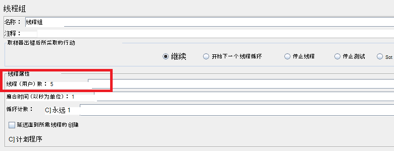
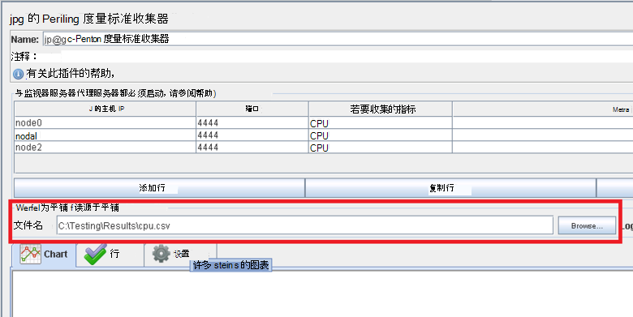
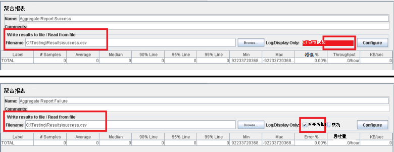
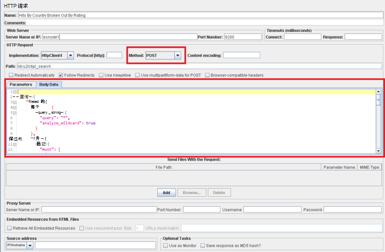

<properties
   pageTitle="JMeter 测试计划实现 Elasticsearch |Microsoft Azure"
   description="如何运行性能测试使用 JMeter 的 Elasticsearch。"
   services=""
   documentationCenter="na"
   authors="dragon119"
   manager="bennage"
   editor=""
   tags=""/>

<tags
   ms.service="guidance"
   ms.devlang="na"
   ms.topic="article"
   ms.tgt_pltfrm="na"
   ms.workload="na"
   ms.date="09/22/2016"
   ms.author="masashin" />
   
# <a name="implementing-a-jmeter-test-plan-for-elasticsearch"></a>JMeter 测试计划实现 Elasticsearch

[AZURE.INCLUDE [pnp-header](../../includes/guidance-pnp-header-include.md)]

本文是[一系列的一部分](guidance-elasticsearch.md)。 

使用 JMeter 测试计划以及合并作为 JUnit 测试执行任务，例如将数据上载到该群集的 Java 代码实现了对 Elasticsearch 进行了性能测试。 [在 Azure 上 Elasticsearch 的调整数据接收性能][]和[调整数据聚合和查询性能的 Elasticsearch 在 Azure 上][]描述了测试计划和 JUnit 代码。

本文档的目的是总结的重要经验获得了从构建并运行这些测试计划。 Apache JMeter 网站上[JMeter 的最佳](http://jmeter.apache.org/usermanual/best-practices.html)页包含有关有效地使用 JMeter 更通用的建议。

## <a name="implementing-a-jmeter-test-plan"></a>实施 JMeter 测试计划

下面的列表总结了创建 JMeter 测试计划时应考虑的项目︰

- 创建您想要执行每个测试单独的线程组。 测试可包含多个步骤，包括逻辑控制器，计时器前,、 后处理器、 取样器和侦听器。

- 应避免创建过多的线程的线程组中。 过多的线程将会导致 JMeter 来失败，出现"内存不足"的异常。 最好是每个运行较少的尝试 JMeter 在单个服务器上运行大量线程的多线程中添加更多 JMeter 的从属服务器。



- 评估该群集的性能、 可并入该测试计划的[性能度量标准收集器](http://jmeter-plugins.org/wiki/PerfMon/)插件。 这是作为一个标准的 JMeter 插件可用 JMeter 侦听器。 原始性能数据保存到一套以逗号分隔值 (CSV) 格式的文件，测试完成后对其进行处理。 这是更有效，并施加比试图处理的数据，因为它捕获 JMeter 较少压力。 



可用于一种工具，这样 Excel 中导入数据和分析用于生成一定范围的关系图。

请考虑以下信息︰

- Elasticsearch 群集中每个节点的 CPU 利用率。

- 每秒从磁盘的每个节点中读取的字节数。

- 如果可能的话，用等待 I/O 的每个节点上执行的 CPU 时间百分比。 这并不总是可能的 Windows 虚拟机，但对于 Linux 中，您可以创建自定义指标 （EXEC 公制） 运行下面的 shell 命令，调用*vmstat*节点上︰

```Shell
sh:-c:vmstat 1 5 | awk 'BEGIN { line=0;total=0;}{line=line+1;if(line&gt;1){total=total+\$16;}}END{print total/4}'
```

字段 16 *vmstat*的输出中包含等待 I/O 所花费的 CPU 时间。 此语句是如何工作的更多信息，请参见[vmstat 命令](http://linuxcommand.org/man_pages/vmstat8.html)。

- 字节数发送并接收到每个节点网络。

- 使用单独的聚合报表侦听器来记录性能和频率的成功和失败的操作。 成功和失败数据捕获到不同的文件。



- 保持每个 JMeter 测试用例尽可能简单，以便您能够直接关联与特定测试操作的性能。 需要复杂的逻辑的测试用例，考虑封装在 JUnit 测试此逻辑，使用 JMeter JUnit 请求取样器能够运行该测试。

- 使用 HTTP 请求取样器来执行 HTTP 操作，例如获取、 张贴内容、 放置或删除。 例如，您可以通过使用 POST 查询并提供查询详细信息在*正文数据*框中的运行 Elasticsearch 搜索︰



- 为便于可再现和重用，参数化测试 JMeter 测试计划。 然后，可以使用脚本来自动执行测试计划运行。

## <a name="implementing-a-junit-test"></a>实现一个 JUnit 测试

通过创建一个或多个 JUnit 测试，您可以将复杂的代码合并到 JMeter 测试计划。 通过使用诸如 Eclipse 的 Java 集成的开发环境 (IDE)，您可以编写一个 JUnit 测试。 [部署用于测试 Elasticsearch 性能 JMeter JUnit 取样器][]提供了有关如何设置相应的开发环境。

下面的列表汇总了 JUnit 测试的代码编写时应遵循一些最佳做法︰

- 测试类的构造函数用于初始化参数传递到测试。 JMeter 可以使用一个构造函数采用一个字符串参数。 在构造函数中，分析该参数分解成单个元素，如下面的代码示例所示︰

```Java
private String hostName = "";
private String indexName = "";
private String typeName = "";
private int port = 0;
private String clusterName = "";
private int itemsPerBatch = 0;

/\* JUnit test class constructor \*/
public ElasticsearchLoadTest2(String params) {
    /* params is a string containing a set of comma separated values for:
        hostName
        indexName
        typeName
        port
        clustername
        itemsPerBatch
    */

    /* Parse the parameter string into an array of string items */
    String delims = "\[ \]\*,\[ \]\*"; // comma surrounded by zero or more spaces
    String\[\] items = params.split(delims);

    /* Note: Parameter validation code omitted */

    /* Use the parameters to populate variables used by the test */
    hostName = items[0];
    indexName = items[1];
    typeName = items[2];
    port = Integer.parseInt(items[3]);
    clusterName = items[4];
    itemsPerBatch = Integer.parseInt(items[5]);

    if(itemsPerBatch == 0)
        itemsPerBatch = 1000;
}
```

- 因为他们执行每次运行 JUnit 测试时避免 I/O 操作或其他安装程序测试类的构造函数中耗时的操作。 （相同的 JUnit 测试可以运行数千从 JMeter 执行每个性能测试的时间）。

- 请考虑使用昂贵的测试用例初始化一次性设置。

- 如果测试需要大量的输入参数，将测试配置信息存储在一个单独的配置文件，并传递到构造函数的此文件的位置。

- 避免硬编码在负载测试的代码的文件路径。 这可能会导致 operating systems 如 Windows 和 Linux 之间的差异引起的故障。

- 使用断言来指示故障 JUnit 测试方法，以便可以使用 JMeter 来跟踪它们并将它们作为业务指标。 如有可能，如中所示传递后有关失败原因的在下面的代码示例以粗体显示︰

```Java
@Test
public void bulkInsertTest() throws IOException {
    ...
    BulkResponse bulkResponse = bulkRequest.execute().actionGet();
    assertFalse(
        bulkResponse.buildFailureMessage(), bulkResponse.hasFailures());
        ...
}
```


[Running Elasticsearch on Azure]: guidance-elasticsearch-running-on-azure.md
[在 Azure 上 Elasticsearch 的数据接收性能调优]: guidance-elasticsearch-tuning-data-ingestion-performance.md
[为测试 Elasticsearch 性能部署 JMeter JUnit 取样器]: guidance-elasticsearch-deploying-jmeter-junit-sampler.md
[数据聚合和 Elasticsearch 在 Azure 上的查询性能优化]: guidance-elasticsearch-tuning-data-aggregation-and-query-performance.md
