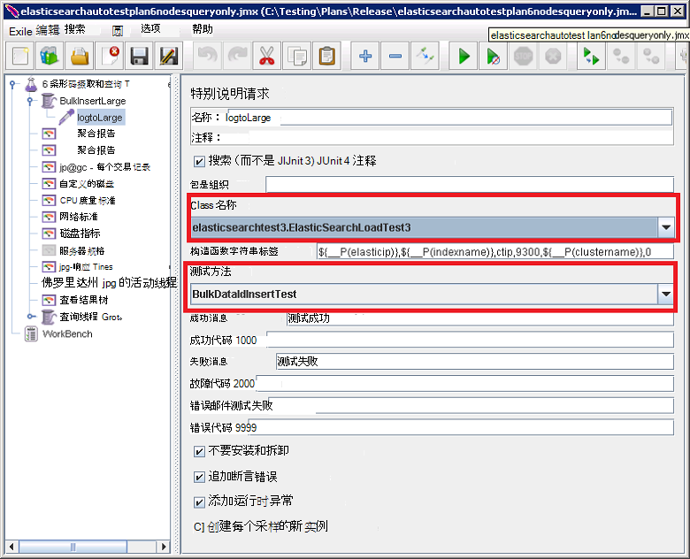

<properties
   pageTitle="运行自动化的 Elasticsearch 性能测试 |Microsoft Azure"
   description="描述如何在您自己的环境中运行的性能测试。"
   services=""
   documentationCenter="na"
   authors="dragon119"
   manager="bennage"
   editor=""
   tags=""/>

<tags
   ms.service="guidance"
   ms.devlang="na"
   ms.topic="article"
   ms.tgt_pltfrm="na"
   ms.workload="na"
   ms.date="09/22/2016"
   ms.author="masashin"/>
   
# <a name="running-the-automated-elasticsearch-performance-tests"></a>运行自动化的 Elasticsearch 性能测试

[AZURE.INCLUDE [pnp-header](../../includes/guidance-pnp-header-include.md)]

本文是[一系列的一部分](guidance-elasticsearch.md)。 

[在 Azure 上 Elasticsearch 的调整数据接收性能]和[调整数据聚合和 Elasticsearch 在 Azure 上的查询性能]文档描述大量的针对示例 Elasticsearch 群集而运行的性能测试。

这些测试是编写脚本以便使他们能够以自动的方式运行。 本文描述在您自己的环境中，您就可以重复测试。

## <a name="prerequisites"></a>系统必备组件

自动的测试需要以下各项︰

-  一个 Elasticsearch 的群集。

- 在文档中[创建一个 Elasticsearch 在 Azure 上的性能测试环境]所述 JMeter 环境设置。

- [Python 3.5.1](https://www.python.org/downloads/release/python-351/) JMeter 主虚拟机上安装。


## <a name="how-the-tests-work"></a>测试的工作原理
使用 JMeter 运行测试。 JMeter 的主服务器加载测试计划，并将其传递给一套实际运行的测试的 JMeter 从属服务器。 JMeter 主服务器协调 JMeter 的从属服务器，并累积的结果。

提供了以下测试计划︰

* [elasticsearchautotestplan3nodes.jmx](https://github.com/mspnp/azure-guidance/blob/master/ingestion-and-query-tests/templates/elasticsearchautotestplan3nodes.jmx)。 3 节点群集上运行接收测试。

* [elasticsearchautotestplan6nodes.jmx](https://github.com/mspnp/azure-guidance/blob/master/ingestion-and-query-tests/templates/elasticsearchautotestplan6nodes.jmx)。 对一个 6 节点的群集中运行接收测试。

* [elasticsearchautotestplan6qnodes.jmx](https://github.com/mspnp/azure-guidance/blob/master/ingestion-and-query-tests/templates/elasticsearchautotestplan6qnodes.jmx)。 对一个 6 节点的群集中运行摄取和查询测试。

* [elasticsearchautotestplan6nodesqueryonly.jmx](https://github.com/mspnp/azure-guidance/blob/master/ingestion-and-query-tests/templates/elasticsearchautotestplan6nodesqueryonly.jmx)。 对一个 6 节点的群集中运行仅查询测试。


您可以使用这些测试计划作为您自己的方案的基础，如果您需要更少或更多节点。

测试计划使用 JUnit 请求示例生成并上传的测试数据。 JMeter 测试计划创建并运行此示例，并监视每个性能数据的 Elasticsearch 节点。  

## <a name="building-and-deploying-the-junit-jar-and-dependencies"></a>构建和部署的 JUnit JAR 和依赖项
在运行之前您应该下载的性能测试，编译和部署的性能/junitcode 文件夹下的 JUnit 测试。 JMeter 测试计划引用这些测试。 有关详细信息，请参阅[部署测试 Elasticsearch 性能 JMeter JUnit 取样器]文档中的"导入 Eclipse 现有的 JUnit 测试项目"的过程。

有两个版本的 JUnit 测试︰ 

- [Elasticsearch1.73](https://github.com/mspnp/azure-guidance/tree/master/ingestion-and-query-tests/junitcode/elasticsearch1.73)。 执行接收测试中使用此代码。 这些测试使用 Elasticsearch 1.73。

- [Elasticsearch2](https://github.com/mspnp/azure-guidance/tree/master/ingestion-and-query-tests/junitcode/elasticsearch2)。 使用此代码执行的查询测试。 这些测试使用 Elasticsearch 2.1 或更高版本。

将其余的相关性以及相应的 Java 归档文件 (JAR) 文件复制到您 JMeter 的机。 [部署用于测试 Elasticsearch 性能 JMeter JUnit 取样器][]中介绍了此过程。 

> **重要**后部署的 JUnit 测试，使用 JMeter 来加载和配置引用此 JUnit 测试并确保正确的 JAR 文件，JUnit 的类名，引用了 BulkInsertLarge 线程组的测试计划和测试方法︰
> 
> 
> 
> 在运行测试之前保存更新后的测试计划。

## <a name="creating-the-test-indexes"></a>创建测试索引
每个测试执行接收和/或对单个索引的查询指定何时运行该测试。 您应该使用[Elasticsearch 在 Azure 上的调整数据接收性能]和[调整数据聚合和 Elasticsearch 在 Azure 上的查询性能]的文档的附录中所述的架构创建索引并将其配置根据您的测试方案 （doc 值启用/禁用，多个副本，等等）注意测试计划假定索引中包含一个名为*ctip*的一个类型。

## <a name="configuring-the-test-script-parameters"></a>配置测试脚本参数
将下面的测试脚本参数文件复制到 JMeter 服务器计算机︰

* [run.properties](https://github.com/mspnp/azure-guidance/blob/master/ingestion-and-query-tests/run.properties)。 此文件指定 JMeter 测试要使用的线程，持续时间 （以秒为单位），测试的节点 （或在 Elasticsearch 群集中，负载平衡器） 的 IP 地址和群集的名称︰

  ```ini
  nthreads=3
  duration=300
  elasticip=<IP Address or DNS Name Here>
  clustername=<Cluster Name Here>
  ```
  
  编辑此文件，并指定您的测试和群集的相应值。

* [查询-配置-win.ini](https://github.com/mspnp/azure-guidance/blob/master/ingestion-and-query-tests/query-config-win.ini) ，[查询-配置-nix.ini](https://github.com/mspnp/azure-guidance/blob/master/ingestion-and-query-tests/query-config-nix.ini)。 这两个文件包含相同的信息;*赢取*文件格式为 Windows 文件名和路径，然后*nix*文件格式化为 Linux 文件名和路径︰

  ```ini
  [DEFAULT]
  debug=true #if true shows console logs.

  [RUN]
  pathreports=C:\Users\administrator1\jmeter\test-results\ #path where tests results are saved.
  jmx=C:\Users\administrator1\testplan.jmx #path to the JMeter test plan.
  machines=10.0.0.1,10.0.0.2,10.0.0.3 #IPs of the Elasticsearch data nodes separated by commas.
  reports=aggr,err,tps,waitio,cpu,network,disk,response,view #Name of the reports separated by commas.
  tests=idx1,idx2 #Elasticsearch index(es) name(s) to test, comma delimited if more than one.
  properties=run.properties #Name of the properties file.
  ```

  编辑该文件以指定测试结果的位置的 JMeter 测试计划以运行，您收集的性能指标，包含原始性能数据将生成报告的 Elasticsearch 数据节点的 IP 地址和名称 （或姓名以逗号分隔） 的索引进行测试，如果多个名称一个接一个将运行的测试。 如果 run.properties 文件位于不同的文件夹或目录，指定该文件的完整路径。

## <a name="running-the-tests"></a>运行测试

* 将[查询 test.py](https://github.com/mspnp/azure-guidance/blob/master/ingestion-and-query-tests/query-test.py)文件复制到 run.properties 和查询-配置-win.ini (查询配置 nix.ini) 文件所在的文件夹中的 JMeter 服务器计算机。

* 确保在您的环境的可执行路径都是 jmeter.bat (Windows) 或 jmeter.sh (Linux)。

* 从命令行执行测试运行的查询 test.py 脚本︰

  ```cmd
  py query-test.py
  ```

* 完成测试后，结果存储为一套以逗号分隔值 (CSV) 文件的查询配置 win.ini (查询配置 nix.ini) 文件中指定。 您可以使用 Excel 分析和图形表示这些数据。


[在 Azure 上 Elasticsearch 的数据接收性能调优]: guidance-elasticsearch-tuning-data-ingestion-performance.md
[数据聚合和 Elasticsearch 在 Azure 上的查询性能优化]: guidance-elasticsearch-tuning-data-aggregation-and-query-performance.md
[创建测试环境在 Azure 上 Elasticsearch 的性能]: guidance-elasticsearch-creating-performance-testing-environment.md
[为测试 Elasticsearch 性能部署 JMeter JUnit 取样器]: guidance-elasticsearch-deploying-jmeter-junit-sampler.md
