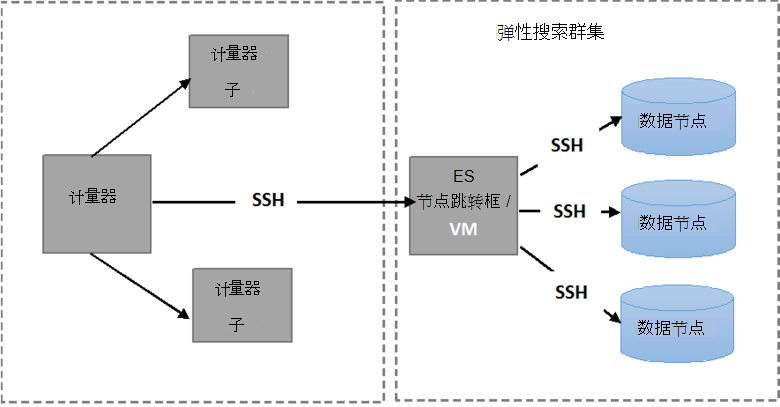

<properties
   pageTitle="运行自动的 Elasticsearch 弹性测试 |Microsoft Azure"
   description="描述如何在您自己的环境中运行的恢复性测试。"
   services=""
   documentationCenter="na"
   authors="dragon119"
   manager="bennage"
   editor=""
   tags=""/>

<tags
   ms.service="guidance"
   ms.devlang="na"
   ms.topic="article"
   ms.tgt_pltfrm="na"
   ms.workload="na"
   ms.date="09/22/2016"
   ms.author="masashin"/>

# <a name="running-the-automated-elasticsearch-resiliency-tests"></a>运行自动的 Elasticsearch 弹性测试

[AZURE.INCLUDE [pnp-header](../../includes/guidance-pnp-header-include.md)]

本文是[一系列的一部分](guidance-elasticsearch.md)。

在[配置的复原和恢复上在 Azure 上 Elasticsearch][elasticsearch-resilience-recovery]，我们介绍一系列的测试对示例 Elasticsearch 群集来确定系统如何更好地响应失败的一些常见形式和如何更好地将恢复执行。 测试已编写的脚本以使他们能够以自动的方式运行。 本文描述在您自己的环境中，您就可以重复测试。 

以下方案进行了测试︰

- **节点出现故障并且不丢失数据的重新启动**。 数据节点停止并重新启动后 5 分钟。
Elasticsearch 已配置为不重新分配缺少 shards 在此时间间隔，因此 shards 移动而导致没有额外的 I/O。 节点重新启动后，恢复过程将 shards 带回最新的节点上。

- **灾难性的数据丢失的节点故障**。 停止数据节点和它包含的数据被删除，以模拟灾难性磁盘故障。 该节点然后后重新启动 （5 分钟），有效地作为代替原来的节点。 恢复过程需要重建丢失的数据节点，并且可能涉及 shards 持有其他节点上重新定位。

- **节点出现故障，重新启动没有数据丢失，但 shard 重新分配**。 数据节点已停止，它持有的 shards 被重新分配给其他节点。 然后重新启动该节点并将更多的再分配来重新平衡群集。

- **滚动更新**。 停止群集中的每个节点并在较短的间隔，以模拟在软件更新后重新启动计算机后重新启动。 在任何时刻，只有一个节点已停止。
当一个节点出现故障时，shards 是不重新分配。

## <a name="prerequisites"></a>系统必备组件

自动的测试需要以下各项︰

- 一个 Elasticsearch 的群集。

- 通过[性能测试指南]所述 JMeter 的环境设置。 

- JMeter 主 VM 上安装了下列补充。

    - Java 运行时 7。

    - Nodejs 4.x.x 或更高版本。

    - Git 的命令行工具。

## <a name="how-the-scripts-work"></a>这些脚本是如何工作的

测试脚本用于在 JMeter 主虚拟机上运行。 选择要运行的测试时，脚本将执行以下操作序列︰

1.  启动 JMeter 测试计划传递指定的参数。

2.  将复制到指定的 VM 在群集中的测试所需的操作执行的脚本。 如果生成群集使用[Azure Elasticsearch 快速启动模板](https://github.com/Azure/azure-quickstart-templates/tree/master/elasticsearch)，它可以是具有一个公共 IP 地址，任何 VM 或*Jumpbox*虚拟机。

3.  虚拟机 （或 Jumpbox） 上运行该脚本。

下图显示了测试环境和 Elasticsearch 群集的结构。 请注意，测试脚本使用安全外壳 (SSH) 连接到执行各种 Elasticsearch 操作，例如，停止或重新启动节点群集中的每个节点。



## <a name="setting-up-the-jmeter-tests"></a>设置 JMeter 测试

运行适应性测试之前您应编译和部署 JUnit 测试复原/jmeter/测试文件夹中。 JMeter 测试计划引用这些测试。 有关详细信息，请参阅部署[JMeter JUnit 取样器用于测试 Elasticsearch 性能][]的"导入 Eclipse 现有的 JUnit 测试项目"的过程。

有两个版本的 JUnit 测试保存在以下文件夹中︰

- **Elasticsearch17。** 此文件夹中的项目生成文件 Elasticsearch17.jar。 用于此 JAR 测试 Elasticsearch 版本 1.7.x

- **Elasticsearch20**。 此文件夹中的项目生成文件 Elasticsearch20.jar。 用于此 JAR 测试版本 2.0.0 Elasticsearch 及更高版本

将其余的依存关系以及适当的 JAR 文件复制到您 JMeter 的机。 在[部署测试 Elasticsearch 性能 JMeter JUnit 取样器]中的"部署到 JMeter 的 JUnit 测试"过程描述了过程。

## <a name="configuring-vm-security-for-each-node"></a>配置虚拟机的每个节点的安全性

测试脚本需要身份验证证书安装在群集中的每个 Elasticsearch 节点上。 这样的脚本，以自动运行时不提示输入用户名或密码，因为它们连接到不同的虚拟机。

首先登录到 Elasticsearch 群集 （或 Jumpbox VM） 中的节点之一，然后运行以下命令以生成身份验证密钥︰

```Shell
ssh-keygen -t rsa
```

当连接到 Elasticsearch 节点 （或 Jumpbox），他 Elasticsearch 群集中运行以下命令为每个节点。 更换`<username>`的每个 VM，并替换上的有效用户名称`<nodename>`与 Elasticsearch 节点承载虚拟机的 IP 地址的 DNS 名称。
请注意，运行这些命令时，您将被提示输入用户的密码。
有关详细信息，请参阅[无密码的 SSH 登录](http://www.linuxproblem.org/art_9.html)︰

```Shell
ssh <username>@<nodename> mkdir -p .ssh (
cat .ssh/id\_rsa.pub | ssh <username>*@<nodename> 'cat &gt;&gt; .ssh/authorized\_keys'
```

## <a name="downloading-and-configuring-the-test-scripts"></a>下载和配置测试脚本

Git 存储库中提供了测试脚本。 请按下列步骤下载并配置脚本。

JMeter 主计算机上运行测试的位置，打开 Git 桌面窗口 (Git Bash) 和克隆存储库中包含的脚本中，按如下所述︰

```Shell
git clone https://github.com/mspnp/azure-guidance.git
```

移到恢复能力测试文件夹并运行以下命令以安装运行测试所需的依赖项︰

```Shell
npm install
```

如果 JMeter 主机正在运行在 Windows 上，下载了[Plink](http://www.chiark.greenend.org.uk/~sgtatham/putty/download.html)，即为 PuTTY Telnet 客户端命令行界面。 将可执行文件 Plink 复制到弹性测试/lib 文件夹中。

如果 JMeter 主服务器运行在 Linux 上，无需下载 Plink，但您将需要配置 JMeter 母版和 Elasticsearch 节点或 Jumpbox 使用的过程中所述的步骤之间无密码 SSH"配置虚拟机的每个节点的安全。" 

编辑中的以下配置参数`config.js`文件以满足您的测试环境和 Elasticsearch 群集。 这些参数是共有的所有测试︰

| 名称 | 说明 | 默认值 |
| ---- | ----------- | ------------- |
| `jmeterPath` | JMeter 所在的本地路径。 | `C:/apache-jmeter-2.13` |
| `resultsPath` | 该脚本将结果转储的位置的相对目录。 | `results` |
| `verbose` | 指示是否或不，脚本将输出以详细模式。 | `true` |
| `remote` | 表示 JMeter 测试是否运行在本地或远程服务器上。 | `true` |
| `cluster.clusterName` | Elasticsearch 群集的名称。 | `elasticsearch` |
| `cluster.jumpboxIp`         | Jumpbox 计算机的 IP 地址。                 |-|
| `cluster.username`          | 在部署群集的过程创建的管理员用户。 |-|
| `cluster.password`          | 管理用户的密码。                        |-|
| `cluster.loadBalancer.ip`   | Elasticsearch 的负载平衡器的 IP 地址。    |-|
| `cluster.loadBalancer.url`  | 负载平衡器的基 URL。                          |-|

## <a name="running-the-tests"></a>运行测试

移到恢复能力测试文件夹，运行以下命令︰

```Shell
node app.js
```

应出现以下菜单︰


输入要运行的方案数︰ `11`， `12`，`13`或`21`。 

选择后一种情况，该测试将自动运行。 结果为一组结果目录下创建的文件夹中的逗号分隔值 (CSV) 文件的存储。 每次运行都有各自的结果的文件夹。
您可以使用 Excel 分析和图形表示这些数据。

[Running Elasticsearch on Azure]: guidance-elasticsearch-running-on-azure.md
[Tuning Data Ingestion Performance for Elasticsearch on Azure]: guidance-elasticsearch-tuning-data-ingestion-performance.md
[性能测试指南]: guidance-elasticsearch-creating-performance-testing-environment.md
[JMeter guidance]: guidance-elasticsearch-implementing-jmeter.md
[Considerations for JMeter]: guidance-elasticsearch-deploying-jmeter-junit-sampler.md
[Query aggregation and performance]: guidance-elasticsearch-query-aggregation-performance.md
[elasticsearch-resilience-recovery]: guidance-elasticsearch-configuring-resilience-and-recovery.md
[Resilience and Recovery Testing]: guidance-elasticsearch-running-automated-resilience-tests.md
[为测试 Elasticsearch 性能部署 JMeter JUnit 取样器]: guidance-elasticsearch-deploying-jmeter-junit-sampler.md
