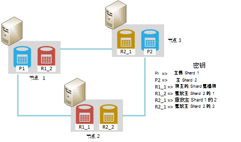
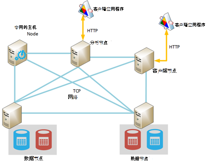
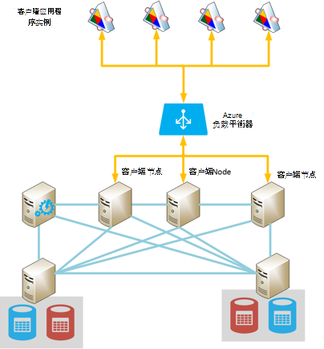
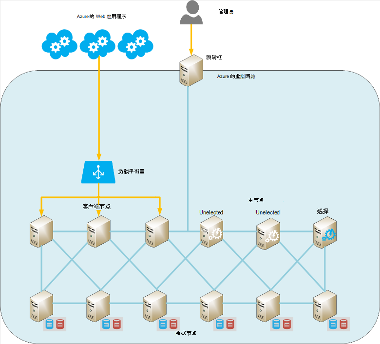
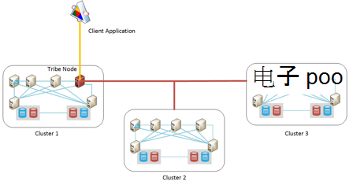

<properties
   pageTitle="在 Azure 上运行 Elasticsearch |Microsoft Azure"
   description="如何安装、 配置和 Azure 上运行 Elasticsearch。"
   services=""
   documentationCenter="na"
   authors="dragon119"
   manager="bennage"
   editor=""
   tags=""/>

<tags
   ms.service="guidance"
   ms.devlang="na"
   ms.topic="article"
   ms.tgt_pltfrm="na"
   ms.workload="na"
   ms.date="09/22/2016"
   ms.author="masashin"/>

# <a name="running-elasticsearch-on-azure"></a>在 Azure 上运行 Elasticsearch

[AZURE.INCLUDE [pnp-header](../../includes/guidance-pnp-header-include.md)]

本文是[一系列的一部分](guidance-elasticsearch.md)。 

## <a name="overview"></a>概述

本文简要介绍了 Elasticsearch 的一般结构，然后介绍了如何实现使用 Azure Elasticsearch 群集。 它涉及部署重点介绍各种功能的性能和管理要求的系统，并考虑如何您的要求应驱动的配置和拓扑选择 Elasticsearch 群集的最佳做法。

> [AZURE.NOTE] 本指南假定您[Elasticsearch][]一些基本熟悉。

## <a name="the-structure-of-elasticsearch"></a>Elasticsearch 的结构 

Elasticsearch 是一个高度优化，使其作为搜索引擎的文档数据库。 以 JSON 格式序列化的文档。 数据保存在实现使用[Apache Lucene][]，尽管细节抽象的视图并不需要完全理解要使用 Elasticsearch 的 Lucene 的索引中。

### <a name="clusters-nodes-indexes-and-shards"></a>群集、 节点、 索引和 shards

Elasticsearch 实现使用分片数据分散在多个节点和复制，以提供高可用性的群集体系结构。 文档存储在索引中。 用户可以指定文档中的哪些字段用于唯一地标识它在索引，或系统可以自动生成的字段和值。 索引用于物理组织文档和主体意味着查找文档。 

索引包含一套 shards。 文档均匀地分散在各个使用基于索引键值和 shards 在索引中的散列机制 shards。 

可以复制索引。 在这种情况下，索引中的每个 shard 被复制。 Elasticsearch 可确保每个原始 shard 的索引 （也称为"主 shard"） 和其副本始终驻留在不同的节点上。 当添加或修改文档时，所有写在主要的 shard 第一，然后在每个副本上执行操作。 

下图显示了一个包含三个节点的 Elasticsearch 群集的重要方面。 已创建的索引包含与每个 shard (在所有六个 shards) 的两个副本的两个主 shards。



*简单的 Elasticsearch 群集包含两个主要节点和两个副本集*

在此群集中，主 shard 1 和主 shard 2 位于不同的节点，以帮助它们之间平衡负载。 同样分布在复制副本。 如果一个节点发生故障，剩余节点具有足够的信息以便让系统继续正常工作。 如有必要，Elasticsearch 将提升复制副本 shard 成为主 shard，如果相应的主 shard 不可。

### <a name="node-roles"></a>节点角色

Elasticsearch 群集中的节点可以执行下列角色︰

- 可以包含一个或多个包含索引数据的 shards**数据节点**。

- 不包含索引数据，但该**客户端节点**处理传入的请求由客户端应用程序与适当的数据节点。
 
- **主节点**，不包含索引数据，但执行群集管理操作，例如维护和分发群集周围的路由信息 （列表节点包含的 shards），确定哪些节点可用的如节点出现和消失，重新定位 shards 和协调节点出现故障后恢复。 可以将多个节点配置为母版，但只有一个实际上将选择要执行的主函数。 如果此节点出现故障，另一个选举发生和其他符合条件的主节点之一将选择并接管。

> [AZURE.NOTE]选举主节点是群集中的良好的关键。 其他节点 ping 它定期以确保它仍然可用。 如果选举主节点还充当数据节点，没有响应这些 ping 该节点可以变为繁忙的机会和失效。 在此情况下，主就会被视为失败和其他主节点之一选择在原地。 

 下图显示了包含多种专用的主机、 客户端和数据 Elasticsearch 群集中的节点的拓扑结构。



*显示不同类型的节点 Elasticsearch 群集*

### <a name="costs-and-benefits-of-using-client-nodes"></a>成本和收益的使用客户端节点

当应用程序提交到 Elasticsearch 群集的查询时，该应用程序连接到的节点负责指导查询过程。 该节点将请求转发到每个数据节点，并收集结果，积累的信息返回给应用程序。 如果查询涉及到聚合和其他计算，应用程序连接到的节点将从每个其他节点检索数据后执行必要的操作。 此分散/集中过程可能占用相当多的处理和内存资源。

使用专用客户端节点来执行这些任务，将精力集中在管理和存储数据的数据节点。 其结果是许多方案都涉及到复杂的查询和聚合可以受益于使用专用客户端节点。 但是，使用专用客户端节点的影响可能取决于您的方案、 工作量和簇的大小会有所不同。 

> [AZURE.NOTE] 调整过程的详细信息，请参阅[优化数据聚合和 Elasticsearch 在 Azure 上的查询性能][]。

### <a name="connecting-to-a-cluster"></a>连接到群集

Elasticsearch 用于构建客户端应用程序并将请求发送到群集公开 REST Api 系列。 两个更高级别的 Api 开发使用.NET Framework 应用程序时，如果是可用 — [Elasticsearch.Net 和嵌套][]。

如果您要构建客户端应用程序使用 Java，您可以使用[节点客户端 API][]以动态方式创建客户端节点并将其添加到群集。 动态创建客户端节点是如果您的系统使用较少的长期存在的连接非常方便。 使用节点 API 创建的客户端节点还提供与群集路由 （其中节点包含的 shards 的详细信息） 通过映射的主节点。 此信息可以直接连接到相应的节点索引或查询数据，减少了跃点数时，可能有必要使用其他 Api 时 Java 应用程序。

这种方法的成本是注册到群集的客户端节点的系统开销。 如果大量客户端节点的出现和迅速消失，维护和分发路由群集映射的影响可能会变得明显。

下图显示了使用负载平衡器将请求路由到一组客户端节点，虽然相同的策略可以用于直接连接到数据节点如果不使用客户端节点的配置。



*连接到 Elasticsearch 通过 Azure 负载平衡器的群集客户机应用程序实例*

> [AZURE.NOTE]您可以使用[Azure 负载平衡器][]来公开将群集连接到公用的 Internet，或者如果客户端应用程序和群集包含全部在同一个专用虚拟网络 (VNet)，您可以使用[内部负载平衡器][]。

### <a name="node-discovery"></a>节点发现

Elasticsearch 基于对等通信，因此发现群集中的其他节点是一个节点在生命周期的重要部分。 节点发现使新数据节点动态添加到群集中，这反过来使群集能够透明地向外扩展。 此外，如果数据节点没有响应来自其他节点的通信请求，数据节点出现故障和采取必要的措施来重新分配它被存放到其他运营数据节点 shards 可以决定一个主节点。

Elasticsearch 节点发现通过发现模块处理。 搜索模块是插件，可以切换使用一种不同的发现机制。 默认搜索模块 ([Zen][]) 导致要发出 ping 请求，以查找在同一网络上的其他节点的节点。 如果其他节点响应，他们做饭来交换信息。 主节点可以分发到新节点的 shards （如果它是一个数据节点），然后重新平衡群集。 Zen 发现模块还可以处理主选举过程和检测节点故障的协议。

此外，如果您运行 Elasticsearch 节点作为 Azure 的虚拟机 (Vm)，多播消息则不支持。 出于此原因，您应该配置 Zen 发现使用单址广播消息，并提供 elasticsearch.yml 配置文件中的有效联系人节点的列表。

如果承载 Azure 的虚拟网络中 Elasticsearch 群集时，可以指定专用 DHCP 分配的 IP 地址提供给每个群集中的虚拟机应保持分配 （静态）。 您可以配置 Zen 发现单播消息使用这些静态 IP 地址。 如果使用的虚拟机的动态 IP 地址，请注意，如果虚拟机停止并重新启动它无法分配新的 IP 地址，使得更难发现。 若要处理这种情况下，可以 Zen 发现模块交换[Azure 云插件][]。 此插件使用 Azure API 来实现基于 Azure 订阅信息的发现机制。

> [AZURE.NOTE]Azure 云插件的当前版本要求您将证书安装到管理 Azure 订阅中的 Elasticsearch 节点上，Java 密钥库并提供访问密钥存储在 elasticsearch.yml 文件中的位置和凭据。 此文件是以明文的形式，保留，因此极为重要，您确保此文件，才可以访问通过运行 Elasticsearch 服务的帐户。 
> 
> 另外，这种方法可能不会符合 Azure 资源管理器的部署。 出于这些原因，建议您对于主节点，使用静态 IP 地址，并使用这些节点来实现 Zen 发现单址广播群集内的消息。 在以下配置中 （摘自示例数据节点的 elasticsearch.yml 文件），主机 IP 地址引用主机与群集中的节点︰

```yaml
discovery.zen.ping.multicast.enabled: false  
discovery.zen.ping.unicast.hosts: ["10.0.0.10","10.0.0.11","10.0.0.12"]
```

## <a name="general-system-guidelines"></a>常规系统指导原则

Elasticsearch 可以在各种范围从一台笔记本电脑到高端服务器群集的计算机上运行。 但是，根据计算电源，又快速磁盘的内存更多的资源并提供更好的性能。 以下部分总结了运行 Elasticsearch 的基本硬件和软件要求。

### <a name="memory-requirements"></a>内存需求 

Elasticsearch 试图存储内存中数据的速度。 生产服务器承载的典型的企业或在 Azure 上的中等大小商业部署的节点应有 14 GB 和 28 GB 的内存 （D3 或 D4 Vm） 之间。 **分布在多个节点，而不具有更多的内存创建节点之间的负载**（实验具有展示具有更大内存使用较大的节点可能会导致恢复时间延长出现故障时）。但是，用大量的小节点创建群集可以提高可用性和吞吐量，尽管它还上报管理和维护此类系统中所涉及的工作量。

**分配到 Elasticsearch 堆的服务器上的可用内存的 50%**。 如果您正在运行 Elasticsearch 之前使用 Linux 集 ES_HEAP_SIZE 环境变量。 或者，如果您使用的 Windows 或 Linux，您可以指定内存大小，以`Xmx`，`Xms`在启动 Elasticseach 时的参数。 同时这些参数设置为相同的值，以避免 Java 虚拟机 (JVM) 调整在运行时堆的大小。 但是，**不分配大于 30 GB**。 剩余的内存用于操作系统文件缓存。

> [AZURE.NOTE]Elasticsearch 利用 Lucene 库来创建和管理索引。 Lucene 结构使用的基于磁盘的格式，并缓存这些文件系统缓存中的结构极大地提高性能。

请注意，Java 在 64 位计算机上的最大最佳堆大小 30 GB 的正上方。 超过该 Java 切换到使用扩展的机制来引用堆上的对象的大小，这会增加内存需求为每个对象，并降低性能。 

如果堆大小大于 30 GB （并发标记和扫描） 缺省 Java 垃圾回收器可以子以最佳方式执行。 当前建议不要切换到不同的垃圾回收器，如 Elasticsearch 和 Lucene 只能经过对默认值。

不要过量内存，如交换主内存到磁盘将会严重影响性能。 如果可能，请禁用完全换 （详细信息取决于操作系统）。 如果无法做到这一点启用中的 Elasticsearch 配置文件 (elasticsearch.yml) 的*mlockall*设置，如下所示︰

```yaml
bootstrap.mlockall: true
```

此配置设置会导致 JVM 的内存锁定，并阻止它被交换出操作系统。

### <a name="disk-and-file-system-requirements"></a>磁盘和文件系统要求

使用高级存储，用于存储 shards 作为后盾的数据磁盘。 磁盘的大小应调整虽然也可以在以后添加更多磁盘存放在您 shards，预期的数据的最大。 您可以在节点上的多个磁盘扩展 shard。

> [AZURE.NOTE]Elasticsearch 使用 LZ4 算法，压缩存储字段的数据，并在此后 Elasticsearch 2.0，您可以更改压缩类型。 您可以切换到 DEFLATE 如*zip*和*gzip*实用程序所使用的压缩算法。 此压缩技术可以为更多的资源消耗，但您应该考虑将其用于存档的日志数据。 这种方法可以帮助减小索引的大小。

并非必须在群集中的所有节点都有相同的磁盘布局和容量。 但是，具有非常大的磁盘容量与群集中其他节点的节点将吸引更多的数据，并将需要增加的处理能力来处理这些数据。 因此该节点可能会变得"热"与其他节点，并且这可能，反过来会影响性能。

如果可能，请使用 RAID 0 （带状划分）。 其他形式实现奇偶校验和镜像是 RAID 的不必要的因为 Elasticsearch 提供副本的形式它自己高可用的解决方案。

> [AZURE.NOTE]前 Elasticsearch 2.0.0，还可以通过在*path.data*配置设置中指定多个目录执行软件级别的条带化。 在 Elasticsearch 2.0.0，不再支持这种形式的条带化。 相反，不同的 shards 可能会分配到不同的路径，但所有单个 shard 中的文件将被写入相同的路径。 如果您要求的条带化，应该在操作系统或硬件级别的数据分条。 

以最大化存储吞吐量，每个**VM 都应有专用的高级存储帐户**。

Lucene 库可以使用大量的文件存储索引数据，Elasticsearch 可以打开大量的通信节点之间以及与客户端的套接字。 请确保操作系统被配置为支持足够数量的打开的文件描述符 （最多 64000 如果足够的内存可用)。 请注意，许多 Linux 发行版本的默认配置限制到 1024，打开的文件描述符数量即得太小。

Elasticsearch 使用内存映射 (mmap) I/O 和 Java 新 I/O (NIO) 的组合优化并发访问数据文件和索引。 如果使用 Linux，应配置操作系统以确保有足够的虚拟内存 256k 的内存映射区域的空间可用。

> [AZURE.NOTE]许多 Linux 的分配默认为使用完全公平排队 (CFQ) 调度程序安排时将数据写入到磁盘。 此计划程序不适于 SSDs。 请考虑重新配置操作系统使用 NOOP 计划程序或截止时间计划，两者均为 SSDs 更有效。

### <a name="cpu-requirements"></a>CPU 的要求

Azure 的虚拟机都提供了不同的 CPU 配置支持 1 到 32 内核之间。 对于数据节点，很好的起点是标准的 DS 系列虚拟机，并选择任一 DS3 （4 个核心） 或 D4 （8 核） Sku。 DS3 还提供 14 GB 的 RAM，而 DS4 包括 28 GB。 

GS 系列 （对于高级存储） 和 G 系列 （用于标准存储） 都使用强 E5 V3 处理器可用于工作负载频繁计算密集的如大规模的聚合。 有关最新信息，请访问[虚拟机大小][]。

### <a name="network-requirements"></a>网络要求

Elasticsearch 需要 1 到 10Gbps，根据大小和它实现的群集的波动性之间的网络带宽。 Elasticsearch 迁移 shards 节点之间，随着更多的节点添加到群集。 Elasticsearch 假定的所有节点之间的通讯时间大致相当，而不考虑 shards 持有这些节点上的相对位置。 此外，复制可以招 shards 之间的巨大的网络 I/O。 出于这些原因，**避免创建在不同区域中的节点上的群集**。

### <a name="software-requirements"></a>软件要求

您可以在 Windows 或 Linux 上运行 Elasticsearch。 Elasticsearch 服务是作为 Java jar 库而部署有 Elasticsearch 软件包中包括其他 Java 库的依赖项。 您必须安装 Java 7 （更新 55 或更高版本） 或 Java 8 （更新 20 或更高版本） JVM 运行 Elasticsearch。

> [AZURE.NOTE]而不是*Xmx*和*Xms*内存参数 （指定为命令行选项 Elasticsearch 引擎--请参见[内存需求][]） 不要修改默认 JVM 配置设置。 Elasticsearch 设计为使用默认值;这些更改可能会导致 Elasticsearch 将成为 detuned，并很好地运行。

### <a name="deploying-elasticsearch-on-azure"></a>部署在 Azure 上 Elasticsearch

虽然不是很难部署 Elasticsearch 的一个实例，创建大量的节点和安装和配置每个 Elasticsearch 可以是耗时且容易出错的过程。 如果您正在考虑在 Azure 的虚拟机上运行 Elasticsearch，有三个选项可帮助减少错误的机会。

- 在 Azure 的市场使用 Azure 资源管理器[模板](https://azure.microsoft.com/marketplace/partners/elastic/elasticsearchelasticsearch/)。 此模板将创建弹性。 它允许您添加专业的增强功能，例如盾牌、 Marvel，观察程序，等等。

- 使用 Azure 快速启动[模板](https://github.com/Azure/azure-quickstart-templates/tree/master/elasticsearch)构建群集。 此模板可以创建基于 Windows Server 2012 或 Ubuntu Linux 14.0.4 群集。 它允许您使用 Azure 文件存储等的实验性功能。 此模板用于研究和测试本文中的任务。

- 使用可自动或运行无人参与的脚本。 脚本可以创建和部署 Elasticsearch 群集位于[GitHub 存储库][elasticsearch-scripts]

## <a name="cluster-and-node-sizing-and-scalability"></a>群集和节点规模和可伸缩性 

Elasticsearch 使大量部署拓扑结构，设计可支持不同要求以及缩放级别。 此部分讨论常见的拓扑结构，并介绍了实现基于这些拓扑的群集注意事项。

### <a name="elasticsearch-topologies"></a>Elasticsearch 拓扑

下图说明了 azure 设计的 Elasticsearch 拓扑结构的起始点︰



*建议构建的 Elasticsearch 群集，Azure 的起点*

这种拓扑包含六个数据节点以及三个客户端节点和三个主节点 （只有一个选择是主节点，其他两个有选举应选举的主失败。）作为一个单独的虚拟机实现的每个节点。 Azure 的 web 应用程序被定向到客户端通过负载平衡器的节点。 

在此示例中，所有节点和 web 应用程序驻留在相同的虚拟网络，有效地将它们隔离外界。 如果群集需要提供外部 （可能是作为纳入内部客户端的混合解决方案的一部分），然后使用 Azure 负载平衡器提供一个公用 IP 地址，但是您需要采取额外的安全预防措施，以防未经授权的访问群集。 

可选"跳转框中"是一个仅对管理员可用的虚拟机。 此 VM 都有网络连接到虚拟的网络中，而且还面临来自外部网络 （应该先保护此登录使用强密码或证书） 允许管理员登录的网络连接向外。 管理员可以登录到跳转框中，然后从那里直接连接到任何在群集中的节点。 

替代方法包括使用站点到站点 VPN 之间组织和虚拟的网络，或使用[ExpressRoute][]电路连接到虚拟网络。 这些机制允许而无需公开将群集连接到公用的 internet 访问群集的管理权限。

为保持虚拟机的可用性，数据节点分组到 Azure 可用性组相同。 同样，可用性的另一组中保留客户端节点和主节点都存储在第三的可用性组。

此拓扑可以相对容易地扩张，只是添加更多节点的适当类型和确保它们获配 elasticsearch.yml 文件中的群集名称相同。 客户端节点还需要被添加到 Azure 负载平衡器的后端库。

**地理定位群集**

**不要传播跨地区群集中的节点，因为这会影响节点间通信的性能**（请参阅[网络要求][]）。 地理定位数据接近在不同地区的用户需要创建多个群集。 在这种情况下，您需要考虑如何 （或甚至是否） 同步群集。 可能的解决方案包括︰

[群体意识节点][]是与客户端节点类似，不同之处在于，它可以参与 Elasticsearch 的多个群集，并认为这些问题都是一个大群集。 数据仍本地管理的每个群集中 （不在群集之间传播更新），但是所有的数据都是可见。 群体意识节点可以查询、 创建和管理所有群集中的文档。 

主要的限制是群体意识节点不能用于创建新的索引，索引名必须是唯一的所有群集。 因此值得您考虑设计用于从群体意识节点访问群集时如何命名索引。

使用此机制，每个群集可以包含的数据，最有可能访问本地的客户端应用程序，但这些客户端仍然可以访问和修改远程数据虽然与可能的扩展滞后时间。 下图显示此拓扑的示例。 群体意识节点群集 1 中的突出显示;尽管图中没有显示这些其他群集还可以群体意识节点︰



*群体意识节点通过访问多个群集的客户端应用程序*

在此示例中，客户端应用程序连接到群集 1 （共同位于同一区域中），在群体意识节点，但此节点配置为能够访问 2 群集和群集 3，可能位于不同的地区。 客户端应用程序可以发送请求来检索或修改任何群集中的数据。

> [AZURE.NOTE]群体意识节点需要多播的发现连接到群集，可能存在安全隐患。 请参阅详细信息部分[节点发现][]。

- 在实施群集之间的地区复制。 在这种方法，在每个群集所做的更改就会传播近实时到群集中其他数据中心。 为支持此功能，如[PubNub 更改插件][]的 Elasticsearch 提供了第三方插件。

- 使用[Elasticsearch 快照和恢复模块][]。 如果数据是非常的缓慢移动，并且只能由一个群集修改，您可以考虑使用快照要采取定期数据的副本，然后恢复这些快照 （如果您已经安装了[Azure 云插件][]，可以随时在 Azure Blob 存储中存储快照） 其他群集中。 不过，此解决方案不适适用于快速变化的数据或如果数据可以将多个群集。

**小规模的拓扑结构**

大型拓扑结构组成的专用主机、 客户端和数据节点群集可能不适合每一种方案。 如果您要构建一个小规模生产或开发系统，考虑下图中所示的 3 节点群集。

客户端应用程序直接连接到群集中的任何可用的数据节点。 群集包含三个标记为 P1-P3 （以允许增长） 的 shards 以及复制副本标记为 R1 R3。 通过使用三个节点，Elasticsearch 要分发的 shards 和副本，以便如果任何单个节点出现故障时无数据将会丢失。


*3 节点群集与 3 shards 和复制副本*

如果您正在开发安装在独立计算机上您可以充当主服务器、 客户机和数据存储在单个节点配置群集。 或者，您可以开始启动 Elasticsearch 的多个实例运行在同一计算机上作为群集的多个节点。 下图显示了一个示例。


*在同一台计算机上运行多个 Elasticsearch 节点开发配置*

请注意这些独立配置既不建议生产环境因为它们会导致争用，除非您的开发计算机具有大量内存和快速的多个磁盘。 此外，它们不提供任何高可用性保证。 如果机器发生故障，所有节点都都将丢失。

### <a name="scaling-a-cluster-and-data-nodes"></a>扩展群集和数据节点

Elasticsearch 可以扩展中的两个维度︰ 垂直 （使用更大、 功能更强大的机器） 和水平 （将负载分散到计算机）。

**垂直缩放 Elasticsearch 数据节点**

如果您通过使用 Azure 虚拟机承载 Elasticsearch 群集，每个节点可以对应一个虚拟机。 为节点垂直可伸缩性的限制很大程度上受 VM 的 SKU 和总体限制应用于单个存储帐户和 Azure 的订阅。 

[Azure 订阅和服务限制、 配额和限制](../azure-subscription-service-limits.md)的页面描述了这些限制的详细信息，但以下列表中的项作为构建 Elasticsearch 群集而言，是最相关。 

- 每个存储帐户被限制为 20000 的 IOPS。 在群集中的每个虚拟机应该利用专用 （最好是特优） 存储帐户。

- 在虚拟网络中数据节点数。 如果您不使用 Azure 资源管理器，是有限制的 2048年每个虚拟网络的虚拟机实例。 这应证明不足，很多情况下，如果您有非常大的数千个节点配置时这可能是一个限制。

- 每个订阅每个区域存储帐户的数目。 每个区域中，您可以创建最多 100 个存储帐户，每个 Azure 的订阅。 存储帐户用来保存虚拟磁盘，并且每个存储帐户的限制为 500 TB 的空间。

- 每个订阅的内核数。 默认限制的 20 个核心 / 订阅，但这可以增加高达 10000 核心请求增加的支持票通过了限制。 

- 每个 VM 大小的内存量。 较小尺寸的虚拟机具有有限的可用的内存量 （D1 机有 3.5 GB 和 D2 机有 7 GB）。 这些机器不可能适用于需要缓存大量数据以实现良好的性能 （聚合数据，或例如在数据接收、 分析大量的文档） 的 Elasticsearch 方案。

- 每个 VM 大小的磁盘最大数量。 这种限制可以限制的大小和群集的性能。 更少的磁盘意味着可以占用更少的数据，并可以通过更少的磁盘条带化的可降低性能。

- 更新域的数目/故障可用性设置每个域信息。 如果您创建使用 Azure 资源管理器的虚拟机，每个可用性组分配的可达 3 故障域和 20 更新域。 这种限制会影响是受到频繁滚动更新大型群集的适应性。

此外，您可能不应考虑 Vm 使用 64 GB 以上的内存。 如[内存需求][]一节中所述，应不到 JVM 分配 30 GB 以上的 RAM 上每个虚拟机，并允许操作系统可以利用剩余的 I/O 缓冲内存。

牢记这些限制，您应该始终跨虚拟磁盘群集中的虚拟机的存储帐户，以减少 I/O 带宽限制的可能性。 在非常大的群集中，您可能需要重新设计逻辑基础结构，并将其拆分到不同的功能分区。 例如，您可能需要拆分为不同的订阅，该群集尽管此过程可能会由于需要将虚拟网络连接更多复杂因素导致。

**水平缩放 Elasticsearch 群集**

内部中 Elasticsearch，水平可伸缩性的限制是由 shards 定义的每个索引的数目决定。 最初，许多 shards 可以分配给同一个节点在群集中，但随着数据量的增长更多可以添加节点和 shards 可以分布在这些节点。 从理论上讲，只有当节点数达到 shards 数目时，才将系统停止横向扩展。

与垂直缩放比例，有实现水平扩展，包括沉思时，应考虑的一些问题︰

- 您可以在 Azure 的虚拟网络连接的 Vm 最大数量。 这可以限制水平大型群集的可伸缩性。 您可以创建一个涉及多个虚拟网络，若要避开此限制，但这种方法会导致与其对等端性能降低由于缺乏区域的每个节点的节点的群集。

- 每个 VM 大小的磁盘数。 不同的系列和 Sku 支持连接的磁盘数也不同。
此外，您也可以考虑使用 VM 所附带的暂时存储提供一个有限的速度更快的数据存储，尽管有弹性和恢复应当考虑的影响 (请参阅[配置复原和恢复在 Azure 上 Elasticsearch] [elasticsearch-resilience-recovery]的详细信息)。 D 系列 DS 系列、 Dv2 系列和 GS 系列虚拟机使用 SSDs 用于临时存储。

您可以考虑使用[虚拟机规模集][vmss]来启动和停止虚拟机按要求规定。 但是，这种方法可能不适合 Elasticsearch 群集，原因如下︰

- 这种方法是最适合于无状态的虚拟机。 每次添加或删除 Elasticsearch 群集，一个节点 shards 被重新分配，以平衡负载，并且此过程可以生成相当大容量的磁盘 I/O 和网络通信，并会严重影响数据接收率。 您必须评估这种开销是否值得额外的处理和可用来动态地启动多个虚拟机的内存资源的好处。

- VM 启动时不会发生，在瞬间完成，这可能需要几分钟才会更多虚拟机可用或将关闭。 以这种方式比例只应处理需求的持续的变化。

- 外扩后, 是否真正需要考虑重新缩放？ 从 Elasticsearch 群集中删除虚拟机可以要求 Elasticsearch shards 和位于该虚拟机的副本中恢复，并在一个或多个其他节点上重新创建这些资源密集型过程。 一次删除多个 Vm 可能危及群集，使得难以恢复的完整性。 此外，许多 Elasticsearch 实现增长随着时间的推移，但数据的性质是这样，它往往不收缩卷中。 可以手动删除文档和文档还可以配置的 TTL （生存时间） 之后他们过期以及被删除，但在大多数情况下很可能会将新的或修改的文档由快速重用以前分配的空间。 删除或更改文档时，索引中的碎片可能会发生，在这种情况下，您可以使用 Elasticsearch HTTP[优化][]API (Elasticsearch 2.0.0 以及更早版本) 或[强制合并][]API (Elasticsearch 2.1.0 及更高版本) 进行碎片整理。

### <a name="determining-the-number-of-shards-for-an-index"></a>确定 shards 的索引的数目

随着时间的推移，群集中的节点的数目可能会有所不同，但是创建索引后，索引中的 shards 数固定。 要添加或删除 shards，需要重建索引的数据 – 用所需数目的 shards 创建一个新索引，然后将数据从旧的索引复制到新的 （您可以使用别名来隔离用户数据已被重新索引的事实--有关详细信息，请参阅[调整数据聚合和 Elasticsearch 在 Azure 上的查询性能][]） 的过程。
因此，务必要确定您很可能需要在群集中创建的第一个索引之前的 shards 号。 您可以执行以下步骤来建立此号码︰

- 创建一个单节点群集使用相同的硬件配置，您打算部署在生产环境中。

- 创建一个与您计划用于生产的结构匹配的索引。 为此索引，一个 shard 和没有副本。

- 向索引中添加特定的实际生产数据的数量。

- 执行典型的查询、 聚合和索引的其他工作负载，并测量的吞吐量和响应时间。

- 如果吞吐量和响应时间可接受的限度内，然后重复步骤 3 （添加更多数据） 的过程。

- 当您似乎已达到容量的 shard （响应时间和吞吐量开始变得不可接受） 时，记下的文档数量。

- 等一个 shard 的容量扩展到预期生产来计算所需的数目的 shards （应包括一定误差幅度在这些计算中由于推断不是精确的科学） 中的文档数。

> [AZURE.NOTE]请记住每个 shard 都作为一个 Lucene 索引，它所消耗的内存、 CPU 电源和文件句柄。 有的更多的 shards，您将需要这些资源的越多。

此外，创建更多的 shards 可能会增加 （具体取决于您的工作负载和方案） 的可扩展性，可以提高数据接收吞吐量，但它可能会减少很多查询的效率。 默认情况下，查询会询问每个 shard 索引 （您可以使用[定制路由选择事件][]来修改此行为，如果您知道所需的数据位于哪个 shards） 使用。 

按照这一过程只能生成的 shards，数估计和可能不知道的预期在生产中的文档数量。 在这种情况下，您应该确定初始卷 （上图） 和预测的增长速度。 创建适当的 shards 可以处理数据期间才愿意重新编制索引数据库的增长数。 

用于事件管理等情况并记录其他策略包括︰ 使用滚动索引。
创建新索引 ingested 每一天的数据并通过别名每天切换使其指向最新的索引来访问此索引。 这种方法使您能够更轻松地使用期限出旧数据 （可以删除索引包含不再是必需的信息） 并且能易于管理的数据量。

请记住，不需要匹配的数目 shards 的节点数。 例如，如果您创建 50 shards，可以开始时，将它们分散在 10 个节点，然后添加更多节点扩展出系统作为该卷的工作增加。 避免在一小部分 （1000 shards 分布在 2 个节点，例如） 的节点上创建 shards 的超大号。 尽管从理论上讲，系统可以扩展到 1000 个节点，使用这种配置，运行时 500 shards 削弱节点性能单一节点风险。

> [AZURE.NOTE]对于系统的数据提取粗，可以考虑使用 shards 的质数。 Elasticsearch 用于文档路由到 shards 产生更甚至传播在这种情况下默认算法。

### <a name="security"></a>安全

默认情况下，Elasticsearch 实现最低程度的安全性，并且不提供身份验证和授权的任何手段。 这些方面都需要配置的基本操作系统和网络上，和使用插件和第三方实用程序。 例如，[盾牌][]，并[搜索临界][]。

> [AZURE.NOTE]防护板为插件提供的弹性用于用户身份验证、 数据加密、 基于角色的访问控制、 IP 过滤和审核。 它可能需要实施进一步的安全措施，例如磁盘加密基础操作系统配置。

在生产系统中，您应该考虑如何︰

- 对群集中防止未经授权的访问。
- 识别和验证用户的身份。
- 授权可以执行经过身份验证的用户的操作。
- 保护群集免受欺诈接入点或破坏性的操作。
- 保护数据免受未经授权的访问。
- （如果适用），满足商业数据安全的法规要求。

### <a name="securing-access-to-the-cluster"></a>保护访问群集的权限

Elasticsearch 是一种网络服务。 Elasticsearch 群集中的节点侦听传入的客户端请求使用 HTTP，并使用 TCP 通道彼此进行通信。 应采取措施来防止未经授权的客户端或服务能够通过 HTTP 和 TCP 路径发送请求。 请考虑以下各项。 

- 定义网络安全组，以限制入站和出站网络通信的虚拟网络或虚拟机到特定的端口。

- 更改默认端口用于客户端 web 访问 (9200) 和编程的网络访问 (9300)。 使用防火墙来防止恶意的 Internet 通讯的每个节点。

- 根据位置和连接的客户端，将专用子网与互联网不能直接访问群集。 如果群集必须公开子网之外，将通过堡垒服务器或代理充分加固来保护群集的所有请求进行都路由。

如果您必须提供直接访问的节点、 使用[nginx](http://nginx.org/en/)代理服务器配置和 HTTPS 身份验证。

> [AZURE.NOTE]使用如 nginx 代理服务器，您还可以限制访问功能。 例如，您可以配置 nginx，仅允许对请求\_搜索终结点，如果需要防止客户端执行其他操作。

如果您需要更全面的网络访问安全，使用盾牌或搜索临界插件。

### <a name="identifying-and-authenticating-users"></a>识别和验证用户身份

由客户端到群集的所有请求进行身份都验证。 此外，应防止未经授权的节点加入群集，因为这些可以提供后门，绕过身份验证的系统。

Elasticsearch 插件的插件，可以执行不同类型的身份验证，其中包括︰

- **HTTP 基本身份验证**。 在每个请求中包含的用户名和密码。 所有请求必须使用 SSL/TLS 或等效的保护级别进行都加密。

- **LDAP 和 Active Directory 集成**。 此方法要求客户机被指派在 LDAP 或广告组的角色。

- **本地身份验证**。 使用 Elasticsearch 群集本身中定义的标识。

- **TLS 身份验证**。 使用 TLS 身份验证群集中的所有节点的身份都验证。

- **IP 筛选**。 使用 IP 过滤功能可以防止未授权的子网中的客户端连接，并且还会阻止这些子网加入到群集中的节点。

### <a name="authorizing-client-requests"></a>授权客户端的请求

授权取决于用来提供此项服务的 Elasticsearch 插件。 例如，通常提供基本身份验证插件提供了定义级别的身份验证，而使用 LDAP 或广告插件将通常将客户端与角色相关联，并将对这些角色的访问权限的功能。 在使用任何插件时，应考虑以下几点︰

- 您需要限制客户端可以执行这些操作吗？ 例如，客户端应该能够监视群集的状态或创建和删除索引？

- 客户端是否应限于特定的索引？ 这是在 multitenant 中有用︰ 没有连字符样式指南。 每 >> 情况为，承租人将分配自己特定的一组索引，而应与其他承租人无法访问这些索引。

- 应通过客户端可以读取和写入数据的索引？ 客户端可以执行搜索，检索数据使用索引，但必须防止添加或从该索引，例如删除数据。

目前，大多数安全插件范围操作为群集或索引的级别，而不是索引中的文档的子集。 这是为提高效率。 它因此不容易限制到单个索引中的特定文档的请求。 如果您需要这一级别的粒度，保存在单独的索引中的文档，同时使用别名的组索引。 

例如，在人事系统中，如果一个用户需要访问包含有关部门 X 中的员工的所有文档、 用户 B 需要访问包含有关部门 Y 中的员工的所有文档和用户 C 需要访问包含有关这两个部门中的员工的所有文档，创建两个索引 （用于部门 X 和 Y 部门）并引用这两个索引的别名。 授予的第一个索引到的用户的读访问权限，授予用户 B 读取访问权限的第二个索引，并将这两个索引通过别名 C 用户读取权限授予。 有关详细信息，请参阅[每个具有别名的用户伪造的索引][]。

### <a name="protecting-the-cluster"></a>保护群集

如果不受到严密的保护，群集可能会受到滥用。 

**禁用脚本中 Elasticsearch 的动态查询**查询，因为它们会导致安全漏洞。 使用本地脚本优先于查询脚本;本机的脚本就是一个用 Java 编写和编译到一个 JAR 文件的 Elasticsearch 插件。

动态查询脚本现在默认被禁用的;不要不重新启用它除非有充足的理由来这样做。

**避免暴露给用户的查询字符串搜索**这种类型的搜索作为允许用户执行大量占用资源的查询而没有影响。 这些搜索可能严重影响群集的性能，并会使系统容易受到 DOS 攻击。 此外，查询字符串搜索可以公开可能私人信息。

因为这些**禁止占用大量内存的操作**可能会导致内存不足异常导致 Elasticsearch 故障节点上。 长时间运行资源密集型操作还可以用于实现 DOS 攻击。 示例包括︰

如避免尝试加载到内存中 （如果查询排序，脚本或在这些字段上的方面），非常大的字段的搜索请求︰

- 在同一时间查询多个索引的搜索。

- 检索字段的大量的搜索。 这些搜索可以有大量的域数据缓存，从而耗尽内存。 默认情况下字段数据缓存不受限制的大小，但您可以设置[indices.fielddata.cache.*](https://www.elastic.co/guide/en/elasticsearch/reference/current/modules-fielddata.html)属性来限制可用的资源的 elasticsearch.yml 配置文件中。 您还可以配置[字段数据电路断路器][]有助于防止从单个字段从耗尽内存，并[请求断路器][]停止单个查询从独占内存缓存的数据。 设置这些参数的成本是某些查询失败或超时的可能性增加。
 
> [AZURE.NOTE]使用[Doc 值][]可减少内存需求的索引字段数据保存到磁盘，而不是装入内存。 这可以帮助减少内存耗尽在节点上，但速度有所降低的机会。

> Elasticsearch 总是假定它有足够的内存来执行其当前的工作负载。 如果不这样，则可能崩溃的 Elasticsearch 服务。 Elasticsearch 提供终结点返回信息资源使用状况 (HTTP[猫的 Api][])，并应当小心地监视此信息。

**等待的时间太长刷新正在进行中的内存段**。 这可以耗尽内存中的缓冲区空间。
如果有必要，请[配置事务日志][]来减少数据阈值被刷新到磁盘。

**创建大量的元数据的索引**。 包含具有较大的变化，在字段名称中的文档的索引会占用大量内存。 有关详细信息，请参阅[映射分解][]。
  
长时间运行或查询密集型操作的定义是高度特定于方案。 由一个群集通常预期的工作负荷可能会对另一部分产生完全不同的配置文件要从工作负荷。 确定哪些操作不能接受需要大量研究和测试您的应用程序。

主动、 检测以及它们造成重大损坏或数据丢失前停止恶意活动。
请考虑使用一种不寻常模式的数据访问，并发出警报，例如，用户登录请求失败，意外的节点加入或离开群集，或者操作花费的时间比预期时间长时，可快速检测安全监视和通知系统。 可以执行这些任务的工具包括 Elasticearch[观察程序][]。

### <a name="protecting-the-data"></a>保护数据

通过使用 SSL/TLS，您可以保护数据 inflight，但 Elasticsearch 不提供任何内置的窗体的信息存储在磁盘上的数据加密。 请记住，此信息都保存在普通磁盘文件中，对这些文件具有访问权限的任何用户可能能够破坏的数据，它们保存，例如通过将其复制到他们自己的群集。 请考虑以下几点︰

- 保护 Elasticsearch 用于保存数据的文件。 不允许任意的读或写访问权限以外的 Elasticsearch 服务的标识。

- 通过使用加密的文件系统保留在这些文件中的数据进行加密。

> [AZURE.NOTE]Azure 现在支持 Linux 和 Windows 虚拟机的磁盘加密。 有关详细信息，请参阅[将磁盘加密 Azure 为 Windows 和 Linux IaaS Vm 预览][]。

### <a name="meeting-regulatory-requirements"></a>满足管理法规要求

管理法规要求主要关心审核操作维护历史记录的事件，并确保这些隐私操作以帮助防止他们正在监视 （重播） 由外部机构。 特别是，应考虑如何︰

- 跟踪所有请求 (成功与否)，和所有尝试访问系统。

- 对由客户端到群集并执行群集节点到节点通信的通信进行加密。 您应为所有群集通讯实现 SSL/TLS。 如果您的组织要求不同于那些可通过 SSL/TLS，Elasticsearch 还支持可插入密码。

- 安全地存储的所有审核数据。 审计信息的卷可能会迅速增长，必须可靠地保护，以防止篡改的审核信息。

- 安全档案审核数据。

### <a name="monitoring"></a>监视

在操作系统级别和 Elasticsearch 级别的监控非常重要。

您可以执行监视在操作系统级别使用操作系统特定的工具。 在 Windows 中，这包括︰ 性能监视器与相应的性能计数器，而在 Linux 下，可以使用*vmstat*， *iostat*和*顶部*的工具。 要在操作系统级别监视的要点包括 CPU 利用率、 磁盘 I/O 卷、 磁盘 I/O 等待时间和网络流量。
在经过良好优化的 Elasticsearch 群集中，Elasticsearch 进程的 CPU 使用率应该很高，并应尽可能减少磁盘 I/O 等待时间。

在软件方面，则应监视和失败请求的详细信息的请求的吞吐量和响应时间。 Elasticsearch 提供了许多 api，可用于检查群集中的不同方面的性能。 最重要的两个 Api 是*_cluster/健康*和*_nodes/统计数字*。 *_Cluster/健康*API 可用于提供群集，以及提供为每个索引中，详细的信息的整体健康状况的一个快照，如下面的示例所示︰

`GET _cluster/health?level=indices`

使用此 API 生成示例输出如下所示︰

```json
{
    "cluster_name": "elasticsearch",
    "status": "green",
    "timed_out": false,
    "number_of_nodes": 6,
    "number_of_data_nodes": 3,
    "active_primary_shards": 10,
    "active_shards": 20,
    "relocating_shards": 0,
    "initializing_shards": 0,
    "unassigned_shards": 0,
    "delayed_unassigned_shards": 0,
    "number_of_pending_tasks": 0,
    "number_of_in_flight_fetch": 0,
    "indices": {
        "systwo": {
            "status": "green",
            "number_of_shards": 5,
            "number_of_replicas": 1,
            "active_primary_shards": 5,
            "active_shards": 10,
            "relocating_shards": 0,
            "initializing_shards": 0,
            "unassigned_shards": 0
        },
        "sysfour": {
            "status": "green",
            "number_of_shards": 5,
            "number_of_replicas": 1,
            "active_primary_shards": 5,
            "active_shards": 10,
            "relocating_shards": 0,
            "initializing_shards": 0,
            "unassigned_shards": 0
        }
    }
}
```

此群集包含名为*systwo*和*sysfour*两个索引。 关键统计信息来监视每个索引的状态、 active_shards 和 unassigned_shards。 状态应该是绿色、 active_shards 数应反映的 number_of_shards 和 number_of_replicas，和 unassigned_shards 应为零。 

如果状态为红色，属于索引丢失或已损坏。 如果*active_shards*设置小于*number_of_shards* -（*number_of_replicas* + 1） 和 unassigned_shards 为非零值可以验证这一点。 请注意黄色状态指示索引处于过渡状态，或者添加更多的副本或 shards 重定位的结果。 完成转换后，应为绿色切换状态。 

如果它处于黄色长的时间或变为红色，您应查看是否在操作系统级别发生了任何明显的 I/O 事件 （例如，磁盘或网络故障）。

\_节点/统计数据 API 发出有关在群集中的每个节点的详细信息︰

`GET _nodes/stats`

生成的输出包括有关索引 （包括大小和数量的文档），每个节点上的存储方式的详细信息时所用的执行索引、 查询、 搜索、 合并、 缓存、 操作系统和进程信息，JVM （包括垃圾收集性能） 有关的统计数据和线程池。 有关详细信息，请参阅[监视单个节点][]。

如果大比例的 Elasticsearch 请求失败与*EsRejectedExecutionException*错误消息，然后 Elasticsearch 未能跟上发送其方式的工作。 在此情况下，您需要识别性能的瓶颈，导致 Elasticsearch 要落后。 请考虑以下各项︰

- 如果瓶颈是由于资源限制，如分配给 JVM 的内存不足导致过量的垃圾回收，则可以考虑分配额外的资源 （在这种情况下，配置 JVM 使用更多内存，向上 50%的可用存储节点--请参见[内存要求][]）。

- 如果群集正在显示大量 I/O 等待时间和收集索引合并统计信息使用的\_节点/统计 API 包含较大的值，则索引是大量写的。 重新[索引操作的优化资源](guidance-elasticsearch-tuning-data-ingestion-performance.md#optimizing-resources-for-indexing-operations)，调整索引的性能中产生的点。

- 控制执行数据接收操作的客户端应用程序，并确定这会对性能产生的影响。 如果这种方法显示显著的改进，然后考虑保留限制，或者写大量的索引将负载分散到多个节点通过横向扩展。
有关详细信息，请参阅[在 Azure 上 Elasticsearch 的调整数据接收性能][]。

- 如果索引的搜索统计信息指明查询都需要很长时间，然后考虑如何查询进行了优化。 请注意，可以使用搜索统计信息报告的*query_time_in_millis*和*query_total*值来计算一个粗略的查询效率;等式*query_time_in_millis* / *query_total*将为您提供为每个查询的平均时间。

### <a name="tools-for-monitoring-elasticsearch"></a>用于监视 Elasticsearch 工具

各种工具可以执行生产中日常监视 Elasticsearch。 这些工具通常使用基础的 Elasticsearch Api 来收集信息，并提供比原始的数据更易于观察的方式的详细信息。 常见示例包括[Elasticsearch 头部][]、 [Bigdesk][]、 [Kopf][]和[Marvel][]。

Elasticsearch 头、 Bigdesk 和 Kopf 作为 Elasticsearch 软件插件的运行。 Marvel 的较新版本可以独立地执行，但需要[Kibana][]提供的数据捕获和宿主环境。 使用 Kibana 的 Marvel 的优点是，可以实现从 Elasticsearch 群集，一个独立的环境中的监视使您可以浏览不可能如果监视工具作为 Elasticsearch 软件的一部分运行的 Elasticsearch 的问题。 例如，如果 Elasticsearch 反复失败或运行速度非常缓慢，作为 Elasticsearch 插件运行的工具会也受到影响，使监视和诊断的难度。

在操作系统级别上，可以使用[Azure 操作管理套件][]或[使用 Azure 门户的 Azure 诊断][]日志分析功能的工具来将性能数据捕获承载 Elasticsearch 节点的虚拟机。 另一种方法是使用[Logstash][]来捕获性能日志数据，将此信息存储在单独的 Elasticsearch 群集 （不要使用同一群集所使用或应用程序），然后使用 Kibana 来直观地显示数据。 有关详细信息，请参阅[Microsoft Azure 诊断与 ELK][]。

### <a name="tools-for-testing-elasticsearch-performance"></a>用于测试 Elasticsearch 的性能工具

如果要基准测试 Elasticsearch 或到性能测试群集时，可以使用其他工具。 这些工具旨在用于开发或测试环境，而不是生产。
一个常用的例子是[Apache JMeter][]。

JMeter 用于执行基准测试和其他与本指南相关的文档中所述的负载测试。 [创建在 Azure 上 Elasticsearch 的性能测试环境][]详细介绍了如何配置和使用 JMeter 的。

[Running Elasticsearch on Azure]: guidance-elasticsearch-running-on-azure.md
[在 Azure 上 Elasticsearch 的数据接收性能调优]: guidance-elasticsearch-tuning-data-ingestion-performance.md
[创建测试环境在 Azure 上 Elasticsearch 的性能]: guidance-elasticsearch-creating-performance-testing-environment.md
[Implementing a JMeter Test Plan for Elasticsearch]: guidance-elasticsearch-implementing-jmeter-test-plan.md
[Deploying a JMeter JUnit Sampler for Testing Elasticsearch Performance]: guidance-elasticsearch-deploying-jmeter-junit-sampler.md
[数据聚合和 Elasticsearch 在 Azure 上的查询性能优化]: guidance-elasticsearch-tuning-data-aggregation-and-query-performance.md
[Configuring Resilience and Recovery on Elasticsearch on Azure]: guidance-elasticsearch-configuring-resilience-and-recovery.md
[Running the Automated Elasticsearch Resiliency Tests]: guidance-elasticsearch-configuring-resilience-and-recovery

[Apache JMeter]: http://jmeter.apache.org/
[Apache Lucene]: https://lucene.apache.org/
[为 Windows 和 Linux IaaS Vm 预览 azure 的磁盘加密]: ../azure-security-disk-encryption.md
[Azure 负载平衡器]: ../load-balancer/load-balancer-overview.md
[ExpressRoute]: ../expressroute/expressroute-introduction.md
[内部负载平衡器]:  ../load-balancer/load-balancer-internal-overview.md
[为虚拟机大小]: ../virtual-machines/virtual-machines-linux-sizes.md

[内存需求]: #memory-requirements
[网络要求]: #network-requirements
[节点发现]: #node-discovery
[Query Tuning]: #query-tuning

[elasticsearch-scripts]: https://github.com/mspnp/azure-guidance/tree/master/scripts/ps
[A Highly Available Cloud Storage Service with Strong Consistency]: http://blogs.msdn.com/b/windowsazurestorage/archive/2011/11/20/windows-azure-storage-a-highly-available-cloud-storage-service-with-strong-consistency.aspx
[Azure 云插件]: https://www.elastic.co/blog/azure-cloud-plugin-for-elasticsearch
[Azure 诊断与 Azure 门户]: https://azure.microsoft.com/blog/windows-azure-virtual-machine-monitoring-with-wad-extension/
[Azure 操作管理套件]: https://www.microsoft.com/server-cloud/operations-management-suite/overview.aspx
[Azure Quickstart Templates]: https://azure.microsoft.com/documentation/templates/
[Bigdesk]: http://bigdesk.org/
[猫的 Api]: https://www.elastic.co/guide/en/elasticsearch/reference/1.7/cat.html
[配置事务日志]: https://www.elastic.co/guide/en/elasticsearch/reference/current/index-modules-translog.html
[定制路由选择事件]: https://www.elastic.co/guide/en/elasticsearch/reference/current/mapping-routing-field.html
[文档值]: https://www.elastic.co/guide/en/elasticsearch/guide/current/doc-values.html
[Elasticsearch]: https://www.elastic.co/products/elasticsearch
[Elasticsearch 头]: https://mobz.github.io/elasticsearch-head/
[Elasticsearch.Net 和嵌套]: http://nest.azurewebsites.net/
[elasticsearch-resilience-recovery]: guidance-elasticsearch-configuring-resilience-and-recovery.md
[Elasticsearch 快照和恢复模块]: https://www.elastic.co/guide/en/elasticsearch/reference/current/modules-snapshots.html
[每个用户的别名与欺骗的索引]: https://www.elastic.co/guide/en/elasticsearch/guide/current/faking-it.html
[字段数据电路断路器]: https://www.elastic.co/guide/en/elasticsearch/reference/current/circuit-breaker.html#fielddata-circuit-breaker
[强制合并]: https://www.elastic.co/guide/en/elasticsearch/reference/2.1/indices-forcemerge.html
[gossiping]: https://en.wikipedia.org/wiki/Gossip_protocol
[Kibana]: https://www.elastic.co/downloads/kibana
[Kopf]: https://github.com/lmenezes/elasticsearch-kopf
[Logstash]: https://www.elastic.co/products/logstash
[映射的分解]: https://www.elastic.co/blog/found-crash-elasticsearch#mapping-explosion
[Marvel]: https://www.elastic.co/products/marvel
[与 ELK Microsoft Azure 诊断]: http://aka.ms/AzureDiagnosticsElk
[监控单个节点]: https://www.elastic.co/guide/en/elasticsearch/guide/current/_monitoring_individual_nodes.html#_monitoring_individual_nodes
[nginx]: http://nginx.org/en/
[节点客户机 API]: https://www.elastic.co/guide/en/elasticsearch/client/java-api/current/client.html
[优化]: https://www.elastic.co/guide/en/elasticsearch/reference/1.7/indices-optimize.html
[PubNub 更改插件]: http://www.pubnub.com/blog/quick-start-realtime-geo-replication-for-elasticsearch/
[要求电路断路器]: https://www.elastic.co/guide/en/elasticsearch/reference/current/circuit-breaker.html#request-circuit-breaker
[搜索临界]: https://github.com/floragunncom/search-guard
[盾牌]: https://www.elastic.co/products/shield
[Transport Client API]: https://www.elastic.co/guide/en/elasticsearch/client/java-api/current/transport-client.html
[群体意识节点]: https://www.elastic.co/blog/tribe-node
[vmss]: https://azure.microsoft.com/documentation/services/virtual-machine-scale-sets/
[观察程序]: https://www.elastic.co/products/watcher
[Zen]: https://www.elastic.co/guide/en/elasticsearch/reference/current/modules-discovery-zen.html
