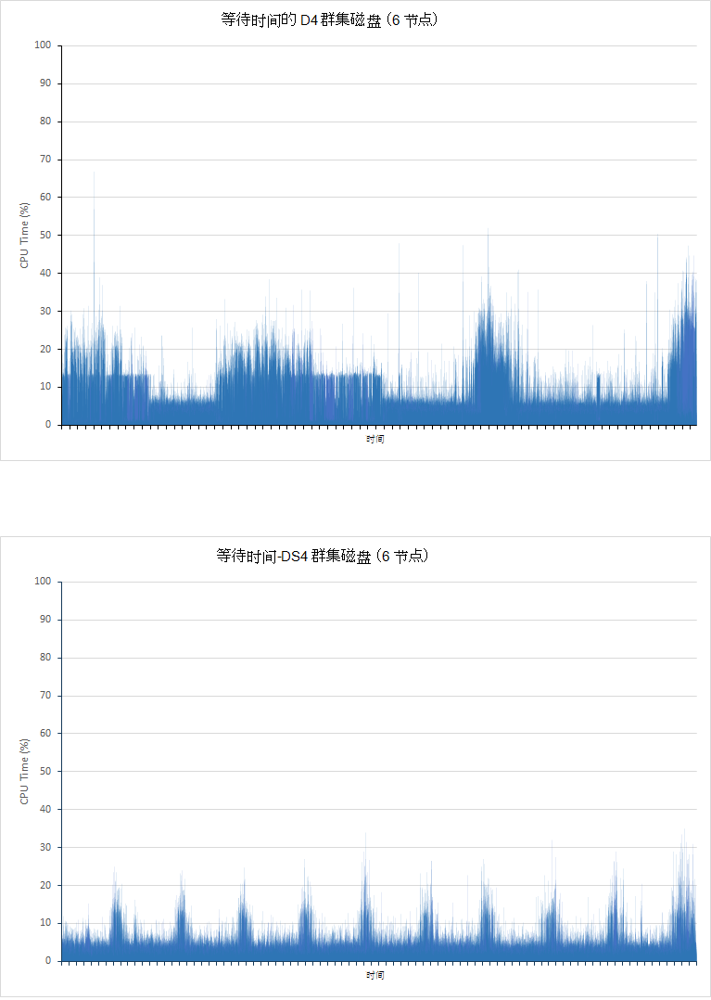

<properties
   pageTitle="调整数据聚合和查询性能与 Elasticsearch 在 Azure 上 |Microsoft Azure"
   description="在优化查询和搜索性能的 Elasticsearch 时的注意事项摘要。"
   services=""
   documentationCenter="na"
   authors="dragon119"
   manager="bennage"
   editor=""
   tags=""/>

<tags
   ms.service="guidance"
   ms.devlang="na"
   ms.topic="article"
   ms.tgt_pltfrm="na"
   ms.workload="na"
   ms.date="09/22/2016"
   ms.author="masashin"/>
   
# <a name="tuning-data-aggregation-and-query-performance-with-elasticsearch-on-azure"></a>在 Azure 上 Elasticsearch 的数据聚合和查询性能优化

[AZURE.INCLUDE [pnp-header](../../includes/guidance-pnp-header-include.md)]

本文是[一系列的一部分](guidance-elasticsearch.md)。 

使用 Elasticsearch 的主要原因是支持搜索数据。 用户应该能够快速找到他们正在寻找的信息。 此外，系统必须允许用户提出问题的数据、 查找的关联性和参加可以推动业务决策的结论。 这种处理是数据信息的区别。

本文总结了在确定最好的方法来优化您的系统的查询和搜索性能时可以考虑的选项。

推荐所有的性能很大程度上取决于方案应用于您的具体情况，该卷的数据编制索引，并在其应用程序和用户查询数据的速率。 在配置或使用您自己的数据和工作负载来评估您的特定方案的好处的索引结构，应该仔细测试结果的任何更改。 到此结束，本文还介绍了多种基准测试所执行的一个特定的情况下使用不同的配置来实现的。 您可以修改您自己的系统的性能评估采取的做法。 这些测试的细节详见[附录](#appendix-the-query-and-aggregation-performance-test)。

## <a name="index-and-query-performance-considerations"></a>索引和查询性能注意事项

本部分介绍有关设计时索引需要支持快速查询和搜索应当考虑的一些常见因素。

### <a name="storing-multiple-types-in-an-index"></a>在索引中存储多种类型

Elasticsearch 索引可以包含多个类型。 它可能会更好，以避免这种方法并创建每种类型为单独的索引。 请考虑以下几点︰

- 不同类型可以指定不同的分析器，并不总是清楚 Elasticsearch 应使用如果执行查询时，在索引级别而不是在类型级别的分析器。 有关详细信息，请参阅[避免类型陷阱](https://www.elastic.co/guide/en/elasticsearch/guide/current/mapping.html#_avoiding_type_gotchas)。

- 索引包含多个类型的 shards 可能会大于那些包含单个类型的索引。 规模越大的 shard，更多的工作需要 Elasticsearch 筛选数据时执行查询。

- 如果数据卷的类型之间没有显著的不匹配，一个类型的信息可以变得稀疏分布在许多 shards 的搜索中检索此数据的效率降低。

    

    ***共享一个索引类型之间的影响*** 

    在图的上部，相同的索引共享文档的类型和类型 b。有很多的更多文档类型为 A 的比 B.搜索类型将涉及所有四个 shards 查询的类型。 图表的下半部分显示效果，是否为每个类型创建单独的索引。 在这种情况下，搜索类型将只需要访问两个 shards。

- 小 shards 可以比大 shards，便于 Elasticsearch 以跨节点负载更平均分布。

- 不同类型可能具有不同的保留期。 它可能很难与活动数据共享 shards 的旧数据归档。


但是，在某些情况下在类型之间共享一个索引可以是高效如果︰

- 搜索定期跨类型保存在相同的索引。

- 只有少数的每个文档类型。 维护一组单独的每种类型的 shards 可以在这种情况下成为巨大的系统开销。


### <a name="optimizing-index-types"></a>优化索引类型

Elasticsearch 索引包含用来填充它的原始 JSON 文档的副本。 此信息保存在[*\_源*](https://www.elastic.co/guide/en/elasticsearch/reference/current/mapping-source-field.html#mapping-source-field)字段的每个索引项。 该数据不是可搜索，但默认情况下返回的*获取*和*搜索*请求。 但是，此字段会增加系统开销而占用存储，使 shards 大和执行的 I/O 量不断增加。 您可以禁用*\_源*字段在每个类型的基础上︰

```http
PUT my_index
{
  "mappings": {
    "my_type": {
      "_source": {
        "enabled": false
      }
    }
  }
}
```
禁用此字段还会删除可执行以下操作︰

- 通过使用*更新*API 更新索引中的数据。

- 执行返回突出显示的数据的搜索。

- 直接到另一个，从一个 Elasticsearch 索引重建索引。

- 更改映射或分析设置。

- 通过查看原始文档查询进行调试。


### <a name="reindexing-data"></a>重建索引数据

Shards 可用于索引的数量最终确定索引的容量。 您可以将需要多少 shards，初始 （和明智） 猜测但始终应考虑重新索引预先策略文档。 在许多情况下，重建索引可能预期的任务随着数据的增长。 您可能不希望为搜索优化，最初，分配大量的 shards 的索引，但随着数据量的扩展分配新的 shards。 在其他情况下重建索引可能需要执行更多的临时基础上如果有关数据卷增长估计只需证明是不准确的。

> [AZURE.NOTE] 重建索引可能不是所需的数据快速老化。 在这种情况下，应用程序可能每个时间段内创建新的索引。 例如，性能日志或者审核数据，可以将其存储在新索引中每一天。

<!-- -->

有效地重建索引涉及中旧的数据创建一个新索引，然后删除旧的索引。 如果索引很大，此过程可能需要时间，并需要确保在此期间仍可搜索数据。 鉴于此，应创建[别名的每个索引](https://www.elastic.co/guide/en/elasticsearch/reference/current/indices-aliases.html)，并查询检索数据通过这些别名。 重建索引，同时保留旧索引时，将光标指向该别名，然后切换到引用新的索引重建索引完成后。 这种方法也是可用于访问基于时间的数据，每天创建一个新索引。 若要访问当前数据，请使用翻转到新的索引创建的别名。

### <a name="managing-mappings"></a>管理映射

Elasticsearch 使用映射来确定如何解释发生在文档中每个字段中的数据。 每个类型都具有自己的映射，这就有效地定义了该类型的架构。 Elasticsearch 使用此信息来生成逆转为每个字段的索引中的文档类型。 在任何文档中，每个字段的数据类型 （如*字符串*、*日期*或*长*） 和一个值。 当首次创建了索引，或它们可以推断通过 Elasticsearch 的新文档将添加到类型时，您可以指定索引的映射。 但是，请考虑以下几点︰

- 动态生成的映射可能导致根据文档添加到索引的字段来解释的错误。 例如，文档 1 可能包含可存放大量的字段 A 和 Elasticsearch，可将此域添加指定的映射的原因是*长时间*。 如果后续的文档中添加一个按哪个字段含有非数值数据，然后将会失败。 在这种情况下，域 A 应可能有被解释为字符串添加的第一个文档时。 在创建索引时指定此映射可以帮助防止这类问题。

- 设计文档，以避免产生过大的映射，因为这可以增加大量开销在执行搜索时，占用大量内存，并也会导致无法找到数据的查询。 采用一致的命名约定具有相同类型的文档中的域。 例如，不要在不同的文档中使用字段名称，例如"名"、"名字"和"名"。 每个文档中使用相同的字段名称。 此外，请不要尝试使用值作为键 （这是列系列数据库中的常用方法但可以导致低效率和故障与 Elasticsearch）。有关详细信息，请参阅[映射分解](https://www.elastic.co/blog/found-crash-elasticsearch#mapping-explosion)。

- 使用*not_analyzed*以避免标记，在适当的位置。 例如，如果文档包含一个名为值"ABC DEF"所保存的*数据*的字符串字段您可能会尝试执行搜索所有文档与此值匹配，如下所示︰

  ```http
  GET /myindex/mydata/_search
  {
    "query" : {
      "filtered" : {
        "filter" : {
          "term" : {
            "data" : "ABC-DEF"
          }
        }
      }
    }
  }
  ```

 但是，该搜索将无法返回预期的结果，由于被标记的字符串 ABC 的高清化时已编入索引的方式。 它将有效地拆分为两个标记，ABC 和定义，由连字符。 此功能旨在支持全文搜索功能，但如果所需的字符串被解释为单个的原子项目文档添加到索引中时，则应禁用标记。 您可以使用此映射︰

  ```http
  PUT /myindex
  {
    "mappings" : {
      "mydata" : {
        "properties" : {
          "data" : {
            "type" : "string",
            "index" : "not_analyzed"
          }
        }
      }
    }
  }
  ```

  有关详细信息，请参阅[查找精确值](https://www.elastic.co/guide/en/elasticsearch/guide/current/_finding_exact_values.html#_term_filter_with_text)。


### <a name="using-doc-values"></a>使用文档值

许多查询和聚合要求数据作为搜索操作的一部分进行排序。 排序时，需要能够将一个或多个术语映射到文档的列表。 为帮助在这一过程中，Elasticsearch 可以加载到内存用作排序关键字字段的值的所有。 这些信息被称为*fielddata*。 意图是缓存在内存中的 fielddata 会招致更少的 I/O，并且可能比反复从磁盘中读取相同的数据更快。 但是，如果一个字段然后将 fielddata 存储在内存中的高基数可以占用大量的堆空间，可能会影响的能力，以执行其他并发操作，或甚至耗尽导致 Elasticsearch 失败的存储。

作为一种备选方法，Elasticsearch 还支持*文档的值*。 不同之处在于，它是存储在磁盘上并创建索引中存储数据时，doc 值是类似于内存中 fielddata 项 （fielddata 动态构建执行查询时。）Doc 值也不会占用堆空间，因此可用于排序或跨聚合数据字段的查询中可以包含唯一值的数量非常大。 此外，在堆上的减少的压力可以帮助对方从磁盘中检索数据，并从内存中读取之间的性能差异。 垃圾回收是有可能发生更长，并利用内存其他并发操作不太可能会受到影响。

启用或禁用文档值在使用*doc_values*属性，索引中每个属性的基础上，如下面的示例所示︰

```http
PUT /myindex
{
  "mappings" : {
    "mydata" : {
      "properties" : {
        "data" : {
          ...
          "doc_values": true
        }
      }
    }
  }
}
```
> [AZURE.NOTE] Doc 值是默认启用的与 Elasticsearch 版本 2.0.0 开始向上。

使用 doc 值的确切影响很可能会对您自己的数据和查询方案针对性极强，因此要准备执行性能测试，建立其有用性。 此外应注意该文档分析的字符串字段值无效。 有关详细信息，请参阅[文档值](https://www.elastic.co/guide/en/elasticsearch/guide/current/doc-values.html#doc-values)。

### <a name="using-replicas-to-reduce-query-contention"></a>使用复制副本来减少查询争用

常见的策略来提高查询的性能是要创建的每个索引的多个副本。 通过从复制副本中读取数据，数据检索操作可以得到满足。 但是，这种策略会严重影响性能的数据接收操作，所以需要在涉及混合工作负载的情况下谨慎使用。 此外，此策略是好处的只如果副本分布在节点并不争夺资源与同一索引的一部分主 shards。 请记住，可能要增加或减小索引复制副本的数量动态。

### <a name="using-the-shard-request-cache"></a>使用 shard 请求缓存

Elasticsearch 可以缓存在内存中的每个 shard 上查询所请求的本地数据。 检索相同的数据更快地运行此启用搜索，可以从内存，而不是磁盘存储器读取数据。 缓存数据以这种方式可以因此提高性能的一些搜索操作，以减少可用于同时执行其他任务的内存为代价。 另外，还有风险从缓存提供的数据已经过时了。 Shard 被刷新和数据发生更改时，缓存中的数据只会失效。 刷新频率受*refresh_interval*设置的索引值。

默认情况下，禁用索引缓存的请求，但您可以启用它，如下所示︰

```http
PUT /myindex/_settings
{
  "index.requests.cache.enable": true
}
```

Shard 请求缓存是最适合于保持相对静止的如历史或日志记录数据的信息。

### <a name="using-client-nodes"></a>使用客户端节点

第一次接收到请求的节点处理所有查询。 此节点将进一步请求发送到所有其他节点包含要查询的索引的 shards，然后累计用于返回响应的结果。 如果查询涉及到聚合数据或执行复杂计算，初始节点负责执行相应的处理。 如果您的系统必须支持复杂查询的数量相对较少，考虑创建池的客户端节点，以减少从数据节点的负载。 相反，如果您的系统必须处理大量的简单查询，然后提交这些请求直接指向数据节点中，并使用了负载平衡器可以平均分配请求。

### <a name="tuning-queries"></a>优化查询

以下几点总结 Elasticsearch 查询的性能最大化的技巧︰

- 避免在可能的情况涉及通配符的查询。

- 如果同一个字段根据全文本搜索和精确匹配，则可以考虑将字段中的数据存储在分析和 nonanalyzed 形式。 执行全文本搜索与分析的域中，并针对 nonanalyzed 字段完全匹配。

- 只返回所需数据。 如果您有较大的文档，但应用程序仅需要持有中各字段的子集的信息，然后返回此子集从查询，而不是整个文档。 这种策略可以减少群集的网络带宽要求。

- 只要有可能，而不是查询使用筛选器搜索数据时。 筛选器仅确定文档是否匹配给定的条件，而查询还计算距离匹配文档 （得分）。 在内部，筛选器所生成的值存储为位图表示每个文档的匹配项匹配养，它们可以通过 Elasticsearch 高速缓存。 如果随后出现相同的筛选条件，则可以从缓存中检索位图，并将其用于快速获取匹配的文档。 有关详细信息，请参阅[内部筛选器操作](https://www.elastic.co/guide/en/elasticsearch/guide/current/_finding_exact_values.html#_internal_filter_operation)。

- 使用*布尔*筛选器执行静态的比较，并仅用于动态计算筛选器，例如那些涉及到脚本*和*、*或*，并*不*是筛选或*geo-\**筛选器。

- 查询结合了*布尔*筛选器查询*和*，*或者*，如果还是*不*与*geo-* *筛选器，将*和*/*或*/*不 geo-* * 筛选最后，以便他们在可能的最小数据集上运行。

    同样，使用*post_filter*运行成本高的筛选器操作。 这些筛选器将执行最后一次。

- 使用聚合，而不是方面。 避免计算的聚合，分析或具有多个可能的值。

    > **注意**︰ 已在 Elasticsearch 版本 2.0.0 方面。

- 使用*value_count*聚合优先*基数*聚合，除非应用程序要求精确匹配的项的计数。 准确计数可能会很快过时，以及很多应用程序只需要一个合理的近似值。

- 避免编写脚本。 查询和筛选中的脚本可能会很高，结果将不被缓存。 长时间运行的脚本可以使用搜索线程无限期，导致后续的请求进行排队。 如果队列已满，进一步请求将被拒绝。

## <a name="testing-and-analyzing-aggregation-and-search-performance"></a>测试和分析聚合和搜索性能

本部分介绍的一系列针对不同群集和索引配置执行的测试的结果。 两种类型的测试都已执行，如下︰

- ***摄取和查询*测试 * *。 当测试继续通过执行大容量插入操作 （每个操作添加 1000年文档） 来填充空索引启动此测试。 同时，以 5 秒为间隔重复数用于上述 15 分钟时间段内添加的文档中搜索并生成聚合的查询。 此测试通常被允许运行 24 小时，重现组成大规模数据接收与实时查询附近的挑战性工作负荷的影响。

- ***只查询*测试**。这种测试是类似于*摄取和查询*测试只不过省略的接收部分，和 100 万个文档预先设置的每个节点上的索引。 修订后的一组查询执行;现在静态数据那样已删除时间元素限制那些在前 15 分钟添加到文档中。 测试运行 90 分钟内，建立一个性能模式由于固定数量的数据所需的时间更短。

---

每个索引中的文档具有相同的架构。 下表汇总了在架构中的字段︰

名称                          | 类型         | 备注 |
  ----------------------------- | ------------ | -------------------------------------------------------- |
  组织                  | 字符串      | 测试生成 200 的唯一组织。 |
  CustomField1-CustomField5   |字符串       |这些都是五个字符串字段都设置为空字符串。|
  DateTimeRecievedUtc           |时间戳    |日期和时间添加文档的位置。|
  主机                          |字符串       |此字段设置为空字符串。|
  HttpMethod                    |字符串       |此字段设置为以下值之一:"发布"、"GET"、"放"。|
  HttpReferrer                  |字符串       |此字段设置为空字符串。|
  HttpRequest                   |字符串       |与随机长度的 10 个到 200 个字符之间的文本，则填充此字段。|
  HttpUserAgent                 |字符串       |此字段设置为空字符串。|
  HttpVersion                   |字符串       |此字段设置为空字符串。|
  单位名称              |字符串       |此字段设置为组织字段的值相同。|
  SourceIp                      |IP           |此字段包含 IP 地址表示的数据的"原点"。 |
   SourceIpAreaCode              |长         |此字段设置为 0。|
  SourceIpAsnNr                 |字符串       |此字段设置为"AS\#\#\#\#\#"。|
  SourceIpBase10                |长         |此字段设为 500。|
  SourceIpCountryCode           |字符串       |此字段包含 2 个字符的国家代码。 |
  SourceIpCity                  |字符串       |此字段包含一个字符串，标识所在国家/地区的城市。 |
  SourceIpLatitude              |双       |此字段包含一个随机值。|
  SourceIpLongitude             |双       |此字段包含一个随机值。|
  SourceIpMetroCode             |长         |此字段设置为 0。|
  SourceIpPostalCode            |字符串       |此字段设置为空字符串。|
  SourceLatLong                 |Geo 点   |此字段设置为一个随机的地理点。|
  SourcePort                    |字符串       |此字段填入一个随机的数字的字符串表示形式。|
  TargetIp                      |IP           |这被填充随机 IP 地址为 0.0.100.100 到 255.9.100.100 范围内。|
  SourcedFrom                   |字符串       |此字段设置为字符串"MonitoringCollector"。|
  TargetPort                    |字符串       |此字段填入一个随机的数字的字符串表示形式。|
  评价                        |字符串       |此字段填入 20 中随机选择的不同的字符串值中的一个。|
  UseHumanReadableDateTimes     |布尔值      |此字段设置为 false。|
 
以下查询作为批处理执行的每次迭代的测试。 以斜体显示的名称用于引用这些查询在本文档的其余部分。 请注意，从省略了时间条件 （在最后的 15 分钟内添加的文档）*仅查询*测试︰

- 每个*等级*值的文档数量进入前 15 分钟 （*计数的评级*）？ 

- 多少的文档中添加了每 5 分钟间隔内前 15 分钟 （*随着时间的推移计数*） 内？

- 每个*等级*值的文档数量中添加了每个国家/地区前 15 分钟 （*命中按国家/地区*）？

- 哪 15 组织出现在前 15 分钟 （*顶部 15 组织*） 中添加的大多数经常在文档？

- 多少不同的组织出现在前 15 分钟 （*唯一计数组织*） 中添加的文档？

- 前 15 分钟 （*总命中计数*） 中添加了多少文档？

- 多少不同的*SourceIp*值出现在前 15 分钟 （*唯一 IP 计数*） 内添加的文档？


[附录](#appendix-the-query-and-aggregation-performance-test)中概述了该定义的索引和查询的详细信息。

这些测试旨在了解以下变量的影响︰

- **磁盘类型**。 测试了 D4 虚拟机使用标准存储 (Hdd) 的一个 6 节点的群集上执行和重复的 DS4 Vm 使用高级存储 (SSDs) 一个 6 节点的群集上。

- **计算机大小-向上扩展**。 测试已组成 DS3 Vm （指定为*小*群集） 一个 6 节点群集上执行、 重复在群集上的 DS4 Vm （*中等*群集），和在 DS14 机 （*大型*群集） 的群集中再次重复。 下表总结了每个 VM SKU 的主要特征︰

 群集 | VM SKU        | 内核数 | 数据磁盘数 | RAM (GB) |
---------|---------------|-----------------|----------------------|----------|
 小   | 标准的 DS3  | 4               | 8                    | 14       |
 中等深浅  | 标准的 DS4  | 8               | 16                   | 28       |
 大   | 标准 DS14 | 16              | 32                   | 112      |

- **簇大小的横向扩展**。 测试了 DS14 虚拟机包含 1、 3 和 6 节点的群集上执行。

- **索引复制副本的数量**。 使用索引 1 和 2 的副本配置进行测试。

- **Doc 值**。 最初设置*doc_values*设置为*true* （默认值） 的索引进行测试。 选定的测试重复使用*doc_values*设置为*false*。

- **缓存**。 启用索引上的 shard 请求缓存进行测试。

- **Shards 的数量**。 使用不同数量的 shards 建立是否查询运行更高效地跨包含更少的、 更大的 shards 或更多、 更小的 shards 的索引重复测试。


## <a name="performance-results---disk-type"></a>性能结果-磁盘类型

通过 6 节点群集的 D4 Vm （使用硬盘），和的 DS4 Vm （使用 SSDs） 6 节点的群集上运行的*摄取和查询*测试评估磁盘性能。 Elasticsearch 在两个群集的配置是相同的。 数据被分布在 16 个磁盘上每个节点，并且每个节点有 14 GB 的 RAM 分配给 Java 虚拟机 (JVM) 运行 Elasticsearch，剩余的内存 (还 14 GB) 保留给操作系统使用。 每个测试运行 24 个小时。 这段时间内选择要启用的数据变得明显，并允许系统变得稳定增加量的效果。 下表总结了结果中，突出显示包含该测试的各种操作的响应时间。

 群集 | 操作/查询            | 平均响应时间 （毫秒） |
---------|----------------------------|----------------------------|
 D4      | 摄取                  | 978                        |
         | 按评估值计数            | 103                        |
         | 一段时间内计数            | 134                        |
         | 按国家/地区的点击次数            | 199                        |
         | 前 15 个组织       | 137                        |
         | 唯一的计数单位 | 139                        |
         | 唯一 IP 计数            | 510                        |
         | 总点击次数           | 89                         |
 DS4     | 摄取                  | 511                        |
         | 按评估值计数            | 187                        |
         | 一段时间内计数            | 411                        |
         | 按国家/地区的点击次数            | 402                        |
         | 前 15 个组织       | 307                        |
         | 唯一的计数单位 | 320                        |
         | 唯一 IP 计数            | 841                        |
         | 总点击次数           | 236                        |

乍一看，就会出现 DS4 群集执行更少的效果不如 D4 群集，有时加倍 （或更糟） 的查询的响应时间。 不过这并未告知整篇文章。 下表显示由每个群集执行接收操作的数目 （请记住，每个操作加载 1000年文档）︰

 群集 | 接收操作计数 |
---------|---------------------------|
 D4      | 264769                    |
 DS4     | 503157                    |

DS4 群集负载测试期间几乎两倍于 D4 群集数据了。 因此，在分析的每个操作的响应时间，您还需要考虑不得不进行扫描，每个查询的文档数量和返回多少文档。 这些是动态图表的索引中的文档数量在不断增加。 不能只是划分 264769 503137 （由每个群集执行接收操作数） 并再将结果乘以 D4 群集赋予比较信息，像这忽略的同时执行接收操作的 I/O 数量由执行每个查询的平均响应时间。 相反，应测量数据写入到的物理量，随着测试的进行，从磁盘读取。 JMeter 测试计划捕获此信息的每个节点。 汇总的结果如下︰

 群集 | 每次操作写入/读取的平均字节数 |
---------|----------------------------------------------|
 D4      | 13471557                                     |
 DS4     | 24643470                                     |

这些数据显示 DS4 群集能够将维持在 I/O 速率约 1.8 倍，D4 群集。 假定磁盘的性质，与所有其他资源是相同的区别必须使用 SSDs 由于而不是硬盘。

为了证明这个结论下, 图阐释了如何将 I/O 随着时间的推移所执行的每个群集︰


<!-- -->

***D4 和 DS4 群集的磁盘活动***

D4 群集的图形显示重大变化，特别是在第一个测试的一半。 这是可能是减少 I/O 速率的调节。 在测试初始阶段，查询都可以运行速度快，因为有很少的数据进行分析。 虽然每个 I/O 操作可能未返回数据量，是因此有可能接近每第二个 (IOPS) 产能，其输入/输出操作工作 D4 群集中的磁盘。 DS4 群集能够支持更高的 IOPS 速度并不会出现相同程度的限制，多个常规 I/O 速率。 为了支持这一理论，关系图的下一步对显示随时间 （图中所示的磁盘等候时间是 CPU 等待 I/O 所用的时间的比例） 如何受磁盘 I/O 阻塞 CPU:



***CPU 的磁盘 I/O 等待时间的 D4 和 DS4 群集***

请务必了解 I/O 操作以阻止 CPU 的两个主要理由︰

- 无法读取或写入数据或从磁盘 I/O 子系统。

- I/O 子系统无法遏制由宿主环境中。 Azure 磁盘使用 Hdd 实现大吞吐量 500 IOPS，并且 SSDs 5000 IOPS 的吞吐量最大。


对 D4 群集中，花费的时间等待 I/O 测试关联起来的上半年期间密切逆转的方式与关系图显示 I/O 速率。 低 I/O 期间对应的 cpu 被阻止了大量的时间段，这表明 I/O 被阻止。 随着更多数据添加到群集的情况下更改，并在下半年 I/O 测试峰值等待时间与峰值的 I/O 吞吐量。 在这种情况下，CPU 将被阻止时执行实际的 I/O。 同样，与 DS4 群集，等待 I/O 所花费的时间是甚至更多。 每个峰值匹配输入/输出性能，而不是波谷等效峰值，这意味着，没有或几乎没有限制发生。

还有一个需要考虑其他因素。 在测试期间，D4 群集 10584 接收错误，以及生成 21 查询错误。 DS4 群集上的测试产生任何错误。

## <a name="performance-results---scaling-up"></a>性能结果-向上扩展

如果大规模向上测试所执行的针对 DS3、 DS4，和 DS14 虚拟机 6 双节点群集中运行测试。 这些 SKU 之所以选择原因 DS4 VM 倍，CPU 内核以及 DS3 作为内存并 DS14 机增加一倍的 CPU 资源再次同时提供内存量的四倍。 下表比较了每个 SKU 的关键方面︰

 SKU  | \#CPU 内核 | 内存 (GB) | 最大磁盘 IOPS | 最大带宽 (MB/s)|
------|-------------|-------------|---------------|--------------|
 DS3  | 4           | 14          | 12,800| 128 |
 DS4  | 8           | 28          | 25,600| 256 |
 DS14 | 16          | 112         | 50000| 512 |

下表总结了在小型 (DS3)、 中等 (DS4) 和大 (DS14) 群集上运行测试的结果。 每个 VM 使用 SSDs 来存放数据。 每个测试运行 24 个小时。

表报告的成功的请求为每种类型的查询 （故障是不包括在内）。 尝试为每种类型请求的数目是测试的查询的大致相同运行期间。 这是因为 JMeter 测试计划执行每个查询 （计数的分级、 计数一段时间内，点击通过国家、 顶部 15 组织、 唯一计数组织、 唯一 IP 计数和命中总数） 发生一次在一起在一个单元称为*测试事务*（此交易记录独立于执行接收操作，由一个单独的线程来运行该任务)。 每次迭代的测试计划的执行的单个测试交易。 测试已完成的事务数因此是查询的衡量每个事务中最慢的响应时间。

| 群集      | 操作/查询            | 请求数 | 平均响应时间 （毫秒） |
|--------------|----------------------------|--------------------|----------------------------|
| 小型 (DS3)  | 摄取                  | 207284             | 3328                       |
|              | 按评估值计数            | 18444              | 268                        |
|              | 一段时间内计数            | 18444              | 340                        |
|              | 按国家/地区的点击次数            | 18445              | 404                        |
|              | 前 15 个组织       | 18439              | 323                        |
|              | 唯一的计数单位 | 18437              | 338                        |
|              | 唯一 IP 计数            | 18442              | 468                        |
|              | 总点击次数           | 18428              | 294   
|||||
| 媒体 (DS4) | 摄取                  | 503157             | 511                        |
|              | 按评估值计数            | 6958               | 187                        |
|              | 一段时间内计数            | 6958               | 411                        |
|              | 按国家/地区的点击次数            | 6958               | 402                        |
|              | 前 15 个组织       | 6958               | 307                        |
|              | 唯一的计数单位 | 6956               | 320                        |
|              | 唯一 IP 计数            | 6955               | 841                        |
|              | 总点击次数           | 6958               | 236                        |
|||||
| 大 (DS14) | 摄取                  | 502714             | 511                        |
|              | 按评估值计数            | 7041               | 201                        |
|              | 一段时间内计数            | 7040               | 298                        |
|              | 按国家/地区的点击次数            | 7039               | 363                        |
|              | 前 15 个组织       | 7038               | 244                        |
|              | 唯一的计数单位 | 7037               | 283                        |
|              | 唯一 IP 计数            | 7037               | 681                        |
|              | 总点击次数           | 7038               | 200                        |

这些数字显示，对于此测试，DS4 和 DS14 群集的性能是相当类似。 DS3 群集的查询操作的响应时间也会比最初，比较并执行查询操作的数量已远远超过了 DS4 和 DS14 群集的值。 但是，其中一个应该也注意到强摄取率，并随之在其中进行搜索的文档数。 DS3 群集中摄取更受限制，并通过测试结束数据库只包含了大约 40%的文档中读取的每个其他两个群集。 这可能是由于处理资源、 网络和使用 DS3 VM 比作 DS4 或 DS14 虚拟机的磁盘带宽。 假设 DS4 VM 都有倍，资源可用作 DS3 VM，并且 DS14 两次 （四倍的内存） 的 DS4 VM 资源，保持了一个问题︰ 为什么之间的区别是摄取率 DS4 和 DS14 群集显著小于该 DS3 和 DS4 群集之间发生？ 这可能是由于网络利用率和带宽限制的 Azure Vm。 下面的关系图显示所有三个群集的此数据︰


**执行的摄取和查询测试的 DS3、 DS4 和 DS14 群集的网络利用率** 

<!-- -->

Azure 虚拟机使用的可用网络带宽的限制不会发布各异，但一个事实，即网络活动似乎有 levelled 大约 2.75GBps 的平均为两个 DS4 和 DS14 测试表明这种限制已经达到，并且已成为限制吞吐量的主要因素。 DS3 群集中，如果网络活动时低得多这样低性能更可能是由于其他资源的可用性方面的约束。

隔离的接收操作的效果并说明如何查询性能变化如节点来扩大规模，一套仅查询测试执行使用相同的节点。 下表总结了在每个群集上得到的结果︰

> [AZURE.NOTE] 您不应比较性能和在查询执行的请求数*只查询*与*摄取和查询*测试运行的测试。 这是因为查询已被修改，涉及到的量是不同的。

| 群集      | 操作/查询            | 请求数 | 平均响应 Ttme （毫秒） |
|--------------|----------------------------|--------------------|----------------------------|
| 小型 (DS3)  | 按评估值计数            | 464                | 11758                      |
|              | 一段时间内计数            | 464                | 14699                      |
|              | 按国家/地区的点击次数            | 463                | 14075                      |
|              | 前 15 个组织       | 464                | 11856                      |
|              | 唯一的计数单位 | 462                | 12314                      |
|              | 唯一 IP 计数            | 461                | 19898                      |
|              | 总点击次数           | 462                | 8882  
|||||
| 媒体 (DS4) | 按评估值计数            | 1045               | 4489                       |
|              | 一段时间内计数            | 1045               | 7292                       |
|              | 按国家/地区的点击次数            | 1053               | 7564                       |
|              | 前 15 个组织       | 1055               | 5066                       |
|              | 唯一的计数单位 | 1051               | 5231                       |
|              | 唯一 IP 计数            | 1051               | 9228                       |
|              | 总点击次数           | 1051               | 2180                       |
|||||
| 大 (DS14) | 按评估值计数            | 1842               | 1927                       |
|              | 一段时间内计数            | 1839               | 4483                       |
|              | 按国家/地区的点击次数            | 1838               | 4761                       |
|              | 前 15 个组织       | 1842               | 2117                       |
|              | 唯一的计数单位 | 1837               | 2393                       |
|              | 唯一 IP 计数            | 1837               | 7159                       |
|              | 总点击次数           | 1837               | 642                        |

这一次，在不同的群集的平均响应时间的趋势会更清晰。 网络利用率还远不需要前面的 DS4 和 DS14 的群集 （这可能饱和的摄取和查询测试中的网络），2.75GBps 和 1.5GBps 为 DS3 群集。 事实上，它是更接近于 200MBps 在所有情况下，按下图所示︰


***网络利用率 DS3，执行只查询测试的 DS4 和 DS14 群集*** 

DS3 和 DS4 群集中的限制因素现在看起来对于大部分时间是接近 100%的 CPU 利用率。 在 DS14 群集 CPU 使用率平均刚刚超过 80%。 这仍高，而是清楚地突出显示具有更多可用的 CPU 内核的优点。 下图描绘了 DS3、 DS4 和 DS14 群集的 CPU 使用模式。


***执行查询专用测试 DS3 和 DS14 群集的 CPU 利用率*** 

## <a name="performance-results---scaling-out"></a>性能结果-横向扩展

为了说明如何系统会随着出的节点数，测试运行，使用 DS14 群集包含 1、 3 和 6 节点。 这一次，仅*只查询*执行测试，使用 100 万个文档，90 分钟内运行︰

| 群集 | 操作/查询            | 请求数 | 平均响应时间 （毫秒） |
|---------|----------------------------|--------------------|----------------------------|
| 1 的节点  | 按评估值计数            | 288                | 6216                       |
|         | 一段时间内计数            | 288                | 28933                      |
|         | 按国家/地区的点击次数            | 288                | 29455                      |
|         | 前 15 个组织       | 288                | 9058                       |
|         | 唯一的计数单位 | 287                | 19916                      |
|         | 唯一 IP 计数            | 284                | 54203                      |
|         | 总点击次数           | 287                | 3333                       |
|||||
| 3 个节点 | 按评估值计数            | 1194               | 3427                       |
|         | 一段时间内计数            | 1194               | 5381                       |
|         | 按国家/地区的点击次数            | 1191               | 6840                       |
|         | 前 15 个组织       | 1196               | 3819                       |
|         | 唯一的计数单位 | 1190               | 2938                       |
|         | 唯一 IP 计数            | 1189               | 12516                      |
|         | 总点击次数           | 1191               | 1272                       |
|||||
| 6 节点 | 按评估值计数            | 1842               | 1927                       |
|         | 一段时间内计数            | 1839               | 4483                       |
|         | 按国家/地区的点击次数            | 1838               | 4761                       |
|         | 前 15 个组织       | 1842               | 2117                       |
|         | 唯一的计数单位 | 1837               | 2393                       |
|         | 唯一 IP 计数            | 1837               | 7159                       |
|         | 总点击次数           | 1837               | 642                        |

节点数以非线性方式虽然使查询性能的群集，一个重要的区别。 3 节点群集单节点群集中，为完成大约 4 倍的查询，而 6 节点的群集来处理 6 倍。 为了帮助说明此非线性下, 图显示如何通过三个群集正在消耗 CPU:


***1、 3 和 6 双节点群集执行查询专用测试 CPU 使用率***

单节点和 3 双节点群集是 cpu，而尽管 CPU 利用率很高 6 节点的群集中没有备用的处理能力。 在这种情况下，其他因素很可能会被限制了吞吐量。 这无法确认︰ 9 和 12 节点，将可能显示进一步的备用处理能力的测试。

上面的表中的数据也显示如何查询的平均响应时间各不相同。 这是查询的一项测试一个系统如何为特定类型进行扩展时是查询的信息量最丰富。 一些搜索跨越比其他的多个节点时高效清晰得多。 这可能是由于节点数和群集增加中的文档数的比率，每个群集包含 100 万个文档。 在执行涉及到数据聚合的搜索时，Elasticsearch 将处理并在每个节点的内存中聚合过程中检索到的数据的缓冲区。 如果有更多的节点，则较少的数据检索，缓冲区中，并在每个节点上处理。

## <a name="performance-results---number-of-replicas"></a>性能测试结果的副本的数量

具有单个副本的索引运行*摄取和查询*测试。 在使用索引配置有两个副本 6 节点 DS4 和 DS14 群集上重复测试。 所有的测试运行 24 个小时。 下表显示了一个和两个副本的比较结果︰

| 群集 | 操作/查询            | 平均响应时间 （毫秒）-1 的副本 | 平均响应时间 （毫秒）-2 的副本 | 响应时间的差异百分比 |
|---------|----------------------------|----------------------------------------|-----------------------------------------|-------------------------------|
| DS4     | 摄取                  | 511                                    | 655                                     | + 28%                          |
|         | 按评估值计数            | 187                                    | 168                                     | -10%                          |
|         | 一段时间内计数            | 411                                    | 309                                     | -25%                          |
|         | 按国家/地区的点击次数            | 402                                    | 562                                     | + 40%                          |
|         | 前 15 个组织       | 307                                    | 366                                     | + 19%                          |
|         | 唯一的计数单位 | 320                                    | 378                                     | + 18%                          |
|         | 唯一 IP 计数            | 841                                    | 987                                     | + 17%                          |
|         | 总点击次数           | 236                                    | 236                                     | + 0%                           |
||||||
| DS14    | 摄取                  | 511                                    | 618                                     | + 21%                          |
|         | 按评估值计数            | 201                                    | 275                                     | + 37%                          |
|         | 一段时间内计数            | 298                                    | 466                                     | + 56%                          |
|         | 按国家/地区的点击次数            | 363                                    | 529                                     | + 46%                          |
|         | 前 15 个组织       | 244                                    | 407                                     | + 67%                          |
|         | 唯一的计数单位 | 283                                    | 403                                     | + 42%                          |
|         | 唯一 IP 计数            | 681                                    | 823                                     | + 21%                          |
|         | 总点击次数           | 200                                    | 221                                     | + 11%                          |

为增加副本数量减少摄取率。 这应应为 Elasticsearch 编写的每个文档的多个副本生成额外的磁盘 I/O。  这被反映 DS14 群集索引图与下图中所示的复制副本 1 和 2。 与 1 副本的索引，如果平均 I/O 速率为 16896573 字节/秒。 与 2 副本索引，平均 I/O 速率为 33986843 字节/秒，只是通过两倍数量。


***与 1 和 2 的副本执行的摄取和查询测试节点的磁盘 I/O 速率***

| 群集 | 查询                      | 平均响应时间 （毫秒）-1 的副本 | 平均响应时间 （毫秒）-2 的副本 |
|---------|----------------------------|----------------------------------------|-----------------------------------------|
| DS4     | 按评估值计数            | 4489                                   | 4079                                    |
|         | 一段时间内计数            | 7292                                   | 6697                                    |
|         | 按国家/地区的点击次数            | 7564                                   | 7173                                    |
|         | 前 15 个组织       | 5066                                   | 4650                                    |
|         | 唯一的计数单位 | 5231                                   | 4691                                    |
|         | 唯一 IP 计数            | 9228                                   | 8752                                    |
|         | 总点击次数           | 2180                                   | 1909                                    |
|||||
| DS14    | 按评估值计数            | 1927                                   | 2330                                    |
|         | 一段时间内计数            | 4483                                   | 4381                                    |
|         | 按国家/地区的点击次数            | 4761                                   | 5341                                    |
|         | 前 15 个组织       | 2117                                   | 2560                                    |
|         | 唯一的计数单位 | 2393                                   | 2546                                    |
|         | 唯一 IP 计数            | 7159                                   | 7048                                    |
|         | 总点击次数           | 642                                    | 708                                     |

这些结果显示改进的 DS4 群集，平均响应时间，但提高了 DS14 群集中。 为了解释这些结果，还应考虑的每个测试执行的查询的数目︰

| 群集 | 查询                      | 执行数-1 副本 | 执行数-2 的副本 |
|---------|----------------------------|------------------------------|-------------------------------|
| DS4     | 按评估值计数            | 1054                         | 1141                          |
|         | 一段时间内计数            | 1054                         | 1139                          |
|         | 按国家/地区的点击次数            | 1053                         | 1138                          |
|         | 前 15 个组织       | 1055                         | 1141                          |
|         | 唯一的计数单位 | 1051                         | 1136                          |
|         | 唯一 IP 计数            | 1051                         | 1135                          |
|         | 总点击次数           | 1051                         | 1136                          |
|||||
| DS14    | 按评估值计数            | 1842                         | 1718                          |
|         | 一段时间内计数            | 1839                         | 1716                          |
|         | 按国家/地区的点击次数            | 1838                         | 1714                          |
|         | 前 15 个组织       | 1842                         | 1718                          |
|         | 唯一的计数单位 | 1837                         | 1712                          |
|         | 唯一 IP 计数            | 1837                         | 1712                          |
|         | 总点击次数           | 1837                         | 1712                          |

此数据显示查询执行的 DS4 群集的数量增加与平均响应时间，减少，但反之同样是 DS14 群集的则返回 true。 均匀分布的一个重要的因素是 CPU 利用率的 DS4 群集 1 副本和 2 副本测试中。 其他人具有备用的处理能力时，某些节点表现出接近 100%的利用率。 性能的改进很有可能更有能力以在群集中的节点之间分发处理。 下面的图像显示在 CPU 处理最轻且频繁使用的虚拟机 （4 和 3 节点） 之间的变体︰


***执行查询专用测试 DS4 群集中最少使用和最常用节点的 CPU 利用率***

对于 DS14 群集不是这种情况。 这两个测试 CPU 使用率已低到所有节点，并且第二个副本的可用性变得较少的优势和更多的开销︰


***最少的 CPU 利用率也最 DS14 群集执行查询专用测试中使用节点***

这些结果显示的需要来决定是否使用多个复制副本时仔细衡量您的系统。 您应始终具有至少一个副本的每个索引 （除非您是愿意如果节点出现故障时丢失数据的风险），但新的复制副本可以施加负担很少的福利，这取决于您的工作负载和群集可用的硬件资源的系统。

## <a name="performance-results---doc-values"></a>性能测试结果的文档值

Doc 值启用，导致 Elasticsearch 来存储用于排序字段在磁盘上的数据进行*接收和查询*测试。 测试已禁用，因此 Elasticsearch 动态构建 fielddata，并缓存在内存中的文档值重复。 所有的测试运行 24 个小时。 下表比较了使用 D4、 DS4 和 DS14 虚拟机 （D4 群集使用的正则的硬盘，虽然 DS4 和 DS14 群集使用 SSDs） 构建 6 节点的群集上运行的测试的响应时间。

| 群集 | 操作/查询            | 平均响应时间 （毫秒）-启用文档值 | 平均响应时间 （毫秒）-禁用文档值 | 响应时间的差异百分比 |
|---------|----------------------------|-------------------------------------------------|--------------------------------------------------|-------------------------------|
| D4      | 摄取                  | 978                                             | 835                                              | -15%                          |
|         | 按评估值计数            | 103                                             | 132                                              | + 28%                          |
|         | 一段时间内计数            | 134                                             | 189                                              | + 41%                          |
|         | 按国家/地区的点击次数            | 199                                             | 259                                              | + 30%                          |
|         | 前 15 个组织       | 137                                             | 184                                              | + 34%                          |
|         | 唯一的计数单位 | 139                                             | 197                                              | + 42%                          |
|         | 唯一 IP 计数            | 510                                             | 604                                              | + 18%                          |
|         | 总点击次数           | 89                                              | 134                                              | + 51%                          |
||||||
| DS4     | 摄取                  | 511                                             | 581                                              | + 14%                          |
|         | 按评估值计数            | 187                                             | 190                                              | + 2%                           |
|         | 一段时间内计数            | 411                                             | 409                                              | -0.5%                         |
|         | 按国家/地区的点击次数            | 402                                             | 414                                              | + 3%                           |
|         | 前 15 个组织       | 307                                             | 284                                              | -7%                           |
|         | 唯一的计数单位 | 320                                             | 313                                              | 2%                           |
|         | 唯一 IP 计数            | 841                                             | 955                                              | + 14%                          |
|         | 总点击次数           | 236                                             | 281                                              | + 19%                          |
||||||
| DS14    | 摄取                  | 511                                             | 571                                              | + 12%                          |
|         | 按评估值计数            | 201                                             | 232                                              | + 15%                          |
|         | 一段时间内计数            | 298                                             | 341                                              | + 14%                          |
|         | 按国家/地区的点击次数            | 363                                             | 457                                              | + 26%                          |
|         | 前 15 个组织       | 244                                             | 338                                              | + 39%                          |
|         | 唯一的计数单位 | 283                                             | 350                                              | + 24%                          |
|         | 唯一 IP 计数            | 681                                             | 909                                              | + 33%                          |
|         | 总点击次数           | 200                                             | 245                                              | + 23%                          |

下表比较摄取操作执行的测试的数目︰

| 群集 | 接收操作计数-doc 值启用 | 接收操作计数-doc 值已禁用 | 在 \number 接收操作的差异百分比 |
|---------|----------------------------------------------|-----------------------------------------------|-----------------------------------------|
| D4      | 264769                                       | 408690                                        | + 54%                                    |
| DS4     | 503137                                       | 578237                                        | + 15%                                    |
| DS14    | 502714                                       | 586472                                        | + 17%                                    |

改进了的摄取率出现 doc 值禁用，因为更少的数据写入磁盘插入文档。 D4 VM 使用硬盘存储数据是尤其明显的性能提高。 在此情况下，也减少了 15%（请参见本节中的第一个表格） 接收操作的响应时间。 这可能由于硬盘都有可能降低压力运行接近 IOPS 极限测试中与 doc 值启用，请参阅磁盘类型测试的详细信息。 下图将 D4 Vm 的 I/O 性能与 doc 值启用 （保存在磁盘上的值） 进行比较，使用 doc 值禁用 （在内存中保存的值）︰


***对于 doc 值启用和禁用了 D4 群集磁盘活动***

与此相反的是，虚拟机使用 SSDs 的摄取值的文档，但还接收操作的响应时间增加数中显示小递增。 一个或两个小的例外情况，查询响应时间也是最差的。 SSDs 是不太有可能接近它们的 IOPS 限制使用 doc 值启用，因此性能的变化将更有可能因增加处理活动和管理 JVM 堆的开销。 这是很明显通过启用和禁用文档值比较的 CPU 利用率。 下图突出显示 DS4 群集，其中大部分 CPU 利用率将从 30%-40%带 doc 值启用被禁用的 doc 值的 40%-50%带到此数据 （DS14 群集演示了一种类似的趋势）︰


***CPU 利用率为 doc 值 DS4 群集启用和禁用***

为了区分 doc 值对从数据接收的查询性能的影响，对只查询测试的执行 DS4 和 DS14 群集的 doc 值启用和禁用。 下表总结了这些测试的结果︰

| 群集 | 操作/查询            | 平均响应时间 （毫秒）-启用文档值 | 平均响应时间 （毫秒）-禁用文档值 | 响应时间的差异百分比 |
|---------|----------------------------|-------------------------------------------------|--------------------------------------------------|-------------------------------|
| DS4     | 按评估值计数            | 4489                                            | 3736                                             | -16%                          |
|         | 一段时间内计数            | 7293                                            | 5459                                             | -25%                          |
|         | 按国家/地区的点击次数            | 7564                                            | 5930                                             | -22%                          |
|         | 前 15 个组织       | 5066                                            | 3874                                             | -14%                          |
|         | 唯一的计数单位 | 5231                                            | 4483                                             | 2%                           |
|         | 唯一 IP 计数            | 9228                                            | 9474                                             | + 3%                           |
|         | 总点击次数           | 2180                                            | 1218                                             | -44%                          |
||||||
| DS14    | 按评估值计数            | 1927                                            | 2144                                             | + 11%                          |
|         | 一段时间内计数            | 4483                                            | 4337                                             | -3%                           |
|         | 按国家/地区的点击次数            | 4761                                            | 4840                                             | + 2%                           |
|         | 前 15 个组织       | 2117                                            | 2302                                             | + 9%                           |
|         | 唯一的计数单位 | 2393                                            | 2497                                             | + 4%                           |
|         | 唯一 IP 计数            | 7159                                            | 7639                                             | + 7%                           |
|         | 总点击次数           | 642                                             | 633                                              | 1%                           |

请记住，此后 Elasticsearch 2.0，doc 值默认启用的。 在测试中涉及 DS4 群集，禁用文档值似乎产生积极影响总体，而反之则通常适用于 DS14 群集 （性能很好使用 doc 值禁用的两种情况都是非常勉强）。

DS4 群集中，这两种情况中的 CPU 利用率已接近 100%的指示群集 CPU 限制这两个测试的持续时间内。 但是，已处理的查询数目从 7369 减少到 5894 （20%)。 请记住，如果禁用文档值 Elasticsearch 将动态生成 fielddata，在内存中，这会消耗 CPU 的处理能力。 此配置降低了磁盘 I/O，但压力加大已接近其最大能力在运行的 Cpu 上的收益率，因此在这种情况下使用 doc 值禁用查询的速度较快，但有更少。

在 DS14 测试并没有 doc 值 CPU 活动为高，但不是 100%。 执行的查询的次数是略高 （约为 4%) 在测试中使用 doc 值启用︰

| 群集 | 查询                      | 执行数-启用文档值 | 号执行-doc 值已禁用 |
|---------|----------------------------|---------------------------------------|----------------------------------------|
| DS4     | 按评估值计数            | 1054                                  | 845                                    |
|         | 一段时间内计数            | 1054                                  | 844                                    |
|         | 按国家/地区的点击次数            | 1053                                  | 842                                    |
|         | 前 15 个组织       | 1055                                  | 846                                    |
|         | 唯一的计数单位 | 1051                                  | 839                                    |
|         | 唯一 IP 计数            | 1051                                  | 839                                    |
|         | 总点击次数           | 1051                                  | 839  
|||||                                  |
| DS14    | 按评估值计数            | 1772                                  | 1842                                   |
|         | 一段时间内计数            | 1772                                  | 1839                                   |
|         | 按国家/地区的点击次数            | 1770                                  | 1838                                   |
|         | 前 15 个组织       | 1773                                  | 1842                                   |
|         | 唯一的计数单位 | 1769                                  | 1837                                   |
|         | 唯一 IP 计数            | 1768                                  | 1837                                   |
|         | 总点击次数           | 1769                                  | 1837                                   |

## <a name="performance-results---shard-request-cache"></a>性能测试结果的 shard 请求缓存

演示如何在每个节点的内存中缓存的索引数据可能会影响性能，*查询和接收*测试上执行 DS4 和 DS14 6 节点群集索引缓存已启用-请参阅[使用 shard 请求缓存](#using-the-shard-request-cache)的详细信息部分。 结果进行比较与生成的早期测试使用同一索引，但索引缓存被禁用。 下表总结了结果。 请注意，数据有 curtailed，以涵盖只测试的前 90 分钟，此时的比较的趋势已明显继续测试时会可能不产生任何额外的见解︰

| 群集 | 操作/查询            | 平均响应时间 （毫秒）-禁用的索引缓存 | 平均响应时间 （毫秒）-索引缓存已启用 | 响应时间的差异百分比 |
|---------|----------------------------|---------------------------------------------------|--------------------------------------------------|-------------------------------|
| DS4     | 摄取                  | 第 504                                               | 3260                                             | + 547%                         |
|         | 按评估值计数            | 218                                               | 273                                              | + 25%                          |
|         | 一段时间内计数            | 450                                               | 314                                              | -30%                          |
|         | 按国家/地区的点击次数            | 447                                               | 397                                              | 11%                          |
|         | 前 15 个组织       | 342                                               | 317                                              | -7%                           |
|         | 唯一的计数单位 | 370                                               | 324                                              | -12%%                         |
|         | 唯一 IP 计数            | 760                                               | 355                                              | -53%                          |
|         | 总点击次数           | 258                                               | 291                                              | + 12%                          |
||||||
| DS14    | 摄取                  | 503                                               | 3365                                             | + 569%                         |
|         | 按评估值计数            | 234                                               | 262                                              | + 12%                          |
|         | 一段时间内计数            | 357                                               | 298                                              | -17%                          |
|         | 按国家/地区的点击次数            | 416                                               | 383                                              | -8%                           |
|         | 前 15 个组织       | 272                                               | 324                                              | -7%                           |
|         | 唯一的计数单位 | 330                                               | 321                                              | -3%                           |
|         | 唯一 IP 计数            | 674                                               | 352                                              | -48%                          |
|         | 总点击次数           | 227                                               | 292                                              | + 29%                          |

这些数据显示了两个关注点︰

-  数据接收率出现极大降低通过启用索引缓存。

-  缓存索引不一定会提高所有类型的查询的响应时间，并且可以有某些聚合操作计数的分级和总命中计数查询执行的那些负面影响。
 

若要了解系统展示此行为的原因，应考虑在测试运行期间在每种情况下成功地执行的查询的数量。 下表总结了这些数据︰

| 群集 | 操作/查询            | 操作/查询计数-禁用的索引缓存 | 操作/查询计数-索引缓存已启用 |
|---------|----------------------------|-------------------------------------------------|------------------------------------------------|
| DS4     | 摄取                  | 38611                                           | 13232                                          |
|         | 按评估值计数            | 524                                             | 18704                                          |
|         | 一段时间内计数            | 523                                             | 18703                                          |
|         | 按国家/地区的点击次数            | 522                                             | 18702                                          |
|         | 前 15 个组织       | 521                                             | 18706                                          |
|         | 唯一的计数单位 | 521                                             | 18700                                          |
|         | 唯一 IP 计数            | 521                                             | 18699                                          |
|         | 总点击次数           | 521                                             | 18701                                          |
||||                                        |
| DS14    | 摄取                  | 38769                                           | 12835                                          |
|         | 按评估值计数            | 528                                             | 19239                                          |
|         | 一段时间内计数            | 528                                             | 19239                                          |
|         | 按国家/地区的点击次数            | 528                                             | 19238                                          |
|         | 前 15 个组织       | 第 527                                             | 19240                                          |
|         | 唯一的计数单位 | 524                                             | 19234                                          |
|         | 唯一 IP 计数            | 524                                             | 19234                                          |
|         | 总点击次数           | 第 527                                             | 19236                                          |

您可以看到，尽管启用缓存时的摄取速率有大约 1/3 的缓存被禁用时，执行的查询的数量增加了 34 倍。 查询不再产生更少的磁盘 I/O，并不具有磁盘资源的竞争。 按下图中比较的 I/O 活动的所有四个用例关系图反映了这一点︰


***带有索引缓存的摄取和查询测试的磁盘 I/O 活动禁用和启用***

在磁盘 I/O 中的减少也意味着 CPU 花较少时间来等待 I/O 完成。 这是由下图突出显示︰


***等待磁盘 I/O 完成索引缓存被禁用和启用接收和查询测试所用的 CPU 时间***

减少磁盘 I/O 意味着 Elasticsearch 可能要花费得更大比例的时间用于处理查询中的数据保存在内存中。 这提高了 CPU 的利用率，变得很明显，如果您看一下所有的四个用例的 CPU 使用率。 下面的关系图显示了如何使用 cpu 资源更启用了缓存持续︰


***使用索引缓存被禁用和启用测试的摄取和查询的 CPU 利用率***

在这两个方案中测试的持续时间内的网络输入/输出的音量已大致相似。 不使用缓存功能的测试结果表明在测试期间，但更长的时间，期间逐渐降低 24 小时运行这些测试，表明此统计信息在大约 2.75GBps levelled。 下图显示了此 DS4 簇 （DS14 群集的数据是非常类似） 的数据︰


***与索引缓存被禁用和启用测试摄取和查询的网络通信量***

[向上扩展](#performance-results-scaling-up)测试中所述，网络带宽和 Azure Vm 的限制不会发布和各异，但 CPU 和磁盘活动的中等级别表明网络利用率可能是在此方案中的限制因素。

缓存是更自然地适合于数据不经常更改的方案。 若要突出显示的影响在此种情况下，缓存的*查询仅*启用了缓存进行测试。 结果如下所示 （90 分钟，运行这些测试和测试索引包含 100 万个文档）︰

| 群集 | 查询                      | 平均响应时间 （毫秒） | 执行的查询数 |
|---------|----------------------------|----------------------------|-------------------------|
|         |                            | **禁用缓存**         | **高速缓存已启用**       |
| DS4     | 按评估值计数            | 4489                       | 210                     |
|         | 一段时间内计数            | 7292                       | 211                     |
|         | 按国家/地区的点击次数            | 7564                       | 231                     |
|         | 前 15 个组织       | 5066                       | 211                     |
|         | 唯一的计数单位 | 5231                       | 211                     |
|         | 唯一 IP 计数            | 9228                       | 218                     |
|         | 总点击次数           | 2180                       | 210                     |
|         |                            |                            |                         |
| DS14    | 按评估值计数            | 1927                       | 211                     |
|         | 一段时间内计数            | 4483                       | 219                     |
|         | 按国家/地区的点击次数            | 4761                       | 236                     |
|         | 前 15 个组织       | 2117                       | 212                     |
|         | 唯一的计数单位 | 2393                       | 212                     |
|         | 唯一 IP 计数            | 7159                       | 220                     |
|         | 总点击次数           | 642                        | 211                     |

非缓存的测试性能的差异是由于在资源可用 DS4 和 DS14 虚拟机之间的差异。 在这两种缓存测试作为数据显著丢弃的平均响应时间直接从内存检索。 它还是值得注意，响应时间为缓存 DS4 和 DS14 群集测试是非常类似，尽管与非缓存的结果差异。 另外，还有在每个测试中的每个查询的响应时间之间的区别非常小，它们都需要大约 220ms年。 磁盘 I/O 速率和这两个群集的 CPU 利用率都作为一次所有的数据在内存中是非常低 I/O 或处理几乎是必需的。 类似于不使用高速缓存的测试，确认该网络带宽可能一个限制因素，在此测试中的网络 I/O 速率。 下图显示 DS4 群集的此信息。 DS14 群集的配置文件是非常类似︰


***磁盘 I/O、 CPU 利用率和网络利用率仅查询索引缓存启用测试***

上面的表中的数据表明，使用 DS14 体系结构通过使用 DS4 显示用处。 事实上，由 DS14 群集的样本数约 5%，低于 DS4 群集，但这也可能是由于网络的限制这段时间略有不同。

## <a name="performance-results---number-of-shards"></a>性能测试结果的数目 shards

本测试的目的是为了确定 shards 创建的索引数上该索引的查询性能是否有任何影响。

单独测试执行几个 shard 配置的索引可能影响的数据接收速率。 测试执行以确定查询性能后面以类似的方法，但都仅限于在 DS14 硬件上运行一个 6 节点的群集。 这种方法有助于尽可能减少的变量，所以任何的性能差异应是由于 shards 的卷。

*只查询*相同的索引配置 7、 13、 23、 37 和 61 主 shards 的副本上执行测试。 索引包含 100 万个文档，并有一个副本，整个群集双倍数量的 shards。 每个测试运行 90 分钟。 下表总结了结果。 显示包含查询的完整集合 JMeter 测试事务的响应时间通过每个测试迭代的平均响应时间。 请参阅注释部分[性能测试结果-向上扩展](#performance-results-scaling-up)的详细信息︰

| Shards 的数量          | Shard 布局 (shards 每个节点，包括副本) | 执行的查询数 | 平均响应时间 （毫秒） |
|---------------------------|----------------------------------------------------|-----------------------------|------------------------|
| 7 (14 包括副本) | 3-2-2-2-2-3                                        | 7461                        | 40524                  |
| 13 (26)                   | 5-4-5-4-4-4                                        | 7369                        | 41055                  |
| 23 (46)                   | 7-8-8-7-8-8                                        | 14193                       | 21283                  |
| 37 (74)                   | 13-12-12-13-12-12                                  | 13399                       | 22506                  |
| 61 (122)                  | 20-21-20-20-21-20                                  | 14743                       | 20445                  |

这些结果表明 13(26) shard 群集和 23,(46) shard 群集之间显著性能差异、 吞吐量近两倍，并且响应时间减半。 这很可能是由于配置的虚拟机和 Elasticsearch 使用处理搜索请求的结构。 搜索请求进行排队，并由单个搜索线程处理每个搜索请求。 搜索线程创建的 Elasticsearch 节点数为托管节点的计算机上可用的处理器数的函数。 结果表明，在节点上只有 4 个或 5 shards，与处理资源未得到完全利用。 通过查看在运行此测试时的 CPU 使用率来支持此功能。 下图是在进行 13(26) shard 测试时从 Marvel 拍摄的快照︰


***只查询测试 7(14) shard 群集上的 CPU 利用率***

比较这些数字与 23(46) shard 测试︰


***只查询测试 23(46) shard 群集上的 CPU 利用率***

在 23(46) shard 测试中，CPU 利用率时高得多。 每个节点包含 7 或 8 shards。 DS14 体系结构提供了 16 个处理器，并且更好地能够利用此数目的内核与其他的 shards Elasticsearch。 上面的表中的数字表明，增加数超出此范围的 shards 可能会略微改善性能，，但应该抵消这些数字对维护 shards 有大量的额外开销。 这些测试意味着最佳的每个节点的 shards 数一半的每个节点上可用的处理器核心。 但是，请记住，在仅运行查询时已达到这些结果。 如果您的系统导入数据，您还应考虑分片如何影响数据接收操作的性能。 

## <a name="summary"></a>摘要

Elasticsearch 提供了许多可用于结构索引，并调整它们以支持大规模的查询操作的选项。 此文档已总结一些常见的配置和可用于调整您的数据库进行查询的技术。 但是，您应该识别优化数据库以支持快速检索，而不是支持高容量数据摄取之间进行权衡。 有时什么是良好的查询可以带来不利影响的插入操作，反之亦然。 在面临混合工作负载的系统，您需要评估平衡所在，并据此调整系统参数。

此外，可以改变不同的配置和技术的适用性，根据数据和限制的结构 （或其他） 的硬件系统上构建。 本文档中所示的测试的许多说明了硬件平台的选择如何影响吞吐量，以及如何一些策略能够在某些情况下非常有用，但在其他不利。 重要的一点是要了解可用的选项，然后执行严格基准测试使用您自己的数据来确定最优的组合。

最后，请记住，Elasticsearch 数据库是不一定的静态项。 它可能会随着时间的推移增长并用于组织数据的策略可能需要定期修订。 例如，可能有必要扩大规模、 扩张，或重新建立索引数据与其他 shards。 随着系统的规模和复杂性不断增加，一定要不断地测试性能，以确保仍满足任何服务级别协议，保证给您的客户。

## <a name="appendix-the-query-and-aggregation-performance-test"></a>附录︰ 查询和聚合性能测试

本附录介绍了对 Elasticsearch 群集执行性能测试。 通过使用 JMeter 运行在单独的一组虚拟机上运行这些测试。 详细信息中[创建性能测试环境在 Azure 上 Elasticsearch](guidance-elasticsearch-creating-performance-testing-environment.md)介绍了测试环境的配置。 若要执行您自己的测试，您可以创建自己的 JMeter 测试计划手动执行本附录中的指导或可以单独使用可用的自动化的测试脚本。 有关详细信息，请参阅[运行自动的 Elasticsearch 性能测试](guidance-elasticsearch-running-automated-performance-tests.md)。

数据查询工作负载执行查询如下所述时在同一时间大规模地上载的文档的集。 此工作负载的目的是模拟生产环境，在其中添加新数据不断被执行搜索时。 查询的结构化，从最后 15 分钟内添加的文档检索最新的数据。

每个文档存储在一个名为*idx*，索引和具有类型*文档*。 可以使用下面的 HTTP 请求来创建索引。 在许多测试中所示的值不同的*number_of_replicas*和*number_of_shards*设置。 此外，使用 fielddata 而不是文档值、 每个属性的测试使用特性批注*"doc_values": 假*。

**重要提示**︰ 该索引被删除并重新创建在运行每个测试之前。 

``` http
PUT /idx
{  
    "settings" : {
        "number_of_replicas": 1,
        "refresh_interval": "30s",
        "number_of_shards": "5",
        "index.translog.durability": "async"    
    },
    "doc": {
        "mappings": {
            "event": {
                "_all": {
                    "enabled": false
                },
                "_timestamp": {
                    "enabled": true,
                    "store": true,
                    "format": "date_time"
                },
                "properties": {
                    "Organization": {
                        "type": "string",
                        "index": "not_analyzed"
                    },
                    "CustomField1": {
                        "type": "string",
                        "index": "not_analyzed"
                    },
                    "CustomField2": {
                        "type": "string",
                        "index": "not_analyzed"
                    },
                    "CustomField3": {
                        "type": "string",
                        "index": "not_analyzed"
                    },
                    "CustomField4": {
                        "type": "string",
                        "index": "not_analyzed"
                    },
                    "CustomField5": {
                        "type": "string",
                        "index": "not_analyzed"
                    },
                    "DateTimeReceivedUtc": {
                        "type": "date",
                        "format": "dateOptionalTime"
                    },
                    "Host": {
                        "type": "string",
                        "index": "not_analyzed"
                    },
                    "HttpMethod": {
                        "type": "string",
                        "index": "not_analyzed"
                    },
                    "HttpReferrer": {
                        "type": "string",
                        "index": "not_analyzed"
                    },
                    "HttpRequest": {
                        "type": "string",
                        "index": "not_analyzed"
                    },
                    "HttpUserAgent": {
                        "type": "string",
                        "index": "not_analyzed"
                    },
                    "HttpVersion": {
                        "type": "string",
                        "index": "not_analyzed"
                    },
                    "OrganizationName": {
                        "type": "string",
                        "index": "not_analyzed"
                    },
                    "SourceIp": {
                        "type": "ip"
                    },
                    "SourceIpAreaCode": {
                        "type": "long"
                    },
                    "SourceIpAsnNr": {
                        "type": "string",
                        "index": "not_analyzed"
                    },
                    "SourceIpBase10": {
                        "type": "long"
                    },
                    "SourceIpCity": {
                        "type": "string",
                        "index": "not_analyzed"
                    },
                    "SourceIpCountryCode": {
                        "type": "string",
                        "index": "not_analyzed"
                    },
                    "SourceIpLatitude": {
                        "type": "double"
                    },
                    "SourceIpLongitude": {
                        "type": "double"
                    },
                    "SourceIpMetroCode": {
                        "type": "long"
                    },
                    "SourceIpPostalCode": {
                        "type": "string",
                        "index": "not_analyzed"
                    },
                    "SourceIpRegion": {
                        "type": "string",
                        "index": "not_analyzed"
                    },
                    "SourceLatLong": {
                        "type": "geo_point",
                        "doc_values": true,
                        "lat_lon": true,
                        "geohash": true
                    },
                    "SourcePort": {
                        "type": "string",
                        "index": "not_analyzed"
                    },
                    "SourcedFrom": {
                        "type": "string",
                        "index": "not_analyzed"
                    },
                    "TargetIp": {
                        "type": "ip"
                    },
                    "TargetPort": {
                        "type": "string",
                        "index": "not_analyzed"
                    },
                    "Rating": {
                        "type": "string",
                        "index": "not_analyzed"
                    },
                    "UseHumanReadableDateTimes": {
                        "type": "boolean"
                    }
                }
            }
        }
    }
}
```

测试已执行以下查询︰
* 每个等级值的文档数量进入前 15 分钟？

  ```http
  GET /idx/doc/_search
  {
    "query": {
      "bool": {
        "must": [
          {
            "range": {
              "DateTimeReceivedUtc": {
                "gte": "now-15m",
                "lte": "now"
              }
            }
          }
        ],
        "must_not": [],
        "should": []
      }
    },
    "from": 0,
    "size": 0,
    "aggs": {
      "2": {
        "terms": {
          "field": "Rating",
          "size": 5,
          "order": {
            "_count": "desc"
          }
        }
      }
    }
  }
  ```

* 多少的文档中添加了每 5 分钟间隔内前 15 分钟内？

  ```http
  GET /idx/doc/_search
  {
    "query": {
      "bool": {
        "must": [
          {
            "range": {
              "DateTimeReceivedUtc": {
                "gte": "now-15m",
                "lte": "now"
              }
            }
          }
        ],
        "must_not": [],
        "should": []
      }
    },
    "from": 0,
    "size": 0,
    "sort": [],
    "aggs": {
      "2": {
        "date_histogram": {
          "field": "DateTimeReceivedUtc",
          "interval": "5m",
          "time_zone": "America/Los_Angeles",
          "min_doc_count": 1,
          "extended_bounds": {
            "min": "now-15m",
            "max": "now"
          }
        }
      }
    }
  }
  ```

* 每一等级值的文档数量已在每个国家在最后 15 分钟内？

  ```HTTP
  GET /idx/doc/_search
  {
    "query": {
      "filtered": {
        "query": {
          "query_string": {
            "query": "*",
            "analyze_wildcard": true
          }
        },
        "filter": {
          "bool": {
            "must": [
              {
                "query": {
                  "query_string": {
                    "query": "*",
                    "analyze_wildcard": true
                  }
                }
              },
              {
                "range": {
                  "DateTimeReceivedUtc": {
                    "gte": "now-15m",
                    "lte": "now"
                  }
                }
              }
            ],
            "must_not": []
          }
        }
      }
    },
    "size": 0,
    "aggs": {
      "2": {
        "terms": {
          "field": "Rating",
          "size": 5,
          "order": {
            "_count": "desc"
          }
        },
        "aggs": {
          "3": {
            "terms": {
              "field": "SourceIpCountryCode",
              "size": 15,
              "order": {
                "_count": "desc"
              }
            }
          }
        }
      }
    }
  }
  ```

* 哪 15 组织最经常出现在前 15 分钟内添加的文档？

  ```http
  GET /idx/doc/_search
  {
    "query": {
      "filtered": {
        "query": {
          "query_string": {
            "query": "*",
            "analyze_wildcard": true
          }
        },
        "filter": {
          "bool": {
            "must": [
              {
                "query": {
                  "query_string": {
                    "query": "*",
                    "analyze_wildcard": true
                  }
                }
              },
              {
                "range": {
                  "DateTimeReceivedUtc": {
                    "gte": "now-15m",
                    "lte": "now"
                  }
                }
              }
            ],
            "must_not": []
          }
        }
      }
    },
    "size": 0,
    "aggs": {
      "2": {
        "terms": {
          "field": "Organization",
          "size": 15,
          "order": {
            "_count": "desc"
          }
        }
      }
    }
  }
  ```

* 多少不同的组织出现在前 15 分钟内添加的文档？

  ```http
  GET /idx/doc/_search
  {
    "query": {
      "filtered": {
        "query": {
          "query_string": {
            "query": "*",
            "analyze_wildcard": true
          }
        },
        "filter": {
          "bool": {
            "must": [
              {
                "query": {
                  "query_string": {
                    "query": "*",
                    "analyze_wildcard": true
                  }
                }
              },
              {
                "range": {
                  "DateTimeReceivedUtc": {
                    "gte": "now-15m",
                    "lte": "now"
                  }
                }
              }
            ],
            "must_not": []
          }
        }
      }
    },
    "size": 0,
    "aggs": {
      "2": {
        "cardinality": {
          "field": "Organization"
        }
      }
    }
  }
  ```

* 在最后的 15 分钟内已添加多少文档？

  ```http
  GET /idx/doc/_search
  {
    "query": {
      "filtered": {
        "query": {
          "query_string": {
            "query": "*",
            "analyze_wildcard": true
          }
        },
        "filter": {
          "bool": {
            "must": [
              {
                "query": {
                  "query_string": {
                    "analyze_wildcard": true,
                    "query": "*"
                  }
                }
              },
              {
                "range": {
                  "DateTimeReceivedUtc": {
                    "gte": "now-15m",
                    "lte": "now"
                  }
                }
              }
            ],
            "must_not": []
          }
        }
      }
    },
    "size": 0,
    "aggs": {}
  }
  ```

* 多少不同的 SourceIp 值出现在前 15 分钟内添加的文档？

  ```http
  GET /idx/doc/_search
  {
    "query": {
      "filtered": {
        "query": {
          "query_string": {
            "query": "*",
            "analyze_wildcard": true
          }
        },
        "filter": {
          "bool": {
            "must": [
              {
                "query": {
                  "query_string": {
                    "query": "*",
                    "analyze_wildcard": true
                  }
                }
              },
              {
                "range": {
                  "DateTimeReceivedUtc": {
                    "gte": "now-15m",
                    "lte": "now"
                  }
                }
              }
            ],
            "must_not": []
          }
        }
      }
    },
    "size": 0,
    "aggs": {
      "2": {
        "cardinality": {
          "field": "SourceIp"
        }
      }
    }
  }
  ```
