<properties
   pageTitle="调整在 Azure 上 Elasticsearch 的数据接收性能 |Microsoft Azure"
   description="如何最大限度地在 Azure 上的 Elasticsearch 数据接收性能。"
   services=""
   documentationCenter="na"
   authors="dragon119"
   manager="bennage"
   editor=""
   tags=""/>

<tags
   ms.service="guidance"
   ms.devlang="na"
   ms.topic="article"
   ms.tgt_pltfrm="na"
   ms.workload="na"
   ms.date="09/22/2016"
   ms.author="masashin"/>

# <a name="tuning-data-ingestion-performance-for-elasticsearch-on-azure"></a>在 Azure 上 Elasticsearch 的数据接收性能调优

[AZURE.INCLUDE [pnp-header](../../includes/guidance-pnp-header-include.md)]

本文是[一系列的一部分](guidance-elasticsearch.md)。 

## <a name="overview"></a>概述

在创建任何搜索数据库时一个重要的方面是确定结构系统以快速、 高效地摄取可搜索的数据的最佳方式。 围绕这一要求的事项涉及不只选择基础结构实现系统，但也可用来帮助确保系统可以及时与数据流入的预期级别的各种优化。 

本文描述用于实现要求较高的数据提取率 Elasticsearch 群集，应考虑部署和配置选项。 用于说明目的提供可靠的数据，本文档还显示的性能基准管理工具使用简单的高容量数据接收工作负载的各种配置的结果。 工作负荷的详细情况见本文档末尾的[附录](#appendix-the-bulk-load-data-ingestion-performance-test)一中。

基准测试的目的不是用于生成运行 Elasticsearch 的绝对性能图表或甚至可以建议一个特定拓扑结构，而是为了说明可用于评估性能、 尺寸数据节点和实施群集，可以满足性能要求的方法。 

调整您自己的系统，务必要测试完全根据自己的工作负载的性能。 收集可获得最佳的硬件配置以使用时，有关信息的遥测和应考虑的水平比例因子。 特别是，您应该︰

- 请考虑总大小的有效负载发送并不只是在批量插入的每个请求中的项目数。 每个申请的大批量产品的较小的数字可能比大的号码，这取决于可用于处理每个请求的资源更好。

您可以监视各种批量插入请求通过[Marvel](https://www.elastic.co/products/marvel)，使用*readbytes*的效果/*writebytes* I/O 计数器使用[JMeter](https://jmeter.apache.org/)，以及操作系统工具如*iostat*和*vmstat*在 Ubuntu 上。 

- 到测量 CPU 处理和 I/O 等待时间、 磁盘延迟、 吞吐量和响应时间收集遥测和进行性能测试。 此信息可以帮助识别潜在的瓶颈，并评估成本和使用高级存储带来的好处。 请记住，CPU 和磁盘使用率可能甚至可以跨所有节点根据的方式中的 shards 和副本分布在群集 （某些节点可以包含比其他的更多 shards）。

- 考虑如何为您的工作负载的并发请求数将分发到群集并评估使用不同数量的节点来处理该工作负荷的影响。

- 考虑如何工作负载可能会增长随着业务的扩展。 评估这种增长在成本上的虚拟机和存储节点使用的影响。

- 识别使用带有更多的与常规磁盘的节点的群集可能是更经济如果方案需要大量请求，磁盘基础结构维护满足服务级别协议 (SLA) 的吞吐量。 但是，增加节点数目可以引入在窗体中的其他节点间通信和同步的开销。

- 了解更多的核，每个节点可能会产生更多磁盘通信可以处理更多文档。 在这种情况下，测量磁盘利用率，以评估是否 I/O 子系统可能会成为一个瓶颈，并确定使用高级存储的好处。

- 测试和分析具有较高的节点较少而不是更少的节点，具有更多内核的内核的利弊。 请记住，增加副本数量升级群集上的需求，可能需要添加节点。

- 请考虑使用临时磁盘可能需要索引有更频繁地恢复。

- 测量存储卷使用情况，以评估容量和存储的利用率。 例如，在我们的方案我们存储 1.5 亿份文档使用 350 GB 存储。

- 衡量您的工作负载的传输速率，并考虑如何关闭您很可能会转到在其中创建虚拟磁盘的任何给定的存储帐户总 I/O 速率传输限制。

## <a name="node-and-index-design"></a>节点和索引设计

在系统中必须支持大规模数据接收，您可以问以下问题︰

- **快速移动或相对静态数据是？** 更多动态的数据、 更好的维护开销为 Elasticsearch。 如果复制数据，同时维护每个复制副本。 快速移动的数据，具有有限使用期限或可以方便地重建，也可以获益于完全禁用复制。 此选项节中有介绍[优化大规模数据摄取。](#tuning-large-scale-data-ingestion)

- **最新程度如何您需要的搜索发现，以将数据？** 要保持性能，Elasticsearch 缓冲尽可能多的数据在内存中的方式。 这意味着并不是所有的更改都立即可用的搜索请求。 Elasticsearch 使用保存更改并使其可见的过程描述了[进行永久性的更改](https://www.elastic.co/guide/en/elasticsearch/guide/current/translog.html#translog)。 

    速率数据变得可见由*刷新\_间隔*相关的索引设置。 默认情况下，此时间间隔设置为 1 秒。 但是，不是每一种情况下需要刷新快速发生这。 例如，记录日志数据的索引可能需要对付的信息需要快速，ingested，但不需要的信息，可立即用于查询快速而又持续流入。 在这种情况下，应考虑降低的刷新频率。 一节中还描述此功能[优化大规模数据摄取。](#tuning-large-scale-data-ingestion)

- **如何快速将可能增长的数据？** 在创建索引时指定的 shards 数取决于索引容量。 若要允许增长，指定足够数量的 shards （默认值为 5）。 最初在单个节点上创建索引，如果所有的五个 shards 位于该节点，但随着数据量的增长更多可以添加节点，Elasticsearch 将在节点之间动态地分配 shards。 但是，每个 shard 会有开销。 所有搜索索引中的将都查询所有的 shards，以便创建大量的数据量小的 shards 可能会降低数据检索 （避免[Kagillion shards](https://www.elastic.co/guide/en/elasticsearch/guide/current/kagillion-shards.html)方案）。

    某些工作负载 （如日志记录） 可能会创建一个新索引，每一天，和如果您观察到 shards 的数量是没有足够数量的数据，则应更改它之前创建的下一个索引 （将不会影响现有的索引）。 如果您必须跨多个 shards 分发现有数据，然后一种选择是重新建立索引的信息。 使用适当的配置创建新的索引，将数据复制到其中。 这一过程可以成为透明应用程序通过使用[索引别名](https://www.elastic.co/guide/en/elasticsearch/reference/current/indices-aliases.html)。

- **数据是否需要在多租赁方案中的用户之间进行分区？** 您可以创建单独的索引为每个用户，但代价是很高，如果每个用户只具有中等量的数据。 相反，请考虑创建[共享的索引](https://www.elastic.co/guide/en/elasticsearch/guide/current/shared-index.html)并使用[别名基于筛选器](https://www.elastic.co/guide/en/elasticsearch/guide/current/faking-it.html)将请求定向到每个用户数据。 若要将用户的数据在同一个 shard 中放在一起，覆盖基于用户一些标识属性的索引和路由数据的默认路由配置。

- **是长或短的数据？** 如果使用的一套 Azure 虚拟机来实现 Elasticsearch 群集，您可以在本地资源的系统磁盘，而不是已连接的驱动器上存储临时数据。
使用 VM SKU，它利用 SSD 资源磁盘可以提高 I/O 性能。 但是，持有的资源磁盘上的任何信息是暂时的可能会丢失，如果虚拟机重新启动 （请参见节时将数据临时驱动器会丢失在[了解 Microsoft Azure 虚拟机上的临时驱动器](http://blogs.msdn.com/b/mast/archive/2013/12/07/understanding-the-temporary-drive-on-windows-azure-virtual-machines.aspx)详细信息）。 如果您需要保留重新启动之间的数据，创建要保存此信息，并将它们附加到虚拟机的数据磁盘。

- **数据是如何活动？** Azure Vhd 是受限制的读/写活动量超过指定的参数 （目前每秒 (IOPS) 附加到一个标准层的虚拟机，而 5000 IOPS 的最优存储磁盘的磁盘 500 输入/输出操作）。 

    为了降低带宽限制的可能性并提高 I/O 性能，请考虑为每个虚拟机创建多个数据磁盘和跨[磁盘和文件系统要求](guidance-elasticsearch-running-on-azure.md#disk-and-file-system-requirements)中所述的这些磁盘条带化数据配置 Elasticsearch。

    您应该选择硬件配置，有助于尽量减少磁盘 I/O 通过确保足够的内存可供经常访问的缓存数据读取操作的数目。 这是所述运行 Elasticsearch 的[内存要求](guidance-elasticsearch-running-on-azure.md#memory-requirements)部分在 Azure 上。

- **每个节点将需要何种类型的工作负载来支持？** Elasticsearch 得益于拥有内存高速缓存中的数据 （在文件系统缓存的形式） 和 JVM 堆在 Azure 上运行 Elasticsearch 的[内存需求](guidance-elasticsearch-running-on-azure.md#memory-requirements)节中所述。 

    内存量的 CPU 内核的数量和可用的磁盘数量由设置虚拟机的 SKU。 有关详细信息，请参阅 Azure 网站上的[虚拟机定价](http://azure.microsoft.com/pricing/details/virtual-machines/)。

### <a name="virtual-machine-options"></a>虚拟机选项

您可以设置使用大量不同的 Sku 的 Azure 中的虚拟机。 Azure 虚拟机可用的资源取决于选定的 SKU。 每个 SKU 提供各种不同的内核、 内存和存储。 您需要选择适当大小的 VM，将处理预期的工作负荷，但，也将证明经济高效。
从配置能够满足您当前的要求开始 （执行基准测试，如本文后面所述）。 您可以通过添加更多虚拟机运行 Elasticsearch 节点以后扩展群集。

Azure 网站上[的虚拟机大小](../virtual-machines/virtual-machines-linux-sizes.md)文档的各种选项和 Sku 可用虚拟机。

应匹配的大小和在虚拟机上运行的节点执行角色的虚拟机的资源。

数据节点︰

- 分配最多 30 GB 或 50%的可用 RAM 内存与 Java 堆，较低者为准。 将留给操作系统用来缓存文件的其余部分。 如果使用 Linux，您可以指定要通过设置 ES 对 Java 堆分配的内存量\_堆\_大小之前运行 Elasticsearch 环境变量。 或者，如果您使用的 Windows 或 Linux，启动 Elasticsearch 时可以规定使用*Xmx*和*Xms*参数的内存大小。

    根据负载情况，较少的大型虚拟机可能无法有效使用更多的中等规模的虚拟机的性能。 应该进行测试，可以衡量的其他网络通信和维护涉及增加可用的内核数和每个节点上的减少的磁盘争用的成本之间的权衡。

- 使用高级存储存储 Elasticsearch 数据。 这是[存储选项](#storage-options)节中更详细地讨论。

- 在这些磁盘上使用相同的大小和条带化数据的多个磁盘。 您的 Vm 的 SKU 将决定您可以将附加的数据磁盘最大数量。 有关详细信息，请参阅[磁盘和文件系统的要求](guidance-elasticsearch-running-on-azure.md#disk-and-file-system-requirements)。

- 多核 CPU SKU 使用至少 2 个核心，最好是 4 个或更多。 

对于客户端节点︰

- 不分配用于 Elasticsearch 数据的磁盘存储、 专用客户端不在磁盘上存储数据。

- 确保足够的内存可用来处理工作负载。 大容量插入请求读入到内存之前发送到的不同的数据节点的数据和聚合和查询的结果返回给客户端应用程序之前累积在内存中。 准则您自己的工作负荷，通过使用 Marvel 或通过使用*节点/统计*API 返回的[JVM 信息](https://www.elastic.co/guide/en/elasticsearch/guide/current/_monitoring_individual_nodes.html#_jvm_section)之类的工具来监视内存使用 (`GET _nodes/stats`) 来评估最佳的要求。  特别是，监视*堆\_使用\_%*指标为每个节点和目标是保持低于 75%的可用空间的堆大小。

- 确保足够的 CPU 内核都可用来接收和处理请求的预期的量。
在收到前处理，并可以排队的项的数量是每个节点上的 CPU 内核的数量的函数，则请求将排队等待。 可以通过使用返回使用节点/统计数据 API 的[线程池的信息](https://www.elastic.co/guide/en/elasticsearch/guide/current/_monitoring_individual_nodes.html#_threadpool_section)中的数据来监视的队列长度。 

    如果队列的*拒绝*计数指示请求将被拒绝，这表明群集着手瓶颈。 这可能是由于 CPU 带宽，但可能也是由于其他因素，例如缺乏内存或 I/O 性能降低，因此与其他统计信息结合使用此信息可帮助确定根本原因。

    客户端节点可能会或可能不是有必要的具体取决于您的工作负载。 数据接收工作负载不倾向受益使用专用的客户机，而一些搜索和聚合可以更快地运行。 要准备好来衡量自己的方案。

    客户端节点将主要用于传输客户端 API 用于连接到群集的应用程序。 您还可以使用节点客户端 API 中，动态创建的专用客户端应用程序，使用应用程序宿主环境的资源。 如果您的应用程序使用节点客户端 API，则它可能无法让包含预配置的专用客户端节点的群集的必要条件。 
    
    但是，请注意使用客户端节点 API 创建的节点是群集中的第一个类成员，并参与与其他节点的网络聊友出现这种情况下。 频繁地启动和停止客户端节点可以创建不必要的干扰在整个群集。

主节点︰

- 不分配用于 Elasticsearch 数据的磁盘存储、 专用主节点不在磁盘上存储数据。

- CPU 的要求应该是微乎其微的。

- 内存要求取决于群集的大小。 有关群集的状态保留在内存中。 对于小群集所需的内存量是最少，但是经常和移动的 shards 在其中创建索引的大型、 高活动群集，状态信息的量可以增长显著。 监控的 JVM 堆大小来确定是否需要添加更多内存。

> [AZURE.NOTE]为群集的可靠性，始终创建多个主节点和配置剩余的节点，以避免分割大脑发生的可能性。 理想情况下，应该有主节点数为奇数。 本主题介绍在[配置的复原和恢复在 Azure 上 Elasticsearch 上][]的更多详细信息。

### <a name="storage-options"></a>存储选项

有大量的存储选项上有不同的利弊影响的 Azure 虚拟机成本、 性能、 可用性和恢复，您需要仔细考虑。

请注意，应将 Elasticsearch 数据存储在专用的数据磁盘。  这将有助于降低与操作系统争夺并确保大量的 Elasticsearch I/O 不会争用 I/O 资源的操作系统功能。

Azure 的磁盘的性能约束。 如果您发现群集经历周期性突发的活动，可能会阻止输入/输出请求。 为了防止这种情况，可以调整您的设计来平衡文档的大小在 Elasticsearch 中对请求可能收到的每个磁盘的卷。

基于标准的存储磁盘支持 500 IOPS 的最大请求速率，而基于最优存储的磁盘可以以最多 5000 个 IOPS，具体取决于数据磁盘的大小。 高级存储磁盘属性仅适用于虚拟机的 DS 和 GS 系列。 若要查找由 VM 大小的最大磁盘 IOPS，看到[Azure 中的虚拟机的大小](../virtual-machines/virtual-machines-linux-sizes.md)。 由 VM 大小与磁盘大小分配确定最优存储的性能。 有关详细信息，请参阅[高级存储︰ Azure 虚拟机工作负载的高性能存储](../storage/storage-premium-storage.md)。

**持久数据磁盘**

持久性数据磁盘的后盾 Azure 存储的 Vhd。 如果 VM 需要重大故障后重新创建，现有 Vhd 可以很容易地附加到新的虚拟机。 Vhd 可以创建基于标准的存储 （旋转介质） 或高级存储 (SSDs)。 如果您想要使用 SSDs 必须创建虚拟机使用 DS 系列或更好的。 DS 机成本与等效的 D 系列 Vm，但您要付额外的费用使用高级存储。

在每个磁盘的最大传输速率不足以支持预期的工作负荷的情况下，则可以考虑创建多个数据磁盘和允许[在这些磁盘条带化数据](guidance-elasticsearch-running-on-azure.md#disk-and-file-system-requirements)，Elasticsearch 或实现系统级[RAID 0 分条使用的虚拟磁盘](../virtual-machines/virtual-machines-linux-configure-raid.md)。

> [AZURE.NOTE]在 Microsoft 内部的经验表明，使用 RAID 0 是特别有利于进行平滑处理的 I/O 影响*spiky*生成的活动频频出现猝发的工作负载。

使用高级本地冗余 (或本地多余的低端或 QA 工作负载) 存储的存储帐户持有磁盘;跨地理位置和区域复制不需要 Elasticsearch 的高可用性。 

**临时磁盘**

使用基于 SSDs 持久磁盘需要创建支持高级存储的虚拟机。 这有价格含意。 使用本地临时磁盘容纳 Elasticsearch 的数据可以是存储的中等规模的节点需要大约 800 gb 空间最经济高效的解决方案。 在虚拟机的标准 D 系列，使用 SSDs 提供大得多的性能和更低的延迟比普通磁盘实现临时磁盘

在使用 Elasticsearch 时，性能也相当相当于使用而不会带来成本的最优存储 — 部分[寻址的磁盘延迟问题](#addressing-disk-latency-issues)的详细信息，请参阅。

[D 系列的性能期望](https://azure.microsoft.com/blog/d-series-performance-expectations/)的博客文章中所述，VM 的大小限制临时存储区中的可用空间的量。

例如，标准\_D1 VM 提供 50 GB 暂时存储，一个标准的\_D2 VM 具有 100 GB 的暂时存储和标准\_D14 VM 提供 800 GB 的临时空间。 对于群集节点只需要该空间量，D 系列 VM 使用临时存储可以是成本效益。

您必须平衡可用于临时存储的时间和金钱在计算机重新启动后恢复此数据涉及针对增加了的吞吐量。 如果虚拟机移动到不同的主机服务器上，如果更新主机，或如果主机发生硬件故障，临时磁盘的内容将丢失。 如果数据本身具有有限的使用期限，则此数据丢失可能会忍受。 对于期限更长的数据，它可能可以重建索引，或者从备份中恢复丢失的信息。 也可以通过使用保存在其他虚拟机的副本丢失的可能性降至最低。

> [AZURE.NOTE]不要使用**单个**虚拟机来保存关键的生产数据。 如果节点出现故障，所有数据将不可用。 关键的信息，请确保至少一个其他节点上复制的数据。

**Azure 的文件**

[Azure 文件服务](http://blogs.msdn.com/b/windowsazurestorage/archive/2014/05/12/introducing-microsoft-azure-file-service.aspx)提供使用 Azure 存储共享的文件访问。 您可以在 Azure 的虚拟机上创建然后可以装载的文件共享。 多个虚拟机可以装载同一文件共享，从而使他们能够访问相同的数据。

出于性能原因，建议不要用于保存 Elasticsearch 数据，不需要在节点之间共享的文件共享，是更适合此目的定期数据磁盘。 文件共享可以用于创建 Elasticsearch 的[卷影副本索引](https://www.elastic.co/guide/en/elasticsearch/reference/current/indices-shadow-replicas.html)。 但是，此功能是目前实验，并且不应使用生产环境中，这一次。 鉴于此，卷影索引不考虑进一步在本指南。

**网络选项**

Azure 实现共享的网络方案。 利用机架争夺网络资源的相同硬件的虚拟机。 因此可用的网络带宽可以根据一天中的时间各不相同，每日循环的共享同一个物理网络基础结构的虚拟机上运行的工作。 有几乎无法控制这些因素。 请务必了解网络性能很可能随着时间推移发生，因此相应地设置用户的期望。

## <a name="scaling-up-nodes-to-support-large-scale-data-ingestion"></a>扩展节点，以支持大规模数据提取

可以生成 Elasticsearch 群集使用合理适中的硬件，然后扩大或向外扩展，随着数据量的增加，请求的次数增加。 使用 Azure，您不断增长的通过在更大或更昂贵的虚拟机上运行或您可以扩展通过更多更小、 更便宜的虚拟机。 

您也可以执行这两种策略的组合。 没有通用的解决方案，对于所有的情况，因此以评估任何给定的情况下，您需要准备好执行系列性能最好的方法测试。

这部分致力于不断增长的方法，扩大规模节所述[扩展︰ 结论](#scaling-out-conclusions)。
本部分介绍的一系列对一组 Elasticsearch 群集包含不同大小的虚拟机执行的基准测试的结果。 群集已被指定为小、 中、 和大。 下表总结了分配给每个群集中的虚拟机的资源。

| 群集 | VM SKU      | 内核数 | 数据磁盘数 | RAM  |
|---------|-------------|-----------------|----------------------|------|
| 小   | 标准 D2 | 2               | 4                    | 7 GB  |
| 中等深浅  | 标准的 D3 | 4               | 8                    | 14 GB |
| 大   | 标准的 D4 | 8               | 16                   | 28 GB |

每个 Elasticsearch 群集包含 3 个数据节点。 这些数据节点处理客户端请求，以及处理数据处理。 原因是它们提供给测试用的数据接收方案的用处未使用独立的客户端节点。 群集还包含三个主节点，通过 Elasticsearch 来协调群集被选为其中之一。

使用 Elasticsearch 1.7.3 进行测试。 测试群集运行 Ubuntu Linux 14.0.4，开始执行，然后重复使用 Windows Server 2012。 工作负载执行的测试的详细情况见[附录](#appendix-the-bulk-load-data-ingestion-performance-test)。

### <a name="data-ingestion-performance--ubuntu-linux-1404"></a>数据接收性能 – Ubuntu Linux 14.0.4

下表总结了总体运行两个小时为每个配置的测试结果︰

| 配置 | 样本数 | 平均响应时间 （毫秒） | 吞吐量 （操作/秒） |
|---------------|--------------|----------------------------|---------------------------|
| 小         | 67057        | 636                        | 9.3                       |
| 中等深浅        | 123482       | 692                        | 17.2                      |
| 大         | 197085       | 839                        | 27.4                      |

吞吐量和样本数处理的三种配置在近似比例 1:2:3。 但是，对于内存、 CPU 内核和磁盘的可用资源有比 1:2:4。 它被认为是值得研究的评估，这可能是这种情况的原因与群集中的节点的低级别性能详细信息。 此信息可以帮助确定是否存在向上扩展，它可能会更好一些，考虑横向扩展的限制。 

### <a name="determining-limiting-factors-network-utilization"></a>确定限制因素︰ 网络利用率

Elasticsearch 是取决于有足够的网络带宽来支持传入的客户端请求，以及群集中节点之间的流动的同步信息。 突出显示部分早期版本，您控制能力有限带宽可用性，取决于许多变量，如数据中心中使用和共享相同的网络基础结构的其他虚拟机的当前网络负载。 但是，值得仍检查为每个群集验证过大的通信量的网络活动。 下图显示接收节点 2 个 （每个群集中其他节点的卷是非常类似） 的群集中的网络流量进行了的比较。

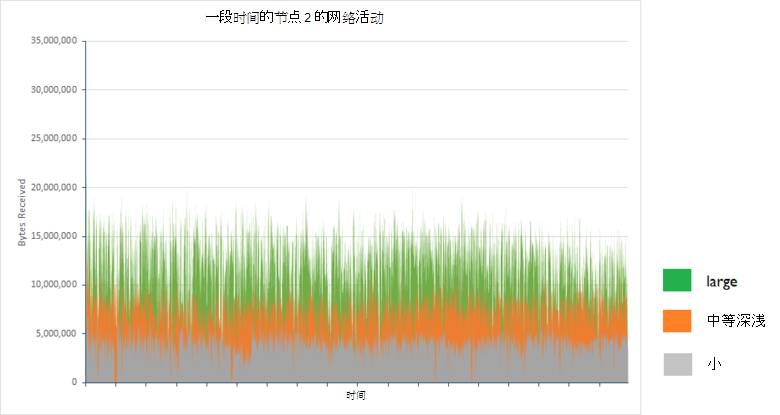

平均每两个小时的时段内每个群集配置中的节点 2 秒接收的字节数如下所示︰

| 配置 | 平均每秒已接收字节数 |
|---------------|--------------------------------------|
| 小         | 3993640.3                            |
| 中等深浅        | 7311689.9                            |
| 大         | 11893874.2                           |

系统在**稳态**运行时进行测试。 在情况下，索引重新平衡或节点恢复过程中，持有主节点和 shards 副本之间的数据传输会产生大量网络通信。 文档[配置的复原和恢复上 Elasticsearch 在 Azure 上][]更介绍这一过程的影响。

### <a name="determining-limiting-factors-cpu-utilization"></a>确定限制因素︰ CPU 利用率

处理请求的速率至少部分地被受可用的处理能力。 Elasticsearch 接受批量插入请求在批量插入队列。 每个节点都有一套大容量插入队列取决于可用处理器的数目。 默认情况下，没有一个针对每个处理器，每个队列可容纳最多 50 个未完成的请求被拒绝，他们将开始之前。 

应用程序应该不会导致队列以 overspill 的速度发送请求。 在任何时候每个队列中的项的数目将客户端应用程序发送请求的速率和检索和处理的 Elasticsearch 这些相同请求的速率的函数。 由于这个原因，一个重要的统计信息捕获错误率汇总在下表中的问题。

| 配置 | 样本总数 | 错误计数  | 错误率 |
|---------------|---------------|--------------|------------|
| 小         | 67057         | 0            | 0.00%      |
| 中等深浅        | 123483        | 1            | 0.0008%    |
| 大         | 200702        | 3617         | 1.8%      |

每个这些错误是由下面的 Java 异常所引起︰

```
org.elasticsearch.action.support.replication.TransportShardReplicationOperationAction$PrimaryPhase$1@75a30c1b]; ]
[219]: index [systembase], type [logs], id [AVEAioKb2TRSNcPa_8YG], message [RemoteTransportException[[esdatavm2][inet[/10.0.1.5:9300]][indices:data/write/bulk[s]]]; nested: EsRejectedExecutionException[rejected execution (queue capacity 50)
```

增加的队列数和/或每个队列的长度可能减少数量的错误，但这种方法只能应对突发的短的持续时间。 这样持续的一系列数据接收任务运行时只需将延迟错误启动发生的位置。 此外，这种更改不会提高吞吐量并根据请求将排队进行再处理之前有可能将损害客户端应用程序的响应时间。

与 1 副本 (在所有 10 个 shards)，导致在一个群集中节点之间的负载适中不平衡 5 shards 的默认索引结构，而另一个节点将包含四个，两个节点将包含三个 shards。 繁忙的节点是最有可能是作为该项限制吞吐量最大，这就是为什么每个用例中已选择此节点。 

下面的一组关系图说明了繁忙在每个群集节点的 CPU 利用率。

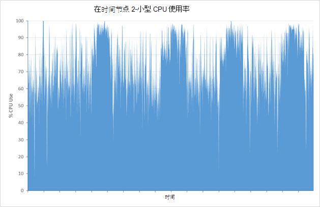

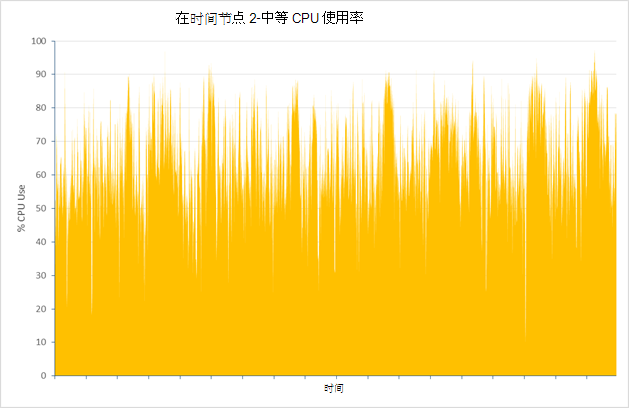

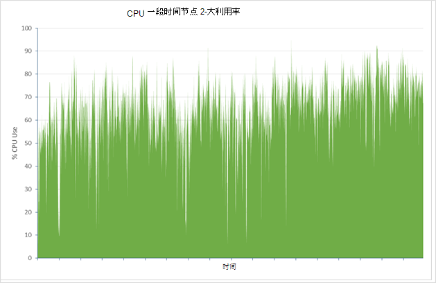

对于小型、 中型和大型群集中，这些节点的 CPU 平均利用率是 75.01%64.93%和 64.64%。 很少没有利用率实际命中 100%，利用率下降为节点和可用的 CPU 电源可用增加的大小。 因此，CPU 电源是不大可能是限制大型群集性能的因素。

### <a name="determining-limiting-factors-memory"></a>确定限制因素︰ 内存

内存使用是可能影响性能的另一个重要方面。 对于测试，Elasticsearch 分配 50%的可用内存。 这是为了符合[记录的建议](https://www.elastic.co/guide/en/elasticsearch/guide/current/heap-sizing.html#_give_half_your_memory_to_lucene)。 运行这些测试，而 JVM 已监视的多余垃圾回收事件 （相对值的堆内存不足）。 在所有情况下，堆大小是稳定和 JVM 表现出低垃圾收集活动。 下面的屏幕快照显示了大型群集上运行测试时，JVM 统计信息的键突出显示在短时间的 Marvel，快照。

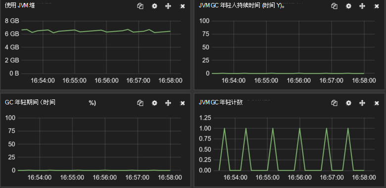

***在大型群集上的 JVM 的内存和垃圾回收活动。***

### <a name="determining-limiting-factors-disk-io-rrates"></a>确定限制因素︰ 磁盘 I/O rRates

在服务器端，可能约束性能剩余的物理特征是磁盘 I/O 子系统的性能。 下图将进行比较以繁忙在每个群集节点写入的字节的磁盘活动。

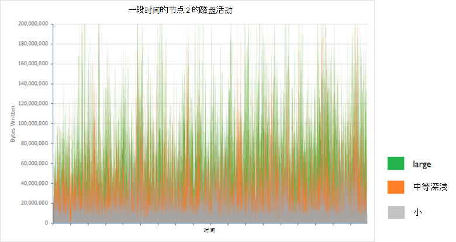 

下表显示了平均每两个小时的时段内每个群集配置中的节点 2 秒写入的字节︰

| 配置 | 写入的字节数/秒的平均数目 |
|---------------|-------------------------------------|
| 小         | 25502361.94                         |
| 中等深浅        | 48856124.5                          |
| 大         | 88137675.46                         |

写入的数据量的增加与群集中，正在处理的请求数，但 I/O 速率位于 Azure 存储的限制 （使用 Azure 存储中创建的磁盘可以支持持续的率 10 到 100 MB/s，这取决于是否使用标准或特优存储）。 检查的时间花费等待磁盘 I/O 有助于解释为什么在磁盘吞吐量还远的理论最大值。 关系图和下表显示这些相同的三个节点的统计信息︰

> [AZURE.NOTE]通过监视 CPU 时间，在此期间的处理器被阻止等待 I/O 操作完成的百分比来测量磁盘等待时间。

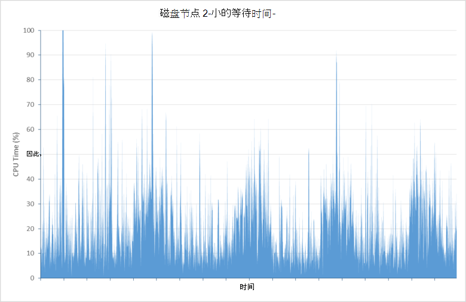

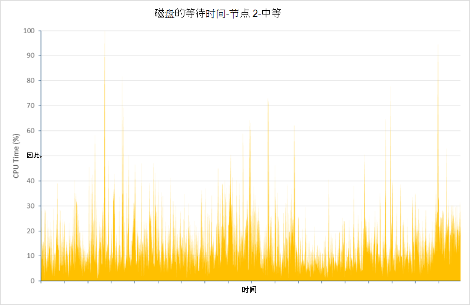

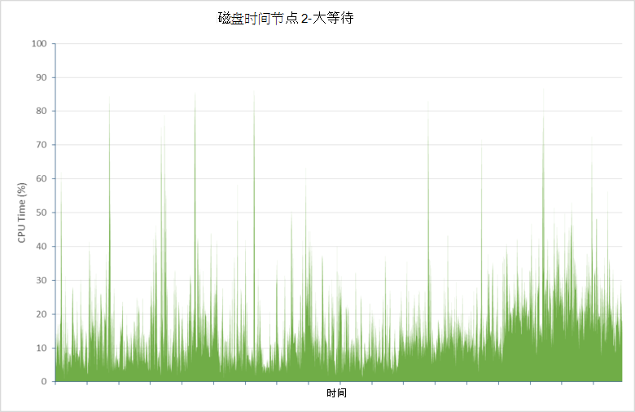

| 配置 | 平均磁盘等待 CPU 时间 （%） |
|---------------|--------------------------------|
| 小         | 21.04                          |
| 中等深浅        | 14.48                          |
| 大         | 15.84                          |

此数据指示等待磁盘 I/O 完成花费的 CPU 时间 （将近 16%和 21%） 之间大比例。 这限制 Elasticsearch 处理请求和存储数据的能力。

在测试运行时，超过**5 100 万个文档**插入大群集。 允许继续测试结果表明，等待时间显著增加时数据库包含六一百多万的文档。 这种现象的原因调查不完全，但可能由于磁盘碎片导致增加的磁盘滞后时间。 

增加在多个节点上的群集大小可能有助于缓解这种现象的影响。 在极端情况下可能需要进行碎片整理的磁盘，显示的过多的 I/O 时间。 但是，对较大的磁盘进行碎片整理可能需要花费相当长的时间 (可能是 48 小时以上为 2 TB VHD 驱动器），并且只需重新格式化驱动器并允许 Elasticsearch 从 shards 复制副本恢复丢失的数据可能是一个更经济的方法。

### <a name="addressing-disk-latency-issues"></a>解决磁盘延迟问题

最初使用 Vm 配置标准的磁盘进行测试。 标准的磁盘基于旋转介质，因此受到旋转延迟时间和其他可以限制 I/O 速率的瓶颈。 Azure 还提供高级存储在其中使用 SSD 设备创建的磁盘。 这些设备没有旋转延迟，因此应提供改进了的 I/O 的速度。 

下表比较结果的标准磁盘替换优质大型群集中的磁盘 （大型群集中的标准 D4 虚拟机已被替换标准 DS4 虚拟机; 的内核、 内存和磁盘数是相同的两种情况下，唯一的区别在于 DS4 Vm 使用 SSDs）。

| 配置    | 样本数 | 平均响应时间 （毫秒） | 吞吐量 （操作/秒） |
|------------------|--------------|----------------------------|---------------------------|
| 大-标准 | 197085       | 839                        | 27.4                      |
| 大-特优  | 255985       | 581                        | 35.6                      |

响应时间明显更好，从而导致更接近的平均吞吐量为 4 x 的较小群集。 这是更加符合标准的 DS4 VM 上的可用资源。 平均 CPU 利用率的繁忙节点群集 （在此情况下节点 1） 中根据其花费较少时间来等待 I/O 完成增加︰

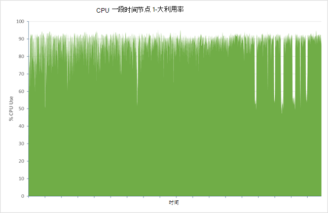

请考虑下图，它显示了，繁忙的节点，此统计信息删除为大约 1%平均显而易见磁盘等待时间的减少︰

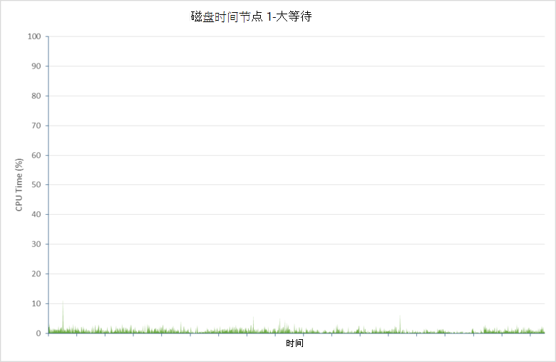

没有此改进的方面，但是付出代价。 接收错误增加 10 到 35797 （12.3%) 的比例数。 再次，这些错误中的大多数都是批量的结果插入队列溢出。 考虑到硬件现在看来接近容量运行，可能需要添加更多节点或重新调节的批量插入，以减少错误的卷的速率。 在本文档的后面部分将讨论这些问题。

### <a name="testing-with-ephemeral-storage"></a>使用临时存储测试

在群集上的 D4 Vm 使用临时存储重复相同的测试。 在 D4 Vm 暂时存储作为单个 400 GB SSD。 样本处理、 响应时间和吞吐量的数目已报告的最优存储与基于 DS14 虚拟机群集的数字全都非常相似。

| 配置                     | 样本数 | 平均响应时间 （毫秒） | 吞吐量 （操作/秒） |
|-----------------------------------|--------------|----------------------------|---------------------------|
| 大-特优                   | 255985       | 581                        | 35.6                      |
| 大 – 标准 （临时磁盘） | 255626       | 585                        | 35.5                      |

错误率也是类似 （33862 故障超出 289488 请求总计 – 11.7%）。

下面的关系图显示的 CPU 利用率和磁盘等待繁忙 （节点 2 这次） 群集中节点的统计信息︰

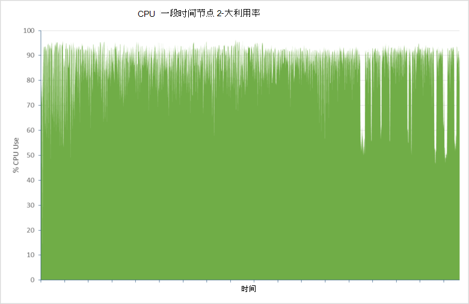

![] (media/guidance-elasticsearch/data-ingestion-image13.png

在这种情况下，就性能而言，使用临时存储可能被视为比使用高级存储更加经济高效的解决方案。

### <a name="data-ingestion-performance--windows-server-2012"></a>数据接收性能 – Windows Server 2012

使用一组 Elasticsearch 群集节点运行 Windows Server 2012 重复相同的测试。 这些测试的目的是操作系统的要建立何种效果，如果有的话，选择上可能有的群集性能。

为了说明 Elasticsearch 在 Windows 上的可扩展性下, 表显示了对于小型、 中型和大型群集配置实现的吞吐量和响应时间。 请注意，这些测试全部执行了与 Elasticsearch 配置为使用 SSD 暂时存储，如与 Ubuntu 的测试已显示磁盘滞后时间是可能是实现最高性能的关键因素︰

| 配置 | 样本数 | 平均响应时间 （毫秒） | 吞吐量 （操作/秒） |
|---------------|--------------|----------------------------|---------------------------|
| 小         | 90295        | 476                        | 12.5                      |
| 中等深浅        | 169243       | 508                        | 23.5                      |
| 大         | 257115       | 613                        | 35.6                      |

这些结果表明 Elasticsearch 随着 VM 大小和 Windows 上的可用资源。

下表比较大的 Ubuntu 和 Windows 群集的结果︰

| 操作系统 | 样本数 | 平均响应时间 （毫秒） | 吞吐量 （操作/秒） | 错误比率 （%） |
|------------------|--------------|----------------------------|---------------------------|----------------|
| Ubuntu           | 255626       | 585                        | 35.5                      | 11.7           |
| 窗口          | 257115       | 613                        | 35.6                      | 7.2            |

吞吐量是对于大型的 Ubuntu 群集，一致，但响应时间是略高。 这可以通过较低的错误率入账 （错误报告比成功操作更快，因此有较低的响应时间）。

Ubuntu 的略微高于由 Windows 监视工具报告的 CPU 利用率。 但是，您应当直接比较的度量，例如这些跨操作系统小心因为不同的操作系统报告这些统计信息。 此外，像 Ubuntu 的 CPU 时间等待 I/O 的磁盘延迟的信息不可用相同的方式。 重要的一点是，CPU 使用率很高，表明所用的等待 I/O 的时间，不足︰

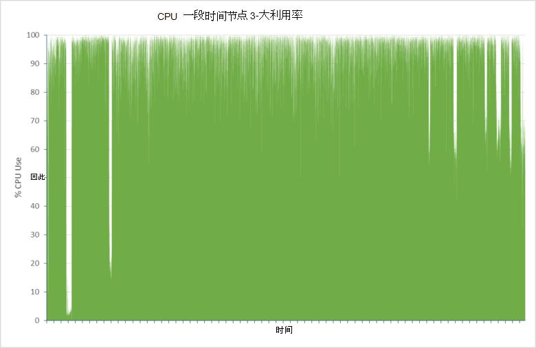

### <a name="scaling-up-conclusions"></a>向上扩展︰ 结论

一个经过良好优化群集的 Elasticsearch 性能很可能是同等窗口和 Ubuntu，并且，它扩展成类似的模式，在这两个操作系统中。 为了获得最佳性能，**使用高级存储用于保存 Elasticsearch 数据**。

## <a name="scaling-out-clusters-to-support-large-scale-data-ingestion"></a>横向扩展群集，以支持大规模数据提取

横向扩展到纵深调查上一节中的方法免费赠送。 Elasticsearch 的一个重要功能是内置于软件的固有水平可伸缩性。 只需添加更多节点是提高群集的大小。 您不需要执行任何手动操作来重新分配的索引或作为这些任务的 shards 自动处理，尽管有大量的配置选项可供您可以使用来影响这一过程。 

添加更多节点可帮助通过将负载分散到多个机器来提高性能。 添加多个节点时，您可能还需要考虑重建索引数据增加的 shards 可用数量。 您可以通过创建具有多个 shards 最初是可用节点的索引抢占这一过程在某种程度上。 当进一步添加节点时，可以分发 shards。

除了利用 Elasticsearch 的水平可伸缩性，还有实现索引包含多个节点比 shards 的其他原因。 每个 shard 实施时是作为一个单独的数据结构 （ [Lucene](https://lucene.apache.org/)索引），并有自己保持一致性，以及处理并发的内部机制。 创建多个 shards 有助于提高在节点内的并行性，可以提高性能。 

但是，维护性能，同时扩展是一种平衡措施。 更多的节点和群集包含的 shards，更多的工作都需要同步执行群集，可以降低吞吐量的工作。 对于任何给定的工作负荷，没有最大化的同时最小化的维护开销的接收性能是最佳配置。 这种配置非常依赖的本质工作负荷和该群集。具体来说，数量、 大小和内容的文档、 摄取发生率和系统在其运行的硬件。  

本节概述了确定群集用来支持由前面所述的性能测试的工作量的大小到调查的结果。 与基于大 VM 大小 (标准 D4 8 CPU 内核、 16 个数据磁盘，和 28 GB 的 RAM) 运行的虚拟机群集上执行相同的测试 Ubuntu Linux 14.0.4，但配置的不同数量的节点和 shards。 结果不是权威，它们仅适用于一个特定的方案，但它们可以作为很好的起始点来帮助您分析您群集的水平可伸缩性和生成编号的最佳比率的 shards 为最好地满足自己需要的节点。

### <a name="baseline-results--3-nodes"></a>比较基准结果 – 3 个节点

若要获取基准图，数据接收性能测试运行针对有 5 shards 和 1 副本 3 节点的群集。 这是 Elasticsearch 索引的默认配置。 在此配置中，Elasticsearch 将分配到的节点，2 2 主 shards，其余主要 shard 存储在第三个节点上。 下表总结了的吞吐量，以每秒大容量接收操作和测试成功存储的文档的数目。

> [AZURE.NOTE] 在表中，请按照本部分中，主要的 shards 的分布显示为以短划线分隔的每个节点的编号。 例如，5 shard 3 节点布局被描述为 2-2-1。 不包括布局的副本 shards。 他们将主要 shards 按照类似的方案。

| 配置 | 文档计数 | 吞吐量 （操作/秒）   | Shard 布局 |
|---------------|----------------|-----------------------------|--------------|
| 5 shards      | 200560412      | 27.86                       | 2-2-1        |

### <a name="6-node-results"></a>6 节点的结果

在一个 6 节点的群集上重复该测试。 这些测试的目的是尝试并确定更精确地在一个节点上存储多个 shard 的效果。

| 配置 | 文档计数 | 吞吐量 （操作/秒）   | Shard 布局 |
|---------------|----------------|-----------------------------|--------------|
| 4 shards      | 227360412      | 31.58                       | 1-1-0-1-1-0  |
| 7 shards      | 268013252      | 37.22                       | 2-1-1-1-1-1  |
| 10 shards     | 258065854      | 35.84                       | 1-2-2-2-1-2  |
| 11 shards     | 279788157      | 38.86                       | 2-2-2-1-2-2  |
| 12 shards     | 257628504      | 35.78                       | 2-2-2-2-2-2  |
| 13 shards     | 300126822      | 41.68                       | 2-2-2-2-2-3  |

这些结果显示用于表示了以下趋势︰

* 每个节点的多个 shards 提高了吞吐量。 Shards 每个为这些测试创建的节点数量少，这种现象应该出现，前面所述的原因。

* 奇数个 shards 提供更好的性能比为偶数。 原因为更少的清除，但它有*可能*是 Elasticsearch 使用的路由算法更好地为能够在这种情况下，将数据分发跨 shards 通向更为均匀负载每个节点。

若要测试这些假设，有了更多的 shards 执行若干进一步的测试。 在 Elasticsearch 的建议，时间决定为每个测试使用 shards 质数，随着这些问题的范围为奇数的合理分布。

| 配置 | 文档计数 | 吞吐量 （操作/秒）   | Shard 布局      |
|---------------|----------------|-----------------------------|-------------------|
| 23 shards     | 312844185      | 43.45                       | 4-4-4-3-4-4       |
| 31 shards     | 309930777      | 43.05                       | 5-5-5-5-6-5       |
| 43 shards     | 316357076      | 43.94                       | 8-7-7-7-7-7       |
| 61 shards     | 305072556      | 42.37                       | 10-11-10-10-10-10 |
| 91 shards     | 291073519      | 40.43                       | 15-15-16-15-15-15 |
| 119 shards    | 273596325      | 38.00                       | 20-20-20-20-20-19 |

这些结果建议在大约 23 shards 达到了一个引爆点。 此后，增加了 shards 引起的小的下降 （43 shards 的吞吐量可能是罕见） 的性能。

### <a name="9-node-results"></a>9 节点结果

测试使用的群集的 9 节点，使用 shards 质数再次重复。

| 配置 | 文档计数 | 吞吐量 （操作/秒）   | Shard 布局               |
|---------------|----------------|-----------------------------|----------------------------|
| 17 shards     | 325165364      | 45.16                       | 2-2-2-2-2-2-2-2-1          |
| 19 shards     | 331272619      | 46.01                       | 2-2-2-2-2-2-2-2-3          |
| 29 shards     | 349682551      | 48.57                       | 3-3-3-4-3-3-3-4-3          |
| 37 shards     | 352764546      | 49.00                       | 4-4-4-4-4-4-4-4-5          |
| 47 shards     | 343684074      | 47.73                       | 5-5-5-6-5-5-5-6-5          |
| 89 shards     | 336248667      | 46.70                       | 10-10-10-10-10-10-10-10-9  |
| 181 shards    | 297919131      | 41.38                       | 20-20-20-20-20-20-20-20-21 |

这些结果表明，大约 37 shards 类似的模式，与一个引爆点。

### <a name="scaling-out-conclusions"></a>横向缩放︰ 结论

使用粗糙的外推，6 节点和 9 节点测试的结果表明，对于此特定的方案，shards 以获取最佳性能的理想数目 4n + /-1，其中 n 是节点数。 这*可能*是批量插入线程可用，数的函数反过来即依赖的 CPU 内核的数量正在，如下所示 （请参阅详细信息[多文档模式](https://www.elastic.co/guide/en/elasticsearch/guide/current/distrib-multi-doc.html#distrib-multi-doc)） 的基本原理︰

- 客户端应用程序发送每个批量插入请求接收一个数据节点。

- 数据节点生成受原始请求的每个主 shard 新批量插入请求并将它们转发到其他节点，并行。

- 写入时每个主要的 shard，另一个请求发给该 shard 每个复制副本。 主要的 shard 等待请求发送到副本中，完成后才能完成。

默认情况下，Elasticsearch 在虚拟机中创建每个可用的 CPU 内核的一个大容量插入的线程。 对于此测试使用的 D4 虚拟机，每个 CPU 包含 8 核，因此 8 大容量插入创建线程。 使用索引跨越 4 （在某种情况下 5） 主 shards 在每个节点上，但是还没有 4 (5) 上的每个节点的副本。 将数据插入到这些 shards 和副本可以使用最多 8 个线程在每个请求，匹配的可用数量的每个节点上。 增加或减少的 shards 可能会导致线程处理效率低下，线程可能处于未占用或请求进行排队。 然而，没有进一步试验这就不仅仅是理论并不能被明确。

测试还显示了其他重要的一点。 在这种情况下，增加节点数可以提高数据接收吞吐量，但结果做不一定是成线性比例。 进行进一步测试，与 12 和 15 节点群集可能会显示该点处的扩张带来了很少的另一个好处。 如果此数目的节点提供了足够的存储空间，它可能需要返回到战略增容并开始使用基于最优存储更多或更大的磁盘。

> [AZURE.IMPORTANT] 作为将始终为每个群集工作的神奇公式不会比 4n + /-1。 如果您有较少或多个可用的 CPU 内核，最佳 shard 配置可以不同。 研究结果基于只有未数据提取特定工作负载。 对于工作负载，还包括多种查询和聚合结果可能是非常多样化。

> 此外，数据接收工作负载使用单个索引。 在许多情况下，数据很可能分布在多个索引，从而导致不同的模式或资源使用。

> 在本练习中重要的一点是要理解而不是结果中获得所使用的方法。 您应准备执行自己的可扩展性评估，根据自己工作负载，以获得最适合于自己情况的信息。

## <a name="tuning-large-scale-data-ingestion"></a>优化的大型数据接收

Elasticsearch 是高度可配置的许多开关和可用于优化性能的特定用例和方案的设置。 本部分介绍一些常见示例。 请注意，Elasticsearch 在这方面提供了灵活性也有一个警告，它是非常简单，detune Elasticsearch，使性能更糟糕的是。 当调整，仅进行一个更改一次，并且始终衡量任何更改以确保它们没有对您的系统造成不利影响的效果。

### <a name="optimizing-resources-for-indexing-operations"></a>优化索引操作的资源

下面的列表描述时应考虑的一些点优化以支持大规模数据摄取 Elasticsearch 群集。 前两项是最可能会对性能产生明显影响，而其余部分则更差，取决于工作负荷︰

*  仅刷新索引时就可以看到搜索索引中添加新文档。 刷新索引是代价高昂的操作，因此它仅定期执行而不是为每个文档创建。 默认刷新间隔是 1 秒。 如果您正在执行批量操作，则应考虑暂时禁用索引刷新。 设置索引*刷新\_间隔*为-1。

    ```http
    PUT /my_busy_index
    {
        "settings" : {
            "refresh_interval": -1
        }
    }
    ```

    通过使用手动触发刷新[*\_刷新*](https://www.elastic.co/guide/en/elasticsearch/reference/current/indices-refresh.html)结尾的操作的 API，以使数据显示。 [批量索引用法](https://www.elastic.co/guide/en/elasticsearch/reference/current/indices-update-settings.html#bulk)的详细信息，请参见 [更改数据提取上的刷新间隔的影响](#the-impact-of-changing-the-index-refresh-interval-on-data-ingestion-performance)的更多详细信息将稍后介绍。

* 如果复制索引，每个索引操作 (文档创建、 更新或删除) 发生在主 shard 上副本 shards 重复。 请考虑禁用批量导入操作期间进行复制并导入完成后重新启用它︰

    ```http
    PUT /my_busy_index
    {
        "settings" : {
            "number_of_replicas": 0
        }
    }
    ```

    当您重新启用复制时，Elasticsearch 会执行字节的网络传输的数据从索引到每个副本中。 这是比重复索引过程文档的文档的每个节点上效率更高。 风险是，数据可能会丢失主节点出现故障时执行批量导入，但恢复可能只是一种重新开始导入。 [复制数据接收性能的影响](#the-impact-of-replicas-on-data-ingestion-performance)稍后更详细地介绍。

* Elasticsearch 尝试平衡所需的查询和所需的接收数据之间的可用资源。 因此，它可能会调节数据摄取性能 （Elasticsearch 日志中将记录限制事件）。 此限制被为了防止大量的同时创建的索引段，其中要求合并并保存到磁盘，可以独占资源的进程。 如果您的系统不当前正在执行查询，则可以禁用数据接收带宽限制。 这样，索引以获得最佳性能。 您可以禁用带宽限制为整个群集，如下所示︰

    ```http
    PUT /_cluster/settings
    {
        "transient" : {
            "indices.store.throttle.type": "none"
        }
    }
    ```

    完成接收后，群集的限制类型设置回*"合并"* 。 此外请注意，禁用带宽限制功能可能会导致不稳定，在群集中，因此确保在必要时可以恢复群集的地方，有过程。

* Elasticsearch 保留索引操作的堆内存的比例，其余部分主要是由查询和搜索。 这些缓冲区的目的是为了减少磁盘 I/O 操作，旨在执行更少的、 更大的写操作超过更多、 更小的写入数。 分配的堆内存的默认比例为 10%。 如果大量的数据进行索引此值可能不够。 为支持高容量数据接收系统，应允许的节点中的每个活动 shard 的内存为 512 MB。 例如，如果在 D4 Vm (28 GB RAM) 上运行 Elasticsearch，都分配给 JVM (14 GB) 的可用内存的 50%，则 1.4 g B 将可用于创建索引操作。 如果一个节点包含 3 活动 shards，然后此配置可能已足够。 但是，如果节点包含比这多个 shards，可考虑增加的值*indices.memory.index\_缓冲区\_大小*elasticsearch.yml 配置文件中的参数。 有关详细信息，请参阅[Elasticsearch 索引的性能注意事项](https://www.elastic.co/blog/performance-considerations-elasticsearch-indexing)。

    分配更不是每个活动的 shard 的 512 MB 不很可能会提高索引性能，实际上可能是有害的因为较少的内存是可用于执行其他任务。 此外请注意，为索引缓冲区分配更多堆空间用于其他操作，如搜索和聚合数据的内存中删除，可能会降低查询操作的性能。

* Elasticsearch 将限制 （默认值是 8） 可以在 shard 中同时执行索引操作的线程数。 如果一个节点只包含少量的 shards，然后考虑增加*索引\_并发*设置受到大量的索引操作，或目标的批量插入，索引，如下所示︰

    ```http
    PUT /my_busy_index
    {
        "settings" : {
            "index_concurrency": 20
        }
    }
    ```

* 如果您正在执行大量的短时间内的索引和大容量操作，可以提高*索引*和*大容量*可用线程池中的线程的数目并扩展*大容量插入*队列中的每个数据节点的大小。 这将允许更多的请求进行排队，而不是被丢弃。 有关详细信息，请参阅[线程池](https://www.elastic.co/guide/en/elasticsearch/reference/current/modules-threadpool.html)。 如果正在执行持续高层次的数据提取，则建议不要再增加批量线程数。 而是创建额外的节点，并使用分片索引负载分布到这些节点。 或者，考虑连续发送批量插入批而不是同时起作用可以降低由于批量的错误的可能性的自然调节机制，这为插入队列溢出。

### <a name="the-impact-of-changing-the-index-refresh-interval-on-data-ingestion-performance"></a>更改索引的影响刷新间隔内的数据接收性能

刷新间隔控制 ingested 的数据变为可见到查询和聚合速率，但频繁地执行刷新可能会影响数据接收操作的性能。 默认刷新间隔是 1 秒。 您可以禁用刷新完全，但这可能不是适合您的工作负载。 您可以通过尝试不同的时间间隔并建立平衡的需要，提供最新信息的接收性能最擅长的领域中进行试验。

影响例如，在数据接收性能测试包含分布在 3 个数据节点的 7 shards Elasticsearch 群集上重复。 索引有一个副本。 每个数据节点基于 D4 VM (28 GB RAM，8 处理器内核) 使用 SSD 支持临时存储来保存数据。 每个测试运行 1 小时。

在此测试中，刷新率设置为默认值为 1 秒。 下表显示了与单独运行该测试的吞吐量和响应时间的刷新率，减少到每 30 秒一次。

| 刷新率 | 样本数 | 平均响应时间 – 成功操作 （毫秒） | 吞吐量 — 成功操作 （操作/秒） |
|--------------|--------------|----------------------------------------------------|---------------------------------------------------|
| 1 秒     | 93755        | 460                                                | 26.0                                              |
| 30 秒   | 117758       | 365                                                | 销售额的 32.7                                              |

在此测试中，除去刷新率会导致吞吐量，提高 18%和 21%的平均响应时间减少。 使用 Marvel 生成以下关系图说明了这种差异的主要原因。 下图显示的索引合并活动的发生与刷新间隔设置为 1 秒和 30 秒。 

执行索引合并以防止变得太多的内存中索引段数。 刷新时间间隔生成大量的小型段具有通常情况下，合并而 30 秒刷新间隔 1 秒生成更少的大段可以更好合并。

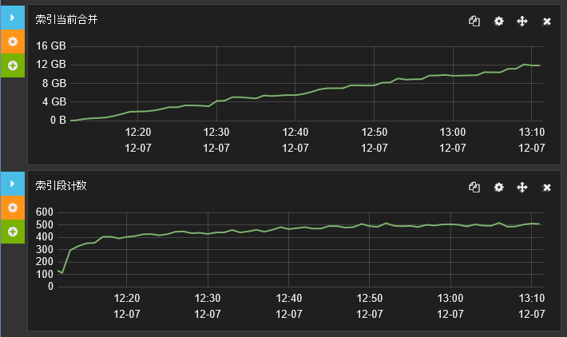

***索引为 1 的第二个索引刷新率的的合并活动***

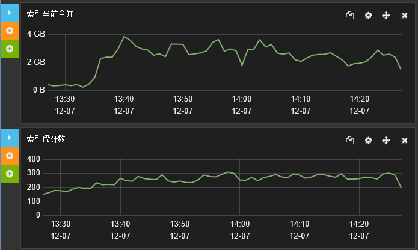

***索引索引刷新率为 30 秒的合并活动***

### <a name="the-impact-of-replicas-on-data-ingestion-performance"></a>复制副本数据的接收性能的影响

复制副本是基本功能的任何弹性群集和不使用这些风险如果某个节点发生故障而丢失的信息。 但是，副本增加的磁盘和网络 I/O 正在执行，并可能会破坏的 ingested 数据的速率。 由于上文所述的原因，可能是有益的大规模数据上载操作的持续时间内暂时禁用复制副本。

数据接收性能测试重复使用三种配置︰

* 群集使用的复制副本。

* 与 1 副本使用群集。

* 一个群集中使用 2 的副本。

在所有情况下，群集包含 7 shards 分布在 3 个节点，并在前一组测试中所述配置的虚拟机上运行。 测试索引用于刷新间隔为 30 秒。

响应时间和吞吐量是每个测试的比较，总结了下表︰

| 配置 | 样本数 | 平均响应时间 – 成功操作 （毫秒） | 吞吐量 — 成功操作 （操作/秒） | 数据接收错误 |
|---------------|--------------|----------------------------------------------------|---------------------------------------------------|--------------------------|
| 0 的副本    | 215451       | 200                                                | 59.8                                              | 0                        |
| 1 副本     | 117758       | 365                                                | 销售额的 32.7                                              | 0                        |
| 2 复制副本    | 94218        | 453                                                | 26.1                                              | 194262                   |


性能随着数量的复制副本的增加呈下降趋势是清晰的但还应注意到大量的第三个测试中的数据接收错误。 由这些错误生成的消息指出，他们由于批量插入队列溢出导致请求被拒绝。 这些拒绝很快发生，这就是为什么数量很大。

> [AZURE.NOTE] 第三个测试的结果突出显示此瞬态错误发生时使用智能重试策略的重要性 — — 回来短时间内允许批量插入队列以耗尽之前尝试重复执行大容量插入操作。

关系图的下一集将在测试过程中的响应时间进行比较。 在每种情况下第一幅图表显示了整体的响应时间，同时第二个图形放大速度最快的操作 （请注意，第一个图形的比例是十倍，第二个） 的响应时间。 您可以看到响应时间的配置文件在三项测试的改变方式。

与没有副本，大多数操作采用 75ms年和 750ms，用最快的响应时间约 25ms年之间︰


与 1 副本最填充操作的响应时间是 125ms年到 1250ms 范围内。 最快的响应时间约 75ms，虽然比在 0 的副本的情况下这些快速响应的数量也减少。 还有更多时间明显长于最常见的情况下，超过 1250ms 的响应︰

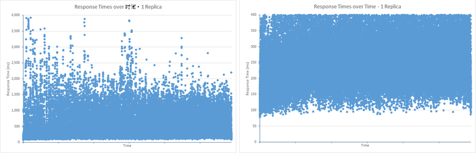

与 2 副本，最填充的响应时间范围 200 毫秒到 1500ms，但数量少得多结果低于比 1 副本测试中的最小范围。 不过，上面的上限值的结果的模式都十分相似，1 副本测试。 这很可能是由于批量插入队列溢出 （超过 50 次请求队列长度） 的效果。 额外的工作，维护所需 2 副本会导致队列溢出更加频繁，导致无法接收操作，不用过多的响应时间。 操作被迅速拒绝而不是采取较长时间内，可能导致超时异常或影响 （这是批量插入队列机制的目的） 的客户端应用程序的响应能力︰


使用 Marvel，可以看到在批量索引队列中复制副本的数量的影响。 下图描述了如何批量插入队列已满在测试期间的 Marvel 从显示的数据。 因此它溢出和请求被拒绝了周围 40 个请求，但引起的周期性爆发平均队列长度︰

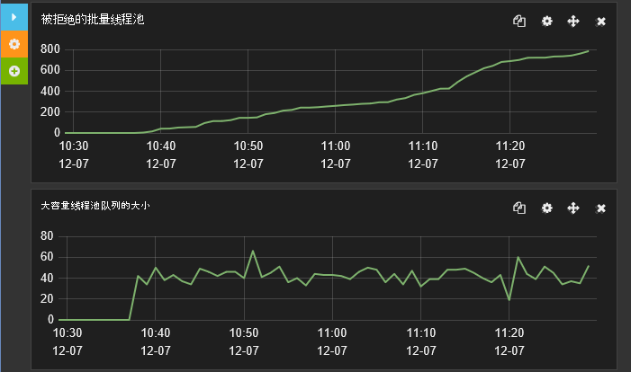

***批量索引队列大小和 2 副本与拒绝的请求数。***

您应与下图显示单个副本的结果加以比较。 Elasticsearch 引擎无法足够快地处理请求以将平均队列长度保持在大约 25，并且没有一点没有队列长度超过 50 次请求因此被拒绝，没有工作。

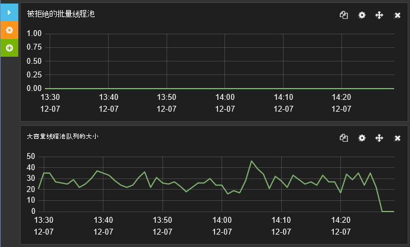

***批量索引队列大小和 1 副本与拒绝的请求数。***

## <a name="best-practices-for-clients-sending-data-to-elasticsearch"></a>客户端将数据发送到 Elasticsearch 的最佳做法

许多方面的性能的时候，不仅在系统内部，而且与客户端应用程序使用系统的方式。 Elasticsearch 提供了许多功能，可以利用数据摄取过程;生成的文档的唯一标识符，执行文档分析，即使使用脚本转换数据存储是一些示例。 但是，所有添加到负载上的 Elasticsearch 引擎，并且在许多情况下这些函数可以更有效地执行客户端应用程序在发送前通过。 

> [AZURE.NOTE] 此列表中的最佳做法主要是靠接收新数据而不修改现有数据已存储在索引中。 接收工作负载执行追加操作由 Elasticsearch，如而删除/附加操作以进行数据修改。 这是因为索引中的文档是不可变的因此涉及到修改的文档用新版本替换整个文档。 既可以将 HTTP 请求来覆盖现有文档，也可以使用 Elasticsearch*更新*API 用于提取查询以提取现有文档、 合并所做的更改，然后执行 PUT 新文档存储。

此外，考虑在适当情况下实施下列做法︰

* 禁用不需要进行分析的索引字段的文本分析。 分析涉及将拆分为标记文本，以便可以搜索特定条件的查询。 但是，它可以是一项 CPU 密集型任务，因此应有所选择。 如果使用 Elasticsearch 来存储日志数据，可能有助于标记化操作的详细的日志消息，以允许进行复杂的搜索。 其他字段，如那些包含错误代码或标识符可能不应标记 （频率是您可能要求的所有消息的详细信息的错误代码包含"3"，example?） 以下代码禁用*systembase*索引的*日志*类型中的*名称*和*hostip*字段的分析。

    ```http
    PUT /systembase
    {
        "settings" : {
            ...
        },
        "logs" : {
            ...
            "name": {
                "type": "string",
                "index" : "not_analyzed"
            },
            "hostip": {
                "type": "string",
                "index" : "not_analyzed"
            },
            ...
        }
    }
    ```

* 如果不需要，请禁用的*_all*字段的索引。 *\_所有*字段连接分析和编制索引的文档中的其他字段的值。 它可用于执行可以针对文档中的任何字段匹配的查询。 如果客户端需要与命名字段匹配，然后启用*\_所有*只会招致 CPU 和存储开销。 下面的示例演示如何禁用*\_所有* *systembase*索引中的*日志*类型字段。

    ```http
    PUT /systembase
    {
        "settings" : {
            ...
        },
        "logs" : {
            "_all": {
                "enabled" : false
            },
            ...,
        ...
        }
    }
    ```

    请注意，您可以创建选择性版本的*\_所有*，其中只包含来自特定字段的信息。 有关详细信息，请参阅[禁用\_所有字段](https://www.elastic.co/guide/en/elasticsearch/reference/current/mapping-all-field.html#disabling-all-field)。

* 避免在索引中的动态映射。 动态映射功能很强大，但是将新字段添加到现有索引需要协调跨节点的索引结构的更改，因此会暂时要锁定的索引。 如果不仔细使用，则动态映射也会导致爆炸式的字段数和后续索引元数据的卷。 反过来，这会导致更高的存储要求和 I/O，用于接收数据并在执行查询时。 这些问题会影响性能。 请考虑禁用动态映射和显式定义索引结构。 有关详细信息，请参阅[动态字段映射](https://www.elastic.co/guide/en/elasticsearch/reference/current/dynamic-field-mapping.html#dynamic-field-mapping)。

* 了解如何平衡负载，以满足相互冲突的要求。 应该总是考虑数据接收，可以其他并行操作，如用户执行的查询的性能有很大的影响。 数据摄取可能会激增，并流入如果系统尝试使用立即到达的所有数据可能会导致查询速度减慢到连续。 Elasticsearch 试图防止这种情况发生，通过控制它将处理速度接收请求通过批量插入队列 （请参阅详细信息部分[确定限制因素 – CPU 利用率](#determining-limiting-factors-cpu-utilization)），但这种机制确实应视为最后的手段。 如果您的应用程序代码未准备好处理拒绝请求丢失数据的风险。 相反，考虑使用如[基于队列的负载 Levelling](https://msdn.microsoft.com/library/dn589783.aspx)模式来控制数据被传递给 Elasticsearch 的速率。

* 确保您的群集具有足够的资源来处理工作负荷，尤其是索引配置了多个副本。

* 使用批量插入 API 来上载大型批次文档。 批量大小适当请求。 有时大批量不是更好的性能，并且 Elasticsearch 线程和其他资源以超载，会导致延迟其他并发操作。 大容量插入批处理中的文档执行操作时协调节点时，内存中保存。 每个批次的物理大小是文档数比更重要。 尽管 Elasticsearch 文档推荐使用 5 MB 和 15 MB 之间，作为起始点进行自己的调查，关于什么构成理想的批数据的大小，没有硬性的规则。 运行性能测试以建立自己的方案和工作负荷组合的最佳批处理大小。

* 请确保大容量插入请求将分布在节点而不是定向到单个节点。 将定向到单个节点的所有请求可能导致内存耗尽，因为处理每个批量插入请求存储在内存中该节点。 根据请求将被重定向到其他节点，它还可以提高网络延迟。

* Elasticsearch 使用包含大部分的主站点和复制副本的节点写入数据时的仲裁。 直到仲裁报告成功的写操作未完成。 这种方法有助于确保数据未写入多数节点是否由于网络分区 （失败） 事件而无法使用。 使用仲裁会降低写操作的性能。 *一致性*参数设置为*一个*写入数据时，您可以禁用基于仲裁的书写。 下面的示例添加一个新的文档，但完成一旦主 shard 写入已完成。

    ```http
    PUT /my_index/my_data/104?consistency=one
    {
        "name": "Bert",
        "age": 23
    }
    ```

    请注意，与异步复制，禁用基于仲裁的写作可能导致不一致的情况之间主要的 shard 和每个复制副本。

* 当使用仲裁，Elasticsearch 将等待，如果没有足够的节点确定应写入操作被取消，因为不能达到一个仲裁之前可用。 （默认值为 1 分钟） 的超时查询参数取决于此等待时间。 您可以通过使用查询超时参数来修改此设置。 下面的示例新建一篇文档，并等待 5 秒钟，以响应取消之前仲裁最多︰

    ```http
    PUT /my_index/my_data/104?timeout=5s
    {
        "name": "Sid",
        "age": 27
    }
    ```

    Elasticsearch 还允许您使用[外部生成](https://www.elastic.co/guide/en/elasticsearch/reference/current/docs-index_.html#_version_types)您自己版本编号。

* 请考虑禁用*\_源*字段的索引。 此字段包含存储的文档时所使用的原始 JSON 文档的一个副本。 保存此字段，将造成额外的存储成本和磁盘 I/O。 但是，这些成本可能是边际根据文档结构，并且还应注意，禁用*\_源*字段可防止客户端能够执行以下操作︰

    * 使用更新的 API 来修改文档。
    * 上飞的突出，在运行查询时执行。
    * 重建索引数据。
    * 通过查看原始文档中调试查询和聚合。

    下面的示例禁用*\_源* *systembase*索引中的*日志*类型字段。

  ```http
  PUT /systembase
  {
        "settings" : {
            ...
        },
        "logs" : {
            "_source": {
                "enabled": false
            },
            ...,
        ...
        }
  }
  ```

## <a name="general-guidelines-for-conducting-data-ingestion-performance-testing-with-elasticsearch"></a>为进行数据接收性能测试与 Elasticsearch 的一般原则

以下几点侧重一些项目应考虑何时运行性能测试与 Elasticsearch 和分析结果。

* 性能测试是一定耗时且成本高昂。 至少，收集统计测量磁盘和网络、 CPU 利用率、 CPU 等待时间和磁盘延迟 （如果可能） 的传输速率。 这可以为您提供快速反馈上测试工作具有很好的投资回报。

* 利用任何脚本提供的功能负载测试工具来收集指标，否则可能无效。 例如，Linux 具有各种使用*iostat* *vmstat*等实用程序，您可以收集的可靠的性能统计数据。 您可以使用脚本使用 JMeter 作为测试计划的一部分捕获此数据。

* 性能工程主要是指基于可靠且可重复的数据的统计分析。 不要停止在高级别指标，不会给出必要的见解。 让自己的数据并进行工程开发运营进程有一个快速的反馈循环的性能。 始终查看趋势和过去的结果配置进行比较的统计数据。 通过定期将生成数据，您将了解执行此操作，是可重复的与您的工作负载，以及它可以评估在配置和部署更改的效果。

* Marvel 之类的工具用于监视群集和节点的性能，同时测试，以获得更多的见解。 JMeter 能够有效地捕获原始数据，为后续的分析，但使用 Marvel 可以为您提供实时的感受性能如何进展和可能的故障原因，并减慢速度列表。 此外，多个负载测试工具不提供 Elasticsearch 的内部指标的可见性。 使用并比较索引的吞吐率、 合并段计数、 垃圾回收器 (GC) 统计和合并索引的统计信息中的可用时间。 重复此定期进行分析。

* 将负载测试工具统计与 Marvel （磁盘和网络流量、 CPU 利用率、 内存和线程池使用情况），以了解相关模式之间的基础结构和特定的 Elasticsearch 统计报告的数字中的节点统计信息进行比较。

* 作为一般规则考虑*一个节点一个 shard*作为基准进行性能测试和评估应用程序成本通过添加节点。 但是，不依赖于完全基于少量节点和 shards 的推算出的性能。 在群集中的同步和通信成本可以有不可预知效果较大数量的节点和 shards。

* 跨节点进行比较的统计数据看 shard 分配。 一些节点将具有更少的副本和 shards 将创建的资源利用情况不平衡。

* 如果您正在执行负载测试，提高测试工具使用提交到群集的工作，直到发生错误的线程数。 为了测试可承受的吞吐量，考虑维护您将预期的高峰负载下的测试级别。 如果错误率超过上限，则错误将会由于可恢复性的后端资源的成本。 在这些情况下，将不可避免地降低吞吐量。

* 为了模拟系统对活动意外大爆发的反应如何，考虑运行生成错误率超过您预期的高峰负载的测试。 这将使您不仅在容量而且成本的可恢复性方面的吞吐量数据。

* 使用文档数来评估您的性能特征，并回收后工作负载模式的文档。 考虑添加更多的文档时，可能会更改性能配置文件。

* 请为您正在使用的存储的 IOPS 和传输速率限制为 Sla 的注意。 不同的存储类型 (SSD，旋转介质) 具有不同的传输速率。

* 请记住，CPU 性能可以除去不只由于磁盘和网络的活动，但是由于后端应用程序可以使用锁定和通信机制，与分布式处理可能会导致处理器的利用率不足。

* 运行性能测试至少两个小时 （不几分钟）。 索引可能会影响性能，这不可能立即可见的方式。 例如，JVM 垃圾收集统计信息和索引合并可性能特征随时间变化。

* 请考虑索引刷新方式可能很大的影响的数据接收吞吐量和带宽限制群集。

## <a name="summary"></a>摘要

务必要了解如何将您的解决方案随的大量数据和请求增加的数量。 在 Azure 上运行的 Elasticsearch 使垂直和水平缩放。 您可以在具有更多的资源，更大的虚拟机上运行，您可以分发多个虚拟机的网络 Elasticsearch 群集。 选项范围可以是令人费解。 它是更加经济有效地对大量的小型虚拟机，在只有少量的大型虚拟机，还是在中间某个地方群集实施群集？ 此外，每个索引应包含多少 shards，和什么是权衡有关而不是查询性能数据摄取吗？ Shards 分布式跨节点的方法可以对数据接收吞吐量有很大的影响。 使用多个 shards 可以减少内部在 shard 中发生的争用，但您必须平衡这一优势与使用多个 shards 可以施加在群集的开销。 要有效地回答这些问题，您应准备好测试您的系统以确定最适合的战略。

对于数据接收工作负荷，磁盘 I/O 子系统的性能是一个关键因素。 使用 SSDs 可以减少磁盘延迟的写操作，从而提高吞吐量。 如果不需要大量的磁盘空间节点上，请考虑使用标准 Vm 与暂时存储代替昂贵支持高级存储的虚拟机。

## <a name="appendix-the-bulk-load-data-ingestion-performance-test"></a>附录︰ 大容量负载数据接收性能测试

本附录介绍了对 Elasticsearch 群集执行性能测试。 通过使用 JMeter 运行在单独的一组虚拟机上运行这些测试。 详细信息中[创建性能测试环境在 Azure 上 Elasticsearch][]介绍了测试环境的配置。 若要执行您自己的测试，您可以手动创建 JMeter 测试计划或可以单独使用可用的自动化的测试脚本。 有关详细信息，请参阅[运行自动的 Elasticsearch 性能测试][]。

数据接收工作负载使用大容量插入 API 执行大规模上载的文档。 此索引的目的是模拟接收表示后续搜索和分析的系统事件的日志数据存储库。 每个文档存储在名为*systembase*，一个索引，并具有类型*日志*。 所有的文档有相同的固定的架构由下表所述︰

| 字段         | 数据类型            | 示例                           |
|---------------|---------------------|-----------------------------------|
| @timestamp    | 日期时间            | 2013-12-11T08:01:45.000Z          |
| 名称          | 字符串              | checkout.payment                  |
| 消息       | 字符串              | 传入请求消息          |
| severityCode  | 整数             | 1                                 |
| 严重级别      | 字符串              | 信息                              |
| 主机名      | 字符串              | sixshot                           |
| hostip        | 字符串 （ip 地址） | 10.0.0.4                          |
| pid           | int                 | 123                               |
| tid           | int                 | 4325                              |
| 应用程序标识         | 字符串 (uuid)       | {00000000-0000-0000-000000000000} |
| 应用程序名       | 字符串              | mytestapp                         |
| appVersion    | 字符串              | 0.1.0.1234                        |
| 类型          | int                 | 5                                 |
| 子类型       | int                 | 1                                 |
| 都会 | guid                | {00000000-0000-0000-000000000000} |
| 操作系统            | 字符串              | Linux                             |
| osVersion     | 字符串              | 4.1.1                             |
| 参数    | [ ]                | {键︰ 值，键︰ 值}             |

可以使用下列请求来创建索引。 *号\_的\_副本*，*刷新\_间隔*，和*号\_的\_shards*在许多测试中所示的值不同的设置。

> [AZURE.IMPORTANT] 索引已删除并重新创建每个测试运行之前。

```http
PUT /systembase
{
    "settings" : {
        "number_of_replicas": 1,
        "refresh_interval": "30s",
        "number_of_shards": "5"
    },
    "logs" : {
        "properties" : {
            "@timestamp": {
            "type": "date",
            "index" : "not_analyzed"
            },
            "name": {
                "type": "string",
                "index" : "not_analyzed"
            },
            "message": {
                "type": "string",
                "index" : "not_analyzed"
            },
            "severityCode": {
                "type": "integer",
                "index" : "not_analyzed"
            },
            "severity": {
                "type": "string",
                "index" : "not_analyzed"
            },
            "hostname": {
                "type": "string",
                "index" : "not_analyzed"
            },
            "hostip": {
                "type": "string",
                "index" : "not_analyzed"
            },
            "pid": {
                "type": "integer",
                "index" : "not_analyzed"
            },
            "tid": {
                "type": "integer",
                "index" : "not_analyzed"
            },
            "appId": {
                "type": "string",
                "index" : "not_analyzed"
            },
            "appName": {
                "type": "string",
                "index" : "not_analyzed"
            },
            "appVersion": {
                "type": "integer",
                "index" : "not_analyzed"
            },
            "type": {
                "type": "integer",
                "index" : "not_analyzed"
            },
            "subtype": {
                "type": "integer",
                "index" : "not_analyzed"
            },
            "correlationId": {
                "type": "string",
                "index" : "not_analyzed"
            },
            "os": {
                "type": "string",
                "index" : "not_analyzed"
            },
            "osVersion": {
                "type": "string",
                "index" : "not_analyzed"
            },
            "parameters": {
                "type": "string",     
                "index" : "not_analyzed"
            }
        }
    }
}
```

大容量插入的每个批处理包含 1000年个文档。 每个文档生成基于随机值为*severityCode*、*主机名*、 *hostip*、 *pid*， *tid*、*应用程序名*、 *appVersion*、*类型*、*子类型*和*都会*字段和随机选择的一组固定的条款*名称*、*消息*、*严重程度*、 *os*、 *osVersion*、*参数*、 *data1*和*data2*字段中的文本的组合。 用于将数据上载的客户端应用程序实例数仔细选择要最大限度地成功输入的音量。 测试运行两个小时要启用群集结算和减少影响的总体结果中的任何临时失灵。 在此期间，某些测试上载将近 1.5 亿份文档。

使用 JMeter 测试计划中添加到线程组自定义 JUnit 请求取样器动态地生成数据。 在 Eclipse IDE 使用 JUnit 测试用例模板创建 JUnit 代码。

> [AZURE.NOTE] 有关如何为 JMeter 创建 JUnit 测试的信息，请参阅[部署测试 Elasticsearch 性能 JMeter JUnit 取样器][]。

下面的代码段显示了测试 Elasticsearch 1.7.3 的 Java 代码。 请注意，此示例中的 JUnit 测试类被命名为*ElasticsearchLoadTest2*:

```java
/* Java */
package elasticsearchtest2;

    import static org.junit.Assert.*;

    import org.junit.*;

    import java.util.*;

    import java.io.*;

    import org.elasticsearch.action.bulk.*;
    import org.elasticsearch.common.transport.*;
    import org.elasticsearch.client.transport.*;
    import org.elasticsearch.common.settings.*;
    import org.elasticsearch.common.xcontent.*;

    public class ElasticsearchLoadTest2 {

        private String [] names={"checkout","order","search","payment"};
        private String [] messages={"Incoming request from code","incoming operation succeeded with code","Operation completed time","transaction performed"};
        private String [] severity={"info","warning","transaction","verbose"};
        private String [] apps={"4D24BD62-20BF-4D74-B6DC-31313ABADB82","5D24BD62-20BF-4D74-B6DC-31313ABADB82","6D24BD62-20BF-4D74-B6DC-31313ABADB82","7D24BD62-20BF-4D74-B6DC-31313ABADB82"};

        private String hostname = "";
        private String indexstr = "";
        private String typestr = "";
        private int port = 0;
        private int itemsPerInsert = 0;
        private String clustername = "";
        private static Random rand=new Random();

        @Before
        public void setUp() throws Exception {
        }

        public ElasticsearchLoadTest2(String paras) {
        \* Paras is a string containing a set of comma separated values for:
            hostname
            indexstr
            typestr
            port
            clustername
            node
            itemsPerInsert
        */

            // Note: No checking/validation is performed

            String delims = "[ ]*,[ ]*"; // comma surrounded by zero or more spaces
            String[] items = paras.split(delims);

            hostname = items[0];
            indexstr = items[1];
            typestr = items[2];
            port = Integer.parseInt(items[3]);
            clustername = items[4];
            itemsPerInsert = Integer.parseInt(items[5]);

            if (itemsPerInsert == 0)
                itemsPerInsert = 1000;
            }

        @After
        public void tearDown() throws Exception {
        }

        @Test
        public void BulkBigInsertTest() throws IOException {

            Settings settings = ImmutableSettings.settingsBuilder().put("cluster.name", clustername).build();

            TransportClient client;
            client = new TransportClient(settings);

            try {
                client.addTransportAddress(new InetSocketTransportAddress(hostname, port));
                BulkRequestBuilder bulkRequest = client.prepareBulk();
                Random random = new Random();
                char[] exmarks = new char[12000];
                Arrays.fill(exmarks, 'x');
                String dataString = new String(exmarks);

                for(int i=1; i &lt; itemsPerInsert; i++){
                    random.nextInt(10);
                    int host=random.nextInt(20);

                    bulkRequest.add(client.prepareIndex(indexstr, typestr).setSource(XContentFactory.jsonBuilder().startObject()
                        .field("@timestamp", new Date())
                        .field("name", names[random.nextInt(names.length)])
                        .field("message", messages[random.nextInt(messages.length)])
                        .field("severityCode", random.nextInt(10))
                        .field("severity", severity[random.nextInt(severity.length)])
                        .field("hostname", "Hostname"+host)
                        .field("hostip", "10.1.0."+host)
                        .field("pid",random.nextInt(10))
                        .field("tid",random.nextInt(10))
                        .field("appId", apps[random.nextInt(apps.length)])
                        .field("appName", "application" + host)
                        .field("appVersion", random.nextInt(5))
                        .field("type", random.nextInt(6))
                        .field("subtype", random.nextInt(6))
                        .field("correlationId", UUID.randomUUID().toString())
                        .field("os", "linux")
                        .field("osVersion", "14.1.5")
                        .field("parameters", "{key:value,key:value}")
                        .field("data1",dataString)
                        .field("data2",dataString)
                    .endObject()));
                }

                BulkResponse bulkResponse = bulkRequest.execute().actionGet();
                assertFalse(bulkResponse.hasFailures());
            }
            finally {
                client.close();
            }
        }

        @Test
        public void BulkDataInsertTest() throws IOException {
            Settings settings = ImmutableSettings.settingsBuilder().put("cluster.name", clustername).build();

            TransportClient client;
            client = new TransportClient(settings);

            try {
                client.addTransportAddress(new InetSocketTransportAddress(hostname, port));
                BulkRequestBuilder bulkRequest = client.prepareBulk();

                for(int i=1; i&lt; itemsPerInsert; i++){
                    rand.nextInt(10);
                    int host=rand.nextInt(20);

                    bulkRequest.add(client.prepareIndex(indexstr, typestr).setSource(XContentFactory.jsonBuilder().startObject()
                        .field("@timestamp", new Date())
                        .field("name", names[rand.nextInt(names.length)])
                        .field("message", messages[rand.nextInt(messages.length)])
                        .field("severityCode", rand.nextInt(10))
                        .field("severity", severity[rand.nextInt(severity.length)])
                        .field("hostname", "Hostname" + host)
                        .field("hostip", "10.1.0."+host)
                        .field("pid",rand.nextInt(10))
                        .field("tid",rand.nextInt(10))
                        .field("appId", apps[rand.nextInt(apps.length)])
                        .field("appName", "application"+host)
                        .field("appVersion", rand.nextInt(5))
                        .field("type", rand.nextInt(6))
                        .field("subtype", rand.nextInt(6))
                        .field("correlationId", UUID.randomUUID().toString())
                        .field("os", "linux")
                        .field("osVersion", "14.1.5")
                        .field("parameters", "{key:value,key:value}")
                    .endObject()));
                }

                BulkResponse bulkResponse = bulkRequest.execute().actionGet();
                assertFalse(bulkResponse.hasFailures());
            }
            finally {
                client.close();
            }
        }
    }
```

专用的*字符串*数组*的名称*、*邮件*、*严重程度*、 和*应用程序*包含一组少的项目从随机选择的值。 运行时生成的每个文档的其余数据项目。

采用*字符串*参数的构造函数调用从 JMeter，并传递给字符串中的值被指定为 JUnit 请求取样器配置的一部分。 对于此 JUnit 测试，应将*字符串*参数包含以下信息︰

* **主机名**。 这是的名称或 IP 地址的 Azure 负载平衡器。 负载平衡器将尝试请求分布数据节点在群集中。 如果您不使用负载平衡器在群集中，可以指定节点的地址，但所有请求将被都定向到的节点，并可能会导致其成为性能瓶颈。

* **Indexstr**。 这是生成 JUnit 测试的数据添加到索引的名称。 如果您创建了索引，如上面所述，此值应为*systembase*。

* **Typestr**。 这是在索引的类型数据的存储位置。 如果您创建了索引，如上面所述，此值应为*日志*。

* **端口**。 这是连接到主机上的端口。 在大多数情况下此属性应设置为 9300 （Elasticsearch 用于侦听客户端 API 请求，9200 端口仅用于 HTTP 请求的端口）。

* **群集名称**。 这是 Elasticsearch 群集包含该索引的名称。

* **ItemsPerInsert**。 这是一个数值的参数，指示要在批量插入的每个批处理中添加的文档数。 默认批处理大小为 1000年。

用来配置 JMeter 的 JUnit 采样器的 JUnit 请求页中指定构造函数字符串的数据。 下图显示了一个示例︰

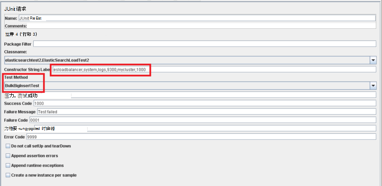

在*BulkInsertTest*和*BigBulkInsertTest*方法执行生成和上传数据的实际工作。 这两种方法都很相似。 它们连接到 Elasticsearch 群集，然后再创建一批文档 （如通过*ItemsPerInsert*构造函数字符串参数来确定）。 将文档添加到使用 Elasticsearch 大容量 API 的索引。 这两种方法之间的区别是*data1*和*data2*字符串字段中每个文档在*BulkInsertTest*方法中，上载中省略了，但将使用*BigBulkInsertTest*方法中的 12000 个字符的字符串填充。 请注意，您选择要运行 JUnit 请求页中 （上图中突出显示） 的 JMeter*测试方法*中使用这些方法。

> [AZURE.NOTE] 此处提供的示例代码使用 Elasticsearch 1.7.3 传输客户端库。 如果您使用的 Elasticsearch 2.0.0 或更高版本，必须使用相应的库为选定的版本。 有关 Elasticsearch 2.0.0 传输客户端库的详细信息，请参阅在 Elasticsearch 网站上的[传输客户端](https://www.elastic.co/guide/en/elasticsearch/client/java-api/2.0/transport-client.html)页。

[在 Azure 上 Elasticsearch 上配置的复原和恢复]: guidance-elasticsearch-configuring-resilience-and-recovery.md
[创建测试环境在 Azure 上 Elasticsearch 的性能]: guidance-elasticsearch-creating-performance-testing-environment.md
[运行自动化的 Elasticsearch 性能测试]: guidance-elasticsearch-running-automated-performance-tests.md
[为测试 Elasticsearch 性能部署 JMeter JUnit 取样器]: guidance-elasticsearch-deploying-jmeter-junit-sampler.md
