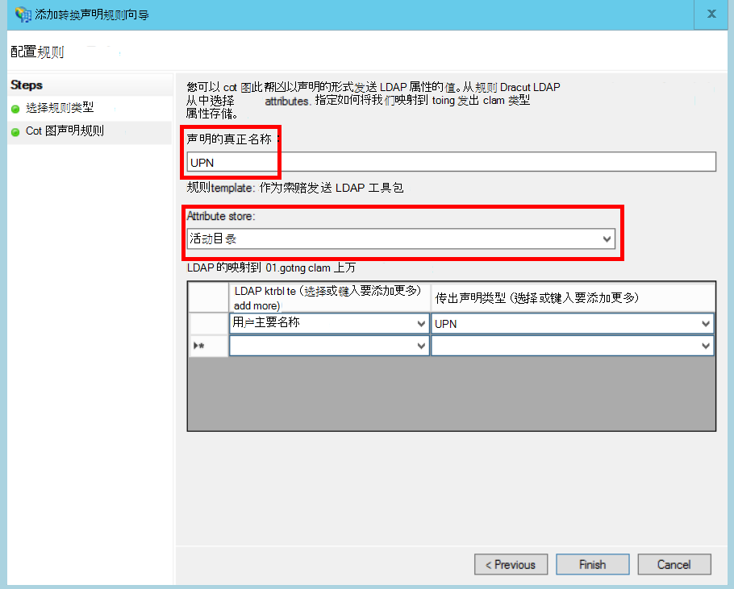

<properties
   pageTitle="与客户的 AD FS 联盟 |Microsoft Azure"
   description="如何与客户 federate 的多租户应用程序中的 AD FS"
   services=""
   documentationCenter="na"
   authors="JohnPWSharp"
   manager="roshar"
   editor=""
   tags=""/>

<tags
   ms.service="guidance"
   ms.devlang="dotnet"
   ms.topic="article"
   ms.tgt_pltfrm="na"
   ms.workload="na"
   ms.date="06/02/2016"
   ms.author="v-josha"/>

# <a name="federating-with-a-customers-ad-fs-for-multitenant-apps-in-azure"></a>与客户的 AD FS Azure 中的多租户应用程序的联盟

[AZURE.INCLUDE [pnp-header](../../includes/guidance-pnp-header-include.md)]

本文是[一系列的一部分]。 此外，还有伴随这一系列完整[的示例应用程序]。

本文介绍了如何多租户 SaaS 应用程序可以支持身份验证通过 Active Directory 联合身份验证服务 (AD FS）)，以便与客户的 AD FS 联合。

## <a name="overview"></a>概述

Azure 活动目录 (AD Azure) 可以轻松地从 Azure AD 租户，包括 Office365 和 Dynamics CRM Online 客户用户提供登录。 但是，怎样使用客户端 Active Directory 在公司 intranet 上呢？

要同步其内部广告含有 Azure 广告，使用[Azure AD 连接]这些客户是一个选项。 但是，有些客户可能无法使用这种方法，由于公司的 IT 政策或其他原因。 在这种情况下，另一种方法是通过 Active Directory 联合身份验证服务 (AD FS) 联合。

若要实现此方案︰

-   客户必须具有面向 Internet 的 AD FS 服务器场。
-   SaaS 提供商部署自己的 AD FS 服务器场。
-   客户和 SaaS 提供商必须设置[联合身份验证信任]。 这是一个手动过程。

信任关系中有三个主要的角色︰

-   客户的 AD FS 是[帐户伙伴]，负责客户的用户进行身份验证的广告，并创建与用户声明的安全令牌。
-   SaaS 提供商的 AD FS 是[资源伙伴]，也不能信任帐户伙伴接收用户声明。
-   应用程序被配置为信赖方 (RP) 在 SaaS 提供商的 AD FS。

    

> [AZURE.NOTE] 在本文中，我们假定应用程序应当使用 OpenID 身份连接的身份验证协议。 另一个选项是使用 WS 联合身份验证。

> OpenID 连接，对于 SaaS 提供商必须使用 AD FS 4.0 运行在 Windows 服务器 2016，目前正在技术预览。 AD FS 3.0 不支持 OpenID 连接。

> ASP.NET 1.0 核心不包括全新的 WS 联合身份验证支持。

有关 ASP.NET 4 中使用 WS 联合身份验证的示例，请参见[活动-目录-最低的 webapp-wsfederation 示例][active-directory-dotnet-webapp-wsfederation]。

## <a name="authentication-flow"></a>身份验证流程

1.  当用户单击"登录"时，则应用程序重定向到 SaaS 提供商的 AD FS OpenID 连接终结点。
2.  用户输入他 / 她组织的用户的名称 ("`alice@corp.contoso.com`")。 AD FS 使用主页领域发现重定向到客户的 AD FS 中，用户在其中输入其凭据。
3.  客户的 AD FS 将发送到 SaaS 提供商的 AD FS 中，用户声明使用 WF-联合身份验证 （或 SAML）。
4.  声明从 AD FS 流到应用程序中，使用 OpenID 连接。 这就要求从 WS 联合身份验证的协议转换。

## <a name="limitations"></a>限制

在撰写本文时，该应用程序接收一组有限的索赔 OpenID id_token 中，在下表中列出。 AD FS 4.0 是仍然预览，因此可能会更改此设置。 不是当前可以定义附加的声明︰

报销申请   | 说明
------|-------------
aud | 访问群体。 该应用程序为其发出声明。
authenticationinstant   | [即时的验证]。 发生身份验证的时间。
c_hash  | 哈希值的代码。 这是标记内容的哈希值。
exp | [过期时间]。 在此之后将不再接受该标记的时间。
iat | [使馆签发的]。 当颁发令牌的时间。
iss | 颁发者。 此声明的值始终是资源伙伴的 AD FS。
名称    | 用户的姓名。 例如︰ `john@corp.fabrikam.com`。
nameidentifier | [名称标识符]。 为其颁发令牌的实体的名称的标识符。
现时   | 会话 nonce。 AD fs 可以帮助防止重播攻击生成一个唯一值。
upn | 用户主体名称 (UPN)。 示例︰john@corp.fabrikam.com
pwd_exp | 密码到期期限。 用户的密码或使用类似身份验证机密，例如 PIN 之前的秒数。 截止日期。

> [AZURE.NOTE] "Iss"声称包含合作伙伴的 AD FS （通常情况下，此声明将确定颁发者作为 SaaS 提供商）。 它不识别客户的 AD FS。 您可以查找客户的域作为 UPN 的一部分。

本文的其余部分描述了如何设置 RP （应用程序） 和帐户合作伙伴 （客户） 之间的信任关系。

## <a name="ad-fs-deployment"></a>AD FS 部署

SaaS 提供商可以部署 AD FS 后端或 Azure 的虚拟机上。 对安全性和可用性，下面的准则非常重要︰

-   至少两个 AD FS 服务器和两个 AD FS 代理服务器，以获得最佳可用性的 AD FS 服务部署。
-   域控制器和 AD FS 服务器永远不应直接向互联网公开，应该直接访问它们的虚拟网络。
-   要发布到 Internet 的 AD FS 服务器，必须使用 web 应用程序代理服务器 （以前 AD FS 代理）。

若要设置 Azure 中的类似拓扑需要使用虚拟网络，NSG 的 azure VM 和可用性设置。 有关详细信息，请参见[部署 Windows 服务器 Active Directory Azure 虚拟机准则][active-directory-on-azure]。

## <a name="configure-openid-connect-authentication-with-ad-fs"></a>使用 AD FS 配置连接 OpenID 身份验证

SaaS 提供商必须启用 OpenID 连接，应用程序和 AD FS 之间。 若要执行此操作，请在 AD FS 中添加应用程序组。  您可以找到详细的说明在此[博客文章]，在"设置 Web 应用程序的 OpenId 连接在 AD FS 中退出。" 

接下来，配置 OpenID 连接中间件。 元数据终结点是`https://domain/adfs/.well-known/openid-configuration`，其中域是 SaaS 提供商的 AD FS 域。

通常可能将此组合与其他 OpenID 连接的终结点 （如 AAD)。 您将需要两个不同登录按钮或其他方法来区分它们，以便将用户定向到正确的身份验证终结点。

## <a name="configure-the-ad-fs-resource-partner"></a>配置 AD FS 资源伙伴

SaaS 提供商必须执行想要 ADFS 通过连接每个客户的以下操作︰

1.  添加声明提供程序信任。
2.  添加声明规则。
3.  使家庭领域发现。

下面是详细的步骤。

### <a name="add-the-claims-provider-trust"></a>添加声明提供程序信任

1.  在服务器管理器中，单击**工具**，然后选择**AD FS 管理**。
2.  在控制台树中，在**AD FS**中，右键单击**声明提供程序信任**。 选择**添加声明提供程序的信任**。
3.  单击**启动**以启动向导。
4.  选择选项"导入数据关于联机或在本地网络上发布的声明提供程序"。 输入客户的联合元数据端点的 URI。 (示例︰ `https://contoso.com/FederationMetadata/2007-06/FederationMetadata.xml`。)您将需要从客户获得此。
5.  完成向导，使用默认选项。

### <a name="edit-claims-rules"></a>编辑声明规则

1.  用鼠标右键单击新添加的声明提供程序信任，并选择**编辑声明规则**。
2.  单击**添加规则**。
3.  选择"将传递到或筛选传入声明"，然后单击**下一步**。
    
4.  输入此规则的名称。
5.  在"传入声明类型"下选择**UPN**。
6.  选择"传递所有声明值"。
  
7.  单击**完成**。
8.  重复步骤 2-7，并传入声明类型指定**定位声明类型**。
9.  单击**确定**以完成该向导。

### <a name="enable-home-realm-discovery"></a>使家庭领域发现
运行下面的 PowerShell 脚本︰

```
Set-ADFSClaimsProviderTrust -TargetName "name" -OrganizationalAccountSuffix @("suffix")
```

在"名称"的声明提供程序信任的友好名称，并且"后缀"客户的 UPN 后缀的 （例如，"corp.fabrikam.com"） 的广告。

使用此配置，最终用户可以在他们组织的帐户，键入，AD FS 将自动选择相应的声明提供程序。 部分"配置标识提供程序可使用某些电子邮件后缀"下，请参见[自定义 AD FS 登录页]。

## <a name="configure-the-ad-fs-account-partner"></a>配置 AD FS 帐户伙伴

客户必须执行以下操作︰

1.  添加信赖方 (RP) 信任关系。
2.  添加声明规则。

### <a name="add-the-rp-trust"></a>添加 RP 信任

1.  在服务器管理器中，单击**工具**，然后选择**AD FS 管理**。
2.  在控制台树中，在**AD FS**中，右键单击**信赖方信任**。 选择**添加信赖方信任**。
3.  选择**声明感知**，然后单击**开始**。
4.  在**选择数据源**页上选择选项"导入数据关于联机或在本地网络上发布的声明提供程序"。 输入的 SaaS 提供商的联合元数据端点的 URI。
  
5.  在**指定显示名称**页中，输入任何名称。
6.  在**选择访问控制策略**页上，选择一个策略。 您可以允许每个人在组织中，或选择一个特定安全组。
  
7.  输入在**策略**框中所需的任何参数。
8.  单击**下一步**以完成该向导。

### <a name="add-claims-rules"></a>添加声明规则

1.  用鼠标右键单击新添加信赖方信任关系，并选择**编辑索赔的颁发策略**。
2.  单击**添加规则**。
3.  选择"发送 LDAP 属性作为索赔"，然后单击**下一步**。
4.  请输入规则名称，如"UPN"。
5.  在**属性存储**中，请选择**Active Directory**。
  
6.  在**映射的 LDAP 属性**部分中︰
  - 在**LDAP 属性**中，选择**用户主要名称**。
  - **传出声明类型**下, 选择**UPN**。
  
7.  单击**完成**。
8.  再次单击**添加规则**。
9.  选择"发送索赔使用的自定义规则"，然后单击**下一步**。
10. 请输入规则名称，如"定位声明类型"。
11. 在**自定义规则**中，下输入以下命令︰

    ```
    EXISTS([Type == "http://schemas.microsoft.com/ws/2014/01/identity/claims/anchorclaimtype"])=>
      issue (Type = "http://schemas.microsoft.com/ws/2014/01/identity/claims/anchorclaimtype",
             Value = "http://schemas.xmlsoap.org/ws/2005/05/identity/claims/upn");
    ```

    此规则会发出类型索赔`anchorclaimtype`。 报销申请通知依赖方若要使用 UPN 作为不可变的用户的 id。

12. 单击**完成**。
13. 单击**确定**以完成该向导。

## <a name="next-steps"></a>下一步行动

- 阅读本系列的下一篇文章︰[使用客户端断言来获取访问令牌从 Azure 的广告][client assertion]

<!-- Links -->
[一系列的一部分]: guidance-multitenant-identity.md
[Azure AD 连接]: ../active-directory/active-directory-aadconnect.md
[联合身份验证信任]: https://technet.microsoft.com/library/cc770993(v=ws.11).aspx
[帐户伙伴]: https://technet.microsoft.com/library/cc731141(v=ws.11).aspx
[资源伙伴]: https://technet.microsoft.com/library/cc731141(v=ws.11).aspx
[即时的身份验证]: https://msdn.microsoft.com/library/system.security.claims.claimtypes.authenticationinstant%28v=vs.110%29.aspx
[过期时间]: http://tools.ietf.org/html/draft-ietf-oauth-json-web-token-25#section-4.1.4
[在颁发]: http://tools.ietf.org/html/draft-ietf-oauth-json-web-token-25#section-4.1.6
[名称标识符]: https://msdn.microsoft.com/library/system.security.claims.claimtypes.nameidentifier(v=vs.110).aspx
[active-directory-on-azure]: https://msdn.microsoft.com/library/azure/jj156090.aspx
[博客张贴内容]: http://www.cloudidentity.com/blog/2015/08/21/OPENID-CONNECT-WEB-SIGN-ON-WITH-ADFS-IN-WINDOWS-SERVER-2016-TP3/
[自定义 AD FS 登录页]: https://technet.microsoft.com/library/dn280950.aspx
[示例应用程序]: https://github.com/Azure-Samples/guidance-identity-management-for-multitenant-apps
[client assertion]: guidance-multitenant-identity-client-assertion.md
[active-directory-dotnet-webapp-wsfederation]: https://github.com/Azure-Samples/active-directory-dotnet-webapp-wsfederation
