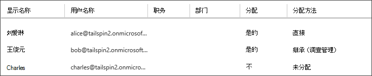

<properties
   pageTitle="应用程序角色 |Microsoft Azure"
   description="如何执行授权使用应用程序角色"
   services=""
   documentationCenter="na"
   authors="MikeWasson"
   manager="roshar"
   editor=""
   tags=""/>

<tags
   ms.service="guidance"
   ms.devlang="dotnet"
   ms.topic="article"
   ms.tgt_pltfrm="na"
   ms.workload="na"
   ms.date="02/16/2016"
   ms.author="mwasson"/>

#  <a name="application-roles-in-multitenant-applications"></a>在多租户应用程序的应用程序角色

[AZURE.INCLUDE [pnp-header](../../includes/guidance-pnp-header-include.md)]

本文是[一系列的一部分]。 此外，还有伴随这一系列完整[的示例应用程序]。

应用程序角色用于向用户分配权限。 例如， [Tailspin 调查][Tailspin]应用程序中定义的以下角色︰

- 管理员。 可以执行任何调查属于该组织的所有 CRUD 操作。
- 创建者。 可以创建新的调查。
- 读取器。 可以读取任何属于该组织的调查。

您可以看到，角色最终转换为权限，[授权]过程。 但第一个问题是如何分配和管理角色。 我们确定了三个主要选项︰

-   [Azure AD 的应用程序角色](#roles-using-azure-ad-app-roles)
-   [Azure AD 安全组](#roles-using-azure-ad-security-groups)
-   [应用程序角色管理器](#roles-using-an-application-role-manager)。

## <a name="roles-using-azure-ad-app-roles"></a>使用 Azure AD 的应用程序角色的角色

这是我们在 Tailspin 调查应用程序中使用的方法。

在此方法中，SaaS 提供商通过将其添加到应用程序清单中定义的应用程序角色。 客户注册后，有关客户的广告目录管理员向用户分配角色。 当用户登录时，将作为索赔发送的用户分配的角色。

> [AZURE.NOTE] 如果客户有 Azure AD 特优，管理员可以将安全组分配的角色，以及组的成员都将继承应用程序角色。 这是一种简便方法管理角色，因为组的所有者不需要是 AD 管理员。

这种方法的优点︰

-   简单的编程模型。
-   特定于应用程序的角色。 一个应用程序的角色声明不会发送到另一个应用程序。
-   如果客户应用程序从其广告租户，角色将会消失。
-   应用程序不需要任何额外的 Active Directory 权限，而不读取该用户的配置文件。

缺点︰

- 没有 Azure AD 特优的客户不能将安全组分配给角色。 对于这些客户，必须由 AD 管理员完成所有用户分配。
- 如果您有一个后端 web API，它是独立于 web 应用程序，使 web 应用程序的角色分配不适用于 web API。 这一点的详细说明，请参阅[保护后端 web API]。

### <a name="implementation"></a>实现

**定义的角色。** SaaS 提供商声明[应用程序清单]中定义的应用程序角色。 例如，下面是调查应用程序清单的条目︰

```
"appRoles": [
  {
    "allowedMemberTypes": [
      "User"
    ],
    "description": "Creators can create Surveys",
    "displayName": "SurveyCreator",
    "id": "1b4f816e-5eaf-48b9-8613-7923830595ad",
    "isEnabled": true,
    "value": "SurveyCreator"
  },
  {
    "allowedMemberTypes": [
      "User"
    ],
    "description": "Administrators can manage the Surveys in their tenant",
    "displayName": "SurveyAdmin",
    "id": "c20e145e-5459-4a6c-a074-b942bbd4cfe1",
    "isEnabled": true,
    "value": "SurveyAdmin"
  }
],
```

`value`属性会出现在角色声明。 `id`属性被定义的角色的唯一标识符。 始终生成新的 GUID 值的`id`。

**将用户分配**。 当新客户注册时，在客户的广告租户中注册应用程序。 在这种情况下，该租户的 AD 管理员可以为用户分配角色。

> [AZURE.NOTE] 如前所述，使用 Azure AD 优质客户还可以给角色分配安全组。

从 Azure 入口下面的屏幕快照显示了三个用户。 刘爱琳被直接分配给角色。 Bob 继承作为一个名为"调查管理"，这分配给角色的安全组的成员的角色。 Charles 未分配给任何角色。



> [AZURE.NOTE] 或者，应用程序可以分配角色，以编程方式使用 Azure 广告图形 API。  但是，这需要应用程序来获取客户的广告目录的写权限。 具有这些权限的应用程序可以执行大量破坏&mdash;客户是否信任应用程序不以其目录变得一团糟。 许多客户可能不愿意进行这一级别的访问权限授予。

**获取角色索赔**。 当用户登录时，应用程序会收到在类型声明中的用户分配的角色`http://schemas.microsoft.com/ws/2008/06/identity/claims/role`。  

用户可以具有多个角色，或者没有相应的角色。 在授权代码，不要假定用户已声明的一个角色。 相反，编写代码以检查是否存在特定的声明值︰

```csharp
if (context.User.HasClaim(ClaimTypes.Role, "Admin")) { ... }
```

## <a name="roles-using-azure-ad-security-groups"></a>角色使用 Azure AD 安全组

在此方法中，角色表示为 AD 安全组。 应用程序将权限分配给用户基于其安全组成员身份。

优点︰

-   对于那些没有 Azure AD 优质客户，这种方法使客户能够使用安全组来管理角色分配。

缺点︰

- 复杂性。 因为每个租户发送不同的组声明，应用程序必须跟踪的安全组对应于哪个应用程序角色，为每个租户。
- 如果客户应用程序从其广告的租户，它们的广告目录处于安全组。

### <a name="implementation"></a>实现

在应用程序清单中，设置`groupMembershipClaims`"SecurityGroup"属性。 这需要从 AAD 获取组成员身份的声明。

```
{
   // ...
   "groupMembershipClaims": "SecurityGroup",
}
```

注册新客户，该应用程序会通知客户创建所需的应用程序的角色的安全组。 然后，客户将需要输入到应用程序的组对象 Id。 应用程序将存储这些表映射到应用程序角色，每个租户的组 Id。

> [AZURE.NOTE] 此外，应用程序可以创建组，以编程方式使用 Azure 广告图形 API。  这将是较少出错。 但是，这需要获得"读取和写入的所有组"客户的广告目录的权限。 许多客户可能不愿意进行这一级别的访问权限授予。

当用户登录︰

1.  应用程序接收的用户组作为索赔。 每个声明的值是一个组的对象 ID。
2.  Azure 广告限制发送标记中的组数。 如果组的数目超过了此限制，Azure 广告发送特殊的"超额"索赔。 如果该声明，则应用程序必须查询 Azure 广告图形 API 来获取所有与该用户所属的组。 有关详细信息，请参阅 [在云应用程序中使用 AD 组授权]，标题为"组声称超额"一节。
3.  应用程序将查找在自己数据库中，找到要分配给用户的相应应用程序角色的对象 Id。
4.  应用程序将添加到表示该应用程序角色的用户主体的自定义声明值。 例如︰ `survey_role` ="SurveyAdmin"。

授权策略，应使用自定义角色声明，声称不是组。

## <a name="roles-using-an-application-role-manager"></a>使用应用程序角色管理器中的角色

使用此方法时，应用程序角色不存储在 Azure 的广告根本。 相反，应用程序都存储在自己数据库中为每个用户的角色分配&mdash;为例，在 ASP.NET 标识使用**RoleManager**类。

优点︰

-   应用程序具有完全控制的角色和用户分配。

缺点︰

- 变得更加复杂，难以维护。
- 不能使用 AD 安全组来管理角色分配。
- 将用户信息存储在应用数据库，其中会不同步与租户的广告目录，如添加或删除用户。   

有这种方法的许多现有示例。 例如，请参阅[创建 ASP.NET MVC 应用程序使用身份验证和 SQL 数据库并将其部署到 Azure 应用程序服务]。

## <a name="next-steps"></a>下一步行动

- 阅读本系列的下一篇文章︰[基于角色和基于资源的授权在多租户应用程序][授权]

<!-- Links -->
[Tailspin]: guidance-multitenant-identity-tailspin.md
[一系列的一部分]: guidance-multitenant-identity.md
[授权]: guidance-multitenant-identity-authorize.md
[保护后端 web API]: guidance-multitenant-identity-web-api.md
[创建一个 ASP.NET MVC 应用程序使用身份验证和 SQL 数据库并将其部署到 Azure 应用程序服务]: ../app-service-web/web-sites-dotnet-deploy-aspnet-mvc-app-membership-oauth-sql-database.md
[应用程序清单]: ../active-directory/active-directory-application-manifest.md
[示例应用程序]: https://github.com/Azure-Samples/guidance-identity-management-for-multitenant-apps
