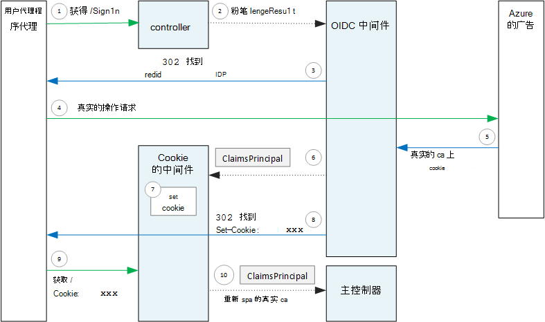

<properties
   pageTitle="在多租户应用程序的身份验证 |Microsoft Azure"
   description="多租户应用程序可以进行从 Azure 广告用户身份的验证"
   services=""
   documentationCenter="na"
   authors="MikeWasson"
   manager="roshar"
   editor=""
   tags=""/>

<tags
   ms.service="guidance"
   ms.devlang="dotnet"
   ms.topic="article"
   ms.tgt_pltfrm="na"
   ms.workload="na"
   ms.date="05/23/2016"
   ms.author="mwasson"/>

# <a name="authentication-in-multitenant-apps-using-azure-ad-and-openid-connect"></a>在多租户应用程序，使用 Azure AD 身份验证和 OpenID 连接

[AZURE.INCLUDE [pnp-header](../../includes/guidance-pnp-header-include.md)]

本文是[一系列的一部分](guidance-multitenant-identity.md)。 此外，还有伴随这一系列完整[的示例应用程序]。

本文介绍一个多租户应用程序可以进行从 Azure Active Directory (Azure AD)，使用 OpenID 连接 (OIDC) 进行身份验证的用户身份的验证。

## <a name="overview"></a>概述

我们[参考实现](guidance-multitenant-identity-tailspin.md)是核心 1.0 ASP.NET 应用程序。 应用程序使用内置的 OpenID 连接的中间件来执行 OIDC 身份验证流程。 下图显示了用户登录，在高级别时会发生什么情况。


1.  在用户单击应用程序中的"登录"按钮。 此操作由 MVC 控制器处理。
2.  MVC 控制器会返回**ChallengeResult**操作。
3.  中间件截获**ChallengeResult** ，并创建一个 302 响应，将用户重定向到登录页面 Azure 的广告。
4.  用户对 Azure 广告进行身份验证。
5.  Azure 广告发送给应用程序 ID 标记。
6.  中间件验证 ID 标记。 在这种情况下，现在是在应用程序内验证该用户。
7.  中间件将用户重定向回应用程序。

## <a name="register-the-app-with-azure-ad"></a>向应用程序注册 Azure 的广告

若要启用 OpenID 连接，SaaS 提供商注册自己 Azure AD 租户应用程序。

若要注册该应用程序，请按照[Azure Active Directory 集成应用程序](../active-directory/active-directory-integrating-applications.md)，在[添加应用程序](../active-directory/active-directory-integrating-applications.md#adding-an-application)部分中的步骤操作。

在**配置**页中︰

-   请注意客户机 id。
-   在**应用程序是多租户**，选择**是**。
-   Azure 的广告将身份验证响应**回复 URL**设置为 URL。 您可以使用您的应用程序的基 URL。
  - 注意︰ URL 路径可以是任何东西，只要主机名匹配您已部署的应用程序。
  - 您可以设置多个回复 Url。 在开发期间，您可以使用`localhost`地址，对于本地运行的应用程序。
-   生成客户端机密︰**键**下, 单击下拉列表，显示**选择持续时间**和选择 1 或 2 年。 当您单击**保存**，将显示密钥。 一定要复制的值，因为它不会显示在再次时重新加载配置页。

## <a name="configure-the-auth-middleware"></a>配置身份验证中间件

本部分介绍如何为使用 OpenID 连接的多租户身份验证配置 ASP.NET 核心 1.0 中的身份验证中间件。

在启动类中，添加 OpenID 连接中间件︰

```csharp
app.UseOpenIdConnectAuthentication(options =>
{
    options.AutomaticAuthenticate = true;
    options.AutomaticChallenge = true;
    options.ClientId = [client ID];
    options.Authority = "https://login.microsoftonline.com/common/";
    options.CallbackPath = [callback path];
    options.PostLogoutRedirectUri = [application URI];
    options.SignInScheme = CookieAuthenticationDefaults.AuthenticationScheme;
    options.TokenValidationParameters = new TokenValidationParameters
    {
        ValidateIssuer = false
    };
    options.Events = [event callbacks];
});
```

> [AZURE.NOTE] 请参阅[Startup.cs](https://github.com/Azure-Samples/guidance-identity-management-for-multitenant-apps/blob/master/src/Tailspin.Surveys.Web/Startup.cs)。

有关启动类的详细信息，请参见 ASP.NET 核心 1.0 文档中的[应用程序启动](https://docs.asp.net/en/latest/fundamentals/startup.html)。

设置下面的中间件选项︰

- **客户机 Id**。 应用程序的客户端 ID，你在 Azure AD 中注册应用程序时。
- **颁发机构**。 对于多租户应用程序，请将它设置为`https://login.microsoftonline.com/common/`。 这是 Azure 广告常见终结点，从而使任何 Azure AD 租户进行登录的用户的 URL。 有关常见的终结点的详细信息，请参见[以下博客文章](http://www.cloudidentity.com/blog/2014/08/26/the-common-endpoint-walks-like-a-tenant-talks-like-a-tenant-but-is-not-a-tenant/)。
- 在**TokenValidationParameters**，设置为 false 的**ValidateIssuer** 。 这意味着该应用程序将负责验证 ID 标记中的颁发者值。 （中间件仍验证该令牌本身。）有关验证颁发者的详细信息，请参阅[验证颁发者](guidance-multitenant-identity-claims.md#issuer-validation)。
- **CallbackPath**。 这等于路径中设置 Azure AD 中注册回复 URL。 例如，如果回复 URL 为`http://contoso.com/aadsignin`， **CallbackPath**应为`aadsignin`。 如果不设置此选项，默认值是`signin-oidc`。
- **PostLogoutRedirectUri**。 指定一个 URL 以将用户重定向之后出的符号。 这应该是一个页，允许匿名请求&mdash;通常在主页。
- **SignInScheme**。 将此设置为`CookieAuthenticationDefaults.AuthenticationScheme`。 此设置表示该用户进行身份验证后，用户声明本地存储在 cookie 中。 此 cookie 是如何用户保持登录的浏览器会话期间。
- **事件。** 事件回调;请参阅[身份验证事件](#authentication-events)。

向管道中添加 Cookie 身份验证中间件。 此中间件负责写到的 cookie，用户声明，然后在后续的页加载过程中读取 cookie。

```csharp
app.UseCookieAuthentication(options =>
{
    options.AutomaticAuthenticate = true;
    options.AutomaticChallenge = true;
    options.AccessDeniedPath = "/Home/Forbidden";
});
```

## <a name="initiate-the-authentication-flow"></a>启动身份验证流程

若要在 ASP.NET MVC 中启动身份验证流程，返回从总监**ChallengeResult** :

```csharp
[AllowAnonymous]
public IActionResult SignIn()
{
    return new ChallengeResult(
        OpenIdConnectDefaults.AuthenticationScheme,
        new AuthenticationProperties
        {
            IsPersistent = true,
            RedirectUri = Url.Action("SignInCallback", "Account")
        });
}
```

这将导致中间件来返回 302 重定向到身份验证终结点 （找到） 响应。

## <a name="user-login-sessions"></a>用户登录会话

如所述，当用户首次登录时，Cookie 身份验证中间件将写入到一个 cookie 的用户声明。 在此之后，HTTP 请求是通过读取 cookie 身份验证。

默认情况下，cookie 中间件将[会话 cookie][session-cookie]，哪个获取一次删除该用户关闭浏览器。 下一次用户下次访问该站点，它们将不得不重新登录。 但是，如果将**IsPersistent**设置为 true，在**ChallengeResult**中，中间件将持久性 cookie 中，使用户关闭浏览器后始终保持登录。 您可以配置在 cookie 过期;请参见[控制 cookie 选项][cookie-options]。 持久性 cookie 更方便用户，但可能不适合于某些应用程序 （例如，一个银行应用程序） 要以在每次进行签名的用户。

## <a name="about-the-openid-connect-middleware"></a>有关 OpenID 连接中间件

在 ASP.NET 中的 OpenID 连接中间件隐藏大部分协议细节。 此部分包含有关实现，可能有助于理解协议流的一些注意事项。

首先，让我们看一下方面 （忽略应用程序和 Azure 的广告之间的 OIDC 协议流的详细信息） 的 ASP.NET 身份验证流程。 下图显示的过程。



在此图中，有两个 MVC 控制器。 帐户控制器可处理登录请求和主控制器可在主页上提出。

以下是在身份验证过程︰

1. 用户单击"登录"按钮，并浏览器发送一个 GET 请求。 例如︰ `GET /Account/SignIn/`。
2. 该帐户控制器返回`ChallengeResult`。
3. OIDC 中间件返回 HTTP 302 响应，将重定向到 Azure 的广告。
4. 浏览器发送到 Azure AD 身份验证请求
5. 用户登录到 Azure AD，Azure AD 并发回身份验证响应。
6. OIDC 中间件创建索赔主体，并将其传递给身份验证 Cookie 中间件。
7. Cookie 中间件将序列化的索赔主体并设置 cookie。
8. OIDC 中间件到应用程序的回调 URL 重定向。
10. 浏览器遵循重定向请求中发送 cookie。
11. Cookie 中间件反序列化的索赔主体 cookie 并设置`HttpContext.User`等于索赔主体。 该请求被路由到 MVC 控制器。

### <a name="authentication-ticket"></a>身份验证票证

如果身份验证成功，则 OIDC 中间件创建身份验证票证，其中包含保存用户的索赔的索赔主体。 您可以访问在**AuthenticationValidated**或**TicketReceived**事件票证。

> [AZURE.NOTE] 直到完成整个身份验证流程，`HttpContext.User`仍然持有匿名主体，_未_经过身份验证的用户。 匿名的主体所拥有的空声明集合。 完成身份验证和应用程序的重定向，cookie 中间件反序列化后的身份验证 cookie 和集`HttpContext.User`到索赔主体表示已通过身份验证的用户。

### <a name="authentication-events"></a>身份验证事件

在身份验证过程中，OpenID 连接中间件将引发一系列事件︰

- **RedirectToAuthenticationEndpoint**。 在中间件将重定向到身份验证终结点之前，则调用右。 您可以使用此事件来修改重定向 URL 中;例如，若要添加请求参数。 有关示例，请参见[添加管理员同意提示](guidance-multitenant-identity-signup.md#adding-the-admin-consent-prompt)。

- **AuthorizationResponseReceived**。 中间件接收从标识提供程序 (IDP) 的身份验证响应之后但在中间件验证响应之前调用。  

- **AuthorizationCodeReceived**。 使用授权代码的调用。

- **TokenResponseReceived**。 在中间件获取访问令牌从 IDP 之后调用。 仅适用于授权代码流。

- **AuthenticationValidated**。 在中间件验证 ID 标记之后调用。 在这种情况下，应用程序有一组验证与用户有关的声明。 您可以使用此事件执行其他验证上声明，或将索赔。 请参阅[处理索赔](guidance-multitenant-identity-claims.md)。

- **UserInformationReceived**。 如果中间件获取用户配置文件中的用户信息端点，调用。 仅适用于授权代码流，而仅在`GetClaimsFromUserInfoEndpoint = true`的中间件选项中。

- **TicketReceived**。 当身份验证完成时调用。 这是最后一次事件，假定该身份验证成功。 处理此事件后，用户登录到该应用程序。

- **AuthenticationFailed**。 如果身份验证失败时，调用。 使用此事件来处理身份验证失败&mdash;为例，通过重定向到错误页。

若要提供有关这些事件的回调，设置中间件上的**事件**选项。 有两种不同的方法来声明事件处理程序︰ 内联使用 lambda 时，或在从**OpenIdConnectEvents**派生的类中。

使用 lambda 内联︰

```csharp
app.UseOpenIdConnectAuthentication(options =>
{
    // Other options not shown.

    options.Events = new OpenIdConnectEvents
    {
        OnTicketReceived = (context) =>
        {
             // Handle event
             return Task.FromResult(0);
        },
        // other events
    }
});
```

从**OpenIdConnectEvents**派生︰

```csharp
public class SurveyAuthenticationEvents : OpenIdConnectEvents
{
    public override Task TicketReceived(TicketReceivedContext context)
    {
        // Handle event
        return base.TicketReceived(context);
    }
    // other events
}

// In Startup.cs:
app.UseOpenIdConnectAuthentication(options =>
{
    // Other options not shown.

    options.Events = new SurveyAuthenticationEvents();
});
```

如果事件回调有任何实质性的逻辑，因此它们不堆启动类，则建议使用第二种方法。 我们参考实现使用此方法;请参阅[SurveyAuthenticationEvents.cs](https://github.com/Azure-Samples/guidance-identity-management-for-multitenant-apps/blob/master/src/Tailspin.Surveys.Web/Security/SurveyAuthenticationEvents.cs)。

### <a name="openid-connect-endpoints"></a>OpenID 连接终结点

Azure 的广告支持[OpenID 连接发现](https://openid.net/specs/openid-connect-discovery-1_0.html)，身份提供程序 (IDP)，其中从[已知终结点](https://openid.net/specs/openid-connect-discovery-1_0.html#ProviderConfig)返回的 JSON 元数据文档。 元数据文档包含的信息如︰

-   授权方终结点的 URL。 这是在该应用程序将重定向用户进行身份验证。
-   "结束会话"终结点，应用程序的位置登出用户的 URL。
-   要获取签名密钥，客户端用来验证其获取从 IDP 的 OIDC 标记的 URL。

默认情况下，OIDC 中间件知道如何获取此元数据。 在中间件中设置的**授权机构**选项和中间件构造的元数据的 URL。 （您可以通过重写元数据 URL 设置**MetadataAddress**选项。）

### <a name="openid-connect-flows"></a>OpenID 连接流

默认情况下，OIDC 中间件混合流使用表单 post 响应模式。

-   _混合流_意味着客户端可以获得一个 ID 令牌和授权码相同的往返到授权服务器。
-   _窗体发送响应模式_意味着授权服务器使用 HTTP 发布请求发送到该应用程序的 ID 标记和授权代码。 这些值是表单发 (内容类型 ="应用程序/x-www-窗体-urlencoded")。

OIDC 中间件到授权结束重定向，重定向 URL 包括所有所需的 OIDC 的查询字符串参数。 对于混合流︰

-   client_id。 在**客户机 Id**选项设置此值
-   作用域 ="openid 配置文件"，这意味着它是一个 OIDC 请求，我们希望用户的配置文件。
-   response_type ="代码 id_token"。 此参数指定混合流。
-   response_mode ="form_post"。 该选项用于指定窗体 post 响应。

若要指定不同的流，请设置**ResponseType**选项。 例如︰

```csharp
app.UseOpenIdConnectAuthentication(options =>
{
    options.ResponseType = "code"; // Authorization code flow

    // Other options
}
```

## <a name="next-steps"></a>下一步行动

- 阅读本系列的下一篇文章︰[使用基于声明的身份在多租户应用程序][claims]


[claims]: guidance-multitenant-identity-claims.md
[cookie-options]: https://docs.asp.net/en/latest/security/authentication/cookie.html#controlling-cookie-options
[session-cookie]: https://en.wikipedia.org/wiki/HTTP_cookie#Session_cookie
[示例应用程序]: https://github.com/Azure-Samples/guidance-identity-management-for-multitenant-apps
