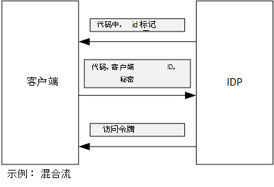

<properties
   pageTitle="使用客户端声明从 Azure AD 获取访问令牌 |Microsoft Azure"
   description="如何使用客户端声明从 Azure AD 获取访问令牌。"
   services=""
   documentationCenter="na"
   authors="MikeWasson"
   manager="roshar"
   editor=""
   tags=""/>

<tags
   ms.service="guidance"
   ms.devlang="dotnet"
   ms.topic="article"
   ms.tgt_pltfrm="na"
   ms.workload="na"
   ms.date="05/23/2016"
   ms.author="mwasson"/>

# <a name="using-client-assertion-to-get-access-tokens-from-azure-ad"></a>使用客户端声明从 Azure AD 获取访问令牌

[AZURE.INCLUDE [pnp-header](../../includes/guidance-pnp-header-include.md)]

本文是[一系列的一部分]。 此外，还有伴随这一系列完整[的示例应用程序]。

## <a name="background"></a>背景

当使用授权代码流或混合流 OpenID 连接中，客户端交换访问令牌授权码。 在此步骤中，客户端必须对服务器验证自己的身份。



对客户端进行身份验证的一种方法是通过使用客户端密码。 那如何[Tailspin 调查][Surveys]应用程序默认配置。

这里是从客户端到 IDP，请求访问令牌的示例请求。 注意`client_secret`参数。

```
POST https://login.microsoftonline.com/b9bd2162xxx/oauth2/token HTTP/1.1
Content-Type: application/x-www-form-urlencoded

resource=https://tailspin.onmicrosoft.com/surveys.webapi
  &client_id=87df91dc-63de-4765-8701-b59cc8bd9e11
  &client_secret=i3Bf12Dn...
  &grant_type=authorization_code
  &code=PG8wJG6Y...
```

秘密是仅仅是一个字符串，因此您必须确保不泄露值。 最佳做法是保密出源代码管理客户端。 当您部署到 Azure 时，[应用程序设置]中存储机密[configure-web-app]。

但是，Azure 订阅访问的任何人都可以查看的应用程序设置。 此外，始终没有签入源代码管理 （例如，在部署脚本） 的机密信息，通过电子邮件、 共享等诱惑。

为了提高安全性，可以使用[客户端断言]，而不是客户端密码。 与客户端声明时，客户端使用 X.509 证书来证明令牌请求来自客户端。 在 web 服务器上安装客户端证书。 通常情况下，它会更容易比，确保没有人因疏忽而将显示客户端密钥证书，限制访问。 有关在 web 应用程序中配置证书的详细信息，请参阅[在 Azure 网站应用程序中使用的证书][using-certs-in-websites]

下面是使用客户端声明令牌请求︰

```
POST https://login.microsoftonline.com/b9bd2162xxx/oauth2/token HTTP/1.1
Content-Type: application/x-www-form-urlencoded

resource=https://tailspin.onmicrosoft.com/surveys.webapi
  &client_id=87df91dc-63de-4765-8701-b59cc8bd9e11
  &client_assertion_type=urn:ietf:params:oauth:client-assertion-type:jwt-bearer
  &client_assertion=eyJhbGci...
  &grant_type=authorization_code
  &code= PG8wJG6Y...
```

请注意，`client_secret`不再使用参数。 相反，`client_assertion`参数包含使用客户端证书进行签名的 JWT 标记。 `client_assertion_type`参数指定的类型的断言&mdash;在此种情况下，JWT 令牌。 服务器验证该 JWT 令牌。 如果 JWT 令牌无效，令牌的请求会返回错误。

> [AZURE.NOTE] X.509 证书不是肯定的唯一形式的客户端;我们专注于它这里因为它所支持的 Azure 的广告。

## <a name="using-client-assertion-in-the-surveys-application"></a>调查应用程序中使用客户端声明

本节说明如何配置以使用客户端断言 Tailspin 调查应用程序。 在这些步骤中，您将生成自签名的证书，适用于开发，但不是用于生产环境。

1. 运行 PowerShell 脚本[/Scripts/Setup-KeyVault.ps1] [ Setup-KeyVault] ，如下所示︰

    ```
    .\Setup-KeyVault.ps -Subject [subject]
    ```

    对于`Subject`参数，输入任意名称，如"surveysapp"。 此脚本将生成一个自签名的证书并将其存储在"当前用户/个人"证书存储区中。

2. 该脚本的输出是一个 JSON 片段。 添加到 web 应用程序，应用程序清单，如下所示︰

    1. 登录到[Azure 管理门户网站][ azure-management-portal] ，然后定位到 Azure 的广告目录。

    2. 单击**应用程序**。

    3. 选择调查的应用程序。

    4.  单击**管理清单**并选择**下载清单**。

    5.  在文本编辑器中打开清单的 JSON 文件。 粘贴到脚本的输出`keyCredentials`属性。 它应类似于如下︰

        ```    
        "keyCredentials": [
            {
              "type": "AsymmetricX509Cert",
              "usage": "Verify",
              "keyId": "29d4f7db-0539-455e-b708-....",
              "customKeyIdentifier": "ZEPpP/+KJe2fVDBNaPNOTDoJMac=",
              "value": "MIIDAjCCAeqgAwIBAgIQFxeRiU59eL.....
            }
          ],
         ```

    6.  JSON 文件中保存您的更改。

    7.  返回到门户。 单击**管理清单** > **上载清单**和 JSON 文件上载。

3. 运行以下命令来获取证书的指纹。

    ```
    certutil -store -user my [subject]
    ```

    其中`[subject]`是 PowerShell 脚本中指定对象的值。 指纹被列在"证书 Hash(sha1)"。 删除空格之间的十六进制数字。

4. 更新您的应用程序的机密。 在解决方案资源管理器中，右击 Tailspin.Surveys.Web 项目，然后选择**管理用户的机密信息**。 在"AzureAd"下的"不对称"的添加项，如下所示︰

    ```
    {
      "AzureAd": {
        "ClientId": "[Surveys application client ID]",
        // "ClientSecret": "[client secret]",  << Delete this entry
        "PostLogoutRedirectUri": "https://localhost:44300/",
        "WebApiResourceId": "[App ID URI of your Survey.WebAPI application]",
        // new:
        "Asymmetric": {
          "CertificateThumbprint": "[certificate thumbprint]",  // Example: "105b2ff3bc842c53582661716db1b7cdc6b43ec9"
          "StoreName": "My",
          "StoreLocation": "CurrentUser",
          "ValidationRequired": "false"
        }
      },
      "Redis": {
        "Configuration": "[Redis connection string]"
      }
    }
    ```

    您必须设置`ValidationRequired`为假，因为该证书不是由根 CA 颁发机构签名。 在生产中，使用的证书已由 CA 颁发机构签名并设置`ValidationRequired`为 true。

    此外删除此条目为`ClientSecret`，因为它不需要使用客户端断言。

5. 在 Startup.cs，找到注册的代码`ICredentialService`。 取消注释的行，使用`CertificateCredentialService`，并注释掉的行，使用`ClientCredentialService`:

    ```csharp
    // Uncomment this:
    services.AddSingleton<ICredentialService, CertificateCredentialService>();
    // Comment out this:
    //services.AddSingleton<ICredentialService, ClientCredentialService>();
    ```

在运行时，该 web 应用程序从证书存储区中读取证书。 必须在 web 应用程序的同一台计算机上安装证书。

## <a name="next-steps"></a>下一步行动

- 阅读本系列的下一篇文章︰[使用 Azure 密钥存储库来保护应用程序的机密][key vault]


<!-- Links -->
[configure-web-app]: ../app-service-web/web-sites-configure.md
[azure-management-portal]: https://manage.windowsazure.com
[客户端断言]: https://tools.ietf.org/html/rfc7521
[key vault]: guidance-multitenant-identity-keyvault.md
[Setup-KeyVault]: https://github.com/Azure-Samples/guidance-identity-management-for-multitenant-apps/blob/master/scripts/Setup-KeyVault.ps1
[Surveys]: guidance-multitenant-identity-tailspin.md
[using-certs-in-websites]: https://azure.microsoft.com/blog/using-certificates-in-azure-websites-applications/
[一系列的一部分]: guidance-multitenant-identity.md
[示例应用程序]: https://github.com/Azure-Samples/guidance-identity-management-for-multitenant-apps
