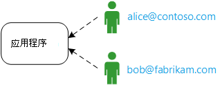
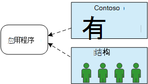
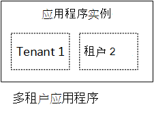
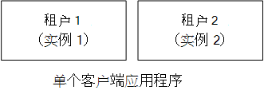
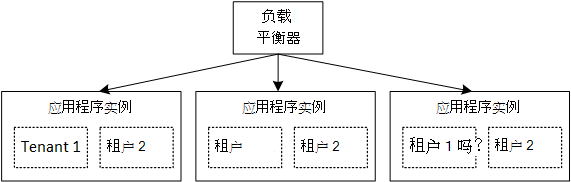

<properties
   pageTitle="对于多租户应用程序的标识管理 |Microsoft Azure"
   description="在多租户应用程序的标识管理简介"
   services=""
   documentationCenter="na"
   authors="MikeWasson"
   manager="roshar"
   editor=""
   tags=""/>

<tags
   ms.service="guidance"
   ms.devlang="dotnet"
   ms.topic="article"
   ms.tgt_pltfrm="na"
   ms.workload="na"
   ms.date="06/02/2016"
   ms.author="mwasson"/>

# 在 Microsoft Azure 中的多租户应用程序的标识管理简介

[AZURE.INCLUDE [pnp-header](../../includes/guidance-pnp-header-include.md)]

本文是[一系列的一部分]。 此外，还有伴随这一系列完整[的示例应用程序]。

假设您正在编写一个企业 SaaS 应用程序在云中托管。 当然，应用程序将具有用户︰

但是，这些用户所属的组织︰

示例︰ Tailspin 销售到 SaaS 应用程序的订阅。 Contoso，Fabrikam 注册应用程序。 当刘爱琳 (`alice@contoso`) 中的迹象，应用程序应该知道小红是 Contoso 的一部分。

- 刘爱琳_应该_有对 Contoso 数据的访问。
- Alice_不应_具有对 Fabrikam 数据的访问。

本指南将向您展示如何管理一个多租户应用程序，使用[Azure Active Directory]中的用户标识[AzureAD](Azure AD) 以处理登录和身份验证。

## 多租赁的是什么？

_租户_是一组用户。 在 SaaS 应用程序中，租户是订阅服务器或应用程序的客户。 _多租赁_是在多个租户共享相同的物理实例的应用程序的体系结构。 虽然租户共享物理资源 （如虚拟机或存储），但是每个租户获取自身逻辑的应用程序的实例。

通常情况下，用户在承租人，但不是能与其他租户共享应用程序数据。

比较单租户体系结构，其中每个租户有专用的物理实例与此体系结构。 在单租户体系结构中，您添加承租人通过旋转该应用程序的新实例。

### 多租赁和水平缩放

为了实现在云环境中的比例，是经常会添加更多的物理实例。 这称为_水平缩放_或_横向扩展_。 请考虑一个 web 应用程序。 若要处理更多的通信，可以添加更多服务器的虚拟机并将它们放在负载平衡器后面。 每个虚拟机运行一个单独的 web 应用程序的物理实例。

可以将任何请求路由到任何实例。 在一起，系统作为单个逻辑实例。 可拆卸虚拟机或运转一个新的虚拟机，而不影响用户。 在此体系结构中，每个物理实例是多租户，并通过添加更多实例，您扩展。 如果一个实例出现故障，它不应影响任何租户。

## 在多租户应用程序的标识

在多租户应用程序中，必须考虑用户的租户上下文中。

**身份验证**

- 用户登录到该应用程序使用其组织的凭据。 他们不必创建新的用户配置文件应用程序。
- 在同一组织内的用户是同一组织的一部分。
- 当用户登录时，该应用程序知道用户属于哪个租户。

**授权**

- 当授权用户的操作 （比如查看资源），应用程序必须考虑到用户的租户。
- 用户可能被分配到应用程序，例如"管理员"或"标准用户"中的角色。 应由客户，不是由 SaaS 提供商管理角色分配。

**本示例。** Alice，contoso，员工在其浏览器中导航到该应用程序，并单击"登录"按钮。 她被重定向到登录屏幕，在其中她进入她公司的凭据 （用户名和密码）。 在这种情况下，她登录到应用程序作为`alice@contoso.com`。 应用程序还知道小红是此应用程序的管理员用户。 因为她是一名管理员，她可以看到所有属于 Contoso 的资源的列表。 但是，她不能因为她是一名管理员只在她租户查看 Fabrikam 的资源。

在本指南中，我们要看专门用于标识管理 Azure 的广告。

- 我们假定客户将他们的用户配置文件存储在 Azure 的广告 （包括 Office365 和 Dynamics CRM 承租人）
- 与后端活动目录 (AD) 的客户可以使用[Azure AD 连接][ADConnect]同步其内部广告含有 Azure 的广告。

如果使用内部部署版本广告客户不能使用 Azure AD 连接 （因公司的 IT 政策或其他原因），的 SaaS 提供商可以联合与客户的广告通过 Active Directory 联合身份验证服务 (AD FS)。 此选项所述[进行与客户的 AD FS 的联盟]。

本指南不考虑其他方面的多租赁等数据分区，每个租户配置。

## 下一步行动

- 阅读本系列的下一篇文章︰[关于 Tailspin 调查应用程序][tailpin]

<!-- Links -->
[ADConnect]: ../active-directory/active-directory-aadconnect.md
[AzureAD]: https://azure.microsoft.com/documentation/services/active-directory/
[一系列的一部分]: guidance-multitenant-identity.md
[与客户的 AD FS 联盟]: guidance-multitenant-identity-adfs.md
[示例应用程序]: https://github.com/Azure-Samples/guidance-identity-management-for-multitenant-apps
[tailpin]: guidance-multitenant-identity-tailspin.md
