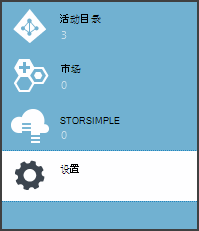
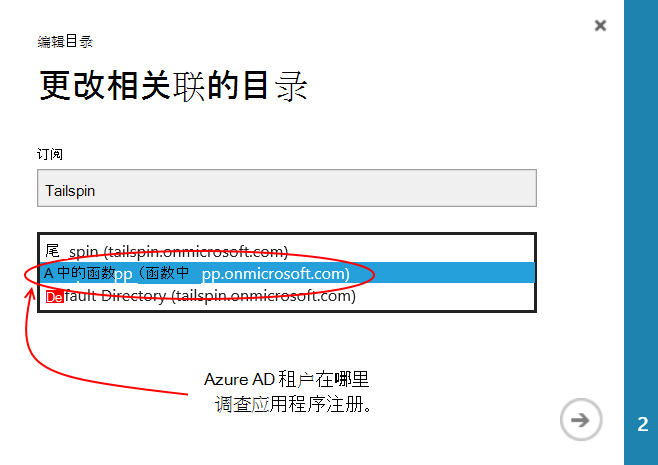
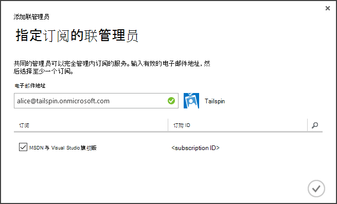
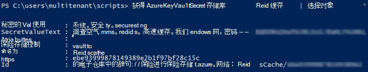

<properties
   pageTitle="使用密钥存储库来保护应用程序机密 |Microsoft Azure"
   description="如何使用存储应用程序机密密钥存储库服务"
   services=""
   documentationCenter="na"
   authors="MikeWasson"
   manager="roshar"
   editor=""
   tags=""/>

<tags
   ms.service="guidance"
   ms.devlang="dotnet"
   ms.topic="article"
   ms.tgt_pltfrm="na"
   ms.workload="na"
   ms.date="02/16/2016"
   ms.author="mwasson"/>

# <a name="using-azure-key-vault-to-protect-application-secrets"></a>使用 Azure 密钥存储库来保护应用程序的机密

[AZURE.INCLUDE [pnp-header](../../includes/guidance-pnp-header-include.md)]

本文是[一系列的一部分]。 此外，还有伴随这一系列完整[的示例应用程序]。

## <a name="overview"></a>概述

它是通常有的写，并且必须加以保护，如应用程序设置︰

- 数据库连接字符串
- 密码
- 加密密钥

作为安全性的最佳操作，应将这些机密信息永远不会存储在源代码管理中。 就会很容易地泄漏&mdash;即使您源代码储存库是专用的。 和它几乎无力秘密从一般公用。 在大型项目中，您可能希望限制哪些开发人员和操作员可以访问生产机密。 （为测试或开发环境的设置是不同的。）

更安全的选项是[Azure 密钥存储库]中存储这些机密[KeyVault]。 密钥存储库是云托管服务来管理加密密钥和其他机密信息。 本文介绍如何使用密钥存储库来存储您应用程序的配置设置。

在[Tailspin 调查][Surveys]应用程序中，以下设置是机密︰

- 数据库连接字符串。
- Redis 的连接字符串。
- Web 应用程序客户端密码。

若要在密钥存储库中存储配置机密，调查应用程序实现一个自定义配置提供程序，ASP.NET 核心 1.0[配置系统]挂钩[configuration]。 自定义提供程序在启动时，密钥存储库中读取配置设置。

调查应用程序将从下列位置加载配置设置︰

- Appsettings.json 文件
- [存储用户的机密信息]的[user-secrets](开发环境; 进行测试)
- 宿主环境 （在 Azure 的 web 应用程序的应用程序设置）
- 密钥存储库

每个这些重写上一个，因此任何存储在密钥存储库中的设置优先。

> [AZURE.NOTE] 默认情况下，禁用密钥存储库的配置提供程序。 对于本地运行的应用程序不需要此方法。 您可以使其在生产部署。

> 密钥存储区提供程序当前不支持.NET 核心，因为它需要[Microsoft.Azure.KeyVault] [Microsoft.Azure.KeyVault]软件包。

在启动时，应用程序中每个已注册的配置提供程序中，读取设置，并使用它们来填充一个强类型的选项。 (有关详细信息，请参阅[使用选项和配置对象][options]。)

## <a name="implementation"></a>实现

[KeyVaultConfigurationProvider] [KeyVaultConfigurationProvider]类是配置提供程序插入到核心 1.0 ASP.NET[配置系统][configuration]。

若要使用`KeyVaultConfigurationProvider`，调用`AddKeyVaultSecrets`中的启动类的扩展方法︰

```csharp
    var builder = new ConfigurationBuilder()
        .SetBasePath(appEnv.ApplicationBasePath)
        .AddJsonFile("appsettings.json");

    if (env.IsDevelopment())
    {
        builder.AddUserSecrets();
    }
    builder.AddEnvironmentVariables();
    var config = builder.Build();

    // Add key vault configuration:
    builder.AddKeyVaultSecrets(config["AzureAd:ClientId"],
        config["KeyVault:Name"],
        config["AzureAd:Asymmetric:CertificateThumbprint"],
        Convert.ToBoolean(config["AzureAd:Asymmetric:ValidationRequired"]),
        loggerFactory);
```

请注意，`KeyVaultConfigurationProvider`需要一些配置设置，这需要存储在其他配置源之一。

当应用程序启动时，`KeyVaultConfigurationProvider`枚举所有密钥存储库中的秘密。 对于每个秘密，它查找名为 ConfigKey 的标记。 标记的值是配置设置的名称。

> [AZURE.NOTE] [标记][key-tags]是可选的元数据存储密钥。 因为密钥名称不能包含冒号 （:），此处使用标记。

```csharp
var kvClient = new KeyVaultClient(GetTokenAsync);
var secretsResponseList = await kvClient.GetSecretsAsync(_vault, MaxSecrets, token);
foreach (var secretItem in secretsResponseList.Value)
{
    //The actual config key is stored in a tag with the Key "ConfigKey"
    // because ':' is not supported in a shared secret name by Key Vault.
    if (secretItem.Tags != null && secretItem.Tags.ContainsKey(ConfigKey))
    {
        var secret = await kvClient.GetSecretAsync(secretItem.Id, token);
        Data.Add(secret.Tags[ConfigKey], secret.Value);
    }
}
```

> [AZURE.NOTE] 请参阅[KeyVaultConfigurationProvider.cs]。

## <a name="setting-up-key-vault-in-the-surveys-app"></a>调查应用程序中设置密钥存储库

系统必备组件︰

- 安装[资源管理器的 Azure Cmdlet][azure-rm-cmdlets]。
- 配置[运行调查应用程序]中所述的调查应用程序[readme]。

主要步骤︰

1. 设置组织中的管理用户。
2. 设置客户端证书。
3. 创建密钥存储库。
4. 将配置设置添加到您的密钥存储库。
5. 取消注释的代码，使密钥存储库。
6. 更新应用程序的用户的机密信息。

### <a name="set-up-an-admin-user"></a>设置非管理员用户

> [AZURE.NOTE] 要创建密钥存储库，您必须使用可以管理 Azure 订阅的帐户。 此外，任何授权读取该密钥存储库的应用程序必须注册中为该帐户相同的租户。

在此步骤中，您将确保可以创建密钥存储库，从组织的用户的身份登录时注册调查应用程序了。

首先，更改与 Azure 订阅关联的目录。

1. 登录到[Azure 的管理门户][azure-management-portal]

2. 单击**设置**。

    

3. 选择 Azure 订购。

4. 单击底部的门户网站的**编辑目录**。

    

5. 在"更改相关联的目录"，选择其中调查应用程序已注册，Azure AD 租户

    

6. 单击箭头按钮并完成对话框。

创建管理员用户调查的应用程序在其中注册 Azure 广告组织内。

1. 登录到[Azure 管理门户网站][azure-management-portal]。

2. 选择 Azure 广告组织在注册您的应用程序。

3. 单击**用户** > **添加用户**。

4. 在**添加用户**对话框中，将分配到全局管理员角色的用户。

作为联管理员为您 Azure 的订阅中添加管理员用户。

1. 登录到[Azure 管理门户网站][azure-management-portal]。

2. 单击**设置**，然后选择 Azure 订购。

3. 单击**管理员**

4. 单击**添加**底部的门户。

5. 请输入您先前创建的管理员用户的电子邮件。

6. 选中预订复选框。

7. 单击复选标记按钮以完成对话框。




### <a name="set-up-a-client-certificate"></a>设置客户端证书

1. 运行 PowerShell 脚本[/Scripts/Setup-KeyVault.ps1] [ Setup-KeyVault] ，如下所示︰
    ```
    .\Setup-KeyVault.ps1 -Subject <<subject>>
    ```
    对于`Subject`参数，输入任意名称，如"surveysapp"。 此脚本将生成一个自签名的证书并将其存储在"当前用户/个人"证书存储区中。

2. 该脚本的输出是一个 JSON 片段。 添加到 web 应用程序，应用程序清单，如下所示︰

    1. 登录到[Azure 管理门户网站][ azure-management-portal] ，然后定位到 Azure 的广告目录。

    2. 单击**应用程序**。

    3. 选择调查的应用程序。

    4.  单击**管理清单**并选择**下载清单**。

    5.  在文本编辑器中打开清单的 JSON 文件。 粘贴到脚本的输出`keyCredentials`属性。 它应类似于如下︰
    ```
            "keyCredentials": [
                {
                  "type": "AsymmetricX509Cert",
                  "usage": "Verify",
                  "keyId": "29d4f7db-0539-455e-b708-....",
                  "customKeyIdentifier": "ZEPpP/+KJe2fVDBNaPNOTDoJMac=",
                  "value": "MIIDAjCCAeqgAwIBAgIQFxeRiU59eL.....
                }
              ],
    ```          
    6.  JSON 文件中保存您的更改。

    7.  返回到门户。 单击**管理清单** > **上载清单**和 JSON 文件上载。

3. 将同一个 JSON 片段添加到 web API (Surveys.WebAPI) 的应用程序清单。

4. 运行以下命令来获取证书的指纹。
    ```
    certutil -store -user my [subject]
    ```
    其中`[subject]`是 PowerShell 脚本中指定对象的值。 指纹被列在"证书 Hash(sha1)"。 删除空格之间的十六进制数字。

您将稍后使用指纹。

### <a name="create-a-key-vault"></a>创建密钥存储库

1. 运行 PowerShell 脚本[/Scripts/Setup-KeyVault.ps1] [ Setup-KeyVault] ，如下所示︰

    ```
    .\Setup-KeyVault.ps1 -KeyVaultName <<key vault name>> -ResourceGroupName <<resource group name>> -Location <<location>>
    ```

    当系统提示您输入凭据时，Azure 广告以用户身份登录之前创建。 该脚本创建一个新的资源组，并且该资源组内新的密钥存储库。

    注意︰ 对于-位置参数，可以使用下面的 PowerShell 命令以获取有效区域的列表︰

    ```
    Get-AzureRmResourceProvider -ProviderNamespace "microsoft.keyvault" | Where-Object { $_.ResourceTypes.ResourceTypeName -eq "vaults" } | Select-Object -ExpandProperty Locations
    ```

2. 再次运行 SetupKeyVault.ps，使用以下参数︰

    ```
    .\Setup-KeyVault.ps1 -KeyVaultName <<key vault name>> -ApplicationIds @("<<web app client ID>>", "<<web API client ID>>")
    ```

    在哪里

    - 密钥存储库名称 = 您在上一步中赋予该密钥存储库的名称。
    - web 应用程序的客户端 ID = 调查 web 应用程序的客户端 ID。
    - web api 客户端 ID = Surveys.WebAPI 应用程序的客户端 ID。

    示例︰
    ```
    .\Setup-KeyVault.ps1 -KeyVaultName tailspinkv -ApplicationIds @("f84df9d1-91cc-4603-b662-302db51f1031", "8871a4c2-2a23-4650-8b46-0625ff3928a6")
    ```

    > [AZURE.NOTE] 您可以获取客户端 Id 从[Azure 管理门户][azure-management-portal]。 选择 Azure AD 租户、 选择的应用程序，并单击**配置**。

    此脚本可授权的 web 应用程序和 web API 从您的密钥存储库中检索机密信息。 [开始使用 Azure 密钥存储库]，请参阅[authorize-app]的详细信息。

### <a name="add-configuration-settings-to-your-key-vault"></a>将配置设置添加到您的密钥存储库

1. 运行 SetupKeyVault.ps，如下所示︰

    ```
    .\Setup-KeyVault.ps1 -KeyVaultName <<key vault name> -KeyName RedisCache -KeyValue "<<Redis DNS name>>.redis.cache.windows.net,password=<<Redis access key>>,ssl=true" -ConfigName "Redis:Configuration"
    ```
    在哪里

    - 密钥存储库名称 = 您在上一步中赋予该密钥存储库的名称。
    - Redis 的 DNS 名称 = Redis 缓存实例的 DNS 名称。
    - 访问键 redis = Redis 缓存实例的访问键。

    此命令将添加到您的密钥存储库的一个秘密。 秘密是一个名称/值对，再加上一个标签︰

    -   键名不由应用程序使用，但该密钥存储库中必须是唯一。
    -   值是这种情况下 Redis 的连接字符串中的配置选项的值。
    -   "ConfigKey"标记保存配置项的名称。

2. 在这种情况下，最好以测试是否成功地存储密钥存储库的秘诀。 运行以下 PowerShell 命令︰

    ```
    Get-AzureKeyVaultSecret <<key vault name>> RedisCache | Select-Object *
    ```
    输出中应显示的机密值再加上一些元数据︰

    

3. 运行 SetupKeyVault.ps 再次以添加数据库连接字符串︰

    ```
    .\Setup-KeyVault.ps1 -KeyVaultName <<key vault name> -KeyName ConnectionString -KeyValue <<DB connection string>> -ConfigName "Data:SurveysConnectionString"
    ```

    其中`<<DB connection string>>`是数据库连接字符串的值。

    为了测试与本地数据库，Tailspin.Surveys.Web/appsettings.json 文件中复制连接字符串。 如果您这样做时，请确保更改双反斜杠 (\\\\) 插入一个反斜杠。 双反斜线是一个转义字符在 JSON 文件中。

    示例︰

    ```
    .\Setup-KeyVault.ps1 -KeyVaultName mykeyvault -KeyName ConnectionString -KeyValue "Server=(localdb)\MSSQLLocalDB;Database=Tailspin.SurveysDB;Trusted_Connection=True;MultipleActiveResultSets=true" -ConfigName "Data:SurveysConnectionString"
    ```

### <a name="uncomment-the-code-that-enables-key-vault"></a>取消注释代码，使密钥存储库

1. 打开的 Tailspin.Surveys 解决方案。

2. 在[Tailspin.Surveys.Web/Startup.cs][web-startup]，找到下面的代码块并取消它的注释。

    ```csharp
    //#if DNX451
    //            _configuration = builder.Build();
    //            builder.AddKeyVaultSecrets(_configuration["AzureAd:ClientId"],
    //                _configuration["KeyVault:Name"],
    //                _configuration["AzureAd:Asymmetric:CertificateThumbprint"],
    //                Convert.ToBoolean(_configuration["AzureAd:Asymmetric:ValidationRequired"]),
    //                loggerFactory);
    //#endif
    ```

3. 在[Tailspin.Surveys.WebAPI/Startup.cs][web-api-startup]，找到下面的代码块并取消它的注释。

    ```csharp
    //#if DNX451
    //            var config = builder.Build();
    //            builder.AddKeyVaultSecrets(config["AzureAd:ClientId"],
    //                config["KeyVault:Name"],
    //                config["AzureAd:Asymmetric:CertificateThumbprint"],
    //                Convert.ToBoolean(config["AzureAd:Asymmetric:ValidationRequired"]),
    //                loggerFactory);
    //#endif
    ```

4. 在[Tailspin.Surveys.Web/Startup.cs][web-startup]，找到注册的代码`ICredentialService`。 取消注释的行，使用`CertificateCredentialService`，并注释掉的行，使用`ClientCredentialService`:

    ```csharp
    // Uncomment this:
    services.AddSingleton<ICredentialService, CertificateCredentialService>();
    // Comment out this:
    //services.AddSingleton<ICredentialService, ClientCredentialService>();
    ```

    此更改使 web 应用程序使用[客户端断言][client-assertion]以获取 OAuth 的访问令牌。 与客户端声明时，您不需要 OAuth 客户机密。 或者，您可以存储的客户端的机密密钥存储库中。 但是，密钥存储库和客户端断言都使用客户端证书，因此如果启用密钥存储库时，最好以启用客户端断言也。

### <a name="update-the-user-secrets"></a>更新用户的机密信息

在解决方案资源管理器中，右击 Tailspin.Surveys.Web 项目，然后选择**管理用户的机密信息**。 在 secrets.json 文件中，删除现有的 JSON 并粘贴以下︰

    ```
    {
      "AzureAd": {
        "ClientId": "[Surveys web app client ID]",
        "PostLogoutRedirectUri": "https://localhost:44300/",
        "WebApiResourceId": "[App ID URI of your Surveys.WebAPI application]",
        "Asymmetric": {
          "CertificateThumbprint": "[certificate thumbprint. Example: 105b2ff3bc842c53582661716db1b7cdc6b43ec9]",
          "StoreName": "My",
          "StoreLocation": "CurrentUser",
          "ValidationRequired": "false"
        }
      },
      "KeyVault": {
        "Name": "[key vault name]"
      }
    }
    ```

[方括号] 中的项替换为正确的值。

- `AzureAd:ClientId`︰ 调查应用程序客户端 ID。
- `AzureAd:WebApiResourceId`︰ Azure AD 中创建的 Surveys.WebAPI 应用程序时所指定的应用程序 ID URI。
- `Asymmetric:CertificateThumbprint`︰ 你以前，当您创建的客户端证书证书指纹。
- `KeyVault:Name`︰ 您的密钥存储库的名称。

> [AZURE.NOTE] `Asymmetric:ValidationRequired`是假因为先前创建的证书不签名的根证书颁发机构 (CA)。 在生产中，使用的证书是由根 CA 签名并设置`ValidationRequired`为 true。

保存已更新的 secrets.json 文件。

接下来，在解决方案资源管理器中，右击 Tailspin.Surveys.WebApi 项目，然后选择**管理用户的机密信息**。 删除现有的 JSON 并粘贴以下︰

```
{
  "AzureAd": {
    "ClientId": "[Surveys.WebAPI client ID]",
    "WebApiResourceId": "https://tailspin5.onmicrosoft.com/surveys.webapi",
    "Asymmetric": {
      "CertificateThumbprint": "[certificate thumbprint]",
      "StoreName": "My",
      "StoreLocation": "CurrentUser",
      "ValidationRequired": "false"
    }
  },
  "KeyVault": {
    "Name": "[key vault name]"
  }
}
```

更换 [方括号] 中的条目，并将 secrets.json 文件保存。

> [AZURE.NOTE] 对于 web API，请确保 Surveys.WebAPI 应用程序，不调查应用程序使用的客户端 ID。


<!-- Links -->
[authorize-app]: ../key-vault/key-vault-get-started.md/#authorize
[azure-management-portal]: https://manage.windowsazure.com/
[azure-rm-cmdlets]: https://msdn.microsoft.com/library/mt125356.aspx
[client-assertion]: guidance-multitenant-identity-client-assertion.md
[configuration]: https://docs.asp.net/en/latest/fundamentals/configuration.html
[KeyVault]: https://azure.microsoft.com/services/key-vault/
[KeyVaultConfigurationProvider]: https://github.com/Azure-Samples/guidance-identity-management-for-multitenant-apps/blob/master/src/Tailspin.Surveys.Configuration.KeyVault/KeyVaultConfigurationProvider.cs
[key-tags]: https://msdn.microsoft.com/library/azure/dn903623.aspx#BKMK_Keytags
[Microsoft.Azure.KeyVault]: https://www.nuget.org/packages/Microsoft.Azure.KeyVault/
[options]: https://docs.asp.net/en/latest/fundamentals/configuration.html#using-options-and-configuration-objects
[readme]: https://github.com/Azure-Samples/guidance-identity-management-for-multitenant-apps/blob/master/docs/running-the-app.md
[Setup-KeyVault]: https://github.com/Azure-Samples/guidance-identity-management-for-multitenant-apps/blob/master/scripts/Setup-KeyVault.ps1
[Surveys]: guidance-multitenant-identity-tailspin.md
[user-secrets]: http://go.microsoft.com/fwlink/?LinkID=532709
[web-startup]: https://github.com/Azure-Samples/guidance-identity-management-for-multitenant-apps/blob/master/src/Tailspin.Surveys.Web/Startup.cs
[web-api-startup]: https://github.com/Azure-Samples/guidance-identity-management-for-multitenant-apps/blob/master/src/Tailspin.Surveys.WebAPI/Startup.cs
[一系列的一部分]: guidance-multitenant-identity.md
[KeyVaultConfigurationProvider.cs]: https://github.com/Azure-Samples/guidance-identity-management-for-multitenant-apps/blob/master/src/Tailspin.Surveys.Configuration.KeyVault/KeyVaultConfigurationProvider.cs
[示例应用程序]: https://github.com/Azure-Samples/guidance-identity-management-for-multitenant-apps
