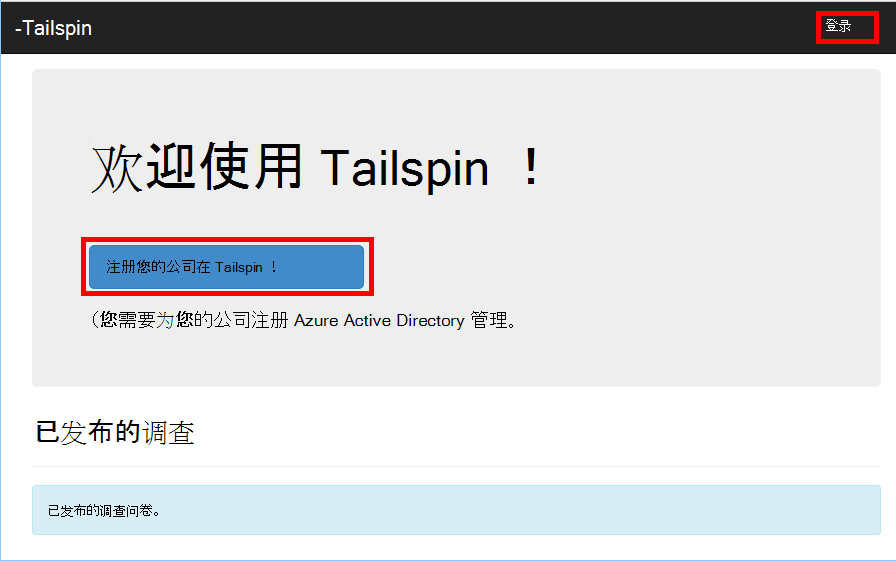
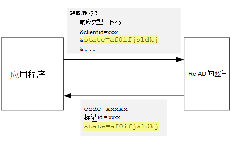

<properties
   pageTitle="注册和租户多租户应用程序中的服务 |Microsoft Azure"
   description="如何在多租户应用程序中的板载承租人"
   services=""
   documentationCenter="na"
   authors="MikeWasson"
   manager="roshar"
   editor=""
   tags=""/>

<tags
   ms.service="guidance"
   ms.devlang="dotnet"
   ms.topic="article"
   ms.tgt_pltfrm="na"
   ms.workload="na"
   ms.date="05/23/2016"
   ms.author="mwasson"/>

# <a name="sign-up-and-tenant-onboarding-in-a-multitenant-application"></a>注册和租户在多租户应用程序的服务

[AZURE.INCLUDE [pnp-header](../../includes/guidance-pnp-header-include.md)]

本文是[一系列的一部分]。 此外，还有伴随这一系列完整[的示例应用程序]。

本指南介绍了如何实现_注册_过程中的多租户应用程序，允许客户注册应用程序的组织。
有几个原因来实现注册过程︰

-   允许 AD 管理员同意为客户的整个组织使用该应用程序。
-   信用卡付款或其他客户信息收集。
-   执行任何应用程序所需的一次性的每个租户安装。

## <a name="admin-consent-and-azure-ad-permissions"></a>管理员同意的情况下和 Azure AD 权限

为了对与 Azure AD 身份验证，应用程序需要访问用户的目录。 至少，应用程序需要读取该用户配置文件的权限。 第一次用户登录时，Azure 的广告显示同意页，其中列出了所请求的权限。 通过单击**接受**，该用户授予对应用程序的权限。

默认情况下，基于每个用户授予许可。 每个登录的用户将看到同意页。 但是，Azure 广告还支持_管理员同意的情况下_，它为整个组织允许 AD 管理员同意。

当使用管理员同意的情况下流动时，同意的情况下页指出 AD 管理员被授予代表整个组织的权限︰


单击**接受**管理后，同一个组织内的其他用户可以登录，Azure 广告跳同意屏幕。

只有 AD 管理员可以授予管理员同意的情况下，因为它授予代表整个组织的权限。 如果非管理员试图通过管理员同意的情况下流量进行身份验证时，Azure 的广告将显示一个错误︰


如果应用程序需要在以后的其他权限，客户将需要重新注册并同意更新权限。  

## <a name="implementing-tenant-sign-up"></a>实现租户签约

[Tailspin 调查][Tailspin]应用程序中，我们定义了几种注册过程要求︰

-   用户可以登录前，承租人必须注册。
-   注册使用管理员同意的情况下流动。
-   注册向应用数据库添加用户的组织。
-   租户报出后，应用程序将显示服务页。

在本节中，我们将逐步介绍注册过程的实现。
务必要了解，"注册"与"中号"是一个应用程序的概念。 在身份验证流程，Azure 广告不本身就知道用户是否正在进行注册。 这取决于应用程序来跟踪上下文。

当匿名用户访问调查应用程序时，用户将显示两个按钮，一个进行签名的还有一个"注册您的公司"（注册）。



这些按钮调用[AccountController]类中的操作。

`SignIn`操作返回**ChallegeResult**，这将导致连接 OpenID 中间件将重定向到身份验证终结点。 这是为在 ASP.NET 1.0 中核心触发身份验证的默认方式。  

```csharp
[AllowAnonymous]
public IActionResult SignIn()
{
    return new ChallengeResult(
        OpenIdConnectDefaults.AuthenticationScheme,
        new AuthenticationProperties
        {
            IsPersistent = true,
            RedirectUri = Url.Action("SignInCallback", "Account")
        });
}
```

现在，比较`SignUp`操作︰

```csharp
[AllowAnonymous]
public IActionResult SignUp()
{
    // Workaround for https://github.com/aspnet/Security/issues/546
    HttpContext.Items.Add("signup", "true");

    var state = new Dictionary<string, string> { { "signup", "true" }};
    return new ChallengeResult(
        OpenIdConnectDefaults.AuthenticationScheme,
        new AuthenticationProperties(state)
        {
            RedirectUri = Url.Action(nameof(SignUpCallback), "Account")
        });
}
```

像`SignIn`，`SignUp`操作也会返回`ChallengeResult`。 但这一次，我们将添加一条状态信息到`AuthenticationProperties`在`ChallengeResult`:

-   注册︰ 一个布尔型标志，指示用户已启动注册过程。

在状态信息`AuthenticationProperties`被添加到 OpenID 连接[状态]参数，该参数在身份验证流期间往返。



用户在 Azure AD 中进行身份验证并获取重新定向到该应用程序后，身份验证票证包含的状态。 我们将使用这一事实，以确保在整个身份验证流量继续存在的"注册"值。

## <a name="adding-the-admin-consent-prompt"></a>添加管理员同意的情况下提示

在 Azure 的广告，将"提示"参数添加到身份验证请求中的查询字符串触发管理员同意流︰

```
/authorize?prompt=admin_consent&...
```

调查应用程序添加过程中的提示`RedirectToAuthenticationEndpoint`事件。 中间件将重定向到身份验证终结点才能正确调用此事件。

```csharp
public override Task RedirectToAuthenticationEndpoint(RedirectContext context)
{
    if (context.IsSigningUp())
    {
        context.ProtocolMessage.Prompt = "admin_consent";
    }

    _logger.RedirectToIdentityProvider();
    return Task.FromResult(0);
}
```

> [AZURE.NOTE] 请参阅[SurveyAuthenticationEvents.cs]。

设置` ProtocolMessage.Prompt`告诉中间件，将"提示"参数添加到身份验证请求。

请注意，提示只需要在注册过程。 正则登录不应包括它。 若要区分它们，我们检查的`signup`中的身份验证状态的值。 下面的扩展方法检查此条件︰

```csharp
internal static bool IsSigningUp(this BaseControlContext context)
{
    Guard.ArgumentNotNull(context, nameof(context));

    string signupValue;
    object obj;
    // Check the HTTP context and convert to string
    if (context.HttpContext.Items.TryGetValue("signup", out obj))
    {
        signupValue = (string)obj;
    }
    else
    {
        // It's not in the HTTP context, so check the authentication ticket.  If it's not there, we aren't signing up.
        if ((context.AuthenticationTicket == null) ||
            (!context.AuthenticationTicket.Properties.Items.TryGetValue("signup", out signupValue)))
        {
            return false;
        }
    }

    // We have found the value, so see if it's valid
    bool isSigningUp;
    if (!bool.TryParse(signupValue, out isSigningUp))
    {
        // The value for signup is not a valid boolean, throw                
        throw new InvalidOperationException($"'{signupValue}' is an invalid boolean value");
    }

    return isSigningUp;
}
```

> [AZURE.NOTE] 请参阅[BaseControlContextExtensions.cs]。

> [AZURE.NOTE] 注意︰ 此代码在 ASP.NET 1.0 RC1 核心包含一个已知的错误的解决方法。 在`RedirectToAuthenticationEndpoint`事件，没有方法来获取身份验证属性包含的"注册"状态。 作为一种变通方法，`AccountController.SignUp`方法也会把"注册"状态为`HttpContext`。 这样做的原因`RedirectToAuthenticationEndpoint`发生之前重定向，所以，我们仍有相同`HttpContext`。

## <a name="registering-a-tenant"></a>注册一个租户

调查应用程序存储在应用数据库中每个租户的一些信息和用户。


在租户表中，IssuerValue 是为租户颁发者声明的值。 对于 Azure 的广告，这是`https://sts.windows.net/<tentantID>`，并提供一个唯一值，每个租户。

当新租户进行签名，调查应用程序写入的租户记录到数据库。 这发生在`AuthenticationValidated`事件。 （不要在此事件中之前, 因为 ID 标记将不会使您不能信任声明值，验证。 请参阅[身份验证]。

以下是从调查应用程序的相关代码︰

```csharp
public override async Task AuthenticationValidated(AuthenticationValidatedContext context)
{
    var principal = context.AuthenticationTicket.Principal;
    var userId = principal.GetObjectIdentifierValue();
    var tenantManager = context.HttpContext.RequestServices.GetService<TenantManager>();
    var userManager = context.HttpContext.RequestServices.GetService<UserManager>();
    var issuerValue = principal.GetIssuerValue();
    _logger.AuthenticationValidated(userId, issuerValue);

    // Normalize the claims first.
    NormalizeClaims(principal);
    var tenant = await tenantManager.FindByIssuerValueAsync(issuerValue)
        .ConfigureAwait(false);

    if (context.IsSigningUp())
    {
        // Originally, we were checking to see if the tenant was non-null, however, this would not allow
        // permission changes to the application in AAD since a re-consent may be required.  Now we just don't
        // try to recreate the tenant.
        if (tenant == null)
        {
            tenant = await SignUpTenantAsync(context, tenantManager)
                .ConfigureAwait(false);
        }

        // In this case, we need to go ahead and set up the user signing us up.
        await CreateOrUpdateUserAsync(context.AuthenticationTicket, userManager, tenant)
            .ConfigureAwait(false);
    }
    else
    {
        if (tenant == null)
        {
            _logger.UnregisteredUserSignInAttempted(userId, issuerValue);
            throw new SecurityTokenValidationException($"Tenant {issuerValue} is not registered");
        }

        await CreateOrUpdateUserAsync(context.AuthenticationTicket, userManager, tenant)
            .ConfigureAwait(false);
    }
}
```

> [AZURE.NOTE] 请参阅[SurveyAuthenticationEvents.cs]。

此代码将执行下列操作︰

1.  检查租户的颁发者值是否已在数据库中。 如果组织尚未签署， `FindByIssuerValueAsync` ，则返回 null。
2.  如果用户注册过程︰
  1.    向数据库中添加租户 (`SignUpTenantAsync`)。
  2.    向数据库中添加身份验证的用户 (`CreateOrUpdateUserAsync`)。
3.  否则，完成正常的签到流︰
  1.    如果在数据库中找不到承租人的颁发者，则表示未注册组织，和客户需要进行注册。 在这种情况下，将引发异常会导致身份验证失败。
  2.    否则，如果没有已创建此用户，数据库记录 (`CreateOrUpdateUserAsync`)。

下面是向数据库中添加租户的[SignUpTenantAsync]方法。

```csharp
private async Task<Tenant> SignUpTenantAsync(BaseControlContext context, TenantManager tenantManager)
{
    Guard.ArgumentNotNull(context, nameof(context));
    Guard.ArgumentNotNull(tenantManager, nameof(tenantManager));

    var principal = context.AuthenticationTicket.Principal;
    var issuerValue = principal.GetIssuerValue();
    var tenant = new Tenant
    {
        IssuerValue = issuerValue,
        Created = DateTimeOffset.UtcNow
    };

    try
    {
        await tenantManager.CreateAsync(tenant)
            .ConfigureAwait(false);
    }
    catch(Exception ex)
    {
        _logger.SignUpTenantFailed(principal.GetObjectIdentifierValue(), issuerValue, ex);
        throw;
    }

    return tenant;
}
```

这里是整个调查应用程序中注册流程的摘要︰

1.  在用户单击**注册**按钮。
2.  `AccountController.SignUp`操作返回的挑战结果。  身份验证状态包括"注册"值。
3.  在`RedirectToAuthenticationEndpoint`事件，添加`admin_consent`提示。
4.  OpenID 连接中间件将重定向到 Azure 的广告，并对用户进行身份验证。
5.  在`AuthenticationValidated`事件，请查看"注册"状态。
6.  将组织添加到数据库中。

## <a name="next-steps"></a>下一步行动

- 阅读本系列的下一篇文章︰[在多租户应用程序的应用程序角色][app roles]


<!-- Links -->
[app roles]: guidance-multitenant-identity-app-roles.md
[Tailspin]: guidance-multitenant-identity-tailspin.md
[一系列的一部分]: guidance-multitenant-identity.md
[AccountController]: https://github.com/Azure-Samples/guidance-identity-management-for-multitenant-apps/blob/master/src/Tailspin.Surveys.Web/Controllers/AccountController.cs
[状态]: http://openid.net/specs/openid-connect-core-1_0.html#AuthRequest
[SurveyAuthenticationEvents.cs]: https://github.com/Azure-Samples/guidance-identity-management-for-multitenant-apps/blob/master/src/Tailspin.Surveys.Web/Security/SurveyAuthenticationEvents.cs
[BaseControlContextExtensions.cs]: https://github.com/Azure-Samples/guidance-identity-management-for-multitenant-apps/blob/master/src/Tailspin.Surveys.Web/Security/BaseControlContextExtensions.cs
[身份验证]: guidance-multitenant-identity-authenticate.md
[SignUpTenantAsync]: https://github.com/Azure-Samples/guidance-identity-management-for-multitenant-apps/blob/master/src/Tailspin.Surveys.Web/Security/SurveyAuthenticationEvents.cs
[示例应用程序]: https://github.com/Azure-Samples/guidance-identity-management-for-multitenant-apps
