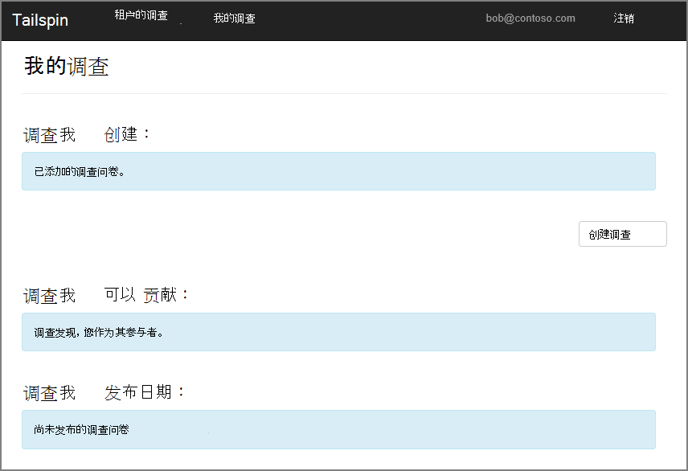
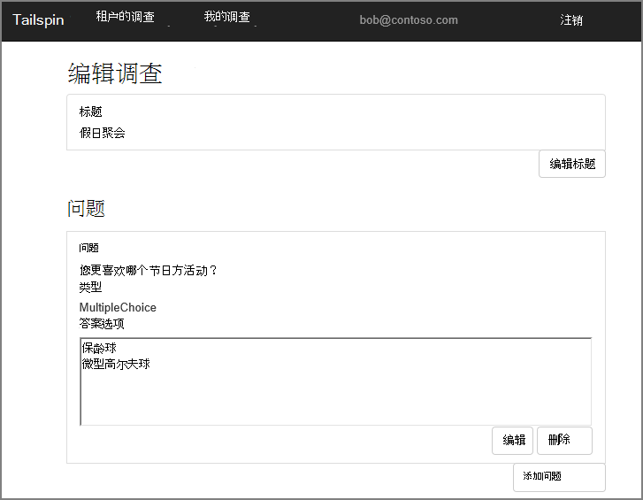
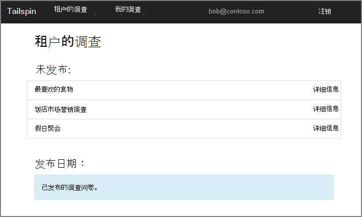
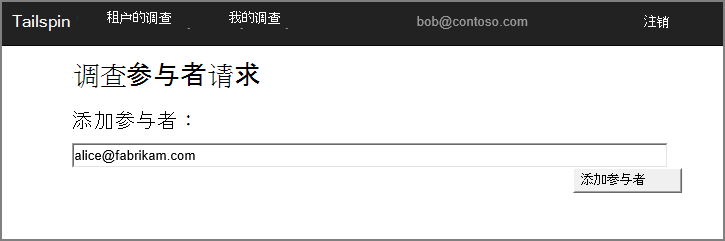
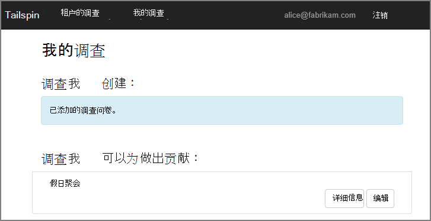
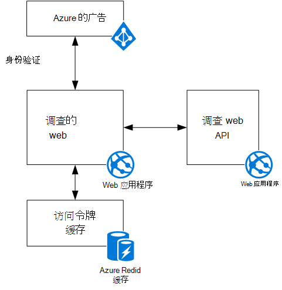

<properties
   pageTitle="关于 Tailspin 调查应用程序 |Microsoft Azure"
   description="Tailspin 调查应用程序概述"
   services=""
   documentationCenter="na"
   authors="MikeWasson"
   manager="roshar"
   editor=""
   tags=""/>

<tags
   ms.service="guidance"
   ms.devlang="dotnet"
   ms.topic="article"
   ms.tgt_pltfrm="na"
   ms.workload="na"
   ms.date="05/23/2016"
   ms.author="mwasson"/>

# 关于 Tailspin 调查应用程序

[AZURE.INCLUDE [pnp-header](../../includes/guidance-pnp-header-include.md)]

本文是[一系列的一部分]。 此外，还有伴随这一系列完整[的示例应用程序]。

Tailspin 是虚构的公司正在开发一个名为调查的 SaaS 应用程序。 此应用程序使公司能够创建和发布在线调查。

- 一个组织可以为应用程序注册。
- 组织注册后，用户可以登录到应用程序中使用其组织的凭据。
- 用户可以创建、 编辑和发布调查。

> [AZURE.NOTE] 要开始使用该应用程序，请参见[运行调查应用程序]。

## 用户可以创建、 编辑和查看调查

身份验证的用户可以查看他或她已创建或具有参与者权限的所有调查和创建新的调查。 请注意用户已登录他的组织身份， `bob@contoso.com`。

此屏幕抓图显示了编辑调查网页︰

用户还可以查看同一个组织内的其他用户创建的任何调查。

## 调查负责人可以邀请参与者

当用户创建调查时，他或她可以邀请其他人来进行的讨论参与者的调查。 参与者可编辑此调查中，但不能删除或将其发布。  

用户可以添加参与者从其他租户，这使得跨租户共享的资源。 在此屏幕快照中，小明 (`bob@contoso.com`) 正在将刘爱琳添加 (`alice@fabrikam.com`) Bob 创建一个调查的参与者。

当刘爱琳记录时，她看到列下面"会导致的调查"的调查。

请注意，Alice 签到自己租户，不是作为 Contoso 租户的访客。 Alice 具有参与者权限，仅对该调查的&mdash;她不能查看其他调查从 Contoso 租户。

## 体系结构

调查应用程序包含一个 web 前端和后端 web API。 两者都是使用[ASP.NET 核心 1.0]来实现的。

Web 应用程序使用 Azure 活动目录 (AD Azure) 对用户进行身份验证。 Web 应用程序还会调用 Azure 的广告来获取 Web API OAuth 2 访问令牌。 在 Azure Redis 缓存中缓存的访问令牌。 高速缓存允许多个实例共享相同的令牌缓存 （例如，在服务器场）。

## 下一步行动

- 阅读本系列的下一篇文章︰[在多租户应用程序，使用 Azure Active Directory 和 OpenID 连接的身份验证][authentication]

<!-- Links -->

[authentication]: guidance-multitenant-identity-authenticate.md
[一系列的一部分]: guidance-multitenant-identity.md
[调查应用程序运行]: https://github.com/Azure-Samples/guidance-identity-management-for-multitenant-apps/blob/master/docs/running-the-app.md
[ASP.NET 1.0 核心]: https://docs.asp.net/en/latest/
[示例应用程序]: https://github.com/Azure-Samples/guidance-identity-management-for-multitenant-apps
