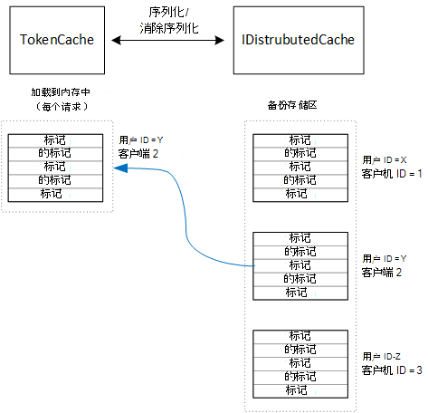

<properties
   pageTitle="缓存在多租户应用程序的访问标记 |Microsoft Azure"
   description="缓存用于调用后端 Web API 的访问令牌"
   services=""
   documentationCenter="na"
   authors="MikeWasson"
   manager="roshar"
   editor=""
   tags=""/>

<tags
   ms.service="guidance"
   ms.devlang="dotnet"
   ms.topic="article"
   ms.tgt_pltfrm="na"
   ms.workload="na"
   ms.date="02/16/2016"
   ms.author="mwasson"/>


# <a name="caching-access-tokens-in-a-multitenant-application"></a>在多租户应用程序的缓存的访问令牌

[AZURE.INCLUDE [pnp-header](../../includes/guidance-pnp-header-include.md)]

本文是[一系列的一部分]。 此外，还有伴随这一系列完整[的示例应用程序]。

它是因为它需要对令牌的终结点的 HTTP 请求获取 OAuth 访问令牌，成本相对较高。 因此，是对缓存标记尽可能好。 [Azure AD 身份验证库][ ADAL] (ADAL) 将自动缓存从 Azure 的广告，其中包括刷新令牌获取令牌。

ADAL 提供了默认令牌缓存实现。 不过，此令牌缓存用于本机客户端应用程序，并且不_是_适合 web 应用程序︰

-   它是一个静态实例和非线程安全。
-   它不扩展到大量用户，因为来自所有用户的令牌进入同一个词典。
-   它不能在 web 场中的服务器之间共享。

相反，应实现自定义的令牌缓存从 ADAL`TokenCache`类但适合服务器环境，并提供所需的标记为不同的用户之间的隔离级别。

`TokenCache`类存储的标记，而索引由颁发者、 资源、 客户机 ID 和用户字典。 自定义令牌缓存应写入后备存储，如 Redis 缓存此字典。

在 Tailspin 调查应用中，`DistributedTokenCache`类实现令牌缓存。 此实现使用[IDistributedCache] [distributed-cache]从 ASP.NET 核心 1.0 的抽象。 这样一来，任何`IDistributedCache`实现可用作备份存储区。

-   默认情况下，调查应用程序使用 Redis 高速缓存。
-   对于单个 web 服务器，您可以使用 ASP.NET 核心 1.0[内存中缓存][in-memory-cache]。 （这也是一个不错的选择，对于在开发过程中本地运行应用程序。）

> [AZURE.NOTE] 当前.NET 核心不支持 Redis 高速缓存。

`DistributedTokenCache`作为后备存储区中的键/值对存储缓存的数据。 关键是用户 ID 和客户 ID，因此后备存储区保存单独的缓存数据对于每个用户/客户端的唯一组合。



由用户分区后备存储区。 对于每个 HTTP 请求，该用户的令牌从后备存储区中读取并加载到`TokenCache`字典。 如果使用 Redis 作为后备存储，服务器场中的每个服务器实例读取/写入到相同的缓存中，并且这种方法可以扩展到多个用户。

## <a name="encrypting-cached-tokens"></a>加密令牌缓存

标记是敏感的数据，因为他们授予访问权限的用户的资源。 （此外，不同用户的密码，不能只是存储标记的哈希值。）因此，很重要，要保护令牌不会受到攻击。 Redis 备份缓存受密码保护，但如果有人获得密码，他们就可以得到所有的缓存的访问令牌。 由于这个原因，`DistributedTokenCache`加密写入后备存储，它的所有内容。 加密是使用 ASP.NET 核心 1.0[数据保护][ data-protection] Api。

> [AZURE.NOTE] 如果要部署到 Azure 网站，备份到网络存储和跨所有机同步加密密钥 ([密钥管理]，请参阅[key-management])。 默认情况下，密钥不加密时运行在 Azure 的 Web 站点，但您可以[启用加密使用 X.509 证书][x509-cert-encryption]。


## <a name="distributedtokencache-implementation"></a>DistributedTokenCache 实现

[DistributedTokenCache] [ DistributedTokenCache] ADAL [TokenCache]从派生类[tokencache-class]类。

在构造函数中，`DistributedTokenCache`类创建当前用户的密钥，并从后备存储区加载缓存︰

```csharp
public DistributedTokenCache(
    ClaimsPrincipal claimsPrincipal,
    IDistributedCache distributedCache,
    ILoggerFactory loggerFactory,
    IDataProtectionProvider dataProtectionProvider)
    : base()
{
    _claimsPrincipal = claimsPrincipal;
    _cacheKey = BuildCacheKey(_claimsPrincipal);
    _distributedCache = distributedCache;
    _logger = loggerFactory.CreateLogger<DistributedTokenCache>();
    _protector = dataProtectionProvider.CreateProtector(typeof(DistributedTokenCache).FullName);
    AfterAccess = AfterAccessNotification;
    LoadFromCache();
}
```

该密钥创建的连接的用户 ID 和客户 id。 这两种取自索赔中用户的`ClaimsPrincipal`:

```csharp
private static string BuildCacheKey(ClaimsPrincipal claimsPrincipal)
{
    string clientId = claimsPrincipal.FindFirstValue("aud", true);
    return string.Format(
        "UserId:{0}::ClientId:{1}",
        claimsPrincipal.GetObjectIdentifierValue(),
        clientId);
}
```

若要加载的缓存数据，读取序列化的 blob 从后备存储和调用`TokenCache.Deserialize`将 blob 转换为缓存数据。

```csharp
private void LoadFromCache()
{
    byte[] cacheData = _distributedCache.Get(_cacheKey);
    if (cacheData != null)
    {
        this.Deserialize(_protector.Unprotect(cacheData));
    }
}
```

每当 ADAL 访问缓存，它激发`AfterAccess`事件。 如果已更改的缓存数据，`HasStateChanged`属性为 true。 在这种情况下，更新的备份存储区来反映这些更改，并将`HasStateChanged`为假。

```csharp
public void AfterAccessNotification(TokenCacheNotificationArgs args)
{
    if (this.HasStateChanged)
    {
        try
        {
            if (this.Count > 0)
            {
                _distributedCache.Set(_cacheKey, _protector.Protect(this.Serialize()));
            }
            else
            {
                // There are no tokens for this user/client, so remove the item from the cache.
                _distributedCache.Remove(_cacheKey);
            }
            this.HasStateChanged = false;
        }
        catch (Exception exp)
        {
            _logger.WriteToCacheFailed(exp);
            throw;
        }
    }
}
```

TokenCache 将发送其他两个事件︰

- `BeforeWrite`. ADAL 将写入缓存之前调用。 您可以使用此实现并发策略
- `BeforeAccess`. 从缓存中读取 ADAL 之前调用。 这里您可以重新加载缓存，以获取最新版本。

在我们的例子中，我们决定不处理这两个事件。

- 为并发性，最后一次写 wins。 这没关系，因为标记存储单独为每个用户 + 客户端，因此，如果同一用户有两个并发的登录会话，只会出现冲突。
- 对于阅读，我们加载缓存在每次请求。 请求是短期的。 如果在这段时间，获取修改缓存下, 一个请求将选取新值。

## <a name="next-steps"></a>下一步行动

- 阅读本系列的下一篇文章︰[与客户的 AD FS 的 Azure 中的多租户应用程序进行联盟][adfs]

<!-- links -->
[ADAL]: https://msdn.microsoft.com/library/azure/jj573266.aspx
[adfs]: guidance-multitenant-identity-adfs.md
[data-protection]: https://docs.asp.net/en/latest/security/data-protection/index.html
[distributed-cache]: https://docs.asp.net/en/latest/fundamentals/distributed-cache.html
[DistributedTokenCache]: https://github.com/Azure-Samples/guidance-identity-management-for-multitenant-apps/blob/master/src/Tailspin.Surveys.TokenStorage/DistributedTokenCache.cs
[key-management]: https://docs.asp.net/en/latest/security/data-protection/configuration/default-settings.html
[in-memory-cache]: https://docs.asp.net/en/latest/fundamentals/caching.html
[tokencache-class]: https://msdn.microsoft.com/library/azure/microsoft.identitymodel.clients.activedirectory.tokencache.aspx
[x509-cert-encryption]: https://docs.asp.net/en/latest/security/data-protection/implementation/key-encryption-at-rest.html#x-509-certificate
[一系列的一部分]: guidance-multitenant-identity.md
[示例应用程序]: https://github.com/Azure-Samples/guidance-identity-management-for-multitenant-apps
