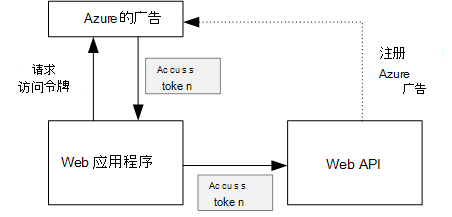
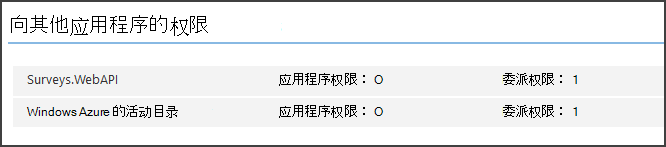

<properties
   pageTitle="保护后端 web API 在多租户应用程序 |Microsoft Azure"
   description="如何确保后端 web API 的安全"
   services=""
   documentationCenter="na"
   authors="MikeWasson"
   manager="roshar"
   editor=""
   tags=""/>

<tags
   ms.service="guidance"
   ms.devlang="dotnet"
   ms.topic="article"
   ms.tgt_pltfrm="na"
   ms.workload="na"
   ms.date="06/02/2016"
   ms.author="mwasson"/>

# <a name="securing-a-backend-web-api-in-a-multitenant-application"></a>确保后端 web API 在多租户应用程序的安全

[AZURE.INCLUDE [pnp-header](../../includes/guidance-pnp-header-include.md)]

本文是[一系列的一部分]。 此外，还有伴随这一系列完整[的示例应用程序]。

[Tailspin 调查]应用程序使用一个后端 web API 来管理上调查的 CRUD 操作。 例如，当用户单击"我的调查"，web 应用程序将 HTTP 请求发送到 web API:

```
GET /users/{userId}/surveys
```

Web API 返回的 JSON 对象︰

```
{
  "Published":[],
  "Own":[
    {"Id":1,"Title":"Survey 1"},
    {"Id":3,"Title":"Survey 3"},
    ],
  "Contribute": [{"Id":8,"Title":"My survey"}]
}
```

Web API 不允许匿名请求，从而使 web 应用程序必须进行自我使用 OAuth 2 载体令牌进行验证。

> [AZURE.NOTE] 这是服务器到服务器的情形。 应用程序没有提出任何 AJAX 调用 API 从浏览器客户端。

有两种主要方法，您可以︰

- 委派的用户标识。 Web 应用程序与用户的身份进行身份验证。
- 应用程序标识。 通过使用 OAuth2 客户端凭据流的客户端 ID 身份验证 web 应用程序。

Tailspin 应用程序实现委派的用户标识。 下面是主要的差别︰

**委派的用户标识**

- 发送到 web API 的载体令牌包含的用户标识。
- Web API 使授权基于用户身份的决定。
- Web 应用程序需要处理来自 web API，403 （禁止） 错误，如果用户将无权执行某项操作。
- 通常情况下，web 应用程序仍然作出一些授权决定会影响用户界面，例如显示或隐藏用户界面元素）。
- 可能通过不受信任的客户端，例如 JavaScript 应用程序或本机客户端应用程序可用的 web API。

**应用程序标识**

- Web API 不会获取关于用户的信息。
- Web API 无法执行基于用户标识的任何授权。 所有授权决策由 web 应用程序。  
- 无法使用 web API 不受信任的客户端 （JavaScript 或本机客户端应用程序）。
- 这种方法可能一定程度上容易实现，因为 Web API 中没有任何授权逻辑。

这两种方法，在 web 应用程序必须获取一个访问令牌，即调用 web API 所需的凭据。

- 委派的用户身份令牌中包含来自 IDP，可以颁发了代表该用户的令牌。

- 客户端凭据，应用程序可能从 IDP 获取令牌或承载自己令牌服务器。 (但不要从头开始编写一个令牌服务器; 使用经过像[IdentityServer3]框架。)如果您使用 Azure AD 身份验证，强烈建议从 Azure 的广告，即使使用客户端凭据流获取访问令牌。

本文的其余部分假定使用 Azure AD 身份验证应用程序。



## <a name="register-the-web-api-in-azure-ad"></a>在 Azure AD 中注册 web API

为了 Azure 广告发出的 web API 的持有者标记，您需要配置 Azure AD 中的某些内容。

1. [注册 web API 在 Azure 的广告]。

2. 在添加 web API 的应用程序清单，使 web 应用程序的客户端 ID`knownClientApplications`属性。 请参阅[更新应用程序清单]。

3. [为 web 应用程序授予权限调用 web API]。

  在 Azure 管理门户中，您可以设置两种类型的权限︰ 对于应用程序标识 (客户端凭据 flow) 或委派的用户标识的"委派权限"的"应用程序权限"。

  

## <a name="getting-an-access-token"></a>获取一个访问令牌

在调用之前 web API，web 应用程序获取访问令牌从 Azure AD。 在.NET 应用程序中，使用[Azure AD 身份验证库 (ADAL) 为使.NET][ADAL]。

OAuth 2 授权代码流中，在应用程序交换访问令牌授权码。 下面的代码使用 ADAL 以获取访问令牌。 在过程中调用此代码`AuthorizationCodeReceived`事件。

```csharp
// The OpenID Connect middleware sends this event when it gets the authorization code.   
public override async Task AuthorizationCodeReceived(AuthorizationCodeReceivedContext context)
{
    string authorizationCode = context.ProtocolMessage.Code;
    string authority = "https://login.microsoftonline.com/" + tenantID
    string resourceID = "https://tailspin.onmicrosoft.com/surveys.webapi" // App ID URI
    ClientCredential credential = new ClientCredential(clientId, clientSecret);

    AuthenticationContext authContext = new AuthenticationContext(authority, tokenCache);
    AuthenticationResult authResult = await authContext.AcquireTokenByAuthorizationCodeAsync(
        authorizationCode, new Uri(redirectUri), credential, resourceID);

    // If successful, the token is in authResult.AccessToken
}
```

下面是所需的各种参数︰

- `authority`. 从租户的登录的用户的 ID。 (不是 SaaS 提供商的租户 ID)  
- `authorizationCode`. 你回从 IDP 授权码。
- `clientId`. Web 应用程序的客户端 id。
- `clientSecret`. Web 应用程序的客户端密码。
- `redirectUri`. 重定向 URI 为 OpenID 设置连接。 这是 IDP 回调与标记。
- `resourceID`. 应用程序 ID URI 的 web API，Azure AD 中注册 web API 时创建的
- `tokenCache`. 一个对象，将缓存的访问令牌。 请参阅[令牌缓存]。

如果`AcquireTokenByAuthorizationCodeAsync`成功，ADAL 将缓存该标记。 以后，可以通过调用 AcquireTokenSilentAsync 从缓存获取令牌︰

```csharp
AuthenticationContext authContext = new AuthenticationContext(authority, tokenCache);
var result = await authContext.AcquireTokenSilentAsync(resourceID, credential, new UserIdentifier(userId, UserIdentifierType.UniqueId));
```

其中`userId`中找到的用户的对象 id`http://schemas.microsoft.com/identity/claims/objectidentifier`说。

## <a name="using-the-access-token-to-call-the-web-api"></a>用于调用 web API 访问令牌

一旦该标记，将其发送 HTTP 请求的授权标头中给 web API。

```
Authorization: Bearer xxxxxxxxxx
```

从调查应用程序下面的扩展方法在 HTTP 请求时，使用**HttpClient**类设置身份验证头。

```csharp
public static async Task<HttpResponseMessage> SendRequestWithBearerTokenAsync(this HttpClient httpClient, HttpMethod method, string path, object requestBody, string accessToken, CancellationToken ct)
{
    var request = new HttpRequestMessage(method, path);
    if (requestBody != null)
    {
        var json = JsonConvert.SerializeObject(requestBody, Formatting.None);
        var content = new StringContent(json, Encoding.UTF8, "application/json");
        request.Content = content;
    }

    request.Headers.Authorization = new AuthenticationHeaderValue("Bearer", accessToken);
    request.Headers.Accept.Add(new MediaTypeWithQualityHeaderValue("application/json"));

    var response = await httpClient.SendAsync(request, ct);
    return response;
}
```

> [AZURE.NOTE] 请参阅[HttpClientExtensions.cs]。

## <a name="authenticating-in-the-web-api"></a>身份验证在 web API

Web API 必须对持有者令牌进行身份验证。 在 ASP.NET 核心 1.0 中，您可以使用[Microsoft.AspNet.Authentication.JwtBearer] [JwtBearer]软件包。 此产品包提供了使应用程序以接收 OpenID 连接载体标记的中间件。

在您的 web API 注册中间件`Startup`类。

```csharp
app.UseJwtBearerAuthentication(options =>
{
    options.Audience = "[app ID URI]";
    options.Authority = "https://login.microsoftonline.com/common/";
    options.TokenValidationParameters = new TokenValidationParameters
    {
        //Instead of validating against a fixed set of known issuers, we perform custom multi-tenant validation logic
        ValidateIssuer = false,
    };
    options.Events = new SurveysJwtBearerEvents();
});
```

> [AZURE.NOTE] 请参阅[Startup.cs]。

- **访问群体**。 将其设置为 web API，应用程序 ID URL 时使用 Azure AD 注册 web API 创建的。
- **颁发机构**。 对于多租户应用程序，请将它设置为`https://login.microsoftonline.com/common/`。
- **TokenValidationParameters**。 对于多租户应用程序，将**ValidateIssuer**设置为 false。 这意味着，应用程序将验证颁发者。
- **事件**是从**JwtBearerEvents**派生的类。

### <a name="issuer-validation"></a>颁发者验证

验证令牌颁发者在**JwtBearerEvents.ValidatedToken**事件中。 颁发者发送"iss"索赔。

在调查应用程序，web API 不处理[租户签约]。 因此，它只是检查颁发者已在应用数据库。 如果没有，则会引发异常，从而导致身份验证失败。

```csharp
public override async Task ValidatedToken(ValidatedTokenContext context)
{
    var principal = context.AuthenticationTicket.Principal;
    var tenantManager = context.HttpContext.RequestServices.GetService<TenantManager>();
    var userManager = context.HttpContext.RequestServices.GetService<UserManager>();
    var issuerValue = principal.GetIssuerValue();
    var tenant = await tenantManager.FindByIssuerValueAsync(issuerValue);

    if (tenant == null)
    {
        // the caller was not from a trusted issuer - throw to block the authentication flow
        throw new SecurityTokenValidationException();
    }
}
```

> [AZURE.NOTE] 请参阅[SurveysJwtBearerEvents.cs]。

您还可以使用**ValidatedToken**事件进行[声明转换]。 请记住索赔是直接来自 Azure 的广告，因此，如果 web 应用程序所做声明的任何变换，那些不会反映在该载体标记 web API 接收。

## <a name="authorization"></a>授权

有关授权的常规讨论，请参见[基于角色和基于资源的授权][Authorization]。 

JwtBearer 中间件处理授权响应。 例如，要限制为经过身份验证的用户的控制器操作，请使用**[授权]** atrribute 和**JwtBearerDefaults.AuthenticationScheme**指定的身份验证方案︰

```csharp
[Authorize(ActiveAuthenticationSchemes = JwtBearerDefaults.AuthenticationScheme)]
```

如果用户未通过身份验证，这将返回 401 状态代码。

Authorizaton 策略限制控制器操作，请在**[授权]**属性指定策略名称︰

```csharp
[Authorize(Policy = PolicyNames.RequireSurveyCreator)]
```

这将返回 401 状态代码如果用户未通过身份验证，以及 403 如果用户是通过身份验证但未被授权。 注册在启动时的策略︰

```csharp
public void ConfigureServices(IServiceCollection services)
{
    services.AddAuthorization(options =>
    {
        options.AddPolicy(PolicyNames.RequireSurveyCreator,
            policy =>
            {
                policy.AddRequirements(new SurveyCreatorRequirement());
                policy.AddAuthenticationSchemes(JwtBearerDefaults.AuthenticationScheme);
            });
    });
}
```

## <a name="next-steps"></a>下一步行动

- 阅读本系列的下一篇文章︰[在多租户应用程序的缓存的访问令牌][token cache]

<!-- links -->
[ADAL]: https://msdn.microsoft.com/library/azure/jj573266.aspx
[JwtBearer]: https://www.nuget.org/packages/Microsoft.AspNet.Authentication.JwtBearer
[一系列的一部分]: guidance-multitenant-identity.md
[Tailspin 调查]: guidance-multitenant-identity-tailspin.md
[IdentityServer3]: https://github.com/IdentityServer/IdentityServer3
[在 Azure AD 中注册 web API]: https://github.com/Azure-Samples/guidance-identity-management-for-multitenant-apps/blob/master/docs/running-the-app.md#register-the-surveys-web-api
[更新应用程序清单]: https://github.com/Azure-Samples/guidance-identity-management-for-multitenant-apps/blob/master/docs/running-the-app.md#update-the-application-manifests
[为 web 应用程序授予权限调用 web API]: https://github.com/Azure-Samples/guidance-identity-management-for-multitenant-apps/blob/master/docs/running-the-app.md#give-the-web-app-permissions-to-call-the-web-api
[令牌缓存]: guidance-multitenant-identity-token-cache.md
[HttpClientExtensions.cs]: https://github.com/Azure-Samples/guidance-identity-management-for-multitenant-apps/blob/master/src/Tailspin.Surveys.Common/HttpClientExtensions.cs
[Startup.cs]: https://github.com/Azure-Samples/guidance-identity-management-for-multitenant-apps/blob/master/src/Tailspin.Surveys.WebAPI/Startup.cs
[租户签约]: guidance-multitenant-identity-signup.md
[SurveysJwtBearerEvents.cs]: https://github.com/Azure-Samples/guidance-identity-management-for-multitenant-apps/blob/master/src/Tailspin.Surveys.WebAPI/SurveyJwtBearerEvents.cs
[声明转换]: guidance-multitenant-identity-claims.md#claims-transformations
[Authorization]: guidance-multitenant-identity-authorize.md
[示例应用程序]: https://github.com/Azure-Samples/guidance-identity-management-for-multitenant-apps
[token cache]: guidance-multitenant-identity-token-cache.md
