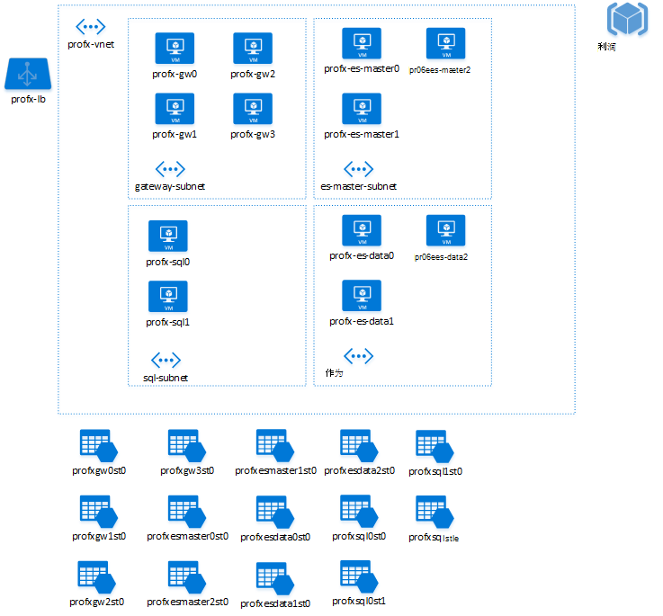

<properties
   pageTitle="建议使用 Azure 的资源命名规则 |指导 |Microsoft Azure"
   description="Azure 资源建议的命名约定。 如何命名虚拟机、 帐户存储、 网络、 虚拟网络、 子网和其他 Azure 的实体"
   services=""
   documentationCenter="na"
   authors="bennage"
   manager="marksou"
   editor=""
   tags=""/>

<tags
   ms.service="guidance"
   ms.devlang="na"
   ms.topic="article"
   ms.tgt_pltfrm="na"
   ms.workload="na"
   ms.date="08/27/2016"
   ms.author="christb"/>
   
# <a name="recommended-naming-conventions-for-azure-resources"></a>推荐的命名约定，Azure 的资源

[AZURE.INCLUDE [pnp-header](../../includes/guidance-pnp-header-include.md)]

在 Microsoft Azure 中所有资源的名称的选择是重要原因︰

- 很难在以后更改名称。
- 名称必须符合其特定资源类型的要求。

一致的命名约定可以轻松地找到资源。 它们也可能表明一个解决方案中的某个资源的角色。

这篇文章是命名规则和 Azure 的资源限制的摘要和建议的命名约定的基准集。  可用于这些建议作为起始点自己约定特定于您的需要。  

通过使用命名约定取得成功的关键是建立并按照它们在您的应用程序和组织。 

## <a name="naming-subscriptions"></a>命名订阅

在命名时 Azure 订阅，详细名称进行了解上下文和清除每个订阅的目的。  当有许多订阅的环境中工作，遵循共享命名约定可以提高清晰度。

推荐的命名订阅模式是︰

`<Company> <Department (optional)> <Product Line (optional)> <Environment>`

- 公司通常会为每个订阅相同。 但是，一些公司可能有子公司内部的组织结构。 这些公司可能会由一个中央 IT 组进行管理。 在这些情况下，它们可能具有的母公司名称 (*Contoso*) 和子公司名称 （*北美风*） 区别。

- 部门是组织内的名称的一组人工作。 此项为可选的命名空间中。

- 产品线是特定产品或部门内执行的函数的名称。
这是通常设置为可选的面向内部的服务和应用程序。 但是，强烈建议使用需要易于分离和识别 （如计费记录清晰分离） 的面向公众的服务。

- 环境是描述应用程序或服务，例如，开发人员、 QA、 或生产的部署生命周期的名称。

| 公司 | 部门 | 产品线或服务 | 环境 | 全名  |
----------| ---------- | ----------------------- | ----------- | ---------- |
| Contoso | SocialGaming | AwesomeService | 生产 | Contoso SocialGaming AwesomeService 生产 |
| Contoso | SocialGaming | AwesomeService | 适用于开发人员 | Contoso SocialGaming AwesomeService 开发 |
| Contoso | 它 | InternalApps | 生产 | Contoso IT InternalApps 生产 |
| Contoso | 它 | InternalApps | 适用于开发人员 | Contoso IT InternalApps 开发 |

<!-- TODO; include more information about organizing subscriptions for application deployment, pods, etc. -->

## <a name="use-affixes-to-avoid-ambiguity"></a>使用词缀来避免多义性

当命名 Azure 中的资源，建议使用通用前缀或后缀来识别的类型和上下文的资源。  类型、 元数据、 有关的所有信息时的上下文中，可通过编程方式，应用常用词缀简化了视觉标识。  合并到您的命名约定的词缀，时，一定要明确说明是否词缀是名称 （前缀） 的开头或结尾 （后缀）。  

例如，下面是两个可能名称中的承载计算引擎的服务︰

- SvcCalculationEngine （前缀）
- CalculationEngineSvc （后缀）

词缀可以指描述特定资源的不同方面。 下表显示了一些示例通常使用。

| 长宽 | 示例 | 备注 |
| ------ | ------- | ----- |
| 环境 | 开发，生产，质量评估 | 标识资源环境 |
| 位置 | uw （美国西），ue （美国东） | 标识资源部署到该区域 |
| 实例 | 01、 02 | 对于资源，具有多个命名的实例 （web 服务器等）。 |
| 产品或服务 | 服务 | 标识产品、 应用程序或资源支持服务 |
| 角色 | sql web、 消息服务 | 标识相关联的资源的角色 |

开发您的公司或项目的特定命名约定，时，重要的是要选择一组通用的词缀，它们的位置 （后缀或前缀）。

## <a name="naming-rules-and-restrictions"></a>命名规则和限制

在 Azure 中的每个资源或服务类型强制实施一套命名限制和范围;任何命名约定或图案必须遵守的必备项的命名规则和作用域。  例如，虚拟机的名称映射到一个 DNS 名称 （并因此需要在所有 Azure 都是唯一的），而 VNET 的名称的作用范围是该资源组中创建它。

一般情况下，避免任何特殊字符 (`-`或`_`) 作为第一个或最后一个字符中的任何名称。 这些字符将导致大多数失败的验证规则。

| 类别 | 服务或实体 | 作用域 | 长度 | 大小写 | 有效的字符 | 建议的模式 | 示例 |
| ------------- | ----------------- | ----- | ------ | ------ | ---------------- | ----------------- | ------- |
| 资源组 | 资源组 | 全局 | 1-64 | 区分大小写 | 字母数字、 下划线和连字符 | `<service short name>-<environment>-rg` | `profx-prod-rg` |
| 资源组 | 可用性设置 | 资源组 | 1-80 | 区分大小写 | 字母数字、 下划线和连字符 | `<service-short-name>-<context>-as` | `profx-sql-as` |
| 常规 | 标记 | 关联的实体 | 512 （名称）、 256 （值） | 区分大小写 | 字母数字 | `"key" : "value"` | `"department" : "Central IT"` |
| 计算 | 虚拟机 | 资源组 | 1-15 | 区分大小写 | 字母数字、 下划线和连字符 | `<name>-<role>-<instance>` | `profx-sql-001` |
| 存储 | 存储帐户名称 （数据） | 全局 | 3 日至 24 日 | 小写字母 | 字母数字 | `<service short name><type><number>` | `profxdata001` |
| 存储 | 存储帐户名称 （磁盘） | 全局 | 3 日至 24 日 | 小写字母 | 字母数字 | `<vm name without dashes>st<number>` | `profxsql001st0` |
| 存储 | 容器名称 | 存储帐户 | 3 63 |   小写字母 | 字母数字和短划线 | `<context>` | `logs` |
| 存储 | Blob 名称 | 容器 | 1-1024 | 区分大小写 | 任何 URL 字符 | `<variable based on blob usage>` | `<variable based on blob usage>` |
| 存储 | 队列名称 | 存储帐户 | 3 63 | 小写字母 | 字母数字和短划线 | `<service short name>-<context>-<num>` | `awesomeservice-messages-001` |
| 存储 | 表名 | 存储帐户 | 3 63 |区分大小写 | 字母数字 | `<service short name>-<context>` | `awesomeservice-logs` |
| 存储 | 文件名称 | 存储帐户 | 3 63 | 小写字母 | 字母数字 | `<variable based on blob usage>` | `<variable based on blob usage>` |
| 网络连接 | 虚拟网络 (VNet) | 资源组 | 2-64 | 不区分大小写 | 字母数字、 破折号、 下划线和句点 | `<service short name>-[section]-vnet` | `profx-vnet` |
| 网络连接 | 子网 | 父 VNet | 2-80 | 不区分大小写 | 字母数字、 下划线、 短划线和期间 | `<role>-subnet` | `gateway-subnet` |
| 网络连接 | 网络接口 | 资源组 | 1-80 | 不区分大小写 | 字母数字、 破折号、 下划线和句点 | `<vmname>-<num>nic` | `profx-sql1-1nic` |
| 网络连接 | 网络安全组 | 资源组 | 1-80 | 不区分大小写 | 字母数字、 破折号、 下划线和句点 | `<service short name>-<context>-nsg` | `profx-app-nsg` |
| 网络连接 | 网络安全组的规则 | 资源组 | 1-80 | 不区分大小写 | 字母数字、 破折号、 下划线和句点 | `<descriptive context>` | `sql-allow` |
| 网络连接 | 公用 IP 地址 | 资源组 | 1-80 | 不区分大小写 | 字母数字、 破折号、 下划线和句点 | `<vm or service name>-pip` | `profx-sql1-pip` |
| 网络连接 | 负载平衡器 | 资源组 | 1-80 | 不区分大小写 | 字母数字、 破折号、 下划线和句点 | `<service or role>-lb` | `profx-lb` |
| 网络连接 | 负载平衡的规则配置 | 负载平衡器 | 1-80 | 不区分大小写 | 字母数字、 破折号、 下划线和句点 | `descriptive context` | `http` |

<!-- TODO fill in the rest of these resources
| Networking | Azure Application Gateway | Resource Group | 1-80 | Case-insensitive | Alphanumeric, dash, underscore, and period | `<service or role>-aag` | `profx-aag`
| Networking | Azure Application Gateway Connection | Azure Application Gateway | 1-80 | Case-insensitive | Alphanumeric, dash, underscore, and period | `` | TODO
| Networking | Traffic Manager Profile | Resource Group | 1-80 | Case-insensitive | Alphanumeric, dash, underscore, and period | TODO | TODO
-->

## <a name="organizing-resources-with-tags"></a>组织资源与标记

Azure 资源管理器支持任意文本字符串来标识上下文和优化自动化的标签实体。  例如，标记`"sqlVersion: "sql2014ee"`在部署中运行 SQL Server 2014年企业版针对它们运行自动化的脚本无法识别虚拟机。  标记应当用于补充并加强沿边选择的命名规则的上下文。

> [AZURE.TIP]其他的标记的一个优点是标记跨资源组，从而允许您链接以及跨不同部署关联的实体。

每个资源或资源组可以有最多**15**标记。 标记名称不能超过 512 个字符，且限制为 256 个字符的标记值。

有关标记的资源的详细信息，请参阅[使用标签来组织您的 Azure 资源](../resource-group-using-tags.md)。

下面是一些常见的标记使用案例︰

- **帐单**;将资源分组，并将其与帐单或费用回代码。
- **服务上下文标识**;确定资源组跨资源组常见操作和分组
- **访问控制和安全上下文**。管理角色根据产品组合、 系统、 服务、 应用程序、 实例等标识。

> [AZURE.TIP]早期的标记通常标记。  最好具有基准标记方案中的位置和调整时间，而不是让事实后翻新过。  

一些常用的标记方法的示例︰

| 标记名称 | 密钥 | 示例 | 注释 |
| -------- | --- | ------- | ------- |
| 物料清单 / 内部存储容量使用计费 ID | 帐单寄往  | `IT-Chargeback-1234` | 内部 I/O 或帐单代码 |
| 运算符或直接责任人 (DRI) | managedBy | `joe@contoso.com`  | 别名或电子邮件地址 |
| 项目名称 | 项目名称 | `myproject`  | 项目或产品线的名称 |
| 项目版本 | 项目版本 | `3.4`  | 版本的项目或产品线 |
| 环境 | 环境 | `<Production, Staging, QA >` | 环境标识符 | 
| 层 | 层 | `Front End, Back End, Data` | 层或角色/上下文标识 |
| 数据配置文件 | dataProfile | `Public, Confidential, Restricted, Internal` | 区分大小写的资源中存储的数据 |
 
## <a name="tips-and-tricks"></a>提示和技巧

某些类型的资源可能需要命名和约定的其他治疗。

### <a name="virtual-machines"></a>虚拟机

尤其是在大型拓扑中，确定的角色和用途的每台计算机，并启用更可预知的脚本优化仔细命名虚拟机。

> [AZURE.WARNING]在 Azure 中的每个虚拟机有一个 Azure 的资源的名称和操作系统主机名。  
> 如果资源名称和主机名不同，管理虚拟机可能具有挑战性，应避免使用。
> 例如，如果已从.vhd 创建虚拟机包含主机名配置的操作系统。

- [Windows 服务器的虚拟机的命名约定](https://support.microsoft.com/en-us/kb/188997)

<!-- TODO - recommendations on naming VMs. -->

### <a name="storage-accounts-and-storage-entities"></a>存储帐户和存储的实体

有两种主要使用情况，对存储帐户的备份磁盘用于虚拟机，然后存储 blob、 队列和表中的数据。  用于虚拟机磁盘存储帐户应遵循命名约定将它们与父虚拟机名称相关联的 （而且与高端 VM Sku 了可能需要多个存储帐户，还应用后缀）。

> [AZURE.TIP]有关数据或多个磁盘的存储帐户-应遵循命名约定，以便为利用 （即始终使用数字后缀） 的多个存储帐户。

它可以配置自定义域名在 Azure 存储帐户中的 blob 数据访问。
Blob 服务的默认终结点为`https://mystorage.blob.core.windows.net`。

但如果您为您的存储帐户到 blob 的终结点映射自定义域 （如 www.contoso.com)，您可以通过使用该域的 blob 存储帐户中的数据。 例如，对于一个自定义的域名，`http://mystorage.blob.core.windows.net/mycontainer/myblob`可以用来访问`http://www.contoso.com/mycontainer/myblob`。

有关配置此功能的更多信息，请参阅[配置自定义域名为 Blob 存储终结点](../storage/storage-custom-domain-name.md)。

有关命名 blob、 容器和表的详细信息︰

- [命名和引用容器、 Blob 和元数据](https://msdn.microsoft.com/library/dd135715.aspx)
- [命名的队列和元数据](https://msdn.microsoft.com/library/dd179349.aspx)
- [命名表](https://msdn.microsoft.com/library/azure/dd179338.aspx)

Blob 名称可以包含任何字符组合，但保留的 URL 字符必须正确地转义。 避免使用 blob 名称以句点 （.）、 正斜杠 （/） 结尾的序列或两者的组合。 按照惯例，正斜杠是**虚拟**目录分隔符。 不要使用反斜杠 (\)中的 blob 名称。 客户端 Api 可能会允许它，但是不能正常，哈希和签名不匹配。

不能修改已创建存储帐户或容器的名称。
如果您想要使用一个新名称，必须删除它并重新创建一个。

> [AZURE.TIP] 我们建议您然后再着手开发新的服务或应用程序建立命名约定为所有存储帐户和类型。

## <a name="example---deploying-an-n-tier-service"></a>示例-部署 n 层服务

在此示例中，我们定义 n 层服务的配置，包含前端 IIS 服务器 （驻留在 Windows 服务器的虚拟机），与 SQL Server （承载于两个 Windows 服务器的虚拟机），（6 Linux 虚拟机中承载） ElasticSearch 群集和关联的存储帐户，虚拟的网络中，资源组和负载平衡器。

我们首先定义此应用程序的上下文规则︰

| 实体 | 约定 | 说明  |
| ------ | ---------- | ------------ |  
| 服务名称 | `profx` | 短名称的应用程序或服务进行部署 |
| 环境 | `prod` | 这是用于生产部署 （而不是质量评估、 测试，等等。） |

该基线从我们可以然后制订惯例为每种资源类型︰

| 资源类型 | 约定基 | 示例 |
| ------------- | --------------- | ------- |
| 订阅 | `<Company> <Department (optional)> <Product Line (optional)> <Environment>` | `Contoso IT InternalApps Profx Production` |
| 资源组 | `servicename-rg` | `profx-rg` |
| 虚拟网络 | `servicename-vnet` | `profx-vnet` |
| 子网 | `role-subnet` | `sql-vnet` |
| 负载平衡器 | `servicename-lb` | `profx-lb` |
| 虚拟机 | `servicename-role[number]` | `profx-sql0` |
| 存储帐户 | `<vmnamenodashes>st<num>` | `profxsql0st0` |

在下面的图所示︰



## <a name="sample---azure-cli-script-for-deploying-the-sample-above"></a>示例-Azure CLI 脚本部署上面的示例

```bash
#!/bin/sh

#####################################################################
# Sample script using the Azure CLI to build out an application 
# demonstrating naming conventions.  
#
# Note; this script is not intended for production deployment, as it does 
# not create availability sets, configure network security rules, etc.
#####################################################################

# Set up variables to build out the naming conventions for deploying
# the cluster  
LOCATION=eastus2
APP_NAME=profx
ENVIRONMENT=prod
USERNAME=testuser
PASSWORD="testpass"

# Set up the tags to associate with items in the application
TAG_BILLTO="InternalApp-ProFX-12345"
TAGS="billTo=${TAG_BILLTO}"

# Explicitly set the subscription to avoid confusion as to which subscription
# is active/default
SUBSCRIPTION=3e9c25fc-55b3-4837-9bba-02b6eb204331

# Set up the names of things using recommended conventions
RESOURCE_GROUP="${APP_NAME}-${ENVIRONMENT}-rg"
VNET_NAME="${APP_NAME}-vnet"

# Set up the postfix variables attached to most CLI commands
POSTFIX="--resource-group ${RESOURCE_GROUP} --location ${LOCATION} --subscription ${SUBSCRIPTION}"

##########################################################################################
# Set up the VM conventions for Linux and Windows images

# For Windows, get the list of URN's via 
# azure vm image list ${LOCATION} MicrosoftWindowsServer WindowsServer 2012-R2-Datacenter
WINDOWS_BASE_IMAGE=MicrosoftWindowsServer:WindowsServer:2012-R2-Datacenter:4.0.20160126

# For Linux, get the list or URN's via 
# azure vm image list ${LOCATION} canonical ubuntuserver
LINUX_BASE_IMAGE=canonical:ubuntuserver:16.04.0-DAILY-LTS:16.04.201602130

#########################################################################################
## Define functions 
create_vm ()
{
    vm_name=$1
    vnet_name=$2
    subnet_name=$3
    os_type=$4
    vhd_path=$5
    vm_size=$6
    diagnostics_storage=$7

    # Create the network interface card for this VM
    azure network nic create --name "${vm_name}-0nic" --subnet-name ${subnet_name} --subnet-vnet-name ${vnet_name} \
        --tags="${TAGS}" ${POSTFIX}

    # Create the storage account for this vm's disks (premium locally redundant storage -> PLRS)
    # Note the ${var//-/} syntax to remove dashes from the vm name
    storage_account_name=${vm_name//-/}st01
    azure storage account create --type=PLRS --tags "${TAGS}" ${POSTFIX} "${storage_account_name}"

    # Map the name of the diagnostics storage account to a blob URI for boot diagnostics
    # This is (currently) required when deploying with a named premium storage account 
    diag_blob="https://${diagnostics_storage}.blob.core.windows.net/"

    # Create the VM
    azure vm create --name ${vm_name} --nic-name "${vm_name}-0nic" --os-type ${os_type} \
        --image-urn ${vhd_path} --vm-size ${vm_size} --vnet-name ${vnet_name} --vnet-subnet-name ${subnet_name} \
        --storage-account-name "${storage_account_name}" --storage-account-container-name vhds --os-disk-vhd "${vm_name}-osdisk.vhd" \
        --admin-username "${USERNAME}" --admin-password "${PASSWORD}" \
        --boot-diagnostics-storage-uri "${diag_blob}" \
        --tags="${TAGS}" ${POSTFIX} 
}

###################################################################################################
# Create resources

# Step 1 - create the enclosing resource group
azure group create --name "${RESOURCE_GROUP}" --location "${LOCATION}" --tags "${TAGS}" --subscription "${SUBSCRIPTION}"

# Step 2 - create the network security groups

# Step 3 - create the networks (VNet and subnets)
azure network vnet create --name "${VNET_NAME}" --address-prefixes="10.0.0.0/8" --tags "${TAGS}" ${POSTFIX}
# TODO - does subnet support tagging?
azure network vnet subnet create --name gateway-subnet --vnet-name "${VNET_NAME}" --address-prefix="10.0.1.0/24" --resource-group "${RESOURCE_GROUP}" --subscription ${SUBSCRIPTION}
azure network vnet subnet create --name es-master-subnet --vnet-name "${VNET_NAME}" --address-prefix="10.0.2.0/24" --resource-group "${RESOURCE_GROUP}" --subscription ${SUBSCRIPTION}
azure network vnet subnet create --name es-data-subnet --vnet-name "${VNET_NAME}" --address-prefix="10.0.3.0/24" --resource-group "${RESOURCE_GROUP}" --subscription ${SUBSCRIPTION}
azure network vnet subnet create --name sql-subnet --vnet-name "${VNET_NAME}" --address-prefix="10.0.4.0/24" --resource-group "${RESOURCE_GROUP}" --subscription ${SUBSCRIPTION}

# Step 4 - define the load balancer and network security rules
azure network lb create --name "${APP_NAME}-lb" ${POSTFIX}
# In a production deployment script, we'd create load balancer rules and 
# network security groups here

# Step 5 - create a diagnostics storage account
diagnostics_storage_account=${APP_NAME//-/}diag
azure storage account create --type=LRS --tags "${TAGS}" ${POSTFIX} "${diagnostics_storage_account}"

# Step 6.1 - Create the gateway VMs
for i in `seq 1 4`;
do
    create_vm "${APP_NAME}-gw${i}" "${APP_NAME}-vnet" "gateway-subnet" "Windows" "${WINDOWS_BASE_IMAGE}" "Standard_DS1" "${diagnostics_storage_account}" 
done    

# Step 6.2 - Create the ElasticSearch master and data VMs
for i in `seq 1 3`;
do
    create_vm "${APP_NAME}-es-master${i}" "${APP_NAME}-vnet" "es-master-subnet" "Linux" "${LINUX_BASE_IMAGE}" "Standard_DS1" "${diagnostics_storage_account}"
done
for i in `seq 1 3`;
do
    create_vm "${APP_NAME}-es-data${i}" "${APP_NAME}-vnet" "es-data-subnet" "Linux" "${LINUX_BASE_IMAGE}" "Standard_DS1" "${diagnostics_storage_account}"
done

# Step 6.3 - Create the SQL VMs
create_vm "${APP_NAME}-sql0" "${APP_NAME}-vnet" "sql-subnet" "Windows" "${WINDOWS_BASE_IMAGE}" "Standard_DS1" "${diagnostics_storage_account}"
create_vm "${APP_NAME}-sql1" "${APP_NAME}-vnet" "sql-subnet" "Windows" "${WINDOWS_BASE_IMAGE}" "Standard_DS1" "${diagnostics_storage_account}"
```
