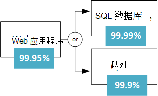
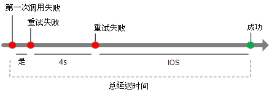
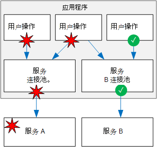

<properties
   pageTitle="设计有弹性的应用程序 |Microsoft Azure"
   description="生成高可用性和灾难恢复在 Azure，适应性应用程序的方式。"
   services=""
   documentationCenter="na"
   authors="MikeWasson"
   manager="christb"
   editor=""
   tags=""/>

<tags
   ms.service="guidance"
   ms.devlang="na"
   ms.topic="article"
   ms.tgt_pltfrm="na"
   ms.workload="na"
   ms.date="08/18/2016"
   ms.author="mwasson"/>
   
# 设计弹性 Azure 应用程序

在分布式系统中，会发生故障。 硬件可能会失败。 网络上可以有瞬间失败。 很少，整个服务或地区可能会出现中断，但即使这些进行规划。 

构建可靠的应用程序在云中是构建可靠的应用程序在企业环境中的不同。  过去您可能已经购买高端硬件，以扩大规模，而在云环境中，必须放大而不是向上。 云环境的成本维持在低水平，通过商品硬件使用。 而不是将重点放在防止故障并优化"平均无故障时间"，在这种新环境焦点转移"是指恢复"。 目标是从故障影响降至最低。

这篇文章概括介绍了如何构建弹性 Microsoft Azure 中的应用程序。 它开始与术语*的自我恢复能力*以及相关的概念的定义。 然后，它描述了一个实现复原，使用结构化的方法，通过应用程序生命周期，从设计和实现，对部署和操作的过程。

## 可恢复性是什么？

**可恢复性**是从故障中恢复和继续工作的能力。 它不是关于*避免*失败，但对以一种可以避免停机或数据丢失故障的*响应*。 可恢复性目标是返回到正常状态在出现故障后的应用程序。

两个重要方面是复原的高可用性和灾难恢复。

- **高可用性**(HA) 是在健康状态中，而无需大量的停机时间保持正常运行的应用程序的能力。 "正常状态"，是指应用程序响应，并且用户可以连接到应用程序并与其进行交互。  

- **灾难恢复**(DR) 是从非常少见，但主要的事件中恢复的能力︰ 非瞬态、 大规模故障，如会影响整个地区的服务中断。 灾难恢复包括数据备份和归档，并可能包括手动干预，如从备份还原数据库。 

考虑高可用性和灾难恢复的一种方法是灾难恢复开始时故障的影响超过了高可用性设计，以处理它的能力。 例如，放置几个虚拟机的负载平衡器的后面将提供可用性一个 VM 失败，但如果他们都在同一时间失败。 

在设计应用程序的弹性时，您需要了解您的可用性要求。 停机时间是可以接受的？ 这部分是成本的一项功能。 将潜在的停机时间成本是多少业务？ 多少您应该投资在使应用程序高可用性？ 您还需要定义应用程序要使用什么意思。 例如，"向下"是应用程序，如果客户可以提交订单，但系统无法在正常时间范围内处理它？

另一个常见术语是**业务连续性**(BC)，这期间和灾难之后执行关键业务功能的能力。 业务连续性涵盖整个操作的业务需要，包括物理设施、 人员、 通讯，运输，和 IT。 在本文中，我们只是专注云应用程序，但复原计划必须完成总体业务连续性需求的上下文中。 

## 流程，以期实现可恢复性

可恢复性不是一个加载项。 必须设计到系统中并付诸实践操作。 以下是按照常规模型︰

1.  **定义**您的可用性要求，根据业务需要

2.  **设计**应用程序的恢复能力。 开始使用切实可行的做法，遵循一个体系结构，然后确定该体系结构中的可能的故障点。

3.  检测并从故障中恢复的**实施**战略。 

4.  **测试**通过模拟故障并触发强制故障转移的实现。 

5.  **部署**应用程序投入生产使用的是可靠的、 可重复的过程。 

6.  **监视器**检测失败的应用程序。 通过监视系统，可以衡量应用程序的运行状况和在必要时对事件作出响应。 

7.  如果需要手动干预的事件进行**响应**。

在这篇文章的剩余部分，我们讨论上述每个步骤中的详细信息。

## 定义可恢复性要求

规划与业务需求开始恢复。 以下是考虑这些条款中的自我恢复能力的一些方法。

### 根据工作负载将分解

许多云解决方案包含多个应用程序工作负载。 在此上下文中的"工作负荷"一词意味着离散的功能或计算任务，可以从逻辑上独立于其他任务，根据业务逻辑和数据存储需求。 例如，一个电子商务应用程序可能包括以下工作负荷︰

- 浏览和搜索产品目录。

- 创建和跟踪订单。

- 查看建议。

这些工作负荷可能具有可用性、 可扩展性、 数据一致性、 灾难恢复等的不同的要求。 同样，它们的业务决策。

还要考虑使用模式。 是否有系统必须提供某些关键期？ 例如，纳税申报服务无法向下走右前申报的截止日期;视频流服务，必须保持在大型体育活动;等等等等。 在关键期间，您可能有冗余部署跨多个地区，因此，如果一个区域出现故障，应用程序可以故障转移。 但是，多区域部署是比较昂贵，因此在不太重要的时间，您可以运行单个区域应用程序。  

### RTO 和 RPO

要考虑的两个重要指标都恢复时间目标和恢复点目标︰

- **恢复时间目标**(RTO) 是在事件发生后，应用程序可以是不可用的最大可接受时间。 如果您的 RTO 时间为 90 分钟，您必须能够恢复应用程序运行状态下的 90 分钟内从一开始一次灾难。 如果您有非常低的 RTO，可能会使第二个部署待命，以防止出现地区停电持续运行。

- **恢复点目标**(RPO) 是在灾难过程中是可以接受的数据丢失的最大持续时间。 例如，如果将数据存储在单个数据库中，以未复制到其他数据库，请执行每小时备份，您可以长达一个小时的数据丢失。 

RTO 和 RPO 的业务需求。 另一个常见的度量标准是**平均恢复时间**(MTTR)，它是还原后出现故障的应用程序所花费的平均时间。 MTTR 是关于系统的经验事实。 如果 MTTR 超过 RTO，系统中的故障将导致超过了可接受的业务中断，因为不可能还原系统内定义的 RTO。 

### 服务级别协议

在 Azure，[服务级别协议]中[sla](SLA) 介绍微软承诺的正常运行时间和连接。 如果特定服务的 SLA 为 99.9%，则表示您将会发现该服务可用于 99.9%的时间。

> [AZURE.NOTE] Azure SLA 中还包括获得服务信用，如果不满足 SLA，以及为每个服务的"可用性"的具体定义的规定。 SLA 的相关方面充当实施策略。 

您的解决方案中，您应定义自己为每个工作负载的目标服务级别协议。 SLA 使到有关体系结构，因此，该体系结构是否满足业务需求。 例如，如果工作负荷需要 99.99%的正常运行时间，但取决于具有 99.9 %sla 的服务，该服务不能在系统中为一个单点故障。 一个补救方法是该服务出现故障时，有一个备用路径或采取其他措施，以从该服务中的故障恢复。 

下表显示了各种 SLA 级别的潜在累计停机时间。 

| SLA     | 每周的停机时间 | 每月的停机时间 | 每年的停机时间 |
|---------|-------------------|--------------------|-------------------|
| 99%     | 1.68 小时        | 7.2 小时          | 3.65 天         |
| 99.9%   | 10.1 分钟      | 43.2 分钟       | 8.76 小时        |
| 99.95%  | 5 分钟         | 21.6 分钟       | 4.38 小时        |
| 99.99%  | 1.01 分钟      | 4.32 分钟       | 52.56 分钟     |
| 99.999% | 6 秒         | 25.9 秒       | 5.26 分钟      |

当然，更高的可用性要好，否则视为相同的所有内容。 但是，随着您尽量为更多的 9，增加的成本和复杂性，要实现这种级别的可用性。 99.99%的正常运行时间将转换为每个月总停机时间的大约 5 分钟。 它值得额外的复杂性和成本，以达到五个 9？ 答案取决于业务需求。 

在定义 SLA 时，下面是一些其他注意事项︰

- 为了实现四个 9 的 （99.99%)，您可能不能依赖手动干预才能从故障中恢复。 应用程序必须进行自我诊断和自我康复。 

- 除了四个 9，它是一个挑战，以足够快的速度检测停机以满足 sla 要求。

- 考虑针对以下标准评定 SLA 的时间窗口。 小窗口，紧密公差。 它可能毫无意义来定义您的每小时或每日正常运行时间 SLA。 

### 复合服务级别协议

考虑应用程序服务 web 应用程序写入 SQL Azure 数据库。 在撰写本文时，这些 Azure 服务具有以下服务级别协议︰

- 应用程序服务 Web 应用程序 = 99.95%

- SQL 数据库 = 99.99%

此应用程序的最大停机时间您认为是什么？ 如果这两种服务出现故障，整个应用程序无法正常工作。 一般情况下，每个服务发生故障的概率都是独立的所以此应用程序的复合 SLA 99.95%x 99.99%= 99.94%。 这就是低于各个 sla 要求，这并不令人惊讶，因为依赖于多个服务的应用程序有多个潜在的故障点。 

另一方面，您可以通过创建独立的备用路径提高复合的 SLA。 例如，如果 SQL 数据库不可用，将放入队列中，供以后处理的事务。

使用此设计，应用了仍可用，即使它不能连接到数据库。 但是，它如果数据库和队列失败一次。 同时发生故障预期的百分比是时间的 0.0001 × 0.001，因此此组合路径的复合 SLA  

- 数据库或队列 = 1.0 &minus; (0.0001 &times; 0.001) = 99.99999%

总的复合 SLA 是︰

- Web 应用程序以及 （数据库或队列） = 99.95% &times; 99.99999%= ~99.95%

但也有一些对这种方法的缺点。 应用程序逻辑就会越复杂，您要付的队列中，可能存在数据一致性问题需要考虑。

**针对多区域部署的 SLA**。 另一种高可用性技术是部署在多个区域中，该应用程序并使用 Azure 流量管理器故障转移，如果应用程序失败，在一个地区。 对于两个地区部署，复合的 SLA，如下所示计算。 

用*N*来在一个区域中部署的应用程序的复合 SLA。 预期这两个区域中，应用程序将失败一次的机会是 (1 &minus; N) &times; (1 &minus; N)。 因此，

- 对于这两个区域合并 SLA = 1 &minus; (1 &minus; N) (1 &minus; N) = N + (1 &minus; N) N

最后，还必须考虑[SLA 流量管理器的][tm-sla]。 截止到撰写本文时，流量管理器 SLA 的 SLA 为 99.99%。

- 复合的 SLA = 99.99% &times; （结合使用这两个地区的 SLA）

进一步的细节是，故障转移并不是即时的这可能会导致故障转移期间一定的停机时间。 请参阅[通信量管理器终结点监控和故障切换][tm-failover]。

计算的 SLA 数是有用的基准，但它并没有告诉整个故事关于可用性。 通常情况下，应用程序可以适度非关键路径失败时。 假设应用程序显示的图书目录。 如果应用程序不能检索盖的缩略图图像，它可能会显示的占位符图像。 在这种情况下，无法获取图像不会降低应用程序的正常运行时间，尽管它会影响用户体验。  

## 设计为可恢复性

在设计阶段，您应该执行的故障模式分析 (FMA)。 FMA 的目的是确定可能产生故障，并定义该应用程序将如何响应这些故障。

- 应用程序将如何检测这种故障？

- 如何将应用程序响应这种类型的故障？

- 如何将日志和监视这种类型的故障？ 

FMA 的流程，其中的 Azure，具体建议有关的详细信息，请参阅[Azure 复原指导︰ 故障模式分析][fma]。

### 确定故障模式和检测策略的示例

**故障点︰**对外部 web 服务调用 / API。

| 故障模式 | 检测策略 |
|--------------|--------------------|
| 服务不可用 | HTTP 5xx |
| 带宽限制 | HTTP 429 （过多的请求） | 
| 身份验证 | HTTP 401 （未经授权） | 
| 响应较慢问题 | 请求超时 |

## 恢复策略

本节提供了一些常见的复原战略的一项调查。 其中大多数并不限于特定的技术。 本节中的说明旨在总结每种技术，以链接到其他阅读材料的一般思想。

### 瞬间失败重试

瞬时故障可能会导致通过临时失去网络连接、 拖放的数据库连接或超时服务正忙。 通常情况下，只需通过重试请求可以解决瞬间失败。 对于许多 Azure 服务，客户端 SDK 实现自动重试次数，以一种透明给调用方。[重试服务特定指导]，请参阅[retry-service-specific guidance]。

每次重试尝试向总滞后时间。 另外，太多失败的请求会导致瓶颈，如挂起的请求在队列中堆积。 这些被禁止的请求可能包含关键系统资源，如内存、 线程、 数据库连接和等等，可能会导致级联故障。 若要避免此问题，增加每次重试尝试之间的延迟和限制失败请求的总数。

有关详细信息，请参阅[重试模式][retry-pattern]。

### 在实例之间进行负载平衡

可伸缩性，云应用程序应该能够通过添加更多实例扩张。 这种方法还可以提高可恢复性，因为不健康的实例可以采取轮换。  

例如︰

- 将负载平衡器后面的两个或多个虚拟机。 负载平衡器将分发到所有虚拟机的通信。 请参阅[运行多个虚拟机上的可扩展性和可用性的 Azure][ra-multi-vm]。

- 横向扩展到多个实例的 Azure 应用程序服务应用程序。 应用程序服务自动负载平衡跨实例。 [基本的 web 应用程序]，请参阅[ra-basic-web]。

- 使用[Azure 流量管理器][tm]以分散一组终结点的通信。

### 复制数据

数据复制是一个常规战略，处理非瞬态故障数据存储区中。 很多存储技术提供了内置的复制，包括 SQL Azure 数据库、 DocumentDB 和 Apache 卡桑德拉。  

请务必考虑这两个读取和写入路径。 这取决于存储技术中，可能有多个可写副本，或一个可写副本和多个只读的副本。 

为了获得高可用性，副本可以放置在多个区域。 但是，这会增加复制数据的滞后时间。 通常情况下，区域间复制是异步完成的这意味着最终一致性模型和潜在的数据丢失如果复制副本将失败。 

### 性能平稳降低

如果服务失败，并且没有故障切换路径，应用程序可能能够适度，仍然提供了一种可接受的用户体验的方式。 例如︰

- 工作项放入队列，以便在稍后执行。 

- 返回一个估计的值 

- 使用本地缓存的数据。 

- 向用户显示一条错误消息。 （此选项是优于让应用程序停止响应请求。

### 大量的用户限制

有时，一小部分用户创建负载过大。 可以对其他用户，从而减少您的应用程序的总体可用性有着影响。

当一个客户端的请求过多，应用程序可能会在某段时间内限制客户端。 在限制期内，该应用程序从该客户端 （取决于确切的调节策略） 拒绝部分或全部的请求。 用于调节阈值可能取决于客户的服务层。 

限制并不意味着一定恶意操作的客户端。 它只是客户端已超出他们服务的配额。  在某些情况下，使用者可能持续超过其配额或否则性能不佳。 在这种情况下，您可能会进一步转并阻止用户。 通常情况下，这是通过阻止一个 API 键或某个 IP 地址范围。

有关详细信息，请参阅[调节模式][throttling-pattern]。

### 使用断路器  

断路器模式可以防止应用程序反复尝试的操作，则可能会失败。 类比是物理的断路器，开关，可中断流的当前重载线路时。

断路器包装对服务的调用。 它具有三种状态︰

- **关闭**。 这是正常状态。 断路器将请求发送到该服务，并在计数器跟踪最近失败的次数。 如果在给定的时间段内，失败次数超过某个阈值，断路器切换到打开状态。 

- **打开**。 在这种状态，断路器立即失败的所有请求，而无需调用该服务。 应用程序应使用缓解路径，如从复制副本中读取数据，或只向用户返回一个错误。 当断路器切换到打开时，它会启动一个计时器。 当计时器到期时，断路器切换到半打开状态。

- **半开放**。 在此状态下，断路器允许有限的数量的请求转到服务。 如果他们成功，假定该服务要恢复和断路器切换到关闭状态。 否则，它将恢复为打开状态。 半打开状态可以防止突然淹没请求恢复服务。

有关详细信息，请参阅[断路器模式][circuit-breaker-pattern]。

### 使用负载调配出流量高峰平滑

应用程序可能会遇到突发高峰会占用大量的后端服务的通讯。 如果后端服务不能足够快地响应请求，可能会导致请求队列 （备份），或使限制应用程序的服务。

若要避免此问题，可以作为缓冲区使用队列。 新的工作项，而不是立即调用后端服务时应用程序队列异步运行一个工作项。 在负载高峰出平滑的缓冲区队列相当。 

有关详细信息，请参阅[基于队列的负载调配操作模式][load-leveling-pattern]。

### 找出关键资源 

在一个子系统的故障有时可以层叠，导致故障出现在应用程序的其他部分。 如果故障导致一些资源，例如线程或套接字，不及时，导致资源枯竭得到释放，可发生此错误。 

若要避免此问题，您可以将系统划分隔离组，以便在一个分区中的故障不会使关闭整个系统。 这种技术有时称为 Bulkhead 模式。

示例︰

- 分区数据库 — 例如，租户 — 和指定的 web 服务器实例的每个分区独立的池。  
- 使用单独的线程池来隔离对不同服务的调用。 这有助于防止出现级联故障，如果某个服务出现故障。 有关示例，请参见 Netflix [Hystrix 库][hystrix]。

- 使用[容器][containers]来限制特定子系统的可用资源。 

### 补偿事务应用 

补偿事务是事务的撤消另一个已完成的事务。

在分布式系统中，它可以是非常难实现强事务的一致性。 补偿事务是通过使用更小的、 单个交易记录可在每个步骤撤消一系列实现一致性的办法。

例如，预定行程，客户可能希望保留一辆汽车，旅馆和飞行。 如果这些步骤失败，则整个操作就会失败。 而不是尝试使用一个分布式的事务的整个操作，您可以定义一个补偿事务，每一步。 例如，若要撤消汽车预留，则取消预留。 若要完成整个操作，协调员执行每个步骤。 如果任一步骤失败，协调员将应用补偿事务撤销任何已完成的步骤。 

有关详细信息，请参阅[补偿事务模式][compensating-transaction-pattern]。 

## 测试恢复能力

通常情况下，不能以相同的方式 （通过等运行单元测试） 的测试应用程序功能测试的自我恢复能力。 相反，您必须测试端到端负载如何执行故障情况下，它的定义并非是所有的时间。

测试是过程的一个循序渐进的一部分。 测试应用程序、 测量结果、 分析和解决任何失败的结果，然后重复该过程。

**故障注入测试**。 通过触发实际出现故障或通过模拟这些测试失败，系统的恢复能力。 以下是一些常见的故障情况进行测试︰

- 关闭虚拟机实例。

- 崩溃的进程。

- 过期的证书。

- 更改访问键。

- 关闭域控制器上的 DNS 服务。

- 限制可用的系统资源，如内存或线程数。

- 卸载磁盘。

- 重新部署虚拟机。

测量的恢复时间，并验证满足您的业务需求。 测试故障模式的组合。 请确保故障没有级联，和独立的方式处理。

这是另一个原因是很重要的设计阶段分析可能的故障点。 该分析的结果应该是测试计划的输入。

**负载测试**。 使用[Visual Studio 的团队服务]之类的工具的应用程序的负载测试[vsts]或[Apache JMeter] [jmeter]是为标识负载，如后端数据库正在不堪重负的情况下才发生的故障或限制服务至关重要的负载测试。 针对峰值负载，使用生产数据或接近于生产数据的综合数据进行测试。 目标是了解应用程序在实际情况下的行为方式。   

## 有弹性的部署

一旦应用程序部署到生产环境中，更新将是可能的错误源。 在最坏的情况下，坏的更新会导致停机时间。 若要避免此问题，必须可预测且可重复的部署过程。 部署包括调配 Azure 资源、 部署应用程序代码和应用配置设置。 更新可能涉及所有这三种或其一个子集。 

关键点是，手动部署容易出错。 因此，建议将具有自动化，幂等过程，您可以按需运行并重新运行如果事情失败。 

- 使用资源管理器模板自动 Azure 资源的调配。

- 使用[Azure 自动化所需状态配置][ dsc] (DSC) 来配置虚拟机。

- 应用程序代码中使用自动化的部署过程。

两种概念相关的弹性部署是*以代码的形式的基础结构*和*永恒的基础结构*。

- **以代码的形式的基础结构**是使用代码来设置和配置基础结构的做法。 基础结构代码即可以使用声明性方法或一种强制性的方法 （或两者的组合）。 资源管理器模板是声明性方法的一个示例。 PowerShell 脚本是方法的强制性的一个示例。

- **永恒的基础结构**是您不应修改基础架构部署到生产环境后的原则。 否则，您可以获得进入状态在其中应用了临时更改，因此很难知道确切发生什么变化，且难于有关系统的原因。 

另一个问题是，如何推广应用程序更新。 建议蓝绿部署等技术或加那利高度推入的更新的版本控制将可能从错误的部署的影响降至最低的方法。

- [蓝绿部署][blue-green]是一种技术，在将更新部署到实时应用程序从单独的生产环境。 验证在部署之后，切换通信路由到更新的版本。 例如，Azure 应用程序服务 Web 应用程序启用此[暂存槽]与[staging-slots]。 

- [加那利版本][canary-release]类似于蓝绿的部署。 而不是切换到更新版本的所有通信量，您推广更新到很少的用户，通过路由到新部署的部分通信。 如果没有问题，后退，并还原为旧部署。 否则，更多通信路由到新的版本，直到它获得 100%的流量。

无论何种方法进行，确保，可以回滚到最后一次良好的部署，在新版本无法正常工作的情况下。 此外，如果发生错误，它必须能够告诉从哪个版本导致错误的应用程序日志。 

## 监视和诊断

监视和诊断的自我恢复能力至关重要。 如果操作失败，您需要知道它失败，并且您需要深入了解失败的原因。 

大规模分布式的系统监控会带来重大的挑战。 考虑一下几个几十个虚拟机运行的应用程序--并不可行，若要登录到每个虚拟机，一次，请查阅日志文件中，试图解决的问题。 此外，虚拟机实例的数目可能不是静态的。 添加或移除应用程序扩展为进出、 虚拟机和实例有时可能失败，并且需要以重新设置。 此外，一个典型的云应用程序可能会使用多个数据存储 （Azure 存储 SQL 数据库，DocumentDB，Redis 缓存），并且单个用户的操作可能会跨多个子系统。 

可以监控和诊断过程看作管线与几个不同的阶段︰

- **检测**。 监视和诊断的原始数据来自各种来源，包括应用程序日志、 web 服务器日志、 操作系统性能计数器、 数据库日志和 Azure 平台的内置诊断程序。 最 Azure 服务具有诊断功能可以用来找出问题的原因。

- **收集和存储**。 可在不同位置和不同格式 （应用程序跟踪日志、 性能计数器、 IIS 日志） 中保存原始的检测数据。 这些不同的来源收集、 整合，并置于可靠的存储。

- **分析和诊断**。 合并数据后，它可以进行分析，才能解决问题和提供应用程序的运行状况的总体视图。

- **可视化和警报**。 在此阶段，遥测数据显示，操作员可以迅速发现趋势或问题的方式。 示例包括仪表板或电子邮件警报。  

监视是不同于故障检测。 例如，您的应用程序可能会检测到瞬态错误，然后重试，从而在不停机的情况。 但它也应该记录重试操作，以便您可以监视错误率，以获得应用程序运行状况的整体。 

应用程序日志的诊断数据的重要来源。 下面是应用程序日志记录的一些最佳做法︰

- 在生产环境中的记录。 否则，在需要时最非常时候失去洞察力。

- 记录在服务边界的事件。 包括跨服务边界流动的相关 ID。 如果交易记录 X 流通过多个服务和一个失败，相关性 ID 将帮助您查明其事务失败的原因。

- 语义的使用记录，也称为结构化的日志记录。 非结构化的日志进行自动化的消耗和分析日志数据，需要在云规模较大的困难。

- 使用异步日志记录。 否则，日志记录系统本身可能会导致应用程序失败，通过使请求备份，因为它们阻止等待写入日志记录事件。

- 应用程序日志记录不是相同的审核。 可以出于法规遵从性或管理法规原因审核。 在这种情况下，审核记录必须是完整的并不是可接受，若要处理交易记录时将其删除。 如果应用程序需要审核，这应分开使用诊断日志记录。 

有关监视和诊断程序的详细信息，请参阅[监视和诊断指导][monitoring-guidance]。

## 手动故障响应

前面几节重点自动故障恢复策略，对于高可用性至关重要。 但是，需要有时人工干预。

- **警报**。 监视您的应用程序可能需要主动干预的警告迹象。 例如，如果您看到 SQL 数据库或 DocumentDB 始终如一地限制应用程序，您可能需要增加数据库容量或优化您的查询。 在此示例中，即使该应用程序可能会以透明的方式，处理限制错误您遥测应仍引发警报，以便您可以跟进。  

- **手动故障切换**。 某些系统不能自动故障转移，需要手动进行故障切换。 

- **操作就绪性测试**。 如果您的应用程序故障转移到辅助区域，您应该执行操作就绪测试之前故障恢复到的主要地区。 测试应确认的主要区域是健康和准备好再次接收通信。

- **数据一致性检查**。 如果在数据存储区出现故障，可能有数据不一致商店再次可用时，尤其是当已复制数据。 

- **从备份还原**。 例如，如果 SQL 数据库遇到地区停电，可地理还原最新备份的数据库。

记录并测试您的灾难恢复计划。 包括书面的过程的任何手动步骤，例如手动故障切换时，将数据从备份、 恢复等。 

## 摘要

本文从整体的角度看，强调一些云的独特挑战看复原。 这些包括云计算，使用商品硬件，以及存在 transience 网络故障的分布式的特性。

下面是从这篇文章的要点︰

- 自我恢复能力将导致更高的可用性和更低的平均时间从故障中恢复。 

- 在云环境中的实现复原能力需要另外一套技术从传统的内部部署解决方案。 

- 恢复能力不会发生意外。 必须设计和构建从一开始。

- 弹性接触应用程序生命周期，从规划和编码操作的每个部分。

- 测试和监视 ！

## 下一步行动

- [恢复能力清单][resiliency-checklist]包含将帮助您规划的各种可能发生的故障模式的建议。

- [故障模式分析][ fma] (FMA) 是构建过程进行复原到系统中，通过确定可能的故障点。 FMA 过程的起点，为这篇文章包含目录中潜在的故障模式及他们缓解。 

- 您可以找到更多的资源︰ [Azure 复原技术指导](../resiliency/resiliency-technical-guidance.md) 

<!-- links -->

[blue-green]: http://martinfowler.com/bliki/BlueGreenDeployment.html
[canary-release]: http://martinfowler.com/bliki/CanaryRelease.html
[circuit-breaker-pattern]: https://msdn.microsoft.com/library/dn589784.aspx
[compensating-transaction-pattern]: https://msdn.microsoft.com/library/dn589804.aspx
[containers]: https://en.wikipedia.org/wiki/Operating-system-level_virtualization
[dsc]: https://azure.microsoft.com/documentation/articles/automation-dsc-overview/
[fma]: guidance-resiliency-failure-mode-analysis.md
[hystrix]: http://techblog.netflix.com/2012/11/hystrix.html
[jmeter]: http://jmeter.apache.org/
[load-leveling-pattern]: https://msdn.microsoft.com/library/dn589783.aspx
[monitoring-guidance]: https://azure.microsoft.com/documentation/articles/best-practices-monitoring/
[ra-basic-web]: https://azure.microsoft.com/documentation/articles/guidance-web-apps-basic/
[ra-multi-vm]: https://azure.microsoft.com/documentation/articles/guidance-compute-multi-vm/
[resiliency-checklist]: guidance-resiliency-checklist.md
[retry-pattern]: https://msdn.microsoft.com/library/dn589788.aspx
[retry-service-specific guidance]: https://azure.microsoft.com/documentation/articles/best-practices-retry-service-specific/
[sla]: https://azure.microsoft.com/support/legal/sla/
[staging-slots]: https://azure.microsoft.com/documentation/articles/guidance-web-apps-basic/
[throttling-pattern]: https://msdn.microsoft.com/library/dn589798.aspx
[tm]: https://azure.microsoft.com/services/traffic-manager/
[tm-failover]: https://azure.microsoft.com/documentation/articles/traffic-manager-monitoring/
[tm-sla]: https://azure.microsoft.com/support/legal/sla/traffic-manager/v1_0/
[vsts]: https://www.visualstudio.com/features/vso-cloud-load-testing-vs.aspx
