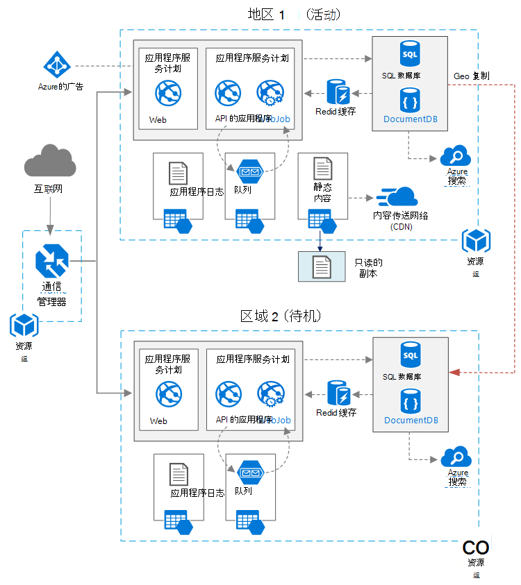

<properties
   pageTitle="具有高可用性的 web 应用程序 |Azure 的参考体系结构 |Microsoft Azure"
   description="建议为具有高可用性，在 Microsoft Azure 上运行的 web 应用程序的的体系结构。"
   services="app-service,app-service\web,sql-database" 
   documentationCenter="na"
   authors="MikeWasson"
   manager="roshar"
   editor=""
   tags=""/>

<tags
   ms.service="guidance"
   ms.devlang="na"
   ms.topic="article"
   ms.tgt_pltfrm="na"
   ms.workload="na"
   ms.date="06/27/2016"
   ms.author="mwasson"/>

# <a name="azure-reference-architecture-web-application-with-high-availability"></a>Azure 的参考体系结构︰ Web 应用程序提供高可用性

[AZURE.INCLUDE [pnp-RA-branding](../../includes/guidance-pnp-header-include.md)]

本文介绍高可用性，在 Microsoft Azure 上运行 web 应用程序建议的体系结构。 该体系结构基于[Azure 的参考体系结构︰ 提高 web 应用程序中的可扩展性][guidance-web-apps-scalability]。

## <a name="architecture-diagram"></a>体系结构关系图



这种体系结构基于[提高可伸缩性，在 web 应用程序中]所示的一个[guidance-web-apps-scalability]。 主要的区别是︰

- **主要和次要区域**。 此体系结构使用两个区域，以达到更高的可用性。 应用程序部署到每个区域。 在正常操作中，网络通信被路由到主区域。 但是，如果该按钮不可用，通信路由到辅助区域。 故障切换的详细信息，请参阅[管理故障转移](#managing-failover-and-failback)。

- **Azure 的流量管理器**。 [通信管理器][traffic-manager]将传入的请求路由到主区域。 如果运行该区域的应用程序变得不可用，流量管理器故障切换到辅助区域。 

- **Geo 复制**SQL 数据库和 DocumentDB。

## <a name="recommendations"></a>建议

### <a name="regional-pairing"></a>区域匹配

每个 Azure 地区配备在同一地区内的其他地区。 一般情况下，选择 （例如，东亚美国 2 和美国中部） 相同的区域对区域。 这样做的好处包括︰

- 如果没有出现大停电，至少一个地区，不是每一对恢复确定优先级。
- 计划的 Azure 系统更新的推出成对地区按顺序，尽量减少可能的停机时间。
- 在大多数情况下，对位于相同的地理位置，以满足数据派驻服务要求。

但是，请确保这两个区域支持的所有 Azure 服务所需的应用程序。 请参阅[服务按地区][services-by-region]。 关于区域对的详细信息，请参阅[业务连续性和灾难恢复 (BCDR): Azure 配对地区][regional-pairs]。

### <a name="resource-groups"></a>资源组

请考虑在单独的[资源组]中放置的主要区域、 辅助区域和通信管理器[resource groups]。 这允许您管理部署到单个集合为每个区域的资源&mdash;您可以单独部署它们，删除部署，等等。 

### <a name="traffic-manager"></a>通信管理器

**路由选择。** 通信管理器支持几种[路由选择算法][tm-routing]。 本文介绍了这种情况下，使用_优先级_路由 （以前称为_故障转移_路由）。 使用此设置，流量管理器将所有请求都发送到主区域，除非该区域终结点变得无法访问。 此时，它会自动故障切换到辅助区域。 请参阅[配置故障转移路由方法][tm-configure-failover]。

**健康探测器。** 通信管理器使用 HTTP （或 HTTPS） 探测器来监视每个终结点的可用性。 探测器提供流量管理器故障转移到辅助区域的通过/未通过测试。 它的工作原理是将请求发送到指定的 URL 路径。 如果在超时期限内得到非 200 响应，探测器无法正常工作。 后四个失败的请求，流量管理器降级将标记该终结点，并将故障转移到另一个端点。 有关详细信息，请参阅[通信量管理器终结点监控和故障切换][tm-monitoring]。

作为最佳操作，创建健康探测器终结点所报告的应用程序的整体健康状况和健康探测器使用该终结点。 终结点应检查应用程序服务的应用程序、 存储队列和 SQL 数据库等关键依赖项。 否则，该探测器可能会报告"状态良好"的终结点时实际失败的应用程序的关键部分。 

另一方面，不要使用健康探测器检查较低优先级的服务。 例如，如果电子邮件服务出现故障，应用程序可以切换到第二个供应商或只是稍后发送电子邮件。 应用程序可能不能故障转移在这种情况。 有关详细信息，请参阅[健康终结点监视模式][health-endpoint-monitoring-pattern]。
  
### <a name="sql-database"></a>SQL 数据库

使用[活动的地理复制][sql-replication]在不同区域中创建可读第二。 您可以有最多四个可读的辅助区域。 如果主数据库发生故障，只需将离线，或者您可以故障切换到辅助数据库的任何。 活动的各地区复制可以为任何数据库中任何弹性数据库池配置。

### <a name="documentdb"></a>DocumentDB

DocumentDB 支持区域间的地理复制。 一个地区被指定为可写，而其他的只读副本。 

如果没有区域停机时，您可以故障切换选择可写区域的其他地区。 DocumentDB 客户端 SDK 将自动发送请求写入当前写入区域，因此您无需更新客户端配置，故障转移后。 有关详细信息，请参阅[分布数据全局与 DocumentDB][docdb-geo]。 

> [AZURE.NOTE] 所有副本都属于同一个资源组。

### <a name="storage"></a>存储

使用 Azure 存储[读取访问地理冗余存储][ ra-grs] (RA GRS)。 使用 RA GRS 存储数据复制到辅助区域。 您在次区域内，通过不同的终结点具有对数据的只读访问权限。 如果没有区域停电或灾难，Azure 存储团队可以确定执行地理-故障切换到辅助区域。 没有客户操作所需的这种故障转移。

对于队列存储在辅助区域创建备份队列。 故障转移期间，应用程序可用备份的队列中，直到再次变为可用的主要地区。 这样一来，应用程序仍可以处理新的请求。 

## <a name="availability-considerations"></a>可用性考虑事项

多区域体系结构可以提供更高的可用性比部署到单个区域。 如果区域停电影响的主要区域，您可以故障转移到辅助区域。 如果应用程序的各个子系统出现故障，还可以帮助这种体系结构。  
     
有几种常规方法可用来实现跨数据中心高可用性︰      
- 主动/被动与热备用。 通信进入一个地区其他等待进入待机状态。 应用程序是在次区域的已部署并正在运行。 可能开始在从属数据中心中的较小实例计数，并根据需要再扩张。 

- 主动/被动与冷备用。 相同的但应用程序不会部署之前所需的故障转移。 这种方法的成本低，运行，但一般会再停工期间出现故障的时间。 

- 主动/主动。 这两个地区都处于活动状态，并请求进行负载平衡它们之间。 如果一个数据中心不可用，它将采取轮换。 

本文重点介绍热备用，使用[Azure 流量管理器]与主动/被动[traffic-manager]通信路由到该地区。 

### <a name="traffic-manager"></a>通信管理器

如果主区域变为不可用，通信管理器会自动故障切换。 当流量管理器故障转移时，没有一段时间，当客户不能到达该应用程序，它可以是几分钟的时间。 两个因素影响的总持续时间︰

- 健康探测器必须检测到主数据中心变得不可访问。

- DNS 服务器必须更新 IP 地址，这取决于 DNS 生存时间 (TTL) 的缓存的 DNS 记录。 默认 TTL 是 300 秒 （5 分钟），但当创建通信管理器配置文件，您可以配置此值。

有关详细信息，请参阅[有关通信管理器监视][tm-monitoring]。 

通信管理器是系统中的一个可能的故障点。 如果服务失败，则客户端无法访问您的应用程序停机期间。 查看[通信量管理器 SLA][tm-sla]，并确定是否使用单独的流量管理器满足您的业务需求，以实现高可用性。 如果没有，则请考虑添加另一个流量管理解决方案为回切。 如果 Azure 流量管理器服务失败，改变 CNAME 记录在 DNS 中指向其他通信量管理服务。 （必须手动执行此步骤，直到将 DNS 更改传播，您的应用程序将无法使用）。 

### <a name="sql-database"></a>SQL 数据库

所述的恢复点目标 (RPO) 和 SQL 数据库估计的恢复时间 (ERT)[这里][sql-rpo]。 

### <a name="storage"></a>存储

RA GRS 存储可提供持久存储，但一定要了解在停机期间会发生什么︰ 

- 如果发生存储停机时，将有一段时间，当您没有写入访问权限的数据。 您仍可以在停用期间读取辅助终结点。

- 如果区域停电或灾难影响的主要位置，并且无法恢复数据，可能会确定 Azure 存储团队执行地理-故障切换到辅助区域。 

- 是异步执行的数据复制到辅助区域。 因此，如果执行地理故障转移，则某些可能会丢失数据，如果数据无法恢复从主要区域。

- 瞬间故障，网络中断，将不会触发存储进行故障切换。 设计应用程序能够适应瞬间失败。 可能的缓解措施︰

    - 从辅助阅读。

    - 临时切换到另一个存储帐户新的写入操作 （例如，对队列消息）。 

    - 数据从次映像复制到另一个存储帐户。

    - 直到系统故障恢复，请提供缩减的功能。

有关详细信息，请参阅[Azure 存储中断发生时应该怎么做][storage-outage]。

## <a name="managing-failover-and-failback"></a>管理故障转移和故障自动恢复

### <a name="traffic-manager"></a>通信管理器

如果主区域变为不可用，通信管理器会自动故障切换。 默认情况下，它将也自动回切，一旦再次变为可用的主要地区。

但是，我们建议执行手动回切，而不是自动故障恢复。 回切之前, 验证所有的应用程序子系统的正常运行。 否则，您可以创建在其中应用翻转前后数据中心之间的情况。 

为了防止自动故障回复，手动故障转移事件之后降低优先级的主要地区。 例如，假设主要地区优先级别为 1，并且辅助优先级为 2。 故障转移后，设置优先级 3，以防止自动故障回复到的主要地区。 当您准备好切换回来时，优先级重置为 1。

下面的命令更新优先级。

**PowerShell** 

```bat
$endpoint = Get-AzureRmTrafficManagerEndpoint -Name <endpoint> -ProfileName <profile> -ResourceGroupName <resource-group> -Type AzureEndpoints
$endpoint.Priority = 3
Set-AzureRmTrafficManagerEndpoint -TrafficManagerEndpoint $endpoint
```

有关详细信息，请参阅[Azure 流量管理器 Cmdlet][tm-ps]。

**Azure CLI**

```bat
azure network traffic-manager endpoint set --name <endpoint> --profile-name <profile> --resource-group <resource-group> --type AzureEndpoints --priority 3
```    

### <a name="sql-database"></a>SQL 数据库

如果主数据库出现故障，执行手动故障切换到辅助数据库。 请参阅[还原 SQL Azure 数据库或故障转移到辅助][sql-failover]。 直到故障转移时，辅助数据库保持只读。 


<!-- links -->

[azure-sql-db]: https://azure.microsoft.com/en-us/documentation/services/sql-database/
[docdb-geo]: ../documentdb/documentdb-distribute-data-globally.md
[guidance-web-apps-scalability]: guidance-web-apps-scalability.md
[health-endpoint-monitoring-pattern]: https://msdn.microsoft.com/library/dn589789.aspx
[ra-grs]: ../storage/storage-redundancy.md#read-access-geo-redundant-storage
[regional-pairs]: ../best-practices-availability-paired-regions.md
[resource groups]: ../resource-group-overview.md
[services-by-region]: https://azure.microsoft.com/en-us/regions/#services
[sql-failover]: ../sql-database/sql-database-disaster-recovery.md
[sql-replication]: ../sql-database/sql-database-geo-replication-overview.md
[sql-rpo]: ../sql-database/sql-database-business-continuity.md#sql-database-business-continuity-features
[storage-outage]: ../storage/storage-disaster-recovery-guidance.md
[tm-configure-failover]: ../traffic-manager/traffic-manager-configure-failover-routing-method.md
[tm-monitoring]: ../traffic-manager/traffic-manager-monitoring.md
[tm-ps]: https://msdn.microsoft.com/en-us/library/mt125941.aspx
[tm-routing]: ../traffic-manager/traffic-manager-routing-methods.md
[tm-sla]: https://azure.microsoft.com/en-us/support/legal/sla/traffic-manager/v1_0/
[traffic-manager]: https://azure.microsoft.com/en-us/services/traffic-manager/
