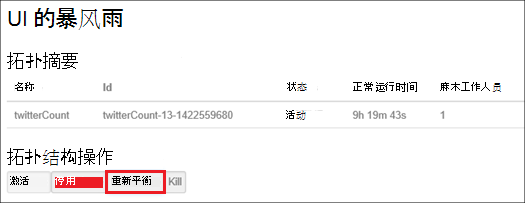

<properties
    pageTitle="管理 Hadoop 群集中使用.NET SDK HDInsight |Microsoft Azure"
    description="了解如何在 HDInsight 使用 HDInsight.NET SDK 的 Hadoop 群集执行管理任务。"
    services="hdinsight"
    editor="cgronlun"
    manager="jhubbard"
    tags="azure-portal"
    authors="mumian"
    documentationCenter=""/>

<tags
    ms.service="hdinsight"
    ms.workload="big-data"
    ms.tgt_pltfrm="na"
    ms.devlang="na"
    ms.topic="article"
    ms.date="09/02/2016"
    ms.author="jgao"/>

# 通过使用.NET SDK 管理中 HDInsight 的 Hadoop 群集

[AZURE.INCLUDE [selector](../../includes/hdinsight-portal-management-selector.md)]

了解如何使用[HDInsight.NET SDK](https://msdn.microsoft.com/library/mt271028.aspx)HDInsight 群集管理。

**系统必备组件**

在开始这篇文章之前，您必须具有以下︰

- **Azure 订阅**。 请参阅[获取 Azure 免费试用版](https://azure.microsoft.com/documentation/videos/get-azure-free-trial-for-testing-hadoop-in-hdinsight/)。

##连接到 Azure HDInsight

您将需要以下 Nuget 程序包︰

    Install-Package Microsoft.Rest.ClientRuntime.Azure.Authentication -Pre
    Install-Package Microsoft.Azure.Management.ResourceManager -Pre
    Install-Package Microsoft.Azure.Management.HDInsight

下面的代码示例演示如何之前还可以在 Azure 订阅管理 HDInsight 群集连接到 Azure。

    using System;
    using Microsoft.Azure;
    using Microsoft.Azure.Management.HDInsight;
    using Microsoft.Azure.Management.HDInsight.Models;
    using Microsoft.Azure.Management.ResourceManager;
    using Microsoft.IdentityModel.Clients.ActiveDirectory;
    using Microsoft.Rest;
    using Microsoft.Rest.Azure.Authentication;

    namespace HDInsightManagement
    {
        class Program
        {
            private static HDInsightManagementClient _hdiManagementClient;
            // Replace with your AAD tenant ID if necessary
            private const string TenantId = UserTokenProvider.CommonTenantId; 
            private const string SubscriptionId = "<Your Azure Subscription ID>";
            // This is the GUID for the PowerShell client. Used for interactive logins in this example.
            private const string ClientId = "1950a258-227b-4e31-a9cf-717495945fc2";

            static void Main(string[] args)
            {
                // Authenticate and get a token
                var authToken = Authenticate(TenantId, ClientId, SubscriptionId);
                // Flag subscription for HDInsight, if it isn't already.
                EnableHDInsight(authToken);
                // Get an HDInsight management client
                _hdiManagementClient = new HDInsightManagementClient(authToken);

                // insert code here

                System.Console.WriteLine("Press ENTER to continue");
                System.Console.ReadLine();
            }

            /// 

            /// Authenticate to an Azure subscription and retrieve an authentication token
            /// 

            /// <param name="TenantId">The AAD tenant ID</param>
            /// <param name="ClientId">The AAD client ID</param>
            /// <param name="SubscriptionId">The Azure subscription ID</param>
            /// <returns></returns>
            static TokenCloudCredentials Authenticate(string TenantId, string ClientId, string SubscriptionId)
            {
                var authContext = new AuthenticationContext("https://login.microsoftonline.com/" + TenantId);
                var tokenAuthResult = authContext.AcquireToken("https://management.core.windows.net/", 
                    ClientId, 
                    new Uri("urn:ietf:wg:oauth:2.0:oob"), 
                    PromptBehavior.Always, 
                    UserIdentifier.AnyUser);
                return new TokenCloudCredentials(SubscriptionId, tokenAuthResult.AccessToken);
            }
            /// 

            /// Marks your subscription as one that can use HDInsight, if it has not already been marked as such.
            /// 

            /// <remarks>This is essentially a one-time action; if you have already done something with HDInsight
            /// on your subscription, then this isn't needed at all and will do nothing.</remarks>
            /// <param name="authToken">An authentication token for your Azure subscription</param>
            static void EnableHDInsight(TokenCloudCredentials authToken)
            {
                // Create a client for the Resource manager and set the subscription ID
                var resourceManagementClient = new ResourceManagementClient(new TokenCredentials(authToken.Token));
                resourceManagementClient.SubscriptionId = SubscriptionId;
                // Register the HDInsight provider
                var rpResult = resourceManagementClient.Providers.Register("Microsoft.HDInsight");
            }
        }
    }

当您运行此程序时，您应看到一条提示。  如果您不想看到提示，请参阅[创建非交互式身份验证.NET HDInsight 应用程序](hdinsight-create-non-interactive-authentication-dotnet-applications.md)。

##创建群集

请参阅[创建 Linux 基于 HDInsight 使用.NET SDK 中的群集](hdinsight-hadoop-create-linux-clusters-dotnet-sdk.md)

##列表中的群集

下面的代码段列出群集和某些属性︰

    var results = _hdiManagementClient.Clusters.List();
    foreach (var name in results.Clusters) {
        Console.WriteLine("Cluster Name: " + name.Name);
        Console.WriteLine("\t Cluster type: " + name.Properties.ClusterDefinition.ClusterType);
        Console.WriteLine("\t Cluster location: " + name.Location);
        Console.WriteLine("\t Cluster version: " + name.Properties.ClusterVersion);
    }

##删除群集

使用下面的代码段可以同步或异步方式删除群集︰ 

    _hdiManagementClient.Clusters.Delete("<Resource Group Name>", "<Cluster Name>");
    _hdiManagementClient.Clusters.DeleteAsync("<Resource Group Name>", "<Cluster Name>");
            
##扩展群集
缩放功能的群集允许您更改在 Azure HDInsight 中运行而无需重新创建群集的群集使用的辅助节点数。

>[AZURE.NOTE] 只有群集与 HDInsight 3.1.3 版或更高版本支持。 如果您不确定您的群集的版本，您可以检查属性页。  请参阅[列表和显示群集](hdinsight-administer-use-portal-linux.md#list-and-show-clusters)。

更改群集由 HDInsight 支持的每种类型的数据节点数的影响︰

- Hadoop

    可以无缝地增加工作人员而不会影响任何未决或正在运行的作业运行 Hadoop 群集中的节点数。 在进行该操作时，也可以提交新的作业。 缩放操作的失败是正常处理，以便群集始终处于正常工作状态。

    Hadoop 群集按比例缩小通过减少数据节点数，当群集中的服务会重新启动。 这将导致所有正在运行和挂起的作业完成时缩放操作失败。 操作完成后，您便可以但是，重新提交作业。

- HBase

    可以无缝地添加或 HBase 群集中删除节点正在运行。 在完成将缩放操作的几分钟内自动平衡区域服务器。 但是，您可以通过登录到群集的 headnode，并从命令提示符窗口中运行以下命令手动平衡区域服务器︰

        >pushd %HBASE_HOME%\bin
        >hbase shell
        >balancer

- 风暴

    可以无缝地添加或风暴群集中删除数据节点正在运行。 但后缩放操作成功完成，您将需要重新平衡拓扑。

    重新平衡可以通过两种方式来实现︰

    * 风暴的 web 用户界面
    * 命令行界面 (CLI) 工具

    请[Apache 风暴文档](http://storm.apache.org/documentation/Understanding-the-parallelism-of-a-Storm-topology.html)的更多详细信息，参阅。

    风暴的 web 用户界面是 HDInsight 群集上可用︰

    

    下面是如何使用的 CLI 命令来重新平衡风暴拓扑示例︰

        ## Reconfigure the topology "mytopology" to use 5 worker processes,
        ## the spout "blue-spout" to use 3 executors, and
        ## the bolt "yellow-bolt" to use 10 executors

        $ storm rebalance mytopology -n 5 -e blue-spout=3 -e yellow-bolt=10

下面的代码段演示如何同步或异步方式调整群集︰

    _hdiManagementClient.Clusters.Resize("<Resource Group Name>", "<Cluster Name>", <New Size>);   
    _hdiManagementClient.Clusters.ResizeAsync("<Resource Group Name>", "<Cluster Name>", <New Size>);   
    

##授予/撤销访问权限

HDInsight 群集有以下 HTTP web 服务 （这些服务的所有具有 rest 风格的终结点）︰

- ODBC
- JDBC
- Ambari
- Oozie
- Templeton

默认情况下，这些服务要授予的访问权限。 您可以撤消/授予访问权。 若要吊销︰

    var httpParams = new HttpSettingsParameters
    {
        HttpUserEnabled = false,
        HttpUsername = "admin",
        HttpPassword = "*******",
    };
    _hdiManagementClient.Clusters.ConfigureHttpSettings("<Resource Group Name>, <Cluster Name>, httpParams);

若要授予︰

    var httpParams = new HttpSettingsParameters
    {
        HttpUserEnabled = enable,
        HttpUsername = "admin",
        HttpPassword = "*******",
    };
    _hdiManagementClient.Clusters.ConfigureHttpSettings("<Resource Group Name>, <Cluster Name>, httpParams);

>[AZURE.NOTE] 授予/撤销访问权限，将重置群集用户名称和密码。

这也可以通过门户完成。 请参阅[使用 Azure 门户管理 HDInsight][hdinsight-admin-portal]。

##更新 HTTP 用户凭据

它是作为[授予/撤销 HTTP 访问](#grant/revoke-access)相同的过程。如果群集已被授予的 HTTP 访问，您必须首先将其撤消。  然后再授予新 HTTP 用户凭据的访问权限。

##查找默认的存储帐户

下面的代码段演示如何获取默认存储帐户名称和群集的默认存储帐户密钥。

    var results = _hdiManagementClient.Clusters.GetClusterConfigurations(<Resource Group Name>, <Cluster Name>, "core-site");
    foreach (var key in results.Configuration.Keys)
    {
        Console.WriteLine(String.Format("{0} => {1}", key, results.Configuration[key]));
    }

##提交作业

**若要提交 MapReduce 作业**

请参阅[HDInsight 中的运行 Hadoop MapReduce 示例](hdinsight-hadoop-run-samples-linux.md)。

**提交配置单元作业** 

请参阅[运行配置单元查询使用.NET SDK](hdinsight-hadoop-use-hive-dotnet-sdk.md)。

**若要提交猪的作业**

请参阅[使用.NET SDK 的猪的运行作业](hdinsight-hadoop-use-pig-dotnet-sdk.md)。

**若要提交 Sqoop 作业**

请参阅[使用 Sqoop 与 HDInsight](hdinsight-hadoop-use-sqoop-dotnet-sdk.md)。

**若要提交 Oozie 作业**

请参阅[使用 Hadoop 来定义并运行在 HDInsight 工作流使用 Oozie](hdinsight-use-oozie-linux-mac.md)。

##将数据上载到 Azure Blob 存储
请参阅[上载数据为 HDInsight][hdinsight-upload-data]。

## 请参见
* [HDInsight.NET SDK 参考文档](https://msdn.microsoft.com/library/mt271028.aspx)
* [通过使用 Azure 门户管理 HDInsight][hdinsight-admin-portal]
* [管理 HDInsight 使用一个命令行界面][hdinsight-admin-cli]
* [创建 HDInsight 群集][hdinsight-provision]
* [将数据上传到 HDInsight][hdinsight-upload-data]
* [开始使用 Azure HDInsight][hdinsight-get-started]

[azure-purchase-options]: http://azure.microsoft.com/pricing/purchase-options/
[azure-member-offers]: http://azure.microsoft.com/pricing/member-offers/
[azure-free-trial]: http://azure.microsoft.com/pricing/free-trial/

[hdinsight-get-started]: hdinsight-hadoop-linux-tutorial-get-started.md
[hdinsight-provision]: hdinsight-provision-clusters.md
[hdinsight-provision-custom-options]: hdinsight-provision-clusters.md#configuration
[hdinsight-submit-jobs]: hdinsight-submit-hadoop-jobs-programmatically.md

[hdinsight-admin-cli]: hdinsight-administer-use-command-line.md
[hdinsight-admin-portal]: hdinsight-administer-use-portal-linux.md
[hdinsight-storage]: hdinsight-hadoop-use-blob-storage.md
[hdinsight-use-hive]: hdinsight-use-hive.md
[hdinsight-use-mapreduce]: hdinsight-use-mapreduce.md
[hdinsight-upload-data]: hdinsight-upload-data.md
[hdinsight-flight]: hdinsight-analyze-flight-delay-data.md

