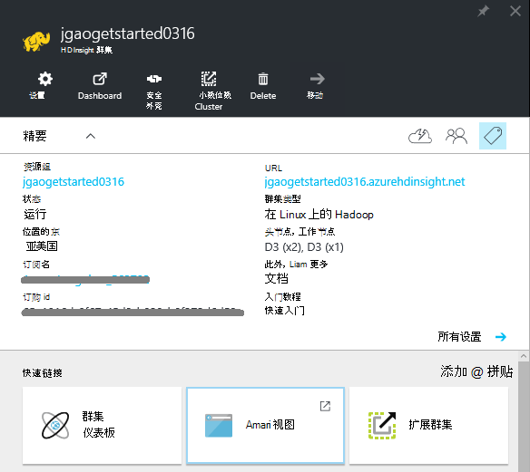
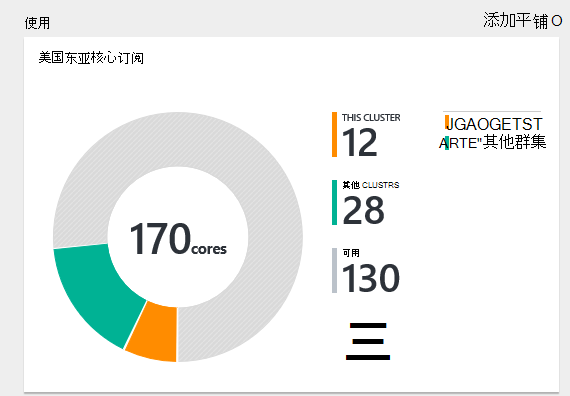
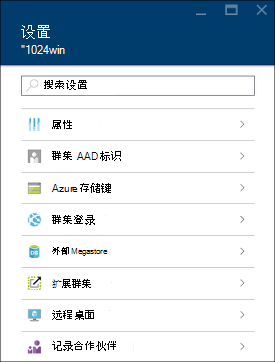
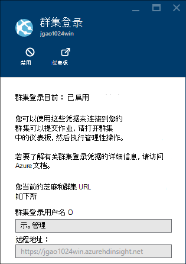
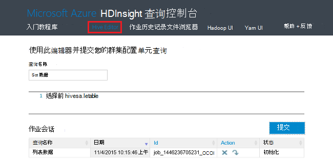
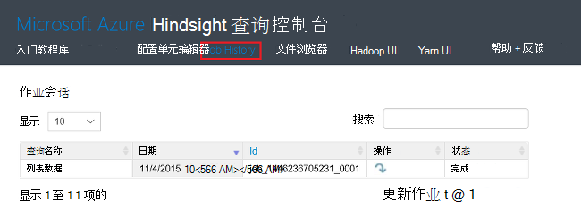
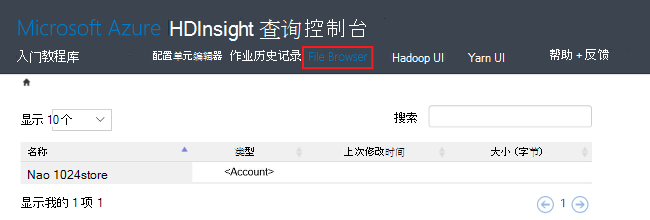
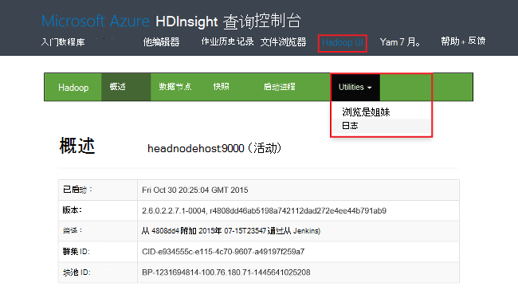
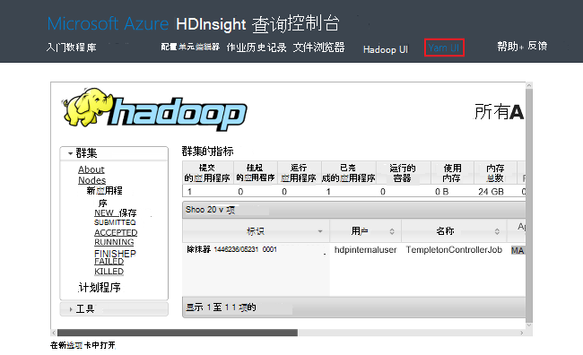
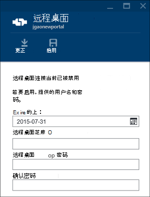

<properties
    pageTitle="管理 Hadoop 群集中使用 Azure 门户 HDInsight |Microsoft Azure"
    description="了解如何管理 HDInsight 服务。 创建 HDInsight 群集，打开交互式的 JavaScript 控制台，打开 Hadoop 命令控制台。"
    services="hdinsight"
    documentationCenter=""
    tags="azure-portal"
    authors="mumian"
    manager="jhubbard"
    editor="cgronlun"/>

<tags
    ms.service="hdinsight"
    ms.workload="big-data"
    ms.tgt_pltfrm="na"
    ms.devlang="na"
    ms.topic="article"
    ms.date="09/14/2016"
    ms.author="jgao"/>

# 通过使用 Azure 门户管理中 HDInsight 的 Hadoop 群集

[AZURE.INCLUDE [selector](../../includes/hdinsight-portal-management-selector.md)]

使用[Azure 的门户网站][azure-portal]，可以在 Azure HDInsight 中创建 Hadoop 群集、 更改 Hadoop 用户密码，并启用远程桌面协议 (RDP)，以便您可以访问该群集上的 Hadoop 命令控制台。

这篇文章中的信息仅适用于基于窗口的 HDInsight 群集。 管理基于 Linux 的群集的信息，请单击上面的选项卡上选择器。

单击制表符选择器有关在 HDInsight 使用其他工具中创建 Hadoop 群集的信息。 

**系统必备组件**

在开始这篇文章之前，您必须具有以下︰

- **Azure 订阅**。 请参阅[获取 Azure 免费试用版](https://azure.microsoft.com/documentation/videos/get-azure-free-trial-for-testing-hadoop-in-hdinsight/)。
- **Azure 存储帐户**-HDInsight 群集使用 Azure Blob 存储容器作为默认的文件系统。 有关如何 Azure Blob 存储提供无缝的体验，使用 HDInsight 群集的详细信息，请参阅[使用 Azure Blob 存储与 HDInsight](hdinsight-hadoop-use-blob-storage.md)。 有关创建 Azure 存储帐户的详细信息，请参阅[如何创建存储帐户](../storage/storage-create-storage-account.md)。

##打开门户网站

1. 登录到[https://portal.azure.com](https://portal.azure.com)。
2. 打开门户网站后，您可以︰

    - 单击**新建**从左侧的菜单以创建新的群集︰
    
        
    - 单击左侧菜单中的**HDInsight 群集**。
    
        

    如果**HDInsight**没有出现在左侧菜单中，单击**浏览**。 

    

##创建群集

使用门户的创建说明，请参阅[创建 HDInsight 群集](hdinsight-provision-clusters.md#create-using-the-preview-portal)。

HDInsight 适用于宽的 Hadoop 组件。 已验证和支持的组件的列表，请参阅[什么版本的 Hadoop 是 Azure HDInsight 中](hdinsight-component-versioning.md)。 可以通过使用以下选项之一，来定制 HDInsight:

- 使用脚本操作来运行自定义脚本，可以自定义群集或者更改群集配置或安装自定义组件，例如 Giraph 或 Solr。 有关详细信息，请参见[使用脚本操作的自定义 HDInsight 群集](hdinsight-hadoop-customize-cluster.md)。
- 在群集创建过程中使用 Azure PowerShell 的 HDInsight.NET SDK 中的群集自定义参数。 这些配置更改通过群集的生存期内，然后将保留，不受群集节点 reimages Azure 平台定期执行维护。 有关使用群集的自定义参数的详细信息，请参阅[创建 HDInsight 群集](hdinsight-provision-clusters.md)。
- 作为 JAR 文件，某些本机的 Java 组件，如 Mahout 和级联，可以运行在群集上。 可以分布到 Azure Blob 存储，并通过 Hadoop 作业提交机制提交到 HDInsight 群集这些 JAR 文件。 有关详细信息，请参阅[提交 Hadoop 作业以编程方式](hdinsight-submit-hadoop-jobs-programmatically.md)。

    >[AZURE.NOTE] 如果您有问题于 HDInsight 群集部署 JAR 文件或调用 HDInsight 群集上的 JAR 文件，请与[Microsoft 技术支持](https://azure.microsoft.com/support/options/)。

    > 级联不支持 HDInsight，并不适用于 Microsoft 技术支持。 有关受支持的组件的列表，请参阅[由 HDInsight 提供的群集版本中的新增功能？](hdinsight-component-versioning.md)。

通过使用远程桌面连接群集上的自定义软件安装不受支持。 应避免存储的头节点的驱动器上的任何文件一样，如果您需要重新创建群集将丢失。 我们建议在 Azure Blob 存储上存储文件。 Blob 存储是持久性的。

##列出并显示群集

1. 登录到[https://portal.azure.com](https://portal.azure.com)。
2. 单击左侧菜单中的**HDInsight 群集**。
3. 单击群集名称。 如果群集列表很长，您可以使用页面顶部的筛选器。
4. 双击该列表以显示详细信息从一个群集。

    **菜单和重点**︰

    
    
    - 若要自定义的菜单，在菜单中，右键单击任意位置，然后单击**自定义**。
    - **设置**和**所有设置**︰ 显示**设置**刀片式服务器群集，以便您可以访问该群集的详细的配置信息。
    - **仪表板**、**群集的仪表板**和**URL︰ 这些是访问群集控制板，用于基于 Linux 的群集是 Ambari 网站的所有方法。-**安全壳 * *: 显示的说明进行操作以连接到使用安全外壳协议 (SSH) 连接的群集。
    - **扩展群集**︰ 允许您更改工作人员为此群集的节点数。
    - **删除**︰ 删除群集。
    - **快速入门 ()**︰ 显示的信息将帮助您开始使用 HDInsight。
    - **用户 ()**︰ 允许您在 Azure 订阅为其他用户设置_门户_管理该群集的权限。
    
        > [AZURE.IMPORTANT] 这_只_影响访问和向在 Azure 的门户中，该群集的权限，谁可以连接到或将作业提交到 HDInsight 群集没有影响。
    - **标记 ()**︰ 标记允许您设置键/值对来定义自定义分类的云服务。 例如，可能会创建一个密钥，该密钥命名__项目__，然后与特定项目关联的所有服务都使用一个公共值。
    - **Ambari 视图**︰ Ambari 网站的链接。
    
    > [AZURE.IMPORTANT] 要管理所提供的 HDInsight 群集服务，必须使用 Ambari Web 或 Ambari REST API。 使用 Ambari 的详细信息，请参阅[管理 HDInsight 群集使用 Ambari](hdinsight-hadoop-manage-ambari.md)。

    **用法**︰
    
    
    
5. 单击**设置**。

    

    - **属性**︰ 查看群集属性。
    - **群集 AAD 标识**︰ 
    - **Azure 存储键**︰ 查看默认的存储帐户和它的键。 存储帐户是配置在群集创建过程中。
    - **群集登录**︰ 更改群集 HTTP 用户名称和密码。
    - **外部的 Metastores**︰ 查看配置单元和 Oozie metastores。 Metastores 只能在群集创建过程中配置。
    - **扩展群集**︰ 增加和减少群集辅助节点的数量。
    - **远程桌面**︰ 启用和禁用远程桌面 (RDP) 访问和配置的 RDP 用户名。  RDP 用户名称必须不同于 HTTP 用户名称。
    - **记录的合作伙伴**︰
    
    > [AZURE.NOTE] 这是泛型列表的可用设置。不是所有将会显示所有的群集类型。

6. 单击**属性**:

    以下属性列表︰
    
    - **主机名**︰ 群集名称。
    - **群集的 URL**。
    - **状态**︰ 包括中止，接受，ClusterStorageProvisioned、 AzureVMConfiguration、 HDInsightConfiguration，运行，运行，错误，删除，删除超时、 DeleteQueued、 DeleteTimedout、 DeleteError、 PatchQueued、 CertRolloverQueued、 ResizeQueued、 ClusterCustomization
    - **地区**︰ Azure 的位置。 支持 Azure 的位置的列表，请参阅[HDInsight 定价](https://azure.microsoft.com/pricing/details/hdinsight/)上的**区域**的下拉列表框。
    - **创建数据**。
    - **操作系统**︰ **Windows**或**Linux**。
    - **类型**︰ Hadoop，HBase，风暴，激励。 
    - **版本**。 请参阅[HDInsight 版本](hdinsight-component-versioning.md)
    - **订阅**︰ 订阅名称。
    - **预订 ID**。
    - **主数据源**。 Azure Blob 存储帐户作为默认值使用 Hadoop 文件系统。
    - **辅助节点定价层**。
    - **头节点定价层**。

##删除群集

删除群集不会删除默认存储帐户或任何链接的存储帐户。 通过使用相同的存储帐户和相同的 metastores，您可以重新创建群集。

1. 登录到[门户网站][azure-portal]。
2. 单击**浏览所有**从左侧菜单、 **HDInsight 群集**、 群集名称。
3. 从顶部的菜单中，单击**删除**，然后按照说明进行操作。

请参阅[暂停/关闭群集](#pauseshut-down-clusters)。

##扩展群集
缩放功能的群集允许您更改在 Azure HDInsight 中运行而无需重新创建群集的群集使用的辅助节点数。

>[AZURE.NOTE] 只有群集与 HDInsight 3.1.3 版或更高版本支持。 如果您不确定您的群集的版本，您可以检查属性页。  请参阅[列表和显示群集](#list-and-show-clusters)。

更改群集由 HDInsight 支持的每种类型的数据节点数的影响︰

- Hadoop

    可以无缝地增加工作人员而不会影响任何未决或正在运行的作业运行 Hadoop 群集中的节点数。 在进行该操作时，也可以提交新的作业。 缩放操作的失败是正常处理，以便群集始终处于正常工作状态。

    Hadoop 群集按比例缩小通过减少数据节点数，当群集中的服务会重新启动。 这将导致所有正在运行和挂起的作业完成时缩放操作失败。 操作完成后，您便可以但是，重新提交作业。

- HBase

    可以无缝地添加或 HBase 群集中删除节点正在运行。 在完成将缩放操作的几分钟内自动平衡区域服务器。 但是，您可以通过登录到群集的 headnode，并从命令提示符窗口中运行以下命令手动平衡区域服务器︰

        >pushd %HBASE_HOME%\bin
        >hbase shell
        >balancer

    使用 HBase 外壳程序的详细信息，请参阅]
- 风暴

    可以无缝地添加或风暴群集中删除数据节点正在运行。 但后缩放操作成功完成，您将需要重新平衡拓扑。

    重新平衡可以通过两种方式来实现︰

    * 风暴的 web 用户界面
    * 命令行界面 (CLI) 工具

    请[Apache 风暴文档](http://storm.apache.org/documentation/Understanding-the-parallelism-of-a-Storm-topology.html)的更多详细信息，参阅。

    风暴的 web 用户界面是 HDInsight 群集上可用︰

    

    下面是如何使用的 CLI 命令来重新平衡风暴拓扑示例︰

        ## Reconfigure the topology "mytopology" to use 5 worker processes,
        ## the spout "blue-spout" to use 3 executors, and
        ## the bolt "yellow-bolt" to use 10 executors

        $ storm rebalance mytopology -n 5 -e blue-spout=3 -e yellow-bolt=10

**扩展群集**

1. 登录到[门户网站][azure-portal]。
2. 单击**浏览所有**从左侧菜单、 **HDInsight 群集**、 群集名称。
3. 从顶部的菜单中，单击**设置**，然后单击**扩展群集**。
4. 输入**数量的辅助节点**。 群集节点的数量限制在 Azure 订阅之间各不相同。 您可以联系帐单支持增加的限制。  成本信息将反映节点数对所做的更改。

    

##暂停/关闭群集

Hadoop 作业的多数是偶尔运行批处理作业只。 对于大多数的 Hadoop 群集，有长的群集不用于处理的时间。 使用 HDInsight，您的数据以便不使用时，可以安全地删除群集 Azure 存储中存储。
您还收取 HDInsight 群集，即使不在使用中。 由于群集的费用超过存储的费用很多时候，它删除群集时未使用经济意义。

有许多方法可以编制过程︰

- 用户 Azure 数据工厂。 按需和自定义链接的 HDInsight 服务，请参阅[Azure HDInsight 链接服务](../data-factory/data-factory-compute-linked-services.md)和[转换和分析使用 Azure 数据工厂](../data-factory/data-factory-data-transformation-activities.md)。
- 使用 Azure PowerShell。  请参见[分析航班延迟数据](hdinsight-analyze-flight-delay-data.md)。
- 使用 Azure CLI。 请参阅[使用 Azure CLI 管理 HDInsight 群集](hdinsight-administer-use-command-line.md)。
- 使用 HDInsight.NET SDK。 请参阅[提交 Hadoop 作业](hdinsight-submit-hadoop-jobs-programmatically.md)。

定价的信息，请参阅[HDInsight 定价](https://azure.microsoft.com/pricing/details/hdinsight/)。 要从门户中删除群集，请参阅[删除群集](#delete-clusters)

##更改群集用户名

HDInsight 群集还可有两个用户帐户。 HDInsight 群集用户帐户是在创建过程中创建的。 您还可以创建用于访问 RDP 能够通过群集 RDP 用户帐户。 请参阅[启用远程桌面](#connect-to-hdinsight-clusters-by-using-rdp)。

**若要更改 HDInsight 群集用户名称和密码**

1. 登录到[门户网站][azure-portal]。
2. 单击**浏览所有**从左侧菜单、 **HDInsight 群集**、 群集名称。
3. 从顶部的菜单中，单击**设置**，然后单击**群集登录**。
4. 如果已启用**群集登录**，您必须单击**禁用**，然后单击**启用**更改用户名和密码之前.
4. 更改**群集登录名**和/或**群集登录密码**，然后单击**保存**。

    

##授予/撤销访问权限

HDInsight 群集有以下 HTTP web 服务 （这些服务的所有具有 rest 风格的终结点）︰

- ODBC
- JDBC
- Ambari
- Oozie
- Templeton

默认情况下，这些服务要授予的访问权限。 您可以撤消/授予访问权从 Azure 的门户。

>[AZURE.NOTE] 授予/撤销访问权限，将重置群集用户名称和密码。

**若要授予/撤销访问 HTTP web 服务**

1. 登录到[门户网站][azure-portal]。
2. 单击**浏览所有**从左侧菜单、 **HDInsight 群集**、 群集名称。
3. 从顶部的菜单中，单击**设置**，然后单击**群集登录**。
4. 如果已启用**群集登录**，您必须单击**禁用**，然后单击**启用**更改用户名和密码之前.
6. 对于**群集的登录用户名**和**群集的登录密码**，输入新的用户名和密码 （分别） 群集。
7. 单击**保存**。

    

##查找默认的存储帐户

每个 HDInsight 群集具有默认存储帐户。 默认的存储帐户和群集及其密钥出现在**设置**下/**属性**/**Azure 存储密钥**。 请参阅[列表和显示群集](#list-and-show-clusters)。

    
##找到的资源组 

在 Azure 资源管理器模式中，每个 HDInsight 群集创建与 Azure 的资源组。 在出现群集所属的 Azure 的资源组︰

- 群集列表有一个**资源组**列。
- 群集的**基本**图块。  

请参阅[列表和显示群集](#list-and-show-clusters)。
   
##打开 HDInsight 查询控制台

HDInsight 查询控制台包括以下功能︰

- **入门库**︰ 若要使用库，请参阅[使用 Azure HDInsight 前已启动库了解 Hadoop](hdinsight-learn-hadoop-use-sample-gallery.md)。
- **配置单元编辑器**︰ GUI web 界面，用于配置单元作业提交。  请参阅[使用查询控制台运行配置单元的查询](hdinsight-hadoop-use-hive-query-console.md)。

    

- **作业历史记录**︰ 监视 Hadoop 作业。  

    

    单击要显示的详细信息，包括作业属性，**作业查询**，**查询名称**和 * * 作业输出。 您还可以下载到您的工作站的查询并输出。

- **文件浏览器**︰ 浏览默认存储帐户和链接的存储帐户。

    

    屏幕抓图，在**<Account>**类型指示该项是否 Azure 存储帐户。  单击要浏览的文件的帐户名称。
    
- **Hadoop UI**。

    
    
    从 **Hadoop 用户界面*，您可以浏览文件，并检查日志。 

- **Yarn UI**。

    

##运行配置单元查询

若要从门户运行配置单元作业，请在 HDInsight 查询控制台中单击**配置单元编辑器**。 请参阅[控制台打开 HDInsight 查询](#open-hdinsight-query-console)。

##监视作业

若要监视作业从门户，请在 HDInsight 查询控制台中单击**作业历史记录**。 请参阅[控制台打开 HDInsight 查询](#open-hdinsight-query-console)。

##浏览文件

若要浏览文件存储在默认的存储帐户和链接的存储帐户，请在 HDInsight 查询控制台中单击**文件浏览器**。 请参阅[控制台打开 HDInsight 查询](#open-hdinsight-query-console)。

您还可以在 HDInsight 控制台中使用**Hadoop UI** **浏览文件系统**实用程序。  请参阅[控制台打开 HDInsight 查询](#open-hdinsight-query-console)。

##监视群集使用情况

__使用__HDInsight 群集刀片明订阅使用 HDInsight，以及分配给该群集和它们为此群集中的节点的分配方式的内核数显示可用的内核数有关的信息。 请参阅[列表和显示群集](#list-and-show-clusters)。

> [AZURE.IMPORTANT] 若要监视 HDInsight 群集所提供的服务，必须使用 Ambari Web 或 Ambari REST API。 使用 Ambari 的详细信息，请参阅[使用 Ambari 管理 HDInsight 群集](hdinsight-hadoop-manage-ambari.md)

##Hadoop UI 中打开

若要监视群集、 浏览文件系统中，并检查日志，请在 HDInsight 查询控制台中单击**Hadoop UI** 。 请参阅[控制台打开 HDInsight 查询](#open-hdinsight-query-console)。

##打开 Yarn UI

若要使用 Yarn 用户界面，请在 HDInsight 查询控制台中单击**Yarn UI** 。 请参阅[控制台打开 HDInsight 查询](#open-hdinsight-query-console)。

##连接到群集使用 RDP

您在中提供了创建群集的凭据在群集本身通过远程桌面服务在群集上，而不是授予访问权限。 当您配置一个群集或群集配置之后，可以打开远程桌面访问。 有关在创建时启用远程桌面的说明，请参阅[创建 HDInsight 群集](hdinsight-provision-clusters.md)。

**若要启用远程桌面**

1. 登录到[门户网站][azure-portal]。
2. 单击**浏览所有**从左侧菜单、 **HDInsight 群集**、 群集名称。
3. 从顶部的菜单中，单击**设置**，然后单击**远程桌面**。
4. **到期**、**远程桌面用户名**和**远程桌面密码**，请输入，然后单击**启用**。

    

    到期的默认值为一周。
> [AZURE.NOTE] 您还可以使用 HDInsight.NET SDK 在群集中启用远程桌面。 按以下方式使用 HDInsight 客户端对象的**EnableRdp**方法︰**客户端。EnableRdp (群集名称，位置、"rdpuser"、"rdppassword"，DateTime.Now.AddDays(6))**。 同样，若要在群集上禁用远程桌面，可以使用**客户端。DisableRdp （群集名称、 位置）**。 有关这些方法的详细信息，请参阅[HDInsight.NET SDK 参考](http://go.microsoft.com/fwlink/?LinkId=529017)。 这是仅适用于在 Windows 上运行的 HDInsight 群集。

**若要使用 RDP 连接到群集**

1. 登录到[门户网站][azure-portal]。
2. 单击**浏览所有**从左侧菜单、 **HDInsight 群集**、 群集名称。
3. 从顶部的菜单中，单击**设置**，然后单击**远程桌面**。
4. 单击**连接**并按照说明进行操作。 如果连接是禁用的则必须先启用它。 请确保使用的远程桌面用户的用户名和密码。  您不能使用群集的用户凭据。

##打开 Hadoop 命令行

若要通过使用远程桌面连接到群集并使用 Hadoop 命令行，您必须首先已经启用远程桌面访问群集上一节中所述。

**若要打开 Hadoop 命令行**

1. 连接到群集使用的远程桌面。
8. 在桌面上，双击**Hadoop 命令行**。

    ![HDI。HadoopCommandLine][image-hadoopcommandline]

    Hadoop 命令的详细信息，请参阅[Hadoop 命令参考](http://hadoop.apache.org/docs/current/hadoop-project-dist/hadoop-common/CommandsManual.html)。

在上一个屏幕快照中，文件夹名包含嵌入的 Hadoop 版本号码。 版本号可以更改基于安装在群集上的 Hadoop 组件的版本。 可以使用 Hadoop 环境变量来引用这些文件夹。 例如︰

    cd %hadoop_home%
    cd %hive_home%
    cd %hbase_home%
    cd %pig_home%
    cd %sqoop_home%
    cd %hcatalog_home%
    
##下一步行动
在本文中，您学习了如何创建一个 HDInsight 群集通过门户网站，以及如何打开 Hadoop 命令行工具。 若要了解详细信息，请参阅下列文章︰

* [管理使用 Azure PowerShell 的 HDInsight](hdinsight-administer-use-powershell.md)
* [HDInsight 使用 Azure CLI 管理](hdinsight-administer-use-command-line.md)
* [创建 HDInsight 群集](hdinsight-provision-clusters.md)
* [以编程方式提交 Hadoop 作业](hdinsight-submit-hadoop-jobs-programmatically.md)
* [开始使用 Azure HDInsight](hdinsight-hadoop-linux-tutorial-get-started.md)
* [Hadoop 的版本是 Azure HDInsight？](hdinsight-component-versioning.md)

[azure-portal]: https://portal.azure.com
[image-hadoopcommandline]: ./media/hdinsight-administer-use-management-portal/hdinsight-hadoop-command-line.png "Hadoop 命令行"
