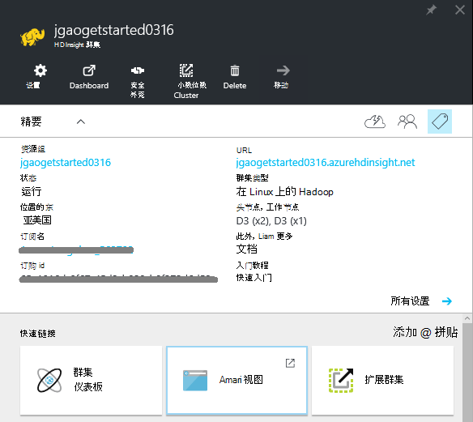
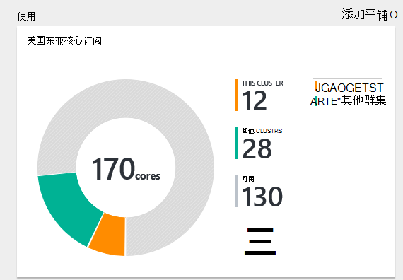
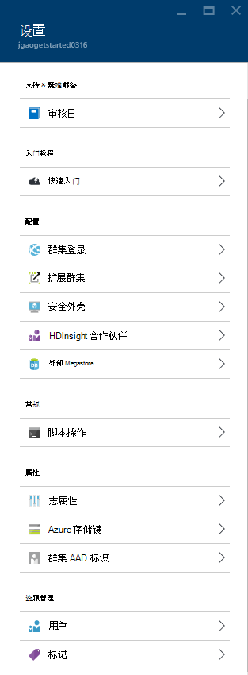
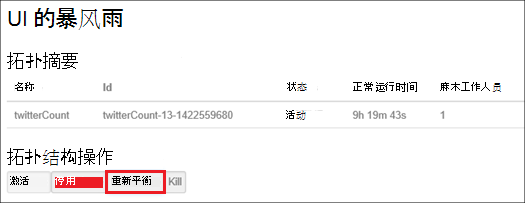
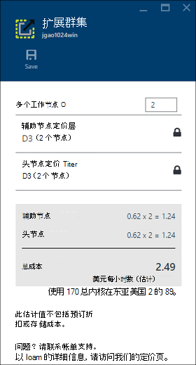
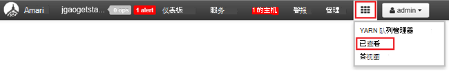

<properties
    pageTitle="管理基于 Linux 的 Hadoop 群集中使用 Azure 门户 HDInsight |Microsoft Azure"
    description="了解如何创建和管理基于 Linux 的 HDInsight 群集使用 Azure 的门户。"
    services="hdinsight"
    documentationCenter=""
    authors="mumian"
    manager="jhubbard"
    editor="cgronlun"
    tags="azure-portal"/>

<tags
    ms.service="hdinsight"
    ms.workload="big-data"
    ms.tgt_pltfrm="na"
    ms.devlang="na"
    ms.topic="article"
    ms.date="08/10/2016"
    ms.author="jgao"/>

#通过使用 Azure 门户管理中 HDInsight 的 Hadoop 群集

[AZURE.INCLUDE [selector](../../includes/hdinsight-portal-management-selector.md)]

使用[Azure 的门户网站][azure-portal]，您可以管理在 Azure HDInsight 基于 Linux 的群集。 有关创建使用其它工具 HDInsight 在 Hadoop 群集使用制表符选择器。 

**系统必备组件**

在开始这篇文章之前，您必须具有以下︰

- **Azure 订阅**。 请参阅[获取 Azure 免费试用版](https://azure.microsoft.com/documentation/videos/get-azure-free-trial-for-testing-hadoop-in-hdinsight/)。

##打开门户网站

1. 登录到[https://portal.azure.com](https://portal.azure.com)。
2. 打开门户网站后，您可以︰

    - 单击**新建**从左侧的菜单以创建新的群集︰
    
        
    - 单击左侧菜单列出现有群集中的**HDInsight 群集**
    
        

        如果**HDInsight**没有出现在左侧菜单中，单击**浏览**，然后单击**HDInsight 群集**。

        

##创建群集

[AZURE.INCLUDE [delete-cluster-warning](../../includes/hdinsight-delete-cluster-warning.md)]

HDInsight 适用于宽的 Hadoop 组件。 已验证和支持的组件的列表，请参阅[什么版本的 Hadoop 是 Azure HDInsight 中](hdinsight-component-versioning.md)。 常规群集创建信息，请参阅[HDInsight 中的创建 Hadoop 群集](hdinsight-hadoop-provision-linux-clusters.md)。 

##列出并显示群集

1. 登录到[https://portal.azure.com](https://portal.azure.com)。
2. 单击左侧菜单列出现有群集中的**HDInsight 群集**。
3. 单击群集名称。 如果群集列表很长，您可以使用页面顶部的筛选器。
4. 双击该列表以显示详细信息从一个群集。

    **菜单和重点**︰

    
    
    - **设置**和**所有设置**︰ 显示**设置**刀片式服务器群集，以便您可以访问该群集的详细的配置信息。
    - **仪表板**、**群集的仪表板**和 * * URL︰ 这些是访问群集控制板，用于基于 Linux 的群集是 Ambari 网站的所有方法。
    - **安全外壳**︰ 显示的说明进行操作以连接到使用安全外壳协议 (SSH) 连接的群集。
    - **扩展群集**︰ 允许您更改工作人员为此群集的节点数。
    - **删除**︰ 删除群集。
    - **快速入门 ()**︰ 显示的信息将帮助您开始使用 HDInsight。
    - **用户 ()**︰ 允许您在 Azure 订阅为其他用户设置_门户_管理该群集的权限。
    
        > [AZURE.IMPORTANT] 这_只_影响访问和向在 Azure 的门户中，该群集的权限，谁可以连接到或将作业提交到 HDInsight 群集没有影响。
    - **标记 ()**︰ 标记允许您设置键/值对来定义自定义分类的云服务。 例如，可能会创建一个密钥，该密钥命名__项目__，然后与特定项目关联的所有服务都使用一个公共值。
    - **Ambari 视图**︰ Ambari 网站的链接。
    
    > [AZURE.IMPORTANT] 要管理所提供的 HDInsight 群集服务，必须使用 Ambari Web 或 Ambari REST API。 使用 Ambari 的详细信息，请参阅[管理 HDInsight 群集使用 Ambari](hdinsight-hadoop-manage-ambari.md)。

    **用法**︰
    
    
    
5. 单击**设置**。

    

    - **审核日志**︰
    - **快速启动**︰ 显示的信息将帮助您开始使用 HDInsight。
    - **扩展群集**︰ 增加和减少群集辅助节点的数量。
    - **安全外壳**︰ 显示的说明进行操作以连接到使用安全外壳协议 (SSH) 连接的群集。
    - **HDInsight 合作伙伴**︰ 添加/删除当前的 HDInsight 合作伙伴。
    - **外部的 Metastores**︰ 查看配置单元和 Oozie metastores。 Metastores 只能在群集创建过程中配置。
    - **脚本操作**︰ 在群集上运行操作的脚本。
    - **属性**︰ 查看群集属性。
    - **Azure 存储键**︰ 查看默认的存储帐户和它的键。 存储帐户是配置在群集创建过程中。
    - **群集 AAD 标识**︰ 
    - **用户**︰ 可以在 Azure 订阅为其他用户设置_门户_管理该群集的权限。
    - **标记**︰ 标记允许您设置键/值对来定义自定义分类的云服务。 例如，可能会创建一个密钥，该密钥命名__项目__，然后与特定项目关联的所有服务都使用一个公共值。
    
    > [AZURE.NOTE] 这是泛型列表的可用设置。不是所有将会显示所有的群集类型。

6. 单击**属性**:

    这些属性为︰
    
    - **主机名**︰ 群集名称。
    - **群集的 URL**。
    - **状态**︰ 包括中止，接受，ClusterStorageProvisioned、 AzureVMConfiguration、 HDInsightConfiguration，运行，运行，错误，删除，删除超时、 DeleteQueued、 DeleteTimedout、 DeleteError、 PatchQueued、 CertRolloverQueued、 ResizeQueued、 ClusterCustomization
    - **地区**︰ Azure 的位置。 支持 Azure 的位置的列表，请参阅[HDInsight 定价](https://azure.microsoft.com/pricing/details/hdinsight/)上的**区域**的下拉列表框。
    - **创建数据**。
    - **操作系统**︰ **Windows**或**Linux**。
    - **类型**︰ Hadoop，HBase，风暴，激励。 
    - **版本**。 请参阅[HDInsight 版本](hdinsight-component-versioning.md)
    - **订阅**︰ 订阅名称。
    - **预订 ID**。
    - **默认数据源**︰ 默认群集文件系统。
    - **辅助节点定价层**。
    - **头节点定价层**。

##删除群集

删除群集不会删除默认存储帐户或任何链接的存储帐户。 通过使用相同的存储帐户和相同的 metastores，您可以重新创建群集。 建议您重新创建群集时，使用新的默认 Blob 容器。

1. 登录到[门户网站][azure-portal]。
2. 单击**浏览所有**从左侧菜单、 **HDInsight 群集**、 群集名称。
3. 从顶部的菜单中，单击**删除**，然后按照说明进行操作。

请参阅[暂停/关闭群集](#pauseshut-down-clusters)。

##扩展群集
缩放功能的群集允许您更改在 Azure HDInsight 中运行而无需重新创建群集的群集使用的辅助节点数。

>[AZURE.NOTE] 只有群集与 HDInsight 3.1.3 版或更高版本支持。 如果您不确定您的群集的版本，您可以检查属性页。  请参阅[列表和显示群集](#list-and-show-clusters)。

更改群集由 HDInsight 支持的每种类型的数据节点数的影响︰

- Hadoop

    可以无缝地增加工作人员而不会影响任何未决或正在运行的作业运行 Hadoop 群集中的节点数。 在进行该操作时，也可以提交新的作业。 缩放操作的失败是正常处理，以便群集始终处于正常工作状态。

    Hadoop 群集按比例缩小通过减少数据节点数，当群集中的服务会重新启动。 这将导致所有正在运行和挂起的作业完成时缩放操作失败。 操作完成后，您便可以但是，重新提交作业。

- HBase

    可以无缝地添加或 HBase 群集中删除节点正在运行。 在完成将缩放操作的几分钟内自动平衡区域服务器。 但是，您可以通过登录到群集的 headnode，并从命令提示符窗口中运行以下命令手动平衡区域服务器︰

        >pushd %HBASE_HOME%\bin
        >hbase shell
        >balancer

    使用 HBase 外壳程序的详细信息，请参阅]
- 风暴

    可以无缝地添加或风暴群集中删除数据节点正在运行。 但后缩放操作成功完成，您将需要重新平衡拓扑。

    重新平衡可以通过两种方式来实现︰

    * 风暴的 web 用户界面
    * 命令行界面 (CLI) 工具

    请[Apache 风暴文档](http://storm.apache.org/documentation/Understanding-the-parallelism-of-a-Storm-topology.html)的更多详细信息，参阅。

    风暴的 web 用户界面是 HDInsight 群集上可用︰

    

    下面是如何使用的 CLI 命令来重新平衡风暴拓扑示例︰

        ## Reconfigure the topology "mytopology" to use 5 worker processes,
        ## the spout "blue-spout" to use 3 executors, and
        ## the bolt "yellow-bolt" to use 10 executors

        $ storm rebalance mytopology -n 5 -e blue-spout=3 -e yellow-bolt=10

**扩展群集**

1. 登录到[门户网站][azure-portal]。
2. 单击**浏览所有**从左侧菜单、 **HDInsight 群集**、 群集名称。
3. 从顶部的菜单中，单击**设置**，然后单击**扩展群集**。
4. 输入**数量的辅助节点**。 群集节点的数量限制在 Azure 订阅之间各不相同。 您可以联系帐单支持增加的限制。  成本信息将反映节点数对所做的更改。

    

##暂停/关闭群集

Hadoop 作业的多数是偶尔运行批处理作业只。 对于大多数的 Hadoop 群集，有长的群集不用于处理的时间。 使用 HDInsight，您的数据以便不使用时，可以安全地删除群集 Azure 存储中存储。
您还收取 HDInsight 群集，即使不在使用中。 由于群集的费用超过存储的费用很多时候，它删除群集时未使用经济意义。

有许多方法可以编制过程︰

- 用户 Azure 数据工厂。 请参阅[创建请求基于 Linux 的 Hadoop 群集在 HDInsight 使用 Azure 数据工厂](hdinsight-hadoop-create-linux-clusters-adf.md)创建拨号链接的 HDInsight 服务。
- 使用 Azure PowerShell。  请参见[分析航班延迟数据](hdinsight-analyze-flight-delay-data.md)。
- 使用 Azure CLI。 请参阅[使用 Azure CLI 管理 HDInsight 群集](hdinsight-administer-use-command-line.md)。
- 使用 HDInsight.NET SDK。 请参阅[提交 Hadoop 作业](hdinsight-submit-hadoop-jobs-programmatically.md)。

定价的信息，请参阅[HDInsight 定价](https://azure.microsoft.com/pricing/details/hdinsight/)。 要从门户中删除群集，请参阅[删除群集](#delete-clusters)

##更改密码

HDInsight 群集还可有两个用户帐户。 HDInsight （也群集用户帐户 HTTP 用户帐户） 和 SSH 用户帐户在创建过程中创建。 您可以 Ambari web 用户界面来更改群集用户帐户的用户名和密码，以及脚本操作更改 SSH 用户帐户

###更改群集的用户密码

Ambari Web 用户界面可用于更改群集的用户密码。 要登录到 Ambari，您必须使用的现有群集用户名和密码。

> [AZURE.NOTE] 如果您更改群集的用户 （管理员） 密码，这可能会导致操作与此群集故障运行的脚本。 如果您有任何持久的脚本操作该目标辅助节点，这些可能会失败时添加节点到群集中通过调整大小操作。 脚本操作的详细信息，请参阅[自定义 HDInsight 群集使用脚本的操作](hdinsight-hadoop-customize-cluster-linux.md)。

1. 登录到 Ambari Web 用户界面使用 HDInsight 群集用户凭据。 默认的用户名是**管理员**。 URL 是**https://&lt;HDInsight 群集名称 > azurehdinsight.net**。
2. 从顶部的菜单中，单击**管理**，然后单击"管理 Ambari"。 
3. 从左侧的菜单中，单击**用户**。
4. 单击**管理**。
5. 单击**更改密码**。

Ambari 然后更改群集中所有节点上的密码。

###SSH 用户密码更改

1. 使用文本编辑器，将以下内容保存为一个名为__changepassword.sh__的文件。

    > [AZURE.IMPORTANT] 您必须使用的编辑器，将用作行尾的换行符。 如果编辑器使用 CRLF，脚本将无法运行。
    
        #! /bin/bash
        USER=$1
        PASS=$2

        usermod --password $(echo $PASS | openssl passwd -1 -stdin) $USER

2. 将文件上载到的存储位置，可以通过使用 HTTP 或 HTTPS 地址 HDInsight。 例如，一个公共文件存储如 OneDrive 或 Azure Blob 存储。 这下一步需要保存到文件中，URI （HTTP 或 HTTPS 地址，）。

3. 从 Azure 门户，选择 HDInsight 群集，然后选择__所有设置__。 从__设置__刀片式服务器，选择__脚本操作__。

4. 从__脚本操作__刀片式服务器，选择__提交新__。 __提交脚本操作__刀片式服务器出现时，请输入以下信息。

  	| 字段 | 值 |
  	| ----- | ----- |
  	| 名称 | 更改 ssh 密码 |
  	| Bash 脚本 URI | 对 changepassword.sh 文件 URI |
  	| 节点 （头、 工作人员、 Nimbus、 主管、 Zookeeper 等） | ✓ 列出的所有节点类型 |
  	| 参数 | 请输入 SSH 用户名称，然后选择新的密码。 应该有一个空格之间的用户名称和密码。
  	| 保持此脚本操作... | 选中此字段。

5. 选择__创建__应用脚本。 一旦脚本完成后，您将能够连接到群集使用 SSH 使用新密码。

##授予/撤销访问权限

HDInsight 群集有以下 HTTP web 服务 （这些服务的所有具有 rest 风格的终结点）︰

- ODBC
- JDBC
- Ambari
- Oozie
- Templeton

默认情况下，这些服务要授予的访问权限。 您可以撤消/授予使用[Azure CLI](hdinsight-administer-use-command-line.md#enabledisable-http-access-for-a-cluster)和[Azure PowerShell](hdinsight-administer-use-powershell.md#grantrevoke-access)的访问权限。

##查找订阅 ID

**若要查找您 Azure 的订阅 Id**

1. 登录到[门户网站][azure-portal]。
2. 从左侧的菜单中，单击**浏览所有**，然后单击**订阅**。 每个订阅具有一个名称和一个 id。

每个群集与 Azure 的订阅。 群集**基本**图块上显示的订阅 ID。 请参阅[列表和显示群集](#list-and-show-clusters)。

##找到的资源组 

在 ARM 模式中，每个 HDInsight 群集创建与 Azure 的资源组。 在出现群集所属的 Azure 的资源组︰

- 群集列表有一个**资源组**列。
- 群集的**基本**图块。  

请参阅[列表和显示群集](#list-and-show-clusters)。

##查找默认的存储帐户

每个 HDInsight 群集具有默认存储帐户。 默认的存储帐户和群集及其密钥出现在**设置**下/**属性**/**Azure 存储密钥**。 请参阅[列表和显示群集](#list-and-show-clusters)。

##运行配置单元查询

您不能直接从 Azure 的门户网站，运行配置单元作业，但您可以使用 Ambari Web 用户界面上的配置单元视图。

**运行配置单元使用 Ambari 配置单元视图的查询**

1. 登录到 Ambari Web 用户界面使用 HDInsight 群集用户凭据。 则默认用户名为**admin**。 URL 是**https://&lt;HDInsight 群集名称 > azurehdinsight.net**。
2. 下面的屏幕快照中所示，请打开配置单元视图︰  

    
3. 从顶部的菜单中单击**查询**。
4. 在**查询编辑器**中，输入配置单元查询，然后单击**执行**。

##监视作业

请参阅[管理 HDInsight 群集使用 Ambari Web 用户界面](hdinsight-hadoop-manage-ambari.md#monitoring)。

##浏览文件

使用 Azure 的门户，您可以浏览默认容器的内容。

1. 登录到[https://portal.azure.com](https://portal.azure.com)。
2. 单击左侧菜单列出现有群集中的**HDInsight 群集**。
3. 单击群集名称。 如果群集列表很长，您可以使用页面顶部的筛选器。
4. 单击**设置**。
5. 从刀片式服务器**设置**，请单击**Azure 存储密钥**。
6. 单击默认存储帐户的名称。
7. 单击**Blob**拼贴。
8. 单击默认容器名称。

##监视群集使用情况

__使用__HDInsight 群集刀片明订阅使用 HDInsight，以及分配给该群集和它们为此群集中的节点的分配方式的内核数显示可用的内核数有关的信息。 请参阅[列表和显示群集](#list-and-show-clusters)。

> [AZURE.IMPORTANT] 若要监视 HDInsight 群集所提供的服务，必须使用 Ambari Web 或 Ambari REST API。 使用 Ambari 的详细信息，请参阅[使用 Ambari 管理 HDInsight 群集](hdinsight-hadoop-manage-ambari.md)

##连接到群集

请参阅[使用 Hadoop HDInsight 使用 SSH 在蜂巢](hdinsight-hadoop-use-hive-ssh.md#ssh)。
    
##下一步行动
在本文中，您学习了如何创建一个 HDInsight 群集通过门户网站，以及如何打开 Hadoop 命令行工具。 若要了解详细信息，请参阅下列文章︰

* [管理使用 Azure PowerShell 的 HDInsight](hdinsight-administer-use-powershell.md)
* [HDInsight 使用 Azure CLI 管理](hdinsight-administer-use-command-line.md)
* [创建 HDInsight 群集](hdinsight-provision-clusters.md)
* [使用 HDInsight 中的配置单元](hdinsight-use-hive.md)
* [在 HDInsight 中使用小猪](hdinsight-use-pig.md)
* [在 HDInsight 中使用 Sqoop](hdinsight-use-sqoop.md)
* [开始使用 Azure HDInsight](hdinsight-hadoop-linux-tutorial-get-started.md)
* [Hadoop 的版本是 Azure HDInsight？](hdinsight-component-versioning.md)

[azure-portal]: https://portal.azure.com
[image-hadoopcommandline]: ./media/hdinsight-administer-use-portal-linux/hdinsight-hadoop-command-line.png "Hadoop 命令行"
