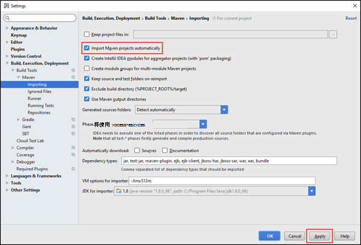

<properties
    pageTitle="创建独立 scala HDInsight 触发群集上运行的应用程序 |Microsoft Azure"
    description="了解如何创建独立的触发 HDInsight 触发群集上运行应用程序。"
    services="hdinsight"
    documentationCenter=""
    authors="nitinme"
    manager="jhubbard"
    editor="cgronlun"
    tags="azure-portal"/>

<tags
    ms.service="hdinsight"
    ms.workload="big-data"
    ms.tgt_pltfrm="na"
    ms.devlang="na"
    ms.topic="article"
    ms.date="10/28/2016"
    ms.author="nitinme"/>

# 创建独立的 Scala HDInsight Linux 上的 Apache 触发群集上运行应用程序

这篇文章提供了分步指导开发独立触发应用程序编写 Scala 使用 Maven IntelliJ 的想法。 文章将使用 Apache Maven 作为生成系统和启动与现有的 Maven 原型的 Scala 提供的 IntelliJ 的想法。  在较高级别创建 Scala IntelliJ 思想中的应用程序将涉及以下步骤︰

* 为生成系统使用 Maven。
* 更新项目对象模型 (POM) 文件，以解决触发模块依赖关系。
* 在 Scala 中编写您的应用程序。
* 生成一个可以提交到 HDInsight 触发群集的 jar 文件。
* 在使用晚触发群集上运行应用程序。

>[AZURE.NOTE] HDInsight 还提供 IntelliJ 的想法插件工具，可以简化创建和提交到 Linux 上的 HDInsight 触发群集的应用程序的过程。 有关详细信息，请参阅[为 IntelliJ 创意来创建和提交触发应用程序使用 HDInsight 工具插件](hdinsight-apache-spark-intellij-tool-plugin.md)。

**系统必备组件**

* Azure 的订阅。 请参阅[获取 Azure 免费试用版](https://azure.microsoft.com/documentation/videos/get-azure-free-trial-for-testing-hadoop-in-hdinsight/)。
* 一个 HDInsight Linux 上的 Apache 触发群集。 有关说明，请参阅[创建 Apache 触发群集在 Azure HDInsight](hdinsight-apache-spark-jupyter-spark-sql.md)。
* Oracle Java 开发工具包。 您可以从[这里](http://www.oracle.com/technetwork/java/javase/downloads/jdk8-downloads-2133151.html)安装它。
* Java IDE。 本文使用 IntelliJ 15.0.1 的想法。 您可以从[这里](https://www.jetbrains.com/idea/download/)安装它。

## Scala 的插件安装 IntelliJ 的想法

IntelliJ 知道安装没有不提示启用 Scala 插件，如果启动 IntelliJ 的想法，然后通过以下步骤来安装该插件︰

1. 启动 IntelliJ 的想法和从欢迎屏幕中，单击**配置**，然后单击**插件**。

    

2. 在下一个屏幕中，单击左下角中的**安装 JetBrains 插件**。 打开**浏览 JetBrains 插件**对话框中，在 Scala 中搜索，然后单击**安装**。

    

3. 该插件已成功安装后，单击**重新启动 IntelliJ 主意按钮**以重新启动 IDE。

## 创建独立 Scala 项目

1. 启动 IntelliJ 的想法，然后创建一个新项目。 在新建项目对话框中，进行以下几种选择，，然后单击**下一步**。

    

    * 作为项目类型选择**Maven** 。
    * 指定**项目的 SDK**。 单击新建，然后定位到 Java 安装目录，通常`C:\Program Files\Java\jdk1.8.0_66`。
    * 选择**从原型的创建**选项。
    * 从原型列表中，选择**org.scala tools.archetypes:scala 原型简单**。 这将创建适当的目录结构，并下载所需的默认依赖项以编写 Scala 的程序。

2. 提供**GroupId**、 **ArtifactId**和**版本**相关的值。 单击**下一步**。

3. 在下一个对话框中，指定 Maven 主目录和其他用户设置，接受默认设置，单击**下一步**。

4. 在最后的对话框中，指定的项目名称和位置，然后单击**完成**。

5. 删除位于**src\test\scala\com\microsoft\spark\example**的**MySpec.Scala**文件。 应用程序不需要它。

6. 如果需要，请重命名默认源文件和测试文件。 IntelliJ 的想法在左窗格中，导航到**src\main\scala\com.microsoft.spark.example**。 右键单击**App.scala**，单击**重构**、 单击重命名文件并在对话框中提供了应用程序的新名称，然后单击**重构**。

      

7. 在随后的步骤中，您将更新 pom.xml 定义触发 Scala 应用程序的依赖项。 下载并自动解析这些依赖项，则必须相应地配置 Maven。

    

    1. 从**文件**菜单上，单击**设置**。
    2. 在**设置**对话框中，定位为**生成执行，部署** > **生成工具** > **Maven** > **导入**。
    3. 选择**导入 Maven 项目自动**选项。
    4. 单击**应用**，然后单击**确定**。

8. 更新 Scala 源代码文件以包含应用程序代码。 打开现有示例代码替换为以下代码并保存所做的更改。 此代码读取 （适用于所有 HDInsight 触发群集），HVAC.csv 从数据检索第六列，只有一位数字的行并将输出写入**/HVACOut**群集的默认存储容器下。

        package com.microsoft.spark.example

        import org.apache.spark.SparkConf
        import org.apache.spark.SparkContext

        /**
          * Test IO to wasb
          */
        object WasbIOTest {
          def main (arg: Array[String]): Unit = {
            val conf = new SparkConf().setAppName("WASBIOTest")
            val sc = new SparkContext(conf)

            val rdd = sc.textFile("wasbs:///HdiSamples/HdiSamples/SensorSampleData/hvac/HVAC.csv")

            //find the rows which have only one digit in the 7th column in the CSV
            val rdd1 = rdd.filter(s => s.split(",")(6).length() == 1)

            rdd1.saveAsTextFile("wasbs:///HVACout")
          }
        }

9. 更新 pom.xml。

    1.  在`<project>\<properties>`中添加以下︰

            <scala.version>2.10.4</scala.version>
            <scala.compat.version>2.10.4</scala.compat.version>
            <scala.binary.version>2.10</scala.binary.version>

    2. 在`<project>\<dependencies>`中添加以下︰

            <dependency>
              <groupId>org.apache.spark</groupId>
              <artifactId>spark-core_${scala.binary.version}</artifactId>
              <version>1.4.1</version>
            </dependency>

    将更改保存到 pom.xml 中。

10. 创建的.jar 文件。 IntelliJ 的想法能够创建的 JAR 作为项目的项目。 执行以下步骤。

    1. 从**文件**菜单中，单击**项目结构**。
    2. 在**项目结构**对话框中，单击**项目**，然后单击加号。 弹出的对话框中，从**jar/文件夹**，请单击，再单击**从模块依赖关系**。

        

    3. 在**创建 JAR 从模块**对话框中，单击省略号 () 对**主类**。

    4. 在**选择主类**对话框中，选择默认情况下显示的类，然后单击**确定**。

        

    5. 在**创建 JAR 从模块**对话框中，确保选中选项**解压缩到 JAR 的目标**，然后单击**确定**。 此命令创建一个 JAR 的所有依赖项。

        

    6. 输出布局选项卡列出了 Maven 项目中包括的所有 jar。 您可以选择并删除其上的 Scala 应用程序没有直接相关性。 我们将在此处创建的应用程序，您可以删除除最后一个 （**SparkSimpleApp 编译输出**）。 选择 jar 来删除，然后单击**删除**图标。

        

        请确保**在品牌上建立**框被选中，这可确保每次生成或更新项目时创建的 jar。 **应用**单击然后单击**确定**。

    7. 从菜单栏中，单击**生成**，然后单击**生成项目**。 您还可以单击**生成项目**以创建 jar。 在**\out\artifacts**中创建输出 jar。

        

## 在触发群集上运行应用程序

在群集上运行应用程序，必须执行以下操作︰

* **复制应用程序 jar 到 Azure 存储 blob**与群集相关。 [**AzCopy**](../storage/storage-use-azcopy.md)，一种命令行实用工具，可用于执行此操作。 没有可用于将数据上载了大量其他的客户端。 您可以找到更多的关于它们在[Hadoop 作业中 HDInsight 的数据上载](hdinsight-upload-data.md)。

* 为触发群集**使用晚远程提交应用程序作业**。 在 HDInsight 上的触发群集包括公开其他终结点，远程提交触发作业的晚。 有关详细信息，请参阅[使用远程触发 HDInsight 簇与晚提交触发作业](hdinsight-apache-spark-livy-rest-interface.md)。

## 请参见

* [概述︰ 在 Azure HDInsight 上的 Apache 触发](hdinsight-apache-spark-overview.md)

### 方案

* [触发与 BI︰ 执行与 BI 工具一起使用在 HDInsight 中的触发交互式数据分析](hdinsight-apache-spark-use-bi-tools.md)

* [机器学习与触发︰ 用于分析使用 HVAC 数据的生成温度 HDInsight 中使用触发](hdinsight-apache-spark-ipython-notebook-machine-learning.md)

* [机器学习与触发︰ 使用 HDInsight 来预测食品检查结果中的触发](hdinsight-apache-spark-machine-learning-mllib-ipython.md)

* [HDInsight 用于构建实时流的应用程序中触发流︰ 使用触发](hdinsight-apache-spark-eventhub-streaming.md)

* [在 HDInsight 中使用触发网站日志分析](hdinsight-apache-spark-custom-library-website-log-analysis.md)

### 创建和运行应用程序

* [在群集上使用晚触发远程运行作业](hdinsight-apache-spark-livy-rest-interface.md)

### 工具和扩展

* [使用 HDInsight 工具插件为 IntelliJ 创意来创建和提交触发 Scala applicatons](hdinsight-apache-spark-intellij-tool-plugin.md)

* [使用 HDInsight 工具插件为 IntelliJ 创意来触发应用程序进行远程调试](hdinsight-apache-spark-intellij-tool-plugin-debug-jobs-remotely.md)

* [在 HDInsight 上触发群集使用 Zeppelin 笔记本](hdinsight-apache-spark-use-zeppelin-notebook.md)

* [内核可用于触发 HDInsight 群集中的 Jupyter 笔记本](hdinsight-apache-spark-jupyter-notebook-kernels.md)

* [外部包使用 Jupyter 笔记本](hdinsight-apache-spark-jupyter-notebook-use-external-packages.md)

* [在您的计算机上安装 Jupyter 并连接到一个 HDInsight 触发的群集](hdinsight-apache-spark-jupyter-notebook-install-locally.md)

### 管理资源

* [管理在 Azure HDInsight Apache 触发群集的资源](hdinsight-apache-spark-resource-manager.md)

* [跟踪和调试 HDInsight 在 Apache 触发群集上运行的作业](hdinsight-apache-spark-job-debugging.md)
