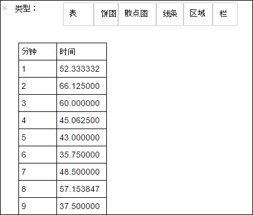

<properties 
    pageTitle="与 HDInsight 触发群集一起使用的自定义库来分析网站日志 |Microsoft Azure" 
    description="使用自定义库与 HDInsight 触发群集分析网站日志" 
    services="hdinsight" 
    documentationCenter="" 
    authors="nitinme" 
    manager="jhubbard" 
    editor="cgronlun"
    tags="azure-portal"/>

<tags 
    ms.service="hdinsight" 
    ms.workload="big-data" 
    ms.tgt_pltfrm="na" 
    ms.devlang="na" 
    ms.topic="article" 
    ms.date="10/05/2016" 
    ms.author="nitinme"/>

# 分析 HDInsight Linux 上的 Apache 触发群集中使用的自定义库的网站日志

此笔记本演示了如何使用 HDInsight 上的触发自定义库的日志数据进行分析。 我们使用自定义库是一个名为**iislogparser.py**的 Python 库。

> [AZURE.TIP] 本教程中也有作为 Jupyter 笔记本在您在 HDInsight 中创建一个触发 (Linux) 群集。 笔记本的经验，可以从笔记本本身运行的 Python 代码段。 若要执行从本教程的笔记本内，创建触发群集时，启动 Jupyter 笔记本 (`https://CLUSTERNAME.azurehdinsight.net/jupyter`)，然后在**PySpark**文件夹下运行**分析与触发使用自定义的 library.ipynb 记录**的笔记本。

**系统必备组件︰**

您必须具有以下各项︰

- Azure 的订阅。 请参阅[获取 Azure 免费试用版](https://azure.microsoft.com/documentation/videos/get-azure-free-trial-for-testing-hadoop-in-hdinsight/)。
- 一个 HDInsight Linux 上的 Apache 触发群集。 有关说明，请参阅[创建 Apache 触发群集在 Azure HDInsight](hdinsight-apache-spark-jupyter-spark-sql.md)。

## RDD 为保存原始数据

在本节中，我们使用[Jupyter](https://jupyter.org)笔记本与 HDInsight 在 Apache 触发群集运行作业处理原始示例数据并将其另存为配置单元表。 示例数据是一个.csv 文件 (hvac.csv) 可在默认情况下所有群集。

您的数据保存为一个配置单元表后，在下一节中我们将连接到使用电源 BI 和 Tableau BI 工具配置单元表。

1. 从[Azure 门户网站](https://portal.azure.com/)，startboard，从单击触发群集的拼贴 （如果您将它固定到 startboard）。 您还可以向下**浏览所有**群集导航 > **HDInsight 群集**。   

2. 从触发群集刀片式服务器，**群集的仪表板**，请单击，然后单击**Jupyter 笔记本**。 出现提示时，输入群集管理员凭据。

    > [AZURE.NOTE] 通过在浏览器中打开下面的 URL，还可能会达到 Jupyter 笔记本为群集。 __群集名称__替换您的群集的名称︰
    >
    > `https://CLUSTERNAME.azurehdinsight.net/jupyter`

2. 创建新的笔记本。 单击**新建**，然后单击**PySpark**。

    

3. 创建并打开名为 Untitled.pynb 的新笔记本。 单击顶部的笔记本名称并输入好记的名称。

    

4. 由于在创建笔记本使用 PySpark 内核，您不需要显式创建任何上下文。 运行第一个代码单元格时，将为您自动创建添姿加配置单元的上下文。 您可以通过导入的类型所需的这种情况下开始。 空单元格中粘贴下面的代码段，然后按**SHIFT + ENTER**。

        from pyspark.sql import Row
        from pyspark.sql.types import *

5. 创建 RDD 在群集上使用已经可用的示例日志数据。 可以访问默认存储帐户与**\HdiSamples\HdiSamples\WebsiteLogSampleData\SampleLog\909f2b.log**在群集中的数据。

        logs = sc.textFile('wasbs:///HdiSamples/HdiSamples/WebsiteLogSampleData/SampleLog/909f2b.log')

6. 检索日志示例设置来验证已成功完成上一步。

        logs.take(5)

    您应该看到类似于下面的输出︰

        # -----------------
        # THIS IS AN OUTPUT
        # -----------------

        [u'#Software: Microsoft Internet Information Services 8.0',
         u'#Fields: date time s-sitename cs-method cs-uri-stem cs-uri-query s-port cs-username c-ip cs(User-Agent) cs(Cookie) cs(Referer) cs-host sc-status sc-substatus sc-win32-status sc-bytes cs-bytes time-taken',
         u'2014-01-01 02:01:09 SAMPLEWEBSITE GET /blogposts/mvc4/step2.png X-ARR-LOG-ID=2ec4b8ad-3cf0-4442-93ab-837317ece6a1 80 - 1.54.23.196 Mozilla/5.0+(Windows+NT+6.3;+WOW64)+AppleWebKit/537.36+(KHTML,+like+Gecko)+Chrome/31.0.1650.63+Safari/537.36 - http://weblogs.asp.net/sample/archive/2007/12/09/asp-net-mvc-framework-part-4-handling-form-edit-and-post-scenarios.aspx www.sample.com 200 0 0 53175 871 46',
         u'2014-01-01 02:01:09 SAMPLEWEBSITE GET /blogposts/mvc4/step3.png X-ARR-LOG-ID=9eace870-2f49-4efd-b204-0d170da46b4a 80 - 1.54.23.196 Mozilla/5.0+(Windows+NT+6.3;+WOW64)+AppleWebKit/537.36+(KHTML,+like+Gecko)+Chrome/31.0.1650.63+Safari/537.36 - http://weblogs.asp.net/sample/archive/2007/12/09/asp-net-mvc-framework-part-4-handling-form-edit-and-post-scenarios.aspx www.sample.com 200 0 0 51237 871 32',
         u'2014-01-01 02:01:09 SAMPLEWEBSITE GET /blogposts/mvc4/step4.png X-ARR-LOG-ID=4bea5b3d-8ac9-46c9-9b8c-ec3e9500cbea 80 - 1.54.23.196 Mozilla/5.0+(Windows+NT+6.3;+WOW64)+AppleWebKit/537.36+(KHTML,+like+Gecko)+Chrome/31.0.1650.63+Safari/537.36 - http://weblogs.asp.net/sample/archive/2007/12/09/asp-net-mvc-framework-part-4-handling-form-edit-and-post-scenarios.aspx www.sample.com 200 0 0 72177 871 47']

## 分析日志数据使用自定义的 Python 库

7. 在上面的输出中的前几行包含标头信息和每个剩余的行与该标头中所描述的模式匹配。 分析这些日志可能是复杂的。 因此，我们使用定制的 Python 库 (**iislogparser.py**)，使得分析此类日志要容易得多。 默认情况下，此库将附带在**/HdiSamples/HdiSamples/WebsiteLogSampleData/iislogparser.py**HDInsight 上触发群集。

    但是，此库不在`PYTHONPATH`因此我们不能使用它通过使用导入语句`import iislogparser`。 若要使用此库，我们必须将其分发给工作人员的所有节点中。 运行下面的代码段。

        sc.addPyFile('wasbs:///HdiSamples/HdiSamples/WebsiteLogSampleData/iislogparser.py')

9. `iislogparser`提供了功能， `parse_log_line` ，该属性返回`None`如果日志行是一个标题行，并且返回的实例`LogLine`类如果遇到日志行。 使用`LogLine`类来提取 RDD 只有日志行︰

        def parse_line(l):
            import iislogparser
            return iislogparser.parse_log_line(l)
        logLines = logs.map(parse_line).filter(lambda p: p is not None).cache()

10. 检索几个提取行的日志以验证步骤已成功完成。

        logLines.take(2)

    输出内容应类似如下︰

        # -----------------
        # THIS IS AN OUTPUT
        # -----------------

        [2014-01-01 02:01:09 SAMPLEWEBSITE GET /blogposts/mvc4/step2.png X-ARR-LOG-ID=2ec4b8ad-3cf0-4442-93ab-837317ece6a1 80 - 1.54.23.196 Mozilla/5.0+(Windows+NT+6.3;+WOW64)+AppleWebKit/537.36+(KHTML,+like+Gecko)+Chrome/31.0.1650.63+Safari/537.36 - http://weblogs.asp.net/sample/archive/2007/12/09/asp-net-mvc-framework-part-4-handling-form-edit-and-post-scenarios.aspx www.sample.com 200 0 0 53175 871 46,
        2014-01-01 02:01:09 SAMPLEWEBSITE GET /blogposts/mvc4/step3.png X-ARR-LOG-ID=9eace870-2f49-4efd-b204-0d170da46b4a 80 - 1.54.23.196 Mozilla/5.0+(Windows+NT+6.3;+WOW64)+AppleWebKit/537.36+(KHTML,+like+Gecko)+Chrome/31.0.1650.63+Safari/537.36 - http://weblogs.asp.net/sample/archive/2007/12/09/asp-net-mvc-framework-part-4-handling-form-edit-and-post-scenarios.aspx www.sample.com 200 0 0 51237 871 32]

11. `LogLine`类，又有一些有用的方法，像`is_error()`，它返回一个日志条目是否具有一个错误代码。 用于计算所提取的日志行中的错误号，然后到另一个文件中记录所有错误。

        errors = logLines.filter(lambda p: p.is_error())
        numLines = logLines.count()
        numErrors = errors.count()
        print 'There are', numErrors, 'errors and', numLines, 'log entries'
        errors.map(lambda p: str(p)).saveAsTextFile('wasbs:///HdiSamples/HdiSamples/WebsiteLogSampleData/SampleLog/909f2b-2.log')

    您应该看到类似于下面的输出︰

        # -----------------
        # THIS IS AN OUTPUT
        # -----------------

        There are 30 errors and 646 log entries

12. 您可以使用**Matplotlib**来构造数据的可视化效果。 例如，如果您想要确定长时间运行的请求的原因，您可能想要查找花大部分时间平均提供的文件。
以下片段检索花大部分时间来满足请求前 25 个资源。

        def avgTimeTakenByKey(rdd):
            return rdd.combineByKey(lambda line: (line.time_taken, 1),
                                    lambda x, line: (x[0] + line.time_taken, x[1] + 1),
                                    lambda x, y: (x[0] + y[0], x[1] + y[1]))\
                      .map(lambda x: (x[0], float(x[1][0]) / float(x[1][1])))
            
        avgTimeTakenByKey(logLines.map(lambda p: (p.cs_uri_stem, p))).top(25, lambda x: x[1])

    您应该看到类似于下面的输出︰

        # -----------------
        # THIS IS AN OUTPUT
        # -----------------

        [(u'/blogposts/mvc4/step13.png', 197.5),
         (u'/blogposts/mvc2/step10.jpg', 179.5),
         (u'/blogposts/extractusercontrol/step5.png', 170.0),
         (u'/blogposts/mvc4/step8.png', 159.0),
         (u'/blogposts/mvcrouting/step22.jpg', 155.0),
         (u'/blogposts/mvcrouting/step3.jpg', 152.0),
         (u'/blogposts/linqsproc1/step16.jpg', 138.75),
         (u'/blogposts/linqsproc1/step26.jpg', 137.33333333333334),
         (u'/blogposts/vs2008javascript/step10.jpg', 127.0),
         (u'/blogposts/nested/step2.jpg', 126.0),
         (u'/blogposts/adminpack/step1.png', 124.0),
         (u'/BlogPosts/datalistpaging/step2.png', 118.0),
         (u'/blogposts/mvc4/step35.png', 117.0),
         (u'/blogposts/mvcrouting/step2.jpg', 116.5),
         (u'/blogposts/aboutme/basketball.jpg', 109.0),
         (u'/blogposts/anonymoustypes/step11.jpg', 109.0),
         (u'/blogposts/mvc4/step12.png', 106.0),
         (u'/blogposts/linq8/step0.jpg', 105.5),
         (u'/blogposts/mvc2/step18.jpg', 104.0),
         (u'/blogposts/mvc2/step11.jpg', 104.0),
         (u'/blogposts/mvcrouting/step1.jpg', 104.0),
         (u'/blogposts/extractusercontrol/step1.png', 103.0),
         (u'/blogposts/sqlvideos/sqlvideos.jpg', 102.0),
         (u'/blogposts/mvcrouting/step21.jpg', 101.0),
         (u'/blogposts/mvc4/step1.png', 98.0)]

13. 此外可以将此信息以图形的形式。 作为第一步创建一个图，让我们首先创建一个临时表**AverageTime**。 表分组日志以查看是否有任何不寻常的延迟高峰在任何特定时间的时间。

        avgTimeTakenByMinute = avgTimeTakenByKey(logLines.map(lambda p: (p.datetime.minute, p))).sortByKey()
        schema = StructType([StructField('Minutes', IntegerType(), True),
                             StructField('Time', FloatType(), True)])
                             
        avgTimeTakenByMinuteDF = sqlContext.createDataFrame(avgTimeTakenByMinute, schema)
        avgTimeTakenByMinuteDF.registerTempTable('AverageTime')

14. 然后，您可以运行下面的 SQL 查询，以获取**AverageTime**表中的所有记录。

        %%sql -o averagetime
        SELECT * FROM AverageTime

    `%%sql`魔术跟`-o averagetime`可确保 Jupyter 服务器 (通常是群集中的 headnode) 在本地保存查询的输出中。 输出为具有指定的名称**averagetime** [Pandas](http://pandas.pydata.org/) dataframe 保持不变。

    您应该看到类似于下面的输出︰

    

    有关详细信息`%%sql`的神奇功能，以及其他 magics 与 PySpark 内核，可查看[Jupyter 笔记本与触发 HDInsight 群集上可用的内核](hdinsight-apache-spark-jupyter-notebook-kernels.md#why-should-i-use-the-new-kernels)。

15. 您现在可以使用 Matplotlib，用来构造数据，可视化的库来创建绘图。 必须从本地持久化的**averagetime** dataframe 创建绘图，因为代码段必须以`%%local`魔术。 这将确保在 Jupyter 服务器上本地运行的代码。

        %%local
        %matplotlib inline
        import matplotlib.pyplot as plt
        
        plt.plot(averagetime['Minutes'], averagetime['Time'], marker='o', linestyle='--')
        plt.xlabel('Time (min)')
        plt.ylabel('Average time taken for request (ms)')

    您应该看到类似于下面的输出︰

    

16. 运行应用程序之后，您应该关闭笔记本以释放资源。 为此，请从笔记本上的**文件**菜单上，单击**关闭并暂停**。 这将关闭和关闭笔记本。
    

## 请参见

* [概述︰ 在 Azure HDInsight 上的 Apache 触发](hdinsight-apache-spark-overview.md)

### 方案

* [触发与 BI︰ 执行与 BI 工具一起使用在 HDInsight 中的触发交互式数据分析](hdinsight-apache-spark-use-bi-tools.md)

* [机器学习与触发︰ 用于分析使用 HVAC 数据的生成温度 HDInsight 中使用触发](hdinsight-apache-spark-ipython-notebook-machine-learning.md)

* [机器学习与触发︰ 使用 HDInsight 来预测食品检查结果中的触发](hdinsight-apache-spark-machine-learning-mllib-ipython.md)

* [HDInsight 用于构建实时流的应用程序中触发流︰ 使用触发](hdinsight-apache-spark-eventhub-streaming.md)

### 创建和运行应用程序

* [创建独立的应用程序使用 Scala](hdinsight-apache-spark-create-standalone-application.md)

* [在群集上使用晚触发远程运行作业](hdinsight-apache-spark-livy-rest-interface.md)

### 工具和扩展

* [使用 HDInsight 工具插件为 IntelliJ 创意来创建和提交触发 Scala applicatons](hdinsight-apache-spark-intellij-tool-plugin.md)

* [使用 HDInsight 工具插件为 IntelliJ 创意来触发应用程序进行远程调试](hdinsight-apache-spark-intellij-tool-plugin-debug-jobs-remotely.md)

* [在 HDInsight 上触发群集使用 Zeppelin 笔记本](hdinsight-apache-spark-use-zeppelin-notebook.md)

* [内核可用于触发 HDInsight 群集中的 Jupyter 笔记本](hdinsight-apache-spark-jupyter-notebook-kernels.md)

* [外部包使用 Jupyter 笔记本](hdinsight-apache-spark-jupyter-notebook-use-external-packages.md)

* [在您的计算机上安装 Jupyter 并连接到一个 HDInsight 触发的群集](hdinsight-apache-spark-jupyter-notebook-install-locally.md)

### 管理资源

* [管理在 Azure HDInsight Apache 触发群集的资源](hdinsight-apache-spark-resource-manager.md)

* [跟踪和调试 HDInsight 在 Apache 触发群集上运行的作业](hdinsight-apache-spark-job-debugging.md)
