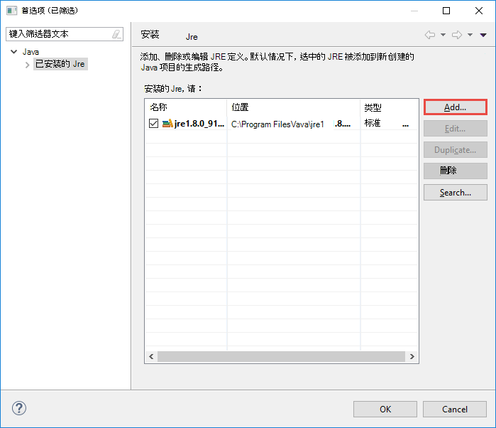

 <properties
    pageTitle="创建触发 Scala 应用程序使用的 Azure Toolkit 的 Eclipse 的 HDInsight 工具 |Microsoft Azure"
    description="了解如何创建独立的触发 HDInsight 触发群集上运行应用程序。"
    services="hdinsight"
    documentationCenter=""
    authors="nitinme"
    manager="jhubbard"
    editor="cgronlun"
    tags="azure-portal"/>

<tags
    ms.service="hdinsight"
    ms.workload="big-data"
    ms.tgt_pltfrm="na"
    ms.devlang="na"
    ms.topic="article"
    ms.date="08/30/2016"
    ms.author="nitinme"/>

# 在 Azure Toolkit 的 Eclipse 中使用 HDInsight 工具创建触发 HDInsight 触发 Linux 群集的应用程序

这篇文章提供了开发触发应用程序编写 Scala 和提交到 HDInsight 触发群集使用的 Azure Toolkit 的 Eclipse 的 HDInsight 工具的分步指导。 您可以在几种不同的方法使用工具︰

* 制定并提交 HDInsight 触发群集上的一个 Scala 触发应用程序
* 若要访问您的 Azure HDInsight 触发群集资源
* 开发并在本地运行一个 Scala 触发应用程序

>[AZURE.IMPORTANT] 此工具可用于创建和提交仅在 Linux 上 HDInsight 触发群集的应用程序。

##系统必备组件

* Azure 的订阅。 请参阅[获取 Azure 免费试用版](https://azure.microsoft.com/documentation/videos/get-azure-free-trial-for-testing-hadoop-in-hdinsight/)。

* 一个 HDInsight Linux 上的 Apache 触发群集。 有关说明，请参阅[创建 Apache 触发群集在 Azure HDInsight](hdinsight-apache-spark-jupyter-spark-sql.md)。

* Oracle Java 开发工具包版本 7 和 8 的版本。 
    * **Java SDK 7**用于编译触发项目 HDInsight 群集支持 Java 版本 7。 您可以从[此处](http://www.oracle.com/technetwork/java/javase/downloads/jdk7-downloads-1880260.html)下载 Java SDK 7。
    * **Java SDK 8**用于 Eclipse IDE 运行时。 您可以从[此处](http://www.oracle.com/technetwork/java/javase/downloads/jdk8-downloads-2133151.html)下载它。

* Eclipse IDE。 本文使用 Eclipse 霓虹灯。 您可以从[这里](https://www.eclipse.org/downloads/)安装它。

* Scala 的 Eclipse 的 IDE。 
    * **如果您有安装 Eclipse IDE**，您可以添加 Scala IDE 插件通过转到**帮助** -> **安装新软件**，并为源，以下载 Eclipse 的 Scala 插件添加[http://download.scala-ide.org/sdk/lithium/e44/scala211/stable/site](http://download.scala-ide.org/sdk/lithium/e44/scala211/stable/site) 。 
    * **如果您没有安装 Eclipse IDE**，您可以直接从[此处](http://scala-ide.org/download/sdk.html)安装 Scala IDE。 可以从该链接下载的.zip 文件、 将其提取、 定位到**/eclipse**文件夹中，然后从那里运行**eclipse.exe**文件。
    
    >[AZURE.NOTE] 此文档中的步骤基于 Eclipse 的 IDE 使用 Scala 插件安装。

* 触发 SDK。 您可以从[此处](http://go.microsoft.com/fwlink/?LinkID=723585&clcid=0x409)下载它。

* 安装[https://www.eclipse.org/efxclipse/install.html](https://www.eclipse.org/efxclipse/install.html)e (fx) clipse。

## 在 Azure Toolkit Eclipse 安装 HDInsight 工具

HDInsight 工具使用 Eclipse 为 Eclipse 的 Azure Toolkit 的一部分。 有关如何安装 Azure Toolkit 的说明，请参阅[安装 Eclipse 的 Azure Toolkit](../azure-toolkit-for-eclipse-installation.md)。

## 登录到 Azure 订阅

1. 启动 Eclipse IDE，然后打开 Azure 资源管理器。 从 IDE 中的**窗口**菜单中，单击**显示视图**，然后单击**其他**。 从打开的对话框中，展开**Azure**， **Azure 资源管理器中**，单击，然后单击**确定**。

    

2. **Azure**节点在**Azure 资源管理器**中的用鼠标右键单击，然后单击**管理订阅**。

3. 在**管理订阅**对话框中，单击**登录**并输入您 Azure 的凭据。

    

4. 您登录后，**管理订阅**对话框将列出与凭据关联的所有 Azure 订阅。 单击**关闭**对话框中。

5. 在 Azure 资源管理器选项卡中，展开**HDInsight**来查看在您的订购的 HDInsight 触发簇。

    

6. 您可以进一步扩展群集名称节点以查看与群集相关的资源 （例如存储帐户）。

    

## 设置触发 Scala 项目 HDInsight 触发群集

1. 从 Eclipse IDE 的工作区，单击**文件**，单击**新建**，然后单击**项目**。 

2. 在**新建项目**向导中，展开**HDInsight**，选择**触发 HDInsight (Scala) 上的**，，然后单击**下一步**。

    

3. 在**HDInsight Scala 的新项目**对话框中，如图所示，所示输入/选择值，然后单击**下一步**。

    

    * 输入项目的名称。
    * 在**JRE**的框中，请确保**使用 JRE 的执行环境**设置为**JavaSE 1.7**。
    * 请确保触发 SDK 设置为下载 SDK 的位置。 下载位置的链接包含在本主题前面的[系统必备组件](#prerequisites)。 在上图中所示，还可以从包含在此对话框中的链接下载 SDK。    

4. 在下一个对话框中，单击**库**选项卡，然后双击**JRE 系统库 [JavaSE 1.7]**。

    

5. 在**编辑库**对话框中，请确保**执行环境**设置为**JavaSE-1.7(jdk1.7.0_79)**。 如果它不能作为选项，请按照下面的步骤。

    1. 选择**可选的 JRE** ， **JavaSE-1.7(jdk1.7.0_79)**可用。
    2. 如果没有，请单击**安装 Jre**按钮。

          

    3. 在**安装的 Jre**对话框中，单击**添加**。

            

    4. 在**JRE 类型**对话框中，选择**标准 VM**，，然后单击**下一步**

            

    5. 在**JRE 定义**对话框中，单击目录，然后导航到 JDK 7 安装位置并选择**jdk1.7.0_79**的根文件夹。

            

    6. 单击**完成**。 在**安装 Jre**对话框中，选择新添加的 JRE，，然后单击**确定**。

           

    7. 新添加的 JRE 应列出的**执行环境**。 单击**完成**。

           

6. 重新打开**库**选项卡上，双击**Scala 库容器 [2.11.8]**。 在**编辑库**对话框中，选择**固定 Scala 库容器︰ 2.10.6**。 

    

    直到退出项目设置对话框中，单击**完成**。

## 创建 Scala HDInsight 触发群集的应用程序

1. 在已经打开 Eclipse IDE 中，从**包资源管理器**中，展开您在前面创建的项目，右键单击**源**、 指向**新建**，，然后单击**其他**。

2. 在**选择向导**对话框中，展开**Scala 向导**， **Scala 对象**，请单击，然后单击**下一步**。

    

3. 在**新建文件**对话框中输入对象的名称，然后单击**完成**。

    

4. 在文本编辑器中粘贴以下代码。

        import org.apache.spark.SparkConf
        import org.apache.spark.SparkContext
    
        object MyClusterApp{
          def main (arg: Array[String]): Unit = {
            val conf = new SparkConf().setAppName("MyClusterApp")
            val sc = new SparkContext(conf)
        
            val rdd = sc.textFile("wasbs:///HdiSamples/HdiSamples/SensorSampleData/hvac/HVAC.csv")
        
            //find the rows which have only one digit in the 7th column in the CSV
            val rdd1 =  rdd.filter(s => s.split(",")(6).length() == 1)
        
            rdd1.saveAsTextFile("wasbs:///HVACOut")
          }     
        }

5. 在 HDInsight 触发群集上运行应用程序。

    1. 从**包资源管理器**中，右击项目名称，然后选择**到 HDInsight 提交触发应用程序**。      

    2. 在**触发提交**对话框中，提供以下值。

        * 对于**群集名称**，选择要在其运行应用程序的 HDInsight 触发群集。

        * 您需要从 Eclipse 项目中，选择项目或从硬盘中选择一个。

        * 针对**主类名**文本框中，输入您在代码中指定对象的名称 （请参见下图所示）。

            

        * 因为此示例中的应用程序代码不需要任何命令行参数或引用 Jar 或文件，可以将剩余文本框留空。

        * 单击**提交**。

    3. **触发提交**选项卡应开始显示进度。 您可以通过单击"触发提交"窗口中的红色按钮停止应用程序。 您还可以查看日志文件中通过单击 （图像中的蓝色框表示） 的地球图标运行此特定的应用程序。

        

    在下一部分中，您将学习如何访问在 Azure Toolkit 的 Eclipse 中使用 HDInsight 工具输出作业。

## 访问和管理 HDInsight 触发群集使用的 Azure Toolkit 的 Eclipse 的 HDInsight 工具

您可以执行各种操作，使用 HDInsight 工具。

### 访问群集的存储容器

1. 从 Azure 资源管理器中，展开**HDInsight**根节点以查看可用的 HDInsight 触发群集列表。

3. 展开以查看存储帐户和群集的默认存储容器的群集名称。

    

4. 单击与群集相关的存储容器名称。 在右窗格中，您应该看到名为**HVACOut**的文件夹。 双击以打开该文件夹，并且您将会看到**部分-*** 文件。 打开这些文件，查看应用程序的输出之一。

### 触发历史记录服务器的访问

1. 从**Azure 资源管理器**中，右键单击触发群集名称，然后选择**打开触发历史记录用户界面**。 出现提示时，输入群集管理员凭据。 您必须指定这些设置群集时。

2. 在历史记录服务器触发面板中，您可以查看应用程序您刚完成运行使用应用程序的名称。 在上面的代码中，可以设置应用程序名称中使用`val conf = new SparkConf().setAppName("MyClusterApp")`。 因此，触发应用程序的名称是**MyClusterApp**。

### 启动 Ambari 门户

从**Azure 资源管理器**中，右键单击触发群集名称，然后选择**打开群集管理门户网站 (Ambari)**。 出现提示时，输入群集管理员凭据。 您必须指定这些设置群集时。

### 管理 Azure 订阅

默认情况下，Azure Toolkit 的 Eclipse 中的 HDInsight 工具列出触发簇从 Azure 的所有订阅。 如果需要，您可以指定您要访问该群集的订阅。 **Azure 资源管理器**中，从**Azure**根节点，用鼠标右键单击，然后单击**管理订阅**。 从对话框中，清除根据订阅不希望访问，然后单击**关闭**复选框。 如果您想要从 Azure 订阅注销，也可以单击**注销**。

## 触发 Scala 应用程序在本地运行

您可以使用 HDInsight 工具在 Eclipse 的 Azure Toolkit 本地工作站上运行应用程序触发 Scala 通常情况下，这样的应用程序执行不需要访问群集资源如存储容器，可以运行和测试本地。

### 系统必备组件

当在 Windows 计算机上运行本地触发 Scala 应用程序，可能会出现异常，如[触发 2356年](https://issues.apache.org/jira/browse/SPARK-2356)，导致在 Windows 操作系统上缺少**WinUtils.exe**中所述。 若要解决此错误，您必须像**C:\WinUtils\bin**一样的位置[下载的可执行文件在这里](http://public-repo-1.hortonworks.com/hdp-win-alpha/winutils.exe)。 然后必须添加**HADOOP_HOME**环境变量，该变量的值设置为**C\WinUtils**。

### 运行本地触发 Scala 应用程序  

1. 启动 Eclipse，然后创建一个新项目。 在新建项目对话框中，进行以下几种选择，，然后单击**下一步**。

    

    * 从左窗格中，选择**HDInsight**。
    * 在右窗格中，选择**HDInsight 本地运行示例 (Scala) 上的触发**。
    * 单击**下一步**。

2. 提供项目详细信息，请按照步骤 3 到 6[设置 HDInsight 触发群集应用程序触发 Scala 项目](#set-up-a-spark-scala-application-project-for-an-hdinsight-spark cluster)前面一节中所示。

3. 该模板添加示例代码 (**LogQuery**) 可以在您的计算机本地运行的**src**文件夹下。

    

4.  **LogQuery**应用程序上右键单击，指向**运行方式**，然后单击**1 Scala 应用程序**。 您将看到如下输出底部的**控制台**选项卡中。

    

## 反馈信息和已知问题

当前正在查看触发输出直接不支持，我们正在从事的。

如果您有任何建议或反馈意见，或者如果您使用此工具时遇到任何问题，随时给我们发一封电子邮件在 hdivstool 在 microsoft 点 com。

## 请参见

* [概述︰ 在 Azure HDInsight 上的 Apache 触发](hdinsight-apache-spark-overview.md)

### 方案

* [触发与 BI︰ 执行与 BI 工具一起使用在 HDInsight 中的触发交互式数据分析](hdinsight-apache-spark-use-bi-tools.md)

* [机器学习与触发︰ 用于分析使用 HVAC 数据的生成温度 HDInsight 中使用触发](hdinsight-apache-spark-ipython-notebook-machine-learning.md)

* [机器学习与触发︰ 使用 HDInsight 来预测食品检查结果中的触发](hdinsight-apache-spark-machine-learning-mllib-ipython.md)

* [HDInsight 用于构建实时流的应用程序中触发流︰ 使用触发](hdinsight-apache-spark-eventhub-streaming.md)

* [在 HDInsight 中使用触发网站日志分析](hdinsight-apache-spark-custom-library-website-log-analysis.md)

### 创建和运行应用程序

* [创建独立的应用程序使用 Scala](hdinsight-apache-spark-create-standalone-application.md)

* [在群集上使用晚触发远程运行作业](hdinsight-apache-spark-livy-rest-interface.md)

### 工具和扩展

* [在 IntelliJ 的 Azure Toolkit 中使用 HDInsight 工具来创建和提交触发 Scala applicatons](hdinsight-apache-spark-intellij-tool-plugin.md)

* [在 IntelliJ 的 Azure Toolkit 中使用 HDInsight 工具来触发应用程序进行远程调试](hdinsight-apache-spark-intellij-tool-plugin-debug-jobs-remotely.md)

* [在 HDInsight 上触发群集使用 Zeppelin 笔记本](hdinsight-apache-spark-use-zeppelin-notebook.md)

* [内核可用于触发 HDInsight 群集中的 Jupyter 笔记本](hdinsight-apache-spark-jupyter-notebook-kernels.md)

* [外部包使用 Jupyter 笔记本](hdinsight-apache-spark-jupyter-notebook-use-external-packages.md)

* [在您的计算机上安装 Jupyter 并连接到一个 HDInsight 触发的群集](hdinsight-apache-spark-jupyter-notebook-install-locally.md)

### 管理资源

* [管理在 Azure HDInsight Apache 触发群集的资源](hdinsight-apache-spark-resource-manager.md)

* [跟踪和调试 HDInsight 在 Apache 触发群集上运行的作业](hdinsight-apache-spark-job-debugging.md)
