<properties 
    pageTitle="使用 HDInsight 中的 Apache 触发 Azure 事件集线器来处理流式数据 |Microsoft Azure" 
    description="分步说明如何将数据发送到 Azure 事件集线器传输，然后触发使用 scala 应用程序在接收这些事件" 
    services="hdinsight" 
    documentationCenter="" 
    authors="nitinme" 
    manager="jhubbard" 
    editor="cgronlun"
    tags="azure-portal"/>

<tags 
    ms.service="hdinsight" 
    ms.workload="big-data" 
    ms.tgt_pltfrm="na" 
    ms.devlang="na" 
    ms.topic="article" 
    ms.date="09/30/2016" 
    ms.author="nitinme"/>

# 触发流︰ 处理事件从 Azure 事件集线器与 Apache 触发 HDInsight Linux 上的群集

触发流扩展触发 API 构建可扩展、 容错的高吞吐量的流处理应用程序的核心。 数据可以从很多来源被 ingested。 在本文中我们使用 Azure 事件集线器接收数据。 事件集线器是每秒钟的事件，可以摄入量数以百万计的具有高可扩展性的接收系统。 

在本教程中，您将学习如何创建一个 Azure 事件集线器，如何到事件中心使用 Java，在一个控制台应用程序接收消息并在并行使用编写 Scala 中的触发应用程序中检索它们。 此应用程序会消耗通过事件集线器传输的数据，并将它路由到不同的输出 （Azure 存储 Blob，配置单元表和 SQL 表）。

> [AZURE.NOTE] 若要执行本文中的说明进行操作，必须使用 Azure 门户的两个版本。 若要创建事件中心将使用[Azure 经典的门户](https://manage.windowsazure.com)。 若要使用 HDInsight 触发群集，您将使用[Azure 门户](https://portal.azure.com/)。  

**系统必备组件︰**

您必须具有以下各项︰

- Azure 的订阅。 请参阅[获取 Azure 免费试用版](https://azure.microsoft.com/documentation/videos/get-azure-free-trial-for-testing-hadoop-in-hdinsight/)。
- 一个 Apache 触发的群集。 有关说明，请参阅[创建 Apache 触发群集在 Azure HDInsight](hdinsight-apache-spark-jupyter-spark-sql.md)。
- Oracle Java 开发工具包。 您可以从[这里](http://www.oracle.com/technetwork/java/javase/downloads/jdk8-downloads-2133151.html)安装它。
- Java IDE。 本文使用 IntelliJ 15.0.1 的想法。 您可以从[这里](https://www.jetbrains.com/idea/download/)安装它。
- SQL Server 的 Microsoft JDBC 驱动程序 v4.1 或更高版本。 这是将事件数据写入到一个 SQL Server 数据库所必需的。 您可以从[这里](https://msdn.microsoft.com/sqlserver/aa937724.aspx)安装它。
- SQL Azure 数据库。 有关说明，请参阅[创建 SQL 数据库以分钟为单位](../sql-database/sql-database-get-started.md)。

## 此解决方案的作用是什么？

这是流式解决方案的排列方式︰

1. 创建 Azure 事件集线器上，该会收到的事件流。

2. 运行本地独立应用程序中生成事件并将结果推送 Azure 事件中心。 执行此操作的示例应用程序将发布在[https://github.com/hdinsight/spark-streaming-data-persistence-examples](https://github.com/hdinsight/spark-streaming-data-persistence-examples)。

2. 在 Azure 事件中心从读取流式处理事件并将结果推送到其他位置 （Azure Blob，配置单元表和 SQL 数据库表） 的触发群集上远程运行流的应用程序。 

## 创建 Azure 事件中心

1. 从[Azure 门户](https://manage.windowsazure.com)中，选择**新建** > **服务总线** > **事件中心** > **自定义创建**。

2. 在**添加新的事件中心**屏幕上，输入**事件中心的名称**，选择要创建中，并创建新的命名空间或选择一个现有的**地区**。 单击**箭头**以继续。

    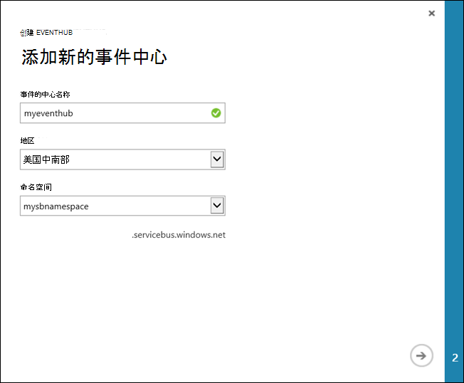

    > [AZURE.NOTE] 作为减少反应时间和成本的 HDInsight 您 Apache 触发的群集，则应选择相同的**位置**。

3. 在**配置事件中心**屏幕上，输入**分区计数**和**邮件保留**的值，然后单击复选标记。 对于此示例，使用 10 分区计数和 1 的消息保留。 请注意分区计数，因为您以后将需要此值。

    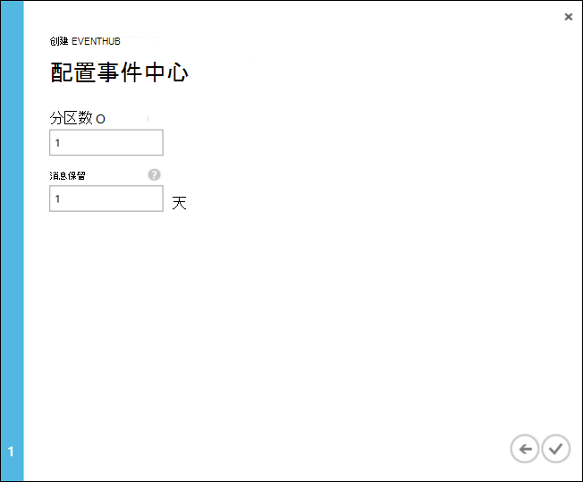

4. 单击创建事件中心，单击**配置**，然后创建两个事件中心的访问策略。

    <table>
    <tr><th>名称</th><th>权限</th></tr>
    <tr><td>mysendpolicy</td><td>发送</td></tr>
    <tr><td>myreceivepolicy</td><td>侦听</td></tr>
    </table>

    您创建的权限后，选择页面底部的**保存**图标。 这将创建将用于发送 (**mysendpolicy**) 和侦听此事件中心 (**myreceivepolicy**) 的共享的访问策略。

    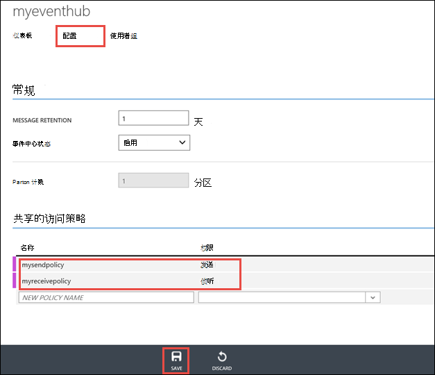

    
5. 在同一页上，记下生成的两个策略的策略密钥。 保存这些键，因为它们将稍后使用。

    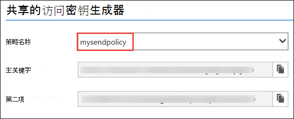

6. 在**仪表板**页面上，从底部来检索和保存连接字符串，以事件中心使用两种策略中单击**连接信息**。

    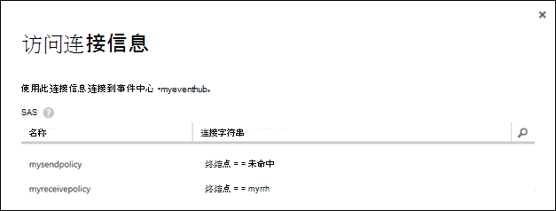

## Scala 应用程序用于将消息发送到事件中心

在这一节中使用独立本地 Scala 应用程序要发送到您在上一步中创建的 Azure 事件中心的事件流。 此应用程序是在[https://github.com/hdinsight/eventhubs-sample-event-producer](https://github.com/hdinsight/eventhubs-sample-event-producer)在 GitHub 上可用。 此处的步骤假设您具有已分叉此 GitHub 资料库。

1. 打开应用程序时， **EventhubsSampleEventProducer**，IntelliJ 的想法。
    
2. 生成项目。 从**生成**菜单中，单击**生成项目**。 在**\out\artifacts**中创建输出 jar。

>[AZURE.TIP] 您可以使用 IntelliJ 的想法中可用的选项直接从 GitHub 存储库中创建该项目。 若要了解如何使用该方法，请以指导下一节中使用的说明。 请注意，大量的下一节中介绍的步骤也不会适用于 Scala 应用您在此步骤中创建的。 例如︰

> * 您不需要更新以包括触发版本 POM。 这是因为没有任何依赖项上触发创建此应用程序
> * 您不需要将一些依赖关系的 jar 添加到项目库。 这是因为这些 jar 则不需要此项目。

## 更新 Scala 流用于接收事件的应用程序

[Https://github.com/hdinsight/spark-streaming-data-persistence-examples](https://github.com/hdinsight/spark-streaming-data-persistence-examples)提供了一个示例 Scala 应用程序以接收事件并将其路由到不同的目的地。 请按照下面的步骤来更新应用程序并创建输出 jar。

1. 启动 IntelliJ 的想法，并从启动屏幕中，选择**从版本控制中签出**，然后单击**Git**。
        
    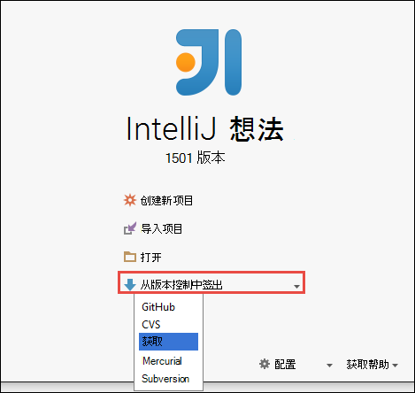

2. 在**克隆存储库**对话框中，提供要克隆的指定要克隆到的目录，然后单击**克隆**到 Git 存储库的 URL。

    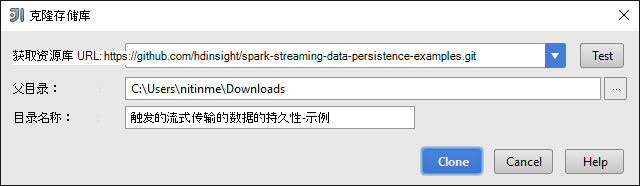

    
3. 直到完全复制项目，请按照提示进行操作。 按下**Alt + 1**以打开**项目视图**。 它应如下所示。

    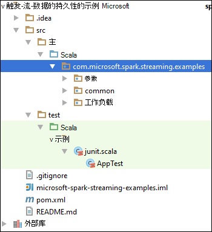
    
4. 请确保用 Java8 进行编译的应用程序代码。 要确保这一点，单击**文件**，单击**项目结构**，在**项目**选项卡，确保项目语言级别设置为**8-lambda 时，类型批注等**。

    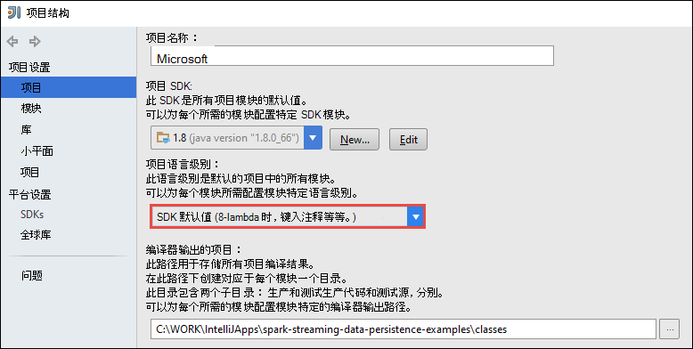

5. 打开**pom.xml**并确保触发版本正确。 在下 <properties> 节点，查找以下代码片断并验证触发版本。

        <scala.version>2.10.4</scala.version>
        <scala.compat.version>2.10.4</scala.compat.version>
        <scala.binary.version>2.10</scala.binary.version>
        <spark.version>1.6.2</spark.version>
    
5. 应用程序需要两个依赖关系的 jar:

    * **EventHub 接收器 jar**。 这是必需的触发事件中心从接收消息。 若要使用此 jar，更新**pom.xml**添加下`<dependencies>`。

            <dependency>
              <groupId>com.microsoft.azure</groupId>
              <artifactId>spark-streaming-eventhubs_2.10</artifactId>
              <version>1.6.0</version>
            </dependency> 

    * **JDBC 驱动程序 jar**。 这是写到 SQL Azure 数据库从事件中心接收到的邮件所必需的。 您可以下载 v4.1 或从[此处](https://msdn.microsoft.com/sqlserver/aa937724.aspx)该 jar 文件的更新版本。 在项目库中添加引用此 jar。 执行以下步骤︰

        1. 从 IntelliJ 的想法从中获得应用程序打开，单击**文件**窗口、**项目结构**，请单击，然后单击**库**。 
        
        2. 单击添加图标 ()，单击**Java**，然后导航到下载的 JDBC 驱动程序 jar 的位置。 按照提示将 jar 文件添加到项目库。

            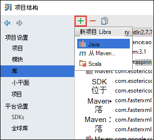

        3. 单击**应用**。

6. 创建输出 jar 文件。 执行以下步骤。
    1. 在**项目结构**对话框中，单击**项目**，然后单击加号。 弹出的对话框中，从**jar/文件夹**，请单击，再单击**从模块依赖关系**。

        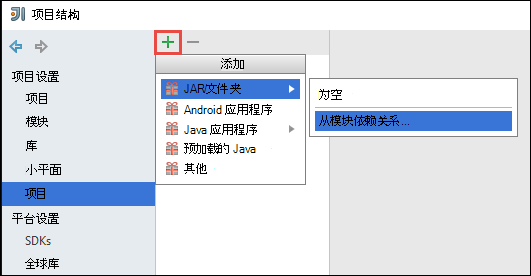

    1. 在**创建 JAR 从模块**对话框中，单击省略号 () 对**主类**。

    1. 在**选择主类**对话框中，选择任意可用的类，然后单击**确定**。

        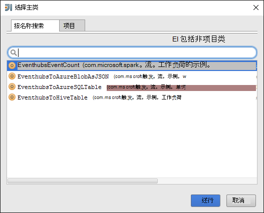

    1. 在**创建 JAR 从模块**对话框中，确保选中选项**解压缩到 JAR 的目标**，然后单击**确定**。 此命令创建一个 JAR 的所有依赖项。

        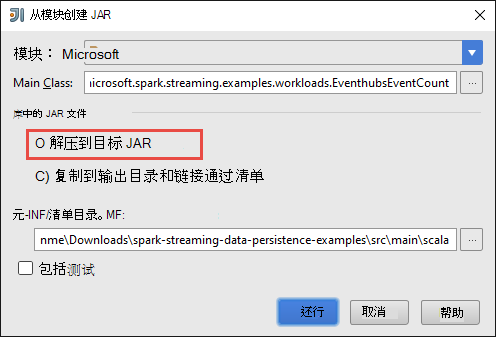

    1. **输出布局**选项卡列出了 Maven 项目中包括的所有 jar。 您可以选择并删除其上的 Scala 应用程序没有直接相关性。 我们将在此处创建的应用程序，您可以删除除最后一个 （**microsoft 的触发-流-示例编译输出**）。 选择删除，然后单击**删除**图标 jar ()。

        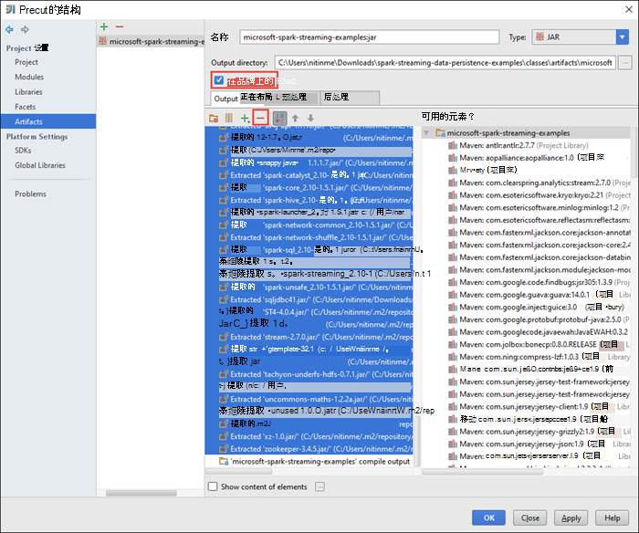

        请确保**在品牌上建立**框被选中，这可确保每次生成或更新项目时创建的 jar。 **应用**单击然后单击**确定**。

    1. 在**输出布局**选项卡，右底部的**可用元素**框中，您可以到项目库前面添加 SQL JDBC jar。 您必须添加此**输出布局**选项卡。 Jar 文件中，用鼠标右键单击，然后单击**提取到输出根**。

        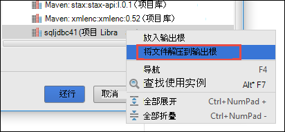  

        **输出布局**选项卡现在应该如下所示。

        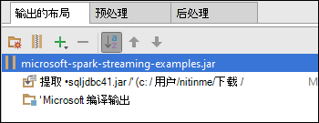     

        在**项目结构**对话框中，单击**应用**，然后单击**确定**。 

    1. 从菜单栏中，单击**生成**，然后单击**生成项目**。 您还可以单击**生成项目**以创建 jar。 在**\out\artifacts**中创建输出 jar。

        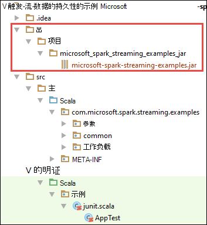

## 远程使用晚触发群集上运行的应用程序

我们将使用晚远程触发群集上运行的流的应用程序。 如何使用 HDInsight 触发群集晚的详细讨论，请参阅[在 Azure HDInsight Apache 触发群集远程提交作业](hdinsight-apache-spark-livy-rest-interface.md)。 您可以开始运行之前流事件有使用触发远程作业是几个您应该做的事︰

1. 启动本地独立应用程序来生成事件并发送到事件中心。 使用下面的命令来执行此操作︰

        java -cp EventhubsSampleEventProducer.jar com.microsoft.eventhubs.client.example.EventhubsClientDriver --eventhubs-namespace "mysbnamespace" --eventhubs-name "myeventhub" --policy-name "mysendpolicy" --policy-key "<policy key>" --message-length 32 --thread-count 32 --message-count -1

2. 将流罐 (**microsoft 的触发-流-examples.jar**) 复制到与群集相关的 Azure Blob 存储。 这使得 jar 访问到晚。 [**AzCopy**](../storage/storage-use-azcopy.md)，一种命令行实用工具，可用于执行此操作。 有很多的其他客户端，您可以使用上载数据。 您可以找到更多的关于它们在[Hadoop 作业中 HDInsight 的数据上载](hdinsight-upload-data.md)。

3. 如果正在运行这些应用程序的计算机上安装卷曲。 我们使用 CURL 来调用远程运行这些作业的晚终结点。

### 运行应用程序以接收事件到 Azure 存储 Blob 以文本形式

打开命令提示窗口，定位到的目录在安装卷曲，运行以下命令 （更换用户名/密码和群集名称）︰

    curl -k --user "admin:mypassword1!" -v -H "Content-Type: application/json" -X POST --data @C:\Temp\inputBlob.txt "https://mysparkcluster.azurehdinsight.net/livy/batches"

在**inputBlob.txt**文件中的参数定义如下︰

    { "file":"wasbs:///example/jars/microsoft-spark-streaming-examples.jar", "className":"com.microsoft.spark.streaming.examples.workloads.EventhubsEventCount", "args":["--eventhubs-namespace", "mysbnamespace", "--eventhubs-name", "myeventhub", "--policy-name", "myreceivepolicy", "--policy-key", "<put-your-key-here>", "--consumer-group", "$default", "--partition-count", 10, "--batch-interval-in-seconds", 20, "--checkpoint-directory", "/EventCheckpoint", "--event-count-folder", "/EventCount/EventCount10"], "numExecutors":20, "executorMemory":"1G", "executorCores":1, "driverMemory":"2G" }

让我们了解什么是输入文件中的参数︰

* **文件**是在 Azure 存储帐户与群集相关应用程序 jar 文件的路径。
* **类名**是装进瓶中的类的名称。
* **参数**是类所需的参数列表
* **numExecutors**是由触发运行流应用程序的内核数。 这应该始终是至少两次事件中心的分区数。
* **executorMemory**， **executorCores**， **driverMemory**是用来将所需的资源分配给流的应用程序的参数。

>[AZURE.NOTE] 您不需要创建用作参数的输出文件夹 （EventCheckpoint、 EventCount/EventCount10）。 流的应用程序为您创建它们。
    
当您运行命令时，您应该看到类似于下面的输出︰

    < HTTP/1.1 201 Created
    < Content-Type: application/json; charset=UTF-8
    < Location: /18
    < Server: Microsoft-IIS/8.5
    < X-Powered-By: ARR/2.5
    < X-Powered-By: ASP.NET
    < Date: Tue, 01 Dec 2015 05:39:10 GMT
    < Content-Length: 37
    <
    {"id":1,"state":"starting","log":[]}* Connection #0 to host mysparkcluster.azurehdinsight.net left intact

记下 （在此示例中为"1"） 的输出的最后一行中的批次 ID。 要验证应用程序成功运行，您可以查看您与群集相关的 Azure 存储帐户，您应该看到在此处创建的**/EventCount/EventCount10**文件夹。 该文件夹应包含 blob 捕获指定参数**批处理秒时间间隔**的时间段内处理的事件数。

应用程序将继续运行，直到您终止它。 为此，请使用下面的命令︰

    curl -k --user "admin:mypassword1!" -v -X DELETE "https://mysparkcluster.azurehdinsight.net/livy/batches/1"

### 运行应用程序接收到 Azure 存储 Blob json 格式事件

打开命令提示窗口，定位到的目录在安装卷曲，运行以下命令 （更换用户名/密码和群集名称）︰

    curl -k --user "admin:mypassword1!" -v -H "Content-Type: application/json" -X POST --data @C:\Temp\inputJSON.txt "https://mysparkcluster.azurehdinsight.net/livy/batches"

在**inputJSON.txt**文件中的参数定义如下︰

    { "file":"wasbs:///example/jars/microsoft-spark-streaming-examples.jar", "className":"com.microsoft.spark.streaming.examples.workloads.EventhubsToAzureBlobAsJSON", "args":["--eventhubs-namespace", "mysbnamespace", "--eventhubs-name", "myeventhub", "--policy-name", "myreceivepolicy", "--policy-key", "<put-your-key-here>", "--consumer-group", "$default", "--partition-count", 10, "--batch-interval-in-seconds", 20, "--checkpoint-directory", "/EventCheckpoint", "--event-count-folder", "/EventCount/EventCount10", "--event-store-folder", "/EventStore10"], "numExecutors":20, "executorMemory":"1G", "executorCores":1, "driverMemory":"2G" }

参数是类似于文本输出，在上一步中指定的。 同样，您不需要创建用作参数的输出文件夹 （EventCheckpoint、 EventCount/EventCount10）。 流的应用程序为您创建它们。

 运行该命令后，您可以看一下您与群集相关的 Azure 存储帐户，您应该看到在此处创建的**/EventStore10**文件夹。 打开任何文件前缀与**部件，而**您应该看到处理 JSON 格式的事件。

### 运行应用程序来配置单元表中接收事件

若要运行的应用程序传输到配置单元表事件需要一些附加组件。 它们是︰

* datanucleus api jdo 3.2.6.jar
* datanucleus-rdbms-3.2.9.jar
* --3.2.10.jar datanucleus 核心
* 配置单元 site.xml

**.Jar**文件位于 HDInsight 触发群集在`/usr/hdp/current/spark-client/lib`。 **配置单元 site.xml**网址为`/usr/hdp/current/spark-client/conf`。

可以使用[WinScp](http://winscp.net/eng/download.php)来复制这些文件从群集到本地计算机。 然后可以使用工具来将这些文件复制到您与群集相关的存储帐户。 有关如何将文件上载到的存储帐户的详细信息，请参阅[HDInsight 中的 Hadoop 作业的数据上载](hdinsight-upload-data.md)。

复制后的文件到 Azure 存储帐户，打开命令提示窗口、 导航到安装卷曲，目录并运行下面的命令 （更换用户名/密码和群集名称）︰

    curl -k --user "admin:mypassword1!" -v -H "Content-Type: application/json" -X POST --data @C:\Temp\inputHive.txt "https://mysparkcluster.azurehdinsight.net/livy/batches"

在**inputHive.txt**文件中的参数定义如下︰

    { "file":"wasbs:///example/jars/microsoft-spark-streaming-examples.jar", "className":"com.microsoft.spark.streaming.examples.workloads.EventhubsToHiveTable", "args":["--eventhubs-namespace", "mysbnamespace", "--eventhubs-name", "myeventhub", "--policy-name", "myreceivepolicy", "--policy-key", "<put-your-key-here>", "--consumer-group", "$default", "--partition-count", 10, "--batch-interval-in-seconds", 20, "--checkpoint-directory", "/EventCheckpoint", "--event-count-folder", "/EventCount/EventCount10", "--event-hive-table", "EventHiveTable10" ], "jars":["wasbs:///example/jars/datanucleus-api-jdo-3.2.6.jar", "wasbs:///example/jars/datanucleus-rdbms-3.2.9.jar", "wasbs:///example/jars/datanucleus-core-3.2.10.jar"], "files":["wasbs:///example/jars/hive-site.xml"], "numExecutors":20, "executorMemory":"1G", "executorCores":1, "driverMemory":"2G" }

参数是类似于文本输出，前面的步骤中指定的。 同样，您不需要创建的输出文件夹 （EventCheckpoint、 EventCount/EventCount10） 或输出用作参数的配置单元表 (EventHiveTable10)。 流的应用程序为您创建它们。 请注意， **jar**和**文件**选项包括的.jar 文件和您复制到存储帐户配置单元 site.xml 的路径。

若要验证已成功创建配置单元表，您可以 SSH 到群集和运行配置单元查询。 有关说明，请参阅[使用配置单元与 Hadoop 使用 SSH 的 HDInsight 中](hdinsight-hadoop-use-hive-ssh.md)。 一旦使用 SSH 连接，您可以运行以下命令来验证已创建配置单元表， **EventHiveTable10**。

    show tables;

您应该看到类似于下面的输出︰

    OK
    eventhivetable10
    hivesampletable

您还可以运行 SELECT 查询以查看表的内容。

    SELECT * FROM eventhivetable10 LIMIT 10;

您应该看到类似于下面的输出︰

    ZN90apUSQODDTx7n6Toh6jDbuPngqT4c
    sor2M7xsFwmaRW8W8NDwMneFNMrOVkW1
    o2HcsU735ejSi2bGEcbUSB4btCFmI1lW
    TLuibq4rbj0T9st9eEzIWJwNGtMWYoYS
    HKCpPlWFWAJILwR69MAq863nCWYzDEw6
    Mvx0GQOPYvPR7ezBEpIHYKTKiEhYammQ
    85dRppSBSbZgThLr1s0GMgKqynDUqudr
    5LAWkNqorLj3ZN9a2mfWr9rZqeXKN4pF
    ulf9wSFNjD7BZXCyunozecov9QpEIYmJ
    vWzM3nvOja8DhYcwn0n5eTfOItZ966pa
    Time taken: 4.434 seconds, Fetched: 10 row(s)

### 运行应用程序以接收到 SQL Azure 数据库表中的事件

在运行此步骤之前, 请确保您具有创建 SQL Azure 数据库。 您需要值的数据库名称、 数据库服务器名称和数据库管理员凭据作为参数。 您不需要通过创建数据库表。 流的应用程序创建的。

打开命令提示窗口，定位到的目录在安装卷曲，运行以下命令︰

    curl -k --user "admin:mypassword1!" -v -H "Content-Type: application/json" -X POST --data @C:\Temp\inputSQL.txt "https://mysparkcluster.azurehdinsight.net/livy/batches"

在**inputSQL.txt**文件中的参数定义如下︰

    { "file":"wasbs:///example/jars/microsoft-spark-streaming-examples.jar", "className":"com.microsoft.spark.streaming.examples.workloads.EventhubsToAzureSQLTable", "args":["--eventhubs-namespace", "mysbnamespace", "--eventhubs-name", "myeventhub", "--policy-name", "myreceivepolicy", "--policy-key", "<put-your-key-here>", "--consumer-group", "$default", "--partition-count", 10, "--batch-interval-in-seconds", 20, "--checkpoint-directory", "/EventCheckpoint", "--event-count-folder", "/EventCount/EventCount10", "--sql-server-fqdn", "<database-server-name>.database.windows.net", "--sql-database-name", "mysparkdatabase", "--database-username", "sparkdbadmin", "--database-password", "<put-password-here>", "--event-sql-table", "EventContent" ], "numExecutors":20, "executorMemory":"1G", "executorCores":1, "driverMemory":"2G" }

要验证应用程序成功运行，您可以连接到 SQL Azure 数据库使用 SQL Server 管理 Studio。 有关如何执行此操作的说明，请参阅[连接到 SQL 数据库与 SQL Server 管理 Studio](../sql-database/sql-database-connect-query-ssms.md)。 一旦您连接到数据库，您可以导航到由流应用程序创建的**EventContent**表中。 您可以运行一个快速的查询，以从表中获取数据。 运行下面的查询︰

    SELECT * FROM EventCount

您应该看到类似于下面的输出︰

    00046b0f-2552-4980-9c3f-8bba5647c8ee
    000b7530-12f9-4081-8e19-90acd26f9c0c
    000bc521-9c1b-4a42-ab08-dc1893b83f3b
    00123a2a-e00d-496a-9104-108920955718
    0017c68f-7a4e-452d-97ad-5cb1fe5ba81b
    001KsmqL2gfu5ZcuQuTqTxQvVyGCqPp9
    001vIZgOStka4DXtud0e3tX7XbfMnZrN
    00220586-3e1a-4d2d-a89b-05c5892e541a
    0029e309-9e54-4e1b-84be-cd04e6fce5ec
    003333cf-874f-4045-9da3-9f98c2b4ea49
    0043c07e-8d73-420a-9af7-1fcb94575356
    004a11a9-0c2c-4bc0-a7d5-2e0ebd947ab9

    
## 请参见

* [概述︰ 在 Azure HDInsight 上的 Apache 触发](hdinsight-apache-spark-overview.md)

### 方案

* [触发与 BI︰ 执行与 BI 工具一起使用在 HDInsight 中的触发交互式数据分析](hdinsight-apache-spark-use-bi-tools.md)

* [机器学习与触发︰ 用于分析使用 HVAC 数据的生成温度 HDInsight 中使用触发](hdinsight-apache-spark-ipython-notebook-machine-learning.md)

* [机器学习与触发︰ 使用 HDInsight 来预测食品检查结果中的触发](hdinsight-apache-spark-machine-learning-mllib-ipython.md)

* [在 HDInsight 中使用触发网站日志分析](hdinsight-apache-spark-custom-library-website-log-analysis.md)

### 创建和运行应用程序

* [创建独立的应用程序使用 Scala](hdinsight-apache-spark-create-standalone-application.md)

* [在群集上使用晚触发远程运行作业](hdinsight-apache-spark-livy-rest-interface.md)

### 工具和扩展

* [使用 HDInsight 工具插件为 IntelliJ 创意来创建和提交触发 Scala applicatons](hdinsight-apache-spark-intellij-tool-plugin.md)

* [使用 HDInsight 工具插件为 IntelliJ 创意来触发应用程序进行远程调试](hdinsight-apache-spark-intellij-tool-plugin-debug-jobs-remotely.md)

* [在 HDInsight 上触发群集使用 Zeppelin 笔记本](hdinsight-apache-spark-use-zeppelin-notebook.md)

* [内核可用于触发 HDInsight 群集中的 Jupyter 笔记本](hdinsight-apache-spark-jupyter-notebook-kernels.md)

* [外部包使用 Jupyter 笔记本](hdinsight-apache-spark-jupyter-notebook-use-external-packages.md)

* [在您的计算机上安装 Jupyter 并连接到一个 HDInsight 触发的群集](hdinsight-apache-spark-jupyter-notebook-install-locally.md)

### 管理资源

* [管理在 Azure HDInsight Apache 触发群集的资源](hdinsight-apache-spark-resource-manager.md)

* [跟踪和调试 HDInsight 在 Apache 触发群集上运行的作业](hdinsight-apache-spark-job-debugging.md)

[hdinsight-versions]: hdinsight-component-versioning.md
[hdinsight-upload-data]: hdinsight-upload-data.md
[hdinsight-storage]: hdinsight-hadoop-use-blob-storage.md

[azure-purchase-options]: http://azure.microsoft.com/pricing/purchase-options/
[azure-member-offers]: http://azure.microsoft.com/pricing/member-offers/
[azure-free-trial]: http://azure.microsoft.com/pricing/free-trial/
[azure-management-portal]: https://manage.windowsazure.com/
[azure-create-storageaccount]: ../storage-create-storage-account/ 
